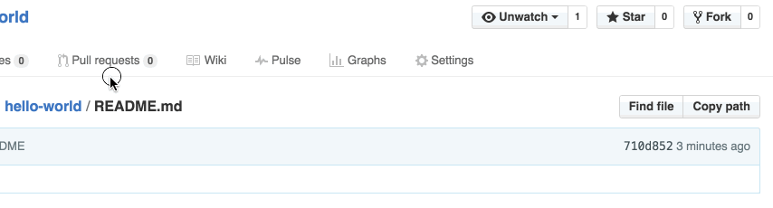
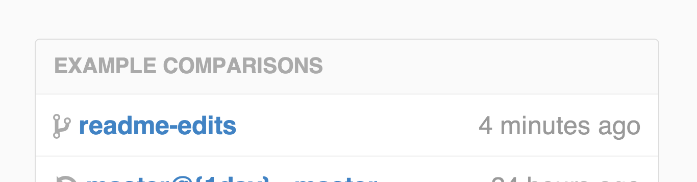
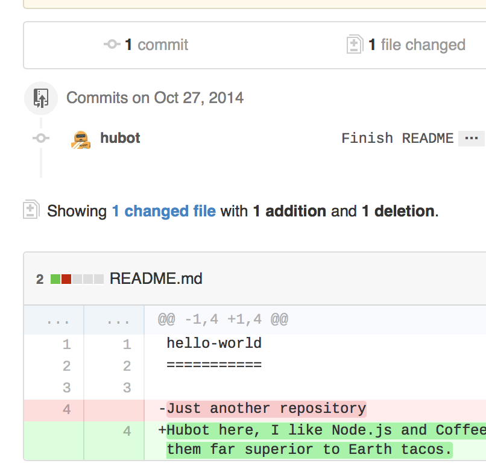

# [Hello World](https://guides.github.com/activities/hello-world/)

The **Hello World** project is a time-honored tradition in computer programming. It is a simple exercise that gets you started when learning something new. Let’s get started with GitHub!

**You’ll learn how to:**

- Create and use a repository
- Start and manage a new branch
- Make changes to a file and push them to GitHub as commits
- Open and merge a pull request

## What is GitHub?

GitHub is a code hosting platform for version control and collaboration. It lets you and others work together on projects from anywhere.

This tutorial teaches you GitHub essentials like *repositories*, *branches*, *commits*, and *Pull Requests*. You’ll create your own Hello World repository and learn GitHub’s Pull Request workflow, a popular way to create and review code.

#### No coding necessary

To complete this tutorial, you need a [GitHub.com account](http://github.com/) and Internet access. You don’t need to know how to code, use the command line, or install Git (the version control software GitHub is built on).

> **Tip:** Open this guide in a separate browser window (or tab) so you can see it while you complete the steps in the tutorial.

## Step 1. Create a Repository

A **repository** is usually used to organize a single project. Repositories can contain folders and files, images, videos, spreadsheets, and data sets – anything your project needs. We recommend including a *README*, or a file with information about your project. GitHub makes it easy to add one at the same time you create your new repository. *It also offers other common options such as a license file.*

Your `hello-world` repository can be a place where you store ideas, resources, or even share and discuss things with others.

### To create a new repository

1. In the upper right corner, next to your avatar or identicon, click  and then select **New repository**.
2. Name your repository `hello-world`.
3. Write a short description.
4. Select **Initialize this repository with a README**.

Click **Create repository**. 

## Step 2. Create a Branch

**Branching** is the way to work on different versions of a repository at one time.

By default your repository has one branch named `master` which is considered to be the definitive branch. We use branches to experiment and make edits before committing them to `master`.

When you create a branch off the `master` branch, you’re making a copy, or snapshot, of `master` as it was at that point in time. If someone else made changes to the `master` branch while you were working on your branch, you could pull in those updates.

This diagram shows:

- The `master` branch
- A new branch called `feature` (because we’re doing ‘feature work’ on this branch)
- The journey that `feature` takes before it’s merged into `master`

Have you ever saved different versions of a file? Something like:

- `story.txt`
- `story-joe-edit.txt`
- `story-joe-edit-reviewed.txt`

Branches accomplish similar goals in GitHub repositories.

Here at GitHub, our developers, writers, and designers use branches for keeping bug fixes and feature work separate from our `master` (production) branch. When a change is ready, they merge their branch into `master`.

### To create a new branch

1. Go to your new repository `hello-world`.
2. Click the drop down at the top of the file list that says **branch: master**.
3. Type a branch name, `readme-edits`, into the new branch text box.
4. Select the blue **Create branch** box or hit “Enter” on your keyboard.

Now you have two branches, `master` and `readme-edits`. They look exactly the same, but not for long! Next we’ll add our changes to the new branch.

## Step 3. Make and commit changes

Bravo! Now, you’re on the code view for your `readme-edits` branch, which is a copy of `master`. Let’s make some edits.

On GitHub, saved changes are called *commits*. Each commit has an associated *commit message*, which is a description explaining why a particular change was made. Commit messages capture the history of your changes, so other contributors can understand what you’ve done and why.

#### Make and commit changes

1. Click the `README.md` file.
2. Click the  pencil icon in the upper right corner of the file view to edit.
3. In the editor, write a bit about yourself.
4. Write a commit message that describes your changes.
5. Click **Commit changes** button.

These changes will be made to just the README file on your `readme-edits`branch, so now this branch contains content that’s different from `master`.

## Step 4. Open a Pull Request

Nice edits! Now that you have changes in a branch off of `master`, you can open a *pull request*.

Pull Requests are the heart of collaboration on GitHub. When you open a *pull request*, you’re proposing your changes and requesting that someone review and pull in your contribution and merge them into their branch. Pull requests show *diffs*, or differences, of the content from both branches. The changes, additions, and subtractions are shown in green and red.

As soon as you make a commit, you can open a pull request and start a discussion, even before the code is finished.

By using GitHub’s [@mention system](https://help.github.com/articles/about-writing-and-formatting-on-github/#text-formatting-toolbar) in your pull request message, you can ask for feedback from specific people or teams, whether they’re down the hall or 10 time zones away.

You can even open pull requests in your own repository and merge them yourself. It’s a great way to learn the GitHub flow before working on larger projects.

#### Open a Pull Request for changes to the README

*Click on the image for a larger version*

| Step                                                         | Screenshot                                                   |
| ------------------------------------------------------------ | ------------------------------------------------------------ |
| Click the  **Pull Request** tab, then from the Pull Request page, click the green **New pull request** button. |  |
| In the **Example Comparisons** box, select the branch you made, `readme-edits`, to compare with `master` (the original). |  |
| Look over your changes in the diffs on the Compare page, make sure they’re what you want to submit. |  |
| When you’re satisfied that these are the changes you want to submit, click the big green **Create Pull Request**button. |  |
| Give your pull request a title and write a brief description of your changes. |  |

When you’re done with your message, click **Create pull request**!

------

> **Tip**: You can use [emoji](https://help.github.com/articles/basic-writing-and-formatting-syntax/#using-emoji) and [drag and drop images and gifs](https://help.github.com/articles/file-attachments-on-issues-and-pull-requests/) onto comments and Pull Requests.

## Step 5. Merge your Pull Request

In this final step, it’s time to bring your changes together – merging your `readme-edits` branch into the `master` branch.

1. Click the green **Merge pull request** button to merge the changes into `master`.
2. Click **Confirm merge**.
3. Go ahead and delete the branch, since its changes have been incorporated, with the **Delete branch** button in the purple box.

### Celebrate!

By completing this tutorial, you’ve learned to create a project and make a pull request on GitHub!   

Here’s what you accomplished in this tutorial:

- Created an open source repository
- Started and managed a new branch
- Changed a file and committed those changes to GitHub
- Opened and merged a Pull Request

Take a look at your GitHub profile and you’ll see your new [contribution squares](https://help.github.com/articles/viewing-contributions)!

To learn more about the power of Pull Requests, we recommend reading the [GitHub flow Guide](http://guides.github.com/overviews/flow/). You might also visit [GitHub Explore](http://github.com/explore) and get involved in an Open Source project 

------

> **Tip**: Check out our other [Guides](http://guides.github.com/), [YouTube Channel](http://youtube.com/githubguides) and [On-Demand Training](https://services.github.com/on-demand/) for more on how to get started with GitHub.

Last updated April 7, 2016

该**的Hello World**项目是计算机编程历史悠久的传统。这是一个简单的练习，可以让你在学习新东西时开始学习。让我们开始使用GitHub！

**您将学习如何：**

- 创建和使用存储库
- 启动并管理新分支
- 对文件进行更改并将其作为提交推送到GitHub
- 打开并合并拉取请求

## 什么是GitHub？

GitHub是用于版本控制和协作的代码托管平台。它可以让您和其他人在任何地方协同工作。

本教程教您GitHub基本知识，如*存储库*，*分支*，*提交*和*Pull请求*。您将创建自己的Hello World存储库并学习GitHub的Pull Request工作流，这是一种创建和检查代码的流行方法。

#### 无需编码

要完成本教程，您需要[GitHub.com帐户](http://github.com/)和Internet访问权限。您不需要知道如何编码，使用命令行或安装Git（基于版本控制软件GitHub）。

> **提示：**在单独的浏览器窗口（或选项卡）中打开本指南，以便在完成本教程中的步骤时看到它。

## 步骤1.创建存储库

一个**库**通常用于举办单个项目。存储库可以包含文件夹和文件，图像，视频，电子表格和数据集 - 您的项目需要的任何内容。我们建议包括*README*或包含项目信息的文件。GitHub可以在创建新存储库的同时轻松添加一个。*它还提供其他常见选项，例如许可证文件。*

您的`hello-world`存储库可以是存储想法，资源甚至与他人共享和讨论事物的地方。

### 创建新存储库

1. 在右上角，在您的头像或identicon旁边，单击 然后选择**New repository**。
2. 命名您的存储库`hello-world`。
3. 写一个简短的描述。
4. 选择**使用自述文件初始化此存储库**。

单击**创建存储库**。

## 第2步。创建一个分支

**分支**是一次处理不同版本的存储库的方法。

默认情况下，您的存储库有一个名为branch的分支`master`，该分支被认为是权威分支。我们使用分支进行实验并在提交之前进行编辑`master`。

当您在分支机构上创建分支时`master`，您正在制作该`master`时间点的副本或快照。如果其他人`master`在您的分支机构上工作时对分支进行了更改，则可以提取这些更新。

该图显示：

- 该`master`分支
- 一个叫做的新分支`feature`（因为我们在这个分支上做'特色工作'）
- `feature`它融入之前的旅程`master`

你有没有保存过不同版本的文件？就像是：

- `story.txt`
- `story-joe-edit.txt`
- `story-joe-edit-reviewed.txt`

分支机构在GitHub存储库中实现了类似的目标。

在GitHub，我们的开发人员，编写人员和设计人员使用分支来保持错误修复和功能工作与我们的`master`（生产）分支分开。当更改准备就绪时，他们将其分支合并到`master`。

### 创建一个新分支

1. 转到新的存储库`hello-world`。
2. 单击文件列表顶部的下拉列表**：master：master**。
3. `readme-edits`在新分支文本框中键入分支名称。
4. 选择蓝色的**创建分支**框或按键盘上的“Enter”。

现在你有两个分支，`master`和`readme-edits`。它们看起来完全一样，但不会很久！接下来，我们将更改添加到新分支。

## 第3步。制作并提交更改

好样的！现在，您在`readme-edits`分支的代码视图中，这是一个副本`master`。我们来做一些编辑。

在GitHub上，保存的更改称为*提交*。每个提交都有一个关联的*提交消息*，这是一个解释为什么进行特定更改的描述。提交消息可捕获更改的历史记录，因此其他贡献者可以了解您已完成的操作以及原因。

#### 制作并提交更改

1. 单击该`README.md`文件。
2. 点击  要编辑的文件视图右上角的铅笔图标。
3. 在编辑器中，写一点关于你自己。
4. 编写描述更改的提交消息。
5. 单击**提交更改**按钮。

这些更改将仅对`readme-edits`分支上的README文件进行，因此现在此分支包含的内容与之不同`master`。

## 步骤4.打开Pull请求

很好的编辑！现在您的分支中有更改`master`，您可以打开*拉取请求*。

Pull Requests是GitHub上合作的核心。当您打开*拉取请求时*，您提出了更改并请求某人审核并提取您的贡献并将其合并到他们的分支中。拉请求显示来自两个分支的内容的*差异*或差异。更改，添加和减少以绿色和红色显示。

提交后，即使在代码完成之前，您也可以打开拉取请求并开始讨论。

通过在拉取请求消息中使用GitHub的[@mention系统](https://help.github.com/articles/about-writing-and-formatting-on-github/#text-formatting-toolbar)，您可以询问特定人员或团队的反馈，无论他们是在大厅还是10个时区之外。

您甚至可以在自己的存储库中打开pull请求并自行合并。在开展大型项目之前，这是学习GitHub流程的好方法。

#### 打开Pull Request以更改README

*点击图像查看大图*

| 步                                                           | 截图                                                         |
| ------------------------------------------------------------ | ------------------------------------------------------------ |
| 点击  **“拉取请求”**选项卡，然后从“拉取请求”页面中，单击绿色“ **新拉”请求**按钮。 |  |
| 在“ **示例比较”**框中，选择您创建的分支`readme-edits`，以与`master`（原始）进行比较。 |  |
| 在比较页面上查看差异中的差异，确保它们是您要提交的内容。     |  |
| 如果您对要提交的更改感到满意，请单击绿色的“**创建拉取请求”**按钮。 |  |
| 为您的拉取请求提供标题，并写下您的更改的简要说明。           |  |

完成邮件后，单击“ **创建拉取请求”**！

------

> **提示**：您可以使用[的表情符号](https://help.github.com/articles/basic-writing-and-formatting-syntax/#using-emoji)和[拖放图片和GIF](https://help.github.com/articles/file-attachments-on-issues-and-pull-requests/)到的意见和引入请求。

## 步骤5.合并您的Pull请求

在最后一步中，是时候将您的更改结合在一起 - 将您的`readme-edits`分支合并到`master`分支中。

1. 单击绿色**合并拉取请求**按钮以将更改合并到`master`。
2. 单击**确认合并**。
3. 继续删除分支，因为它的更改已合并，紫色框中的**删除分支**按钮。

### 庆祝！

通过完成本教程，您已经学会了创建一个项目并在GitHub上发出拉取请求！  

以下是您在本教程中完成的内容：

- 创建了一个开源存储库
- 开始并管理一个新的分支
- 更改了文件并将这些更改提交给GitHub
- 打开并合并了一个Pull Request

看看你的GitHub个人资料，你会看到你的新[贡献正方形](https://help.github.com/articles/viewing-contributions)！

要了解有关Pull请求功能的更多信息，我们建议您阅读[GitHub流程指南](http://guides.github.com/overviews/flow/)。您也可以访问[GitHub Explore](http://github.com/explore)并参与开源项目

------

> **提示**：查看我们的其他[指南](http://guides.github.com/)，[YouTube频道](http://youtube.com/githubguides)和[按需培训](https://services.github.com/on-demand/)，了解有关如何开始使用GitHub的更多信息。

最后更新于2016年4月7日