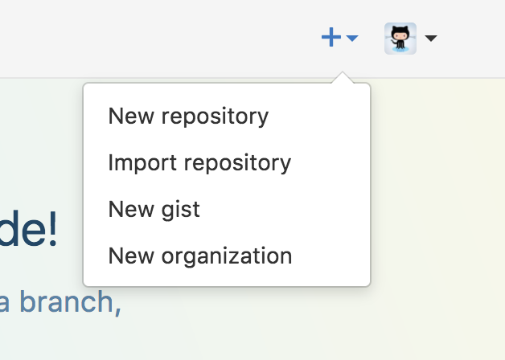
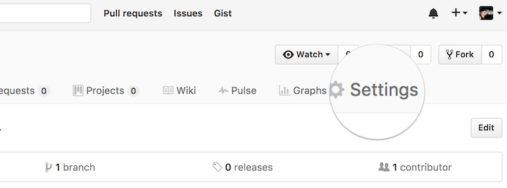
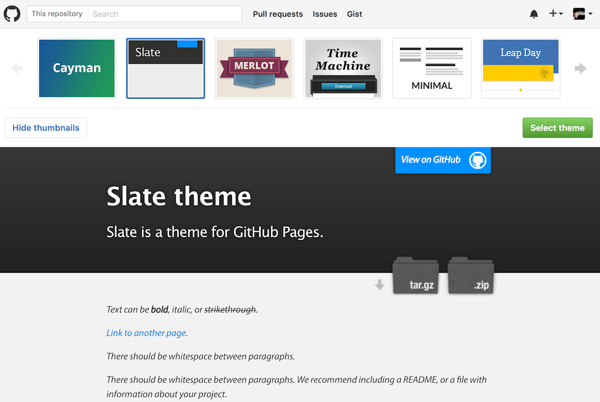
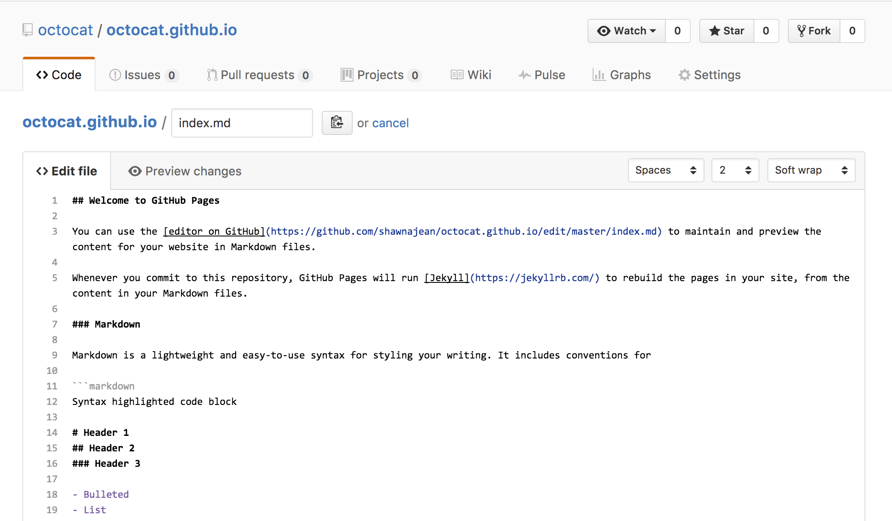
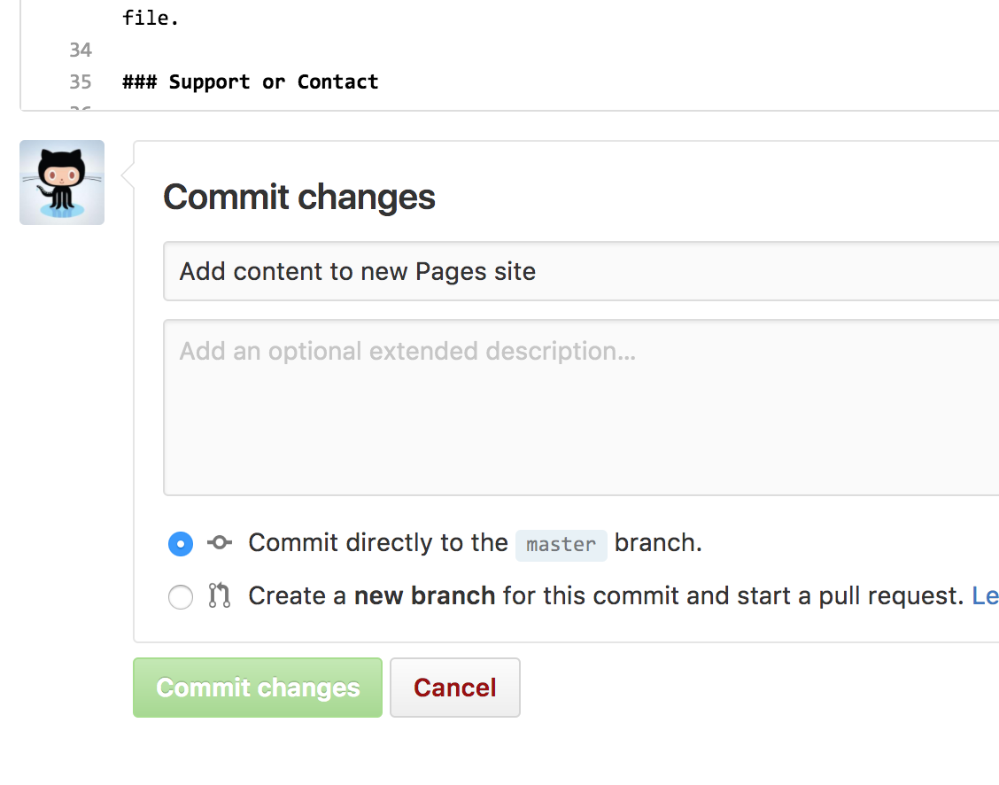
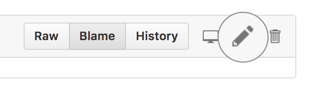
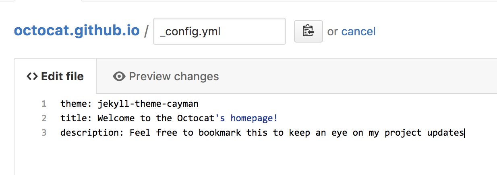
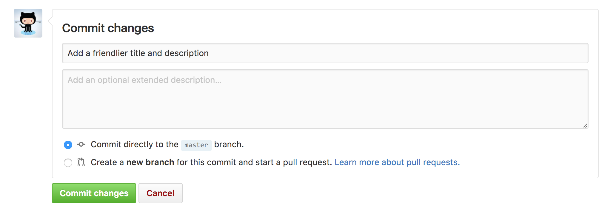

# [Getting Started with GitHub Pages](https://guides.github.com/features/pages/)

GitHub Pages are public webpages hosted and easily published through GitHub. The quickest way to get up and running is by using the Jekyll Theme Chooser to load a pre-made theme. You can then modify your GitHub Pages’ content and style remotely via the web or locally on your computer.

## Create Your Website

Once you’ve [signed in](https://github.com/login), you’ll create a new repository to get started.

On the new repository screen, you need to give this repository a special name to generate your website.

Your website’s files will live in a repository named `username.github.io`(where “username” is your actual GitHub user name). To begin setting up your site, you have to open the Settings tab

If you scroll down on the settings page, you’ll see the **GitHub Pages** section near the bottom. Click the **Choose a theme** button to start the process of creating your site.

Once you’ve clicked the button, you’ll be directed to the Theme Chooser. You’ll see several theme options in a carousel across the top of the page. Click on the images to preview the themes. Once you’ve selected one, click **Select theme** on the right to move on. It’s easy to change your theme later, so if you’re not sure, just choose one for now.

Here’s where you’ll write your own content (You can keep the default content for now, if you’d like).

Once you’re finished editing, scroll down to the bottom of the page and click **Commit changes**.

GitHub does all the work to direct visitors to `username.github.io` to view your new website. This can take up to 10 minutes. After some time has passed, you can open a new tab in your browser to go to your site!

## Making Changes

One of the first things you can do is remove the default title of your index page, and add a friendlier message to it. Since this is a very quick change – and your first one – you’re going to make it on the default branch: `master`.

View the `_config.yml` file by navigating to it in the **Code** tab. You can edit the file by clicking on the pencil icon.

Currently your site has no set title, so we’re falling back to the name of the repo. To change this, I’m going to add the line “title: Welcome to the Octocat’s homepage!” to this file. Feel free to do the same, except for your own username.

Under this title, you can add a message about the purpose of the page and describe what you want people to do while they’re here. I’m going set mine to “Feel free to bookmark this to keep an eye on my project updates”

After you’re done making this small change, scroll to the bottom of the page to make your second commit. You have two places to write about this change: a subject and an extended description. The extended description is optional, so let’s leave a descriptive message in the subject.

When you’re done, click **Commit changes** and your updates will go live in just a few seconds!

## Next Steps

Just because you’ve made some changes into your project doesn’t mean you should stop! Check out these other guides to learn how to contribute to other projects or perfect the way you work on projects:

- [GitHub flow](https://guides.github.com/introduction/flow)
- [Contributing to Open Source](https://guides.github.com/activities/contributing-to-open-source/)
- [Mastering Markdown](https://guides.github.com/features/mastering-markdown/)