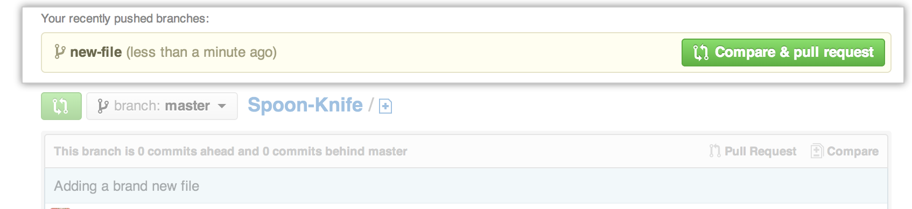
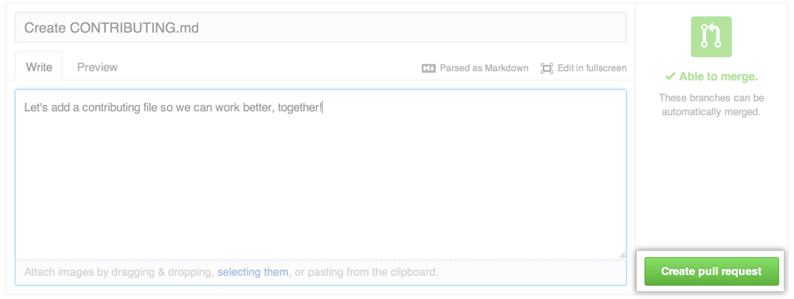

# [Forking Projects](https://guides.github.com/activities/forking/)

 4 minute read

After using GitHub by yourself for a while, you may find yourself wanting to contribute to someone else’s project. Or maybe you’d like to use someone’s project as the starting point for your own. This process is known as *forking.*

Creating a “fork” is producing a personal copy of someone else’s project. Forks act as a sort of bridge between the original repository and your personal copy. You can submit *Pull Requests* to help make other people’s projects better by offering your changes up to the original project. Forking is at the core of social coding at GitHub.

For this tutorial, we’ll be using [the Spoon-Knife project](https://github.com/octocat/Spoon-Knife), a test repository that’s hosted on GitHub.com that lets you test the Pull Request workflow.

## Fork the repository

To fork the Spoon-Knife repository, click the **Fork** button in the header of the repository.

Sit back and watch the forking magic. When it’s finished, you’ll be taken to your copy of the Spoon-Knife repository.

## Clone your fork

You’ve successfully forked the Spoon-Knife repository, but so far, it only exists on GitHub. To be able to work on the project, you will need to clone it to your computer.

If you’re using [GitHub Desktop](https://desktop.github.com/), this process is a breeze. On your fork of Spoon-Knife, navigate over to the right hand side bar and click **Clone or Download**. How you clone is up to you. Some options are [cloning with the command line](https://services.github.com/on-demand/github-cli/clone-repo-cli), or by [using GitHub Desktop](https://services.github.com/on-demand/github-desktop/clone-repository-github-desktop).

## Making and pushing changes

Go ahead and make a few changes to the project using your favorite text editor, like [Atom](https://atom.io/). You could, for example, change the text in *index.html* to add your GitHub username.

When you’re ready to submit your changes, **stage** and **commit** your changes.

> Is staging and committing changes locally too advanced right now? [Check out this on-demand training](https://services.github.com/on-demand/) for interactive tutorials to help you learn more.

Right now, you’ve essentially told Git, “Okay, I’ve taken a snapshot of my changes!” You can continue to make more changes, and take more commit snapshots. When you’re ready to push your changes up to GitHub.com, push your changes to the remote.

## Making a Pull Request

At last, you’re ready to propose changes into the main project! This is the final step in producing a fork of someone else’s project, and arguably the most important. If you’ve made a change that you feel would benefit the community as a whole, you should definitely consider contributing back.

To do so, head on over to the repository on GitHub.com where your project lives. For this example, it would be at `https://www.github.com/<your_username>/Spoon-Knife`. You’ll see a banner indicating that you’ve recently pushed a new branch, and that you can submit this branch “upstream,” to the original repository:

Clicking on **Compare and Pull Request** sends you to a discussion page, where you can enter a title and optional description. It’s important to provide as much useful information and a rationale for *why* you’re making this Pull Request in the first place. The project owner needs to be able to determine whether your change is as useful to everyone as you think it is.

When you’re ready typing out your heartfelt argument, click on **Send pull request**. You’re done!

Pull Requests are an area for discussion. In this case, the Octocat is very busy, and probably won’t merge your changes. For other projects, don’t be offended if the project owner rejects your Pull Request, or asks for more information on why it’s been made. It may even be that the project owner chooses not to merge your pull request, and that’s totally okay. Your copy will exist in infamy on the Internet. And who knows–maybe someone you’ve never met will find your changes much more valuable than the original project. Share and share alike!

## Huzzah!

You’ve successfully forked and contributed back to a repository. Go forth, and contribute some more!