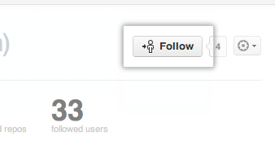
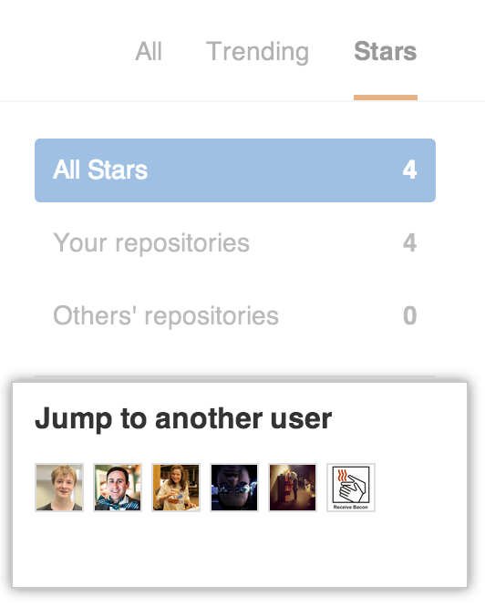

#[ Be Social](https://guides.github.com/activities/socialize/)

 5 minute read

With more and more people joining GitHub and adding projects every day, keeping up with all of them can be difficult. However, this can be fun and easy by following users or watching repositories, simply showing interest in them by starring, or using Explore to find new people and projects.

## Follow a Friend

One of the great features on GitHub is the ability to see what other people are working on and who they are connecting with. When you follow someone, you’ll get notifications about their GitHub activity. Following friends helps you find new projects and new people that you may share interests with. You can see what some of your friends are interested in by looking at your [personal dashboard](https://github.com/dashboard) or you can check out what’s going on in the GitHub community by looking at [the Explore page](https://github.com/explore).

### Step 1: Pick a friend.

Why not follow one of these cool people from GitHub:

**cheshire137**

**charliesome**

**benbalter**

**jeffrafter**

**muan**

**pifafu**

### Step 2: Follow that friend

Once you are on someone’s profile, click the “follow” button.

Congratulations! You are now following a friend.

## Watch a Project’s Repository

At some point you may want to stay up-to-date with a specific project. This is similar to following a person, except the focus is narrowed to only events in the project’s repository. You can choose to have notifications for this repository sent via email or viewable on the web by [configuring your settings](https://github.com/settings/notifications). Typical notifications would be comments on a Pull Request or an issue, or just a comment anywhere within the repository.

Our friend the Octocat has a repository called [Hello World](https://github.com/octocat/Hello-World) that we’d like to watch.

Once you are on the repository page, you will notice there is a “watch” button at the top of the page. Click on it.

Congratulations! You are now watching the Hello World repository. If the Octocat updates it, you will see what happened in your dashboard or receive a notification.

## More Things You Can Do

You’ve done some of the most basic social interaction GitHub has to offer, but don’t stop there! Check out these other social features:

#### Stargazing

If you’re interested in some of the repositories your friends have starred in the past, but you no longer see it on your dashboard, head over to your [stars page](https://github.com/stars)and jump to another user!

#### Discover Repositories

After you’ve watched, followed, and starred your favorite people and repositories on GitHub, head over to your [Discover Repositories](https://github.com/dashboard/discover) page to see personalized repository recommendations based on these things!

#### Explore / Newsletter

The Explore page has repositories that have been starred by people you follow, GitHub staff, and general trending repositories right on the first page.

If you want to receive these as a newsletter daily, weekly, or monthly, check out the newsletter announcement at the bottom of the Explore page.

You can also configure this setting later at [the subscription page](https://github.com/explore/subscribe).

If you want to view just trending repositories and users, [head over to Trending](https://github.com/trending)and take a look.

## Celebrate

Congratulations! You are quite the socialite. Check out some of these next steps:

- [Getting your project on GitHub](https://help.github.com/categories/importing-your-projects-to-github/)
- [Fork A Repository](https://guides.github.com/activities/forking/)

Last updated May 17, 2018