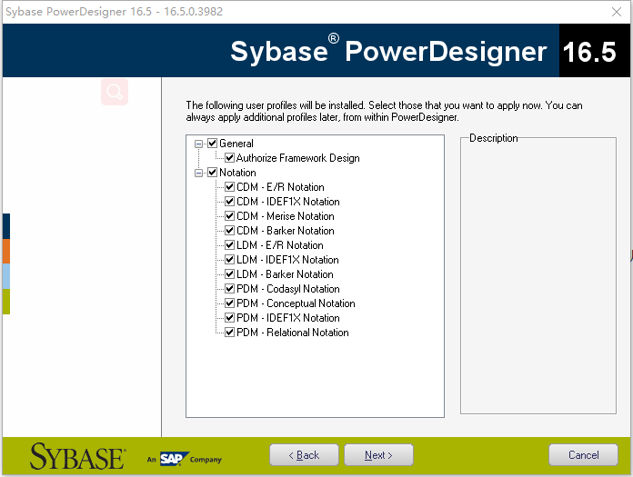

# PowerDesigner安装教程

软件版本：Sybase PowerDesigner 16.5

 **准备工作：**

需要下载以下3个文件，我直接把下面3个文件放到百度网盘中。如有失效，请留言或直接联系我！

1、PowerDesigner.exe：安装文件

2、pdflm16.dll：破解文件

3、PowerDesigner汉化文件

 **下载地址：**

1、安装文件 链接: <https://pan.baidu.com/s/1jIIgeZ8> 密码: spk4

2、破解文件 链接: <https://pan.baidu.com/s/1jIIgeZO> 密码: 24xv

3、汉化文件 链接: [https://pan.baidu.com/s/1pLA4siv ](https://pan.baidu.com/s/1pLA4siv)密码: eaji

 

## PowerDesigner安装图文教程：

 

1、解压PowerDesigner安装文件，并双击PowerDesigner.exe；

2、欢迎来到PowerDesigner安装界面，点击 Next

3、选择Trial，再点击Next，不要选择其它，这一步如果选择错，后面破解是不行的。

4、选择Hong Kong，点击I AGREE，再点击Next；

5、选择一个安装目录，默认是安装在C盘。再点击Next；

6、点击勾选General和Notaion，再点击Next；这里很多可能不懂，不懂你全选就不会出错了。

 

7、直接点击Next；进入正在安装界面

8、点击Finish（安装完成）

## PowerDesigner破解步骤：

1、将PowerDesigner破解文件解压，然后你能看到一个“pdflm16.dll”文件；

2、将“pdflm16.dll”复制并覆盖到你软件安装的目录中。一定要是此软件的安装根目录；

 

## PowerDesigner汉化步骤：

1、将PowerDesigner汉化文件解压，然后你能看到很多文件；

2、Ctrl+A（全选）所有文件，复制并覆盖到你软件安装的目录中；

3、如果点击PdShell16.exe不能正常启动，请点击pdlegacyshell16.exe启动；

