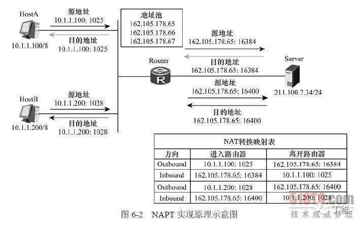

# 可以实现内网穿透的几款工具

最近没什么事情，看了一些关于内网穿透的文章，因我本身已是做微信开发相关的工作，对这部分关注的比较多，现分享给大家。

首先说下内网穿透的原理。

# NAPT原理

在NAT网关上会有一张映射表，表上记录了内网向公网哪个IP和端口发起了请求，然后如果内网有主机向公网设备发起了请求，内网主机的请求数据包传输到了NAT网关上，那么NAT网关会修改该数据包的源IP地址和源端口为NAT网关自身的IP地址和任意一个不冲突的自身未使用的端口，并且把这个修改记录到那张映射表上。最后把修改之后的数据包发送到请求的目标主机，等目标主机发回了响应包之后，再根据响应包里面的目的IP地址和目的端口去映射表里面找到该转发给哪个内网主机。这样就实现了内网主机在没有公网IP的情况下，通过NAPT技术借助路由器唯一的一个公网IP来访问公网设备。 具体原理参照下图：

更加具体的原理性介绍可以看下这篇文档：[【技巧】内网穿透工具的原理与开发实战](https://www.sohu.com/a/201964268_743147)

# 我了解的内网穿透工具

- Ngrok
- Natapp
- 小米球
- Sunny-Ngrok
- echosite
- Ssh、autossh
- Lanproxy
- Spike
- frp
- fcn
- 花生壳

前5个都是基于国外的[ngrok](https://ngrok.com/)来进行二次开发的。

# 1、Ngrok

[ngrok](https://ngrok.com/) 是一个反向代理，通过在公共端点和本地运行的 Web 服务器之间建立一个安全的通道，实现内网主机的服务可以暴露给外网。ngrok 可捕获和分析所有通道上的流量，便于后期分析和重放，所以ngrok可以很方便地协助服务端程序测试。

参考博客：[10分钟教你搭建自己的ngrok服务器](https://blog.csdn.net/yjc_1111/article/details/79353718)

# 2、Natapp

[natapp](https://ngrok.com/)是 基于ngrok的国内收费内网穿透工具，类似花生壳，有免费版本，比花生壳好。免费版本：提供http,https,tcp全隧道穿透，随机域名/TCP端口，不定时强制更换域名/端口，自定义本地端口

参考文章：[NATAPP1分钟快速新手图文教程](https://natapp.cn/article/natapp_newbie)

# 3、小米球

[小米球](http://ngrok.ciqiuwl.cn/)是基于ngrok二次开发的内网穿透工具，支持多协议、多隧道、多端口同时映射(http、https、tcp等等...)，同时支持多种系统win、linux、linux_arm、mac等。具体的使用直接参考官网。

# 4、Sunny-Ngrok

[Sunny-Ngrok](https://www.ngrok.cc/)同样是ngrok二次开发的内网穿透工具，支持http,https协议，同时支持更丰富的系统和语言：linux、win、mac、openwrt、 python、php等。

教程：[Sunny-Ngrok使用教程](https://www.ngrok.cc/_book/)

# 5、echosite

[echosite](https://echosite.2bdata.com/)同样ngrok二次开发的内网穿透工具，支持多种协议，以前是全部免费的，现在推出了收费版和免费版，可根据自己的需要去选择。

参考教程：[EchoSite---让内网穿透变得简单](https://blog.csdn.net/interesting0303/article/details/81098603)

# 6、Ssh、autossh

ssh 配合[autossh](http://www.harding.motd.ca/autossh/)工具使用，因为autossh会容错，自动重新启动SSH会话和隧道。autossh是一个程序，用于启动ssh的副本并进行监控，在死亡或停止传输流量时根据需要重新启动它。 这个想法来自rstunnel（Reliable SSH Tunnel），但是在C中实现。作者的观点是，它不像匆匆忙忙的工作那么容易。使用端口转发环路或远程回显服务进行连接监视。在遇到连接拒绝等快速故障时，关闭连接尝试的速度。在OpenBSD，Linux，Solaris，Mac OS X，Cygwin和AIX上编译和测试; 应该在其他BSD上工作。免费软件。

使用教程：[SSH内网穿透](https://yangqiang.im/?p=698)

# 7、Lanproxy

[lanproxy](https://github.com/ffay/lanproxy)是一个将局域网个人电脑、服务器代理到公网的内网穿透工具，目前仅支持tcp流量转发，可支持任何tcp上层协议（访问内网网站、本地支付接口调试、ssh访问、远程桌面...）。目前市面上提供类似服务的有花生壳、TeamView、GoToMyCloud等等，但要使用第三方的公网服务器就必须为第三方付费，并且这些服务都有各种各样的限制，此外，由于数据包会流经第三方，因此对数据安全也是一大隐患。

参考教程：[业余草推荐一款局域网（内网）穿透工具lanproxy](https://blog.csdn.net/xmtblog/article/details/77943159)

# 8、Spike

[Spike](https://github.com/slince/spike)是一个可以用来将你的内网服务暴露在公网的快速的反向代理，基于ReactPHP，采用IO多路复用模型。采用Php实现。

参考教程：[使用 PHP 实现的的内网穿透工具 “Spike”](https://segmentfault.com/q/1010000009955702)

# 9、Frp

[frp](https://github.com/fatedier/frp) 是一个可用于内网穿透的高性能的反向代理应用，支持 tcp, udp, http, https 协议。利用处于内网或防火墙后的机器，对外网环境提供 http 或 https 服务。对于 http, https 服务支持基于域名的虚拟主机，支持自定义域名绑定，使多个域名可以共用一个80端口。利用处于内网或防火墙后的机器，对外网环境提供 tcp 和 udp 服务，例如在家里通过 ssh 访问处于公司内网环境内的主机。

教程：[一款很好用的内网穿透工具--FRP](https://www.jianshu.com/p/00c79df1aaf0)、[使用frp实现内网穿透](https://sunnyrx.com/2016/10/21/simple-to-use-frp/)

# 10、Fcn

[FCN](https://github.com/boywhp/fcn)[free connect]是一款傻瓜式的一键接入私有网络的工具, fcn利用公共服务器以及数据加密技术实现：在免公网IP环境下，在任意联网机器上透明接入服务端所在局域网网段。支持多种系统，有免费版和付费版。

教程：[内网穿透工具FCN介绍](http://www.sohu.com/a/202331135_449548)

上面便是我所知道的内网穿透工具，其中ngrok相关的我基本都用过还有frp，都差不多。大部分都可以免费去使用，但是我不建议大家把这些免费的穿透工具去放到比较重要的云服务器中去使用，容易被攻击。我的小伙伴，开始你的穿透之旅吧。

