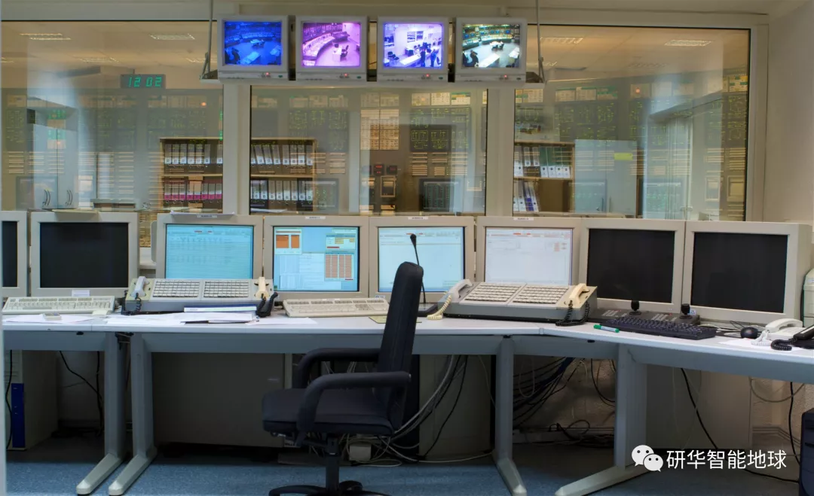

## 工业互联网平台 || 中小型企业如何踏上智能运维新台阶？康达能源迈出关键一步

原创： 小A君 [研华智能地球](javascript:void(0);) *4月25日*

**研华工业互联网平台【WISE-PaaS】专题**

回顾上篇→[**360℃拆解研华工业****WISE-PaaS**](http://mp.weixin.qq.com/s?__biz=MzAwNDE5ODI5NQ==&mid=2658801552&idx=1&sn=24fa71f66db15a8d000fad39eee77e49&chksm=80a12d68b7d6a47e8e09c1a421bc3e1f6d098cb21b38debb3f6ac192a98abfb90a4680119794&scene=21#wechat_redirect)

之前，小A都是从技术层面，为大家介绍研华WISE-PaaS 物智联软件平台为系统整合商、制造业、传统产业、各领域市场提供的关键核心软件服务。

有小伙伴们反馈，想要了解研华工业互联网平台WISE-PaaS的应用案例。

今天就为大家带来~

工业制造作为物联网领域重点青睐、又十分难啃的一块骨头，经过多年的数字化进程，已取得了一定的成果，工业物联网、智能制造等概念也逐渐在制造业内转化落地。

然而，对于我国中小型制造企业而言，完整的物联网解决方案固然高大上，从业者们仍面临着**层次不齐的技术基础、纷繁复杂的接入类型、高度定制化的实际需求**等棘手现状。

这些问题在我国重型制造业领域，表现的尤为明显，如广州康达能源，其脱身于广州机电工程有限公司，产品涵盖了能源、电力、环保、节能等几个核心领域，尤其以大型发电机组为重点代表。

#### **▌▌ 万里长征第一步，始于企业自身诉求**

康达能源作为传统的中小型制造商，其发电机组等产品本身不具备较高的智能化程度，因此，在向智能制造和工业物联网融合的进化之路上，它需要克服重重关卡。

首先，处于恶劣而不稳定环境中的大量发动机设备，必须能正常接入网络协议，进而才能实现数据的采集与分析； 其次，因电力能源行业对稳定的特别需求，发电机组等设备的统一管理须基于强大的数据处理体系——不仅具备安全的云服务和大数据挖掘能力，还需在边缘侧有敏捷的分析和决策能力；此外，在实现上述方面的基础上，传统设备制造商的定位也有望发生转型和拓展，即从单纯的设备研发、生产与销售，转而侧重于设备所提供的服务，从而开创新的商业模式，实现企业整体的数字化转型升级，从制造向服务蜕变。

#### **▌▌ 对症下药：量身定制物联网解决方案**

**如何全面监测、便捷管理、实时调控大量的发电机组等设备，是康达能源急需解决的重要课题。**

如果说康达能源代表了一批中小型传统制造商的核心难题，为了满足这类市场需求，切实深入中小型企业的生产模式才有望提出合理的转型方案。

已在工控领域拥有丰富经验的研华，又延伸了其在**边缘智能**领域的实力，因此，面对康达能源从设备接入到统一管理再到数据挖掘的多重诉求，研华通过边缘智能与云服务相结合的方式，为其量身打造了切实可行的物联网解决方案。

#### **▌▌ 传统优势：海量接入，互联互通**

面对传统工业设备“铁疙瘩”难接入的问题，研华接入的设备类型多样、海量，支持丰富的接入协议。在康达能源这个项目中，设备的接入量约在15000-16000左右，数据的采集、监测等均已投入稳定运行中，远程运维迈出了最坚实的第一步。

#### **▌▌ 赋予设备自身“智商”：边缘侧升级，运维**

在万物互联时代的风口，万物产生的数据洪流就像一把双刃剑，它既是价值的载体，又会对企业有限的存储、计算、运行等云资源带来巨大的负担。因此，边缘智能应运而生，它不仅分流了繁重的云端重任，还提供了更为安全和隐私的数据形态，更为某些对数据及时性处理要求极高的领域提供新思路。

电力能源行业正属于第三种需求，发电机组设备一旦出现故障将对城市的供电系统产生重大损失。因此，电力设备（如发电机组）的远程运维就尤为重要，它对通信的稳定性、数据的精准性和安全性都有着极高的要求。

那么，**如何在恶劣危险的外部环境下，提供灵敏而稳定的边缘智能解决方案**，对于康达能源的设备管理及其客户的具体应用而言，都是提升价值的集中体现。

研华认为，这些挑战正是其边缘智能网关的优势所在：

首先，为了能在恶劣的物理环境中仍能保持高性能计算和稳定通讯，研华边缘智能系列网关在工业设计和芯片设计方面下足了功夫。它不仅满足极高的工业防护等级，且在通信方面，增强抗电磁及物理环境能力强。另外，其插拔式的接口满足了弹性的通信需求，利于降低功耗。计算方面，它的可扩展性强，提供多接口和串口，对于算力的节省不言而喻。

其次，想要实现康达能源的发电机组产品在投入不同的使用场景时，均有丰富的工业物联网生态与之匹配，开放的生态建设是必然的。研华边缘智能系列网关采用Linux架构，具备较高开放性，对于生态拓展具备天然优势。如在软件层面，目前打通的合作伙伴包括百度天工大、阿里云等，丰富的云服务选择和行业应用将助力其客户更好挖掘数据价值。

另外，在网络攻击肆虐的当下，高可靠性的安全解决方案守护的是设备数据，背后保护的则是客户的数据主权和商业价值。研华边缘智能系列网关兼备高安全性，通过安全认证和安全白名单等机制，为设备数据提供全方位的安全防护，让整个远程运维都处于安全的环境之下。

**在研华设备接入方案和边缘网关服务的助力下，康达能源基本实现了对传统发电机组产品的数据采集和“智能化改造”，为整体远程运维的效率提升了重要一环。**

研华认为，未来远程运维的趋势将是边云融合，完整的物联网解决方案离不开云平台对数据的存储、分析、挖掘等功能的支持。

对于云平台的选择，研华选择借助合作伙伴平台，共同为康达能源提供云服务。

同时，研华的WISE-PaaS云平台专注于探索OT与IT技术融合、不同类型云平台的打通，经过初步的建设，已基本构建了较为完整的物联网云平台生态。

未来，如康达能源所在的平台，亦可能实现与WISE-PaaS的无缝接入、能力互通。产业生态是企业萌芽的土壤，企业应用是生态良性循环的助力，双方的合作将成为中小型企业融入工业物联网大生态的尝试，也是最终汇入智能制造愿景的涓涓细流。

**延伸阅读**

[● 今年，研华要干一件大事](http://mp.weixin.qq.com/s?__biz=MzAwNDE5ODI5NQ==&mid=2658801564&idx=1&sn=edd5057a46780f24d834dff6aa263f69&chksm=80a12d64b7d6a472cec1b0ea14b0a8dfed045e8522570109305c4698b5a98428f32e6b7c61c7&scene=21#wechat_redirect)

[● 工业互联网平台 || 360°拆解研华WISE-PaaS（第一弹）](http://mp.weixin.qq.com/s?__biz=MzAwNDE5ODI5NQ==&mid=2658801507&idx=1&sn=552dbe5fa3c007f65afca087c40f3108&chksm=80a12d9bb7d6a48d04e9e943d1b1ac1afd092429b77500054881e7c4befc38eb9de0eb098474&scene=21#wechat_redirect)

[● 工业互联网平台 || 360°拆解研华WISE-PaaS（第二弹）](http://mp.weixin.qq.com/s?__biz=MzAwNDE5ODI5NQ==&mid=2658801552&idx=1&sn=24fa71f66db15a8d000fad39eee77e49&chksm=80a12d68b7d6a47e8e09c1a421bc3e1f6d098cb21b38debb3f6ac192a98abfb90a4680119794&scene=21#wechat_redirect)