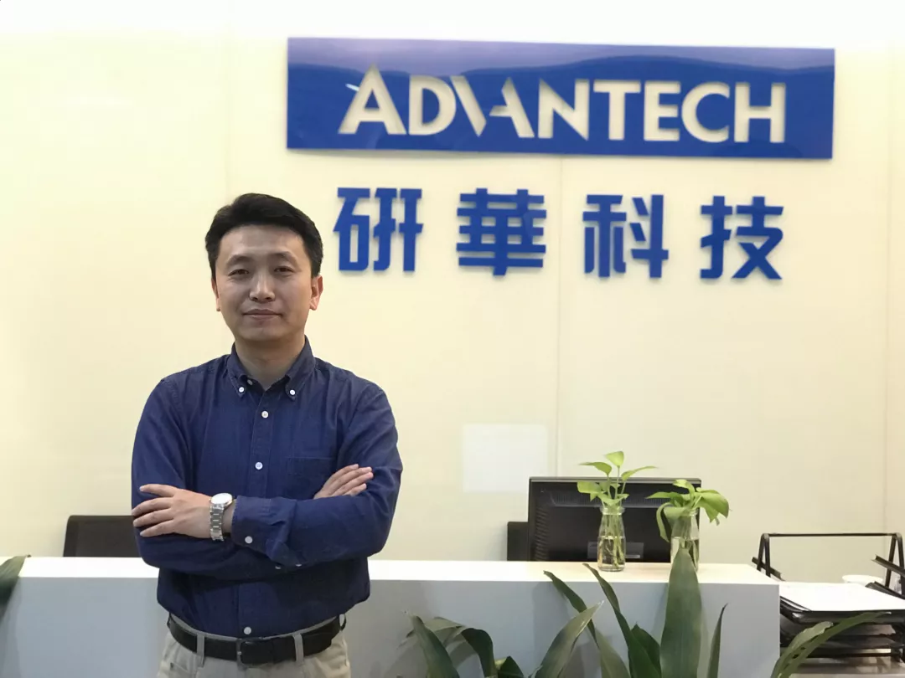

# 专访 || 研华工业互联网平台WISE-PaaS干货分享

赵亚楠 [研华智能地球](javascript:void(0);) *5月4日*

工业互联网平台是面向制造业数字化、网络化、智能化需求，构建基于海量数据采集、汇聚、分析的服务体系，支撑制造资源泛在连接、弹性供给、高效配置的工业云平台，包括边缘、平台（工业 PaaS）、应用三大核心层级。

> 工业互联网正在全球刮起一股飓风，作为新一代信息技术 与先进制造业深度融合所形成的 新兴业态与应用模式，随着政策利好以及产业链发力开始扬帆起航。
>
> 作为工业互联网的三大要素之一，工业互联网平台是工业全要素链接的枢纽，是工业资源配置的核心，各大巨头都在发挥各自优势，搭建自己的工业互联网平台。
>
> 研华也不例外，于2015年正式推出了工业互联网平台 WISE-PaaS。

## **用OT优势打造工业云平台**

​    

工业互联网平台是面向制造 业数字化、网络化、智能化需求， 构建基于海量数据采集、汇聚、分析的服务体系，支撑制造资源泛在连接、弹性供给、高效配置的工业云平台，包括边缘、平台（工业PaaS）、应用三大核心层级。在工业互联网平台功能架构 中， PaaS平台是最重要的部分。

在工业4. 0和《中国制造2025》的加持下，工业云平台这个赛道不断吸引着跃跃欲试的新入局者，如何提高自身平台的竞争力和业内话语权已经迫在眉睫。

然而，云技术发展的时间并不长，目前各公司在云技术上的差别不大。

（研华物联网行业开发经理 鞠剑）

研华科技物联网行业开发经理鞠剑谈道：“落实到工业云上，不同公司最大的差别在于对最终客户需求的理解程度不同。很多工业云平台是IT公司在运营，他们需要补充大量OT的知识， 但OT并没有像IT 那么标准，信息碎片化非常严重。相反这部分是研华的优势，作为全球嵌入式计算和物联网技术领导厂商，研华凭借30多年在自动化领域的深耕，数据采集和传输的产品已经有1万多个型号，可以满足不同业务领域的需求。”

## **WISE-PaaS ** **平台融合产业合作**

工业是一个集大成的名词，其中包含了诸多细分领域，而不同的领域对应的生产流程、商业模式可能千差万别，因此，同为“工业云平台”的名字，不同的云平台所提供的服务和思路也许截然不同。

鞠剑表示，对于研华而言，建立WISE-PaaS 的初衷是推动物联网生态体系的融合，建立一个产业 链上下游都能融入的平台，可能包含了晶片厂商、软件、系统集成商等。将研华自身较强的硬件平台导入物联网产业环境中。

而在物联网应用拓展的新领域， 研华更倾向于采用**合作共赢**的思路，WISE-PaaS这个平台正是将物联网战略落地的重要一步。在这样的部署中，研华主要面向工业企业客户，并连同软件、 算法、应用开发等提供商合作伙伴共同完成WISE- PaaS平台的建设，使客户可进一步在线上快速选购与整合物联网软件/云端解决方案，以达到简化及弹性部署云服务的目的。

为了探索WISE-PaaS合理的商业模式，研华也发起了WISE-PaaS Alliance联盟作为上下游生态之城。研华提供的联盟成员物联网开发体验套件，将 WISE-PaaS的相关原始码以Open API的格式开放 给联盟内的所有成员，共同谋求工业云平台的丰富和壮大。

## **安全建设为工业云平台保驾护航**

制造业是立国之本，《中国制造2025》中提出要加快推动新一代信息技术与制造技术融合发展，国家也在不断推动互联网与制造业融合，提升制造业数字化、网络化、智能化水平。在此背景下，信息 安全风险将是“互联网+制造业”发展过程中越来越 需要重视的问题。

“在工业云平台领域，安全是其建设最重要的关键点。很多工业系统在设计之初，没有考虑过联网，所以原系统内部对网络安全的防范很差，或者说根本就没有考虑这个风险。如操作系统漏洞、应用漏洞、弱密码等问题广泛存在，并且很多系统内部，相对古老的DOS、Win95、WinXP操作系统还在大量运行，这些都是安全漏洞风险。这也说明， 在数据采集的时候，并不是安装1台数据网关这么简单，研华的方案一定都是有安全控制的，同时研华的工业云方案是比较灵活可迁移的，公有云、私有云、混合云，都可以采用。” 鞠剑十分笃定地说。

**“ 数据采集是基础 ， 工业PaaS是核心 ， 工业App是关键  。”** 

在最新发布的《工业互联网平台白皮书（2017）》中，鞠剑认为这几句话描述工业互联网平台是比较准确的。

“研华在工业互联网上的发展，是自下而上的。在强大的数据采集和传输基础上，发展工业PaaS平台，让下层设备的数据可以更完整、更可靠地传到云平台上。研华在工业App的开发方面希望可以和广大系统集成商、软件开发 商进行‘共创’式合作，但不会直接参与进来。” 研华期待通过与上、下游合作伙伴的跨界融合，推动WISE-PaaS平台的完善和发展，从而助力中国工业企业的智能转型。

> Tips
>
> **WISE-PaaS 物智联软件平台**
>
>
>
> 研华作为物联网智能系统与嵌入式平台产业的全球领导厂商，为迎接物联网、大数据与人工智能的市场趋势，提出以Edge Intelligence WISE PaaS为核心的云-网-端全方位物联网解决方案，来协助伙伴客户串接产业链。
>
>
>
> WISE-PaaS物智联软件平台为系统整合商、制造业、传统产业、各领域市场提供关键核心软件服务，包含从**设备联网与无线感测整合的EdgeSense**、**视频与多媒体影像分析的VideoSense**、**数据采集与可视化的WebAccess**及**云服务平台的EnSaaS**，未来将携手合作伙伴持续推出更多样化软件与云服务，来推动实体产业数字化转型，加速实践产业智能化。

点击下方“阅读全文”了解更多研华工业互联网平台WISE-PaaS

[阅读原文](https://mp.weixin.qq.com/s/RkJ2KfLS25YKDLrjSfUkGQ##)