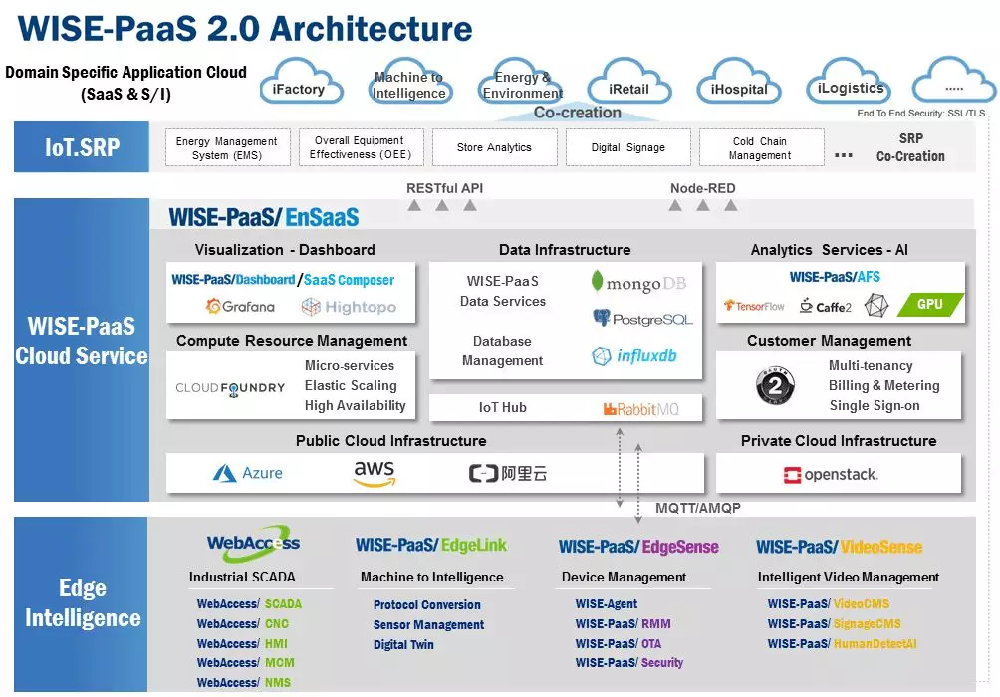
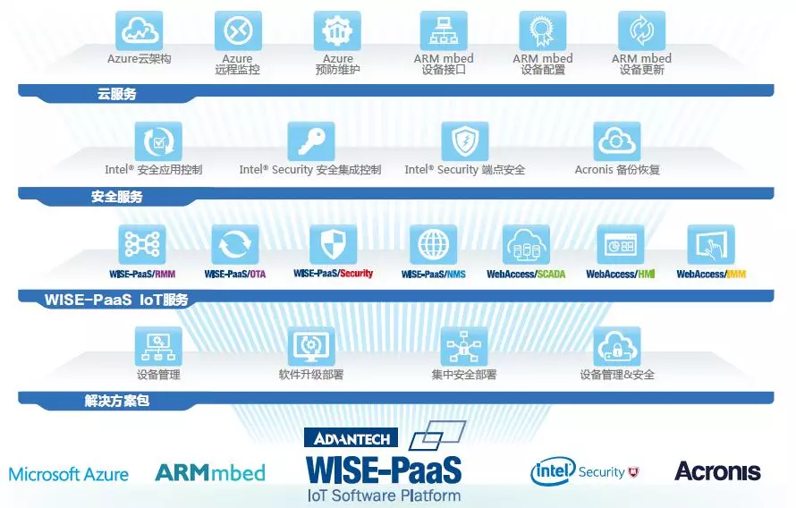
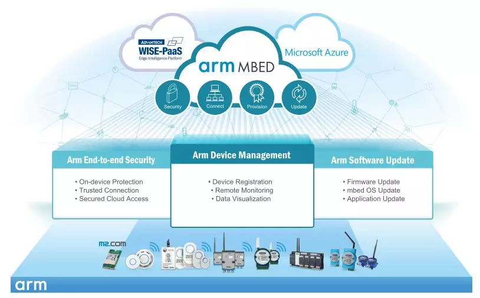

# 访谈 || IoT + PaaS 创新时代来临，研华致胜关键+秘密武器： WISE-PaaS研发设计团队

原创： 研华科技 [研华嵌入式社区](javascript:void(0);) *5月9日*

**研华IoT.SENSE采访研华嵌入式运算核心事业群协理林启文，探索WISE-PaaS的发展愿景，以下为专访摘要：**

## **Q：** 1. 希望能了解一下 WISE-PaaS 在 IoT 市场/领域的定位？ 

**A：**针对IoT议题，研华聚焦在工业物联网(IIoT)，扮演工业或领域产业应用的推手。研华定位非常清楚，从Edge Device出发，并提供PaaS云端服务解决方案，以致能向下延伸感测节点、向上串接云平台，协助SI伙伴实现数据的采集、处理、分析、可视化等流程，产出想要的SaaS服务。

  

## **Q：** 2、希望能谈 WISE-PaaS 团队对于 IoT PaaS 应用趋势的想法？

**A：**中国于2017年10月提出工业互联网平台白皮书，定义IoT PaaS云平台架构，WISE-PaaS十分吻合此架构。以往云平台侧重IaaS虚拟机，用户透过Client/Server型式存取云端应用，但实作过程中衍生诸多挑战；为此研华在2017年推出WISE-PaaS 2.0，完整实现PaaS架构，助力解决客户的痛点。   WISE-PaaS 2.0支持多租户架构，具有异类数据格式整合能力，可自动扩展应用规模，供应Metering & Billing功能满足计费需求，亦提供可视化仪表板。使客户藉由完整PaaS组件，一步步落实数据采集、处理、分析，并藉由可视化架构展现各项管理信息。

### Q： 3、希望能了解更多 WISE-PaaS 团队在 Cloud Service 技术的努力&成就？ 

**A：**先从数据采集说起，研华致力开发边缘智能系统，一方面整合各种产业应用协议，二方面整合各式无线通信技术，藉此统一终端数据格式，再利用WISE Agent上传数据WISE-PaaS云平台。其次谈及数据处理，WISE-PaaS提供SQL、NoSQL及时间序列等各种数据库服务，满足不同数据型式的处理需求。   再者WISE-PaaS整合Spark、R、Caffe、TensorFlow等工具，让客户易于采用AI或机器学习算法，执行数据分析。最终运用Grafana仪表板，一目了然呈现整体应用的运行状态、Focal Point(KPI达标率)、某些定点的操作现况，辅以Metering、Billing、SSO(单一签入)、自动调整需求资源，乃至HA容错等措施，全面满足智能应用的管理需求。

## **Q：** 4. 希望能谈 WISE-PaaS 团队在 Arm + WISE-PaaS 软硬件整合的努力/发展，接着带出 对 Arm 潜力的看法？ 

**A：**Arm已推出Mbed平台，在底层藉由Mbed OS整合感测节点，为终端装置提供远程管理与资安保护机能；在边缘端，透过Mbed Edge提供数据处理、协议转换及边缘智能等功能；最终将数据上传Mbed Cloud，以满足设备管控、远程韧体更新、大量部署等上层管理需求。Arm Mbed云服务从下而上涵盖感测节点、边缘及云，兼具数据采集、处理到管理等完整要求，与研华WISE-PaaS价值主张颇为类似。   有鉴于IoT底层的感测装置或无线通信组件，皆以Arm-based为大宗，因此研华看好Arm在IoT世界的发展潜能，积极促成彼此紧密合作。如今客户可利用Mbed采集到的数据，经由RESTful API，与WISE-PaaS平台的数据库服务整合，使得包括水资源处理、智能农业等多重应用环境，皆能轻易串联两边资源，完整实现物联网设备的安全联机、管理与更新，强化端到端安全性。

## **Q：** 5. 希望能谈 WISE-PaaS 团队在此方向 (Arm + WISE-PaaS 平台) 下一步的想法，接着带出 WISE-PaaS 对 Arm 相关的产品之规划蓝图？

**A：**尽管IoT应用呈现多元发展，但每个应用场景终将走向Domain-Focused；研华期望善用WISE-PaaS与Arm的整合能量，挹注行业准应用程序SRP(Solution Ready Package)的发展。以水资源处理应用场域为例，须为室内室外的传感器实施定位，此时可取决于Arm Cortex M架构，结合BLE、ZigBee、LoRa或NB-IoT等等大量无线感测节点，加速开发定位用途的SRP。   此外预期今后边缘端愈来愈倚重容器(Container)虚拟化技术，以便将云端产生的规则引擎，经由容器下放至边缘；广泛支持NB-IoT、LoRa或Sigfox等无线通信技术，且具容器执行能力的Arm Cortex A中高阶处理器，有望形成理想的边缘运算架构。   研华推动WISE-PaaS的初衷，便是协助客户孕育IoT应用、实践「数字转型」，于是致力与伙伴共创许多解决方案与服务，不管谈及SRP、仪表板Template，或感测节点与边缘端的整合对接，皆跳脱传统以规格、授权为导向的销售型态。毫无疑问，在打造数字转型价值链的过程，Arm是不可或缺的重要伙伴。

   

> **WISE-PaaS 物智联软件平台**
>
> 研华作为物联网智能系统与嵌入式平台产业的全球领导厂商，为迎接物联网、大数据与人工智能的市场趋势，提出以Edge Intelligence WISE PaaS为核心的云-网-端全方位物联网解决方案，来协助伙伴客户串接产业链。WISE-PaaS物智联软件平台为系统整合商、制造业、传统产业、各领域市场提供关键核心软件服务，包含从设备联网与无线感测整合的EdgeSense、视频与多媒体影像分析的VideoSense、数据采集与可视化的WebAccess及云服务平台的EnSaaS，未来将携手合作伙伴持续推出更多样化软件与云服务，来推动实体产业数字化转型，加速实践产业智能化。
>
> 咨询专线：400-001-9088

点击左下角【**阅读原文**】，了解更多

[阅读原文](https://mp.weixin.qq.com/s/yDrciA89bkr7yQMNSFHnMQ##)

