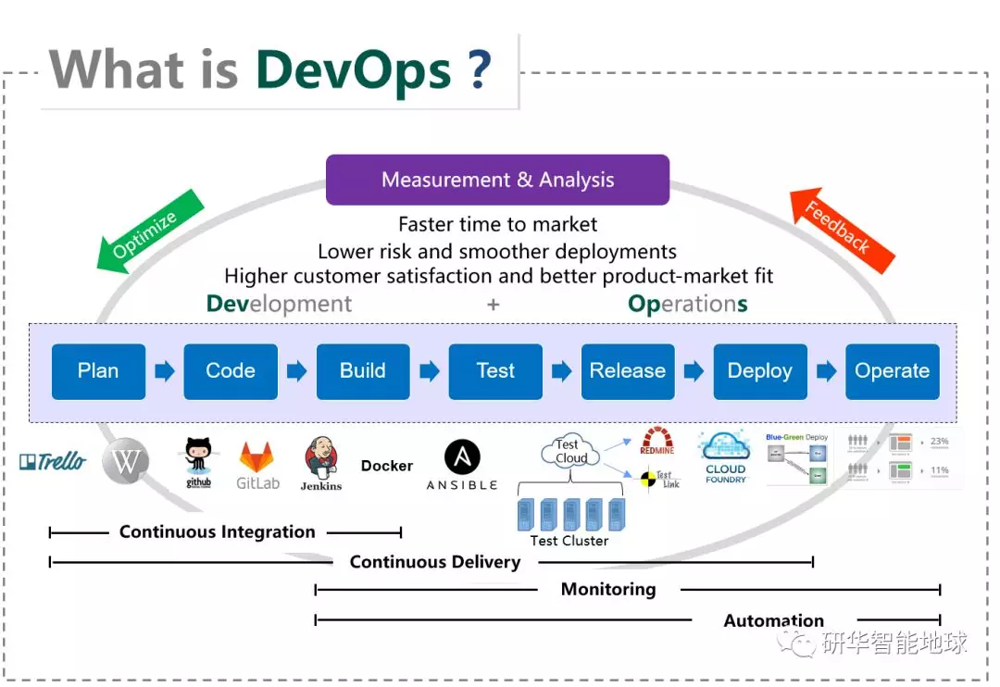

## IoT.PaaS || 我们在WISE-PaaS平台上实现了应用自动化持续发布——DevOps功能播报

原创： 小A君 [研华智能地球](javascript:void(0);) *7月19日*

**WISE-PaaS动态播报**

研华WISE-PaaS工业物联网云平台在不断地升级完善中，我们每周四为您播报其更新动态~

今天要为大家介绍的是WISE-PaaS平台上新导入的**DevOps持续交付服务**。

实操过的小伙伴应该都清楚，软件交付需要经过构建、测试、部署等很多复杂的过程，如果主要依赖人工去完成这个流程需要花费很多的时间，延误产品的上线发布。

而研华DevOps集文化、实践和工具于一身，以开发团队和运维团队的密切合作为核心，通过平时的工作实践将交付过程打造成一条包含开发、构建、测试、发布、部署、运维等步骤的标准化流程，并用各种工具将其自动化，最终**实现产品的快速高质量交付**，并提供7*24小时不间断的服务。

了解了什么是DevOps，我们就从技术架构上具体看看这个持续交付解决方案。

## **☞ Jenkins+Kubernetes实现应用自动化持续发布 ☜**

总体技术架构

解决方案最上层提供了CodePipeline服务，CodePipeline是一款具有持续集成/持续交付能力，并能兼容Jenkins的SaaS化产品。通过使用CodePipeline，可以使客户方便的在云端实现从代码到应用的持续集成和交付，方便客户快速的对产品进行功能迭代和演进。

整个解决方案的核心是Jenkins，Jenkins提供了软件开发的持续集成服务，它通过Master/Agent架构可以实现分布式构建，将不同的任务下发到多台机器（Jenkins Node）执行，提高处理性能。

解决方案最下层通过Kubernetes来管理Jenkins的节点，当有构建任务时会自动创建一个Docker Container来完成构建任务，当任务结束后Container会自动销毁，资源动态使用动态销毁，避免资源浪费，并且无需担心代码或者构建物外泄。

传统的 Jenkins Master/Agent方式可以帮助用户实现分布式构建，提高处理性能，但是在使用时还是会存在很多缺点，比如：

▶ 当Master节点发生故障时，便无法再进行任何构建任务；

▶ 为了完成不同语言的编译打包等任务，会创建很多Jenkins Node，但是这些Node的环境又很难复制，导致管理和维护都很困难；

▶ 资源分配不均衡，有些Node使用率比较高，会出现Job排队的情况，但有些使用率比较低的Node却很多时候又处于空闲，导致资源的浪费；

为了解决以上种种问题，需要寻找一种更可靠更高效的方式来完成 CI/CD 流程，使用Kubernetes 搭建 Jenkins 集群的架构便解决了这些问题，如下图所示。

在这种架构中， Jenkins Master 和 Jenkins Agent以 Docker Container 形式运行在 Kubernetes 集群的 Node 上， 创建一个持久化的Volume用来存储Jenkins服务的数据，当Master出现故障时，可以保证数据不会丢失。创建Jenkins Agent使用的Docker Image保存在Docker存储服务中（比如Docker Hub），便于管理和复用。Jenkins Agent会根据需要拉取Docker Image动态创建和销毁，不会一直占用资源。

## **☞ WISE-PaaS SRP持续交付流程 ☜**

***1.*** 开发人员提交代码到代码仓库，通过GitLab的WebHook会触发Jenkins上面自动构建的Job；

***2.*** 自动构建的Job执行后会将构建生成的产物存储到Storage Service，比如Blob；

***3.*** 编译成功后会触发Jenkins上面自动部署的Job，从Storage拉取编译产物部署到准生产区；

***4.*** 部署之后会自动执行SmokeTest，SmokeTest通过后，QA还会进行系统测试、性能测试、压力测试等全面的测试；

***5.*** 测试通过后触发Jenkins上面自动部署的Job将编译产物部署到生产区；

传统模式下，如果要更新应用，基本上无可避免会存在宕机时间。而借助研华的**DevOps持续交付服务**，则可以**实现不间断服务的更新**，这得力于平台上设置的**蓝绿部署**。

## **☞ 蓝绿部署：实现不间断服务的更新 ☜**

蓝绿部署是软件部署模式的一个术语，蓝色是现在正在运行的当前版本，绿色则是更新的版本。

我们先部署绿色版本，然后对绿色版本执行冒烟测试。通过测试后，才将应用流量逐步切换到绿色版本，然后监控绿色版本，一旦异常，立刻回滚到蓝色版本。整个过程高效迅速，可以保证0宕机升级，服务不间断。

WISE-PaaS App能够实现蓝绿部署，主要是因为平台支持App通过Scale实例个数来分担流量，比如蓝的版本有6个实例，目前用户访问的所有流量都集中在蓝的版本上。需要升级时，我们先部署只有一个实例的绿的版本，测试通过后，我们会将其Scale到4个实例，并将用户使用的Route Map到绿的版本上，并且将蓝的版本Scale为2个实例，这个时候，绿的版本正式被用户所用，并且分担了67%的流量，然后再继续将绿的版本Scale到6个实例，并且将蓝的版本Stop，最终所有流量成功导入到绿的版本，并且升级过程中不会出现宕机的时刻。

在快速发展的云时代，软件产品层出不穷，为了抢夺先机，第一时间将产品上市，快速发布和保证质量成为产品取胜至关重要的因素。遵循DevOps的交付理念，可以帮助开发人员第一时间发现软件中的缺陷，保证产品快速和高质量上线，并提供不间断的服务，提高客户的满意度和产品的市场竞争力。所以DevOps已经成为软件驱动型企业在云时代取得成功的关键。

**往期阅读**

[● IoT.PaaS || 数据分析、可视化！你要的功能，WISE-PaaS平台它都有](http://mp.weixin.qq.com/s?__biz=MzAwNDE5ODI5NQ==&mid=2658801917&idx=1&sn=f714c62bb440206e98ae6a1741d77591&chksm=80a12205b7d6ab13ffd30c56b7addb4e430d1b125e10b82502be77c2a1321c364c8051f61b03&scene=21#wechat_redirect)

[● IoT.PaaS || Graph数据统计！增强访问控制！——Dashboard新增功能播报](http://mp.weixin.qq.com/s?__biz=MzAwNDE5ODI5NQ==&mid=2658801946&idx=1&sn=d47c87c19329127c5ec0852aa67a98a4&chksm=80a123e2b7d6aaf47f0d060922cd132d7f45e585cdf45912c3b7dec6b152a30154e9be943331&scene=21#wechat_redirect)

[● IoT.PaaS || 我们又新开发了这三款Panel——Dashboard新增功能播报](http://mp.weixin.qq.com/s?__biz=MzAwNDE5ODI5NQ==&mid=2658802000&idx=1&sn=3e60f92bb02add07848de5040eec59b2&chksm=80a123a8b7d6aabec5071ab0a0d2b4dc5aa2c0c545a0ca0e88b98bc2524ca659ae850bf63676&scene=21#wechat_redirect)

[● IoT.PaaS || 研华大数据分析框架AFS即将上线，点击抢先了解](http://mp.weixin.qq.com/s?__biz=MzAwNDE5ODI5NQ==&mid=2658802045&idx=1&sn=2e37ef64c48bb7de8e2fba603d07a075&chksm=80a12385b7d6aa931381843dd5f2cc4695979e4dffa9bdfaa51bec93a149cb28bd0b8b1ed31f&scene=21#wechat_redirect)

下周四同一时间

继续为您推送WISE-PaaS动态资讯