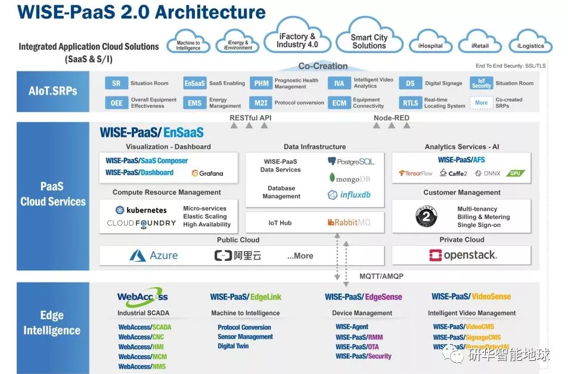
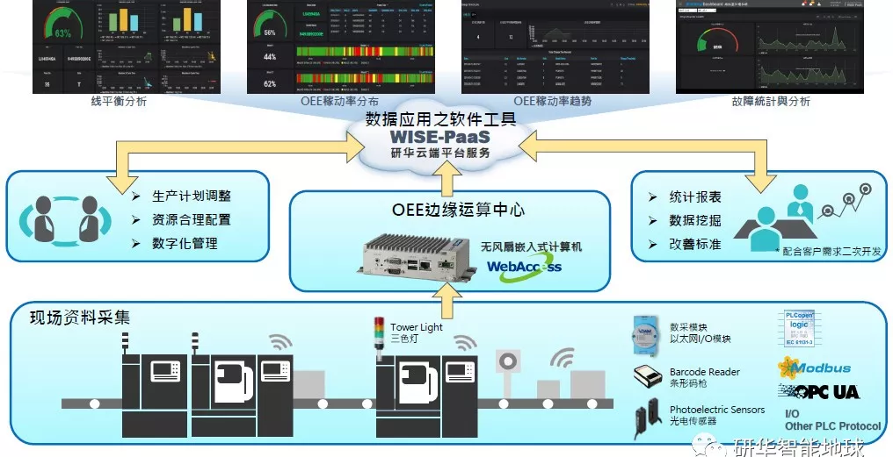
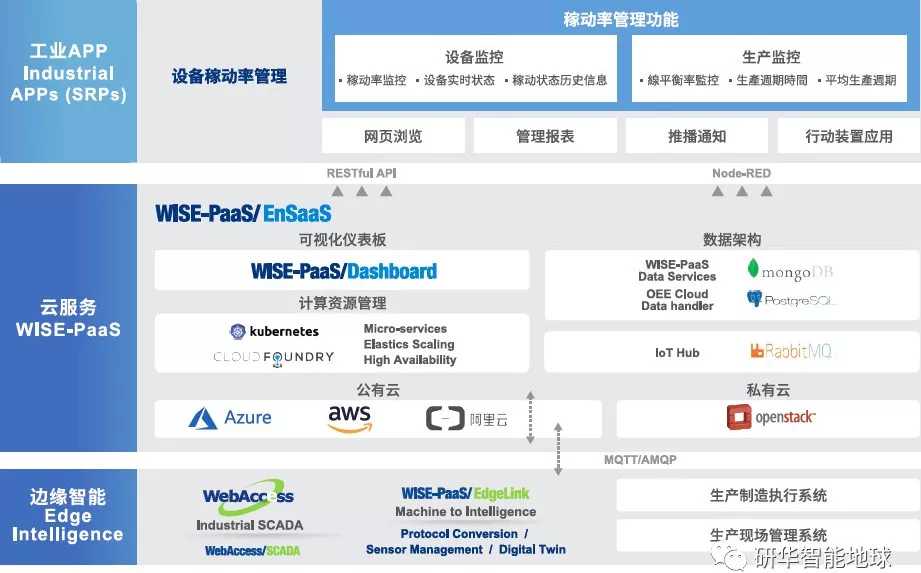
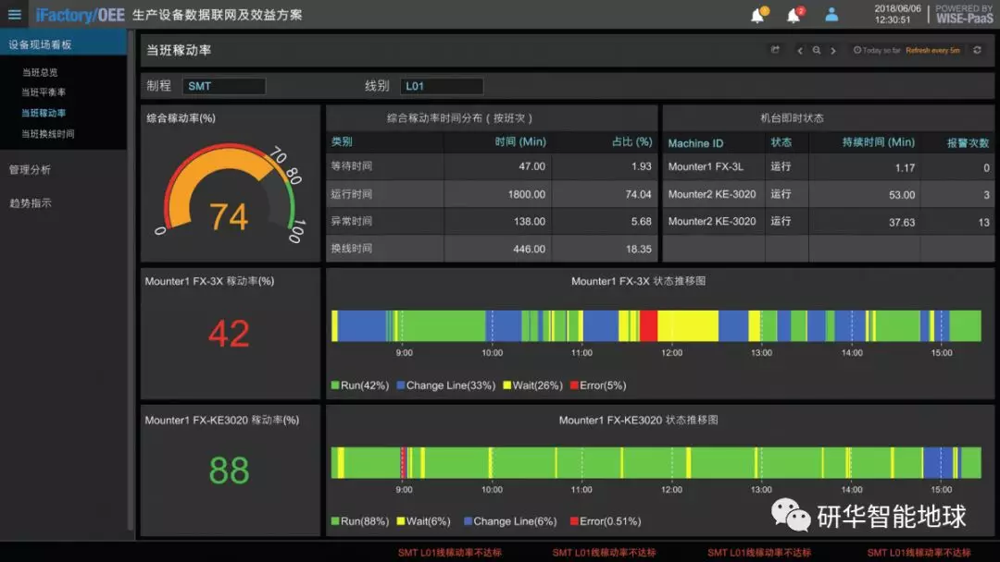
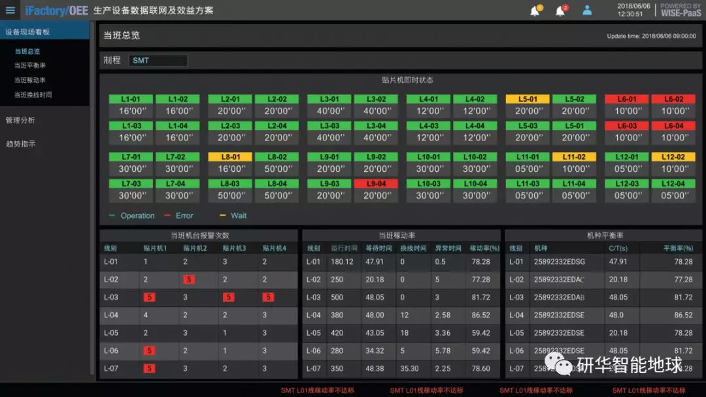

## IoT.PaaS || 精益生产！如何让你的车间更智能，提升设备绩效

原创： 小A君 [研华智能地球](javascript:void(0);) *10月18日*

> 本期导读
>
> 边缘层、平台层、应用层是工业互联网平台的三大核心层级 。之前我们已经解读过[边缘层](http://mp.weixin.qq.com/s?__biz=MzAwNDE5ODI5NQ==&mid=2658802429&idx=1&sn=964543200e9ef0888b7e1c4d6224de9f&chksm=80a12005b7d6a9135a8aa62b6d881d5ff049a275ec344df758f37496471a8ba9749c307a1d50&scene=21#wechat_redirect)和[平台层](http://mp.weixin.qq.com/s?__biz=MzAwNDE5ODI5NQ==&mid=2658802511&idx=1&sn=cb455c596bc851ccc7ec77abd341a3d9&chksm=80a121b7b7d6a8a104976686663c6bc8bb305e9ce479b64569e1f5c220a27888005f8c5884d3&scene=21#wechat_redirect)，今天我们就围绕应用层，以研华WISE-PaaS工业物联网云平台为例，介绍我们应用在智能工厂领域中的具体方案-**整体设备效率管理方案**。

**如果说边缘层是基础，平台层是核心的话，那么应用层就是关键，就是要形成满足不同行业、不同场景的应用服务，并以工业APP的形式呈现出来。**

以研华WISE-PaaS工业物联网云平台为例，在应用层，我们提供聚焦于各细分领域的软硬件整合解决方案（简称SRP）。

今天，小A就聚焦于应用比较多的智能工厂领域，为大家介绍一款整体设备效率管理方案。

## 研华整体设备效率管理方案

设备正常运转是生产要素，设备综合效率（简称OEE）是一台设备一贯的生产产品的能力。但目前国内企业特别是制造业，由于生产方式、人员素质、物流、设备维护、加工工艺等多种因素的影响，看似正常运转的的设备并没有发挥出其最大的产能。企业无法消除这些生产过程中造成的不必要浪费，导致生产效率难以提升。

> 而研华的整体设备效率管理方案，以物联网技术监控设备实时状态，并通过**WISE-PaaS可视化仪表板**呈现**设备稼动率**及**线平衡率**等重要信息。研华提供的云平台服务让管理者能够随时随地**掌握现场生产信息及管理绩效指标**，全面实现生产效率的优化。

##  **▌▌ 系统架构**

**↑↑↑ 系统架构 ↑↑↑**

如上图，您可以看到研华通过采集层、边缘计算以及云端处理三层架构，做不断的认知/纠错/改善循环精进。

● **在第一层采集层，**通过研华数据采集方案进行**设备信息的收集**，如通过I/O方式采集设备的**三色灯**来获取设备状态，或通过通讯协议如**Modbus**方式；

● **第二层是边缘计算**，通过**WebAccess**特有的节点上移方式将多区域的采集数据进行统合，并且可支持向上传输至**WISE-PaaS云端**；

**▼ 软件架构 ▼** 

● **第三层是云端数据处理和呈现**，通过情景化的管理看板画面进行现场管理，使企业对设备的运行状况一目了然，比如：机器的运转效率是否正常？生产线上的次品率为何突然增高？器械的故障率为何增加？这些都可以在研华OEE系统中找到答案。

**↑左图：设备稼动率；右图：设备现场看板↑**

##  **▌▌ 方案特点**

总结来讲，研华提供的整体设备效率管理方案，有以下三个特点：

**● 完整的数据采集**

以开放架构协助客户搜集机台信息，针对不同类型，不同厂牌的机台设备，提供各种数据采集模块，并通过通讯整合平台，完成设备联网及信息采集，实现生产信息分析。[**右戳了解》》不同类型设备如何快速接入云平台？**](http://mp.weixin.qq.com/s?__biz=MzAwNDE5ODI5NQ==&mid=2658802470&idx=1&sn=919ebc3a4d3743f55fac48fccd6a0f8d&chksm=80a121deb7d6a8c871dbf5d911d3116bc1d8034a16cc00cc8bcda021c4fc3c319837d2c06c21&scene=21#wechat_redirect)

**● OT与IT信息整合**

WISE-PaaS平台有效整合信息科技（IT）与营运技术（OT），再进一步结合开放式云端服务平台，行程智能企业整合架构，连接云端及数据分析应用，优化生产及运营管理。

**● 工厂可视化管理**

如上面WISE-PaaS可视化仪表板所展现的，通过信息可视化呈现，协助业者实时监控生产状态、设备稼动率等生产指标，落实实时便利的流程可视化管理应用，提升产能与品质的智能管理综效。

目前这款方案，在电子制造、制鞋及纺织、金属加工及数控机床等领域的企业中，都有成功应用，篇幅所限，这里就不多叙述。