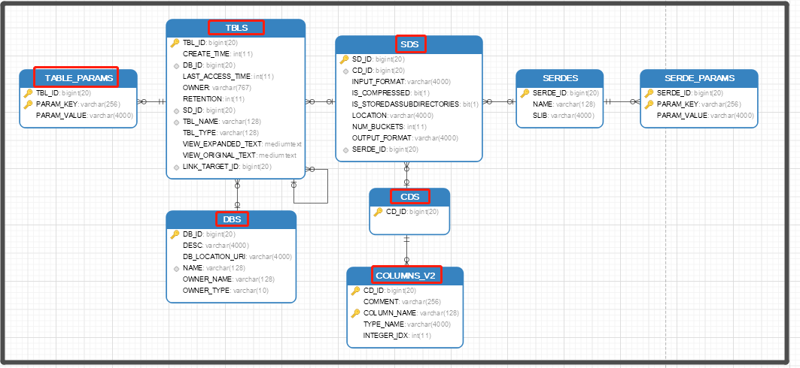

# HiveMetastore数据库简介

## 1. DBS数据库

| DB_ID | NAME    | DESC                  | DB_LOCATION_URI                                       | OWNER_NAME | OWNER_TYPE |
| ----- | ------- | --------------------- | ----------------------------------------------------- | ---------- | ---------- |
| 1     | default | Default Hive database | hdfs://gateway002:8020/user/hive/warehouse            | public     | ROLE       |
| 464   | nifi_db |                       | hdfs://gateway002:8020/user/hive/warehouse/nifi_db.db | admin      | USER       |
| 1538  | dv_db   | DataVault DB          | hdfs://gateway002:8020/user/hive/warehouse/dv_db.db   | admin      | USER       |

如上表所示， `DBS`表主要描述Hive仓库中保存了哪些数据库（DataBase: Schema）

## 2. TBLS表

| DB_ID | TBL_ID | SD_ID | TBL_NAME      | TBL_TYPE       | CREATE_TIME | LAST_ACCESS_TIME | OWNER | RETENTION | VIEW_EXPANDED_TEXT | VIEW_ORIGINAL_TEXT | LINK_TARGET_ID |
| ----- | ------ | ----- | ------------- | -------------- | ----------- | ---------------- | ----- | --------- | ------------------ | ------------------ | -------------- |
| 1     | 455    | 1328  | metrics       | MANAGED_TABLE  | 1535206939  | 0                | admin | 0         |                    |                    |                |
| 1     | 461    | 1344  | mertics       | EXTERNAL_TABLE | 1535208388  | 0                | admin | 0         |                    |                    |                |
| 1     | 462    | 1345  | metrics_raw   | EXTERNAL_TABLE | 1535208427  | 0                | admin | 0         |                    |                    |                |
| 1     | 469    | 1364  | metrics_src   | MANAGED_TABLE  | 1535210246  | 0                | admin | 0         |                    |                    |                |
| 464   | 470    | 1365  | metrics_src   | MANAGED_TABLE  | 1535210409  | 0                | admin | 0         |                    |                    |                |
| 1538  | 3829   | 11440 | hubim         | MANAGED_TABLE  | 1536561835  | 0                | admin | 0         |                    |                    |                |
| 1538  | 3830   | 11441 | hubbarcode    | MANAGED_TABLE  | 1536562019  | 0                | admin | 0         |                    |                    |                |
| 1538  | 3832   | 11445 | linkimbarcode | MANAGED_TABLE  | 1536562253  | 0                | admin | 0         |                    |                    |                |
| 1538  | 3834   | 11449 | satim         | MANAGED_TABLE  | 1536562608  | 0                | admin | 0         |                    |                    |                |
| 1538  | 3836   | 11453 | satbarcode    | MANAGED_TABLE  | 1536562852  | 0                | admin | 0         |                    |                    |                |

如上表所示， `TBLS`表主要描述`Hive仓库`中保存了哪些`数据表(Tables)`, 以及`表(TBL_ID)`与`数据库(DB_ID)`关系、`表(TBL_ID)`与`hdfs系统文件(SD_ID)`关系等信息；

## 3. TABLE_PARAMS表属性

| TBL_ID | PARAM_KEY              | PARAM_VALUE                               |
| ------ | ---------------------- | ----------------------------------------- |
| 455    | kudu.master_addresses  | gateway002                                |
| 455    | kudu.table_name        | impala::default.metrics                   |
| 455    | storage_handler        | com.cloudera.kudu.hive.KuduStorageHandler |
| 455    | transient_lastDdlTime  | 1535332583                                |
| 461    | COLUMN_STATS_ACCURATE  | FALSE                                     |
| 461    | EXTERNAL               | TRUE                                      |
| 461    | numFiles               | 100                                       |
| 461    | numRows                | -1                                        |
| 461    | rawDataSize            | -1                                        |
| 461    | skip.header.line.count | 0                                         |
| 461    | totalSize              | 2947103171                                |
| 461    | transient_lastDdlTime  | 1535208388                                |
| 3829   | kudu.master_addresses  | gateway002                                |
| 3829   | kudu.table_name        | impala::dv_db.HubIM                       |
| 3829   | storage_handler        | com.cloudera.kudu.hive.KuduStorageHandler |
| 3829   | transient_lastDdlTime  | 1536561878                                |

该表主要维护表属性信息；

## 4. SDS文件系统

| SD_ID | SERDE_ID | CD_ID | LOCATION                                                     | OUTPUT_FORMAT                                              | INPUT_FORMAT                                   | IS_COMPRESSED | IS_STOREDASSUBDIRECTORIES | NUM_BUCKETS |
| ----- | -------- | ----- | ------------------------------------------------------------ | ---------------------------------------------------------- | ---------------------------------------------- | ------------- | ------------------------- | ----------- |
| 1328  | 1328     | 455   | hdfs://gateway002:8020/user/hive/warehouse/metrics           | org.apache.kudu.mapreduce.KuduTableOutputFormat            | org.apache.kudu.mapreduce.KuduTableInputFormat | 0             | 0                         | 0           |
| 1344  | 1344     | 461   | hdfs://gateway002:8020/tmp/nifi/metric_data                  | org.apache.hadoop.hive.ql.io.HiveIgnoreKeyTextOutputFormat | org.apache.hadoop.mapred.TextInputFormat       | 0             | 0                         | 0           |
| 1345  | 1345     | 462   | hdfs://gateway002:8020/tmp/nifi/metric_data                  | org.apache.hadoop.hive.ql.io.HiveIgnoreKeyTextOutputFormat | org.apache.hadoop.mapred.TextInputFormat       | 0             | 0                         | 0           |
| 1364  | 1364     | 469   | hdfs://gateway002:8020/user/hive/warehouse/metrics_src       | org.apache.kudu.mapreduce.KuduTableOutputFormat            | org.apache.kudu.mapreduce.KuduTableInputFormat | 0             | 0                         | 0           |
| 1365  | 1365     | 470   | hdfs://gateway002:8020/user/hive/warehouse/nifi_db.db/metrics_src | org.apache.kudu.mapreduce.KuduTableOutputFormat            | org.apache.kudu.mapreduce.KuduTableInputFormat | 0             | 0                         | 0           |
| 11440 | 11440    | 3834  | hdfs://gateway002:8020/user/hive/warehouse/dv_db.db/hubim    | org.apache.kudu.mapreduce.KuduTableOutputFormat            | org.apache.kudu.mapreduce.KuduTableInputFormat | 0             | 0                         | 0           |
| 11441 | 11441    | 3835  | hdfs://gateway002:8020/user/hive/warehouse/dv_db.db/hubbarcode | org.apache.kudu.mapreduce.KuduTableOutputFormat            | org.apache.kudu.mapreduce.KuduTableInputFormat | 0             | 0                         | 0           |
| 11445 | 11445    | 3837  | hdfs://gateway002:8020/user/hive/warehouse/dv_db.db/linkimbarcode | org.apache.kudu.mapreduce.KuduTableOutputFormat            | org.apache.kudu.mapreduce.KuduTableInputFormat | 0             | 0                         | 0           |
| 11449 | 11449    | 3839  | hdfs://gateway002:8020/user/hive/warehouse/dv_db.db/satim    | org.apache.kudu.mapreduce.KuduTableOutputFormat            | org.apache.kudu.mapreduce.KuduTableInputFormat | 0             | 0                         | 0           |
| 11453 | 11453    | 3841  | hdfs://gateway002:8020/user/hive/warehouse/dv_db.db/satbarcode | org.apache.kudu.mapreduce.KuduTableOutputFormat            | org.apache.kudu.mapreduce.KuduTableInputFormat | 0             | 0                         | 0           |

描述HDFS中文件路径与（`CD_ID`关联`TBL_ID`），

## 5. CDS字段所属表空间（Column联合主键之一）

| CD_ID |
| ----- |
| 455   |
| 461   |
| 462   |
| 469   |

描述字段部分键值信息（描述字段在数据表层面的信息, 字段值与`TBLS`表中`TBL_ID`字段一致，但并没有直接关联）

> 注： metastore中并不没有直接关联字段与数据表的关系， 而是通过COLUMNS_V2-- CDS -- SDS -- TBLS 进行关联； 但是 CDS维护的`CD_ID` 其实与TBLS表中维护的`TBL_ID`数据是一样的，可以直接关联（强行关联... ）

## 6.COLUMNS_V2字段

| CD_ID | COLUMN_NAME  | TYPE_NAME | INTEGER_IDX | COMMENT |
| ----- | ------------ | --------- | ----------- | ------- |
| 455   | host         | string    | 0           |         |
| 455   | metric       | string    | 1           |         |
| 455   | time         | int       | 2           |         |
| 455   | value        | double    | 3           |         |
| 3834  | imhashkey    | string    | 0           |         |
| 3834  | loaddate     | bigint    | 1           |         |
| 3834  | recordsource | string    | 2           |         |
| 3834  | cdanhao      | string    | 3           |         |

描述`字段类型`信息 及 `字段与表`的关系(详见CDS表的描述)

