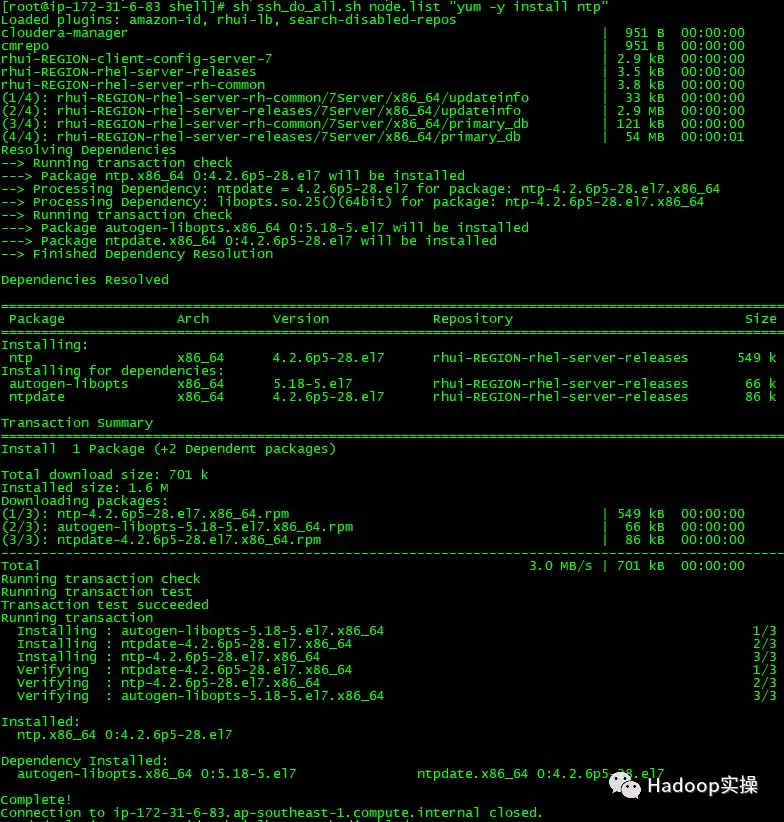
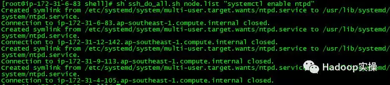
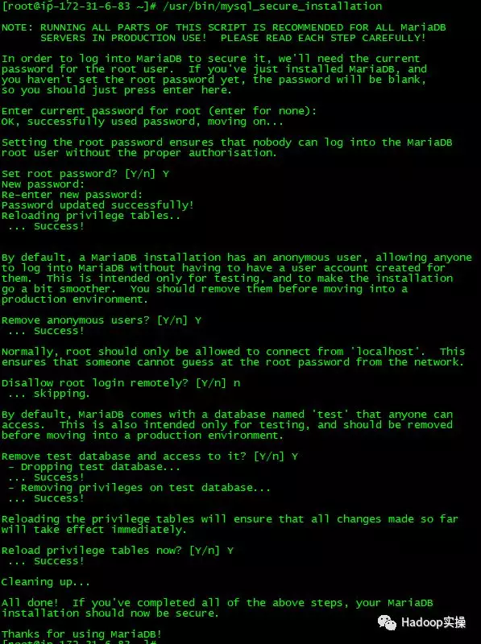
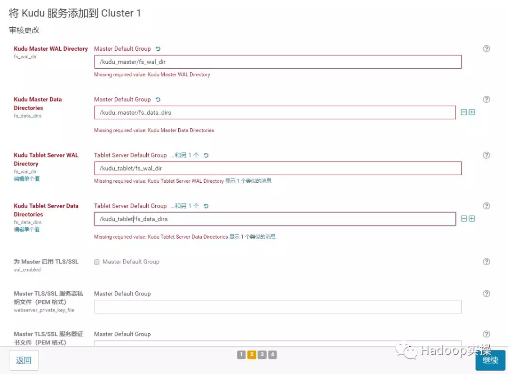

# 如何在Redhat7.4安装CDH5.15

原创： Fayson [Hadoop实操](javascript:void(0);) *7月3日*


> Fayson的github：
>
> https://github.com/fayson/cdhproject


## 1.文档编写目的

Cloudera在2018年6月12日发布了CDH5.15，新功能介绍可以参考Fayson之前的文章《[CDH5.15和CM5.15的新功能](http://mp.weixin.qq.com/s?__biz=MzI4OTY3MTUyNg==&mid=2247490765&idx=1&sn=c976f5d5445290bb60644b6c9c23d808&chksm=ec2accc4db5d45d2c0851484d1e1df3be6885f7206c712f7573d96b03b86ee0bce1e67d42103&scene=21#wechat_redirect)》。本文档主要描述如何在Redhat7.4安装CDH5.15。Cloudera企业级数据中心的安装主要分为5个步骤：


1.集群服务器配置，包括安装操作系统、关闭防火墙、同步服务器时钟等；

2.外部数据库安装

3.安装Cloudera管理器；

4.安装CDH集群；

5.集群完整性检查，包括HDFS文件系统、MapReduce、Hive等是否可以正常运行。


本文操作说明基于以下假设：

1.操作系统版本：Redhat7.4

2.CDH和CM版本均为5.15

3.采用root对集群进行部署

4.您已经下载CDH和CM的安装包


## 2.前置准备

### 2.1.hostname及hosts配置


集群中各个节点之间能互相通信使用静态IP地址。IP地址和主机名通过/etc/hosts配置，主机名通过/etc/hostname进行配置。

以cm节点（172.31.6.83）为例：


- hostname配置

/etc/hostname文件如下：


```shell
ip-172-31-6-83.ap-southeast-1.compute.internal
```

或者你可以通过命令修改立即生效

```shell
[root@ip-172-31-6-83 ~]$ sudo hostnamectl set-hostname ip-172-31-6-83.ap-southeast-1.compute.internal
```

> 注意：这里修改hostname跟REDHAT6的区别


- hosts配置

/etc/hosts文件如下:

```properties
127.0.0.1   localhost localhost.localdomain localhost4 localhost4.localdomain4
::1         localhost localhost.localdomain localhost6 localhost6.localdomain6

172.31.6.83 ip-172-31-6-83.ap-southeast-1.compute.internal
172.31.12.142 ip-172-31-12-142.ap-southeast-1.compute.internal
172.31.9.113 ip-172-31-9-113.ap-southeast-1.compute.internal
172.31.4.105 ip-172-31-4-105.ap-southeast-1.compute.internal
```

以上两步操作，在集群中其它节点做相应配置。确认需要安装的4台主机的hosts文件：


### 2.2.禁用SELinux

在所有节点执行setenforce 0 命令，此处使用批处理shell执行：

```shell
[root@ip-172-31-6-83 ~]$ sh ssh_do_all.sh node.list "setenforce 0"
```


集群所有节点修改/etc/selinux/config文件如下：


```shell
SELINUX=disabled
SELINUXTYPE=targeted
```


### 2.3.关闭防火墙

集群所有节点执行systemctl stop firewalld命令，此处通过shell批量执行命令如下：

```
[root@ip-172-31-6-83 ~]$ sh ssh_do_all.sh node.list "systemctl stop firewalld"
[root@ip-172-31-6-83 ~]$ sh ssh_do_all.sh node.list "systemctl disable firewalld"
[root@ip-172-31-6-83 ~]$ sh ssh_do_all.sh node.list "systemctl status firewalld"
```


### 2.4.集群时钟同步

在Redhat7.x的操作系统上，已经默认的安装了chrony，我们这里先卸载chrony，然后安装ntp。使用ntp来配置各台机器的时钟同步，将cm（172.31.6.83）服务作为本地ntp服务器，其它3台服务器与其保持同步。


#### 1.所有机器卸载chrony


```
[root@ip-172-31-6-83 shell]# sh ssh_do_all.sh node.list "yum -y remove chrony"
```


#### 2.所有机器安装ntp


```
[root@ip-172-31-6-83 shell]# sh ssh_do_all.sh node.list "yum -y install ntp"
```





#### 3.cm机器配置时钟与自己同步


```
[root@ip-172-31-16-68 shell]# vim /etc/ntp.conf
#server 0.rhel.pool.ntp.org iburst
#server 1.rhel.pool.ntp.org iburst
#server 2.rhel.pool.ntp.org iburst
#server 3.rhel.pool.ntp.org iburst
server  127.127.1.0     # local clock
fudge   127.127.1.0 stratum 10
```


#### 4.集群其它节点，配置找cm机器去同步


```
#server 0.rhel.pool.ntp.org iburst
#server 1.rhel.pool.ntp.org iburst
#server 2.rhel.pool.ntp.org iburst
#server 3.rhel.pool.ntp.org iburst
server 172.31.6.83
```


#### 5.重启所有机器的ntp服务


```
[root@ip-172-31-6-83 shell]# sh ssh_do_all.sh node.list "systemctl restart ntpd"
[root@ip-172-31-6-83 shell]# sh ssh_do_all.sh node.list "systemctl status ntpd"
[root@ip-172-31-6-83 shell]# sh ssh_do_all.sh node.list "systemctl enable ntpd"
```





#### 6.验证始终同步，在所有节点执行ntpq -p命令，如下使用脚本批量执行


```
[root@ip-172-31-6-83 shell]# sh ssh_do_all.sh node.list "ntpq -p"
```


左边出现*号表示同步成功。


### 2.5.设置swap

所有节点执行

```
[root@ip-172-31-6-83 shell]# sh ssh_do_all.sh node.list "echo vm.swappiness = 10 >> /etc/sysctl.conf"
[root@ip-172-31-6-83 shell]# sh ssh_do_all.sh node.list "sysctl vm.swappiness=10"
```


### 2.6.设置透明大页面

所有节点执行：

```
[root@ip-172-31-6-83 shell]# sh ssh_do_all.sh node.list "echo never > /sys/kernel/mm/transparent_hugepage/defrag "
[root@ip-172-31-6-83 shell]# sh ssh_do_all.sh node.list  "echo never > /sys/kernel/mm/transparent_hugepage/enabled"
```


设置开机自关闭

将如下脚本添加到/etc/rc.d/rc.local文件中


```
if test -f /sys/kernel/mm/transparent_hugepage/enabled; then echo never > /sys/kernel/mm/transparent_hugepage/enabled fi if test -f /sys/kernel/mm/transparent_hugepage/defrag; then echo never > /sys/kernel/mm/transparent_hugepage/defrag fi
```

同步到所有节点


### 2.7.配置操作系统repo 

Fayson用的是AWS的环境，这步是可以省略的，放在这里供物理机部署的兄弟们参考。

- 挂载操作系统iso文件

```
[ec2-user@ip-172-31-2-159 ~]$ sudo mkdir /media/DVD1
[ec2-user@ip-172-31-2-159 ~]$ sudo mount -o loop 
CentOS-7-x86_64-DVD-1611.iso /media/DVD1/
```


- 配置操作系统repo


```
[ec2-user@ip-172-31-2-159 ~]$ sudo vim /etc/yum.repos.d/local_os.repo
[local_iso]    
name=CentOS-$releasever - Media
baseurl=file:///media/DVD1
gpgcheck=0
enabled=1
[ec2-user@ip-172-31-2-159 ~]$ sudo yum repolist
```


### 2.8.安装http服务


- 安装httpd服务

```
[ec2-user@ip-172-31-2-159 ~]$ sudo yum -y install httpd
```


- 启动或停止httpd服务


```
[ec2-user@ip-172-31-2-159 ~]$ sudo systemctl start httpd
[ec2-user@ip-172-31-2-159 ~]$ sudo systemctl stop httpd
```


- 安装完httpd后，重新制作操作系统repo，换成http的方式方便其它服务器也可以访问


```
[ec2-user@ip-172-31-2-159 ~]$ sudo mkdir /var/www/html/iso
[ec2-user@ip-172-31-2-159 ~]$ sudo scp -r /media/DVD1/* /var/www/html/iso/
[ec2-user@ip-172-31-2-159 ~]$ sudo vim /etc/yum.repos.d/os.repo 
[osrepo]
name=os_repo
baseurl=http://172.31.2.159/iso/
enabled=true
gpgcheck=false
[ec2-user@ip-172-31-2-159 ~]$ sudo yum repolist
```


### 2.9.安装MariaDB

1.安装MariaDB

```
[root@ip-172-31-6-83 ~]# yum -y install mariadb
[root@ip-172-31-6-83 ~]# yum -y install mariadb-server
```


2.启动并配置MariaDB

```
[root@ip-172-31-6-83 ~]# systemctl start mariadb
[root@ip-172-31-6-83 ~]# systemctl enable mariadb
[root@ip-172-31-6-83 ~]# /usr/bin/mysql_secure_installation

NOTE: RUNNING ALL PARTS OF THIS SCRIPT IS RECOMMENDED FOR ALL MariaDB
      SERVERS IN PRODUCTION USE!  PLEASE READ EACH STEP CAREFULLY!

In order to log into MariaDB to secure it, we'll need the current
password for the root user.  If you've just installed MariaDB, and
you haven't set the root password yet, the password will be blank,
so you should just press enter here.

Enter current password for root (enter for none): 
OK, successfully used password, moving on...

Setting the root password ensures that nobody can log into the MariaDB
root user without the proper authorisation.

Set root password? [Y/n] Y
New password: 
Re-enter new password: 
Password updated successfully!
Reloading privilege tables..
 ... Success!


By default, a MariaDB installation has an anonymous user, allowing anyone
to log into MariaDB without having to have a user account created for
them.  This is intended only for testing, and to make the installation
go a bit smoother.  You should remove them before moving into a
production environment.

Remove anonymous users? [Y/n] Y
 ... Success!

Normally, root should only be allowed to connect from 'localhost'.  This
ensures that someone cannot guess at the root password from the network.

Disallow root login remotely? [Y/n] n
 ... skipping.

By default, MariaDB comes with a database named 'test' that anyone can
access.  This is also intended only for testing, and should be removed
before moving into a production environment.

Remove test database and access to it? [Y/n] Y
 - Dropping test database...
 ... Success!
 - Removing privileges on test database...
 ... Success!

Reloading the privilege tables will ensure that all changes made so far
will take effect immediately.

Reload privilege tables now? [Y/n] Y
 ... Success!

Cleaning up...

All done!  If you've completed all of the above steps, your MariaDB
installation should now be secure.

Thanks for using MariaDB!
```





## 3.建立CM，Hive等需要的表


```mysql
[root@ip-172-31-6-83 ~]# mysql -u root -p
-- ------ Hive ---------
CREATE DATABASE metastore DEFAULT CHARACTER SET utf8;
-- DROP USER 'hive'@'%'; #删除用户，重新设置信息
-- FLUSH PRIVILEGES;
CREATE USER 'hive'@'%' IDENTIFIED BY '123456@';
GRANT ALL PRIVILEGES ON metastore.* TO 'hive'@'%';
FLUSH PRIVILEGES;


-------- Hue ---------
CREATE DATABASE hue DEFAULT CHARACTER SET utf8;
-- DROP USER 'hue'@'%';
-- FLUSH PRIVILEGES;
CREATE USER 'hue'@'%' IDENTIFIED BY '123456@';
GRANT ALL PRIVILEGES ON hue.* TO 'hue'@'%';
FLUSH PRIVILEGES;

-------- oozie ---------
CREATE DATABASE oozie DEFAULT CHARACTER SET utf8;
-- DROP USER 'oozie'@'%';
-- FLUSH PRIVILEGES;
CREATE USER 'oozie'@'%' IDENTIFIED BY '123456@';
GRANT ALL PRIVILEGES ON oozie.* TO 'oozie'@'%';
FLUSH PRIVILEGES;

-------- Cloudera Manager---------
CREATE DATABASE cm DEFAULT CHARACTER SET utf8;
CREATE USER 'cm'@'%' IDENTIFIED BY '123456@';
GRANT ALL PRIVILEGES ON cm.* TO 'cm'@'%';
FLUSH PRIVILEGES;

--------   ---------
CREATE DATABASE am DEFAULT CHARACTER SET utf8;
CREATE USER 'am'@'%' IDENTIFIED BY '123456@';
GRANT ALL PRIVILEGES ON am.* TO 'am'@'%';
FLUSH PRIVILEGES;

--------   ---------
CREATE DATABASE rm DEFAULT CHARACTER SET utf8;
CREATE USER 'rm'@'%' IDENTIFIED BY '123456@';
GRANT ALL PRIVILEGES ON rm.* TO 'rm'@'%';
FLUSH PRIVILEGES;
--------   ---------
CREATE DATABASE sentry DEFAULT CHARACTER SET utf8;
CREATE USER 'sentry'@'%' IDENTIFIED BY '123456@';
GRANT ALL PRIVILEGES ON sentry.* TO 'sentry'@'%';
FLUSH PRIVILEGES;

--------   ---------
CREATE DATABASE nav_ms DEFAULT CHARACTER SET utf8;
CREATE USER 'nav_ms'@'%' IDENTIFIED BY '123456@';
GRANT ALL PRIVILEGES ON nav_ms.* TO 'nav_ms'@'%';
FLUSH PRIVILEGES;

-------- . ---------
CREATE DATABASE nav_as DEFAULT CHARACTER SET utf8;
CREATE USER 'nav_as'@'%' IDENTIFIED BY '123456@';
GRANT ALL PRIVILEGES ON nav_as.* TO 'nav_as'@'%';
FLUSH PRIVILEGES;
```


- 安装jdbc驱动


```
[root@ip-172-31-6-83 ~]# mkdir -p /usr/share/java/
[root@ip-172-31-6-83 ~]# mv mysql-connector-java-5.1.34.jar /usr/share/java/
[root@ip-172-31-6-83 ~]# cd /usr/share/java
[root@ip-172-31-6-83 java]# ln -s mysql-connector-java-5.1.34.jar mysql-connector-java.jar
[root@ip-172-31-6-83 java]# ll
total 940
-rwxrwxr-x. 1 ec2-user ec2-user 960372 Feb  1 08:31 mysql-connector-java-5.1.34.jar
lrwxrwxrwx  1 root     root         31 Feb  2 00:52 mysql-connector-java.jar -> mysql-connector-java-5.1.34.jar
```


## 3.Cloudera Manager安装

### 3.1.配置本地repo源

#### 1.下载CM5.15/CDH5.15的安装包，地址为：


> CM 和CDH下载以及JDK和java驱动
>
> > Cloudera Manager下载地址：[http://archive.cloudera.com/cm5/cm/5/cloudera-manager-centos7-cm5.15.0_x86_64.tar.gz](http://archive.cloudera.com/cm5/cm/5/cloudera-manager-el6-cm5.1.3_x86_64.tar.gz)
> >
> > CDH安装包地址：<http://archive.cloudera.com/cdh5/parcels/latest/>，由于我们的操作系统为CentOS7.2，需要下载以下文件：
> >
> > - CDH-5.15.0-1.cdh5.15.0.p0.21-el7.parcel
> > - CDH-5.15.0-1.cdh5.15.0.p0.21-el7.parcel.sha1
> > - manifest.json
> >
> > JDK 可以去官网下载 下载地址：<http://www.oracle.com/technetwork/java/javase/downloads/jdk8-downloads-2133151.html>
> >
> >   下载版本为： jdk-8u172-linux-x64.rpm
> >
> > mysql的java驱动 下载地址：<https://dev.mysql.com/downloads/connector/j/5.1.html> 
> >
> > ```
> > 下载版本为：mysql-connector-java-5.1.46.tar.gz
> > ```

#### 2. 配置parcel 源

> [CDH搭建攻略](https://www.jianshu.com/p/e365f17644eb)
>
> ```shell
> 我们选择的parcel源服务器就是test006.tpy.corp
> yum install httpd
> mkdir -p /var/www/html/cdh5/parcels/latest
> cd /var/www/html/cdh5/parcels/latest
> 
> wget http://archive.cloudera.com/cdh5/parcels/5.11.0/CDH-5.11.0-1.cdh5.11.0.p0.34-el7.parcel
> wget http://archive.cloudera.com/cdh5/parcels/5.11.0/CDH-5.11.0-1.cdh5.11.0.p0.34-el7.parcel.sha1
> wget http://archive.cloudera.com/cdh5/parcels/5.11.0/manifest.json
> 
> mv CDH-5.11.0-1.cdh5.11.0.p0.34-el7.parcel.sha1 CDH-5.11.0-1.cdh5.11.0.p0.34-el7.parcel.sha
> 
> service httpd start
> 验证：http://192.169.20.206/cdh5/parcels/latest/
> ```
>
>


### 3.2.安装Cloudera Manager Server

#### 1.安装Cloudera Manager Server


> 安装Cloudera Manager Server 和Agent 
> 主节点解压安装 
>   cloudera manager的目录默认位置在/opt下，解压：tar xzvf cloudera-manager*.tar.gz将解
> 压后的cm-5.15.0和cloudera目录放到/opt目录下。 
> [root@master tmp]# tar -zxvf cloudera-manager-el6-cm5.15.0_x86_64.tar.gz -C /opt 
>
> 为Cloudera Manager 5建立数据库 
>   首先需要去MySql的官网下载JDBC驱动，http://dev.mysql.com/downloads/connector/j/，
> 解压后，找到 mysql-connector-java-8.0.11，放到/opt/cm-5.15.0/share/cmf/lib/中。 
>
> [root@master tmp]# cp mysql-connector-java-8.0.11.jar /opt/cm-5.15.0/share/cmf/lib/ 
>
>   在主节点初始化CM5的数据库：
>
> [root@master tmp]# /opt/cm-5.15.0/share/cmf/schema/scm_prepare_database.sh mysql cm -hgateway001 -uroot -p123456@ --scm-host gateway002 cm cm cm 
>
> Agent配置 
>   修改/opt/cm-5.15.0/etc/cloudera-scm-agent/config.ini中的server_host为主节点的主机
> 名。 
> [root@master ~]# vim /opt/cm-5.15.0/etc/cloudera-scm-agent/config.ini  


#### 2.初始化数据库


```shell
#此环节如果出问题，可以cat scm_prepare_database.sh 文件看一下几个参数用法
# 主从分库时，/etc/mysql/mysql.conf.d/mysqld.cnf中的 gtid_mode=ON ，enforce_gtid_consistency=ON属性会导致初始化失败！

/opt/cm-5.15.0/share/cmf/schema/scm_prepare_database.sh mysql cm -hgateway001 -uroot -p123456@  --scm-host localhost scm scm scm

```


> Agent配置 
>   修改/opt/cm-5.15.0/etc/cloudera-scm-agent/config.ini中的server_host为主节点的主机
> 名。 
> `[root@master ~]# vim /opt/cm-5.15.0/etc/cloudera-scm-agent/config.ini `
>
> 同步Agent到其他节点 
>
> [root@master ~]# scp -r /opt/cm-5.15.0 root@machine00x:/opt/ 
>
> 在所有节点创建cloudera-scm用户 

```shell
useradd --system --home=/opt/cm-5.15.0/run/cloudera-scm-server/ --no-create-home --shell=/bin/false --comment "Cloudera SCM User" cloudera-scm
```


#### 3.启动Cloudera Manager Server


```shell
# 启动服务端
/opt/cm-5.15.0/etc/init.d/cloudera-scm-server start
#启动Agent服务
/opt/cm-5.15.0/etc/init.d/cloudera-scm-agent start
```

> 注：以上指令只需要在主节点启动即可，如果误操作，则可以停止服务并执行`rm -rf /opt/cm-5.15.0/lib/cloudera-scm-agent`


#### 4.检查端口是否监听


```
[root@ip-172-31-6-83 ~]# netstat -lnpt | grep 7180
tcp        0      0 0.0.0.0:7180            0.0.0.0:*               LISTEN      3331/java
```


#### 5.通过http://54.254.169.48:7180/cmf/login访问CM


## 4.CDH安装

### 4.1.CDH集群安装向导

1.admin/admin登录到CM

2.同意license协议，点击继续


3.选择60试用，点击继续


4.点击“继续”


5.输入主机ip或者名称，点击搜索找到主机后点击继续


6.点击“继续”


7.使用parcel选择，点击“更多选项”,点击“-”删除其它所有地址，输入

http://172.31.6.83/cdh5.15，点击“保存更改”


8.选择自定义存储库，输入cm的http地址


9.点击“继续”，进入下一步安装jdk


10.点击“继续”，进入下一步，默认多用户模式


11.点击“继续”，进入下一步配置ssh账号密码


12.点击“继续”，进入下一步，安装Cloudera Manager相关到各个节点


13.点击“继续”，进入下一步安装cdh到各个节点


14.点击“继续”，进入下一步主机检查，确保所有检查项均通过


点击完成进入服务安装向导。


### 4.2.集群设置安装向导


1.选择需要安装的服务


2.点击“继续”，进入集群角色分配


3.点击“继续”，进入下一步，测试数据库连接


4.测试成功，点击“继续”，进入目录设置，此处使用默认默认目录，根据实际情况进行目录修改


5.点击“继续”，进入各个服务启动


6.安装成功


7.安装成功后进入CM管理界面主页


## 5.Kudu安装

CDH从5.13开始，直接打包Kudu，不再需要下载额外的Parcel和csd文件。CDH5.13集成的是Kudu1.5，CDH5.15集成的是Kudu1.7。


1.通过CM安装Kudu1.7

添加Kudu服务


2.选择Master和Tablet Server


3.配置相应的目录，注：无论是Master还是Tablet根据实际情况数据目录(fs_data_dir)应该都可能有多个，以提高并发读写，从而提高Kudu性能





4.启动Kudu服务


5.安装完毕


6.配置Impala


回到主页重启Impala和Hue


至此，CDH5.15+Kudu1.7安装完毕。

因为微信单篇文章字数限制，Fayson这里省略了快速组件验证章节。你可以参考Fayson以前的文章。

《[CENTOS7.2安装CDH5.10和Kudu1.2(一)](http://mp.weixin.qq.com/s?__biz=MzI4OTY3MTUyNg==&mid=2247483731&idx=1&sn=e5a80a84cf54b69d21c7af56ca6c63b4&chksm=ec2ad15adb5d584c95978010108181386bd2697abadc1107985ce3cc264def70929af70f7e07&scene=21#wechat_redirect)》

《[CENTOS7.2安装CDH5.10和Kudu1.2(二)](http://mp.weixin.qq.com/s?__biz=MzI4OTY3MTUyNg==&mid=2247483731&idx=2&sn=f88151af779e21beabd00645aea3b62f&chksm=ec2ad15adb5d584c63addfb568f1e8faf537a9f25acc765e8083b18cddd9c612474fc4b95f00&scene=21#wechat_redirect)》

《[CENTOS6.5安装CDH5.12.1(一)](http://mp.weixin.qq.com/s?__biz=MzI4OTY3MTUyNg==&mid=2247484386&idx=1&sn=8cf1a8fd4847c5cb5d03774bea12119a&chksm=ec2ad3ebdb5d5afd2efe93ef442113e9c5e284626ec02b715b54a99d104104a6c42eb7350b05&scene=21#wechat_redirect)》

《[CENTOS6.5安装CDH5.12.1(二)](http://mp.weixin.qq.com/s?__biz=MzI4OTY3MTUyNg==&mid=2247484459&idx=1&sn=02632f0e7909fc912e80bd8904e50279&chksm=ec2ad422db5d5d34680430cf6cb42f31be78486c854d021fbc27be47c815f4589aa4755f1901&scene=21#wechat_redirect)》

《[CDH安装前置准备](http://mp.weixin.qq.com/s?__biz=MzI4OTY3MTUyNg==&mid=2247485512&idx=1&sn=9e953a7eb8b3b2a64a011550ab7da184&chksm=ec2ad841db5d51573f5913d14c33135180bca023de1c349fc431f561c055d1d085527107b66e&scene=21#wechat_redirect)》

《[CentOS6.5安装CDH5.13](http://mp.weixin.qq.com/s?__biz=MzI4OTY3MTUyNg==&mid=2247485557&idx=1&sn=539fd04afd3000d7c83a28f9b461a86d&chksm=ec2ad87cdb5d516a071c453afb7acb6dcca4b3fda6539d4d86bf83451f18fa5411c553c7065e&scene=21#wechat_redirect)》


## 6.注意事项

## 场景2

当启动集群时，可以根据相应的报错信息/日志 进行相应调整， 比如： 

1.HDFS 格式化Namenode问题， 可以： CM --> HDFS --> Action --> 格式化namenode。

2.Mapreduce启动失败（Yarn 的HistoryServer启动权限问题报错）

> [Solved: Re: Permission denied: user=mapred, access=WRITE, ... - Cloudera Community](https://community.cloudera.com/t5/CDH-Manual-Installation/Permission-denied-user-mapred-access-WRITE-inode-quot-quot/m-p/16420)

3.Hive / Oozie启动报错， 数据库表找不到等问题： CM --> Hive--> Action --> 创建数据库源数据。

> [MySQLSyntaxErrorException: Table 'scm.DBS' doesn't exist](http://community.cloudera.com/t5/Batch-SQL-Apache-Hive/Cloudera-Manager-CDH-5-10-0-Hive-installation-issues/td-p/52212)

### 问题1. 

场景： server跟agent1，2已启动， 但是agent3未启动

通过`cat /opt/cm-5.15.0/log/cloudera-scm-agent/cloudera-scm-agent.log`查看日志：

```
[23/Aug/2018 09:54:45 +0000] 12193 MainThread agent        ERROR    Failed to connect to previous supervisor.
Traceback (most recent call last):
  File "/opt/cm-5.15.0/lib/cmf/agent/build/env/lib/python2.7/site-packages/cmf-5.15.0-py2.7.egg/cmf/agent.py", line 2137, in find_or_start_supervisor
    self.get_supervisor_process_info()
  File "/opt/cm-5.15.0/lib/cmf/agent/build/env/lib/python2.7/site-packages/cmf-5.15.0-py2.7.egg/cmf/agent.py", line 2281, in get_supervisor_process_info
    self.identifier = self.supervisor_client.supervisor.getIdentification()
  File "/usr/lib/python2.7/xmlrpclib.py", line 1243, in __call__
    return self.__send(self.__name, args)
  File "/usr/lib/python2.7/xmlrpclib.py", line 1602, in __request
    verbose=self.__verbose
  File "/opt/cm-5.15.0/lib/cmf/agent/build/env/lib/python2.7/site-packages/supervisor-3.0-py2.7.egg/supervisor/xmlrpc.py", line 470, in request
    '' )
ProtocolError: <ProtocolError for 127.0.0.1/RPC2: 401 Unauthorized>
```

### 问题

> [Operation CREATE USER failed for 'jack'@'localhost'](https://stackoverflow.com/questions/5555328/error-1396-hy000-operation-create-user-failed-for-jacklocalhost)

