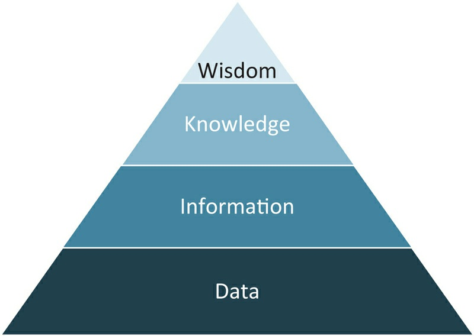
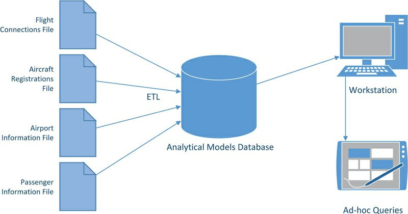
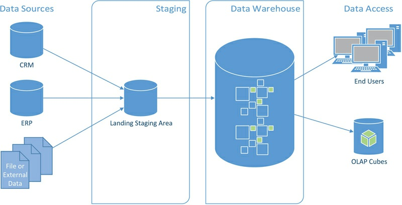
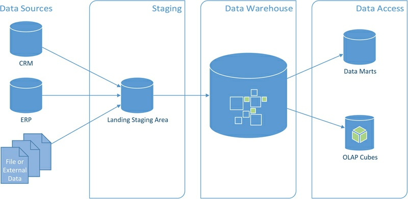

# Introduction to Data Warehousing(28-53)

[TOC]

## Abstract

When we use the terms `data` or `information`, we often use them interchangeably. However, both terms and the terms `knowledge` and`wisdom` have significant and discrete meanings. But they are also interrelated in the information hierarchy (Figure 1.1).

> FIGURE 1.1 The information hierarchy
>
> 

**Data**

**Data**, at the bottom of the hierarchy, are specific, objective facts or observations. Examples could be expressed as statements such as “Flight DL404 arrives at 08:30 a.m.” or “LAX is in California, USA.” Such facts have no intrinsic meaning if standing alone but can be easily captured, transmitted, and stored electronically [4, p12].

**Information** 

**Information** is a condensed form of the underlying data. Business people turn data into information by organizing it into units of analysis (e.g., customers, products, dates) and endow it with relevance and purpose [5, p45-53]. It is important for this relevance and purpose that the information is considered within the context it is received and used.
Managers from one functional department have different information needs than managers from other departments and view the information from their own perspective. In the same way, these information needs vary across the organizational hierarchy. As a rule of thumb, the higher an information user sits in the organizational hierarchy, the more summarized (or condensed) information is required [4, p12f].

**Knowledge**

**Knowledge**, towards the top of the information hierarchy, is information that has been synthesized and contextualized to provide value. Managers use information and add their own experience, judgment and wisdom to create knowledge, which is richer and deeper than information and therefore more valuable. It is a mix of the underlying information with values, rules, and additional information from other contexts.

**Wisdom**

The highest level of the pyramid is represented by **wisdom**, which places knowledge from the underlying layer into a framework that allows it to be applied to unknown and not necessarily intuitive situations [6]. Because knowledge and wisdom are hard to structure and often tacit, it is difficult to capture them on machines and hard to transfer [4, p13]. For that reason, it is not the goal of data warehousing to create knowledge or wisdom. Instead, data warehousing (or business intelligence) focuses on the aggregation, consolidation and summarization of data into information by transferring the data into the right context.

 **The information assets** 

Due to the value that information provides to users within the organization, the information assets must be readily available when the user requests them and have the expected quality. In the past, this analysis has been conducted directly on operational systems, such as an e-commerce store or a customer relationship management (CRM) system. However, because of the massive volumes of data in today’s organizations, the `extraction` of useful and important information from such raw data becomes a problem for the analytical business user [7, p1]. Another problem is that there are often isolated databases, called “data islands” in a typical organization. The only connections between these data islands and other data sources are business keys, which are used to identify business objects in both systems. Therefore, the `integration` of the disparate data sources has to be done on these business keys at some point but often exceeds the capabilities of the ordinary business analyst.

Users in operations often query or update data of a specific business
object in their daily work. These operations are performed using
`transactional queries`. Examples include the issue of a support ticket, the
booking of an airplane ticket or the transmission of an email. In these
cases, the operational user works on business objects that are part of
their business processes. Users within the middle or senior management
often have other tasks to complete. They want to get information from
the business or business unit that they are responsible for. They use this
information to make their managerial decisions. For that purpose, they
often issue analytical queries against the database to summarize data
over time. By doing so, they transform the raw data, for example sales
transactions, to more useful information, e. g., a sales report by month
and customer. Such `analytical queries are different from transactional
queries` because the first often aggregate or summarize a lot of raw data.
If a business user issues an analytical query against an operational
database, the relational database management system (RDBMS) has to
retrieve all underlying records from disk storage in order to execute the
aggregation.

## 1.1. History of Data Warehousing

**Slows down the operational database**

Before the emergence of data warehousing, users had to query required information directly from raw data stored in operational systems, as described in the introduction of this chapter. Such raw data is often stored in relational databases serving the user’s application. While querying an operational database has the advantage that business users are able to receive real-time information from these systems, using analytical queries to transform the raw data to useful information slows down the operational database. This is due to the aggregation that requires the reading of a large number of records on the fly to provide a summary of transactions (e.g., sales per month, earnings per year, etc.). Having both operational and analytical users on the same database often **overloads** the database and **impacts the usability** of the data for both parties [7, p1].

### 1.1.1. Decision Support Systems

**Decision Support Systems (DSS)**

In order to allow quick access to the information required by decision￾making processes, enterprise organizations introduced **decision support systems (DSS)**. Such systems combine various expandable and interactive IT techniques and tools to support managers in decision-making by processing and analyzing data.

**Load data from data sources**

To achieve its goals, a DSS is comprised of an analytical models database that is fed with selected data extracted from source systems. Source systems are the operational systems that are available within an organization, but can include any other source of enterprise data. Examples might include exchange rates, weather information or any other information that is required by managers to make informed decisions. The raw data is aggregated within the analytical models database or on the way into the system [1, p57] ETL (extract, transform, load) tools that have been developed to extract, transform, and load data from data sources to targets do the loading:

 **The data is aggregated  into the separated DSS by ETL**

The analytical models database in Figure 1.2 is loaded by an ETL process with data from five data sources. The data is then aggregated either by the ETL process (in the data preparation process) or when the business user queries the data. Business users can query the analytical models database with ad-hoc queries and other complex analysis against the database. In many cases, the data has been prepared for their purpose and contains only relevant information. Because the decision support system is separated from the source systems, interactions with the DSS will not slow down operational systems [7, p1].

> FIGURE 1.2 Decision support system
>
> 

**Next: The data backend of DSS**

The next section discusses **data warehouse systems** that are covered in
this book. These systems were introduced in the 1990s and have provided
the **data backend** of decision support systems since then [7, p3].

### 1.1.2. Data Warehouse Systems

**The data warehouse provides nonvolatile, subject-oriented data**

A data warehouse system (DWH) is a data-driven decision support system that supports the decision-making process in a strategic sense and, in addition, operational decision-making, for example real-time analytics to detect credit card fraud or on-the-fly recommendations of products and services [8]. The data warehouse provides nonvolatile, subject-oriented data that is integrated and consistent to business users on all targeted levels. `Subject orientation` differs from the `functional orientation` of an ERP or operational system by the focus on a subject area for analysis. Examples for subject areas of an insurance company might be customer, policy, premium and claim. The subject areas product, order, vendor, bill of material and raw materials, on the other hand, are examples for a manufacturing company [9, p29]. This view of an organization allows the integrated analysis of all data related to the same real-world event or object.

**Issues when the data is loaded into the DW.**

Before business users can use the information provided by a data warehouse, the data is loaded from source systems into the data warehouse. As described in the introduction of this chapter, the integration of the various data sources within or external to the organization is `performed on the business keys` in many cases. **This becomes a problem** if a business object, such as a customer, has `different business keys` in each system. This might be the case if a customer number in an organization is alphanumeric but one of the operational systems only allows numeric numbers for business keys. **Other problems** occur when the database of an operational system includes `dirty data`, which is often the case when invalid or outdated, or when no business rules are in place. Examples for dirty data include typos, transmission errors, or unreadable text that has been processed by OCR. Before such dirty data can be presented to a business user in traditional data warehousing,` the data must be cleansed`, which is part of the loading process of a data mart. **Other issues** include `different data types` or `character encodings` of the data across source systems [9, p30f]. However, there are exceptions to this data cleansing: for example, if data quality should be reported to the business user.

**Fit the required granularity**

`Another task` that is often performed when loading the data into the data warehouse is some **aggregation of raw data to fit the required granularity**(粒度). The granularity of data is the unit of data that the data warehouse supports. An example of different granularity of data is the difference between a salesman and a sales region. In some cases, business users only want to analyze the sales within a region and are not interested in the sales of a given salesman. Another reason for this might be legal issues, for example an agreement or legal binding with a labor union. In other cases, business analysts actually want to analyze the sales of a salesman, for example when calculating the sales commission. In most cases, data warehouse engineers follow the goal to load at the finest granularity possible, to allow multiple levels for analysis. In some cases, however, the operational systems only provide raw data at a coarse granularity.

**Keep  historic data**

An important characteristic of many data warehouses is that h**istoric data is kept.** All data that has been loaded into the data warehouse is stored and made available for `time-variant analysis`. This allows the analysis of changes to the data over time and is a frequent requirement by business users, e.g., to analyze the development of sales in a given region over the last quarters. Because the data in a data warehouse is historic and, in most cases, is not available anymore in the source system, the data is nonvolatile(非易失性) [9, p29]. This is also an important requirement for the auditability of an information system [10, p131].

**What's Next**

The next section introduces **Enterprise Data Warehouses**, which are a further development of data warehouses, and provides a centralized view of the entire organization.

## 1.2. The Enterprise Data Warehouse Environment

**EDW = DWs(all required subject areas)**

Enterprise data warehouses (EDW) have emerged from ordinary data warehouses, which have been described in the last section. **Instead of focusing on a single subject area for analysis, an enterprise data warehouse tries to represent all of an organization’s business data and its business rules.** The data in the warehouse is then presented in a way that all required subject areas are available to business users [11].

**Next requirements  for EDW **

The next sections present common business requirements for enterprise data warehouses.

### 1.2.1. Access

**Easy to connect  and understand**

Access to the EDW requires that the end-users be able to connect to the data warehouse with the proposed `client workstations`. The connection must be immediate, on demand and with high performance [12, pxxiii]. However, **access means much more for the users than the availability**, especially the business users: it should be **easy to understand** the meaning of the information presented by the system. That includes the `correct labelling` of the data warehouse contents. It also includes the availability of appropriate applications to analyze, present and use the information provided by the data warehouse [12, p3].

### 1.2.2. Multiple Subject Areas

** Because different requirements for the data to be analyzed**

Because every function or department of an enterprise has different requirements for the data to be analyzed, the enterprise data warehouse must **provide multiple subject** areas to meet the needs of its individual users. Each subject area contains the data that is relevant to the user. The data is requested and the data warehouse provides the expected version of the truth, which means that it follows the required definition of the
information [11].

**Data marts**

In order to achieve this goal, all `raw data` that is required for the subject areas is `integrated, cleansed, and loaded into` the `enterprise data warehouse`. It is then used to build `data marts` that have been developed for a specific subject area. Such data marts are also called `dependent data marts` because they depend on the data warehouse as the source of data. In contrast, `independent data marts`source the data directly from the operational systems. Because this approach requires the same cleansing and integration efforts as building the data warehouse, it is often simpler to load the data from a central data warehouse [13].

###  1.2.3. Single Version of Truth
###  1.2.4. Single Version of Facts
###  1.2.5. Mission Criticality
###  1.2.6. Scalability
###  1.2.7. Big Data
###  1.2.8. Performance Issues

### 1.2.9. Complexity

### 1.2.10. Auditing and Compliance

### 1.2.11. Costs

### 1.2.12. Other Business Requirements

## 1.3. Introduction to Data Vault 2.0

**Data Vault System and its dedication and components **

Data Vault really represents a `system of business intelligence`. The true
name of the **Data Vault System** is: `Common Foundational Warehouse
Architecture`. The system includes a number of aspects that relate to the
business of `designing, implementing, and managing a data warehouse`. A
bit of historical research into Data Vault 1.0 shows that `Data Vault 1.0 is
highly focused on Data Vault Modeling`, that is to say, a dedication(贡献) to the
physical and logical data models that **construct the raw enterprise data**
**warehouse**. `Data Vault 2.0`, on the other hand, has expanded, and includes
many of the necessary components for success in the endeavor of data
warehousing and business intelligence. **These components are**:
- Data Vault 2.0 Modeling – Changes to the model for performance and
  scalability

- Data Vault 2.0 Methodology – Following Scrum and Agile best practices

- Data Vault 2.0 Architecture – Including NoSQL systems and big-data
  systems

- Data Vault 2.0 Implementation – Pattern based, automation, generation
  CMMI level 5

Each of these components plays a key role in the overall success of an enterprise data warehousing project. These components are combined with industry-known and time-tested best practices ranging from CMMI (Capability Maturity Model Integration), to Six Sigma, TQM (total quality management) and PMP (Project Management Professional).

 `Data Vault 2.0 modeling` now includes changes that allow the models to interact
seamlessly with (or live on) NoSQL and Big Data systems. 

`Data Vault 2.0 Methodology` focuses on 2 to 3 week sprint cycles with adaptations and
optimizations for repeatable data warehousing tasks. 

`Data Vault 2.0 Architecture` includes NoSQL, real-time feeds, and big data systems for unstructured data handling and big data integration. 

`Data Vault 2.0 Implementation `focuses on automation and generation patterns for time savings, error reduction, and rapid productivity of the data warehousing team.

## 1.4. Data Warehouse Architecture

To meet technical expectations, data warehouse engineers can use `various architectures` to build data warehouses. **Common data warehouse architectures are based on layered approaches**, which is often the case in information systems. Two of these typical architectures are described in the next sections.

### 1.4.1. Typical Two-Layer Architecture

Kimball has introduced an often-used, two-layer architecture [24, p114]. In this architecture, which is presented in Figure 1.3, there are only two layers that are part of the data warehouse system itself.

> FIGURE 1.3 The Kimball Data Lifecycle
>
> 

**Purpose of the stage area **

The `raw data` from the `source systems` is loaded into the `stage area`. The **goal** is to have an exact copy of all data that should be loaded into the data warehouse. The **main purpose** of the stage area is to reduce the number of operations on the source system and the time to extract the data from it. **The tables in the stage area are modeled after the tables in the source system.** A stage area is required when the transformations are complex and cannot be performed on-the-fly or when data arrives from multiple source systems at different times [17, p33].

**DW is modeled after the dimensional model and made up of data marts**

Once the `data` has been loaded to the` stage area`, Kimball suggests loading the data into the `data warehouse`. This data warehouse has been modeled after the `dimensional model` and is made up of `data marts` (representing the business processes), “bound together with […] conformed dimensions” [25]. It was first proposed by Kimball in 1996.`The dimensional model` **is a de-facto standard that is easy to query by business users and analytical tools**, such as OLAP front-ends or engines. Because it is a logical association of conformed data marts, business rules have to be implemented before the data warehouse layer in order to conform and align the datasets. We will discuss dimensional modeling in Chapter 7, Dimensional Modeling. `Data access applications `use the `dimensional model `to present the information to the user and allow ad-hoc analysis.

**Advantage and disadvantage** 

The advantage of a `two-layered architecture` is that it is easy **to build** a `dimensional store` from the `source data` as compared to other architectures. However, the disadvantage is that it is more complex to build a `second dimensional model `from the same `source data` because the data needs to be loaded again from the `staging`. It is not possible to reuse existing ETL packages [17, p34f].

### 1.4.2. Typical Three-Layer Architecture

To overcome the limitations of a two-layer architecture, another commonly found architecture is based on three layers (Figure 1.4).

> FIGURE 1.4 The Inmon Data Warehouse
>
> 

**Atomic data warehouse**

This architecture has been introduced by Inmon and introduces an `atomic data warehouse`, often a normalized `operational data store ` [(ODS)](https://zh.wikipedia.org/wiki/ODS)between the `staging area` and the `dimensional model`. The stage area in this architecture follows that of the two-layer architecture. The `data warehouse`, however, holds` raw data` modeled in a `third-normal form`[(第三范式)](https://zh.wikipedia.org/wiki/%E7%AC%AC%E4%B8%89%E6%AD%A3%E8%A6%8F%E5%8C%96). It integrates all data of the enterprise, but is still based on physical tables from the source systems. By doing so, it acts similarly to a large operational database.

**Easier to create new `data marts `from the data available**

On top of the normalized view of the `business data`, **there is** a `dimensional model`. Business users can access and analyze the data using subject-oriented data marts, similar to the two-layer architecture. However, it is much easier to **create new `data marts `from the data available** in the `operational data store` because the data is already cleaned and integrated. Therefore, it is not required to perform data cleaning and integration for building new data marts [17, p38]. In practice, two-layer data warehouses often have multiple data marts, serving the requirements by heterogeneous user groups, by providing different subject areas to its users.

**Changes to the data model can become a burden**

However, it is more complex and requires more data processing to build the `entire data warehouse`, including the operational data store and the dependent data marts. Another problem is that changes to the data model can become a burden if many data marts depend on the operational data store. We will discuss an alternate, three-layer architecture to enable faster changes to the data warehouse in the next chapter.