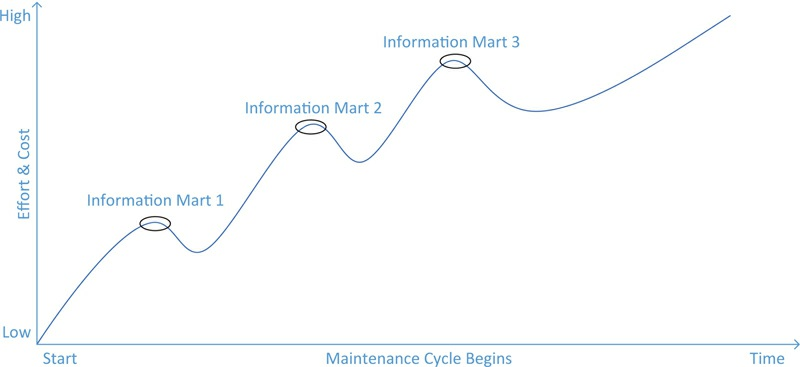

# Scalable Data Warehouse Architecture(53-79)

[TOC]

## Abstract

**Architectural Dimensions**

`Scalable data warehouses`, as a desired `solution` to some of the problems introduced in the previous chapter, have specific `architectural dimensions` that are explained in this chapter, including `workload, data complexity, query complexity, availability and data latency`.

**Architecture of a Data Vault-based DW**

This chapter introduces the `architecture` of a Data Vault-based data warehouse, including the` stage, data warehouse, and information mart layers`. In addition, it shows how to use a business vault and other components of the proposed architecture.

### KeyWords

```
data complexity
query complexity
data latency
data warehouse
data vault
data architecture
```

**Iterative development process**

Today’s data warehouse systems make it easy for analysts to access `integrated data`. In order to achieve this, the data warehouse `development team` had to process and model the data based on the requirements from the user. The best approach for developing a data warehouse is an `iterative development process` [1]. That means that the `functionality` of the `data warehouse`, as requested by the business users, is designed, developed, implemented and deployed in` iterations`(sometimes called a sprint or a cycle). In each iteration, more functionality is added to the data warehouse. This is opposite to a “big￾bang” approach where all functionality is developed in one large process and finally deployed as a whole.

**Effort to add another functionality**

However, when executing the project, even when using an iterative approach, the effort (and the costs tied to it) to add another functionality usually increases because of existing dependencies that have to be taken care of.

**Increasing effort for creating new information mart**

Figure 2.1 shows that the effort to implement the first` information mart `is relatively low. But when implementing the `second information mart`, the development team has to maintain the existing `solution` and take care of existing `dependencies`, for example to `data sources` integrated for the `first information mart` or `operational systems` consuming information from existing tables. In order to make sure that this previously built `functionality` doesn’t break when deploying the new functionality for the second information mart, the old functionality has to be retested. In many cases, the existing solution needs to be refactored to maintain the functionality of the individual information marts when new sources are added to the overall solution. All these activities increase the effort for creating the second information mart and, equally,
any subsequent information mart or other new functionality. This `additional effort` is depicted as the rise of the graph in Figure 2.1: once the first information mart is produced, the solution falls into a `maintenance mode` for all existing functionality. The next project implements another information mart. To implement the second information mart, the effort includes adding the new functionality and maintaining the existing functionality. Because of the dependencies, the `existing functionality` needs to be `refactored and retested` regularly.

> FIGURE 2.1 The maintenance nightmare
>
> 


In other words, the extensibility of many `data warehouse architectures`, including those presented in Chapter 1, Introduction to Data Warehousing, is not optimal. Furthermore, typical `data warehouse architectures` often lack `dimensions` of scalability other than the described dimension of extensibility. We discuss these `dimensions` in the next section.


## 2.1. Dimensions of Scalable Data Warehouse Architectures

**Scalability has multiple dimensions**

Business users of `data warehouse systems` expect to load and prepare more and more `data`, in terms of `variety, volume, and velocity`. Also, the `workload` that is put on typical data warehouse environments is increasing more and more, especially if the initial version of the warehouse has become a success with its first users. Therefore, **`scalability` has multiple `dimensions`.**

### 2.1.1. Workload 	

**two issues regarding the `workload` of the system**

The` enterprise data warehouse (EDW)` is “by far the largest and most computationally intense business application” in a typical enterprise. `EDW systems` consist of huge `databases`, containing `historical data` on volumes from multiple gigabytes to terabytes of storage [4]. **Successful `EDW systems` face two issues regarding the `workload` of the system**: first, they experience **rapidly increasing** data volumes and application workloads and, second, an **increasing number of concurrent users** [5]. In order to meet the performance requirements, EDW systems are implemented on large-scale parallel computers, such as `massively parallel processing (MPP)` or `symmetric multiprocessor (SMP)` system environments and `clusters` and `parallel database software`. In fact, most medium- to large-size data warehouses could not be implementable without larger-scale parallel hardware and parallel database software to support them [4].

**more required**

In order to handle the requested workload, there is **more required** than parallel hardware or parallel database software. The `logical and physical design` of the `databases` has to be optimized for the expected `data volumes` [6–8].

### 2.1.2. Data Complexity

Another `dimension` of `enterprise data warehouse `scalability is data
complexity. The following factors contribute to the growth of data
complexity [9]:

- **Variety of data**: nowadays, enterprise organizations capture more than just traditional (e.g., relational or mainframe) master or transactional data. There is an increasing amount of semi-structured data, for example emails, e-forms or HTML and XML files and unstructured data, such as document collections, social network data, images, video and sound files. Another type of data is sensor- and machine-generated data, which might require specific handling. In many cases, enterprises try to derive structured information from unstructured or semi-structured data to increase the business value of the data. While the files may have a structure, the content of the files doesn’t have one. For example, it is not possible to find the face of a specific person in a video without fully processing all frames of the video and building metadata tags to indicate where faces appear in the content.

- **Volume of data**: the rate at which companies generate and accumulate new data is increasing. Examples include content from Web sites or social networks, document and email collections, weblog data and machine-generated data. The increased data volume leads to much larger data sets, which can run into hundreds of terabytes or even into petabytes of data or beyond.

- **Velocity of data**: not only the variety and volume of data increases, but the rate at which the data is created also increases rapidly. One example is financial data from financial markets such as the stock exchange. Such data is generated at very high rates and immediately analyzed in order to respond to changes in the market. Other examples include credit card transactions data for fraud detection and sensor data or data from closed-circuit television (CCTV), which is captured for automated video and image analysis in real-time or near-real-time. 
- **Veracity (trustworthiness) of data**: in order to have confidence in data, it must have strong data governance lineage traceability and robust data integration [10].

### 2.1.3. Analytical Complexity

### 2.1.4. Query Complexity

### 2.1.5. Availability

### 2.1.6. Security


## 2.2. Data Vault 2.0 Architecture

**Addresses the extensibility and dimensions of scalability**

The `Data Vault 2.0 architecture` **addresses the extensibility and dimensions of scalability** as defined in the previous section by **modifying** a typical `three-layer data warehouse architecture`, which has been introduced in the previous chapter.

**Primary purpose of  EDW**

As we have outlined in Chapter 1, the primary **purpose** of an `enterprise data warehouse` is to provide and present information – that is, aggregated, summarized and consolidated data put into context. To emphasize this ultimate `EDW` goal, we prefer the term` information mart `over `data mart` (which is the term typically used in the BI community).

**Modifications**

Other **modifications** to the `typical architecture` from Chapter 1 include:

- A `staging area` which does not store historical information and does not apply any changes to the data, except ensuring the expected data type.
- A `data warehouse layer` modeled after the `Data Vault modeling technique`.
- One or more `information mart layers` that depend on the `data warehouse layer`.
- An **optional**` Metrics Vault` that is used to capture and record `runtime information`.
- An **optional** `Business Vault` that is used to store information where the `business rules` have been applied. In many cases, the `business rules` change or alter the `data` when transforming it into useful `information`. This is another type of `information mart`.
- An **optional** `Operational Vault` that stores data fed into the data warehouse from `operational systems`.
- Capabilities for **managed** `self-service BI` to allow business users to perform their own data analysis tasks without involvement of IT, including write-back of information into the `enterprise data warehouse` layer.

**Optional Vaults** 

All **optional** Vaults – the `Metrics Vault`, the `Business Vault` and the `Operational Vault` – are part of the `Data Vault` and are integrated into the `data warehouse layer`. The reference architecture in the Data Vault 2.0 standard is presented in Figure 2.2.

> FIGURE 2.2 Data Vault Architecture
>
> 

**Data Vault Architecture**

The `Data Vault 2.0 architecture` is **based on** three layers: the `staging area`, which collects the raw data from the source systems; the `enterprise data warehouse` layer, modeled as a Data Vault 2.0 model; and the `information delivery layer`, with `information marts` as `star schemas` and other structures. The architecture supports both `batch loading` of source systems and `real-time loading` from the `enterprise service bus (ESB)` or any other `service-oriented architecture (SOA)`. But it is also possible to integrate unstructured `NoSQL database systems` into this architecture. Due to the **platform independence** of `Data Vault 2.0`, **`NoSQL` can be used for every data warehouse layer**, including the `stage area`, the `enterprise data warehouse` layer, and `information delivery`. Therefore, the `NoSQL database` could be used as a staging area and load data into the relational Data Vault layer. However, it could also be integrated both ways with the Data Vault layer via a hashed business key. In this case, it would become a `hybrid solution` and `information marts `would consume data from both environments.

However, `real-time` and `NoSQL systems` are out of the scope of this book. Therefore, we will concentrate on the `relational pieces of the architecture`.

**Biggest differences to`typical architectures`**

One of the **biggest differences** from `typical data warehouse architectures` is that **most** `business rules` are enforced when building the `information marts`, and by that are moved towards the end-user. In the Data Vault, there is a **distinction** between hard and soft `business rules`.This distinction is discussed in the next section.


### 2.2.1. Business Rules Definition

**Hard business rules**

In `Data Vault 2.0` we distinguish between **hard and soft** `business rules`. Generally stated, `business rules` modify the `incoming data` to **fit the requirements** of the business. The `distinction` between **hard** and **soft** `business rules` is that `hard business rules` are the `technical rules` that align the data domains, so-called data type matching. For example, a typical `hard business rule` is the truncation of source strings that are longer than defined in the stage table. `Hard business rules` are enforced **when** the data is extracted from the `source systems` and loaded into the `staging area`. These `business rules` affect only the enforcement of `data types` (such as string length or Unicode characters) but don’t convert any values to fit the `analytical requirements` of the business (such as converting between US units and metric units). Other examples of `hard business rules` include the **normalization** of hierarchical COBOL copybooks from `mainframe systems` or `XML structures`. Also `system column computations` are examples of hard business rules. As a rule of thumb, **`hard business rules` never change the meaning of the incoming data, only the way the data is stored.**

**Soft business rules**

Opposite from hard business rules, `soft business rules` enforce the business requirements that are stated by the business user. These `business rules` **change** the data or the meaning of the data, for example by modifying the grain or interpretation. Examples include the  `aggregation of data`, e.g. allocating the data into categories like income￾band, age groups, customer segments, etc., or the `consolidation of data` from `multiple sources`. **`Soft business rules` define how the data is aggregated or consolidated. They also define how the data is transformed to meet the requirements of the business.**

### 2.2.2. Business Rules Application

**Implementing hard business rules.**

Because we have to align the `data types` of the `source system` to those of the `staging area tables`, we have to enforce `hard business rules` when **loading** the `staging area` (Figure 2.3). This is performed **at the latest** when inserting the data into the `staging area tables` because the `database management server` will check the data types of the inserted data and raise an exception if it is not possible to convert the incoming data to the data type specified in the data definition of the column. This is the case if we try to insert an alphanumeric customer number into an integer-based column, for example, because we expected customer numbers of type “integer.” We can support this process by adding `data type conversion logic` into the `ETL data flow` that loads the data into the `staging area`. By doing so, we’re also implementing hard business rules.

> FIGURE 2.3 Application of hard and soft business rules in a Data Vault enterprise data warehouse.
>
> 


**Risk if data violate rule**

`Hard business rules` pose a `risk` to our `ETL routine`s because if the data **violate** the rule and this case has not been accounted for, the `ETL routine` will stop and break the `loading process`. This is different from `soft business rules`, which only change the data or the data meaning. Therefore, we need to treat `hard business rules` differently from `soft business rules`. We achieve this by **separating** both rule types from each other.

 **The early implementation of `business rules`** 

In typical `data warehouse systems`, for example the `two- and three-layer architectures` described in the previous chapter, `soft rules` are also applied early in the `loading process` of the `data warehouse`. This is due to the fact that the `data warehouse layer` is either a `Kimball style star-schema` or a `normalized data warehouse` in` third-normal form`. In order to fit the data into such structures, the `loading ETL data flows` have to transform the data to meet the `business requirements` of the user. This transformation is in effect the implementation of the `soft business rules`, including required aggregations or consolidation of incoming data. The **early implementation** of `business rules` improves the common application of the rules and generally improves the data quality [20].

**More dependencies problem**

The problem, however, arises with **changes** to those `business rules`. **The earlier** the `business rules` are implemented in the `architecture` of a `data warehouse`, **the more** dependencies it has in `higher layers` of the `data warehouse`.


#### **Aviation Industry Example**

**aircraft registration number**

Consider the following example from the aviation industry: **the `aircraft registration number` is a standardized alphanumeric identifier for `aircraft` and is used world-wide.** Each number has a `prefix` that indicates the country where the aircraft is registered. For example, the registration number “D-EBUT” originates from Germany (because of the prefix “D”). Numbers from Germany are actually “`smart keys`” a concept that is described in more detail in Chapter 4, Data Vault Modeling. In the case of the German aircraft with the registration “D-EBUT” , the second character indicates that the plane is a `single-engine aircraft`. In the US, the prefix “N” is common. Until December 31, 1948, there was also a second prefix (the second letter in the number) that was used to indicate the `category` of the aircraft (see Table 2.1).

> Table 2.1Category Prefixes in the USA until December 1948
>
> 

For example, the aircraft with the registration number `N-X-211` is registered in the `experimental category`.

However, the `FAA` decided to stop using the second prefix and now issues `numbers` between 3 (N1A) and 6 characters (N99999) without any other meaning, except for the `first prefix` which indicates the origination country. In fact, the `second letter` is always a number between 1 and 9.

**Effect of  business rule change on `data warehouse`**

Now, consider the effect of this change on your `data warehouse`. If the `category` has been **extracted** from the (now historic) `N-Number`, the `second letter` would be used to identify the `aircraft category` just after loading the data from the `stage area` into the `normalized data warehouse`, where the `category` would most probably be a column in `the aircraft table`. Once the numbers change, however, there would be only a number between 1 and 9 in the second position of the registration number, which has no meaning. In order to update the `business rule,` the easiest `approach` would be to introduce a new category (“Unknown category”) where those aircraft are mapped to if the second letter in the `registration number` is from 1 to 9. However, because there will be no new aircraft with a category other than the unknown, it is reasonable to remove the `category` completely (unless you focus on the analysis of historic aircraft). That makes even more sense if you consider that today’s aircraft are categorized by the `operation code`, `air-worthiness` class, and other categories at the same time, making the `categorization` in Table 2.1 obsolete.

**Approach to fit the `business rule`change**

Therefore, this change in the `business rule` requires the replacement of the category by multiple new `categories`. In the normalized `data warehouse`, we would have to remove the old `category column` and add multiple `category references` to the aircraft. After changing the `ETL jobs` that load the data from the stage into the normalized data warehouse, we can change the `information mart` that is built on top of the data warehouse layer and modify the `data mart ETL routines`. A couple of questions arise when using this approach:

- How do we deal with `historic data` in the normalized `data warehouse`?
- Where do we keep the `historic data` for later analysis (if required by the business at a later time)?
- How do we analyze both `historic aircraft` and `modern aircraft` (a business decision)?
- Will there be multiple `dimensions` (for the `historic category` and the `modern categories`) in the same `information mart` or multiple `information marts` for historic and modern aircraft?
- What is the `default value` for the `historic category` in `modern aircraft`?
- What are the `default values` for the `modern categories` in `ancient aircraft`?


**Close old satellite** 

In the `Data Vault 2.0 architecture`, the `categorization` of an aircraft would be loaded into a table called a `satellite` that contains descriptive data (we explain the base entities of Data Vault 2.0 modeling in Chapter 4 in detail). When the logic in the `source system` changes – in this case, the format of the N-Number – the old `satellite` is **closed** (no new data is loaded into the current `satellite`). All new data is loaded into a new `satellite` with an `updated structure` that meets the structure of the source data. In this process, there are no `business rules` implemented. All data is loaded. Because there are now two `tables`, one holding `historic data` and the other `new data`, it is easy to implement the `business rule` when loading the data from the `Data Vault` into the `information mart`. It is also easy to build **one** `information mart` for the analysis of historic, older aircraft and **another** `information mart` for the analysis of modern aircraft that have been built after 1948.

 **Real advantage of separating hard and soft rules** 

But the real **advantage** of separating `hard and soft rules` becomes clear when thinking about the `ETL jobs` that need to be adapted to fit the new `categorization`: none. The `ETL jobs` that load the `historic data` remain unchanged and are ready to load more `historic data` if required (for example, to reload `flat files` from the `archive`). The new data is loaded to another target (the second satellite) and is therefore a modified copy of the “historic” `ETL routine`. Nothing needs to be changed, except the `information mart` (and its loading routines).


### 2.2.3. Staging Area Layer

**Primary purpose**

The `staging layer` is used when **loading batch data** into the `data warehouse`. Its **primary purpose** is to extract the source data as fast as possible from the `source system` in order to **reduce** the `workload` on the `operational systems`. In addition, the `staging area` allows the execution of SQL statements against the source data, which might not be the case with direct access to `flat files`, such as CSV files or Excel sheets.

**The `exception` and purpose of having no history in the `staging area`** 

Note that the `staging area` does not contain `historical data`, unlike the `traditional architectures` described in the previous chapter. Instead only the `batch` that has to be loaded next into the `data warehouse layer` is present in the `staging area`. However, **there is an `exception` to this rule**: if there are `multiple batches` to be loaded, e.g., when an `error` happened on the weekend and the data from the last couple of days has to be loaded into the `data warehouse`, there might be `multiple batches` in the `staging area`. The **primary purpose** of **having no history** in the `staging area` is not to have to deal with `changing data structures`. Consider the fact that a `source table` might change over time. If the `staging area` kept historic data, there would have to be `logic` in place for defining the `loading procedures` into the data warehouse. This `logic`, in fact `business rules`, would become more and more complex over time. As we have described in the previous section, the **goal** of the `Data Vault 2.0 architecture` is to move complex business rules towards the end-user in order to ensure quick adaption to changes.

**Difference between `StagingArea` and `SourceSystem`**

The `staging area` consists of `tables` that duplicate the structures of the source system. This includes all the `tables` and `columns` of the `source`, including the `primary keys`. **However, `indexes` and `foreign keys`, which are used to ensure the referential integrity in the `source system`, are not duplicated.** In addition, all `columns` are nullable because we want to allow the `data warehouse` to load the `raw data` from the `source system`, including `bad data` that might exist in the source (especially in `flat files`). The only business rules that are applied to the incoming data are so￾called `hard business rules`. It is common practice to keep the original names from the `source system` for **naming** `tables` and `columns`; however,this is not a must.

**Common Divide Column**

In addition to the columns from the `source system`, each `table` in the `stage area` includes:

• A sequence number
• A timestamp
• A record source
• Hash key computations for all business keys and their combinations

**`Metadata` information for loading data into  `Data Warehouse`**

These `fields` are `metadata information` that is **required** for loading the data into the next layer, the `Data Warehouse` layer, later on. The `sequence number` identifies the order of the data in the source system. We can use it when the order within the source is important for loading the data into the `data warehouse`, e.g., RSS news feeds or `transactional data` without `timestamp information` included. The `timestamp` is the `date` and `time` when the record arrives in the `data warehouse`. The `record source` indicates the `source system` from which the data record originates and the `hash key` is used for identification purposes. A detailed description of these columns is provided in Chapter 4.


### 2.2.4. Data Warehouse Layer

**Features of Data Warehouse**

The second layer in the `Data Vault 2.0 architecture` is the `data warehouse`, the purpose of which is to **hold all historical, time-variant** data. The `data warehouse` holds `raw data`, not modified by any `business rule` other than `hard business rules`. Therefore, the data is stored in the granularity as provided by the `source systems`. The data is `nonvolatile` and every change in the `source system` is **tracked** by the `Data Vault structure`. Data from multiple `source systems`, but also within a `source system`, is integrated by the `business keys`, discussed in Chapter 4. Unlike the `information mart`, where the information is subject-oriented, the data in the `Data Vault` is `function-oriented`.

**Loading Type**

In `batch loading`, the data is fed from the `staging area`, but in `real-time loading` the data is fed directly from the `enterprise service bus (ESB)` into the data warehouse. However, as stated before, real-time data warehousing is beyond the scope of this book. We cover the loading of operational data in Chapter 12, which is also applied directly to the `data warehouse` and follows similar patterns.

**Raw Data Vault layer**

The `data warehouse layer` is modeled after the `Data Vault 2.0 modeling technique`, which is examined in Chapter 4 to Chapter 6. This layer is often called the `Raw Data Vault layer`, as it holds `raw data`, modeled using the D`ata Vault 2.0 model`.


### 2.2.5. Information Mart Layer


**`information mart`for `end-user`**

Unlike `traditional data warehouses`, the `data warehouse layer` of the `Data Vault 2.0 architecture` is not directly accessed by end-users. Typically, the end-user accesses only the `information mart` which provides the data in a way that the end-user feels most comfortable with. Because the **goal** of the `enterprise data warehouse` is to provide valuable information to its `end-users`, we use the term `information` instead of `data` for this layer. The `information` in the `information mart` is **subject oriented** and can be in aggregated form, flat or wide, prepared for reporting, highly indexed, redundant and quality cleansed. It often follows the `star schema` and forms the `basis` for both `relational reporting` and `multidimensional OLAP cubes`. Because the `end-user` accesses only this layer of the `data warehouse`, having a `Data Vault model` in the `data warehouse` layer is transparent to the `end-user`. If the `end-user` requires a normalized `data warehouse` in `third-normal form`, we can also provide an `information mart` that meets those needs. Front-end tools are also able to write-back information into the `enterprise data warehouse` layer.

**`Error Mart` and the `Meta Mart`**

Other examples for `information marts` include the `Error Mart` and the `Meta Mart`. They are the central location for errors in the `data warehouse` and the `metadata`, respectively. Being the central location of this data is also the difference of these two special marts from `standard information marts`: unlike `information marts`, the `Error and Meta Marts` cannot be rebuilt from the `Raw Data Vault` or any other data source. However, they are similar because `end-users`, such as administrators, use these marts to analyze `errors` in the `loading process` or other problems in the `data warehouse`, or the `metadata` that is stored for the `data warehouse`, its sources and transformations that lead to the information presented in the `information marts`. Chapter 14, Loading the Dimensional Information Mart, provides an extensive discussion about how to load the `information mart` for `dimensional OLAP cubes` from the `Data Vault 2.0 structures` in the data warehouse.


### 2.2.6. Metrics Vault

**Optional extensions**

While the three previous layers (the `staging area,` the `data warehouse layer`, and the `information marts`) are mandatory(强制) in the `Data Vault 2.0 architecture` (except for real-time cases which are not covered in this book), the `Metrics Vault` (covered in this section), the `Business Vault` (covered in section 2.2.7) and the `Operational Vault` (covered in section 2.2.8) are optional extensions to the Data Vault 2.0 architecture.

**The `Metrics Vault` **

**The `Metrics Vault` is used to capture and record runtime information,including the `run history`, `process metrics`, and `technical metrics`,** such as CPU loads, RAM usage, disk I/O metrics and network throughput. Similar to the `data warehouse`, the `Metrics Vault` is modeled after the `Data Vault 2.0 modeling technique`. The data is in its `raw format`, system or process driven and nonauditable. It might include technical `meta-data` and technical `metrics of the ETL jobs` or the `data warehouse environment`. On top of the `Metrics Vault`, the `Metrics Mart` provides the `performance metrics information` to the user.


Chapter 10, Metadata Management, includes an example of how to **track** audit information during `ETL loads` and store the data into a `Metrics Vault`.


### 2.2.7. Business Vault

**Creation and perpose of Business Vault**

Because some `business rules` that are applied to the `Data Vault 2.0 structures` tend to become complex, there is the `option` to add `Business Vault structures` to the `data warehouse layer`. The `Business Vault` is a sparsely modeled `data warehouse` based on `Data Vault design principles`, but houses `business-rule` changed data. In other words, the data within a `Business Vault` has already been changed by business rules. In most cases, the `Business Vault` is an `intermediate layer` between the `Raw Data Vault` and the `information marts` and **eases** the `creation` of the end-user structures.

**What Business Vault can do**

Figure 2.4 shows the `Business Vault` on top of the `Data Vault` `enterprise data warehouse`. This is because the `Business Vault` is **preloaded** before the `information marts` are loaded and **eases** their loading processes. The complex `business rules` (the soft rules) source their data from both the `Raw Data Vault` and the `Business Vault` entities.


>FIGURE 2.4 Business Vault is located within the Data Vault enterprise data warehouse.
>
>

 **it is possible to drop and regenerate the `Business Vault`** 

While the `Business Vault` is modeled after `Data Vault 2.0 design principles`, it doesn’t have the same `requirements` regarding the auditability of the` source data`. Instead, it is possible to **drop and regenerate** the `Business Vault` from the `Raw Data Vault` at any time. The `Business Vault` provides a consolidated(整理过的，整合的) view of the data in the `Raw Data Vault` to the developers who populate the `information marts`.

**An`extension` to the `Data Vault model` **

Similar to the `Metrics Vault`, the `Business Vault` is not stored in a separate layer. Instead, it is stored as an `extension` to the `Data Vault model` within the `data warehouse layer`. Chapter 14, Loading the Dimensional Information Mart, shows how to use a `Business Vault` to populate(填充) an `information mart`. 


### 2.2.8. Operational Vault

**`Operational Vault` is an `extension` to retrieve from  or write to `EDW`**

The `Operational Vault` is an `extension` to the `Data Vault` that is directly accessed by `operational systems` (Figure 2.5). There are occasions when such `systems` need to either **retrieve** data from the `enterprise data warehouse` or when they need to **write** data back to it. Examples include `master data management (MDM) systems`, such as `Microsoft Master Data Services (MDS)` or `metadata management systems`. In both cases, there is an advantage of directly operating on the `data warehouse layer` instead of using an `information mart` or `staging area`. Other cases include `data mining applications` that directly analyze the `raw data` stored within the `data warehouse layer`. Often, whenever the interfacing applicationrequires real-time support, whether reading or writing, direct access to the `Operational Vault` is the best option.

> FIGURE 2.5 Operational Data Vault [21].
>
> 

 **`Data Vault structures` become `Operational Vault structures`**

For that reason, integration of real-time data from a `service-oriented architecture `[(SOA)](https://zh.wikipedia.org/wiki/%E9%9D%A2%E5%90%91%E6%9C%8D%E5%8A%A1%E7%9A%84%E4%BD%93%E7%B3%BB%E7%BB%93%E6%9E%84) or `enterprise service bus` [(ESB)](https://zh.wikipedia.org/wiki/%E4%BC%81%E4%B8%9A%E6%9C%8D%E5%8A%A1%E6%80%BB%E7%BA%BF) directly writes into the `Operational Vault`. While we have defined the `Operational Vault` as an `extension` to the `Data Vault` in the opening of this section, interfacing applications read directly from existing `Data Vault structures`. Thus, **the `Data Vault structures` become, to some extent, `Operational Vault structures`.**


### 2.2.9. Managed Self-Service BI

**Experience about limited IT resources**

A common experience in `data warehousing projects` is that, after initial success of the data warehousing initiative, `business` demands more and more features. However, due to `limited team resources` in IT, not all `requests` by the business can be met. In many cases, the requested `functionality` is only important or applicable to a limited number of `business users` or has a low `business impact`. Yet, it is important for those who demand it. But `IT` has to prioritize their requests in order to use their own `IT resources` responsibly, with the effect of delayed or completely discarded new features. This low `responsiveness` to business requests increases discomfort among `business users`.

**Problems with this self-service approach** 

An approach called `self-service BI` allows `end-users` to completely circumvent(绕开) IT due to its `unresponsiveness`. In this approach, `business users` are left on their own with the `whole process` of sourcing the data from `operational systems`, integration, and consolidation of the `raw data`. There are many `problems` with this self-service approach that lacks the involvement of IT:

- **Direct access to source systems**: `end-users` should not directly access the data from source systems. This exposes `raw data` that is potentially private and allowing access to this data might circumvent security access, which is implemented in `access control lists (ACLs)`.
- **Unintegrated raw data**: when sourcing `data` from multiple `source systems`, `business users` are left alone with `raw data integration`. This can become a tedious and error-prone task if performed manually (e.g., in Microsoft Excel).
- **Low data quality**: data from `source systems` often have issues regarding the `data quality`. Before using the data for analysis, it requires `clean up`. Again, without the right tools, this can become a `burden` to the `end-user`. Or, and that is the worst case, it just doesn’t happen.
- **Unconsolidated raw data**: in order to analyze the `data` from `multiple source systems`, the data often requires `consolidation`. Without this `consolidation`, the results from business analysis will be meaningless.
- **Nonstandardized business rules**: because `end-users` are dealing with only the `raw data` in `self-service BI`, they have to implement all `business rules` that transform the `raw data` into `meaningful information`. But who checks whether this implementation is consistent with the rest of the organization?

**Much manually and error-prone work** 

In many cases, `end-users` – even if they are power users with knowledge of `SQL`, `MDX`, and other techniques – don’t have the` right tools` available to solve the tasks. Instead, much work is done manually and is error-prone.

 **Compromise between `IT agility` and `data management`**


But from our experience, it is not possible to completely prevent such `power users` from obtaining `data` from `source systems`, preparing it, and eventually reporting the `data` to `upper management`. **What organizations need is a compromise between `IT agility` and `data management`** that allows` power users` to obtain the `data` they need quickly, in a usable quality.

**How DV2.0 overcome these problems**

To overcome these problems, the `Data Vault 2.0 standard `allows experienced or advanced `business users` to perform their own `data analysis tasks` on the `raw data` of the `data warehouse`. In fact, a `Data Vault 2.0` powered `IT` welcomes `business users` to take the data that is available in the `enterprise data warehouse` (either in the` Raw Data Vault` or in the `Business Vault`) and use their own tools to transform the data into meaningful information. This is because` IT `just cannot deliver the requested `functionality` in the given `time frame`. Instead, `IT` sources the `raw data` from `operational systems` or other `data sources `and integrates it using the` business key` for the `Raw Data Vault`. IT might also create `Business Vault` structures to provide a `consolidated view` on parts of the model or precalculate `key performance indicators (KPIs) `to ensure consistency among such calculations.

**How `business user`create `local information marts`** 

The `business user` then uses the `raw data` (from the` Raw Data Vault`) and the `business data` (from the `Business Vault`) to create `local information marts` using specialized tools. These tools **retrieve** the `data` from the `enterprise data warehouse`, apply a set of `user-defined business rules` and present the `output` to the `end-user`.

**How `managed self-service BI`work**

This `approach` is called `managed self-service BI` and is part of the `Data Vault 2.0 standard`. In this approach, `IT` evolves(进化) to a `service organization` that provides those `power users` with the `data` they want, in the `timeframe` they need. **The data is integrated by its `business key`, and, if the` end-user `wants it, can be consolidated and quality checked.** `Consolidation` and `quality checks` occur on the way into the `Business Vault`, as we will show later in this book. The `Business Vault` also implements some of the most important `business rules`. The power user has direct access to both the `Raw Data Vault` and the `Business Vault` and can, depending on the task at hand, select the `raw data` or the `consolidated, cleaned data`. In fact, both types of data are already integrated, so the `business user` can also join `consolidated data` with `raw data` from `specific source systems`.

**`managed self-service BI` can be accomplished in short `sprint iterations`**

This book will demonstrate that loading the `raw data` into the `Raw Data Vault` is very easy, including integration using the `business keys`. In fact, it can be accomplished in short `sprint iterations`, as we will explain in Chapter 3, Data Vault 2.0 Methodology. When users ask for more data, and this data is not available in the `data warehouse`, it is possible to source and integrate the data into the `Raw Data Vault` to provide it to the `power user` for a managed self-service BI task.

### 2.2.10. Other Features

**additional capabilities for RT,NoSQL...**

The `Data Vault 2.0 architecture` offers additional capabilities to support `real-time (RT) `and `near-real-time (NRT) `environments, `unstructured data` and `NoSQL environments`. However, a description of these options is out of the scope of this book.

 **Two other `fundamental pillars` of DV2.0**

This chapter introduced the` Data Vault 2.0 architecture`, a fundamental item in the` Data Vault 2.0 standard`. The next two chapters will focus on the `project methodology` and `Data Vault modeling`, two other `fundamental pillars` of the `Data Vault 2.0 standard`.


