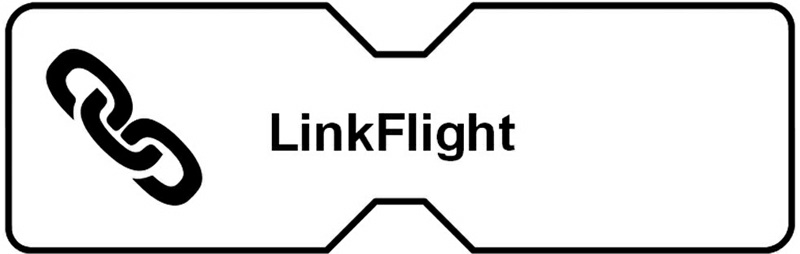
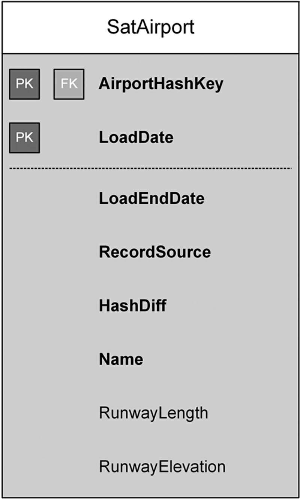

# Data Vault 2.0 Modeling(159-212)

[TOC]


## Abstract

This chapter introduces the `entities` used in `Data Vault modeling`, including `hubs`, `links` and `satellites`. It shows how to identify `business keys` in the source extracts and link them to other `business keys` in the `Data Vault` using `link` entities. The chapter also shows how to identify `additional attributes` in the source extracts and how to `model` them as `satellite` entities. The discussion on `satellites` includes the need to split up `satellites` based on different aspects, for example by `classification or type of data`, by `rate of change`, or by `source system`. For each entity, `common attributes` of these entities that should be added when **modeling** the `Data Vault` are listed and explained in detail. This includes the recommended use of `hash keys`, `time stamps`, and `record source` identifiers.


### Keywords

```
Data modeling
satellites
hub entities
link entities
business key
smart keys
intelligent keys
business keys
surrogate key
time stamps
record source identifiers
```


This chapter introduces the `Data Vault model`, including the `base entity types` used when modeling `data warehousing` based on the `Data Vault`. The `model` is oriented toward scale-free `networks` that are often observed in nature; therefore, we briefly discuss such `networks` before defining the entity types. Each `definition` includes examples of the discussed `entity type`. Note that this chapter is partially based on the book ***Super Charge Your Data Warehouse*** by Dan Linstedt [1].

Also note that this chapter uses a` logical modeling language` called `Visual Data Vault`. More information, including a white paper and a `Microsoft Visio stencil`, can be found at http://www.visualdatavault.com [2].


## 4.1. Introduction to Data Vault Modeling


The Data Vault model was invented by Dan Linstedt in the 1990s and is oriented on complex networks that are often found in nature. Many of these natural systems can be described using models of complex networks, which are structures consisting of nodes or vertices connected by links or edges. Examples include the human brain, which is a network of neurons. Another example from nature is an organization, which is a network of people. The global economy is another example; it is a network of national economies, which consist of networks of markets. In turn, these markets consist of networks of producers and consumers. What these networks have in common is that they have hubs, such as persons or other objects, links between those objects, and information that describes the context of the objects.


In the past, scientists assumed that these networks were of random  nature; i.e., that the placement of links between the hubs was random and that most hubs had approximately the same number of links. This type of random network is presented in Figure 4.1.


> FIGURE 4.1 The U.S. highway system: a random network.
>
> 


In a random network, such as the U.S. highway system, most hubs have only a few connections. This characteristic is the outcome of numerous historical decisions, arising from geographical, political, and economic factors. For example, the cost of building a highway generally limits the number of highways added to the system. The same is true for the U.S. airline system presented in Figure 4.2. But the difference is that it is much easier to extend the network by adding new connections between airports, which are the hubs in this network. The overall structure of the network is mostly determined by the concurrent actions of airline companies, who try to maximize their profits. Therefore, the air transportation network is self-organized by the objects in the network.


> FIGURE 4.2 The U.S. airline system: a scale-free network.
>
> 


We will learn that a data warehouse built using the Data Vault model is as easy to extend as any other scale-free network.


## 4.2. Data Vault Modeling Vocabulary
The Data Vault model represents the transformation of the natural model described in section 4.1 into a business-centric model for data warehousing. The model represents business processes and is tied to business through business keys. This is an important property of the Data Vault model because business keys indicate how businesses integrate, connect, and access information in their systems. With the orientation of the Data Vault model on business keys, we inherit the ability to integrate, connect, and access information in the same manner as the business does in its daily operations.

The goal of the Data Vault model is to represent the business as closely as possible. With that goal in mind, think about critical characteristics of businesses:

- The ability to react to rapidly changing business requirements, also known as agility.
- The integration of various information sources to create new knowledge.
- The complexity of the business environment and, sometimes, the organization itself.
- The flexibility to jump on new market opportunities.
- The need for transparency and accountability, at least to the auditor of the firm.
- The ability to respond to information requests with specialized and tailored reports.
- The ability to scale a business once it is successful.

These key characteristics allow a company to sustain in today’s competitive markets. The Data Vault model is designed in such a way that it supports all these key characteristics when users build a data warehouse system. When you use the Data Vault model, you will be able to adjust the data warehouse as closely as possible to the business and to leverage the Data Vault to your advantage.

To achieve the goals of the Data Vault model, the model is based on three basic entity types, which are derived from the natural model described in the previous section. These entity types are hubs, links, and satellites. Each entity type serves a specific purpose: the hub separates the business keys from the rest of the model; the link stores relationships between business keys (and/or hubs); and satellites store the context (the attributes of a business key or relationship).

We describe the entity types in more detail in the following sections.


### 4.2.1. Hub Entities 


When business users access information in an operational system, they use a business key to refer to the business objects. This might be a customer number, invoice number, or a vehicle identification number. Sometimes the system requires the user to provide a combination of keys, e.g., a customer number and a region code, such as a country code. In other cases, no business key is defined for business objects, but the user is able to find the right object by searching for it by name or by using another identifying attribute. Due to the central importance of these business keys in identifying business objects, the Data Vault model separates them from the rest of the model. The purpose of a hub entity is to store the business keys of business objects along with some other information, which is called the metadata.

In a Data Vault model, there are hubs for each type of business key. In an aviation scenario, there are separate hubs for storing airport codes, carrier codes, and flight numbers, among other hubs. Because they contain the business keys for the business, hubs are the foundation of the Data Vault model. We provide a more detailed description of hubs in section 4.3.

Comparing a Data Vault hub with the air transportation example from section 4.1, it is clear that the airports are the hubs. They are the central elements in the network. In the Data Vault, the business keys are central and are therefore located in the hubs.


### 4.2.2. Link Entities
In the same way that airports are linked by flight connections in Figure 4.2, business objects are connected in business. No business object is entirely separate from other business objects. Instead, they are connected to each other through the operational business processes that use business objects in the execution of their tasks. The Data Vault models these relationships with links that connect two or more hubs. Typical business processes are purchasing, manufacturing, advertising, marketing, and sales. Because these processes often (but not always) represent transactions, a link often represents a transaction as well. Therefore, it often provides the basis for creating the facts of the dimensional model (refer to Chapters 7 and 14 for more details). However, this is only a rule of thumb, as you will learn at the end of this section.


In the aviation scenario from the previous section (presented in Figure 4.3), there is a link between the carrier, the airport, and the flight number hubs to represent a flight. In addition, this link could include a reference to the tail number. Other links could track available security events, on￾board sales, or seat reservations. Other possible links might not represent transactions (thus voiding the rule of thumb from the introduction to this section.) For example, there could be a link for indicating that a connection is available between two airports (Figure 4.4).


>FIGURE 4.3 Alink connecting three hubs (logical design)
>
>


> FIGURE 4.4 Alink representing a connection between only two hubs (logical design).
>
> 


The logical diagram shows a link between the Airport and Carrier hubs. Note the two references to the hub airport, which reflect the origin and destination of the connection. Without any further information, we only know which connection between given airports existed at any time in the past. We will see in the next section why such a nontransactional link is useful.


### 4.2.3. Satellite Entities

A Data Vault model with hubs and links alone would not provide us with sufficient information. As we saw in section 4.2.2, they only provide information about the relationship between business objects. The missing piece is the context of these business objects and the context of these links. For a flight transaction, this might be the air time of the plane or the security delay of a flight.


Satellites add this functionality to the Data Vault model. They store the attributes that belong to either a business key (in a hub), relationship or a transaction (in a link) (Figure 4.5).

> FIGURE 4.5 Satellites on hubs and links (logical design).
>
> 

We have added satellites to hubs and links to store the informationthat is required to understand the context of the data stored in the Data Vault. Notice the satellite on the connection link between the two airports. The satellite tracks the distance and the number of connections between the airports. The satellite also stores the history of the attribute data. Every attribute change is logged to the satellite. 


As you can see with the airport hub, there can be multiple satellites on a hub or link. Reasons for distributing the attributes of a hub or satellite include multiple or changing source systems, different frequency of changes, or functional separation of attribute data. We provide a more detailed description of satellites in section 4.5 and throughout the book. 


## 4.3. Hub Definition

As described in section 4.2.1, hubs are the main pillars of the Data Vault model. The next sections review the hub entity type and describe how to define a business key. In addition, you can find examples of hubs and their business keys in section 4.3.3.


Hubs are defined using a unique list of business keys and provide a soft-integration point of raw data that is not altered from the source system, but is supposed to have the same semantic meaning. Therefore, business keys in the same hub should have the same semantic granularity. That means that a contact person that is an individual should be in a different hub than a customer that is a corporation (there might be more than one contact in a corporation). The business key can be a composite key. One example of a composite key is a vehicle identification number (VIN), which includes information about the manufacturer (the first three characters, called the WMI code) and vendor-specific information, such as the manufacturing plant and a serial number. These composite keys are also known as smart or intelligent keys, and are covered later in this chapter in more detail.

A hub tracks the arrival of a new business key in the data warehouse. It uses the metadata to track the source system (called the record source) and the arrival date and time of the business key in the data warehouse (called the load date). In addition, a hash key is generated for each business key in the hub. The hash key is used to reference the business object in other Data Vault entities, such as links and satellites. In addition, it improves the performance of data warehouse loads and joining business keys within the model. We discuss hash keys in section 4.3.2. Figure 4.6 presents a typical physical entity structure of a hub for airlines.

> FIGURE 4.6 A Data Vault hub entity (physical design).
>
> 


This hub uses the required metadata discussed in the previous paragraph. More options for hub metadata are discussed in section 4.3.2.

The metadata from the hub (in this case, the LoadDate and RecordSource attributes) should be placed at the beginning of the entity. That keeps the design clean (because all hubs start with the same attributes) and makes the maintenance of Data Vault entities easier.

We will use the symbol shown in Figure 4.7 for hubs in the remainder of this book.


> FIGURE 4.7 A Data Vault hub (logical symbol).
>
> 


### 4.3.1. Definition of a Business Key

Before digging deeper into the hub entity structure, let’s review the business key definition provided in section 4.2.1 and discuss how to identify a business key in operational systems.


Business keys are used to identify, track, and locate information. By definition, a business key should have a very low propensity to change and should be unique. That means that in one operational system, only one business object is identified by a given business key and this business key doesn’t change. To be clear: there might be different business objects in different operational systems with the same business key, but they will not be in the same operational system. In many cases, natural keys can be used as business keys, as long as they are unique and populated. Business keys are supposed to have meaning to the business. Some examples of business keys are: 
- Customer numbers
- Product numbers (also UPC, EAN, or ISBN bar codes, depending on the business case)
- Account numbers
- Vehicle identification numbers (VINs)
- Part numbers
- Invoice numbers
- Auto license plate numbers
- Portfolio numbers
- Employee badge numbers
- Support ticket numbers
- Driver’s license numbers
- Work order numbers


Some of these business keys are smart keys (or intelligent keys). Examples include vehicle identification numbers, UPCs, or EAN bar codes. These keys are made up from other keys that identify other business objects (for example, the manufacturer in the vehicle identification number). In other cases, businesses have failed to keep the business key truly unique. A guitar manufacturer used the following systematic for its serial numbers: “the first digit is the year being reproduced, the 2nd digit is the year of production” [3]. That allows duplicates for any year with similar last digits (e.g., 1996/2006). In order to have a truly unique business key, a composite of the serial number and the production year is required. Other businesses decide to introduce a surrogate key to overcome the problem of duplicate business keys. They combine the serial number with an artificially generated key or replacethe serial number completely when referencing the business object. The surrogate key becomes the business key. However, all these definitions of a business key are valid because the business uses these keys to identify business objects.


#### 4.3.1.1. Composite Keys (aka Smart Keys, Intelligent Keys)

We have introduced vehicle information numbers (VINs) as examples for composite keys, also known as smart keys or intelligent keys. Composite keys comprise multiple parts. For example, every VIN in the world is composed of three sections: a world manufacturer identifier (WMI) code, a vehicle descriptor section (VDS), and a vehicle identifier section (VIS). WMI codes are unique and are assigned to only one car manufacturer. However, a car manufacturer can have multiple WMI codes assigned. The VDS code identifies the vehicle type and includes information about the model and the body style. The VIS identifies individual vehicles (Figure 4.8).


>  FIGURE 4.8 Individual sections of a vehicle identification number.
>
> 


Composite keys are also known as smart or intelligent keys because the keys are given business meaning through position values and formats. Other examples for composite business keys include:
- Bar codes (UPC, EAN, etc.)

- IMEI number used for mobile device identification

- MAC numbers for identifying network equipment

- ISBN codes for books

- ISSN codes for periodicals

- Phone numbers

- Email addresses

- Credit card numbers

In Visual Data Vault, the logical modeling language for Data Vault modeling, we distinguish between composite keys and smart keys: while they have the same goal to capture the required grain of the business key, a composite key is made up of an unique combination of columns [4]. A smart key is only a single column where the individual parts of the business key are combined (such as the vehicle identification number in Figure 4.8).


#### 4.3.1.2. Business Key Identification Process

A business key can be identified from various sources. We wrote in the previous chapter that “business keys are used to identify, track, and locate information.” With that in mind, the analyst should focus on source system applications, online lookup screens, and report headers. Wherever a business user can search for a business object with a reference code, there is a good chance that the business user is using business keys for that purpose. Interviewing the business user is a great source of information as well. The key question that the analyst needs to ask the user is: “How do you identify, track, or locate information?” This sentence represents a key concept for identifying business keys.

Another good strategy for identifying business keys is to analyze the business processes of the firm (or between firms). Businesses often identify and track their information sets through business keys. Users communicate to each other via business processes and translate, send, or attach information to the business process flow. Therefore, analyzing these business processes helps to identify the business keys used to process the tasks.

Other sources of information include source system data and data models and XML or XSD schemas. There is often a unique index on the business key, and this is a first indicator for identifying a business key. The analyst can also find business keys in spreadsheets, OLAP cubes, and software documentation.


#### 4.3.1.3. Scope of Business Keys
It is important to understand that a business key has a scope in which the key is valid. For example, business keys from an operational system might be valid only in this specific operational system. They are not used in any other system or in any other business process. Other business keys are used in a local context, for example an organizational unit (e.g., sales). Some business cases have been defined to be valid for one organization but are not valid between organizations. Figure 4.9 shows this relationship. 

>FIGURE 4.9 Scope of business keys.
>
>


It is important to understand the scope of the business key in order to select the most applicable identifier in the business context. The larger the scope, the better it can represent the business object. For example, a car might have a surrogate key in an operational system for car manufacturers. This surrogate key is only valid within this specific operational system. When a vehicle is produced in a manufacturing plant, it receives a serial number that is unique for all vehicles of the same make, model year, and factory. Therefore, this serial number is unique for this context. Usually, the serial number is used as a part of vehicle identification numbers, which are globally unique identifiers for vehicles. There should be no duplicate vehicle identification number for two different cars. However, the car manufacturer might decide to use only the last 14 characters of a vehicle identification number in order to save storage in operational systems. This is due to the fact that all vehicle identification numbers should start with the same three characters – the WMI code of the manufacturer. However, large car manufacturers usually have more than one assigned WMI code; therefore it is not a good business practice to assume that the serial number of a vehicle is unique. 

#### 4.3.1.4. Difference between Business Keys and Surrogate Keys

Surrogate keys are often used by operational systems to identify the business object. However, they are not good candidates for a business key if the business itself is not using them. As soon as the business uses the surrogate key to uniquely identify (and track) data in the source system, the surrogate key becomes a business key.


We have taught students of computer science to use surrogate keys as primary keys in database development because it can speed up joins between tables. Instead of using a character string (the business key) to join two records, they started to use integer-based surrogate keys to reduce the complexity (think of composite keys) and improve the speed of joins. It was a rule of thumb and it went much further than anticipated. Software developers often use surrogate keys to business users to identify records. They are displayed on screens and printed on reports. However, surrogate keys are meaningless. They serve no purpose, except to technically identify a record uniquely in one source system. 

### 4.3.2. Hub Entity Structure

Every Data Vault entity type contains standard attributes that assist with construction of the model, as well as tracking and querying it. The hub entity type is no exception to this rule. The following attributes are common for all Data Vault hubs:
- Hash key

- Business key(s)

- Load date

- Record source

In addition, the following attribute is optional:

- Last seen date

#### 4.3.2.1. Hash Key

Querying the final Data Vault model requires many more joins than in a traditional data warehouse. Therefore, we have to prepare the Data Vault model to increase the processing speed of the joins while the model isbeing created. This is when the hash key comes into play: the key, which is based on the business key, becomes the primary key of the hub entity and is used as a foreign key to reference entities such as links and satellites.

The hash key in a Data Vault hub is used to improve the lookup performance within a data warehouse built with the Data Vault. When the ETL job loads a Data Vault hub with data from a stage table, it checks whether the business keys in the source already exist in the target hub. Because lookups on variable length strings tend to be slower than those with fixed length strings, a hash key can be calculated and added to the hub. The performance is also improved because of the shorter character sequence of a hash key for long business keys. A safe method for calculating the hash key for a hub’s business key is discussed in Chapter 11, Data Extraction.


Each unique business key in the Data Vault hub must have a unique hash key. Hash keys should be either calculated using MD5 (the recommended practice) or any other hash algorithm, such as SHA-1. Note that the hash keys should never be exposed to the business users and must not be used outside the Data Vault. Like surrogate keys, they are meaningless character strings and are intended only for speeding up and simplifying the joins.


Note that the hash key replaces the sequence number from the Data Vault 1.0 standard. The sequence number was replaced by the hash key in order to support linking to other data sources, such as NoSQL databases. In addition, it is cross-platform compatible and can be regenerated (the same business key will always provide the same hash key, if no errors are made in the hash value calculation). Joining data based on hash keys might be slower compared to integer-based sequence numbers, but the advantages outweigh the disadvantages. The proof of this statement is left to the coming chapters. 


#### 4.3.2.2. Business Key


The business key attribute in the Data Vault hub stores the business key as identified in the business key identification process described in section 4.3.1. This attribute is the main purpose of a Data Vault hub. Therefore, it is the central element in a hub.


The data type is oriented to the source data. Some business keys are integer numbers; in many other cases, the business key is a character string. Therefore the data type and length of the attribute should be closely modeled after the source system.


There should be a unique index on the business key in order to indicate this characteristic in the model. We will follow this practice throughout this book.


When composite keys are used by a business, they must be kept together in a single hub within the Data Vault. This is consistent with the definition and context of the business processes that search and index this key for the purpose of discovering additional context.


Hubs are not required to keep their business keys within a single field. If the data is a well-defined composite key, its sections can be split into separate fields within the hub. In such a case, the unique key should span all fields that are part of the composite key. It is also possible to store both the composite business key as a single field and the separated keys in separated fields within the same hub. In this case, the hub should have two unique keys, one on the single field that contains the composite business key, and one on the group of individual fields for the composite key.


It is also possible to create multiple hubs for each individual part of the composite business key. For example, there could be one hub for vehicle identification numbers, another for WMI codes (the manufacturer identifier within the VIN), another for the vehicle descriptor section (VDS), and yet another hub for the vehicle identifier section (VIS). But because the VIN is used as a whole by the business, there also has to be a hub that contains the VIN number as a whole.


#### 4.3.2.3. Load Date


The load date indicates when the business key initially arrived in the data warehouse. It is a system-generated and system-maintained field. The load date should be the same for all data that arrived in the same batch (refer to Chapter 11, Data Extraction, for more details). When the same load date is used, it becomes possible to trace errors and find technical load problems that affected the data that was loaded in a batch. Load cycles become repeatable, consistent, and restartable for any given load cycle over time.


The load date is generated by the data warehouse (or the ETL process that is loading it). It represents a consistent time-stamped view of the data as it appears to the data warehouse and should never be altered once it is set. All load dates for a single load cycle should be set to the same timestamp.


#### 4.3.2.4. Record Source

In addition to a batch being given a timestamp, the originating record source is also tracked. The record source is hard-coded and applied to maintain traceability of the arriving data set. If a given business key has multiple data sources, the record source should indicate the master data source. If the business key is not available in the master data source (but is available in other data sources), it should contain the origination source of the actual key.


The record source is a key attribute for maintaining auditability of the data warehouse. It allows the identification of the source application and enables traceability from the information marts all the way back to the source system to comply with regulatory standards. Developers, auditors, and business users benefit from having a record source attribute in each row of data over the entire model.


It is best to refrain from using a generalized record source, such as “SAP” for all SAP data. Instead, use the lowest level of granularity, for example “SAP.FINANCE.GL” to indicate the general ledger module in the financial application of SAP.


#### 4.3.2.5. Last Seen Date


In an optimal scenario, a source system would indicate the records that have been inserted, modified or deleted to the data warehouse. This concept is known as Change Data Capture (CDC) and is supported by many relational database management systems, including Microsoft SQL Server. However, many operational systems don’t provide us such delta load. Instead, source systems provide a full table dump of all the records currently available in the operational system, known as a full load. It is oftentimes easier to implement for the operations team or the application developer.


In order to detect deleted data in such full loads, the ETL process that sources the data into the data warehouse has to perform a table scan over all rows in the target tables (e.g., the hub table) and check for existence of the record in the source data. If a record doesn’t exist in the data source anymore, it means that it might have been removed from the source. For example, mainframe systems might not export a record if it is currently locked for editing.


If your source system behaves in this manner, you need the last seen date, which is optional for the Data Vault model and meant for such a purpose. It gives business the power to decide when a record should be considered as being deleted by the source system, by defining the number of days required to pass before the record is considered as being deleted.


The last seen date indicates when the business key was “last seen” in the source system. Every business key in the current batch is updated with the batch date as the last seen date. If a business key is not in the current batch, its last seen date is not modified. All business keys that have a last seen date that is below a configured threshold are considered to be deleted. The threshold is configured by the business and depends on the source system and the business case. Note that a last seen date should only be used if there is no audit trail or CDC information. 

Chapter 11 discusses the reasons for this problem and how to populate last seen dates in more detail.


### 4.3.3. Hub Examples

The hubs shown in Figure 4.10 exemplify the use of the different attribute options.

> FIGURE 4.10 Example of Data Vault hubs (physical design).
>
> 


The first example, HubAirline, uses the airline identification number (AirlineID) assigned by the US Department of Transportation (US DOT) to identify a unique airline. The business key is identified by the hash key AirlineKey which hashes the AirlineID business key. The HubCarrier example uses the IATA-assigned carrier code that is more commonly used to identify a carrier than is the AirlineID. The problem with the carrier code is that it is not always unique, because the samecode might have been assigned to different carriers over time.


The HubFlight uses a composite business key to represent the business object, which is a flight. The composite key is made up of two independent business keys, Carrier and FlightNum. Having a hub for the flight number alone makes no sense, because it is not possible to identify a flight using only the flight number (a flight number is assigned by the airline, hence the same flight number might be used to identify a different flight from a different carrier). The primary key hashes the composite business keys into a single attribute for identification and better performance. As with all Data Vault hubs, the hub contains no other information, such as the flight date. This type of information is stored in satellites. HubFlightCode is another way of representing the composite business key in a hub. In this example, the composite key is provided as a combined key in the FlightCode field, and the individual sections of the flight code are contained in Carrier and FlightNum.


The last example is HubAirplane, which uses the LastSeenDate in the hub. This makes sense because the data source only provides information about the airplane that is used for a flight, but does not include information as to whether the airplane was discharged by the carrier. Using the LastSeenDate, it is possible to identify airplanes that are no longer being used by the airline.


## 4.4. Link Definition


The link entity type is responsible for modeling transactions, associations, hierarchies, and redefinitions of business terms. The next sections of this chapter define Data Vault links more formally. A link connects business keys; therefore links are modeled between hubs. Links capture and record the past, present, and future relationships between data elements at the lowest possible granularity. They don’t capture time￾lines or temporality because these concepts, including the active status of a relationship, are an expression of context, which is not the goal of links. For that reason, it is important that links not be end-dated and contain no other time or context information, except a Load Date attribute for technical and informative reasons. Links represent a relationship that currently exists or one that existed in the past.


Adding temporality to link structures, for example by adding a Begin and End Date, bounds the relationship to a single timeline and forces the data warehouse to start and stop this relationship only once. This limitation should always be avoided because it will not hold true. For example, even if this limitation is acceptable for the organization right now, business might change. In addition, a relationship might be deleted in the source system by accident (or temporarily) and recovered in a later source extract. The Data Vault model should capture this temporary deletion for audit purposes, but the context information (the business side) should capture the reversed action.

Data Vault links are implemented by tables that represent many-to￾many relationships. They connect two or more hubs (or the same hub at least twice by using multiple hub references). A link contains the hash key of each connected hub along with some metadata, which is explained later in this chapter. A typical Data Vault link entity is presented in Figure 4.11.

> FIGURE 4.11 A Data Vault link entity (physical design).
>
> 


The primary key of the entity is a hash key that identifies the link within the data warehouse. It is used by satellites that add context to the link or by other links that reference this link. The hash key also improves lookups when loading new records into the table and is based on the CarrierCode and AirportSeqID business keys, which are stored in the referenced hubs. The Load Date and Record Source attributes provide information about the time when the record was loaded and where it comes from.

Throughout the book, we will use the logical symbol shown in Figure 4.12 for Data Vault links.


> FIGURE 4.12 A Data Vault link (logical symbol).
>
> 


The shape of the entity is similar to a link in a chain, in order to increase the recognition of this basic entity. In addition, a chain icon is used for the same purpose.

A Data Vault link connects two or more hubs (hub references); therefore it is always drawn in conjunction with them (Figure 4.13).


> FIGURE 4.13 Alink connecting two hubs (logical design).
>
> 


Links ensure the scalability of the Data Vault model. It is possible to start with a relatively small Data Vault model for the data warehouse and extend this model (to scale it out) by adding more hubs and links to create a larger model.


### 4.4.1. Reasons for Many-to-Many Relationships


Many-to-many relationships provide some benefits to the model. First,they provide flexibility because changes to the business rules don’t require re-engineering the links. We will cover this advantage in more detail in the next section. Another advantage is that the granularity is expressed by the number of referenced hubs (or business keys) and is thus well documented. We discuss the granularity of links in section 4.4.3 in more detail.


Because relationships are modeled in link entities, these entity types help the physical model to absorb data changes and business rule changes with little to no impact on either existing data sets (history) or existing processes (load and query). Links help to mitigate required changes to the Data Vault model that are introduced due to relationship changes in the business model. The following example clarifies this characteristic: if a business defines today that “one carrier can handle multiple airports, but each airport must be handled by one and only one carrier, ” that relationship would be modeled in traditional third normal form with a foreign key in the airport child table that references the primary key in the carrier table, as shown in Figure 4.14.


> FIGURE 4.14 One-to-many relationship (physical design).
>
> 

While this is well designed, problems occur when the business decides to change the business rule: “now, an airport may be handled by multiple carriers.” This would require a many-to-many relationship in the traditional data warehouse (Figure 4.15).


> FIGURE 4.15 Many-to-many relationship (physical design).
>
> 


The problem is that this change of business rule requires a redesign of existing structures. Every redesign requires re-engineering all processes and models downstream (towards the business user) because they are depending on the selected model. Such re-engineering has an impact on the agility of the data warehouse project, because every small change requires not only a large amount of re-engineering, but also to test existing functionality that was not touched. Also, it might require that downstream functionality that should not be changed (from a business perspective) needs to be modified to support the new many-to-many relationships. Without these modifications, current functionality would just break because it still expects a one-to-many relationship.


In the Data Vault model, only many-to-many relationships exist due to the use of link entities. Link entities can model 1:m, m:n, m:1, and 1:1 relationships without any change to the definition of the link entity table. Re-engineering is not required for the ETL loading routines. This would not be the case for traditional data warehouses, where a change to the definition of the relationship requires re-engineering the ETL loading routines. By doing so, the Data Vault model tries to reduce the re￾engineering effort down to zero.


### 4.4.2. Flexibility of Links

Links greatly improve the flexibility of the Data Vault model. Because it is easy to add links or modify the relationship type of existing links, it takes less time for IT to respond to changes in the business. To add new functionality, IT only needs to add new hubs and connect them via links to existing hubs. For example, the Data Vault shown in Figure 4.16 represents our aviation example from the last section.


> FIGURE 4.16 Starting model before changes (logical design).
>
> 


If the business decides to add information about the plane, the Data Vault gets a new hub and the hub is linked to the existing Data Vault with a new set of links (Figure 4.17).

> FIGURE 4.17 Data Vault after modification (logical design).
>
> 


The existing model has not changed. Therefore, the ETL jobs that depend on it do not need to be refactored. The impact of the change to the existing data warehouse is zero. That is the clear advantage of Data Vault modeling. Further modifications to add more data to the datawarehouse are performed in the same way.

Links can also be used to connect distributed data warehouses, where some parts of the model are stored in one location and other parts in other locations (Figure 4.18).


>FIGURE 4.18 Distributed data warehouse connected by Data Vault links.
>
>


The drawing shows a Data Vault for flight information for the USA, another Data Vault for Europe and a traditional data warehouse for the Asia-Pacific region. As you can see, it is even possible to connect a Data Vault-based data warehouse to traditional data warehouses that were not built with the Data Vault modeling technique. We can also connect to unstructured data sources, such as Hadoop or ordinary flat files on a file system, in a similar fashion.


### 4.4.3. Granularity of Links

The granularity of links is defined by the number of hubs that they connect. Every time a new hub is added to a link, a new level of grain is introduced. The more hubs a link connects to, the finer the granularitybecomes. When we add a new hub, we lower the granularity of the link. In this way, links behave like facts in a dimensional model. When a new dimension is added to a fact table, the granularity is lowered as well.


If the Data Vault link is already in production and the business requires a change of grain, there are two options for refactoring the Data Vault model. First, we could modify the existing link and add a reference to another hub. However, this would require re-engineering existing ETL jobs and the way that historic data is handled in the new link must also be determined (which has a different grain). It also puts the auditability of the data at risk, because the source system never delivered a NULL value (Figure 4.19).

> FIGURE 4.19 Manipulating historic data in a Data Vault link.
>
> 


For this reason, the modification of existing link structures is no longer an acceptable practice in Data Vault 2.0 modeling.


Note that, in Figure 4.19, every reference to other business objects (hubs) is provided by a pseudo hash key and the business key in curly brackets (e.g., “8fe9… {UA}”). 


The better option is creating a new link for new incoming data and “closing” the old link. Closing the link means that no new data is added to the link table. Instead, new data is added to the new link. When the new business builds the information mart, it must define how the links with different grains are to be merged. By doing so, we can ensure the auditability of the incoming data and meet the requirements of the business.


The SQL statement in the middle of Figure 4.20 represents a business rule that describes how to handle old data. For example, the rule specifies that the airport in the old data be set to unknown, as represented by the hash key 0 (simplified). The resulting table is used to create a Business Vault table, as is discussed in Chapter 14, Loading the Dimensional Information Mart, or a dimension in the information mart.


> FIGURE 4.20 Merging historic data (upper left) with new data (upper right) from individual Data Vault links.
>
> 

The second option also works when a level of grain needs to be removed (a reference to a hub) (Figure 4.21).

> FIGURE 4.21 Removing historic data in a Data Vault link.
>
> 


If we simply removed the Airplane column from the old link, we would lose the data due to the removal of the reference from the link. This is the worst case for an auditable data warehouse. The data reduction works similarly to a GROUP BY statement without any measures.


Figure 4.22 shows the reduction of a level of grain. Note the SELECT DISTINCT in the SQL statement.

> FIGURE 4.22 Merging historic data (upper left) with new data (upper right) from individual Data Vault links.
>
> 


### 4.4.4. Link Unit-of-Work

A similar issue related to the granularity of links exists when violating the link’s unit-of-work. The unit-of-work is a correlated set of data that keeps key sets together. It enforces query on link data later by establishing consistency between arriving data and data stored in the Data Vault links. In some cases, data warehouse modelers try to split a link into multiple, smaller links in order to normalize the link information for modeling purposes. Table 4.1 shows an example of a simplified source system table that will become the basis for a Data Vault link.


> Table 4.1 Unit-of-Work in Source System
>
> 


The data in the source table identifies the connections between airports serviced by carriers. Each carrier (in this case there are two carriers) identified by the sequence numbers 222 and 729 serves various source airports and connects them with destination airports. If the data is being normalized, the following two tables (Table 4.2) would be the result:

> Table 4.2 Normalized Source System
>
> 


To test the validity of this normalization, it is a good practice to check if the source system data can be recovered from this data. Table 4.3 would be created after denormalizing the data from the data in the previous tables.

> Table 4.3 Denormalized Source System
>
> 

By rejoining the data, a record has been created that doesn’t exist in the original source system. This is because the unit-of-work was broken when normalizing the data in the previous step, making the data captured by the two normalized tables invalid. In relational data modeling, this problem is also known as multivalued dependencies. 


### 4.4.5. Link Entity Structure

The main structure of a Data Vault link comprises the hash keys of the business keys stored in referenced hubs. In addition, a Data Vault link has the following required metadata:
-  Hash key
-  Load date
-  Record source

These attributes are the same as those in hubs and were discussed extensively in section 4.3.2 of this chapter. It is also possible to use an optional
-  Last seen date

in a Data Vault link. The last seen date was discussed in section 4.3.2 as well.
In addition to these required attributes, a Data Vault link might have the following optional attribute:

-  Dependent child key


#### 4.4.5.1. Hash Key

Similar to Data Vault hubs, a link must have a hash key. When the link is loaded with data from a stage table, the ETL job has to check whether the relationship or transaction is already present in the link table because there should be no duplicate link entries that represent the same relationship or transaction. To achieve this, the ETL job has to compare the business keys of all linked business objects. Because a relational database engine is slow in comparing strings with variable length (a common characteristic of business keys), the lookup performance is often slow. The problem becomes more serious if the business keys are not stored in the Data Vault link and have to be joined with those from the referenced hubs before they can be compared. The hash key replaces the subsequent joins to referenced hubs when data is loaded from staging tables. To enable joins, a hash code is calculated for the combination of all business keys in the link. Because there is a great potential for errors when calculating hash codes on business keys, we will discuss a safe method in Chapter 11, Data Extraction.

Hash keys might also be used to join unstructured data from external data stores, such as a Hadoop distributed file system (which uses MD5 hash keys for identifying data).


#### 4.4.5.2. Dependent Child Key

A link might have a dependent child key (such as a line-item number) that is used under some circumstances, for example to represent an invoice transaction in a link. The line item number on an invoice is a sequential index that is only valid within the scope of the invoice. It is not unique on its own, but rather it is unique only in combination with the invoice number. This type of number is called a degenerate field and affects the grain and uniqueness of the data set in the link. The following rules apply to degenerate fields:

- They cannot stand on their own (like hubs).
- They have no business meaning.
- They are “dependent” on another context in order to be valid.
- They give meaning and uniqueness to additional relationship information.
- They have no “descriptors” of their own.

Examples of degenerate fields include:
- Line-item numbers on invoices
- The sides of a cassette tape (side A and side B)
- The page number in a book
- The sequence number in a TCP frame
- The timestamp of an email message

The examples show that degenerate fields don’t need to be number values. They can be characters (as with the cassette tape) or dates (as with the timestamp of an email message). However, dates should be used with caution because not all dates (such as start/stop, begin/end and other descriptive dates) might end up part of the link. Most of the time these descriptive attributes of business objects become part of satellites. The dependent child key is also used as an identifying element of the link structure, so the hash key is derived from the business keys of the referenced hubs and the dependent child key. 


### 4.4.6. Link Examples

Figure 4.23 presents some examples of Data Vault link entity tables.

> FIGURE 4.23 Data Vault link examples (physical design).
>
> 

The first link, LinkConnection, connects a total of four hubs: the carrier airports, the source airports, the destination airports, and the flight number. Note that the airport hub was referenced twice, once by SourceAirportHashKey and another time by DestinationAirportHashKey. In addition, the link includes the required metadata LoadDate and RecordSource.


The second link references only two other hubs: HubCarrier and HubAirport.


## 4.5. Satellite Definition


Satellites store all data that describes a business object, relationship, or transaction. They add context at a given time or over a time period to hubs and links. However, this context often changes in a business – thus the descriptive data in a satellite also changes over time. The purpose of a satellite is to track those changes as well.


A satellite is attached to only one hub or link. Therefore, it is identified by the parent’s hash key and the timestamp of the change (Figure 4.24):

> FIGURE 4.24 A Data Vault satellite entity (physical design).
>
> 


In addition to the known standard metadata, a satellite stores the attributes that describe the context of the business object or relationship. To achieve this goal, attributes capture the nonidentifying business elements of the business objects or relationships. These elements are often known in the source system as descriptions, free-form entries, or computed elements. Examples for descriptive data include:

- Exterior color of a car
- First and last name of a person (e.g., a customer or employee)
- Shipment address of an order
- Number of available seats on an airplane
- Business name of an airline carrier
- Product descriptions in a product catalog
- Start and end date of a car rental


The last example shows that the end date of a relationship (in this case: the end date of a car rental) is captured by a satellite. There is no other concept of end-dating Data Vault links. As with other Data Vault entity types, the metadata comes first in the column order. Descriptive attributes are located at the end of the satellite. Because one of the primary objectives of the Data Vault is to capture the source systems, the descriptive attributes should use data types that are as close as possible to the source systems, from a technical perspective. This includes NULL values.


Not all attributes of a business object, relationship, or transaction are stored in one satellite. Instead, attributes are organized by business classification or type of data and are stored in individual satellites by category. A common practice is to store all attributes from one source system in one satellite, but separate them by the frequency of change. Section 4.5.2 discusses best practices for splitting the attributes of a satellite by classification or type of data. It also discusses the separation by frequency of change.


We will use the logical symbol shown in Figure 4.25 for drawing satellites throughout the book. 

> FIGURE 4.25 A Data Vault satellite (logical symbol).
>
> 

Note that satellites are never dependent on more than one parent table (that means, they are never dependent on more than one hub or one satellite). They also can’t be parents to any other table (no snow flaking). For this reason, they don’t introduce their own hash keys.


### 4.5.1. Importance of Keeping History

Providing a historic view of the data is one function that data warehouse performs in a business. The Data Vault uses its satellites to store every change to the raw data. It is possible, however, to change, alter, or redesign a satellite’s structure. When doing so, make sure to preserve 100% of the historic data stored in the satellite that is being changed. Otherwise, your data warehouse loses its auditability and will not be able to pass an audit.


Due to the Data Vault architecture, the data warehouse becomes the one and only place where historic data is stored. There is no historic data in the stage area of the data warehouse. Data in the information mart might change depending on the business requirements. The only place where data is kept unchanged is the data warehouse. Therefore, it is important to understand that the data warehouse is the system of record. Business users might have a different opinion about the system of record, but: the Data Vault becomes the system of record whenever operational systems are retired, changed, or redesigned. In such a case, Data Vault satellites might be closed (as we discuss in the next section), but the data still remains in an auditable raw data format.


Because the history of the data needs to be preserved, you are not allowed to update or modify the data in the satellite. The only exception to this rule is the Load End Date attribute of the previous version of the data. Chapter 12, Loading the Data Vault, shows how to modify this attribute. In addition, only those source records with at least one change are added to the satellite. Therefore, a satellite is delta driven, comparable to a Type II dimension in dimensional modeling.


### 4.5.2. Splitting Sat

It is not our goal to recommend that all descriptive information of a business object be kept in attributes of one satellite. Instead, it is recommended to distribute the data among various satellites. The recommendation is to split the raw data first by source system and second by rate of change. 


#### 4.5.2.1. Splitting by Source System

It is recommended practice to split the incoming data first by the source system. That means that each incoming data set is kept in individual satellites, which are in turn dependent on their parent (either a hub or link). Therefore, the raw data from a denormalized source data set would be distributed to different satellites in order to be kept dependent on the appropriate business object, relationship, or transaction. The advantages of such practice are the following:

- It allows the designer to add new data sources without changing existing satellite entities.
- It removes the need to alter the incoming data so that it fits existing structures (for example, by casting data into another data type or split, concatenating, lengthening, shortening, or otherwise manipulating the incoming data).
- It enables the Data Vault model to keep the history of the source system and therefore keep an audit trail for the system. Consider a satellite that keeps data from multiple systems: a change in one system would create a new record in the satellite. From the number of rows, it would not be immediately clear which system caused the change.
- It maximizes load parallelism because there is no competition (at the I/O or database level) for the target resource (the satellite). The data can be inserted into the satellite immediately without taking the arrival of data from other systems into account (which might try to insert their data immediately as well).
- Allows for the integration of real-time data without the need to integrate it with raw data loaded from batches. There are no dependencies across multiple systems that could force the system to have both types of data ready at the same time. Even when the satellites are arranged by source system, a Record


Source attribute is still required. The Record Source attribute can be used to identify the data source geographically or by application. For example, the source might be an SAP source system that is distributed across more than one physical machine. Depending on the requirements of the data warehouse, we track the individual physical machine in the Record Source attribute.


#### 4.5.2.2. Splitting by Rate of Change

Once the data is split by source system, it is also best practice to further split the data by rate of change. Consider a satellite that holds information about an airplane. A number of attributes don’t change very often: for example, the number of available seats, equipment, maximum possible cargo, etc. Some attributes might change more often, for example, the total number of flown miles (Figure 4.26).

> FIGURE 4.26 Satellite before update of flown miles.
>
> 


Because the last attribute changes every time the airplane operates, it would produce a new record in the satellite to track the change. In order to do so, the current state of the other attributes has to be tracked as well. But because they have not changed, they just consume storage in the new record (Figure 4.27).

> FIGURE 4.27 Satellite after update of flown miles.
>
> 


To overcome this problem, the best approach is to split the data. Those attributes that are frequently changed are stored in one satellite, and those attributes that change less frequently are stored in another. If there are more than two frequencies, there should be more than two satellites (e.g., one satellite for nonchanging attributes, one satellite for those attributes that change monthly, one satellite for those attributes that change daily, etc.).


Throughout the book, we will use both practices when loading data into the Data Vault satellites.


### 4.5.3. Satellite Entity Structure

In addition to the attributes that store descriptive data in a satellite, the following metadata is required:
- Load date
- Record source

These attributes are discussed extensively in section 4.3.2 of this chapter. In addition, the following attributes are required in Data Vault satellite entities:
- Parent hash key
- Load end date

The following attributes are optional to Data Vault satellites:
- Extract date
- Hash diff

The next sections discuss all of these attributes in detail.


#### 4.5.3.1. Parent Hash


The required parent hash key is part of the primary key that identifies the row of the satellite. The other part of the identification is the load date; together they provide the context and the date and time of the change. The parent hash key references hub or link’s primary key of the parent business object (the one that the hub or link adds context to). As mentioned, every satellite entity must depend on only one hub or satellite entity. It is not possible to have a satellite that depends on more than one hub or link.

There should be at least one satellite entry for every hub or link key. Otherwise you have to use outer joins, which should be avoided for performance and complexity reasons. 


#### 4.5.3.2. Load Date 

The required load date is the second part of the satellite’s primary key. It indicates the date and time of the change captured by the satellite entry. Note that this is the time when the data warehouse saw the record for the first time. It is not the timestamp provided by the source system. Such a timestamp would be added as an ordinary satellite attribute that describes the data. The reason behind this is that timestamps from source systems are often unreliable or come from a different (or unspecified) time zone that is beyond the control of the data warehouse. Therefore, it captures this information as descriptive data.

There is an exception to this rule: when loading historical data, for example during the initial load of the data warehouse, the Load Date has to be set artificially in order to capture the historical loads. The problem is that the Load Date is used by the Data Vault model to identify changes in the source system. If the historic data would be loaded with a Load Date set to the actual date and time of the initial load, all changes that have been made in history override each other on the same day (the day of the initial load) and cannot be captured by the Data Vault. In order to capture the changes as they would have happened in the past, we pretend that the data has been loaded in the past and set the load date to the date of the extraction from the source system.


A similar problem occurs when source systems provide multiple changes to the descriptive information of a business key (in a hub), relationship or transaction (both captured by a link): in this case, a mini￾delta is provided, that provides the changes as they occurred by the operational system. To capture such sources, subsequence numbers are used, similar to multi-active satellites, which are covered in Chapter 5, Intermediate Data Vault 2.0 Modeling. 


#### 4.5.3.3. Load End Date

The required load end date indicates the date and time when the satellite entry becomes invalid. It is the only attribute that is updated in a satellite. The update occurs once a new entry is loaded from the source system. While the new entry has a current load date, the last satellite entry that was valid just before the loading of the new entry is updated to reflect the new load end date, which is the load date of the new record. The load end date is required to achieve the necessary physical performance when retrieving the data from the Data Vault, as demonstrated in Chapter 14, Loading the Dimensional Information Mart. It is not required from a logical modeling perspective.


#### 4.5.3.4. Hash Difference

The optional hash difference attribute is similar to the hash key in a Data Vault link. It is a hash value of all the descriptive data of a satellite’s entry. Having this hash value helps you to compare row values quickly and efficiently. Hash difference helps you identify differences in descriptive attributes quickly and add new satellite entries only when a change has been made to the satellite. It is possible to ignore some of the descriptive attributes by leaving them out of the hash value calculation for the hash difference attribute. This is required if some of the changes in the source system are to be ignored by the Data Vault. Note: the abbreviation often used in Data Vault models to represent a hash difference is hdiff or hash diff.


Chapter 11, Data Extraction, shows how to calculate the hash diff attribute when using it in satellite loads.


#### 4.5.3.5. Extract Date


The optional extract date attribute captures the date and time when the data was extracted from the source system. It helps to understand historic load processes and is of most use if data is provided by flat files and pulled from sources around the world. When you use direct SQLaccess, the extract date is often not available. However, the ETL jobs typically log their activities, including the date and time at which data was extracted from source systems. Therefore, the extract date is available as metadata in the process logs of the ETL tool and doesn’t need to be included in the Data Vault.


Because the extract date depends on the source system, it is treated as an unreliable timestamp. The data could be extracted from a source system in which the clock and system time zone are in question because it might not have been properly set up. In other cases, the data is extracted from another server (not the data source) with a different time zone than that of the source system or the data warehouse, without adding this information to the timestamp. In either case, the extract date is just reference data and becomes a descriptive attribute in a Data Vault satellite.


There are lots of other “dates” and “times” arriving on the source data, i.e. create dates, planned dates, actual dates, and so on. Any and all of these dates should be stored as descriptive attributes in the satellite tables; however, they should never, ever be used to populate the load-date or load-end-date values.


### 4.5.4. Satellite Examples

Figure 4.28 presents some examples of Data Vault satellites.


> FIGURE 4.28 Data Vault satellite examples (physical design).
>
> 


The first example, SatAirport, depends on HubAirport via the AirportSeq. The identifying primary key is a combination of the AirportSeq and the LoadDate (the date and time this record was seen by the data warehouse for the first time). In addition, the satellite uses the LoadEndDate and RecordSource metadata attributes. To speed up lookups on the satellite for detecting changes to the rows, the satellite also uses the optional HashDiff attribute. The rest of the satellite comprises descriptive attributes from the source system.

SatAirportTZ was separated from SatAirport because it stores an attribute that changes more often than the descriptive attributes in SatAirport. While those attributes change very rarely (less than once in ten years), the GMT offset of a location changes twice a year (when the airport’s region observes daylight savings time). If the GMTOffset attribute were to be stored in the SatAirport, all descriptive attributes would be copied over to a new row, even though there was no change to the descriptive data.


The last satellite is a satellite on a Data Vault link, LinkConnection. It stores all descriptive data to the connection. Because the information is provided in delta loads (the source system only provides new connection information), there is no need to look up which data already exists, hence no need for the HashDiff attribute.


### 4.5.5. Link Driving Key

The SatConnection example in Figure 4.28 depends on a link, as described. The model in Figure 4.29 shows this relationship.


> FIGURE 4.29 Link attached to four hubs (logical design)
>
> 


The satellite SatConnection is attached to LinkConnection. The link itself depends on four hubs, which are shown in Figure 4.29, as well. If a new link entry is added, there will be one or more satellite entries, describing the context of the link.

Table 4.4 shows two entries describing the same connection. Apparently, the descriptive information was updated in the source system and was captured as a change by the satellite. Both records reference the same connection, by using the same Connection Hash Key. The Load Date attribute gives information when the data was loaded from the source system. However, the link in Figure 4.29 doesn’t cover the reality of the data in Table 4.4. In fact, the key of the link consists of two parts. The first part identifies the carrier and the connection served, which is the source airport and the hub airport. The second part of the key is the flight number. In reality, the carrier might change the flight number that is serving the connection. Nevertheless, it is still the same connection. The connection is identified by the three hub references that are marked by the bold arrows in Figure 4.30, which is a modified version of Figure 4.29.


> Table 4.4 Satellite Data in SatConnection
>
> 


> FIGURE 4.30 Link with driving key (logical design).
>
> 


Such a set of hub references is called a driving key in Data Vault 2.0 modeling. It is often referred to as the primary key of the source structure. Table 4.5 shows the data within the link structure.

> Table 4.5 LinkConnection with Populated Data
>
> 


The populated data in LinkConnection shows that United Airlines has changed the flight code from UA4711 to UA123 on the connection from Denver (DEN) to New York (JFK). Because the hash key is calculated on all parent business keys, each link entry has a different identifying hash key.


From a modeling perspective, the driving key is not visible. It is a logical construct that needs to be implemented in the loading procedures, especially when loading the satellite data. If a key in the link changes which is not part of the driving key, it triggers a new satellite entry, describing the changed context of the driving key (Table 4.6).

> Table 4.6 Satellite Data in SatConnection with Driving Key
>
> 


The driving key ties the different hash keys together, as shown in the link in Table 4.5. Without the driving key concept, the hub entries would be completely independent from each other. The satellite entries would depend on these independent link entries, having nothing to do with each other. Using the driving key, the satellite entries have a relationship, and the link entries in LinkConnection are tied together. The identification of link entries that belong together is done using the driving key information. The result of this relationship is that the first record for connection hash key 28db… is end-dated by using the load date of the next record (minus a second or less). 

