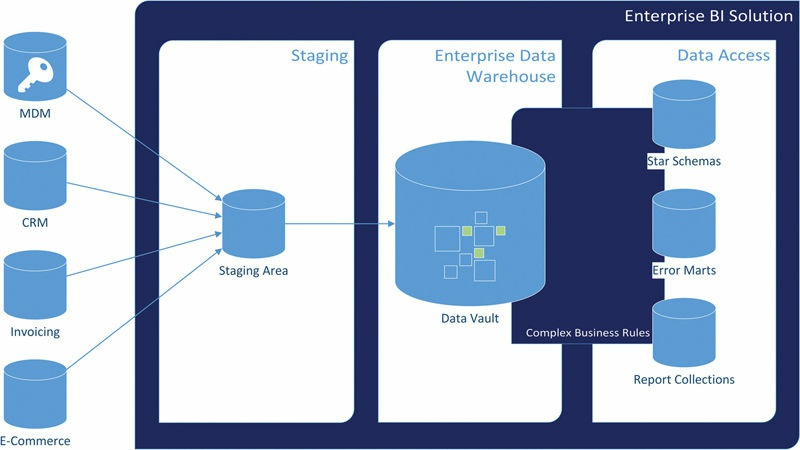

# Intermediate Data Vault Modeling(212-253)

[TOC]


Due to the complexity of data warehouses and the underlying business requirements, more complex Data Vault entities are typically required and introduced throughout this chapter. They extend the basic entities discussed in the previous chapter. The various special types of satellites are covered, including overloaded satellites, multi-active satellites, status-tracking satellites, effectivity satellites, record tracking satellites, and computed satellites. Extended link entities are covered as well, including link-to-link relationships, same-as links, hierarchical links, nonhistorized links, nondescriptive links, computed aggregate links, and exploration links. For each link entity, the technical or business reason for adding them to the Data Vault will be explained.


## Keywords

```
data warehouse
data vault
satellites
link entity
data modeling
```

The entity types presented in the previous chapter are the foundation for other Data Vault entities presented in this chapter. Many of these examples are just applications of existing link or satellite entities without changing the structure of the entity. These are often used in the Business Vault that was described in Chapter 2, Scalable Data Warehouse Architecture. In addition, this chapter discusses some important issues that often come up when designing and implementing a Data Vault based data warehouse. Note that this chapter is partially based on the book Super Charge Your Data Warehouse by Dan Linstedt [1]. 

## 5.1. Hub Applications

Chapter 4, Data Vault 2.0 Modeling, has presented Data Vault hubs as the central entity used for storing business keys that identify business objects. In theory, an enterprise should have one leading operational system that keeps track of a specific business object. Customer relationship management (CRM) systems are good examples of such operational systems that are the main source for all customer-related information. In reality, however, business objects, such as customers, are stored in multiple operational systems, for example in retail databases, e￾commerce applications, invoice management systems, and so on. Enterprises try to consolidate this information with a concept called master data management, which we briefly discuss in Chapter 9, Master Data Management.


Figure 5.1 shows that all data, including the business keys, is first loaded into the Data Vault layer via the staging area. The consolidation happens when the complex business rules are being processed and the information marts are being built. Data warehouse practitioners have to deal with multiple sources for a given business object. The major problem with having multiple sources is that each source has different capabilities for defining each business object. That is due to the different requirements that have been expressed by the business when these source systems have been built in the past. The result is that even the business key data types might be different: in some cases, the alphanumeric customer number (e.g., US4317 for a customer in the United States) that is defined on an enterprise level doesn’t fit into some other operational system because it won’t allow alphanumeric characters into the customer number. In that case, the business will rely on some sort of mapping tables that map customer US4317 in the CRM system to customer 132842 in the e-commerce application. (See section 5.2.2 for a more detailed discussion and an example of such a mapping table.) 


> FIGURE 5.1 Consolidation of various sources in the data warehouse.
>
> 


Because this situation is more than common, the Data Vault has a solution to it. The recommended best practice is to load all business keys, regardless of their specific format, to one common hub (in this case the customer hub) and create a special link, called a same-as link (or SAL), to indicate the business keys that identify the same business object. The next section discusses hub consolidation with same-as links in more detail.


### 5.1.1. Business Key Consolidation


As described in Chapter 2, Scalable Data Warehouse Architecture, the Business Vault is an extension to the raw Data Vault and allows data warehouse developers to add computed data to the Data Vault layer. This chapter will introduce computed aggregate links, exploration links, and computed satellites as examples of entity types that are part of the Business Vault. These entity types are modeled similarly to the core Data Vault entity types by following Data Vault modeling concepts, especially for links and satellites.


However, it is possible to customize every standard Data Vault entity in order to meet the needs of the organization. These modifications, which become part of the Business Vault, are sourced from the raw data in the standard Data Vault entities (hubs, links, and satellites) and are often optimized to improve the performance when querying the data from the Data Vault. A common use case is to consolidate business keys from various sources, as shown in Tables 5.1 and 5.2 and Figure 5.2.

>
> Table 5.1 Passenger Hub
>
> 
>


> Table 5.2 Same-as-Link for Passenger
>
> 


> FIGURE 5.2 Hub with same-as link structure to de-duplicate passenger business keys.
>
> 


In this case, there is a Passenger hub in the Raw Data Vault that has been sourced from multiple source tables providing passenger numbers. In too many organizations, source systems are used which are not integrated. Therefore, the same passenger exists in multiple operational systems, having different passenger identification numbers (such as driver license number or passport number) assigned. Another reason for this problem is that source systems can sometimes support different formats for the same business key.


In this example, source system Domestic Flight allows (and uses) numeric driver license numbers only, while system International Flight allows alphanumeric business keys. This situation is far from optimal but often arises when two organizations merge together and continue to use their old systems without proper integration. The problem is solved by attaching a same-as link structure to the hub to indicate which customer numbers are used for the same customer. There are multiple options to compute the records for the same-as link, and could result from customer de-duplication algorithms, as in this example. The corresponding entity-relationship (ER) diagram is presented in Figure 5.3. 

> FIGURE 5.3 ER diagram for same-as link structure to de￾duplicate passenger business keys (physical design).
>
> 


This approach, based on a same-as link and a hub with a single business key, only works as long as the number ranges of both systems don’t overlap. If that is the case, the same business key can identify multiple business objects in different systems. Instead of using one hub for all business keys from all source systems in the Raw Data Vault, there are two options to deal with this situation. First, the hub could be extended by another business key, identifying the source system. This artificial key becomes part of the hub’s composite business key. This solution has the drawback that it won’t integrate the source systems. Another solution is to create multiple hubs and link them using a link table. This solution documents the different business key usages in the model but requires more entities in the Raw Data Vault.


From a modeling standpoint, both solutions are far from being optimal, but this reflects the actual use of business keys in the source systems, by the business. However, in both cases, this is the correct approach, because Data Vault 2.0 modeling is oriented to the business. If an organization is using a suboptimal way to run their business, it is therefore reflected in the Data Vault model as well. When the data is transformed to the Business Vault, it is still possible to merge the business keys into one business hub, including a same-as link structure as shown in Figure 5.3. In fact, a same-as-link is actually a Business Vault entity, as long as the information is not pulled from the source system, instead of being maintained by human intervention or algorithms. However, if the business keys are merged into a business hub, they should not overlap and identify only one business object. This follows the Data Vault 2.0 standard and can be achieved by the use of pre- or postfixes (or formatting elements) for those business keys that are not from the leading source system. For example, if the leading system is a CRM application and doesn’t provide a business key for a specific business object, the identifying business key is taken from a secondary source system and loaded into the business hub. An example of such a secondary source system might include a ticketing system where a customer is added but has never been synchronized or replicated to the CRM application. To indicate this suboptimal case and prevent confusion, the business key from the ticketing system is enclosed by brackets, e.g. “(4711)”. This business key is then used in analytical reports and it is apparent for the business user that the key is not a key from the CRM application and cannot be found there. It is also possible to add the source system to the business key, e.g., “(TCK:4711)” to provide the business user an indication where the key is coming from.


The query from such two tables could be relatively complex in some cases. In addition, the consolidated view of customer numbers is required in many cases, because business is interested in a consolidated list of customer keys instead of the raw data, except for some data quality reports. Therefore, it makes sense to provide the consolidated list, resulting from the complex query, in a new, materialized hub. This hub has the same structure as the hub in the Raw Data Vault, but with different data. Therefore, the statement from the beginning of this section remains valid: there is no special hub entity for the Business Vault. However, it makes sense to have Business Vault hubs in order to provide different sets of business keys to improve later querying. In such a case, the record source attribute is changed to “SYSTEM” or “SYS” to indicate that the value has been generated by the data warehouse system.


This example is a typical case where business rules are applied in the Business Vault. While business rules are typically implemented when loading the information marts, it is a good practice to implement them if they are generally used in more than 80% of the reports, or if heavy lifting is necessary. In this case, heavy lifting equates to long-running or complex business rules. By doing so, reimplementing the business rules for every information mart can be avoided. This becomes even more important with complex and time-consuming business rules that are used in multiple information marts.


The other Business Vault entities in this chapter on links and satellites are used in similar cases and with the same reasoning as described in this section.

Chapter 6, Advanced Data Vault Modeling, discusses two other Business Vault entities (the PIT table and the bridge table) that are used in order to make querying the data from the Raw Data Vault easier and to increase the query performance. For that reason, they are also called query assistant tables.


## 5.2. Link Applications

The next sections present frequent link structures and applications that Data Vault practitioners often use in their projects.

### 5.2.1. Link-on-link

One question that is often raised in the Data Vault design phase is whether it is possible to create links that reference other links (link-on￾link structures). Consider the example of a flight diversion in the airline industry. Instead of reaching the original airport, the flight is diverted due to severe weather conditions or a security incident. The first idea to model the Data Vault model for this concept is represented in the logical model shown in Figure 5.4.


> FIGURE 5.4 Link-on-link Data Vault model (logical design).
>
> 


The link in the center of the model, LinkFlight, represents the original flight information as planned by the carrier. Each flight has a source and a destination airport (thus the two connections between LinkFlight and HubAirport), a reference to the flight number and another to the tail number. Note that there are no satellites modeled in this drawing.


The flight diversion is modeled as another link, LinkDiversionFlight. It references the original flight in LinkFlight and adds a reference to the new destination airport. While this model seems to be very efficient, it introduces an unwanted dependency between both links in this model. This dependency does not scale nor perform well in a high volume, high velocity (big data) situation. The more link-to-link structures are required to resolve at the DBMS level, the more exponential the work the DBMS needs to do. It needs to be reengineered at the start in order to achieve maximum flexibility in the future and ensure scalability with large datasets.


We have discussed in Chapter 3, The Data Vault 2.0 Methodology, how the functionality requested by the business user is delivered within separate sprints. The goal is to deliver small increments of the data warehouse and deploy these changes into production at the end of each sprint. The problem with link-to-link entities is that a change to the parent link (in this case LinkFlight) requires changes to all dependent child links (e.g., LinkDiversionFlight).


These cascading changes increase the time to modify parts of the data warehouse for change requests and can prevent the full implementation of the request within a sprint’s length. Thus, these links should be avoided to secure the agility of the IT team. The recommended practice is to abstain from using link-to-link references and implement the links independently (Figure 5.5); this is known in data modeling circles as denormalization.


> FIGURE 5.5 Independent links (logical design).
>
> 


Now, each link is independent and can be modified independently when a change to its structure is required in the future.


### 5.2.2. Same-as Links

As we have already seen in section 5.1.1, same-as links are used to indicate duplicate business keys within a Data Vault hub entity. This is required when the same business objects are identified by more than one business key. For example, Table 5.3 provides an extract from a customer list that has been loaded from multiple source systems.

> Table 5.3 Customer Hub
>
> 


The hub has been loaded from multiple sources, which have different options for storing a customer number. While the CRM system stores customer numbers as a composite key (a “smart-key” as described in Chapter 4, Data Vault 2.0 Modeling), the online shop is only able to store numeric values for customer numbers. Therefore, the business provides the mapping table between the customer numbers from the CRM system and the shop system (Table 5.4).

> Table 5.4 Customer Number Mapping Between Source Systems
>
> 


With that information, it is possible to create the link structure shown
in Figure 5.6.

> FIGURE 5.6 Same-as link for customers (physical design).
>
> 


The link is loaded with the records shown in Table 5.5.

> Table 5.5 Same-as Link for Customer Numbers
>
> 


From a loading perspective, the hash keys in column CustomerMasterHashKey should come from the leading source system. That way, it is possible to look up the SHOP customer number by selecting the record from the same-as link table where Customer1HashKey is equal to the CRM customer number as the leading source system.


### 5.2.3. Hierarchical Links

Hierarchical links are used to model parent-child hierarchies using Data Vault links. One example of such parent-child hierarchy is the bill of material (BOM) hierarchy that describes the parts required to build an airplane component. For example, an airplane consists roughly of the parts displayed in Figure 5.7.

> FIGURE 5.7 The parts of an airplane [2].
>
> 


Each part of the aircraft is made up of other, smaller parts. The components of a typical turbojet engine are displayed in Figure 5.8. The parts and subcomponents of an aircraft are recorded in a bill of material (BOM) structure displayed in Figure 5.9.

> FIGURE 5.8 Sectional view of a turbojet engine [3].
>
> 


> FIGURE 5.9 Abill of material [4].
>
> 


Each item on the bill of material is named, identified by a part number, and it is indicated how many items are required to create the component. In addition, the source of the item is given.


The Data Vault model to represent this so-called parent-child hierarchy is presented in Figure 5.10.

> FIGURE 5.10 Hierarchical link representing a bill of material (logical design).
>
> 


Instead of modeling each level of the hierarchy as separate hubs, the definition of one hub is preferred. It is true that the level itself, when analyzing it from a technical perspective, has a different grain: the engine: for example, consists of the cowl and the propeller and therefore has a different grain than the individual parts that make up the engine. However, the business treats the hierarchy levels as levels. The grain of the levels is the same, considering this logical modeling perspective, because each level is made up of one or more sublevels. The level is a super-type in this regard and maintains the grain of the data as it exists in the source system.


In fact, the hierarchical link is just an application of the standard Data Vault link. It doesn’t have a different structure, or violate the rules outlined in the previous chapter regarding links in any way.


### 5.2.4. Nonhistorized Links

The links presented in the previous sections have one thing in common: they keep the relationship between business objects in the Data Vault. It is possible to capture data that has changed in the source system by adding a new record with the modified descriptive attributes to a standard satellite hanging off the Data Vault link. However, the updates from the source systems, implemented as inserts into the satellite, are not intended in all cases. For example, in some cases, Data Vault links store transactional data or data from sensors. This data should not be modified at any time. This is where nonhistorized links (also known as transactional links) come into play. This modified link is not updateable. If, for example, a transaction needs to be cancelled, a reverse transaction has to be created in the source system and loaded into the nonhistorized link. Other corrections, for example in case of error, should be avoided in the Data Vault.


Note that the former term “transactional link” is misleading: the link structure can also store relationships that cannot be updated, such as photos that are generated by a CCTV and stored as an incoming stream of data. The video surveillance system will not update the data that it has once written into the Data Vault model. Therefore, this link type is called a nonhistorized link today.


The logical symbol for nonhistorized links is shown in Figure 5.11.


> FIGURE 5.11 Nonhistorized link (logical design).
>
> 


The symbol is similar to the standard link, except for the indicator next to the icon to make clear that this is a nonhistorized link. For historical reasons, the indicator is a T as in transactional link. Note that it is not possible to add satellites to nonhistorized links in the logical design (even though there are options to add satellites in the physical implementation, as we will learn a little later in this section). Attributes that are part of the transaction are added directly to the nonhistorized link.


There are two options to physically model nonhistorized links in the Data Vault. The first involves a standard link entity and a satellite without a LoadEndDate attribute. Thus it is not possible to insert new versions of the records in this satellite because it is not possible to end￾date the record and replace it by another version. Figure 5.12 shows an electronic invoice for a flight, a typical transaction in the aviation industry.


>FIGURE 5.12 Electronic invoice for flight.
>
>


The transaction is identified by the invoice number 0198536 and was issued on January 21, 2014. Other information is also given, such as the customer and the sales person. Note that it is not possible to update flight reservations. If the information given during the reservation is wrong, for example because a wrong destination airport was given, the only way to change the reservation is to pay a change fee and buy a new flight reservation. The old reservation will be cancelled. Therefore, updating the old invoice is not possible without creating a new invoice.


The logical Data Vault model in Figure 5.13 captures the electronic invoice transaction.


>FIGURE 5.13 Nonhistorized link (physical design).
>
>


The link LinkInvoice captures the core transaction with a customer reference, a sales person reference and the transaction identifier InvoiceNumber. By definition, this transaction identifier is added to the nonhistorized link itself. The hash key of nonhistorized is derived from the business keys of the referenced hubs and the transaction identifier. The satellite SatInvoice contains all descriptive attributes such as the record locator and the issue date of the invoice. Note that the invoice issue date is different from the load date of the record, which is why it has to be added to the model. However, it is possible to use the transactional date as the load date if the time at which the transaction is loaded to the Data Vault is relatively close (within seconds) of the actual transaction date itself. Note that the entities in Figure 5.13 do not show all the descriptive attributes shown in the invoice displayed in Figure 5.12.


In some cases, it is possible to abstain from using a LoadDate attribute in the satellite entry, because both records (the link record and the accompanying satellite record) will have the same load timestamp. Therefore, the LoadDate attribute in the satellite stores duplicate data that consumes disk space. However, there are cases where the data for both entities comes from different sources and the data is delivered from both sources sequentially, just milliseconds apart. This often happens, for example, in real-time cases, which are not covered in this book. Anyway, in such a case, the LoadDate attribute should be modeled in both entities to capture the different arrival timings. Another reason for modeling the attribute in both entities is that of standardization, which makes it easier to understand the entities for new project members.


The second option, which should be avoided in most cases, is to add the attributes of the transaction directly to the link structure and abstain from using a satellite structure at all. Figure 5.14 presents an example of such a nonhistorized link.


>FIGURE 5.14 Nonhistorized link alternative without satellite(physical design).
>
>


The attributes InvoiceIssueDate and RecordLocator have been moved from the satellite into the LinkInvoice link. The satellite SatInvoice from Figure 5.13 has been removed completely, as it is not needed anymore.


This option is not recommended, because it changes the architectural design of the Data Vault model by introducing decisions to the design process. By doing so, it increases the complexity of the model and increases the maintenance costs. In addition, it makes it more complicated to automatically load nonhistorized links. Nevertheless, there are times when the second option is valuable: if performance is an important issue, by which we mean that it is required to load data within milliseconds or faster, it might be necessary to model the nonhistorized link as in Figure 5.14. However, keep in mind that the width of the link table can do harm to your performance optimizations. If the data within a row becomes too wide, it will cut down the number of records per database page (at least in row-oriented database management systems, such as Microsoft SQL Server). The physical implementation may vary based on the physical platform chosen for implementation. As a result, the performance of both loading and querying the link structure will decrease. While the same could happen in the first option, it is possible to split the data into multiple satellites to keep the row size small.


Figure 5.15 shows that the attributes from the transaction are distributed over the satellites. Both satellites follow the definitions for nonhistorized satellites as outlined in this section. Moving the descriptive data from the nonhistorized link into dependent satellite should be considered if the number of attributes to be captured is relatively high. The problem is that Microsoft SQL Server stores its data in file pages of 8 KB size without the option to reconfigure this setting. The potential width of the link is primarily limited by this size limitation. For that reason, only a limited number of descriptive fields should be added to the link structure of a nonhistorized link in order to maintain performance.


>FIGURE 5.15 Nonhistorized link with multiple satellites(physical design).
>
>


Note that the Data Vault 2.0 is independent of the actual database system used. The examples in this book are based on Microsoft SQL Server, but can be transferred to other database systems easily


### 5.2.5. Nondescriptive Links

In many cases, Data Vault links will have one or more satellites to provide the context of the link. In some cases, however, links will not have any satellites. This might be the case if only the relationship between two business keys should be indicated, for example if an airline customer has expressed interest in a specific offering by clicking an advertisement on the Web site of the airline.


In Figure 5.16 the low-value link Interest connects hubs Customer and Offering without providing additional context.


> FIGURE 5.16 Low-value link (logical design).
>
> 


Nondescriptive links are also used to store single states in a multistate relationship or in a role-playing relationship. If we extend the previous example, we could create another link to model another state – that a
customer has been selected for a marketing campaign.


Figure 5.17 shows that this second state is added to the model by another link, Mailing. Note that there are other options to model multistate relationships, for example using a combination of a satellite and a code table.


> FIGURE 5.17 Multistate low-value link (logical design).
>
> 


### 5.2.6. Computed Aggregate Links


This type of Business Vault link removes one hub from a link and aggregates the data by the remaining relationships. For example, consider the Data Vault model shown in Figure 5.18.


> FIGURE 5.18 Acomputed aggregated link with computed satellite (logical design).
>
> 


The original link, LinkFlight, connects three hubs: HubAirport, HubFlight and HubCarrier. It denotes a flight that has been scheduled by a carrier between two connecting airports with a given flight number. When the flight number is removed from the link, the new link, LinkService, loses flight information because it doesn’t contain a reference to HubFlight anymore. The link only indicates which carriers serve which airport connections. The number of individual flight numbers is aggregated into attribute FlightCount in satellite SatService. Both the LinkService and the associated satellite SatService are not from the source system. Instead, the data stored in the entities is calculated based on the aggregation functions.


Because this data is calculated and not raw anymore, computed aggregate links are part of the Business Vault. The entity is not auditable but can be regenerated from the source data in LinkFlight at any time. In this regard, the computed aggregate link is an application of the bridge table, covered in Chapter 6, Advanced Data Vault Modeling.


Because the computed aggregated link in this example is part of the Business Vault, it is also possible to modify the structure if needed, for example, by moving the computed attribute into the link structure, as shown in Figure 5.19.

> FIGURE 5.19 Acomputed aggregate link with computed attribute in the link (logical design).
>
> 


This option is only available if the computed aggregate link is a Business Vault entity – that is, the link itself is calculated from raw data using a business logic, for example a GROUP BY statement. If the link data of the computed aggregated link is from the source system, the link entity remains in the Raw Data Vault (Figure 5.20).

> FIGURE 5.20 Computed aggregation on a Raw Data Vault link (logical design).
>
> 


In this case, the aggregation, which is still calculated from other data in the source system, is stored in computed satellites and attached to the raw link. This situation can happen if the link itself is available in the source system, but the aggregation is not. In this case, the aggregation is based on other raw data and attached to the right grain, which is the LinkService in the example in Figure 5.20. Therefore, the distinguishing characteristic of both modeling options is where the link data is coming from: is it from the source system or is the link data already calculated? In the first case, the data is modeled as a raw link with an attached computed satellite, as in Figure 5.20. If the link is already calculated from raw data, for example by a GROUP BY statement, the link entity becomes part of the Business Vault, as in Figure 5.18.

### 5.2.7. Exploration Links

Exploration links are computed links that have been created for business reasons only. Therefore, they are part of the Business Vault (see Chapter 2, Scalable Data Warehouse Architecture, for details). While the link between two hubs doesn’t exist in the source system, the business might decide to create an exploration link to investigate the data (Figure 5.21).


> FIGURE 5.21 Exploration links (logical design).
>
> 


The three hubs (HubAirplane, HubEngine, and HubManufacturer) in Figure 5.19 are interconnected to each other by two links (LinkAirplanePart, LinkManufacturer). The business might decide to analyze the relationship between those three hubs by adding LinkAirplanePartsWithManufacturer, which is a denormalized version of both links. In other cases, the business might decide to analyze the relationship between two hubs that are only indirectly connected, in this case HubAirplane and HubManufacturer. The resulting link LinkAirplaneWithManufacturer provides such an opportunity as shown in the figure.


The links, which are standard Data Vault links, are manually generated and maintained, even though the business can decide to automate the process of creating the link. Exploration links are part of the business vault and therefore not auditable. Reasons to create exploration links include:


- Determine relationships and dynamic networks between business entities (hubs) that are not in the source system
- Represent relationships that would be only indirect in the model otherwise
- Consolidate links between business objects if one of the referenced hubs contains duplicate entries (see same-as link)
- Identify clusters of similar entries within hubs (again, using same-as links)
- Automated discovery of patterns, for example in fraud detection


## 5.3. Satellite Applications

After completing the discussion on specific purpose links, the next sections discuss similar cases for Data Vault satellites.

### 5.3.1. Overloaded Satellites

We have recommended in Chapter 4, Data Vault 2.0 Modeling, that for each data source there should be an individual satellite tracking the attributes from the source. In some cases, Data Vault implementers try to combine data from multiple sources into one satellite. While there are sometimes valid reasons for doing so, it introduces inherent risks as well.


The first problem occurs if the data format of each individual source is different, for example the character length of the name or address attribute. If the data is different, and there is a good chance that it is, the data becomes dirty very quickly.


Other problems become clear when analyzing Table 5.6, which shows a data extract from an overloaded satellite.


> Table 5.6 Overloaded Satellite with Data from Multiple Sources
>
> 


According to the RecordSource attribute, the data is from five different data sources. Because each source had the same structure and was using the same data types, the business decided to load all data into the same satellite. When analyzing the data, the following questions arise:


- Which source system should be the master system if data is contradicting each other (as in Table 5.6)?
- Are there any rows that supersede other rows?
- Which of the rows is the most current one?
- The primary key of this satellite should be a combination of PassengerHashKey and LoadDate (as discussed in Chapter 4).


However, the field combination in this satellite is not unique. Should
we include the RecordSource attribute to the primary key in order to
make this a valid primary key?

- If some of the data sources provide NULL values or no values at all for some of the attributes, how do we handle them?
- Should we combine or merge the data from the source systems on loading or should we leave the data as is?


Some of these questions lead us to another problem, which lies in the delta-detection of the satellite. Remember that satellites should only store attribute changes, not the attribute state of each loading cycle. However, due to the problems we discussed above, the change detection becomes very complicated (because we want to keep every change of each source system, not only the one from the master system).


### 5.3.2. Multi-Active Satellites


Multi-active satellites are similar to overloaded satellites: they store multiple entries per parent key. However, these records don’t come from different sources, but from a denormalized data source, such as COBOL copybooks or XML files. There are many examples of valid use cases. For example, employees might have an unlimited number of phone numbers, as in Figure 5.22.


> FIGURE 5.22 Multi-active satellite example.
>
> 


The XML file on the left of Figure 5.22 represents an employee with a number of phone numbers. The structure of the XML file is translated to the Data Vault satellite entity on the right. The structure of the satellite is very similar to the one described in Chapter 4. The descriptive attribute (the phone number) is the PhoneNumber attribute, which is the only descriptive attribute in this example. The only difference from the proposed structure in Chapter 4 is the PhoneSeq, a sequence number which is the index that identifies the phone number within the left structure. The resulting satellite data is presented in Table 5.7.


> Table 5.7 Multi-Active Satellite Data
>
> 


The data shows that there is one record for each phone number in the XML source file. Each record is identified by EmployeeHashKey, the hash key of the satellite parent; PhoneSeq, the phone number’s position in the XML source file; and LoadDate, the timestamp of the first occurrence of the data within the source file.


However, there are issues involved with multi-active satellites because there is an order-dependency of the detail records. If the order of phone numbers in the XML source file changes, the whole employee’s data will be seen as a delta, even if only two numbers switched positions without a phone number change. Table 5.8 shows an example of such data.


> Table 5.8 Multi-Active Satellite Data with Changed Source Order
>
> 


The first four records (records #1 to #4) represent the first order in the source system, while the last four records (records #7 to #10) represent the order of the same and unchanged records at the second batch load. However, the old records in the first batch are marked as deleted due to the LoadEndDate, which is not null in these cases (remember that this means that they have been replaced).


To solve this issue, it is possible to use the phone number itself as the sequence number. Subsequencing, as in Table 5.7, should be only the architectural fallback and used with active table-compression only. Table 5.9 provides an example. This removes the order dependency during delta checking but destroys any chance of reproducing the data set in the proper order as it arrived. If that is important, subsequencing as shown in the previous example is the only way. Another option is to include the existence of the phone number in the satellite as a currently active row before inserting. However, this option doesn’t check the deleted phone numbers that may have disappeared from the incoming data set.


> Table 5.9 Multi-Active Satellite Data with Alternative Sequence Attribute
>
> 


The table shows that record #2 has been updated by record #5 in the second batch. Record #3 was deleted and did not exist anymore. Therefore, it has been end-dated in the satellite. Note that the PhoneNumber descriptive attribute is duplicated into the primary key of the satellite (attribute PhoneSeq) instead of simply moved. This makes it easier to understand the satellite for the next user, who needs to extract descriptive attributes from the satellite for the business.


If the described solution is used, two issues could occur: first, the alternative attribute has to be NOT NULL and unique in the context of the parent and, second, performance could become a great problem. The performance problem arises if the sequence column alternative is a character string and not a number. However, a sequence number made up of characters is the better solution of two bad ones (the best worst￾case scenario).


### 5.3.3. Status Tracking Satellites


Status tracking satellites are used to load audit trails or data from change data capture (CDC) systems. These techniques track information on CRUD (also SCRUD) operations within the source system. The information has to be provided by the source system and includes information about the creation (C), reading (R), updating (U), deleting (D) and searching (S) of the data within the source system. Often, this information is stored by the operational system whenever a user executes one of these operations in the application. Table 5.10 provides an example for such a SCRUD table. It is the result of a CDC function and shows all the changes in the source table.


>  Table 5.10 Change Data Capture (Cdc) Table for Employees
>
>  


The __$operation column indicates the type of operation on the data. The CDC implementation of Microsoft SQL Server allows the following values [5]:
1. Delete
2. Insert
3. Update (old values)
4. Update (new values).

Note that, depending on the application, logging of reads (which is not supported by the CDC implementation of Microsoft SQL Server) might require a lot of storage. The same might be true for searches (again, not supported). However, some environments require this for security reasons to provide information about who accessed which data.


The status tracking satellite is defined as in Figure 5.23.


> FIGURE 5.23 Status tracking satellite (logical design).
>
> 

The status tracking satellite in Figure 5.23, SatEmployeeStatus, consists of only one descriptive attribute, the Status attribute where the __$operation data is stored. Other than that, there is only metadata which is not captured in logical Data Vault diagrams. The data in the table, derived from the data in Table 5.10, is presented in Table 5.11.

> Table 5.11 Status Tracking Satellite Data
>
> 

Note that the descriptive data (e.g., the business key) is not stored in the status tracking satellite. Only the status and the timestamp of the status change are tracked. In addition, the original values for these records are not displayed (they are outdated). The descriptive data is loaded to the respective standard satellites that are designed to capture this data. Other than that, the data in status tracking satellites should be normalized and follow the standard satellite layout and rules. Compression should be active on these tables in order to preserve disk space.


If multiple source systems provide status information, only the information from the master system (the leading system) should be tracked. Another good practice is to use multiple status tracking satellites for the business key or relationship, thus splitting the status tracking satellite by source system, a practice similar to the one described in Chapter 4.


### 5.3.4. Effectivity Satellites


Effectivity satellites are often found hanging off Data Vault link entities and are presented in Figure 5.24. They track the effectivity of a relationship between two business objects among other applications (for example, it might be useful to track the effectivity of a business key in a hub). Its purpose is to track when the link is active according to the business and provides begin and end dates for this purpose. This data often represents the organizational-wide perspective, i.e., when the relationship (or business key) is considered as deleted in the organization.


> FIGURE 5.24 Effectivity satellite (logical design).
>
> 


The LinkMembership link in Figure 5.24 connects the two hubs in the model. While the link consists only of default attributes that capture the metadata of the relationship between airline and alliance, such as LoadDateTime and RecordSource, the link is not end-dated within the link structure itself (other sections in this chapter explain why this is not possible). The airline’s membership start and end is captured by the SatMembership satellite, which depends on the link. The attributes MembershipBegin and MembershipEnd are added for this purpose.


The begin and end dates are not system generated. Instead, they have to be provided from a data source, for example the audit trail of Microsoft Master Data Services, effectivity dates within the master data, change data capture (CDC) or any other audit trail from operational systems. In order to pass an audit of the data warehouse, it must be possible to trace back the dates to the source system.


Effectivity satellites are only reasonable if the source system provides the effectivity dates. Avoid creating artificial effectivity dates unless the source system provides the data. Usually this is only true for a subset of data tables or feeds. However, the more sources provide effectivity dates, the better. Make sure to capture them in the Data Vault because they can often be used for data mining purposes.


The relational structure shown in Figure 5.25 implements the example from Figure 5.24 and is used to track the effectivity of airline memberships in airline alliances.


> FIGURE 5.25 Effectivity satellite (physical design).
>
> 

For each entry in the link table, there is one record active in the effectivity satellite. It is also possible to insert updated records, for example if memberships are extended.


Note that effectivity satellites don’t track the availability of data in the source system. This is tracked by record tracking satellites, which record the status of data in source systems. They are described in the next section.


### 5.3.5. Record Tracking Satellites

Sometimes, it is required to track which source applications are feeding which keys and associations on what load cycles. For example, many systems provide data in full dumps every day. In some cases, not all records are included every day. Instead, they appear and disappear from day to day without any fixed rule. This is especially true for legacy mainframe systems, because they’re often locked records when they are being edited by the business user. If the records are dumped into the export file at the same time as the business user is locking the record for editing, the record is skipped and therefore not exported. In the export file, the record just doesn’t exist at all.


Another problem is that these systems only rarely provide change data capture (CDC) information. Therefore, it is not possible to positively identify deleted records. However, in order to load the Data Vault, we need to figure out which records have been deleted from the source system (in order to end-date them using the LoadEndDate attribute in satellites) and which only have disappeared from the exported file but will appear in one of the next exports. The latter should not be end-dated. This is similar to the LastSeenDate of hubs and links (see Chapter 4 for details) where the last timestamp is marked when the business key or relationship was last found in the source system – for the very same reasons.


In order to identify the difference between “missing for a few days” and “was deleted, ” businesses usually set up a business rule to distinguish both classes. For example, the business could decide that all records that have not appeared for 7 consecutive days should be treated as deletes. The number of dates is often different for various types of data and data sources. This is also similar to the handling and update procedures of the LastSeenDate of hubs and links. Figure 5.26 presents the logical diagram of a record tracking satellite.


> FIGURE 5.26 Record tracking satellite (logical design).
>
> 


In this example the hub HubPassenger is extended by the record tracking satellite SatPassengerTrack. The diagram shows that the following record sources are watched for the occurrence of the customer key: flights, finance, loyalty program, and reservations.


For the existence of each business key or relationship in the source system at a given point in time, an insert is made into the record tracking satellite if one is available (for the hub or link). Therefore, the satellite indicates that the given key or relationship was present at the satellite record’s time of tracking (the LoadDate). Table 5.12 shows an example of the data in the satellite from Figure 5.26


> Table 5.12 Denormalized Record Tracking Satellite Data
>
> 

Unlike other satellites, the record tracking satellite has no RecordSource and no LoadEndDate attribute. This is due to the fact that all records are system generated (thus no RecordSource attribute) and records are never updated (thus no LoadEndDate attribute). Instead of updating the records on each load cycle, a new entry is inserted every time. A value of 1 in the descriptive attributes indicates that the customer key was present in the source system, and a value of 0 indicates that the business key was not present. As a result of these modifications, record tracking satellites are nonauditable. However, this is not a problem because it allows us to bend the rules of Data Vault entities without breaking the whole model.


The record layout is optimized for partitioning, filtering and querying. It provides fast access to these components and the discovery as to which data sources “appear and disappear.” However, the disadvantage is that it introduces an insert followed by an update for every new record source added to this table.


Note that, in order to avoid data explosion, each column or the whole table should be compressed. It is also advisable to summarize old data and remove it from the record tracking satellite in order to save more disk space. Old data is defined by the business again and should include all data that is not required for the initial purpose of the record tracking satellite – that is, identifying deleted data in the source system. An alternative to deleting this data is to move the data to slower (thus cheaper) disk space or backup tapes. Partitioning might help in this case again. 


The structure in Table 5.12 shows that the record tracking satellite is not driven by data as all entities in the Data Vault should be. Instead, it is driven by the structure of the source systems: every time a source system is added to the data warehouse and feeds the parent table of this satellite, a new column has to be added for tracking purposes. This could be the right approach for your Data Vault if you are willing to accept these frequent structural changes. If it is not an option, it is also possible to normalize the data as shown in Table 5.13.


> Table 5.13 Normalized Record Tracking Satellite Data
>
> 

In this case, the record source is provided in the RecordSource attribute and the appearance of the business key or relationship under watch is tracked in Appearance. This design requires no structural changes to add new record sources because a new record source only requires inserts into the record tracking satellite. However, analyzing the satellite data is more complex but can be handled using the PIVOT SQL operator, which is available in Microsoft SQL Server and other database systems.


If the business is providing detailed record sources (a practice that we try to follow in this book as much as possible), it is also possible to track the movement of data within the source system: where did the business key or relationship first occur in the system, where did it go from there, etc.). A detailed record source indicates the source as much as possible. For example, the record source “CRM/Contact/Lead” identifies the Lead entity within the Contact area of Microsoft CRM [6]. Compare this implied information with the nondetailed record source “CRM” where no detailed information regarding the source of data is provided. To get the most out of the record source and thus provide as much value to the business as possible, try to use record sources as detailed as possible. The use of a hierarchical system is also advised in order to aggregate the data on the individual levels for analysis.


### 5.3.6. Computed Satellites

By the definition in Chapter 2, Scalable Data Warehouse Architecture, the Data Vault stores raw data. However, in some cases, it might be useful to store computed data. In the Data Vault model, there is a place available for this, which is the Business Vault. In section 2.2 of Chapter 2 we have introduced the Business Vault as a set of tables that follow the Data Vault model and house business-rule changed data. These tables are called computed satellites and have the purpose of storing computed data, which is data that is the result of aggregation, summarization, correction, evaluation, etc. It might be the outcome of data quality routines, cleansing routines or address correction routines.


Usually, the business wants to perform such operations only once before distributing to the information marts to save computing resources. The computed satellite is exactly for this purpose: it stores the data before it is distributed. By doing so, the structure of a computed satellite follows that of a standard satellite. The only difference is that the record source indicates that it is system generated. It is also possible to provide the function, operation, or application that is computing the data for the satellite, especially if multiple sources for the data within the computed satellite exist and feed the very same satellite.


Because there is no direct raw data source for the computed data, it is not auditable by its very nature. However, it could be possible that an auditor would want to review the computational logic or at least see how, when, and what the data was before it went downstream to the information marts. The computed satellite is the place to show this.


The logical symbol for computed satellites is presented in Figure 5.27.


>FIGURE 5.27 Computed satellite (logical symbol).
>
>


Other than the icon on the shape, there is no difference from standard satellites. As already mentioned, the structure is the same. Again, the difference is the source of data, because it is calculated data that is stored in this entity type. 


