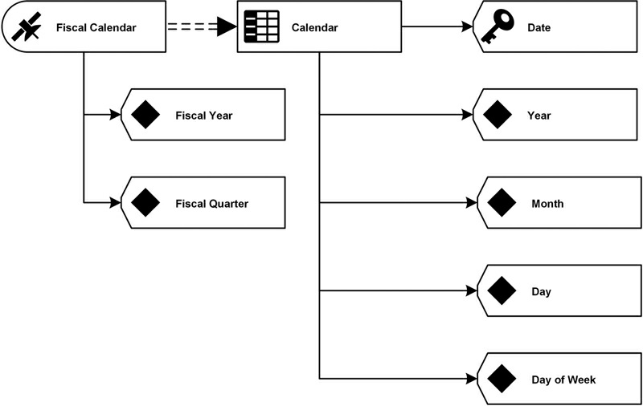

# Advanced Data Vault Modeling(253-285)

[TOC]


## Abstract

This chapter addresses two additional aspects of Data Vault modeling: query assistant tables and reference tables. Query assistant tables are used to reduce the complexity of queries against the Data Vault and improve the performance. Two specific types of query assistant tables are covered: point-in-time (PIT) tables and bridge tables. Reference tables are covered in detail, including no￾history reference tables, history-based reference tables and code and description tables.


### Keywords
```
Query assistant tables
reference tables
point-in-time
bridge tables
description tables
reference tables
```

The previous chapter has introduced applications and special versions of the core entities in Data Vault 2.0, such as same-as links (a basic application of the link structure) and computed satellites (a special version of the satellite, used in the Business Vault). This chapter introduces more entity types that are not directly based on these core entities but are commonly used in Data Vault 2.0 modeling. The structures presented in section 6.1 and 6.2 have in common that their primary use case is to make querying the data out of the Data Vault easier, and therefore to increase the query performance. This is of great value when using virtual information marts to present the information to business users. The concept of virtual information marts has already been introduced in Chapter 2 and will be demonstrated in Chapter 14, Loading the Data Information Mart, using SQL views. Section 6.3 shows how to deal with reference data in the Data Vault.


## Abstract

This chapter addresses two additional aspects of Data Vault modeling: query assistant tables and reference tables. Query assistant tables are used to reduce the complexity of queries against the Data Vault and improve the performance. Two specific types of query assistant tables are covered: point-in-time (PIT) tables and bridge tables. Reference tables are covered in detail, including no￾history reference tables, history-based reference tables and code and description tables.


### Keywords
```
Query assistant tables
reference tables
point-in-time
bridge tables
description tables
reference tables
```

The previous chapter has introduced applications and special versions of the core entities in Data Vault 2.0, such as same-as links (a basic application of the link structure) and computed satellites (a special version of the satellite, used in the Business Vault). This chapter introduces more entity types that are not directly based on these core entities but are commonly used in Data Vault 2.0 modeling. The structures presented in section 6.1 and 6.2 have in common that their primary use case is to make querying the data out of the Data Vault easier, and therefore to increase the query performance. This is of great value when using virtual information marts to present the information to business users. The concept of virtual information marts has already been introduced in Chapter 2 and will be demonstrated in Chapter 14, Loading the Data Information Mart, using SQL views. Section 6.3 shows how to deal with reference data in the Data Vault.


## 6.1. Point-in-Time Tables
A problem that can occur when querying the data out of the Raw Data Vault happens when there are multiple satellites on a hub or a link (Figure 6.1).

> FIGURE 6.1 Hubs with multiple satellites and PIT ribbon (logical design).
>
> 


In this example, there are multiple satellites on each hub and link included in the diagram. This is a very common situation for data warehouse solutions, because they integrate data from multiple source systems. However, this situation increases the complexity when querying the data out of the Raw Data Vault. The problem arises because the changes to the business objects stored in the source systems don’t happen at the same time. Instead, a business object, such as a passenger, is updated in the Domestic Flight system at a given time, then updated in the International Flight system, etc. Note that the PIT table is already attached to the hubs, as indicated by the ribbon. Tables 6.1, 6.2, 6.3 and 6.4 show data views of the updates to the passenger hub and related satellites.

> Table 6.1 Passenger Hub Data
>
> 

> Table 6.2 Passenger Name Satellite Data
>
> 

> Table 6.3 Satellite with Preferred Dish Data
>
> 


> Table 6.4 Satellite with Address Data for Passenger
>
> 


The example shows two passengers and the changes to their data over time. For example, Amy Miller probably married a Mr. Freeman and subsequently changed her name to Amy Freeman (see Table 6.2). She also changed her preferred dish over the time, from vegetarian food to meat and back to vegetarian food (see Table 6.3). Both passengers moved (or at least gave changing addresses) over time (see Table 6.4


Changes came in at various times, not related to each other. Most updates would be added when bookings were performed, but they did not affect all operational systems at the same time. And as a consequence, a change did not affect all satellites. Instead, it affected only the satellite that was supposed to cover the change, an advantage that we have already discussed in Chapter 4.


In addition, satellites do not cover all changes that occur in a source system. Instead, the changes or deltas captured by the satellites are only as frequent as the feeds that supply them. Satellites track only those changes that are delivered to the data warehouse. If the warehouse needs to keep records of all changes on the source system, the source system needs to supply an audit log, such as the one produced by Microsoft SQL Server 2014 with Change Data Capture (CDC) turned on. The other option is to provide the data in real-time using an Enterprise Service Bus (ESB) or Message Queue (MQ). If these options are not used, only those changes included in the source extracts are loaded. For example, if the batch loads run every six hours, then the deltas in the satellites will only track the record as it stands every six hours.


When building an information mart from this raw data, querying the passenger state on a given date, e.g. January 5th, 2006, becomes complicated: the query should return the customer data as it was active according to the data warehouse delta process on the selected date. It requires OUTER JOIN queries with complex time range handling involved to achieve this goal. With more than three satellites on a hub or link, this becomes complicated and also slow. The better approach is to use equal-join queries for retrieving the data from the Raw Data Vault. To achieve this, a special entity type is used in Data Vault modeling: point￾in-time tables (PIT) and a set of ghost records in satellite tables attached to fixed primary keys.


This entity is introduced to a Data Vault model whenever the query performance is too low for a given hub or link and surrounding satellites. In the model, point-in-time tables are added to each hub or link where the PIT table should be calculated. Because the data in a PIT table is system-computed and is not originating from a source system, the data is not to be audited. The purpose of this table is to provide performance only.


### 6.1.1. Point-in-Time Table Structure
A Point-In-Time structure is a query assistant structure, and is geared towards query performance. One can and should consider the PIT structure to be part of the Business Vault or Information Mart layer. In this manner, the structure can be modified to include computed columns as necessary to achieve maximum query performance.


To achieve this goal, a PIT table creates snapshots of data for dates specified by the data consumers upstream. For example, some businesses require the current state of data each day, others every second. To accommodate these requirements, the PIT table includes the date and time of the snapshot, in combination with the PassengerHashKey, as a unique key of the entity. For each of these combinations, the PIT table contains the load dates and the corresponding hash keys from each satellite that corresponds best with the snapshot date. A physical representation of the PIT table for the example in the previous section is presented in Figure 6.2.

> FIGURE 6.2 Physical PIT table for passenger (physical design).
>
> 


Each entry in the point-in-time table is identified by a hash key. This hash value can be used downstream when loading the Type 2 dimension tables of the information mart. This is discussed in more detail in Chapter 14, Loading the Dimensional Data Mart. Once the PIT table of the previous example is populated with data, it looks like Table 6.5.

> Table 6.5 Data View on PIT Table for Passenger
>
> 


As this figure shows, there should be one load date column for each available satellite. For each PassengerHashKey and SnapshotDate combination, the corresponding Load Dates are given per satellite. In addition, the hash key is copied over from the satellite. In most cases, this value will be the same value as the hash key in the identifying key (in this example, PassengerHashKey). However, in some cases, there is no corresponding satellite entry for a given snapshot date: either the business key was not known by the source system at the given snapshot date or it was deleted from the source system. In the PIT shown in Table 6.5, this is the case for entry number 1. Unlike the satellite for storing passenger names, the satellites Preferred Dish and Passenger Address don’t provide an entry for the snapshot date 1995-01-01. If the source system doesn’t provide a corresponding record from the source system, the PIT table should point to an unknown record. In Data Vault 2.0 modeling, this record is called the ghost record. This record should be added to each satellite (Table 6.6).

> Table 6.6 Satellite for Passenger Data Utilizing the Ghost Record
>
> 


The advantage of this entry is that it is valid at all times (thus the earliest load date and latest load end date available in the selected data type). The record source has been set to SYSTEM to indicate that the record is artificially generated. The PIT table from Table 6.5 would be modified by replacing NULL references with references to the ghost record in the satellite table (Table 6.7).

> Table 6.7 Data View of PIT with Referenced Ghost Records
>
> 


The NULL values from the previous version of this PIT have been replaced by references to the ghost record in each satellite. By providing the ghost record in each satellite referenced by the PIT table, it is possible to use equi-joins instead of outer joins when querying data from it. Because NULL values do not exist in the PIT table references to the satellites anymore, they don’t need to be accounted for.


The PIT table doesn’t contain any other system-generated attributes such as the record source. That is because the data is system generated and has no record source or load date by itself. However, it is possible to add additional computed attributes as seen fit. For example, a load end date could be added to support queries with a BETWEEN clause. Other attributes could provide aggregations or computations to improve the query performance even further. However, special attention should be paid to the width of the PIT table. If the width becomes too large, the performance will decrease again, losing the advantage of the PIT table. This recommendation is especially important with Microsoft SQL Server 2014 as it only supports database page sizes with 8 KB. If database servers support database pages with more than 32 KB and a corresponding block size of the physical storage, it alleviates this issue.


To keep the performance of PIT tables high, there are two recommendations. The first one is to turn on compression on the database level. Microsoft SQL Server supports data compression for database tables. Compressing the data in the table has multiple advantages:


• Compression reduces the size of the database
• It improves the I/O performance because the compressed data is stored on fewer database pages which need to be read from disk


However, data compression also requires more CPU resources to compress and decompress the data.


The second solution to keep the performance high on PIT tables is to delete unused snapshots. The next section describes this approach in more detail. Chapter 14 also demonstrates how this structure can be used to improve the query performance when building information marts. The standard PIT table is based on a regular snapshot and forced to be built based on business user service level agreements and provisioning requirements. Note that there may be times when full history is required and that it is possible to derive the snapshot date from all load dates stored in the satellites hanging off the parent. This way, the snapshot date is not based on a regular interval but on the actual changes in the source system, covering the full history of the data. However, full history should be the exception rather than the rule.

### 6.1.2. Managed PIT Window

It is a good practice to introduce managed windows in PIT tables to prevent uncontrolled storage consumption for them. In most situations, there is only need for PIT table snapshots within a limited time. Older data should be deleted because it is not used anymore.


In Figure 6.3, the PIT table only keeps history for the last three months and removes all snapshots that are older than these three months. Having older, unused data in PIT tables decreases the query performance if no additional optimization is done, such as partitioning the table. It is required that the business state how much of the old snapshots should be kept in PIT tables, thus available in virtual dimensions. In fact, this “designation of old data” is specified differently for each PIT table.

> FIGURE 6.3 Managing the PIT Window.
>
> 

The other option to prevent a decrease of performance is to introduce another concept that doesn’t delete all historic snapshots from PIT tables. Instead of deleting all data in the PIT table that is older than a given number of days or months, most old data is removed. This concept is called logarithmic PIT table and is shown in Figure 6.4.

> FIGURE 6.4 Logarithmic PIT table snapshots.
>
> 

All snapshots from the current month are kept. In addition, one snapshot per week is stored for the current year. After that, the PIT table stores only one snapshot per month, but only for the last five years. Older data is deleted. Such a table is a compromise between storage consumption and query performance. It helps to query older data relatively easy. If additional snapshots are required, they could be rebuilt using the same algorithm that has built them in the past.


## 6.2. Bridge Tables


There is another type of query assistant table in the Data Vault 2.0 standard: the bridge table. Similar to PIT tables, their purpose is to improve the performance of queries on the Raw Data Vault by reducing the number of required joins for the query. They are also part of the Business Vault, because the data in bridge tables are system generated and cannot be audited for this reason. Bridge tables should only be constructed if the queries on the Raw Data Vault experience performance issues.


Unlike PIT tables, which span across multiple satellites of a hub or link, a bridge table spans across multiple hubs and links. By doing so, it is similar to a specialized link table. It doesn’t contain any information from satellites, primarily because the table width would become too large. Figure 6.5 shows a logical model of a bridge table in Data Vault 2.0.


> FIGURE 6.5 Bridge table to improve the query performance on passenger data (logical design).
>
> 


In the above scenario, there is Passenger data linked with the Sales Agent via the Booking link. Satellites are used for most hubs and links in this example. The Passenger Bridge doesn’t span over Flight and Airline. The model doesn’t show the business keys or any other attributes that are part of the Data Vault entities. The bridge table acts as a higher-level fact-less fact table and contains hash keys from the hubs and links it spans.


Another performance improvement can be achieved by adding computations to the bridge table that take much time. This is especially important when creating virtual information marts on the Data Vault because these require some computing, which slows down the access to the virtualized information mart entities. Using bridge tables, the query performance can be drastically improved.


Bridge tables are not required to have the same grain as the links that they are covering. In these cases, the bridge table might contain aggregated values that are added to the structure and loaded using GROUP BY statements. The resulting bridge table has a higher grain than the links that are included in the table. By doing so, the bridge table becomes very similar to an exploration link which has been covered in Chapter 5, Intermediate Data Vault Modeling.


Note that loading the bridge table will cause the Cartesian product of all business keys involved in associated hubs. Therefore, the query should be limited by a WHERE clause in the statement. Instead of loading all possible combinations, the statement should focus on the grain required for the fact table, that is, based on the bridge. If there are multiple fact tables with different grains in the information mart, there should be multiple bridge tables (at least one bridge table per grain definition).


### 6.2.1. Bridge Table Structure

A bridge table contains all hash keys from hubs and links that are part of the bridge table, in addition to the snapshot date and a hash key for each entry. Business keys, computed or aggregated fields are optional. Figure 6.6 shows an example of a bridge table.

> FIGURE 6.6 Physical design of a bridge table (physical design).
>
> 


Each entry in the bridge table BrPassenger is identified by the hash keys of the referenced hubs and links. The SnapshotDate attribute shows when the individual record was loaded into the bridge table. In some cases, the SnapshotDate is included in the primary key, for example when creating fact tables for inventory tracking: in this case, the stock is tracked per product, per store, and per day.


Table 6.8 contains example data for the bridge table.

> Table 6.8 Bridge Table Information
>
> 


While it is possible to add business keys, such as the passenger number in Table 6.8, to the bridge table, it should be done carefully because it increases the width of the table. If the width becomes too large, the performance will drastically drop, especially in large data sets. It also introduces fragmented data and overindexing of rows. These effects neutralize the advantages of a bridge table and in fact cause it to lose performance. Therefore, it is important to keep the width of the bridge table as small as possible.


In some cases, bridge tables can also contain actual satellite data, such as key performance indicator (KPI) values or other values that are used to create measures in the fact table. However, the grain of the satellite data must match the grain of the keys in the bridge table. Otherwise, facts can be double and triple counted when the data in the bridge table is further aggregated.


### 6.2.2. Comparing PIT Tables with Bridge Tables

While PIT tables and bridge tables have the same purpose when they assist querying the Raw Data Vault, they have some differences. PIT tables are on one single hub or link only. They are used to create a snapshot of satellite load dates. To achieve that, they store only the hash key of the hub (or link) and the load dates of the corresponding satellite load dates, in addition to the snapshot date of the PIT table. It is possible to add more computed attributes, such as the hubs business key, which is a common practice.


Bridge tables, on the other hand, are created from multiple hubs and links. They contain the hash keys from all hubs and links that they span. In addition, it is common practice to add their business keys, as well. Computed fields are allowed in addition. They are also identified by a snapshot date.


Both entities have in common that they are system-generated entities that are not part of the core architecture. System-generated fields make them nonauditable. Both of them can contain computed fields. They are used to improve the query performance on the Data Vault, especially if a virtualized information mart is used upstream. In that case, they can drastically improve the query performance and are a key enabler for virtualization. However, in reality, if the right hardware is used, there should be no need for them.


## 6.3. Reference Tables

These next sections cover another type of entity, which is not part of the core architecture but used often in the Data Vault. 

We have introduced the hub in Chapter 4 as a unique list of business keys, identifying objects that are used in business. However, there are more keys and codes in enterprise data that don’t necessarily qualify as business keys because they don’t reference business objects. For example, ISO country codes, such as USA for the United States or DEU for Germany, are codes that are used in business, but the countries themselves are not used as business objects within the organization. Instead, they are used as descriptive reference data that delineate a specific state of information. In the case of country codes, the ISO code could describe the country where a sale had taken place. This description usually includes the official name of the country and some other more descriptive information, such as the continent or the capital. Often, this reference data is not controlled by the organization, but by an external body. On the other hand, the very same country code could be a business key in another organization, such as the United Nations Organization (UNO).


Reference data is not purely descriptive. It lives in the context of other information. The country information without the context of the sales transaction would be of no value to the business. Or to rephrase this statement: what is the value to the business of an unused list of country codes with their corresponding official names? It’s zero. But if the country code is used in other data, such as the sales transactions, it provides value by adding additional descriptive data to the business. But they don’t qualify as business keys because they are not used by business objects; therefore, they usually don’t go into hub structures.


This is where reference tables come into play. Reference tables are used to store information that is commonly used to set up context and describe other business keys. In many cases, these are standard codes and descriptions or classifications of information.

The next sections describe some options for reference tables.


### 6.3.1. No-History Reference Tables


The most basic reference table is just a typical table in third or second normal form. This basic table is used when there is no need to store history for the reference data. That is often the case for reference data that is not going to change or that will change very seldom. Typical examples include:

• Medical drug prescription codes and definitions
• Stock exchange symbols
• Medical diagnosis codes
• VIN number codes and definitions (such as manufacturer codes)
• Calendar dates
• Calendar times
• International currency codes
• US state code abbreviations


Note that it depends on the actual project: e.g., in some countries other than the USA, there might be frequent changes in the medical diagnosis codes, for whatever reason.


The simple no-history reference table has no begin-date and no end￾date because there are no changes in the data. Therefore, the structure is very simple, as Figure 6.7 shows.


>FIGURE 6.7 Anonhistorized reference table for calendar (logical design).
>
>


This logical model shows a reference table to store a simple calendar in the Business Vault. The data is identified by the Date key, which is a Date field in the database. Other attributes in this example are the Year, Month, and Day, which store the corresponding whole numbers. Day of Week is the text representation of the week day, e.g. “Monday.” There is no need for keeping a history of changes because there will be no need to track those in most businesses. It doesn’t mean that there are no changes to the data in this structure. However, most changes are bug-fixes or should update all information marts, including historical data. Examples for the latter include translations of the Day of Week attribute or abbreviating the text. Figure 6.8 shows the ER model for this reference table. 

> FIGURE 6.8 Anonhistorized reference table for calendar (physical design).
>
> 


The descriptive business key is used as the primary key of the table. The reason for this is that the key is used in satellites and Business Vault entities to reference the data in this table. That way, it becomes more readable and ensures auditability over time. If a business key is used as the primary key of the reference table, it has the advantage that it can be used in ER models or in referential integrity, if turned on, for example for debugging purposes.


Table 6.9 shows an excerpt of the reference data in the calendar table.

> Table 6.9 Calendar Data in Nonhistory Reference Table
>
> 


This example uses a RecordSource attribute again because the data is sourced from Master Data Services (MDS). If the data in MDS is changed by the user, it will overwrite the content of the reference table because there is no history tracking. In other cases, the data is not sourced from anywhere. Then, the LoadDate and the RecordSource attributes are not needed. However, it is good practice to source the data from analytical master data because it becomes editable by the business user without the need for IT. This is a prerequisite for managed self-service business intelligence (BI), a concept that is covered in Chapter 9, Master Data Management.


Once the reference table has been created in the model, it can be integrated into the rest of the model by using the primary key of the reference table wherever appropriate: the biggest use is in satellites, but they are also used in Business Vault entities. Figure 6.9 shows a typical use case where a satellite on a Passenger hub is referencing the primary key of a reference table.


> FIGURE 6.9 Satellite with reference data (logical design).
>
> 

The satellite Address references the reference table State via the USPS state abbreviations. That way, the reference indicates that there is more descriptive information for State in the reference table. By doing so, we don’t use readability in the satellite and keep the basic usage of Data Vault entities intact.


### 6.3.2. History-Based Reference Tables

The last section introduced simple reference tables that hold no history. However, there are cases when reference data needs to be historized, similar to satellite data. To provide an alternative to Data Vault satellites when dealing with reference data, there is an option for history-based reference tables. If it is important to the business to reprint reports or go back in time and look at the historic reference data, these tables can be used to meet this requirement.


The way that Data Vault deals with this requirement is by adding standard satellites to the reference table presented in the previous section. While the base table holds only nonhistorized attributes, the satellite holds the reference data that requires history.


Figure 6.10 shows an extended version of the reference table in the last section. It is extended by satellite Fiscal Calendar which adds two historized attributes to the reference table: Fiscal Year and Fiscal Quarter. By having them historized, the business is capable of changing it in the future or addressing a change in the past. This could be a requirement if two organizations with different fiscal calendars merged in the past and the business wants to be able to work with historic reports.


>FIGURE 6.10 History-based reference table for calendar (logical design).
>
>


By adding a satellite to the reference table to enable historization, it is possible to follow the basic concepts of Data Vault 2.0 modeling to extend the simple reference table introduced in the previous section. This is a great example of how these basic entities can be used by combining them into advanced entities.
Figure 6.11 shows the physical model derived from the logical model in Figure 6.6.

> FIGURE 6.11 Physical model of historized calendar by using Data Vault satellite (physical design).
>
> 


Satellite SatFiscalCalendar is attached to the reference table by using its primary key Date. We don’t use a hashed version of the key in favor of readability of the reference table. If we preferred a hashed Date, it would require the use of the hash as the primary key, which in turn would affect the usage of the reference table. Other than that, the satellite is very similar to standard Data Vault 2.0 satellites, especially the use of the LoadDate in the primary key and LoadEndDate for end-dating satellite entries.


### 6.3.3. Code and Descriptions

Often, there are standard codes in a business that require a description to be used by end-users effectively. One example is the state codes that were used in the previous sections. However, there are more cases for abbreviations or other codes that are enriched with descriptions. For example, the FAA uses the operation codes in Table 6.10 to classify aircrafts regarding their intended use:

>Table 6.10 List of FAA Standard Operations Codes
>
>


The Standard Operations Code is used in all business processes of the FAA, both with internal and external interfaces. Everyone in the airline industry who deals with the FAA knows about the meaning of these codes. But there are also glossaries that translate the codes into descriptions, providing more meaning to those users who are not using these codes every day. And because these codes are so widely used in the business processes, there is a 100% chance that the code or the description will show up on a user-interfacing component, such as a report or an OLAP dimension. For example, they are often used to group information on a report or aggregate measures over these codes. By integrating the description into the user interface (in addition to or instead of the code), the usability of the report or OLAP view is drastically increased for casual users of the presented information.


It should be clear that there are many of these lists with codes or abbreviations and their corresponding description. Instead of creating a reference table, with or without history, for each of these lists, we introduce a code and description table that groups these lists into one categorized table (Figure 6.12).

> FIGURE 6.12 Code and descriptions reference table (logical design).
>
> 


Figure 6.12 shows a minimal reference table for code and descriptions. Usually, there will be additional descriptive attributes in such table, for example:
- Short description: for use in charts and other diagrams, because there is only limited room for captions in bar charts, pie charts, etc.
- Sort order: most of the reference data is not sorted alphabetically when used in a report. Instead, the business wants to decide how to order entries in dimensions.
- External reference: oftentimes, this is a URL where more information about the reference data entry can be found. Useful to integrate your reference data with Wikis on the Intranet.
- Owner: indicates the functional unit that is responsible for maintaining the record.
- Comment: free text to describe the reference data entry to the business user who maintains the record.


The ER model of the code and descriptions reference table is presented in Figure 6.13.


> FIGURE 6.13 Code and descriptions reference table (physical design)
>
> 


The layout of the entity follows the layout of the other reference tables by using the descriptive business key combination as the primary key for the table.

Note that this approach is only applicable if the reference data uses the same data types and the same attributes that describe the code. If the structure of the reference data is different, individual reference tables are used.

The FAA data presented in Table 6.10 would be stored using the following data in the physical table, as shown in Table 6.11.

> Table 6.11 Code and Descriptions Table
>
> 


Table 6.11 includes data from two groups: standard operation codes (StdOpCode) and restricted operation codes (RstOpCode) by the FAA. Both groups are identified by the Group attribute and have one or more records identified by a unique Code attribute. Therefore, the primary key of the table has to be on both columns (Group and Code).

There are two options to use the code and descriptions reference table in satellites. It is possible to use the combined primary key, consisting of attributes Group and Code as a foreign key (with or without referential integrity) in the satellite. Or, if foreign keys are not used in the model, it could also be possible to use only a Code attribute in the satellite and identify the Group implicitly using the satellites attribute. This means adding hard-coded filters to WHERE clauses when the data is retrieved or joined for resolution. This is an acceptable practice – as the model is “type-coding” codes and descriptions, allowing all codes to exist in a super-typed table at a subtype level grain. However, the second approach requires documentation in order to know which Group belongs to which satellite attribute, without the need to analyze the code from virtual facts and dimensions or ETL code.


#### 6.3.3.1. Code and Descriptions with History


It is also possible to store history with the code and descriptions reference table. This is done similar to the history-based reference table, presented in section 6.3.2. The logical model for such a table is presented in Figure 6.14.


>FIGURE 6.14 Codes and descriptions reference table with history-tracking satellite (logical design).
>
>


As the figure shows, this concept is again based on a satellite that holds the attributes that require tracking of history. In this example, this is the case for Short Description and Long Description. If there are attributes where the history should not be tracked, they can be added to the reference table itself. The attribute Sort Order follows this approach.


The ER diagram for this history-based code and description table is shown in Figure 6.15.


> FIGURE 6.15 Codes and descriptions reference table with history-tracking satellite (physical design).
>
> 


Having a composite primary key in the reference table requires that the satellite references both primary key attributes. The attributes without history tracking, in this case SortOrder, is added to the parent table and the attributes with history tracking are added to the satellite:
attributes ShortDescription and LongDescription are such fields.


Chapter 9 describes in more detail how to create such entities in Master Data Services and how to load them into the Data Vault 2.0 model.