# Dimensional Modeling(285-322)

[TOC]


## Abstract

**What to discuss next**

`Data Vault modeling` is not a replacement for `dimensional modeling`, which is an industry `standard` for defining the `data mart` (the layer used to present the data to the end-user). Because the book is meant to cover the whole process of building a data warehouse end-to-end, it also covers `dimensional modeling.` The `first part` of this chapter focuses on `basic entities` in `dimensional modeling` – `fact entities` and `dimension entities`. `Fact` entities store the measurements, metrics, or facts of a business process. `Dimension entities` contain descriptive attributes for the facts. It will discuss various dimension types, such as `slowly changing dimensions` and how to `query` data from a dimensional model. The `second part` of this chapter explains how to deal with multiple `star schemas`, especially using conformed dimensions. The `last part` focuses on `dimensional design` techniques and introduces `snowflake schemas` and the star schema as a special case of the snowflake schema.


### Keywords
```
Dimension modeling
fact entities
design techniques
snowflake schemas
star schemas
```

**Specifically developed Data Vault 2.0 modeling**

The best `application` for Data Vault 2.0 modeling is in the `enterprise data warehouse` layer. It has been specifically developed for this purpose and is the optimal choice when an extensible, functionally oriented model is required that allows `history tracking` and `auditability` and can be integrated into `real-time` and `NoSQL` environments. Chapters 4 to 6 have covered Data Vault modeling in detail.

**Limited direct access lead to the necessary of Information mart**

However, most business users are not familiar with `Data Vault 2.0 modeling`. In many cases, `end-users` need proper training first, in order to directly access the `Raw Data Vault` or the `Business Vault`, which is modeled after the same principles. They also need to understand how to join the many entities in order to get valuable and usable raw data that can be used for processing into usable information. Therefore, `direct access` to the enterprise data warehouse layer is `limited` to power users, who want to use their own `queries` and need `raw data` for this purpose. Most `end-users` will use an `information mart` to access prepared information that they can directly use for their job at hand. Another issue is that most front-end tools, which are used by the business to analyze the information provided by the data warehouse, cannot directly use the Data Vault structures. For example, building an `OLAP cube` in Microsoft SQL Server Analysis Services (SSAS) works best if the data source is modeled in a `star schema`, which is the relational version of a dimensional model.

**History of Dimensional Modeling**

`Dimensional modeling` was introduced to a broad audience in the data warehouse industry by Ralph Kimball in 1997 [1]. However, he did not invent it. The terms dimensions and facts, which are elementary constructs in dimensional modeling, date back to the 1960s when a joint research project between Dartmouth University and General Mills was conducted [2]. The first dimensional model was introduced by AC Nielsen and IRI to describe early dimensional data marts for retail sales data [2]. But Ralph Kimball’s series of books have helped to promote dimensional modeling within the data warehousing industry and it has become a standard for modeling. As a result, `dimensional modeling` is supported by many front-end tools today. Therefore, it is well known and understood by `end-users` and is the optimal choice for modeling the `information marts`, which serve as `front-end layers`.


## 7.1. Introduction

**What is `analytical problems`**

Data warehouse systems support the business by helping to solve `analytical problems` – that is, the `answering` of questions regarding `business processes`. For example, business users in the airline industry might want to analyze questions such as:

-  How has the degree of `capacity utilization` (产能利用率)on specific connections evolved over the last financial year?
-  What is the impact of our frequent flyer `reward system` on sales?
-  Who are our `frequent flyers`? What is their average sales volume?

Such questions don’t deal with individual `transactions` but with `measurements` from the overall process. Usually, the measurements from individual transactions are **aggregated** (e.g., summed or averaged) for this purpose. Another characteristic of analytical questions is that `no modification` of data in the operational systems is required in order to answer the questions [3].

**Dimensional model is modeled in the way the data is measured**


For all these reasons, it makes sense to organize the data within the `information mart layer` in a way that allows business users **to quickly aggregate the information** instead of quickly modifying it. That is why **the dimensional model is modeled in the way the data is measured.** Because `measurement` is often based on a `business process`, the `business process` should be the `center` of modeling as well. In addition, `context` is required to **provide meaning** to the `measurements`, for example to arrange the `measurements` by airport in Table 7.1 [3].


>Table 7.1 Proportion of Passengers, Workers, Visitors, and Senders/Greeters at Selected Airports (with Artificial Data) [4]
>
>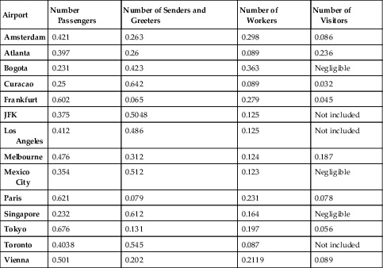

**One measure and two dimensions of the table**

In this table, there is `one measure` presented, which is the number of `individuals` that have either been passengers, senders or greeters, workers or visitors to an airport, expressed as a `ratio` between these four `roles`. The four roles are the `first dimension`, while the airport is the `second`. Both `dimensions` span the data and provide the level of detail for the counting of individuals.

**Foundation of dimensional modeling**

These two fundamental concepts, `measurements` and `context`, are the **foundation of dimensional modeling** [3].


## 7.2. Star Schemas

When a `dimensional model` is expressed on a relational database, it is called a `star schema`. This is due to the fact that the dimensional model of relational tables looks like a star from an overview (Figure 7.1).


>FIGURE 7.1 Sample star schema for airport visits (physical design)
>
>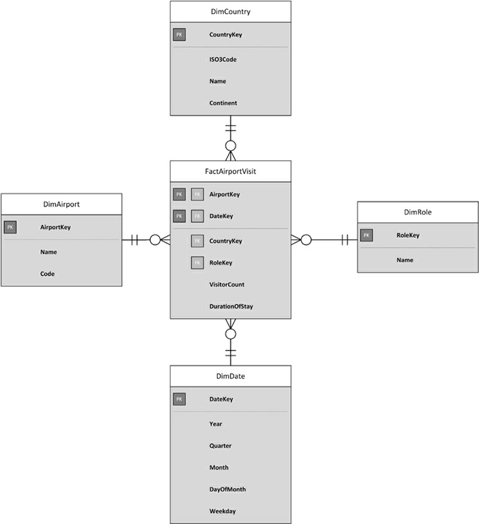

**Model underlying DimTable7.1**

The model in `Figure 7.1` represents the model underlying the data in `Table 7.1.` There is a `fact table` in the center of the model, surrounded by four `dimension tables`.

**Difference between `Dimensional Model` and `normalized model` is the denormalized tables**

The major difference between the `star schema` in Figure 7.1 and a normalized model in `third-normal form (3NF)`, which is often used in operational systems, is that the `dimensional model` typically uses denormalized tables, especially:

• **Fact tables**: the table in the center of this figure holds the `measures` of the business, which in the case of Figure 7.1 are `flight transactions`. These `measures` are typically `metrics` which the business wishes to put through further `analysis`.
• **Dimension tables**: dimension tables group the facts into `categories` and provide additional descriptive `attributes` to these categories. **These categories are called dimensions** and help the end-user to navigate in the model and **select only a `subset` of data for analysis.**


**Why Dimensional Modeling and Star Schema**

In addition to these major tables, there are other table types often used in `dimensional modeling`, for example `bridge tables`. In most cases, it is possible to create a `dimensional model` that contains the same `content` as the `3NF` model. However, expressed as a `star schema`, it is easier to understand for `business users` and is tuned for `query performance`. This is due to the `denormalization` that typically occurs when transforming a 3NF model into a dimensional model. `Hierarchies and lookup tables` are prejoined, which requires the `optimizer` of the relational database server to consider fewer joins and requires fewer temporary tables. It is also possible to aggregate data very easily, because all `measures` are already included in the central `fact table` [2]. Some editions of Microsoft SQL Server also support `star join optimization`, a feature that drastically reduces the amount of data that needs to be returned from the disk in order to answer queries [5].


The next sections explain the basic entities of `dimensional modeling` and `star schemas` in more detail. 

### 7.2.1. Fact Tables

**What‘s `Fact table` and the `facts` of the table**

`Fact tables` **contain** `information` about specific `business processes` or `events` within these processes. Examples for such `business processes` and `events` are flights, orders, phone calls, or Web site hits. Each `record` in the `fact table` **represents** one of these events and **provides** the `measures` that are associated with the business event. Usually, these are `numerical values` that quantify how long the flight was, the time to take-off, the number of diversions, or how many items were ordered, at which price [2]. **These `values` are called `the facts of the table`.**


In other cases, `fact tables` can **contain** `relationships` between business objects, for example `inventory levels` at given days. These `inventory levels` are a form of `relationship` because they indicate which product is available at which warehouse location at a given point in time. Each relationship is represented in the fact table as one record.


Figure 7.2 shows an example of a fact table that represents a flight.

>FIGURE 7.2 Fact table for flights (physical design).
>
>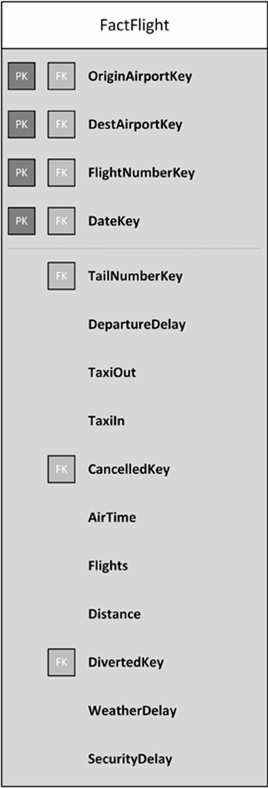

**Types of columns in fact table**

The `fact table` has two different `types` of `columns`: **first, `foreign key references` to `dimension tables`** which are covered in the next section. This includes all four references that are part of the primary key, but also TailNumberKey, CancelledKey, and DivertedKey. And **second, the `measure values`, the `facts` themselves**. Many of them indicate the length of delays, for example DepartureDelay, WeatherDelay, or SecurityDelay. Others indicate the length of subprocesses, for example the time to taxi in and out, airtime and the traveled distance. 

 **Fact table’s primary key**

Not all facts are `numeric values`, but they are **of most value** to business users, because they can be easily aggregated by `dimension`. The `fact table` is identified by a `subset` of `foreign key references` to `dimension tables`. This subset becomes the `composite key` that represents the `primary key` of the table. Not all `foreign keys` are required to be included in the `primary key`, because many times the dimension only describes the fact but does not identify it. In other cases, it might be required to add another identifying `fact` into the fact table’s `primary key` to guarantee uniqueness, for example a transaction number, such as an invoice number or a booking reference code [2].

**Introducing keys should be avoided**

`Introducing keys` for uniquely identifying the rows as the primary key of the fact table should be avoided, because of the storage space required for storing the key value but also for maintaining the `index`. The `index` itself is of no use, because it cannot be used by the end-user to identify individual facts. Only in some limited cases, mostly for technical reasons, a `generated or derived key` used as primary key actually makes sense. One example for such a reason is when it is required by the business to load identical rows into the fact table (for example, when dealing with history) or when other fact tables should be cross-referenced [2].


#### 7.2.1.1. The Grain of a Fact Table

**`Level of detail`, the number of `dimension references` ,is called the `Grain`** 

**The number of `dimension references` in the `fact table` represents the fact table’s `level of detail`. This `level of detail` is called the `grain`.** It is a good practice to **keep** the `level of detail` **as low as possible**, in the best case at the lowest level the source system provides. This original level of detail is also known as the `atomic level`. Providing such `atomic fact tables` to `business users` offers the most flexibility to them, because they can aggregate the data on their own by removing a dimension from the query and grouping the data by the `remaining dimensions`. This approach is called a `roll-up` and is used to summarize the data on a `subset` of `fact dimensions` [6]. However, keeping fact tables on the lowest grain is not always feasible if the `server infrastructure` doesn’t provide enough resources to keep the lowest `level of detail`. In this case, `pre-aggregating` the data to a higher level of detail offers faster responses to the `business users` when they query the fact tables directly. Note that this is not true anymore when using `multidimensional OLAP cubes` because they pre￾aggregate the data within the cube, transparently for the end-user.


### 7.2.2. Dimension Tables

**What Dimensions can provide**

`Dimensions` (thus the relational dimension tables) provide `context` to the facts [3]. They are very important to the understandability of the data warehouse. Without `dimensions`, it would not be possible to understand the `measures` provided by the `fact table` because all labels and other descriptive information is sourced from the `dimension tables` [2]. As already explained in the previous section, they are also used to specify how `facts` will be rolled up. And they can also be used to filter `facts` according to a `dimension` entry itself or one of its descriptive `attributes`. And it is also possible to sort aggregated measurements by the dimension or one of its attributes [3]. Figure 7.3 shows an example dimension table.


>FIGURE 7.3 Passenger dimension table (physical design).
>
>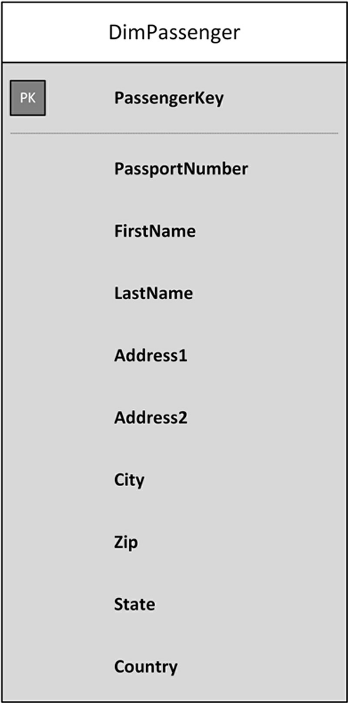

**Example dimension table**

Unlike `fact tables`, a `dimension table` uses a PassengerKey key value as the `primary key` of the table. This is because this key is used quite often in the `fact table` that references the `dimension tabl`e. In order to reduce the amount of required storage and to improve the join performance, it makes sense to do so and avoid the use of a natural key. Other than that, the key has no meaning to the business [3]. In addition to this `technical key`, `dimensions` often contain `business keys` that identify the entries in the dimension table [3]. In Figure 7.3, this is the PassportNumber attribute. The entries often represent `business objects` and the changes to these objects in the operational system. While the natural key for the same business object remains the same, even if descriptive data has been changed in the operational system, the key changes for each change of the data. This effect is used by the fact table to reference the version of the data that was active at the time when the fact happened in the business [3]. The `hash key` from the `Data Vault 2.0 model` is used as the key in the dimensional model. This simplifies the loading process and helps to virtualize `information marts`. The loading of `information marts`, both materialized and virtualized, is demonstrated in Chapter 14, Loading the Dimensional Information Mart.


**`descriptive data`of the `dimension table`** 

Despite the keys in the table, the `dimension table` holds the `descriptive data` that describe the `dimension entry`. It is very common that `dimension tables` consist of many `descriptive attributes`. They can range up to 50 or 100 columns. On the other hand, they often don’t have many rows in the table. There are some dimensions, such as the Passenger dimension presented in Figure 7.3, that might hold many records, but most dimensions are rather small, holding maybe a hundred records at most [2].

**What `attributes` should be measures in the fact table.** 


Not all `numeric attributes` should be measures in the fact table. For example, the row number of seats within an airplane is not used in any calculations. It might be used as a natural key, but it is not aggregated by the business user. The same applies to the age of the passenger, as long as the business doesn’t want to calculate the average age of the airplane’s passengers. There are different types of measures in the fact table of a dimensional model [2]:

-  **Fully additive measures**: are fully additive in the sense that the values, such as amounts and quantities, can be added up to a valid total.
-  **Semi-additive measures**: can be added up along some of the available dimensions, but not all.
-  **Nonadditive measures**: cannot be added up.


Therefore, it also depends on the `business needs` whether an `attribute` becomes a `measure` in the `fact table` or a `descriptive attribute` in one of its `dimension tables` [2].

### 7.2.3. Querying Star Schemas

**Simple `pattern` to query from a dimensional model **

`End-users` who are familiar with `star schemas` often follow a simple pattern when directly querying data from a `dimensional model`:

-  **Selection of required `facts`**: first, the end-user decides which facts should be selected by identifying the fact tables to be used.
-  **Selection of required `dimensions`**: by joining dimensions to the query, end-users add required context.
-  **Limiting `scope` of facts**: the facts are filtered according to dimensional values (either from the fact table or from joined dimensions).
-  **`Summarization` of facts**: the raw facts are summarized with aggregate functions, such as SUM() or COUNT().


Because this approach is so common, many database vendors have optimized their relational database engines to such requests, including Microsoft by the support of star join optimization, which we have already mentioned in section 7.2 [5].

The following statement could be used to query the fact table in Figure 7.2:

>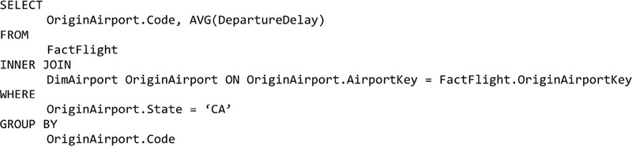


This `statement` would **first join** the dimension `DimAirport` to the `fact table`, using the OriginAirportKey. Note that DimAirport could be used two times: first for the origin airport, and second for the destination airport. Therefore, an `alias`, OriginAirport, is used for the dimension table in the statement.


Once the `dimension` has been joined, the `state of the airport` is used to **filter** the data to all airports in California. The airport’s state is a `descriptive attribute` in the `dimensional table`. In addition, the `airport code` is used to **group** the data in order to present the user a `list of known airports` in California with the average departure delay of that airport. The `statement` also shows how the `individual clauses` of the `statement` are used in `dimensional queries`:


-  **The SELECT clause** identifies the `measures` and `dimensions` that should be presented to the end-user. It also describes any `formulas`, including aggregate functions, that should be used to modify the presented result.
-  **The FROM clause** identifies the `fact table` that is queried. In many cases, this includes *only one fact table*. However, it is also possible to query data from multiple fact tables.
-  **The JOIN clause** joins the `context of the facts` to the end-result. There are multiple join clauses in many cases, each clause joining a different `dimension table`.
-  **The WHERE clause** limits the `scope of the facts` to be used in the end￾result. In many cases, there is data from more dimensional entries available (such as sales regions), which are of no interest for the given task at hand. Therefore end-users typically limit the data to the `dimension entries` of interest.
-  **The GROUP BY clause** defines how the data is grouped before `aggregation` and `presentation` to the end-user. The `aggregation` in the `SELECT clause` is based on this `GROUP BY clause`. By doing so, the `GROUP BY clause` is used to change the **grain** of the result from the fact table.

While the **GROUP BY clause can be used to change the grain of the facts to a higher level**, it is not possible to produce a lower grain level [3]. Consider a `fact table` that stores data about flight totals: how many passengers were on the plane, origin and destination airport, flight date, etc. If the fact table doesn’t store any information on the passenger level, it is not possible to analyze this information. Therefore, it is important to select the appropriate `fact table grain` when **designing** the `dimensional model`.


## 7.3. Multiple Stars

**To use `multiple fact tables` as the source of the query**

The `statement` in the previous section used only one `fact table` as the basis for the result. However, we have already mentioned that it is also possible to use `multiple fact tables` as the source of the query. This behavior is supported by `conformed dimensions`, which are used by multiple stars (a fact table with its dimension tables) and therefore connect these `individual stars` via the `conformed dimension` itself.

### 7.3.1. Conformed Dimensions(一致性维度)

**What's Conformed Dimension**

`Conformed dimensions` are `dimensions` that are shared by `multiple stars`. They are used to compare the `measures` from each `star schema` [3]. The reuse of `conformed dimensions` is very common in order to “**support true, cross-business process analysis**” [6]. This is only possible if all `star schemas` that should be analyzed in `cross-business process analysis` use exactly the same `dimension`, with exactly the same key values (primary keys). By using the `hash keys` from the `Data Vault 2.0 model`, meeting this requirement is simplified (see Chapter 14, Loading the Dimensional Information Mart, for details). Such analysis is called `drill-across` and brings the information from multiple business processes or events together [3]. Only then is it possible to analyze data from different fact tables by using the `conformed dimension`. Figure 7.4 shows an example.


>FIGURE 7.4 Two star schemas connected by conformed dimensions (physical design).
>
>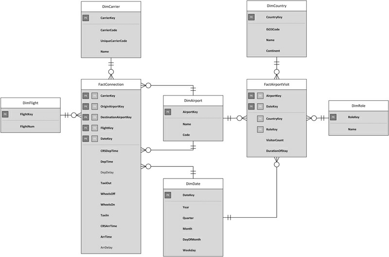

**`Fact tables`and their `conformed dimensions`**

In this example, there are two `star schemas`, with their `fact tables` in the center: FactConnection on the left and FactAirportVisit from Figure 7.1 on the right. Each of them has a number of connected `dimensions`. Both share two `conformed dimensions`, DimAirport and DimDate, which are shown in the center of the diagram. In order to support `cross-process analysis` between FactConnection and FactAirportVisit, it is crucial that both `conformed dimensions` have exactly the same structure and data.

**Changes to  `conformed dimension` should not break the dimensional stars**

To support such `conformed dimensions`, it is required that any change to a `conformed dimension` should not break one of the dimensional stars which uses the conformed dimension. This might and probably will occur in `later sprints` of the project. Whenever the `structure of the content of a conformed dimension` is modified, the `impact` on each dependent star schema has to be reviewed and properly tested. Therefore, the use of `conformed dimensions` incurs a change impact that might limit the agility of the development team. This `overhead` of maintaining `conformed dimensions` often leads to the practice that `developers` **don’t touch** `existing conformed dimensions` in order to avoid testing. Instead, they create new, additional conformed dimensions to avoid the reengineering costs, leading to nonconformed dimensions. In other cases, they copy the structure and data of existing conformed dimensions into new stars and extend them with new features, leaving the `conformed dimension` in the old model untouched (therefore, no testing is required) and adding nonconformed dimensions again. We call this practice “`dimension-itis`, ” which leads to an unmanageable number of dimensions that are all the same, somehow… nonconformed.


The opposite practice is to add more `attributes` and data into existing `conformed dimensions` in order to avoid adding new dimensions. This approach is practiced when developers want to avoid creating new conformed dimensions due to the amount of required testing of existing facts and dimensions. The end result of this approach is that the “conformed” dimension cannot sustain any further changes due to unclear and unmanageable changes to the structure and unclear or complex dependencies, and it becomes a “deformed” dimension: a nightmare requiring huge reengineering costs when touched in the future. Teams that produce such deformed dimensions often are likely to avoid documenting them, adding more headaches for their successors.


We don’t recommend preventing the use of conformed dimensions. What we need is a way to quickly create and change them, with low maintainability costs. Our recommendation is to use `virtual information marts`, which we describe in Chapter 14.


## 7.4. Dimension Design
The last section of this chapter covers some additional concepts from `dimensional modeling` that are used in later chapters of this book, including `slowly changing dimensions`, `hierarchies`, and a short introduction to `snowflake design`, which is a more extended dimensional model.

### 7.4.1. Slowly Changing Dimensions

**Changes of `dimensions`  , the `context of facts`.**

So far, we have discussed `dimensions` as entities providing the `context of facts`. This is true, but it is important to understand that this context changes over time. For example, the home address of passengers changes due to relocation, the last name changes due to marriage and the salutation might change due to an error correction. Because the connection between the star schema and the dimension is based on key values, it is possible for the model to absorb the source system changes in the best way to satisfy `analysis requirements`: `changes` can be either **tracked** within the dimension or they might also **overwrite** the existing data in the `dimension` [3].

**What's `SlowlyChangingDimensions`**

`Slowly changing dimensions` are used to handle changes in `dimensional tables`. This is because the pace at which dimensions change is relatively slow, especially compared to fast-changing fact tables [3]. Because there are multiple ways to track history in a dimension, Kimball introduced a classification for the dimensional tables [7].

**`Type 0` won't chang value**

A `slowly changing dimension type 0` preserves the initial dimensional attribute values. If a change occurs in the source system, **the value in the dimension is not changed**. While this type is less common than the next three, it can be used to retain the initial credit score of a customer or any other initial value [7].

 **`Type 1` Changes in the source system overwrite the `no history`data**

`Changes` in the `source system` overwrite the data in the `slowly changing dimension type 1`. The `dimension’s attribute` always reflects the most current value. Therefore, **no history is tracked** [2]. If there are `aggregations` based on this `attribute` (e.g., in the GROUP BY clause of the statement), the results of those aggregations change due to the new value [2]. Table 7.2 shows an example of a Type 1 dimension.


> Table 7.2 Slowly Changing Dimension Type 1
>
> 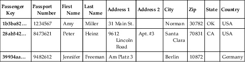

The `dimension table` presented in Table 7.2 holds address information about passengers. Each passenger is identified by a key, which is the primary key that is used by the fact table, and a `natural key`, the passport number. All other `attributes` in the dimension are of descriptive nature and describe the current address in detail.


When a `passenger` **moves**, the current record is **overwritten**. Therefore, `no history` is kept in the dimension table. The table only reflects the current address and no past addresses of the passenger.

**`Type 2`changes in the source system add a new row to the dimension table**

Instead of overwriting existing data, `changes` in the source system **add** a new row to the `type 2 dimension table`. By using this approach, it is often possible to correctly keep track of history. Therefore, it is the predominant technique to track history in `information marts` [2]. An example of a Type 2 dimension is presented in Table 7.3.


>Table 7.3 Slowly Changing Dimension Type 2
>
>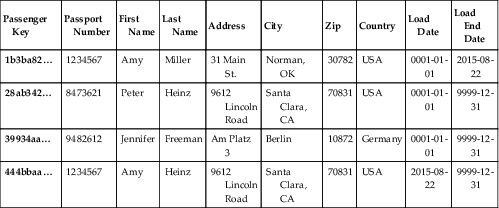


The table (modified from Table 7.2 and fit for purpose) shows how `changes` are **tracked** in a `slowly changing dimension type 2`: each new version of the `record` is added as an additional `row` to the `dimension table`. In this example, Amy Miller, with key 1b3ba82…, has married Peter Heinz, with key 28ab342…, and moved to his place in California.

Therefore, her new record with key 444bbaa… reflects these changes. The old record remains untouched to keep the historical information. Old facts keep using the record with key 1b3ba82…, but new facts reference the dimension entry with key 444bbaa….

**`Type 3` don’t add additional `rows` but track history in `additional columns`.**


Changes in a `slowly changing dimension type 3` don’t add additional rows but track history in `additional columns`. For each attribute that should be historized, a `new column` is added per change that occurred in the `source system` and should be displayed to the `business user`. This makes it easier to analyze the changes over time. Table 7.4 shows an example.

> Table 7.4 Slowly Changing Dimension Type 3
>
> 


This example shows how a `business` keeps track of the passenger’s `previous state` using an `additional column`. When the passenger moves, as is the case with Amy Miller (now Amy Heinz) in the entry with key 1b3ba82…, **the old address is overwritten and the attributes that should be historically tracked are copied into additional columns**. In this case, the Previous State column is updated to reflect the previous state of the passenger. History is not limited to only one entry. It is common to use a limited number of columns to keep a couple of changes – in most cases only the actual and the previous value. In other cases, key performance indicators (KPIs) are tracked over time, as in the example in Table 7.5.


>Table 7.5 Slowly Changing Dimension Type 3 with Multiple Columns 
>
>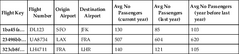

Table 7.5 shows a dimension that keeps track of available flights, where they start from and their destination airport. In addition to this basic information, the dimension table provides three KPI values that show how the average number of passengers has evolved over the last three years (including the current year).

In addition to the presented `dimension types`, the following ones are found in some cases [7]:
• **Slowly changing dimension `type 4`**: this type puts `volatile attributes` into a `separate mini-dimension table`.
• **Slowly changing dimension `type 5`**: a `hybrid` between type 4 and type 1 dimensions (4 + 1 equals 5). It allows access of the currently assigned mini-dimension attributes along with the base dimension’s others without linking through a fact table.
• **Slowly changing dimension `type 6`**: this type adds current attributes to a type 2 dimension.
• **Slowly changing dimension `type 7`**: this type achieves the same functionality as type 6 dimensions but with dual foreign keys added to the fact table: one that references a type 2 dimension with the tracked attributes, while the other one references the current row.


### 7.4.2. Hierarchies

**What's `Hierarchies`**

`Hierarchies` are another important concept in dimensional modeling. They allow drilling down of data in order to analyze the data in more detail. Consider the following example: An Excel `PivotTable` presents worldwide passenger revenue of several years in total values (Figure 7.5).

>FIGURE 7.5 Passenger revenue per year and region.
>
>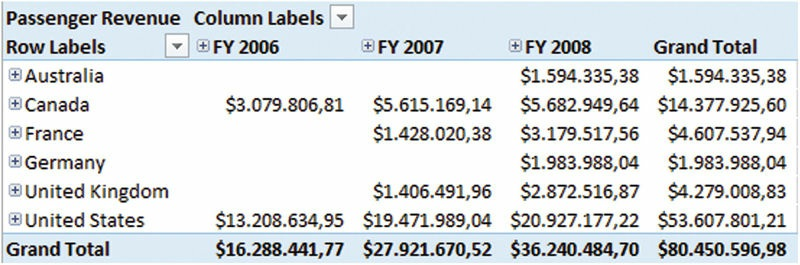

**What the `hierarchy table` shows**

The `columns` in Figure 7.5 show the financial years (FY) from the `Date dimension` that are available in the `PivotTable`. The `rows` show the geographic `regions` from the Geographic `dimension`. In addition, there are grand totals that show the overall value for each column or row. For example, the passenger revenue of FY 2008 in the United States was $19,471.989.04.

The geographic `hierarchy` is made up of the following levels:
1. Country
2. State-Province
3. City
4. Postal Code


It is possible to drill-down to any level that is available in the PivotTable (which is based on an OLAP cube), but not any further. Figure 7.6 shows a logical model that shows the Geography dimension with its `hierarchy`.

>FIGURE 7.6 Geography dimension (logical design).
>
>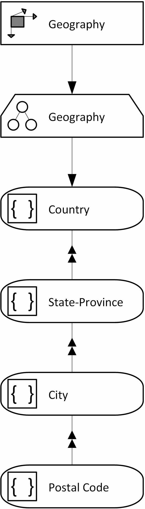

**`ADAPT™ modeling methodology`**

The notation follows the `ADAPT™ modeling methodology` for `dimensional databases` [8]. The `methodology` is frequently used in the industry to model and document `dimensional models`. The first element depicts the `Geography dimension` itself. The `dimension` includes one `hierarchy`, also called Geography. The other elements are the individual levels of the hierarchy and have to follow in the given order. We are going to the `ADAPT modeling methodology` throughout the book.

Similar to the `Geography hierarchy`, the Fiscal Calendar hierarchy
consists of multiple levels:

1. Fiscal Year
2. Fiscal Semester
3. Fiscal Quarter
4. Month
5. Date

**`Fiscal year` on another day rather than December 31. **

This `hierarchy` is very common in data warehouse systems and is frequently used by end-users. It uses a different start date for the year, a practice often performed by `commercial organizations`. For example, `businesses` in commerce and trade often start their `fiscal year` on another day than December 31. This is often due to the frequent post-Christmas returns made by customers who are not happy with their gifts. Because the volume of these returns is relatively high, it has an impact on the year’s total revenue. However, in most cases, the returns happen in January of the following calendar year. If the company closes the books by the end of December, the returns would account to the following fiscal period and skew the financial results. Therefore, these companies often choose another month as the end of the fiscal period. One example is Best Buy, an electronics retailer in the US. The company’s `fiscal year` ends on February 1 [9]. Figure 7.7 shows the logical model of the Date dimension.


>FIGURE 7.7 Date dimension (logical design).
>
>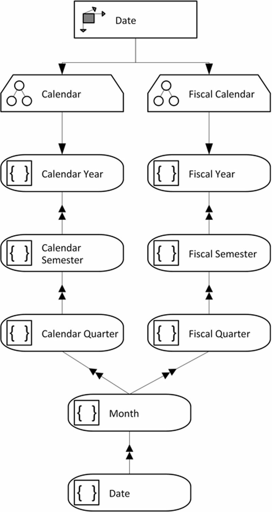

**Both hierarchies are resonable**

Note that there are `two hierarchies` available in the `dimension`: Calendar and Fiscal Calendar. Both have their own Year, Semester and Quarter levels but share their Month and Date levels. Both `hierarchies` use all `attributes` of the dimension, but they are organized in a different way. Depending on the business analyst’s `need`, one or the other hierarchy is used. Nothing is wrong with either; the value of each hierarchy depends on the context of the business analysis.


To analyze the information in Figure 7.5 in more detail, it is possible to click the plus sign next to the row label and drill-down into the Geography hierarchy, as shown in Figure 7.8.


>FIGURE 7.8 Passenger revenue in the United States per year.
>
>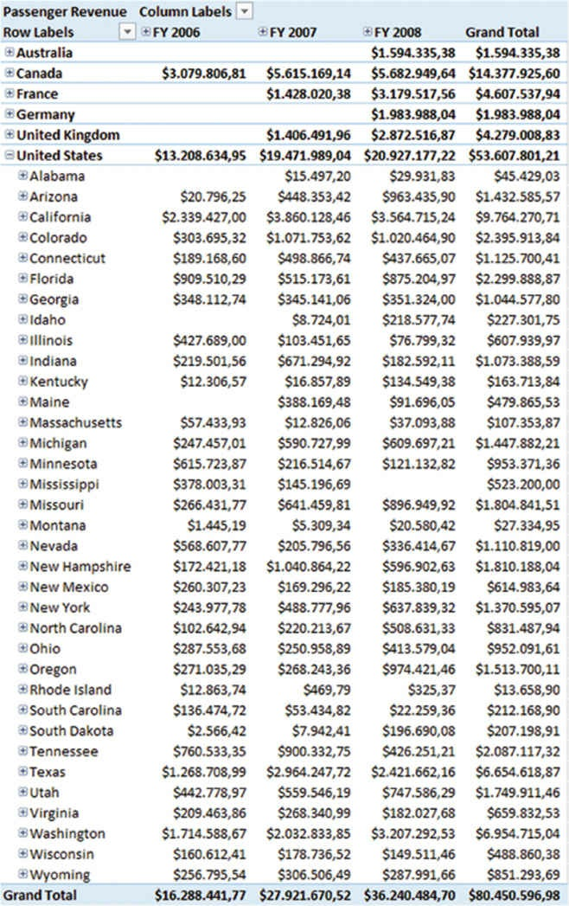


The total passenger revenue that is still displayed in the row marked bold is broken up by state, the next geographic level below the country level. For each state, the passenger revenue is displayed per year. It is possible to further break down this data, by drilling-down to the next level (Figure 7.9).


>FIGURE 7.9 Passenger revenue in Alabama per year.
>
>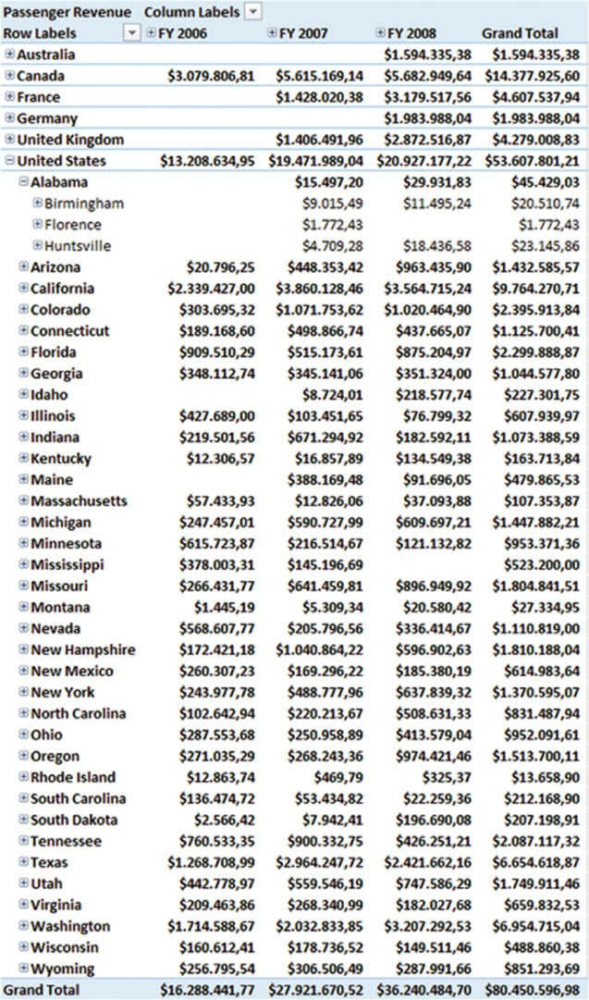

In Figure 7.9, the passenger revenue for the state of Alabama is further analyzed. Each city in Alabama is displayed and the passenger revenue for each city is presented per year. The date column represents a similar hierarchy. It is possible to drill-down this hierarchy, too. 

Figure 7.10 shows only data from FY 2007, but in more detail. Note that the first three months of the financial year, which starts in July, are being displayed. For each month, quarter and half-year, the table shows total values in the columns on the right. By using this approach, business analysts are enabled to understand the information in the table in great detail.


> FIGURE 7.10 Passenger revenue in Alabama per year indetail.
>
> 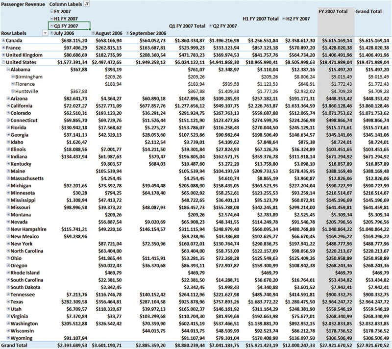

The Geography hierarchy is implemented physically from the `dimension table`, as shown in Figure 7.11.


>FIGURE 7.11 Geography dimension (physical design).
>
>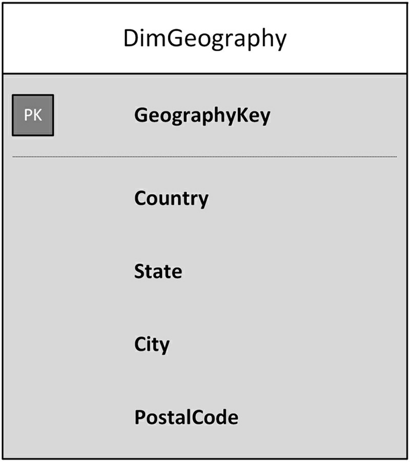

Each level of the `hierarchy` is based on one of the physical attributes of the dimension table. The association between the attribute and the hierarchy level is done in Microsoft SQL Server Analysis Services and is discussed in more detail in Chapter 15, Multidimensional Database. Similar hierarchies will be implemented in the chapter when the OLAP cube is being built and a date dimension is added as a hierarchy.


### 7.4.3. Snowflake Design

**Snowflake Design, An `indirect joining` of dimension tables**

This chapter has introduced the `star schema`, which is based on a `fact table` in the center, and accompanying `dimension tables` that provide `context` for the `facts`. These `dimension tables` are directly joined to the fact table. An `indirect joining` of dimension tables – that is, **a dimension table that is referenced by another dimension table** – is not possible in a true star schema. This is also true if there is a relationship between dimension attributes. Consider the example of corporate groups in the airline industry and individual carriers. Each airline is part of a larger group, which owns the carrier. For example, United Continental Holdings, Inc. owns both United Airlines and Continental Airlines, among other, smaller carriers.


If a star schema should express this relationship, both dimensions, DimGroup and DimCarrier, have to be directly referenced by the fact table, as shown in Figure 7.12.


>FIGURE 7.12 Star schema with fact table in the center and directly referenced dimensions only (physical design).
>
>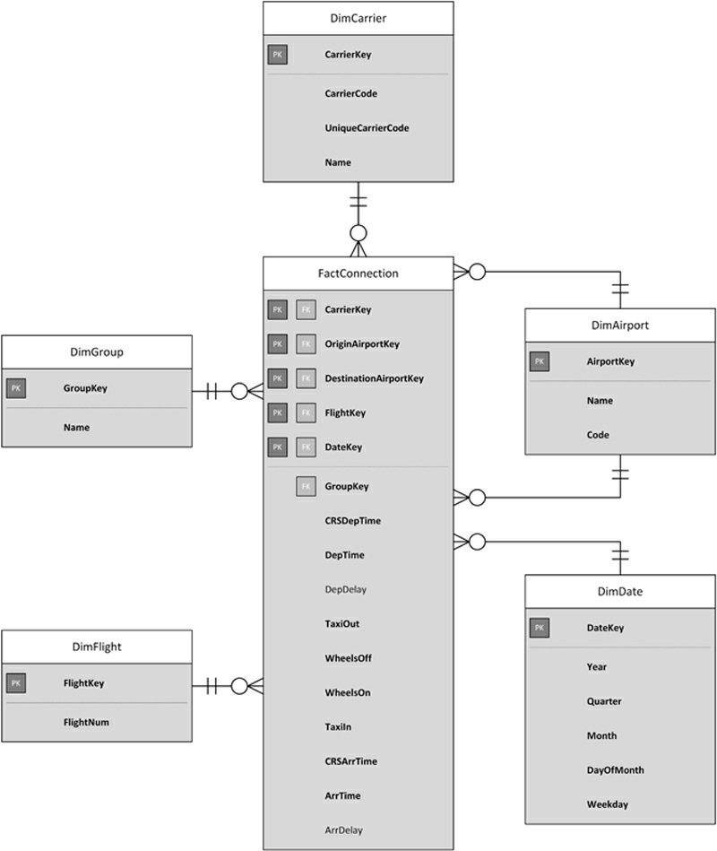

This example follows the one presented in Figure 7.4. However, it shows only one star schema. Note the two dimensions DimGroup and DimCarrier which are **independently referenced** by the `fact table`.


However, there is an `implicit relationship` between these two dimensions. The relationship is implemented in the `ETL job` that loads the table. The `ETL job` makes sure that only valid CarrierKey and GroupKey combinations are loaded into the fact table. The model does not implement any `rule` that prevents the loading of invalid combinations. On the other hand, this model is easy to use by business users, because they can directly join all required context information. This is why, on the first hand, the star schema allows only directly referenced dimension tables. For example, in order to return the average delay of a group, the following statement could be used:

>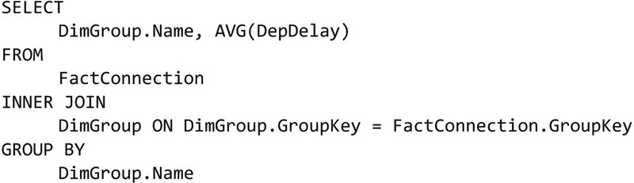

As the `statement` shows, there is not much `effort` required to **join** the group into the result set. The join is performed directly using the GroupKey field in the fact table.

A `snowflake schema`, on the other hand, allows `indirect dimension tables`. This is useful if the `relationships` between `dimension attributes` should be modeled explicitly. If the model in Figure 7.12 were modeled as a star schema, it would look similar, as in Figure 7.13.


>FIGURE 7.13 Snowflake schema with fact table in the center indirectly referenced dimensions (physical design).
>
>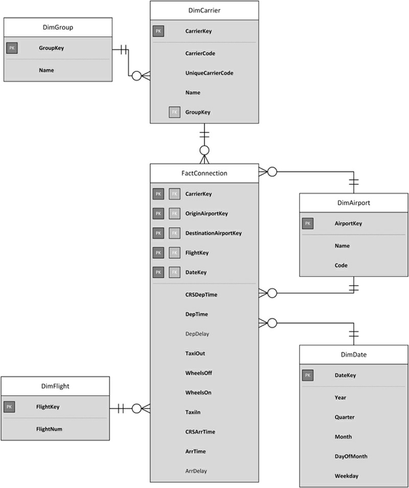


As you can see from the diagram, the term “`snowflake`” comes from the appearance of the model. `Dimension tables` emerge from the fact table in the center, similar to the branches of a snowflake [3]. Instead of **directly referencing** DimGroup from FactConnection, the group is indirectly referenced using DimCarrier. The `GroupKey` which identified the group in the fact table has **moved** into `DimCarrier`. In order to return the average delay of a group, as similar to the previous statement, it is required to first join DimCarrier in order to join DimGroup:

>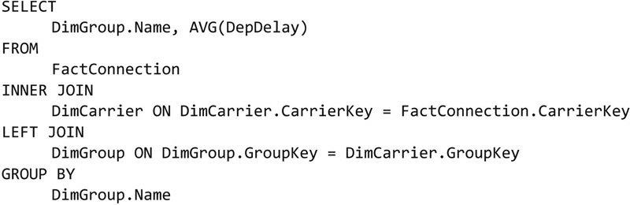

This is not a problem if you are used to writing `SQL statements` and have no problem with indirectly joining tables as in this statement. For an experienced `database developer`, this `statement` poses no threat at all. However, if `business analysts` with less knowledge and experience with SQL statements have to deal with snowflake designs, they might become overwhelmed and not be able to cope with the database anymore. Despite this problem, `snowflake designs` are actually used very frequently.


