# Physical Data Warehouse Design(322-374)

[TOC]


## Abstract
Data warehouse projects have special requirements for the physical architecture of the database system. These requirements distinguish data warehouse projects from operational data stores and are often underestimated. This chapter covers topics such as hardware optimization, optimization of the operating system, a “sales-pitch” for a dedicated data warehouse infrastructure (as opposed to adding the data warehouse to the existing, operational infrastructure), and some background information on hardware and database options. It also includes how to set up each individual layer of the data warehouse and the options available for each layer.

### Keywords
```
hardware optimization
operating system
warehouse infrastructure
hardware
database
```

Data warehouse projects have special requirements for the physical architecture of the database system. These requirements distinguish data warehouse projects from operational data stores and are often underestimated. This chapter covers topics such as hardware options, optimization of the underlying hardware and the operating system, and some background information on table partitioning and filegroups for database tables, among other topics.

This chapter also shows how to set up the databases required for following chapters in Microsoft SQL Server 2014.


## 8.1. Database Workloads
Relational databases are used for different purposes. For example, business applications use them to store and retrieve operational data in online transaction processing (OLTP). When processing transactional data, database management systems have to deal with many read and write requests. In most cases, the required workload for read outnumbers the workloads for writes in OLTP scenarios: a ratio of 80% to 20% is common [1]. However, compared to business intelligence (BI) applications, the number of reads is very low.


Also, there is a different work load pattern: transactional systems have reads and writes all through the (working) day, as long as business users are working with the data: for example, opening screens in applications (which require SELECT statements), performing transactions (requires SELECTs and INSERT statements) and modifying product data (requires UPDATE statements). The operations in OLTP applications are typically performed on individual records, or only a few records.


Business intelligence applications are different in this regard: usually, they are loaded in intervals, for example in the early morning of the day, and the batch loads are finished before the office opens. These batches involve much larger data sets than in transactional systems. The data in a data warehouse is optimized for fast reads because SELECT statements make up the majority of the workload throughout the day. Quick response times are not as important as in OLTP applications (where users are not willing to wait for some seconds to open a product description). However, a fast response time from the business intelligence application is still desired. Another type of workload is the one experienced when dealing with online analytical processing (OLAP), which is not only read intensive but also requires lots of computations and aggregations. Tools in this field, such as Microsoft SQL Server Analysis Services, often access whole datasets in order to perform their
calculations [2–4].


### 8.1.1. Workload Characteristics


In addition to this read-write mix, there are additional characteristics that pose challenges to the infrastructure [2]:
1. Data latency: this characteristic is the lag between data creation and data consumption. Some applications, such as many OLTP applications, require a short latency in order to use new data in upstream business processes. Batch-driven data warehousing applications have a higher tolerance for longer latency, because the data is often loaded overnight, long before it is used by the business user. Therefore, the database management system has enough time to store the data and make it retrievable. This gives data warehouse architects the freedom to use database resources in a more efficient way, for example by using bulk data processing and set operations. Exceptions to this truly analytical use case are real-time data warehouse systems, where short latency is required. These systems have special requirements and constraints and are not covered by this book.
2. Consistency: the immediate consistency of data is very critical for OLTP systems because the data is being accessed as soon as it is written to disk. The data consumers expect to find a consistent view of the data when using the data in subsequent business processes. The same is true for data warehousing, but, depending on the use case, an eventual consistency [5] might be enough to satisfy the business users. This is often experienced when massively distributing the data among many nodes. Many Big Data technologies such as Apache Cassandra [6], MongoDB [7] and others provide eventual consistency. However, this is not a perfect solution, which is strict consistency where any change to the data is atomic and is taken into effect instantaneously [8]. Instead it is a pragmatic approach that follows the CAP theorem [9] by ensuring that the network partitioning is ensured, availability is high and consistency is a little loose in overall terms (i.e., eventually) [10].
3. Updateability: there are different options available if data is not updateable but permanent. While OLTP systems often perform updates on existing data (such as updating product descriptions), business intelligence and OLAP applications often assume that data is written to disk permanently. For example, transactions are often permanent, e.g. Web logs from a Web server such as Microsoft Internet Information Services (IIS). Because this data never changes, it is possible to optimize the data collection procedures for this behavior. This is a great advantage given the fact that UPDATE operations are much slower than INSERT operations on most relational database management systems (RDBMS).
4. Data types: the fastest option is to deal with tabular sets of data. However, not all data is in tabular form. Sometimes, a data warehouse needs to absorb hierarchical data or, in other cases, unstructured data such as texts or audio files. In order to deal with such data in a RDBMS, the data needs to be flattened or structured. If that is not the desired goal, the data warehouse can also be put on NoSQL databases or can integrate NoSQL databases for parts of the data. Data Vault 2.0 provides provisions for both cases, but a lengthy discussion is out of the scope of this book. Some details are provided in Chapter 2, Scalable Data Warehouse Architecture.
5. Response time: the response time is the time it takes the RDBMS to return the results from a user query. The challenge is to read all required data and return the aggregated or otherwise computed data to the user. To satisfy the user requests, it is often required to read large volumes from disk in order to summarize it. For that reason, many OLAP engines, such as Microsoft SQL Server Analysis Services, try to prestage the data and perform most calculations and aggregations ahead of time. That way, they can return the results for predicted calculations and aggregations much faster. The other response time that should be noted is the response time for writing data into the data warehouse, including achieving an eventual consistency of the data.
6. Predictability: in some cases, the expected workloads are highly predictable: for example, most OLTP systems have a highly predictable workload over the day. The same applies for relational reporting and dashboards in data warehousing because the same queries are executed over and over. In other cases, the workload is less predictable. This is true for some OLTP scenarios, for example small Web servers with unexpected Web traffic peaks. Ad-hoc queries and data exploration tasks are another example from data warehousing where the workload is not predictable.


Due to the different characteristics of each workload, it is important to understand that the hardware configuration needs to be optimized differently for OLTP, BI and OLAP applications. It is not recommended to use the same infrastructure for OLTP and OLAP applications, for example. Instead, an infrastructure should be used to house data warehouse applications and another to house transactional systems. This separation allows IT to optimize the infrastructure according to the described characteristics.


However, even having two sets of infrastructure is not enough, as discussed in the following section. 


## 8.2. Separate Environments for Development, Testing, and Production


While the separation of OLTP systems from data warehouse systems is necessary because of the different workload characteristics of both applications, it is also required to distinguish between a development environment, a test environment and a production environment, following standard principles from software development. Chapter 3, The Data Vault 2.0 Methodology, explains why and how software development approaches are used in the data warehousing and business intelligence field. This is due to different requirements regarding the stability of the system and the loaded data and due to security requirements. There are business areas where the developers and testers must not have access to production data.


Business intelligence developers need a test bed to run their code and their tests against. Usually, these tests are executed against extreme cases of data and random samples of production data. Regardless of the actual testing method, whether it is test-driven development or something else, business intelligence developers need a development environment to develop their solutions.


Once developers have implemented all planned features of the sprint and have tested their code with their means, the goal becomes to deploy the functionality to the business user. In order to do so, a standardized deployment process is required, and such a process requires testing the new functionality against production data without putting the production system at risk. This is where the test environment comes into play: it provides a copy of the actual production data with all functionality currently in productive use. In fact, it is a copy of all functionality and as much production data as possible. If possible, the test environment should contain a full copy of the data that is currently being used by the business users. However, it is not always possible to have a full copy of the data in the test environment, for example because of storage limitations (apart from legal requirements, which complicate these matters). As a general guideline, at least 50% of the production data should be used for testing. The test environment is not only used to test new functionality against production data [11], but it is also used to test the deployment procedures, such as any installation or other setup routines against a realistic copy of the production environment [12]. And, as soon as the new functionality has been successfully installed in the test environment and, therefore, passed all technical tests, the test environment provides the basis for acceptance tests performed by business users [13].


Without the successful completion of these tests, it is not possible to deploy the new functionality into the production environment. This environment provides the data and the current functionality to all business users, and therefore has a much higher workload than the development or test environment. While the development and test systems are primarily used by team members and a limited number of business users and other stakeholders, the production environment is mission-critical and is used by a much higher number of users and might be integrated into subsequent business processes or to the public. Therefore, running any tests or development activities against the production environment is highly debatable (this is the diplomatic version of “don’t do this!”). Also, the production environment should be physically separated from the development and test environments. This is important to prevent any side effects on the production environment while new functionality is being developed or tested. Also, sometimes these activities require extra workload, which might affect the production environment if all environments run on the same infrastructure [14].


### 8.2.1. Blue-Green Deployment


One problem with the deployment approach described in the last section is that the deployment must be performed two times within the sprint: first, all changes are deployed into the test environment to test the features and the deployment procedure itself and to perform user acceptance testing. Once all these tests have been performed successfully, the deployment into the production environment is performed in order to get the new functionality to the business user and bring the current sprint to a successful end [14].


The drawback of this approach is that these deployments have to be performed in sequence: without the first deployment successfully passing, it is not possible to start the second deployment. This could pose a serious bottleneck to organizations trying to achieve a two-week sprint cycle [14].


To speed up the deployment procedure, without compromising any established test standards, a concept from the mainframe world is used: blue-green deployment. In this scenario, there is a development environment and two production environments, shown in Figure 8.1. 

>FIGURE 8.1 Blue-green deployment.
>
>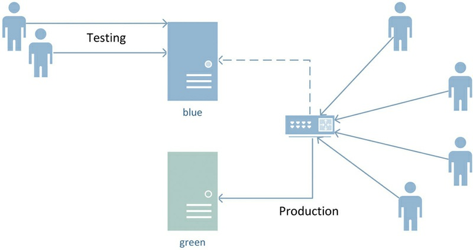

Business users use only one production environment. A router between them and the two environments routes user requests to the one that is currently active. In the case of Figure 8.1, the active environment is the green environment. The other remains in sync but is not used in actual production – hence the connection to the blue environment is dashed out (not active). As soon as the development team is ready to test new functionality against production data, the passive environment is used as the test environment. The team uses it as the test environment, deploys all new functionality and performs all tests that are required for production deployment.


Once the business users have successfully completed the user acceptance tests, there are two production environments: the currently active one, representing the old version before the sprint and the inactive one with new functionality as developed in this sprint. By hot-switching the router from the old production environment to the new one, the new functionality is immediately deployed into active use [14]. In order to make this scenario work, it is required that both environments be synchronized before tests start. Because this will usually happen towards the end of the sprint, the QA team has enough time from the beginning of the sprint to synchronize both environments before one of the systems is required for testing.


By using this approach, organizations can speed up the deployment into production. However, it imposes multiple disadvantages: first, there are two infrastructures required to run the production environments. Both have to be able to handle the workload that is required by the business. In the previous scenario, the test environment is often less powerful than the production environment, but serves the designated purpose very well. In the blue-green scenario, both infrastructures for production have to meet the requirements for full productive workloads, including all required software licenses [14].


The second challenge is that this approach requires a disciplined team: while the tests are performed against the passive production environment, this exact environment becomes active once the tests have been successfully completed. The same deployment has to be performed against the other production environment in order to get them synchronized again. There are other options for handling this synchronization, however. For example, it is possible to use database replication in Microsoft SQL Server and use Distributed File System replication to synchronize the ETL code [15].


Another challenge is that if new features require changes in the ETL processes, then the resulting ETL might have to be executed in both environments, which is not always possible. This challenge can be mitigated if the extraction of data follows a standard pattern and business logic is implemented using virtualized views which require no materialization of data. Both are true for the Data Vault loading patterns, presented in Chapter 12, Loading the Data Vault. It is possible to generate standard patterns, which are easy to deploy in replicated environments. Absorbing the changes is done in a single metadata layer.


## 8.3. Microsoft Azure Cloud Computing Platform


Before describing traditional data warehouse infrastructure within the premises of the enterprise, another emerging option should be introduced: Microsoft SQL Azure, which is part of the Microsoft Azure cloud computing platform. The Microsoft Azure platform consists of three scalable and secure solutions [16]:


-  Microsoft Azure (formerly known as Windows Azure): A collection of Microsoft Windows powered virtual machines which can run Web services and other program code, including .NET applications and PHP code.
-  Cloud Services: A set of services that provide a service bus for handling messages in a subscriber/publisher topology and other core capabilities, such as federated identity for securing applications and data.
-  SQL Database: A transactional database in the cloud, based on Microsoft SQL Server 2014. It is possible to consume the data in this database from applications within the Azure cloud. In addition, other services have been released, including HDInsight,


which is Microsoft’s implementation of Hadoop for Azure [16]. Figure 8.2 presents the HDInsight ecosystem of Microsoft Azure.


>FIGURE 8.2 Hadoop/HDInsight Ecosystem [17]. 
>
>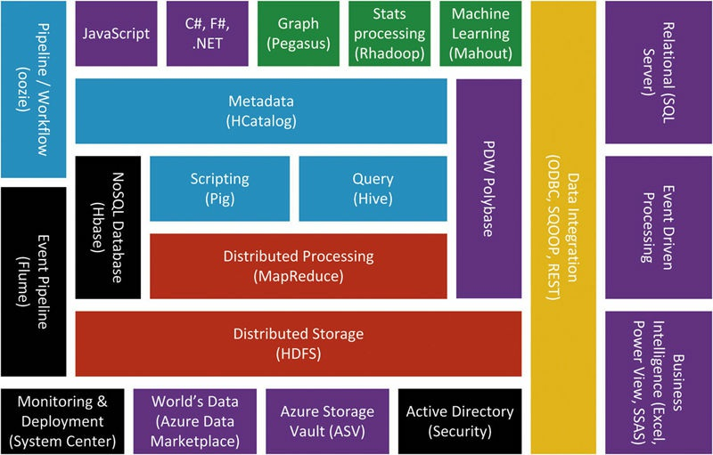


Without going into much detail regarding the individual components, it becomes obvious that HDInsight provides a powerful and rich set of solutions to organizations that are using Microsoft SQL Server 2014. The cloud platform enables organizations from small startups to large enterprises to scale their business intelligence solutions without any actual limitations.


In a cloud platform such as Microsoft Azure, the software solution is decoupled from the actual physical storage and implementation details. Developers who deploy their solutions to the Azure cloud don’t know the actual hardware being used; they don’t know the actual server names but only an Internet address that is used to access the application in the cloud [16]. While this is a nice architectural design on its own, it helps organizations to [16]:

1.  Provide seasonal applications and database solutions: data warehouse solutions that load only a small number of source systems, but with large amounts of data, often have peak times over the day. Some data warehouse systems source data only once a month, for example for calculating a monthly balance. In this case, the peak occurs only once a month as well. Providing large infrastructure for such cases might be financially unattractive.
2.  Provide solutions with short lifespan: some data warehouse systems are specifically built for prototypes. Setting up the infrastructure for such applications is already a burden, apart from maintaining it (or tearing it down) after the prototype is finished. However, due to the Data Vault 2.0 model, it is also possible to integrate the data into the Enterprise Data Warehouse and later archive the entities of the prototype. The integration would follow the standard patterns, such as satellites hanging off hubs and links, providing data from the prototype application.
3.  Separate storage: because the data in the cloud is separated from the local SQL Server on premise, the cloud can be used as a safe backup location.
4.  Reduce fixed costs of infrastructure: smaller companies can take advantage of the lower fixed costs to set up a SQL Azure database in the cloud and grow their cloud consumption with their business.


These business scenarios and advantages are behind the growing demand for cloud services. They also drive demand for business intelligence solutions in the cloud, at least partially (for now). Another driver for moving business intelligence into the cloud is the growing volume, velocity and variety of data that needs to be sourced for the data warehouse. Cloud services, such as Microsoft Azure, provide the storage and the compute power to process and analyze the data. 

Hadoop, an open source framework, is the de-facto standard for distributed data processing. It provides MapReduce “for writing applications that process large amounts of structured and semi￾structured data in parallel across large clusters of machines in a very reliable and fault-tolerant manner.” There are also many related projects that use the Hadoop core distributed storage and MapReduce framework [18].


MapReduce itself is a programming model that is used to process large amounts of data on a Hadoop cluster. These programming models are written in Java and split the raw data on the Hadoop cluster in independent chunks which are processed by independent and parallel map tasks. The advantage of using MapReduce is that the data is no longer moved to the processing. Instead, the processing is moved to the data and performed in a distributed manner. As a result, the processing of data is speeded up significantly. The output of these map tasks is then used as an input to reduce tasks which are stored in the Hadoop file system for further processing. Other projects, such as Hive or Pig, provide higher-level access to the data on the cluster [18].


With HDInsight, Microsoft provides a service that allows easily building a Hadoop cluster whenever it is required and tearing it down as soon as MapReduce jobs are completed. It also supports Microsoft Azure Blobs, which are mechanisms to store large amounts of unstructured data in the Azure cloud platform. The breadth and depth of Hadoop support in the Microsoft Azure platform (formerly Windows Azure platform) is presented in Figure 8.3 [18].  

>FIGURE 8.3 Hadoop in Microsoft Azure [18]. 
>
>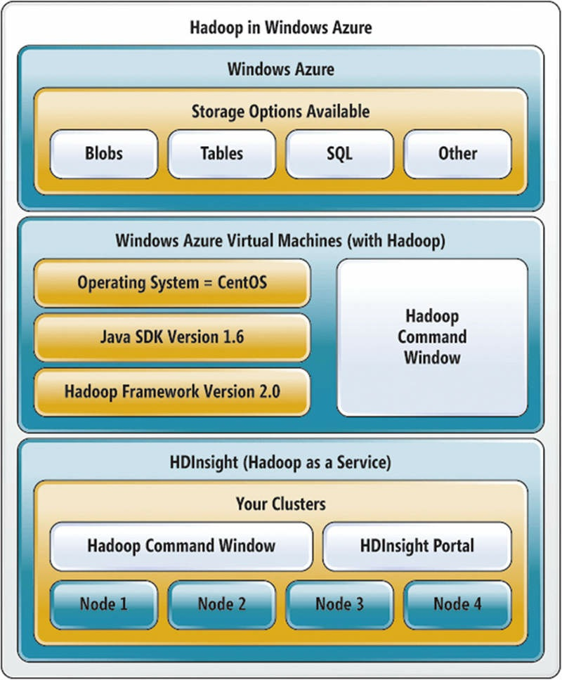


The first level on top of the diagram in Figure 8.3 is the Microsoft Azure Storage system, which provides secure and reliable storage, including redundancy of data across regions. A number of storage mechanisms are supported, for example Tables (NoSQL key-value stores), SQL databases, Blobs, and other storage options. Microsoft Azure provides a REST-ful API that is used to create, read, update, or delete (CRUD) text or binary data. The API allows clients with support for HTTP to directly access the data in the Microsoft Azure Storage system if they have granted access [18].


The data itself is transparently stored in custom virtual machines providing single-node or multinode Hadoop clusters; or in a Hadoop cluster provided by HDInsight. The first option, which is the second layer in Figure 8.3, requires setup of your own Hadoop infrastructure in Microsoft Azure virtual machines. However, setting up a multinode cluster by hand isn’t a trivial task. The second option is to use HDInsight, and directly set up a Hadoop cluster with a specified number of nodes and a geographic location of the storage using the HDInsight Portal [18]. In both cases, the underlying hardware is invisible to the developer because the infrastructure is managed by the Microsoft Azure cloud computing platform.

However, if an enterprise decides to set up its own infrastructure, the various hardware options are worth a deeper look, because they can drastically affect the performance and reliability of the data warehouse system. The remaining sections of this chapter describe the hardware options and how to set up the data warehouse on premise. 


## 8.4. Physical Data Warehouse Architecture on Premise


The physical architecture describes the hardware components of the data warehouse and depends on a number of factors, including [19]:


1.  Data size: the data size that needs to be stored in the data warehouse depends on the number of functional units from the enterprise to include in the data warehouse, the number and size of input sources, and the business problems to solve (which influences the number of information marts).
2.  Volatility: because the raw Data Vault tracks all changes to the data sources, the volatility of these source systems affects the data warehouse in two dimensions: first, the data size is higher, and second, the data warehouse will be much more frequently updated.
3.  Number of business processes: the more business processes that should be included in the data warehouse, the more source systems have to be loaded. This also affects the required resources to load them and run the data warehouse.
4.  Number of users: the more users are using the data warehouse, the more resources are required in order to handle their requests. The required resources also depend on how active these users are, how many are using the system at the same time, and what kind of peaks are in their usage patterns (for example, month-end reporting).
5.  Nature of use: the front-end tools also have influence on the required hardware resources. In some cases, virtualized Information Marts are applicable which require less storage but sometimes more CPU power. In other cases, more data has to be materialized which requires more storage for the Information Marts.
6.  Service level agreements: the performance and availability requirements set by the business can become a major influence factor for the physical data warehouse architecture. If users are accessing the data warehouse from all over the world, a 24 × 7 availability is standard. This also affects your loading cycles of the data warehouse. In other cases, the response time of your reports should be in the subsecond range. In such cases, more computing power is required.


These factors drive the requirements that are established by the business and have a direct influence on the selected hardware for the data warehouse. The next sections describe some of the hardware options that are available for the data warehouse.


### 8.4.1. Hardware Architectures and Databases


The Data Vault 2.0 standard is based on a model that allows an incremental build-out of the data warehouse. Data Vault 2.0 is also based on an architecture that incorporates NoSQL and Big Data Systems. Organizations that follow such an incremental build-out of the enterprise data warehouse benefit from rapid delivery of new features and are able to quickly integrate new source systems and deploy new information marts. Over time, the data warehouse will outgrow the initial hardware, such as the acquired disk storage or the CPU power. If this process is left unmanaged, only one system element is exceeded or out of balance – for example, because the data warehouse architecture requires many I/O reads. For optimum performance, the system elements should be in balance at most if not all times.


In order to ensure the growth of the data warehouse in the future, a scalable architecture is required. There are multiple options for data warehouse architectures, offering more or less scalability [5]:


The simplest architecture uses only a single server. In this scenario, presented in Figure 8.4, there is only one Microsoft SQL Server 2014 installation that uses its own single disk. Scalability is limited to the server box, e.g. the mainboard limits the number of CPUs by the number of available CPU sockets, and the number of hard disks is limited by the number of drive slots. It is possible to scale the hardware to some extent, for example by replacing the chassis with a larger one, offering more hard disk slots, or by adding more disk controllers in order to utilize more hard disks in the system. But at some point, the cost to add more hardware is too high and scalability become infeasible.


>FIGURE 8.4 Single server architecture [20]. Figure adapted by author from “Transitioning from SMP to MPP, the why and the how,” by the SQL Server Team. Copyright 2015 Microsoft Corporation. Reprinted with permission.
>
>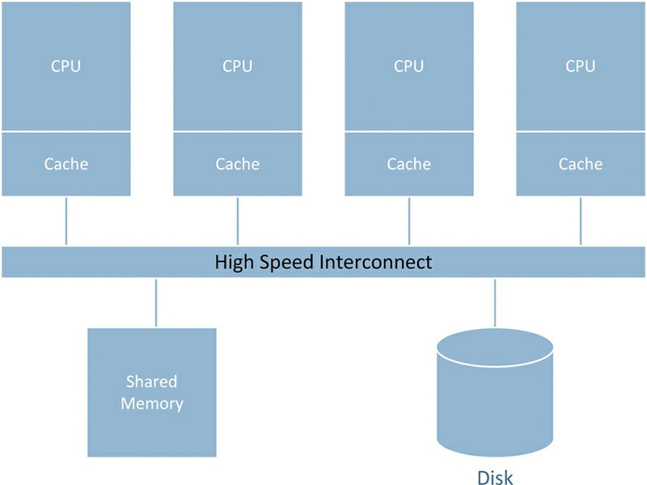


Microsoft SQL Server offers scalable shared databases, which allow use of a read-only database in multiple server instances. They can be used in reporting environments to distribute the workload among those instances. The database can be accessed by these instances over a storage attached network (SAN), which is discussed in section 8.4.4. Each instance uses its own memory, CPU and tempdb database. While queries run on only one instance (thus they cannot be executed across multiple instances), they cannot block the execution of queries on other instances [21]. Figure 8.5 shows how such databases are loaded.


>FIGURE 8.5 Building and scaling out a reporting database [21]. Figure adapted by author from “Scalable Shared Databases Overview,” by Microsoft Corporation. Copyright 2015 Microsoft Corporation. Reprinted with permission. 
>
>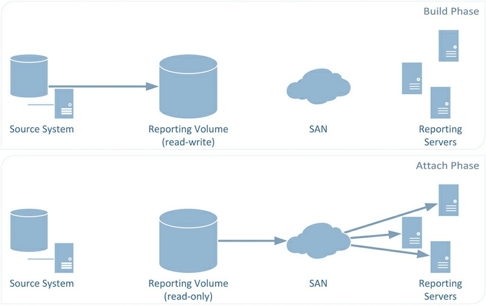


This solution requires a refresh phase, as Figure 8.5 shows. During this refresh phase of the displayed reporting servers, a stale copy of the database is updated and, once the update has been completed, attached to the reporting servers (multiple instances). Due to the read-only limitation, scalable shared databases should be used for materialized information marts only. They should not be used for the Raw Data Vault layer, especially not if real-time or near-real-time data is loaded.


A more sophisticated option is Microsoft SQL Server 2014 Parallel Data Warehouse (PDW) edition. It is a massively parallel processing (MPP) platform, implementing a SQL Server grid. This allows the distribution of data to multiple nodes on the grid. Each node has only a subset of data and user queries are answered by all nodes together. Microsoft SQL Server PDW supports two table types for this purpose: replicated tables that are actually copied to each node and distributed tables where the content of the table is distributed among the nodes. Figure 8.6 shows an example of an MPP architecture


>FIGURE 8.6 Massively parallel processing (MPP) architecture [20]. Figure adapted by author from “Transitioning from SMP to MPP, the why and the how,” by the SQL Server Team. Copyright 2015 Microsoft Corporation. Reprinted with permission.
>
>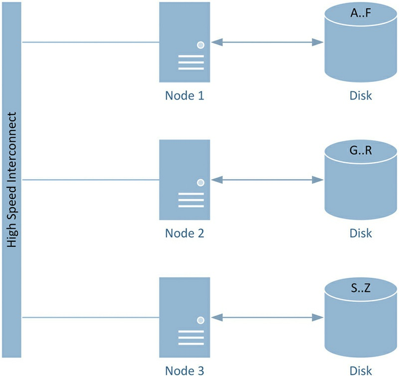


The first option is best suited for relatively small dimension tables. The data in the table is replicated to each node in order to have the data locally available. This improves the queries’ join performance because no data has to be collected from multiple nodes. The second option, which is shown in Figure 8.6, distributes the content of the table among nodes in order to improve the query performance by utilizing the resources of all nodes when handling user queries [22]. In Figure 8.6, the data is distributed according to a key which can be defined when setting up the distribution of the table. In this simple figure, all records with a key starting with A, B, C, D, E, or F are stored on the first node. Records with keys starting with a letter between G to R are stored on the second node and the remaining records are stored on Node 3. Note that, in practice, the data is often not well distributed because the data distribution in Figure 8.6 depends on the key distribution, which is often skewed. Hashing the key helps in this regard, because it creates hash values that
are very random and distributed [20].


User queries are performed against a control node and executed by active servers. These servers use dedicated storage systems to store a particular set of data. Data loading and backups are performed using other nodes, specifically added to the control rack for this purpose.


Note that Data Vault 2.0 doesn’t require a specific architecture. But due to the incremental build-out of the enterprise data warehouse, the initial hardware specifications will only last for a limited time. The objective is to scale the data warehouse over time and extend the original architecture as soon as the architecture becomes a bottleneck.


As soon as the hardware architecture for the data warehouse has been selected, the individual components must be selected. The next sections introduce some general guidelines for better hardware utilization if
financial resources are limited.


### 8.4.2. Processor Options
While some SQL Server editions require a per-core licensing, which can make CPUs with multiple cores very expensive, data warehousing, especially those who implement Data Vault loading patterns, can greatly benefit from multiple cores. We will demonstrate in Chapter 12, Loading the Data Vault, how hubs, links, and satellites can be loaded in parallel, using individual cores for each loading process. Having multiple cores also allows more users to issue queries against the data warehouse. Therefore, the data warehouse server should be equipped with as many cores as (financially) possible. For the same reason, Hyper-Threading Technology, a proprietary technology by Intel® , should be activated. Another factor that should be considered is the cache size of the processor as it also affects the performance of the data warehouse. Similar to the next hardware option, the general guideline is: the more the better if financial resources are not very limited. In all other cases, a properly balanced system is the best solution.


### 8.4.3. Memory Options
The database server uses physical memory for caching pages from disk. While operational database systems often deal with small transactions, data warehouse systems deal with large queries (referring to the amount of data being touched by the query). In addition, a query often requires multiple passes to deal with large tables; having the table already in memory can greatly improve the performance [23]. If SQL Server doesn’t have enough memory available to complete the operation, it uses hard disk storage, for example by using page files, tempdb or re-reading database pages from disk. Therefore, the more RAM the data warehouse system provides to Microsoft SQL Server, the better.


### 8.4.4. Storage Options
There are several storage options available for the data warehouse. This section introduces various storage options that are used in data warehousing, including RAID levels, local connectivity such as SCSI and Fibre Channel, and local versus network attached storage.


Most setups use one RAID level or another:


1.  RAID-0 is an unprotected disk stripe combining the access rates and the capacity of individual disk drives. A RAID-0 array appears to the operating system as one logical disk. For example, if four 100 GB disks are added to the RAID-0 disk array, a logical disk with a capacity of 400 GB is available in the system. The speed is also combined, as the data is written to all four disks simultaneously. Therefore, it is the fastest RAID option available. However, there is no failure protection. In fact, if one of the disks fails, the whole disk array becomes invalid, leaving unreadable data on the remaining disks [24]. To add failure tolerance, either RAID-1, RAID-5, or RAID-6 are often used.
2.  RAID-1 is a simple disk mirror, copying the data to all the disks in the RAID array. Therefore, the disk array has the same logical size as each of the individual disks: combining two 100 GB disks results in one 100 GB logical disk. If one of the disks fails, an exact copy of the data remains on the second disk [3].
3.  RAID-5 uses a more advanced approach to add failure tolerance to the disk array. It requires at least three disks [25] and calculates parity bits for the data that are distributed over all disks in the array. The parity bits are spread over the disk array. In total, the capacity of one disk is used for these distributed parity checks, resulting in a total capacity of the combined capacity of all drives minus one drive worth of space. If one drive fails, it is possible to replace the disk and rebuild the data from this disk using the distributed parity checks (and the data on the other drives). If more than one disk fails at the same time, all data in the disk array is lost [3]. This option is slower than RAID-1 but more cost effective as more capacity is available than in a similar setup with RAID-1 [26].
4.  RAID-6 overcomes the limitation of RAID-5 to handle only one failed disk. It requires at least four disks in the array and allows two failed disks at the same time by calculating and distributing two parity bits [31]. This RAID level is recommended for physical disks with a capacity higher than 1 TB or with disk array with more than five physical disks [27].


In addition to these RAID levels, there are more advanced levels that often combine multiple RAID levels, e.g. RAID-50 combines two RAID-5 arrays in a disk stripe (RAID-0). We suggest a review of those RAID levels in more detail before building the data warehouse infrastructure.
Table 8.1 summarizes the presented RAID levels.


>Table 8.1 RAID Level Comparison [28] 
>
>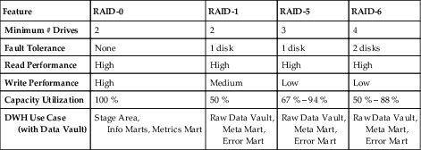


Note that the last row of Table 8.1 introduces some use cases for each RAID level. They apply only to data warehouse infrastructures following the Data Vault 2.0 standard. Note that it is also possible to store the stage area, information marts, and the Metrics Mart on another RAID level than the indicated 0 level. However, it is possible to accept the intolerance to failures, because the data that lives in these layers only exists for a limited time or can be reproduced from the Raw Data Vault. Section 8.6 will discuss the use cases in more detail.


For the best performance, it is advised to use multiple disk controllers for the data warehouse server. Section 8.5.3 will discuss the fact that row data should be separated from index data (and both from log files). Each set of data should be stored on separate physical disks or disk arrays. In order to maximize the parallelization and bandwidth of SQL Server’s data access, the best strategy is to use separate disk controllers as well [29].


Another option for data warehouse systems is the use of memory￾based disks, for example solid-state disks (SSDs). While consumer SSDs only allow a very limited number of writes during their device life cycle, enterprise-grade SSDs allow many more program and erase cycles [30]. Enterprise SSDs can be used in some cases in data warehousing [3]. One example is to store some indices on SSDs: indices are often updated only after batch loading the data into the table. However, they are accessed very frequently and, even more importantly, in random order. For that reason, indices can utilize the random access mode of SSDs very well [31].


It is also possible to use storage networks in data warehousing. In fact, many organizations actually use technologies such as Fibre Channel to attach storage to the data warehouse server. The advantage is that it is possible to share storage resources with other applications and extend it relatively easily when required. Other options include iSCSI which is used to transport data frames via IP traffic [3]. The advantages of such Storage Area Networks (SANs) are the following [31]:


1.  Higher availability: in many cases, SAN storage is more reliable than local storage. Therefore, SAN has the potential to reduce downtime of the data warehouse server.
2.  Better recovery from disaster: SANs are backed up centrally. This reduces operational costs and speeds up the time to restore files from a backup.
3.  Central management: instead of managing each server’s local storage, it is possible to manage the storage for all servers centrally. It’s even possible to increase available storage capacity to a server without opening the server. Instead, more space is assigned to the server remotely, often not requiring a reboot of the server.
4.  Space utilization: local storage is often underutilized because more disk space is added to the server than actually (or currently) required.


When using these options, make sure to understand that the bandwidth on these technologies is limited by the transport protocol. This limitation can affect the performance of your data warehouse applications [3]. The next section covers some networking options that should be considered.


### 8.4.5. Network Options
Another key component of a data warehouse server is the network interface [31]. It is used in several ways:
1.  Transfer data into the data warehouse: when data is loaded from source systems, it is transferred via the network interface.
2.  Transfer data out of the data warehouse: some tools, such as SQL Server Analysis Services (SSAS), pull out a great deal of data from the data warehouse to process it in a tool-specific way. If these tools are not installed on the same machine, a lot of traffic has to go over the network.
3.  Receive application queries: tools such as SQL Server Reporting Services (SSRS) or data mining tools access the data in the data warehouse using queries. These queries often ask the database server to perform aggregations or computations. Similar to the previous case, the query is transmitted over a network if the application is not installed on the same machine. However, these queries tend to be very small, as these queries are expressed in text format.
4.  Receive user queries in ad-hoc reporting: in some cases, users directly access the data warehouse to retrieve data. In order to do so, they have to submit queries to the data warehouse. Usually, the queries go through the network, as most users work from their local workstations. But again, these queries are small compared to the other traffic to and from the data warehouse.
5.  Respond to application or user queries: both types of queries have to return a result set with some amount of data. However, in most cases, this data is often aggregated or reduced to a limited number of records. But the traffic has to be transmitted over the network if the application is not installed on the same machine.
6.  Access data on SAN: if the data warehouse is using SANs, the data which are written by Microsoft SQL Server into database pages have to be transmitted over a network interface as well.


While receiving and responding to application or user queries should not be a problem for modern network interfaces, transferring data into and out of the data warehouse, or accessing a SAN, can become a problem. Organizations try to mitigate this challenge by using multiple network interfaces to improve the fault-tolerance of the system and allow for the separation of duties. SANs take advantage of such separation of duties when dedicated Fibre Channel networks are used to provide the required speed for this type of storage. But depending on the actual workload it might be worthwhile to review the use of additional network interfaces (many servers today have two cards) to separate sourcing from information access. In addition, reviewing the networking components between source system and data warehouse might identify bottlenecks that limit the actual bandwidth on the network.

This concludes our brief discussion of hardware components for data warehousing. Section 8.5 covers some general database options that should be considered additionally when setting up the infrastructure for the data warehouse.


## 8.5. Database Options
Before we present how to set up each individual data warehouse layer, a discussion on general database options is required. These options, which are covered in the next sections, help to improve the performance of the data warehouse.


### 8.5.1. tempdb Options
Microsoft SQL Server 2014 maintains a database for holding various internal database objects or version stores. This includes [32]:
1.  Temporary user objects: these objects are explicitly created by the database user, for example temporary tables, temporary stored procedures, cursors, or table variables.
2.  Internal objects: the SQL Server database engine creates internal objects, for example to store intermediate results for spools or sorting.
3.  Row versions from read-committed transactions: row version isolation or snapshot isolation transactions create row versions that are temporarily stored in tempdb.
4.  Row versions from database features: some features create row versions in tempdb as well, for example Multiple Active Result Sets (MARS), online index operations, and AFTER triggers.


The database is not only used in operational databases, but also heavily in data warehousing. As described in the previous list, indices and sort operations, which are used very frequently in data warehousing, are all performed with help of tempdb. Therefore, its usage should be optimized. Some guidelines should be considered when setting up the initial data warehouse infrastructure [33]:
1.  Set recovery model to SIMPLE: the database will automatically reclaim log space to keep the size of the database small.
2.  Move tempdb to a very fast disk: it should be the fastest option available.
3.  Put tempdb to a different disk: don’t put it on the same disk as other data or log files.
4.  Create multiple data files: the recommendation is to create one data file per CPU core.
5.  Allow the database to grow automatically: the database should only be limited by the physical disk, not any logical limits.
6.  Pre-allocate database if required: often, the production environment should not be interrupted for the allocation of new space for tempdb. In this case, pre-allocate as much space as expected for the workload of the data warehouse.
7.  Set reasonable growth increment: if the database needs to be expanded, make sure the growth increment is not too small in order to prevent frequent expansions of tempdb.


It is also recommended to monitor the size of the tempdb in order to identify bottlenecks due to space restrictions or changed usage patterns. The following query can be used [26]:

>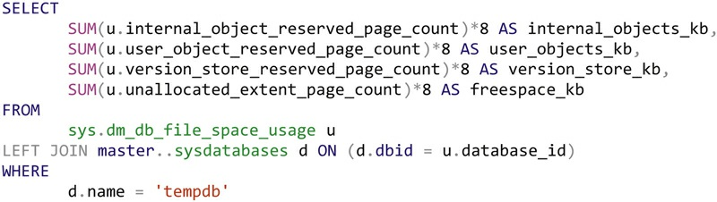
>


This query identifies and shows the space used by internal objects, user objects, and version store. It also shows how much space is left in the database. The query should be run regularly, for example on a weekly interval.


### 8.5.2. Partitioning


Partition is used when the data in a table or index becomes too large to manage by SQL Server 2014. If the data is too big, the performance of maintenance functions, such as backup or restore, can drop [26]. For this reason, data is often archived in operational systems, but this is not an option in data warehousing where we try to keep all history if possible. Also, the tables in data warehousing are often much larger than in operational systems, making this problem even more serious.


Partitioning splits the data into smaller pieces, called partitions. Rows that are added to the table are redirected into one partition during INSERT, resulting in partitions with subsets of data. It is possible to transfer or access each partition individually, thus applying the operation on the subsets of data in this partition. For example, it is possible to load the data from a source system directly into a partition, without affecting the data in other partitions. It is also possible to individually compress the records of a partition or partially rebuild a database index, based on partitions. Database partitions also improve the query performance because it is possible to directly join partitions, which the query
optimizer can use to improve the performance of equi-join queries [34].


Table and index partitioning in Microsoft SQL Server 2014 is based on the following components [34]:
1.  Partition function: this function is used to distribute the rows of the table or data in the index to the partitions. It also defines the number of partitions to be used and how the boundaries of the partition are defined. Often, the distribution of data is based on a datetime column, for example the sales date of sales order data. In this case, the data could be distributed into 12 or 365 partitions, based on the month or day of the sales date.
2.  Partition scheme: this database object maps the partitions of the given partition function to filegroups. This allows the placement of partitions on separate disk drives. It also allows independent backups of filegroups holding one or more partitions.
3.  Partitioning column: the partition function is based on this column to distribute the data (the sales date in the previous example).


Loading patterns in data warehousing and queries can take great advantage from partitioning. This is especially true if partitions are distributed over multiple physical disks. However, this requires the use of filegroups, which is discussed in the next section.

### 8.5.3. Filegroups

Filegroups are used in order to distribute the partitions in a partition scheme (as described in the last section) to multiple physical disks or RAID arrays. Each filegroup is associated with a specific logical disk drive and accessed independently from other filegroups by Microsoft SQL Server. It is possible to backup and restore the filegroup independently from other filegroups as well.


Filegroups can also be used to separate row data from indices. Such a strategy can improve the performance if the data is distributed to different physical drives with their own disk controllers. It allows the database server to read row and index data independently from each other in parallel because multiple disk heads are reading the pages [29]. Because indices are very read-intensive, consider placing the index filegroup on a SSD for faster and random access [31].


For the same reason, different physical disks should be used to separate row data from log data. When SQL Server (or any other database management system) maintains the log files, it writes all the database transactions to the separate disk, which should be optimized for write operations. On the other hand, the disk that stores the data pages should support many read operations from queries [31].


### 8.5.4. Data Compression


Another database feature that can increase the performance of queries is the use of data compression. Microsoft SQL Server supports compression on the page level, offering the following benefits [26]:
1.  Better I/O utilization: because the page is compressed, more data can fit into a page. The page itself is read and written to disk in compressed form; it is uncompressed only when used by the CPU. Therefore, more data can be read and written to and from disk when compressed pages are used. This improves the I/O performance.
2.  Reduced page latching [35]: because more data fits into a page, it requires less latching to safely retrieve the data.
3.  Better memory utilization: compression also increases the amount of data that will fit into the buffer cache, similar to better I/O utilization.


While data compression consumes more CPU power, it uses less I/O to store and retrieve the same amount of data. Therefore, it is the better option to turn data compression on where possible. Exceptions are servers where computing power is limited or workloads that require many writes (and less reads) of database pages. However, the latter should not be the case in data warehousing.


## 8.6. Setting up the Data Warehouse
The following sections describe a data warehouse setup that represents the best case possible. By describing this best case, our goal is to focus your attention on the desired options per data warehouse layer. Therefore, we describe RAID levels that should be used per layer and the reasoning behind this decision. However, in many cases, the data warehouse only has one logical drive, which is fine, too – at least as long as some kind of failure protection is available to protect the data in the Raw Data Vault.


If you’re experiencing performance bottlenecks in such a solution, refer back to this chapter to find options for a better setup than having the whole data warehouse only on one disk or disk array. It also gives you alternatives to using the most expensive hardware for the whole data warehouse infrastructure and directs you to some alternatives where money can be saved. This helps to find an economical setup for the data warehouse.


In many cases, it is a good approach to start with a RAID 5 or 6 storage setup and extend it as soon as the single disk array becomes a performance bottleneck. This strategy follows the incremental build-out that should be used when building an enterprise data warehouse. Don’t plan ahead for multiple years. Get the data warehouse initiative started, planning ahead only a limited number of years. Nobody can foresee the success of the enterprise data warehouse and you don’t want to stop the project early on, due to high costs for infrastructure setup. Instead, build out the system, once you have shown success and the user demands more functionality.


The same applies to CPU and memory options. When purchasing the components, make sure that you can extend the initial hardware setup, for example by replacing the initial CPU with a more powerful one or adding another CPU to a dual-socket mainboard. Similarly, add more RAM modules when needed. For that reason, spend more money to buy
an extensible hardware platform.


In order to support the incremental build-out of the data warehouse, use filegroups as described in the following sections. If all database objects are placed in the same filegroup (e.g. row data and index data), it becomes more complex and therefore more time-consuming to move the database objects later on.


This chapter assumes that Master Data Services (MDS) and Data Quality Services (DQS) have been set up and already integrated to each other. The installation of these components is out of the scope of this book. If you are having trouble setting these components up, please refer to Books Online or your systems administrator.

### 8.6.1. Setting up the Stage Area
We have already discussed in Chapter 2 that the goal of the stage area is to stage incoming data in order to reduce the workload on the operational systems and shorten the access time to them. The stage area is defined as a temporary storage of the incoming data. It can be a relational database system or a NoSQL storage. The first option is often the best choice if the incoming data is coming from relational sources and fully typed. For example, if the source data is extracted directly from its operational database and loaded into the stage area, a relational stage area is the best choice.


In other cases, data is delivered as flat files or even unstructured information. If that is the case, a NoSQL storage such as Hadoop might be the better option for staging the incoming data. In fact, a NoSQL stage area is often a better choice when data arrives with high volume or high velocity. This is true for both unstructured data and strongly typed, i.e., structured data. The reason is that NoSQL has an advantage when absorbing the data as big and fast as it arrives, because storing data in NoSQL requires only a file-copy operation. Once the data has been absorbed by the NoSQL stage area, the data is extracted and loaded into the Raw Data Vault for further analysis.


No matter which option you choose, the requirements for each option remain the same (as in the intro to this section): to pull out the data from the source system as fast as possible in order to reduce the amount of time that the data warehouse is using CPU and network resources on the source system. Therefore, the goal of the stage area is to collect the incoming data as fast as possible. This depends on a number of other elements, such as the network interface, but the selected disk storage remains one of the most important options that we can deal with.


#### 8.6.1.1. Hardware Considerations for Stage Area


As we have described in section 8.4.4, RAID level 0 provides the highest performance by distributing the data to multiple disks, combining the I/O performance of the individual disks. RAID level 0 is superior to all other RAID levels in terms of read and write performance. The number of disks in the RAID array depends on the performance of the selected bus.


Having no fault-tolerance on RAID 0 can become a problem, but not so much for the stage area, due to its temporary nature. If the underlying disk stripe fails, the worst-case scenario is that only the unloaded data that was currently residing in the stage area is lost. However, it is often possible to reload the data from its original source in such a case. Depending on such options for reloading the stage data, RAID level 0 can become a viable solution.


Because the stage area contains only direct copies of the source data for one or a limited number of loads, but no history, the storage space requirements for a relational stage area are not very high, compared to the rest of the data warehouse. For that reason, fast disks (such as SAS disks with 15,000 rpm) should be favored over large but slow disks. If the stage area uses disk striping with RAID level 0, the capacity of the disks is combined, lessening the storage limitations of those fast disks.


Microsoft SQL Server 2014 also introduces in-memory tables which could be used in staging. However, this option is more expensive because it requires that the infrastructure provides enough RAM to stage the
incoming data in memory.


Note that this discussion holds true for relational stage areas. When using a NoSQL staging area, storage and reliability requirements are much higher.


#### 8.6.1.2. Stage Database Setup

The stage database is created in Microsoft SQL Server Management Studio 2014. The name of the database should give an indication of the purpose. In many enterprise settings, there are naming standards in place that need to be considered as well. Figure 8.7 shows the database creation.


>FIGURE 8.7 Create new stage area database
>
>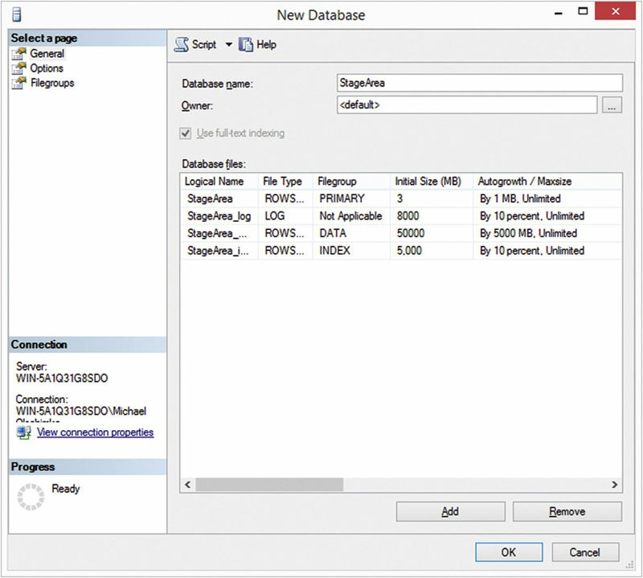

In order to ensure the scalability of the later solution, it was decided to create four filegroups. When starting small, there is no need to have four or more physical disk arrays to put these filegroups on, but these filegroups help to distribute the data to multiple disks later on. Figure 8.7 shows that Full-Text Indexing is used on the server. You should consider removing this feature from your data warehouse if it is not being used in queries. SQL Server uses system memory for creating the full-text index [49]. If it is turned on, as in this case, it has to be disabled on a per-table basis. Another option is to turn off the feature using the following SQL command:


>
>


In this example, the data was actually put onto different disks in order to increase performance from the onset. Figure 8.8 shows the filegroups and their locations in detail. 

>FIGURE 8.8 Filegroups for stage area.
>
>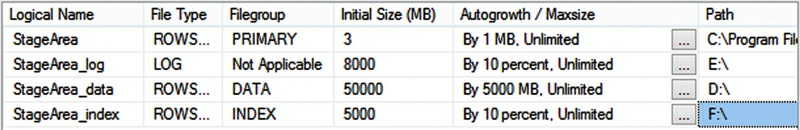


The PRIMARY filegroup will contain only system objects. It is expected to stay relatively small and is left on the direct attached storage disk (DASD) of the data warehouse. The log files are separated from the data. In addition, the indexes are also separated and put on a very fast disk, for example a solid-state drive (SSD). The initial sizes are chosen to meet the expected storage requirements of the stage area. This size depends on the size of the source data, multiplied by the maximum number of loads that should be potentially kept in the stage area. Although the stage area doesn’t keep history (see Chapter 2), it might keep multiple batches of source data. This is due to the fact that, in some cases, the stage is not loaded into the enterprise data warehouse immediately, for example because of maintenance work or other reasons for downtime.


The filegroups in Figure 8.8 might not fit larger installations, but are a good start and serve the purpose of this book. In reality, performance should increase when distributing data and logs to more physical drives [36]. Consult your database administrator for better options that meet the specific requirements of your project. Another issue is the selected auto growth values, as they might not be applicable to huge databases where 10% can become multiple gigabytes of data. Instead, it is recommended to limit the auto growth setting to 1 to 5 gigabytes per filegroup. Another important setting that drastically affects the performance of the stage area is the recovery model. The default option is Full recovery [37]. However, it is recommended practice to use Simple recovery in data warehousing because data can be reloaded manually instead of using the log files [36]. For this reason, the recovery model is changed, as Figure 8.9 shows.


>FIGURE 8.9 Setting the recovery model.
>
>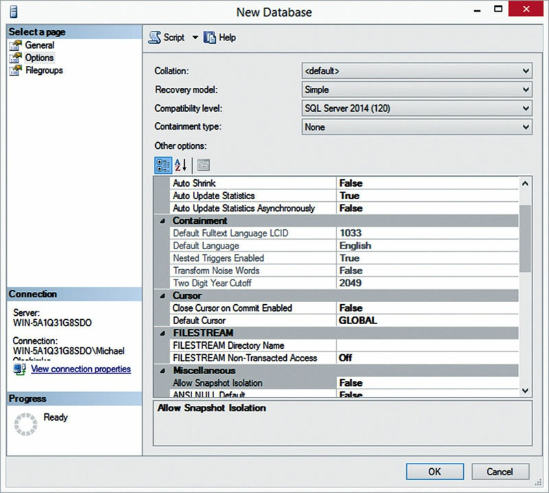


It is also recommended to select the same database collation in all databases to avoid problems with character conversion between the collations. The best option is to leave it to the default collation of the data warehouse server and make sure that it has been properly selected during installation.


When selecting the OK button, the following statement is executed on SQL Server to create the database [38]:

>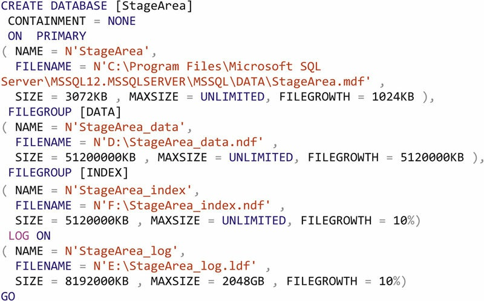

Chapter 11, Data Extraction, shows how to extract data from source systems and load it into the staging area.


### 8.6.2. Setting up the Data Vault

The purpose of the Data Vault layer is to permanently store the enterprise data with all its history. This is different from the stage area where the data was stored only temporarily. As we have outlined in Chapter 2, the goal of the Data Vault layer (the data warehouse layer) is to keep a nonvolatile copy of every change of data in multiple source systems, integrated using the business key. This layer is, unlike all other layers in the data warehouse, not easily recoverable from other data sources, if possible at all. For example, it is possible to recover the data in the stage area from the operational source systems, if the recovery is started promptly (to make sure that the data in the operational system has not yet changed very much). It is also possible to rebuild the information marts completely from the Data Vault. There is no other information required to build the information mart. The same is true for all Business Vault tables. They are completely based and sourced from Data Vault tables. That is because the Data Vault layer is the central storage of the enterprise data in the data warehouse.


For that reason, the requirements regarding fault tolerance are different for the Data Vault layer. In addition, the loading patterns (e.g., batch loading vs. real-time loading or operational-style access patterns to the Data Vault) have implications to the database setup.


The Data Vault layer also gathers and retains the metadata, metrics data and information about errors. A good practice is to separate each vault using database schemas.


The next sections describe the hardware considerations for this layer and how to set up the database.


#### 8.6.2.1. Hardware Considerations for Data Vault Layer


Because the Data Vault is the permanent storage for the enterprise data, the data needs to be secured against hardware faults. The first set of options is the RAID setup used for the physical drive. The best economical options should be either RAID-1 for disk mirroring or RAID- 5 for adding parity bits to the data written to disk. The second option is often favored because it presents a compromise between available disk space and fault tolerance. Keep in mind that the Data Vault layer stores the history of all enterprise data that is in the data warehouse. Therefore, the size of the database could become very large.


While RAID-1 and RAID-5 are not the fastest available RAID options, it is worth favoring them for the Data Vault layer, due to the added fault tolerance of the physical disk. If one disk fails, it might affect the availability of the data warehouse (because the RAID array might be rebuilt), but the data is not necessarily at risk. However, if more than one disk fails at the same time, this is not the case any longer. In such a case, for example during a large-scale disaster that affects the whole server infrastructure, the collected enterprise data is still at risk.


To cope with such a fatal scenario, it is possible to replicate the data warehouse between multiple data centers. In this case, the data centers are usually geographically distributed and connected via a network (either a Virtual Private Network (VPN) over the Internet or a private network using satellite connections, etc.). In order to make this scenario work, the network connection has to be fast enough to replicate all incoming data. This scenario might be required if multiple geographically distributed enterprise data warehouses (EDWs) should be made available around the world and a central EDW is not sufficient. Note, however, that the requirements for replicated data warehouses are high.


#### 8.6.2.2. Backing Up the Data Vault

In order to achieve the highest data reliability, database backups should be used for all layers. However, the Data Vault layer is the one that has highest priority among all layers, again, because the stage area holds only temporary data and the information marts can be rebuilt from the Data Vault. Due to the central function, being the single point in the data warehouse that holds the data including all history requires that this layer be fully backed up.


Often, the Data Vault is loaded in daily batches overnight. In this case, the backup should be scheduled just after the Data Vault has been loaded, to make sure that the backup contains the last version of data as soon as possible. Also, make sure to test the database backup, by actually restoring it at frequent intervals.


#### 8.6.2.3. Data Vault Database Setup

The Data Vault database is again created in Microsoft SQL Server Management Studio 2014. For the same reasons that we used to come up with the name of the stage database, we use the name DataVault for the database (Figure 8.10).

>FIGURE 8.10 Create new Data Vault database.
>
>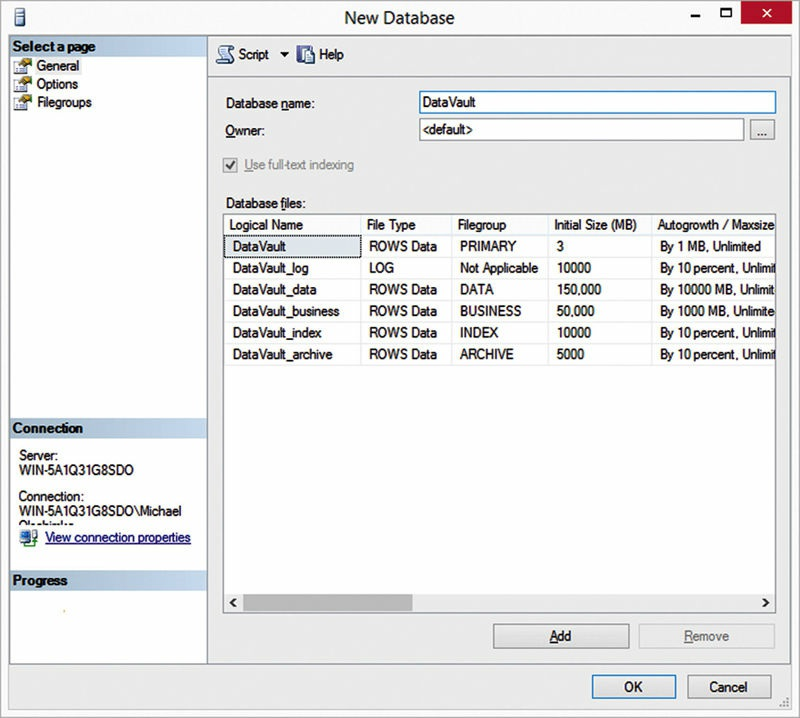

Another option for the database name would be EnterpriseDataWarehouse or any other desired name (the database names in this chapter are examples only). Figure 8.10 shows that a set of database files has been created, similar to the stage area. However, the initial sizes are larger to adjust to the fact that the Data Vault stores the history of all changes to the enterprise data. In your actual project, these sizes might be even larger. There are two additional filegroups, compared to the stage area setup from the last section. The first file is DataVault_business which will be stored within the filegroup BUSINESS. This filegroup will be used for storing Business Vault tables and might be on another physical drive with more tolerance to potential hardware faults. This is due to the fact that the Business Vault can be fully recreated from the DataVault, similar to an information mart. For that reason, another RAID level, such as RAID 0, could be used to take advantage of higher performance.


The second filegroup, DataVault_archive, can be used to keep historical Data Vault entities that are being closed and not loaded with new data anymore. This file will be stored on a compressed NTFS volume to save storage or use built-in compression from the database management backend. The underlying filegroup has been selected as read-only [39] (Figure 8.11).


>FIGURE 8.11 Creating the archive filegroup for the Data Vault layer.
>
>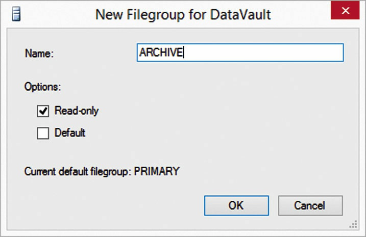


However, the NTFS volume should not be compressed yet. It needs to be turned off in order to create the filegroup. Once data has been loaded to the archive, it can be turned on. Adding tables and data to the filegroup requires that both the NTFS file compression is turned off and the filegroup is enabled for read-write access. However, it requires a lot of disk space when the file compression is turned off. The first is achieved on a system operating level, the second using the following ALTER command in SQL [40]:


>


Another optional filegroup for the Data Vault layer is an in-memory filegroup to house Data Vault entities that are loaded in real time. However, real time is not covered in this book.


The recovery model of the Data Vault database should be set to Bulk￾logged because ETL batch loading might not be used for all Data Vault entities. Real-time scenarios present the biggest challenge for a Simple recovery model, but any operational system writing back data into the Data Vault requires log backups maintained by SQL Server [37].


Therefore, a simple recovery model is not sufficient for data warehouses if data is coming in more ways than simple batches. We were able to turn it off for stage loading, because it was possible to rerun the ETL for loading the operational data from the source systems. The same is true for the Data Vault layer as long as data is loaded in batches, followed by a backup. However, as soon as real-time or operational systems write directly into the Data Vault, this is not possible anymore, at least without restarting the processes in the operational systems.


There is no need for the Full recovery model if the backup strategy, as outlined in the previous section, is used. Bulk operations from ETL are not required to log, because the database backup is started just after ETL for loading the Data Vault layer has been finished. Therefore, there should be no bulk operations after over the day. Real-time and operational systems should only write using singular statements. For that reason, the Bulk-logged recovery model is turned on during database creation (Figure 8.12).


>FIGURE 8.12 Options of the Data Vault database.
>
>

The following command is generated and executed against the database server when selecting the OK button:

>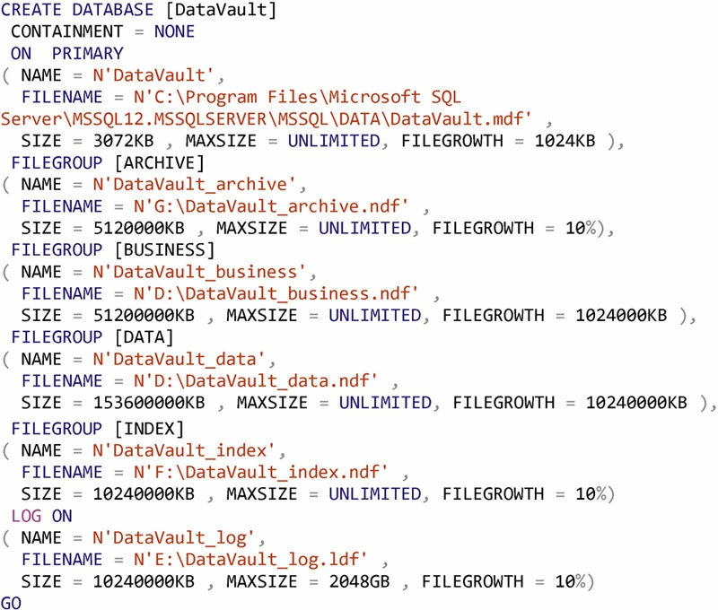


Again, consider turning off full-text search using the following command:


>


That way, there is no need to deal with full-text search on a table level. Chapter 12 shows how to load the Data Vault.


### 8.6.3. Setting up Information Marts

In the last section, a filegroup was created for the `Business Vault` because it has similar requirements to `information marts`. This section discusses these requirements in more detail to better understand the reasoning behind this decision.

Both the `Business Vault` as well as all `information marts` can be completely recreated from the data in the `Data Vault`. The **only dependency** for the `information marts` is the `Business Vault` itself, which has to be created before the `information marts` are created. That is due to the fact that the `Business Vault` provides consolidated, precomputed data, and implements `business rules` that are used by many `information marts`. But as a matter of fact, all data is housed by the `Data Vault` in its raw format. `Information marts` use this data in two ways: `virtualized`, which means that no data is actually copied to the information mart database; or `materialized`, which means tha t data is actually copied to the information mart for performance reasons. Both the `Business Vault` and `information marts` have much more tolerance to hardware faults than the `Raw Data Vault`. That doesn’t mean that we welcome hardware faults in the information marts, as it would be a lot of work to replace the disks and rebuild the databases used by the information marts. However, our statement is that it is possible to recreate them without any data loss.


But be aware that these `statements` are only valid as long as the `write￾back` feature of `SQL Server Analysis Services` isn’t used. Once this SQL feature is turned on, it needs to store the data that is written back into the cube in relational tables somewhere. If you select the `information mart` as the target for the write-back data, it should be considered as an `operational system` and meet the requirements for such systems. There are other, more viable destinations for the write-back data, but this is out of the scope of this book.


#### 8.6.3.1. Hardware Considerations for Information Marts

For that reason, it is possible to use disk setups with less fault tolerance than RAID 1 or RAID 5. The best option is RAID level 0 due to performance. As a matter of fact, the information marts have fewer requirements on fault tolerance than the stage area.


In some cases, business users directly use `information marts,` unlike the usage pattern when `SQL Server Analysis Services` is involved and loads the data from the information marts into a multidimensional database. Examples of a direct use of information marts includes relational or ad-hoc reporting, relational OLAP, or data mining. These use cases have in common that performance becomes key to ensure an acceptable user experience. Therefore, information marts should be optimized for reading. This is done using indexing, but also by using fast disk setups that house the database files. RAID 0 combines the read performance of multiple disks and represents the fastest RAID option available. Another option might be the use of SSDs for this layer.


However, if `SQL Server views` are used to implement virtual marts, no data is actually copied to the information mart. Instead, the SELECT query is performed against the raw data in the Data Vault. Therefore, `virtualized marts` will gain no performance benefit from SSDs or another RAID level beyond that used by the Data Vault layer.

#### 8.6.3.2. Information Mart Database Setup

There are some considerations that need to be made before setting up the database or the databases for the **`information marts`**. Having one database for all information marts is easy to set up and maintain, but reduces the flexibility of the usage. For example, when each information mart uses its own database, the individual information marts are isolated from each other. Each business user sees only the schemas and tables that it is supposed to see. Security is maintained much more easily. It is also possible to move a large information mart to another database server in order to distribute the workload among multiple servers. Separating information marts in such a manner becomes impossible if they are all deployed into the same database.


Therefore, **<u>our recommendation is to use individual databases for information marts.</u>** In this book, we’re going to use only one information mart, called FlightInformationMart, which is used by the flight operations department. The setup is shown in Figure 8.13.


>FIGURE 8.13 Create new database for the flight information mart.
>
>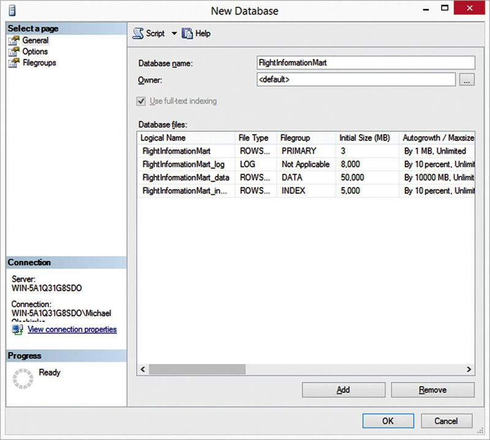

Three filegroups have been set up for this information mart, in addition to the PRIMARY filegroup which is only used for system tables. ***FlightInformationMart_log***, which stores the database log and is separated from the rest of the database; ***FlightInformationMart_data***, which stores the data pages; and ***FlightInformationMart_index***, which stores the indexes of this information mart. Figure 8.14 shows the created filegroups in more detail.


>FIGURE 8.14 Filegroups for the flight information mart.
>
>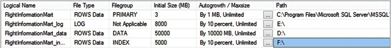

The initial sizes accommodate the expected volume for initial load and subsequent loads over the next couple of months. Again, these sizes have been set relatively arbitrarily for this book and have to be adjusted for the expected volume in the actual project.


The figure also shows that all database files are distributed to various drives which represent the individual RAID arrays, as described in the opening of section 8.6.


Similar to the previous databases, the **`recovery model`** has been adjusted to the expected load behavior of the database (Figure 8.15).


>FIGURE 8.15 Options of the information mart database.
>
>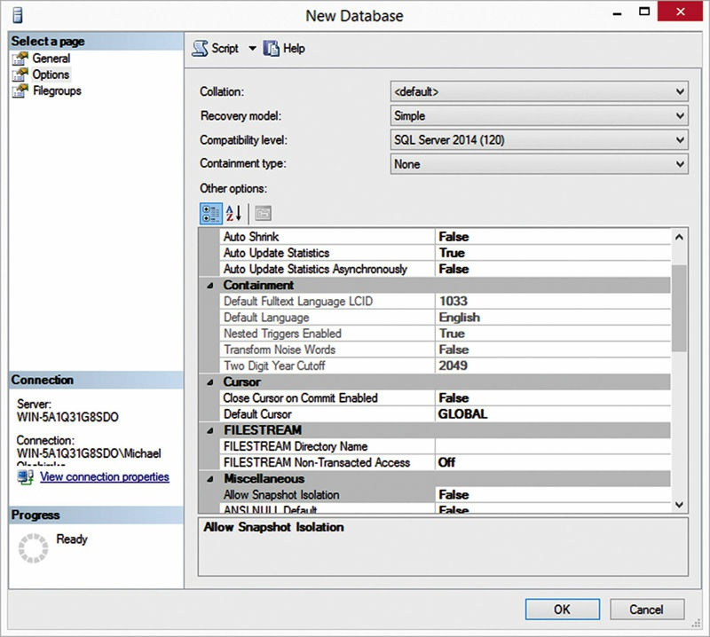

We have already discussed that there are <u>two methods to populate the data into the information mart:</u> either **virtually**, which means no data is loaded into the information mart at all, or using **batched ETL** processes that load the data in batches. Both methods can be restarted at any time, because all underlying data is stored in and protected by the Data Vault layer. Therefore, we go with the fastest recovery model possible, which is the **`simple option`**. It provides no safety if data is added or updated in the information mart, but that is not the goal of the information mart. It should be used by the business user for read-only access.


Again, if you plan to use the write-back capabilities of SQL Server Analysis Services, you need to adjust this setting to either bulk-logged or full recovery model.


Once the OK button is selected, the following SQL statement creates the database on the server backend:

>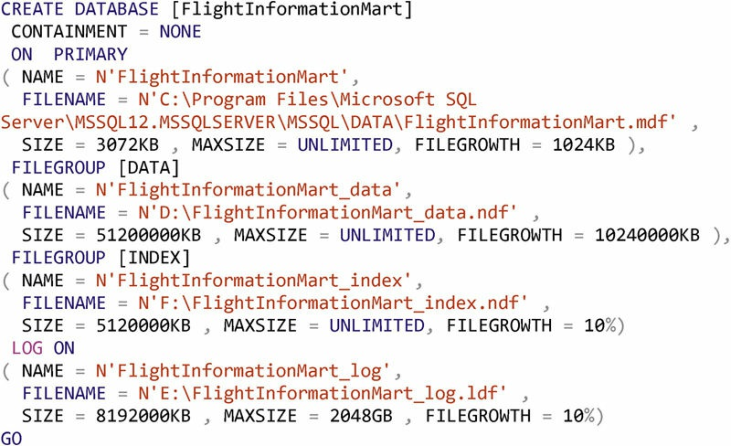


Remember to turn off full-text search if you don’t need it in your information marts by following a similar approach to the one already described in previous sections.


### 8.6.4. Setting up the Meta, Metrics, and Error Marts


The Meta Mart, Metrics Mart, and Error Mart are special instances of information marts which are primarily used by IT to analyze internals of the data warehouse. While the business uses these marts less frequently, they are also accessible in order to have transparent information about the success of the data warehouse initiative.


The **purpose** of the `optional Meta Mart` is to disseminate information about metadata, which is stored in the raw Data Vault. The dissemination follows similar concepts as in the information marts, which means that the Meta Mart is structured in such a way that front-end tools can query the information as effectively as possible. If the Meta Mart is queried using OLAP tools, a dimensional model is the best approach to model this mart.


The following information is presented to the end-user (typically administrators, power users, or team members from the data warehouse initiative) [4]:
1.  Metadata about data and information, from all layers
2.  Metadata about processes, primarily, but not limited to, the loading processes in ETL
3.  Metadata about performed backups
4.  Metadata about source systems and interfaces to other systems (e.g., information consumers)
5.  Definition of hard and soft business rules
6.  Definition of access control lists (ACLs) and other security measures
7.  Definition of retention times for privacy related data


This list is not complete. The Meta Mart makes all information accessible that is not directly used by the business user, but describes what kind of data and information is available, where it comes from, how it is processed, who is using it for what purpose, etc. In more sophisticated environments, the Meta Mart might be replaced by a Meta Data Warehouse solution.


The Metrics Mart presents the information captured by the Metrics Vault to the end-user. This was discussed in more detail in Chapter 2 and includes information about run history, process metrics, and technical metrics.


Finally, the Error Mart stores and presents statistics and detailed information about errors in the loading processes and other functions of the data warehouse.


#### 8.6.4.1. Hardware Considerations for Meta, Metrics, and Error Marts

While the Metrics Mart is sourced from the Metrics Vault, the other two marts are a single point of data. Therefore, there are different reliability requirements for each database that holds the marts:

1.  Metrics Mart: this mart derives its reliability requirements from the Information Mart discussion in section 8.6.3.1. Because it can be rebuilt and reloaded very easily, it can be stored on less reliable RAID configurations, such as RAID-0.
2.  Meta Mart: This optional mart contains all metadata of the data warehouse. Because it is the central place of storage, it has higher reliability requirements than other information marts. Instead, the requirements are comparable to the raw Data Vault layer, where a RAID-5 or RAID-1 level is typically used.
3.  Error Mart: This optional mart is comparable to the Meta Mart, regarding the reliability requirements. It is the central location of all error information in the data warehouse. Therefore, it should be kept on RAID-5 or RAID-1.


It is also important to include the Meta Mart and the Error Mart in the backups, as it is not possible to recreate them from the Data Vault or any other layer. The backup for the Metrics Mart is optional, because it can be recreated from the Metrics Vault.


#### 8.6.4.2. Meta, Metrics, and Error Marts Database Setup

Due to space limitations, this book will not cover the creation of these technical marts. However, there are two options for them. First, create information mart to hold all three marts in separate schemas. The other option is to follow the same approach as with all other information marts, that is to create individual databases in the data warehouse in order to separate them physically. That way, it is possible to distribute the marts to separate hardware (either on the same server or among multiple servers) much easier. If you put all marts into the same database, you should make sure to meet the highest reliability requirements of all included marts.

