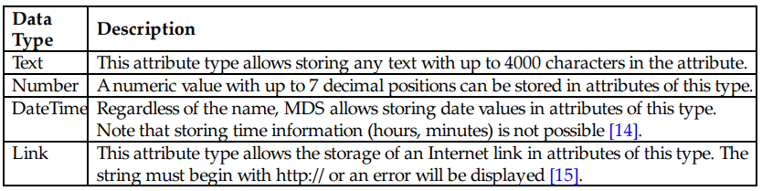
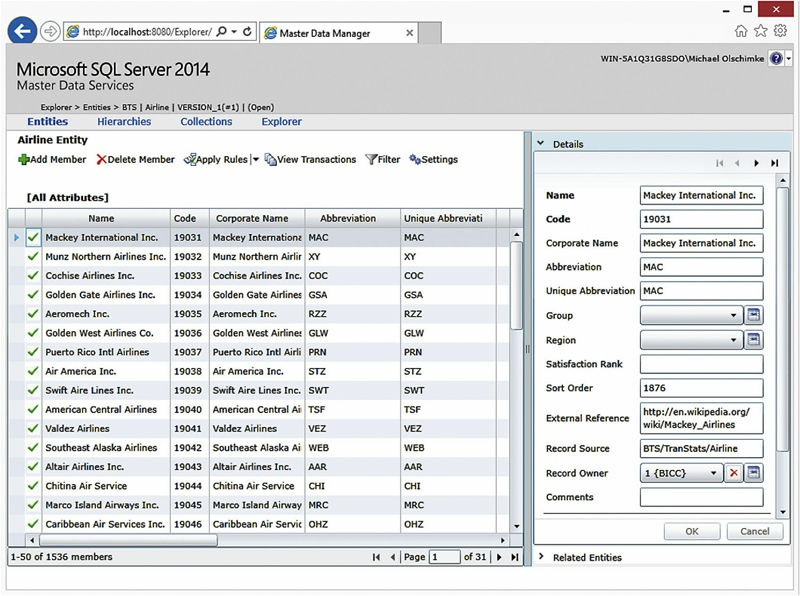
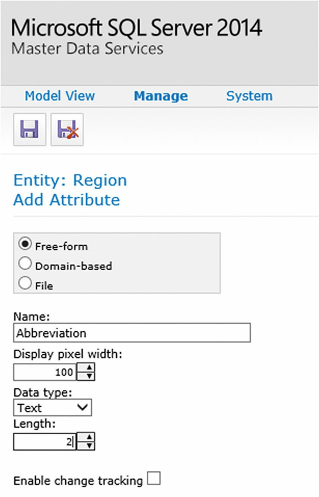

# Master Data Management(374-449)

[TOC]

## Abstract

**`Master data management` and MDS**

An important aspect of data warehousing projects is the definition of `master data`. This chapter introduces basic architectures for `master data management` and shows how to deal with master data using Microsoft Master Data Services (MDS), a product included in Microsoft SQL Server. The chapter provides an overview of the goals in `master data management` in the `context` of data warehousing, its drivers and compares operational and analytical master data. It also explains how to use MDM as an enabler for managed self-service business intelligence and total quality management. The `authors` demonstrate the definition of entities with their accompanying attributes within MDS models, the definition of `business rules` to ensure data quality. and how to **stage** `master data` from `operational systems` and then **load** the data into the `data warehouse`.


### Keywords
```
Data management
master data
data warehouse
Microsoft Master Data Services
Microsoft SQL Server
business intelligence
```

**How `MDM` made up and used**

`Master Data Management (MDM)` enables organizations to create and use a **`“single version of the truth”`** [1]. This is especially helpful when using `conformed dimensions`, as discussed in Chapter 7, Dimensional Modeling, which require a defined set of attribute values. In some organizations, the source for such `conformed dimensions` comes from a `leading source system`, but in many other cases, the data comes from `multiple systems`. It is not only required to combine the data from those multiple systems. Often, the data contradicts and overlaps. Therefore, the data has to be conformed in some way [2].

**Conformity(一致性) is not required by dimensional models but IMPORTANT to MDM**

Conformity is not required by dimensional models. They represent only one modeling method that allows data to be aligned and produced as information for business. In some cases, the master data is delivered in a cube, while in other cases it may be delivered in flat and wide denormalized table structures (otherwise known as first normal form).**The notion of conformity is truly what Master Data cares about.**


**3 How about MDM in this vhapter**

**This chapter discusses how to use master data and MDM** as an enabler for business users to take control of data warehousing, getting them closer to true managed self-service BI (a concept discussed in Chapter 2). It also shows **how to set up a database in Microsoft Master Data Services (MDS),** an MDM solution included in Microsoft SQL Server 2014. Finally, it will show **how to integrate master data from MDS with the Data Vault**. Because MDS as a feature is often not very well known to users of Microsoft SQL Server, we have dedicated a lot of space to MDS in this book.

## 9.1. Definitions

The next sections provide introductory `definitions` of the core components of `MDM` to better distinguish between the `terms` used throughout this chapter and the rest of the book.
### 9.1.1. Master Data

 **`Master data`,describes the `business entities`, is  business’s answer to `chaos of reference data`** 

The definition of `master data` is the business’s answer to the `chaos of reference data` in source systems. `Master data` describes the `business entities`, which are part of the business processes implemented in operational systems of the organization. While `master data`, at first glance, look very **similar** to `data warehouse dimensions`, they should be much closer to operational systems. However, `master data` become a `source` for `data warehouse dimensions` and can **provide** a great `source` of such data if the master data have been implemented well [2].

`Master data` is commonly **distinguished** by `operational master data` and `analytical master data`.

### 9.1.2. Data Management

**Purpose and define of `Data Management`**

`Data management` includes the development and execution of architectures, practices, procedures and policies which are required to **effectively manage** an `enterprise information life cycle` [3]. Its purpose is to **plan, control and deliver** the `data and information assets` required by the organization. Data management is a `shared responsibility` between both IT and business: data management professionals within the IT organization and business data stewards within the business organization have a shared interest to produce data and consume information [4].

**What `Data management` involves**

`Data management` involves people, processes, and technology. Included in data management are `ideas` around governance, process control and management, data quality, total quality management, and the human act of identifying and blessing the appropriate records as the corporate standard. `Master data` mixed with good data management principles really are about `gap analysis`: understanding the gaps between the perception of how the business is run, what the raw data / source system processes are collecting, and how well that data set meets the conformed or consolidated view at the enterprise level.


### 9.1.3. Master Data Management

`Master data` plays an important role in business organizations, and so does `data management`. Both components represent a separate and independent set of definitions, processes and activities. When put together, they merge into master data management.


Figure 9.1 shows that `master data` plays a vital role in master data management, so does `data management`. However, in order to achieve true `master data management`, `people` and `processes` are also required; they bind both components together and enable `TQM` and `gap analysis` activities.


>FIGURE 9.1 Master data management.
>
>

`MDM` is the creation of a single, well-defined **version of all the data entities** in the enterprise, the so-called “**`golden records`**” – in other words, a single copy of a record representing a single business concept like customer, or product, or order, or sale and so on.


## 9.2. Master Data Management Goals
The final step in true `MDM` is the ability to **reconcile** the source systems and **close** the `data gap`, or the `process gap`, by applying the principles of Six Sigma and Total Quality Management (TQM). This means that once the golden copy of the data has been selected and identified, it needs to be **fed back** to all the source systems – **overwriting** any of the data which is out of balance. This notion in TQM is called `data harmonization`. The harmonization of disparate data especially improves the data interoperability but has several other advantages [5]:
1.  **Improve the quality of the data**: when `source systems` should be integrated that implement different sets of master data, mapping or other business rules are required to enable the integration of these systems. As a general guideline, adding new mapping or business rules requires testing them, because they add new functionality to the system. They also affect the data that is generated as a result from these rules.
1.  **Facilitate receiving, processing and checking of information**: process gaps often prevent the information exchange between business processes. If source systems use the same set of master data, they understand each other and integration of business processes becomes much easier.
1.  **Facilitate exchange of data**: the integration of source systems that use the same set of master data can easily be automated as no human input to resolve master data conflicts or manual deduplication is required.
1.  **Reduce information requirements**: in order to produce useful information from the source data, fewer business rules are required to eliminate redundancies or duplications.


`Data harmonization` is only the first step. The next step is to **figure out** what processes are currently **producing** “mismatched” or unbalanced `data sets`. The focus, then, is in correcting (Six Sigma error reduction) the improperly applied `source system process` in order to stop the flow of bad data at the start of the stream. When MDM is done right, the end￾result is an `enterprise information system` holding the “single version of the truth” or the “golden copy.”


The `Data Vault 2.0 methodology` decrees that `MDM` become a part of the standard operating procedures for the `enterprise business intelligence teams`. Good governance, and data control, along with `total quality management procedures` are baked into the application of Software Engineering Institute/Capability Maturity Model Integration (SEI/CMMI) principles. These principles are applied at the implementation level to achieve the highest level of MDM that a business is willing or capable of providing.


It is difficult to **determine** the `correct set of attributes` from the data in such an environment on the fly. For that reason, the `business` has to make a decision about the values in the `conformed dimension`. This problem is not limited to `conformed dimensions`, though. It applies to most dimension entries, regardless whether they are conformed or not.

`MDM` helps in this regard to **create and maintain** reference data that can be used in many ways in a data warehouse: to **define** `dimension entries`, as already stated; to **conform** data, for example customer records from multiple systems; or to **set up** parameters for the calculation of business rules. The data is very similar to the reference data discussed in Chapter 6, Advanced Data Vault 2.0 Modeling. However, it is not only external data that should be managed in MDM. Both internal and external business entities should be centrally managed within an MDM initiative. Such business entities participate in business transactions and include [2]:

1.  **People**, such as customers, passengers and employees
1.  **Locations**, such as airports, countries, states and cities
1.  **Physical entities**, such as airplanes, seats, products, and other assets
1.  **Logical entities**, such as brands, organizational units, functional departments, and project roles.


You will recognize that this list does not include any `transactional data`, such as flights, sales, or maintenance actions. `Master data` is the data that **provides context information** to transactions, usually implemented in **business processes** [6].


## 9.3. Drivers for Managing Master Data

Organizations who carefully manage `master data` **benefit** from it in several ways [6]:
1. **Consistent master data**: MDM provides a consistent set of business entities and their attributes, even if they are used across different operational systems. The decision how to handle contradicting attribute values or otherwise conflicting data has been made by the business as part of the master data management process. Another typical problem exists if the same semantic attribute value is expressed differently across systems, for example a Boolean attribute indicating the gender of a passenger: the ticketing system could use the values “Male” and “Female” while the flight system uses “M” and “F” , respectively.
1. **Complete master data**: Some operational systems allow NULL or blank values for specific attributes that are missing in the particular operational system. Other systems could calculate a default value instead. The decision as to which value should be used by other systems that use the master data is again part of the master data management process.
1. **Correct format of master data**: Many systems, especially mainframe systems, allow only uppercase attribute values. In many other cases, the data should use a proper case, such as title case, for example when using the first name in the salutation of a letter addressing the customer. Algorithms might help to change from upper case to proper casing; however, many nonwestern names are more complicated to handle. That is why business frequently wants to override the results from algorithms.
1. **Master data attributes within range**: MDM allows the business to ensure the correctness of numerical attribute values. It can be assumed from downstream systems (applications that use the master data from MDM) that the master data has been verified and processed by data quality routines. An example for this is the horsepower of airplane engines. Usually this value is, except for some powerful engines, below 10,000 HP. Even the powerful engines don’t have more than 20,000 HP. If there were an engine with more than 200,000 HP, something is wrong with the data, such as a typo. It is the job of MDM to identify such problems and correct them in the master data and operational sources (if available).
1. **Complex data handling**: In some cases, attribute values are, when analyzed independently, within the correct range. However, if analyzed in conjunction with other attributes, the value might be completely off. An example is the fact that turbo-jets produce thrust and are not measured in horsepower [7]. An MDM application supports such complex business rules to validate complex data.
1. **Deduplicated master data**: Oftentimes, personal data contains many duplicates when the data is directly sourced from operational systems. The MDM application provides a set of deduplicated master data that can be used by subscribing applications without taking care of potential duplicates.


The required `data cleansing` should be performed before the data is loaded into the `MDM application`. There are tools that support the MDM team with this task, including Microsoft Excel. The MDM application usually validates the incoming data and logs all violations against the business rules.


In addition to these benefits, there are `multiple drivers` that are the reasons for a fast-growing adoption of MDM within organizations [8]:


1. **Regulatory compliance**: today, companies are required to provide, use, and report relevant data about their financial performance in an accurate and verifiable form. This also includes information about significant events that could impact company valuations and shareholder value. The reason for this legislation and regulations, such as the Sarbanes-Oxley Act and Basel II and Basel III, is due to corporate scandals, such as Enron, and several class-action shareholder lawsuits.
1. **Privacy and data protection**: federal and state law also forces organizations to protect enterprise data from unauthorized access, use, and editing. This is especially important when dealing with customer data, such as health care records, social security information and credit card data.
1. **Safety and security**: the USA Patriot Act and other regulations regarding anti-money laundering to prevent the support and financing of terrorist attacks requires organization to manage their data on customers and financial transactions and maintain the integrity, security, accuracy, and timeliness of corporate operational and customer data.
1. **Growing complexity and increased velocity**: MDM helps to improve customer service and customer experience management by providing a “single version of the truth.”


These benefits have helped MDM to become a fast-growing discipline in organizations, regardless of data warehousing. And, in fact, most initiatives are focused on these benefits, ignoring additional ones in the analytical domain.


In cases where `MDM` is not available, the `data warehouse` can become another driver and the source for master data: `data warehouse teams` often start developing a new data warehouse without master data available. Over time, the `master data management` initiative matures from the data warehouse project. Figure 9.2 shows this evolution.


>FIGURE 9.2 Master data matures during the data warehouse project.
>
>

**The first maturity level** is characterized by no `MDM system` in place. Instead, `master data` is sourced from `operational systems` or developed and managed as **part of the** `data warehouse.` The master data is only used by the subscribing information marts of the `data warehouse`; no external applications are using it. Because the `enterprise data warehouse` is the single version of the facts in the organization, it serves as a central location of facts that are used more and more in other applications, especially when approaches such as managed self-service BI are used. In this approach, many applications consume raw data and preprocessed information from the data warehouse. These applications also need to use a conformed set of master data. In such cases, because there is no `organization-wide MDM` available, the data warehouse becomes the source for `master data` as well.

**The second maturity level** shows this situation by publishing the `master data` from the `data warehouse` in an **individual** `information mart`, for example an `information mart` modeled in `third normal form`, to provide a `standardized access` to the `master data` in the data warehouse to other operational systems.

**The third maturity level** is characterized by the ability to **modify** the `master data` by the business. The `information mart` is no longer just a read-only view to the `master data` in the `data warehouse`, but becomes an `MDM database`; business users can directly or indirectly (by using operational systems) **modify** the `master data` and **feed it back** into `master data` subscribers, such as other operational systems or the data warehouse. The `information mart` from maturity level 2 can be used as a starting point to build this `MDM database`. Once business users can **modify** the master data, the database becomes another `source system` to the `data warehouse`.


## 9.4. Operational vs. Analytical Master Data Management

`Master data` can be used in two **types** of `organizational systems`. First, the data is used by `operational systems` as common `reference data` within the application. Then, the application uses the reference data from MDM as business objects within its business processes that are implemented in the operational system. It **enriches** the data by new information that has been collected during execution of these processes. It also uses `business keys` from `MDM` to manage its references to the business data when **it stores the transactions within its own database**.


However, this means that `businesses` must **decide** *which* departments or functional units are allowed to **change** the `master data` in `MDM` in order to avoid unwanted or unauthorized changes to the reference data used throughout the business [9]. The usage of `master data` in operational systems is shown in Figure 9.3.


>FIGURE 9.3 Use of master data by operational systems [9].
>
>


The figure shows master data from an airport that is used by multiple operational systems. Each operational system uses a partial set of master data in the local scope of the application. Such an `operational system` is called a `master data subscriber`, because it subscribes to the master data, and the changes to its entities. Because operational systems share the master data from its central location, the data within the operational systems becomes integrated, often through a `business key` that was defined in the `MDM application`. In some cases, the operational system might **update** `master data` with new information. **These changes** occur within the business processes implemented in the operational system. No system, however, will write transactional information to the MDM application. Instead, the transactional data remains in the operational system only. In order to load it into the `data warehouse,` it has to be collected independently by `ETL routines` as part of the data warehouse loading process. We discuss this in more detail in Chapter 11, Data Extraction.

The `data warehouse system` is another `subscriber` of `master data`. Often, operational systems don’t use all master data, or modify it locally. Therefore, the `data warehouse` is interested in the centrally stored version of `master data` and the master data that is used and enriched in local applications. For that reason, it loads master data from both locations: the `central MDM application` and all operational source systems. The `master data` is often used to source dimensional entries, while the `transactional data` is used to source `fact tables`. However, there is some `master data` that is only created and maintained for the `data warehouse` itself. This case is called `analytical master data` and includes
some of the following master data types:

1.  **Business rule parameters**: Many `business rules` that are implemented in the data warehouse to **transform** raw data into useful information are **based** on `parameters`. For example, tax rates change over time and need to be adjusted frequently. Also, a flight delay is currently defined as a flight which arrives (or departs) the gate at least 15 minutes or more after the scheduled time [10]. Because this definition might change in the future, it is not a good practice to encode such parameter values in the ETL jobs or virtual views directly. Instead, the use of MDM allows business users to modify these definitions on their own, without IT involvement.
1.  **Defining groups and bins**: In some cases, it is sufficient to identify if a flight is delayed or not (again, if the flight is 15 minutes late). In other cases, a more detailed analysis is required. For that reason, the Bureau of Transportation Statistics (BTS) has defined departure and arrival delay groups that measure the delay in intervals of 15 minutes. Table 9.1 shows their defined delay groups definition. In order to map the actual delay of a flight to this definition, the table needs to be stored in MDM and enriched with numerical limits (minimum and maximum number of minutes) that can be used in ETL to map the value to the definition. For example, if a flight is 65 minutes late, it would be between the 60 and 74 minutes limitation of group number 4 and therefore mapped to this delay group.
1.  **Codes and descriptions**: Often, source systems use codes that are easily understood by business users. Examples for such cases are IATA airport codes. However, the sheer number of those three-letter codes available makes it complicated or error-prone to handle reports using these codes. Therefore, such codes are often enriched with readable captions and other important attributes, such as a sort order.
1.  **Hierarchy definitions**: MDM can be used to define `organization hierarchies`, product definitions (bill of materials) and other frequently used hierarchies. Having them in the MDM application allows business uses to modify these definitions without IT involvement.
1.  **Date and other calendar information**: Date and other calendar information is another example of a hierarchy that can be defined using MDM. Using MDM allows the end user to modify the names and definitions of signing holidays or business seasons if needed. It is also possible to modify the beginning and ending dates of the `financial calendar` when required by organizational changes, e.g. a takeover.
1.  **Technical parameters**: The `data warehouse` is installed on top of one or multiple servers, as discussed in Chapter 8, Physical Database Design. Some parts of this environment can be controlled by the business user and technical users, such as systems administrators, by using MDM. For example, it is possible to define external scripts that need to be called during loads, set the name of the environment (“Development, ” “Test, ” “Production”) that is displayed on technical reports and dashboards, source system names such as FTP address or database names, and date and time formats or time zones to be used. It is also possible to configure users who should be informed if problems during loads occur, such as the business owner or data steward. 


>Table 9.1 BTS Delay Groups
>
>

Because this information is used only for the `data warehouse`, it is **not fed back** into operational systems. However, in some cases, it might actually become used by operational systems, transforming the `analytical master data` into `operational master data`.


In addition to these analytical use cases, it is also common practice to enrich operational data with additional attributes that are only required by analytical systems. This could be a classification number or tag that is attached to passengers. Instead of adding the new field, which is only used within the analytical system, to the operational system, which would require substantial time and effort, it is added to a new entity in the MDM application. If new passengers are added to the operational system, they are added to the MDM database using a staging process, similar to those used in data warehousing. Business users can classify those new passengers or other business entities and the added data is used in the data warehouse downstream.


## 9.5. Master Data Management as an Enabler for Managed Self-Service BI


The availability of `master data` and proper `master data management` play an important role in the `Data Vault 2.0` standard. We have already discussed in the previous section that `analytical master data management` can be used to store parameters for business rules. These parameters influence how `business rules` are executed when the `ETL process` or `virtual SQL view process` the raw data from the `Raw Data Vault` and load it into the `information mart`. This architecture has been described in Chapter 2. Chapters 13 and 14 will show how to implement such business rules.


Because the parameters are stored in the `MDM application`, authorized business users are able to change the parameter values and therefore influence the results of the business rules. An example for such parameters might be expected earnings ratios or which depreciation rules should be used when calculating the depreciation of organizational assets. In the latter case, the business user would select straight-line depreciation, declining balance method, annuity depreciation or another rule for specific assets of the business. Besides the ability to influence the outcomes of the business rules, there are more advantages of having these parameters in an MDM application:
1.  **Transparency**: MDM tracks which settings have been used by the business, at which times, who modified them at what time and who did the authorization of taking the change into production. Compare this to a relational table in the data warehouse, without any change tracking or versioning.
1.  **Compliance**: Regulation bodies require documentation as to how the raw data was transformed into the information that was presented to the business users, in many cases, in upper management. Change tracking of MDM applications ensures compliance to such regulations.
1.  **Security**: Not everyone in the organization is allowed to modify the business rule definition. MDM applications typically have built-in security controls that safeguard the master data.
1.  **Reusability**: Having the business rule parameters in the MDM application means that the business rule definition becomes more reusable: consider the reusing of the same business rule implementation for different information marts. Each information mart requires a slightly different execution of the business rule. Because MDM holds the parameter values of the business rule, it is possible to provide different sets of parameter values for each information mart.


Because the business user can, if authorized, fully control the parameter values, the business can implement changes on its own, in a self-service BI sense. However, it is not possible to completely change the business rules, because only parameters are available for modification. Therefore, it also follows the managed self-service BI approach as described in Chapter 2: IT has to set up the business rule parameters and implement the business rules either in ETL or in virtual SQL views in a managed approach. The business, on the other hand, can adjust these parameter values in the boundaries of these parameters, in a self-service approach.


The other aspect of managed self-service BI regarding master data management is by implementing a closed loop between the operational systems and the operational master data. If business users are able to modify the master data that is used by both the operational systems and the data warehouse, the data is first used by the operational system and influences the execution of implemented business processes, which, in turn, has influence on the transactional data that is stored in these systems. Second, it also influences the data warehouse, as both the master data from the MDM application and the transactional data from the operational system is sourced by the data warehouse. Therefore, the business users’ modification affects both systems, and influences the results from the analytical application as well. Therefore, this loopback between operational systems, the MDM application, and the data warehouse is an integral part of any successful managed self-service BI approach.

In both described scenarios, master data management becomes an enabling technology for successful managed self-service BI solutions. If reference data is stored in internal database tables only, business users are often not able to modify it without IT support. To allow true managed self-service BI, business users have to take over control of such data, be able to modify it, write it back into the MDM database and apply it to the data warehouse itself, influencing the end results of the business rules that are presented to the end-user as usable information in reports, OLAP cubes and dashboards.


## 9.6. Master Data Management as an Enabler for Total Quality Management

When users find errors in reports, they often approach the data warehouse team to fix the error in the output. However, not all errors originate from the loading processes or the business rules implemented in the data warehouse. In many cases, the error is already in the source data, due to wrong data stored in the operational systems.


In order to react to user requests to fix erroneous information in the report, the data warehouse team has two choices:
1. Modify the loading processes and overwrite erroneous data by corrected values: this option is actually not modifying the raw data, but implements a business rule that modifies the wrong data in a way that produces the desired outcome in the report.
2. Modify the raw data in the operational systems directly: this option modifies the source system data or fixes any errors in the source code of the source system.


Often, the data warehouse team has no control over the operational systems. Therefore, the first option is performed in many cases. However, the goal of total quality management is to fix the error at the source and prevent the use of wrong data in subscribing applications. This is why it should be fixed in the source system.


However, this approach requires that a gap analysis be performed as outlined in the introduction to this chapter. It is important for the enterprise to understand the differences between the perception of the business and the realities in source systems: the business expects certain master data (among other data) to exist in the source system and with the desired quality. On the other hand, IT has a different view on the source systems and sees the data actually available and in the actual quality. Often, there is a gap between the business perception and the IT reality. In order to close the gap, an analysis is required first to assess the differences between both sides (the gap).


Gap analysis frequently focuses on documentation only: product documentation and documented processes are used to identify and perform the gap analysis. In some cases, interviews are conducted in order to understand how people within the organization use the processes. However, traditional IT organizations often have their focus on documentation instead of people during gap analysis. In agile organizations, the focus of gap analysis should be on the latter: structured interviews should be conducted with individuals from the organization to identify gaps in the business processes [11]. Both approaches provide advantages and disadvantages (Table 9.2).

>Table 9.2 Gap Analysis Approaches
>
>


Having a focus on documentation or on agile interviewing doesn’t exclude the other approach from the gap analysis. In practice, both approaches should be followed, but, depending on the target organization, not a lot of documentation is available. In that case, agile interviews help to provide input to the assessment. However, even if documentation is available, it doesn’t mean that the documentation is up-to-date or correct. The goal of the gap analysis is to find the gaps between the business perception and IT realities. Therefore, both methods should be applied where possible, even if the focus is on one of the approaches.


The findings of the gap analysis are documented in an assessment report. The report identifies the opportunities for improvement, the team’s recommendations, and associated benefits. Before the report is delivered to final consumers, it should be validated with the help of key stakeholders and subject matter experts from the business to ensure
accuracy as well as promote stakeholder buy-in [12].


The assessment report with its findings and recommendations is used to direct effort to close the gaps between business perception and IT realities. By doing so, the organization is able to realize the associated benefit for each finding and create real business value.


A master data management system, such as MDS, gives business users control over the master data used in operational and analytical systems. However, in order to fully achieve this goal, the master data needs to be integrated into the operational systems, in addition to the analytical use case. This way, business users can correct any errors in the master data on their own instead of relying on IT when improving the data quality in the end-reports. In other words: gaps are closed without IT involvement.


Microsoft Master Data Services (MDS) is an MDM application that is included with Microsoft SQL Server and allows the features discussed in the previous sections. While it is a separate product, it is fully integrated with recent versions of Microsoft SQL Server and Microsoft Excel. The software provides the following MDM features to developers, administrators, and end-users [8]:
1.  Model management: MDS allows administrators to create data models that hold MDM entities.
2.  Entity management: End-users can add, update, and delete members of entities that have been defined within the MDM application.
3.  Hierarchy management: MDS supports the creation of hierarchies between entity members.
4.  Version management: It is possible to copy a complete set of entity data and associated metadata to create different versions, for different applications and use cases, of the same data.
5.  Business rules and workflow: Business rules enforce data quality and help to trigger events within a workflow engine.
6.  Security: MDS prevents unauthorized access to users who have no permission to the master data. This can be done on a model basis, or on an entity basis.


The next section covers the object model of MDS and explains each of the concepts used in the data structure and how the data used in this book is organized.


### 9.6.1. MDS Object Model

`MDS` organizes its `master data` within `models` and around `entities`, `members` and `attributes`. The following sections describe the `MDS object model` in detail and document the `master data` that was collected and assembled for the purpose of this book. The `models` can be found on the `companion Web site` for this book.


#### 9.6.1.1. Models
`MDS` organizes `master data` within a `Model` that represents `a subject area of master data`. **It is comparable to a `database` on `Microsoft SQL Server`** by closely collecting the `master data` that belongs to the `subject area` of the `model` and keeping it together. The companion Web site of this book provides three MDS models, which are described in more detail in this section.


The `FAA model` provides `master data` for `aircraft registration`, including detailed `reference data` to describe the `aircraft`, the `registrant`, and the `dealer` where the aircraft was bought. Table 9.3 provides a detailed list of the `master data` included in this model.


>Table 9.3 `Master Data Entities` in the `FAA Model`
>
>
>
>
>
>

There are no `entities` that can be used to describe `flights`, such as airlines or airports. Such `master data` is provided by the `BTS model` and includes the entities shown in Table 9.4.


> Table 9.4 `Master Data Entities` in the `BTS Model`
>
> 
>
> 


You might have noticed that one set of `master data`, called `Record Owner`, is used in both models. This `entity` is referenced by `most entities` and indicates the `organizational department or function` that owns the `master data record`. By using such references, the `master data` within these `models` is stored in a `normalized form`. That means the `master data items` within a `subject area` are integrated with each other, as long as the data remains in the same `model`. It would be great if the `master data` were more tightly integrated: if `master data` in one model could reference `master data` in another model. However, `MDS` doesn’t support the `integration of models`. And, in reality, not all `master data models` will be fully integrated. Instead, the `subject areas` are independently developed and maintained. This is not a `problem` for `operational or analytical systems`, because not all `master data` needs to be completely integrated. Many `operational applications` only use the `master data` from one `subject area`. If they need `master data` from other `subject areas`, they integrate the data items with each other in the same way as the `data warehouse` handles it: via `business keys` that are included in the `master data` just as in any other `operational database`.


Because of the impossibility to integrate `master data` from one model with another, it is not possible to reuse a set of `master data` from one model in another. Therefore, it is required to copy the `Record Owner master data` to each `model`.


The last `MDS model`, the `DWH model`, provides `master data` that has been primarily created for the `data warehouse`, including `reference data` for calendar date, fiscal date, and other general information that is required by the `data warehouse`. `Table 9.5` shows the `master data` included in this `model`.


>Table 9.5 `Master Data Entities` in the `DWH Model`
>
>


In this case, not only the `Record Owner` entity, but also the `Yes No` entity was copied in order to be used within the `MDS model`. Figure 9.4 shows a partial `entity relationship model` of the `Airport entity` in `MDS`.


>FIGURE 9.4 Partial `E/R` diagram of the `BTS model` (physical design).
>
>


The **`Airport`** entity right of the center references **seven** other `MDS entities`, of which only five are displayed due to space constraints. Just like in any other `database model` in third normal form, the `MDS entities` referenced by entity **`Airport`** reference other entities. For example, the **`Country`** entity references entity **`Region`** in its definition. Note that some information has been denormalized into the **`Airport`** entity: it would not be required to reference the **`State`** and **`Country`** entities from the **`Airport`** entity, as it is possible to indirectly retrieve this information from other entities **(“each city is located within a state and each state is located within a country”)**. However, the `business` **decided to model** it this way in order to provide an `easier interface`. What is not displayed here is the use of business rules to copy the redundant state and country information when the city is selected by the user. Section 9.7.2 discusses how to create `business rules` in MDS.


We have used the `term entity` throughout this section, assuming that there is a general understanding among the readers of this book regarding this term. The next section provides an `MDS-related definition` and shows some of the `entities` in more detail.


#### 9.6.1.2. Entities
The previous section introduced `models` as a `collection of master data`. The `master data` is stored in `entities` within the `model`. These `entities` are very similar to `entities` in a relational database. They store the `master data` in a **`tabular form`**. `Entities` can **reference** other `entities`, thus following a `normalized data model`.

The `tables` in the previous section have listed the `master data` of the three models prepared for the book. In fact, the `tables` list the `entities` of the `MDS models`.
#### 9.6.1.3. Members
`Master data records` within an `entity` are called **`members`** in `MDS`, which distinguishes between two **types** of members, **`leaf members`** and **`consolidated members`** [13]:

1.  **Leaf members**: in most cases, `leaf members` represent the `business objects` or other physical and logical `objects` within the business. They are the most granular `items` within an `MDS entity`. In terms of relational databases, the term `record` is often used [13]. Examples for such members include specific passengers, such as passenger Daniel Linstedt or the aircraft with registration number N-58739. Section 9.7.1 discusses how to create entities with leaf members.
2.  **Consolidated members**: this `special form` of `member` **exists** only **in** `explicit hierarchies` and **groups** `specific leaf members` **into** a `hierarchy` that can be used for reporting [6]. Due to space restrictions, `explicit hierarchies` are not presented in this book. Instead, the focus is on `derived hierarchies`, because they are easier to set up and are used more frequently for analytical purposes. However, if you are in need of ragged hierarchies, which are hierarchies where members are on different levels across the hierarchy [6], you should review `explicit hierarchies`.


The problem with `explicit hierarchies` and `data warehousing` is with the later use of the data in data warehousing. Oftentimes, the data from `MDS hierarchies` is used to source `dimensional hierarchies`. However, they are better sourced from plain, flat MDS `subscription views` (a concept that we discuss in Section 9.9.2) and not from `subscription views` that provide `explicit or derived hierarchies`. While it is possible to provide `derived hierarchies` by a set of such plain and flat MDS subscription views, it is not possible to provide an explicit hierarchy in an easy to use format for dimensional loading. For that reason, the focus of the book is on simple leaf members, which are just records in a master data entity.


#### 9.6.1.4. Attributes
The E/R diagram in Figure 9.4 shows some of the entities in the `MDS model` for this book and includes the attributes of each entity. **`Attributes`** are used to define what kind of data is stored within an entity. **This is similar to `columns` in a `relational database`.** The following `attribute types` are available in MDS [6]:
1.  **Free form**: a `free form attribute` can take any value, for example a numeric value or unstructured text. Table 9.6 shows the `data types` that are available for this attribute types.
2.  **Domain attribute**: the `domain attribute` is used to **reference** another `entity`, especially a member within this entity. A member is one entry in a master data table and is explained in the next section.
3.  **File**: a `file` attribute can store any file, for example Microsoft Word documents that describe the member in more detail or a photo.


>Table 9.6 Data Types for the Free Form Attribute Type in MDS
>
>

MDS allows storing additional metadata for each attribute in a member. For example, it is possible to define the display width that is used to arrange the columns in the Explorer Grid or in Microsoft Excel when editing the master data. If a free text attribute is expected to store long text descriptions, this value should be increased in order to adjust the display width to the actual data stored in this attribute.


Each entity in MDS uses two standard attributes. When a new entity is created, these attributes are already included in the entity and it is not possible to delete these attributes:

1.  Code: the Code attribute identifies a member within the entity. This attribute is especially important when creating references to other entities using domain attributes, because these domain attributes reference the Code attribute of the other entity. Therefore, this attribute is very similar to a primary key in a relational table, while domain attributes are similar to foreign keys. It should be noted that the Cod attribute is not using a numeric attribute type. Instead, the Code attribute uses a text with 250 characters. Therefore, it can be used to store most business keys, as long as they are unique (which they should be anyway).
2.  Name: the Name attribute provides a more descriptive text, also 250 characters long. A typical use case of this attribute is the name of the business object that is represented by the master data member, for example the name of the airline or the name of the aircraft manufacturer. This attribute is also important in normalized MDS models because it is displayed to the end-user while selecting an entry in a domain attribute.


Note that it is not possible to modify the name or the data type of any of these two standard attributes. The only way to limit the data that is stored in these attributes is by using business rules, which are described in section 9.7.2. This includes defining NOT NULL attributes, which is only possible by using business rules in MDS.


All master data entities in this book use some additional and mandatory attributes that are not required by MDS from a technical perspective but exist for standardization reasons within the DWH or MDM initiative. The following attributes are created on all entities:
1.  External Reference: a link to an external Web page or Intranet page with additional information that describes this member. A good choice to store such additional information resources could be a Wiki or Microsoft SharePoint.
2.  Record Source: indicates where the master data for this member comes from. Could be used when staging data from one or more operational systems or to indicate the third party source if the data has been collected from the Web.
3.  Record Owner: indicates who owns the member from an organizational perspective. This could be used to ensure user authorization on a member level using business rules. Note that it is also possible to create this attribute using metadata [16], but for ease of use, it has been created as a regular attribute.
4.  Comments: a free-form text that can be used to add descriptive comments for information purposes within MDS only. The data is not used in the data warehouse. In addition, many entities use one or more of the following attributes:
5.  Description: this free form allows storing an additional text that describes the member in more detail.
6.  Abbreviation: this short text can be used for the member when space restrictions exist. Examples include charts and reports with many columns where space is limited.
7.  Sort Order: the sort order can be used to sort the members according to an order defined by the business. Unlike alphabetic ordering, businesses often want to order members according to a custom order, indicating the relative importance of members to their business. An example is the importance of brands, e.g. major brand (with most sales volume) comes first, followed by those with less importance.
8.  Valid from: this attribute indicates the date when the member becomes valid from a business perspective. It can be used to implement temporality in the data warehouse. Chapter 14, Loading the Dimensional Information Mart, shows how to use this information when loading information marts. The Alliance Member entity in the BTS model uses such an attribute by providing a Start Date attribute.
9.  Valid to: this attribute indicates the date until which the member is valid from a business perspective. Also used to implement temporality in the data warehouse. Chapter 14 shows how to use this information when loading information marts. The Alliance Member entity in the BTS model uses such an attribute by providing an End Date attribute.


Standardizing these attributes in a MDM project helps to streamline the definition of entities regarding the use of attributes and their names and help business users to quickly identify and recognize the standard attributes and their purpose.


When setting the name of new attributes for an entity, it should be preferred to use readable names, instead of technical names. The name that is defined within MDS for the attribute is displayed to end- users when they edit master data in the Web front-end of MDS or in Microsoft Excel using the MDS add-in, described in section 9.6.3.1. Having a readable name, including spaces where required, improves the user experience. For example, avoid the attribute name “AircraftType” or even worse “T_AIRCRAFT” because it requires end-users to figure out what “T_” means, in the worst case. Instead of using these names, consider using “Aircraft Type.” The drawback of such naming is that the attribute name is also used in the SQL Server integration and requires the use of square brackets. Section 9.9.2 shows how to do this. In any case, keep in mind that the data warehouse system is built for the end-user and not for IT.


#### 9.6.1.5. Attribute Groups
Attribute groups can be used to group a number of attributes within an entity. This is a great feature that increases the user experience, especially when dealing with entities with a large number of attributes. They are defined on an entity basis. Therefore, they are not used for reusability purposes. Instead, they are only used in order to group attributes on tabs in the user interface [6].


Another important feature of attribute groups is that they can be used for security reasons: it is possible to grant users access rights to individual attribute groups, easing the management of user security [6]. However, not all front-ends support attribute groups; in particular, Microsoft Excel with the MDS add-in doesn’t support them. Therefore, we will not cover attribute groups in this book in more detail. Just note that they are still available, for example in the Web front-end and in the database interface, but just not as convenient for business users as via Excel.

#### 9.6.1.6. Hierarchies
We have already mentioned hierarchies when we described members. MDS supports the definition of derived and explicit hierarchies:
1.  Derived hierarchies: these hierarchies are based on domain attributes within MDS entities. In order to create a derived hierarchy, it is required to have at least one domain attribute that references the parent entity within the hierarchy. For example, the City entity in the BTS model references the State entity by using a domain attribute of the same name. In addition, the State entity references the Country entity, in a similar way. Each entity represents a level in the derived hierarchy. The derived hierarchy is called derived because it is derived from this information. While entities might have multiple domain attributes, there is only one domain attribute that is used to indicate the parent. When setting up the hierarchy, this domain attribute is selected for each level.
2.  Explicit hierarchies: this hierarchy doesn’t rely on the relationship between entities. Instead all members within explicit hierarchies come from the same hierarchy. The hierarchy is built by creating explicit relationships between leaf members and consolidated members, which are defined during design time. The advantage of these hierarchies is that they allow ragged hierarchies where members exist on different levels across the hierarchy. This is not possible with derived hierarchies.


Because the derived hierarchy is based on standard entities using domain attributes for defining the relationship between levels, it is possible to directly import the raw entities into the data warehouse, without modification. In fact, the data is perfectly suited for the definition and sourcing of dimensional hierarchies. That is why we will cover only derived hierarchies throughout this book.


### 9.6.2. Master Data Manager

Most development of `master data elements`, such as models, entities, and attributes, happens within `Master Data Manager`, a Web-based front-end of MDS. When installed with default settings, the tool is available under the following URL: http://localhost:8080 where localhost should be replaced by the server name if accessing a remote server. If the Web site doesn’t show up, ask your system administrator for advice.


The first Web page that is presented to the user shows five functional areas, as Figure 9.5 shows.


>FIGURE 9.5 Front page of Microsoft Master Data Services 2014.
>
>


The following functional areas are displayed on the front page of `Master Data Services`:

1.  **Explorer**: the primary `interface` of the application and used to add, edit, or delete `entity members` in `master data entities`. It is also used to manage `hierarchies`, view `transaction` details, and create and manage `collections`, among other things [6]. Throughout the book, we will use another alternative to create and manage master data: `Microsoft Excel and the MDS add-in`. In practice, `Microsoft Excel and the MDS add-in` are more convenient for most business users. The only exception as to when to use the Web-based explorer is when working with `hierarchies` or `collections`, because these features are not supported in Microsoft Excel.
2.  **Version Management**: this area allows **copying entities**, along with associated data and control access to such version. It is also possible to validate the version and review any issues [6].
3.  **Integration Management**: in order to *import and export data* to and from `MDS`, this area is utilized. It shows information about the `batches` that load data into `MDS`, and allows the creation of subscription views to export `master data` by using `Microsoft SQL Server` views [6]. We will create `staging tables` and `subscription views` in section 9.9.1 and 9.9.2, respectively.
4.  **System Administration**: this area is used to **create** the `models`, `entities`, `hierarchies`, and other system objects [6]. We will show how to use this area in section 9.7.
5.  **User and Group Permissions**: `master data` should be **protected** from unauthorized access. Setting up users, groups and their permissions is done in this functional area of MDS [6].

The next sections describe these functional areas in more detail and explain how to use them for the purpose of this book. However, a comprehensive documentation of MDS is not possible within this book, due to space limitations.


### 9.6.3. Explorer

Data stewards(管理员) use the Explorer to manage the `master data` in `MDS`. Because all `master data` is first organized around a model, the `currently selected subject area` is displayed in the model view as shown in Figure 9.6.

>FIGURE 9.6 Selecting the model in MDS.
>
>


The model that is selected in the combo box is the one that is active in the Web front-end. When the `Explorer functional area` is selected, the `Explorer Grid` is shown, which displays all `members of an entity` in MDS, similar to a table in a relational database (Figure 9.7).


>FIGURE 9.7 Explorer grid.
>
>


The center of Figure 9.7 shows the explorer grid itself. Note that not all `members` are displayed if the `entity` has many `records`. Instead, the `members` are divided into multiple pages for performance reasons. The right-hand side of the page shows the detail pane with all `attributes` of the member selected in the explorer grid. To the top of the explorer grid, there are various `action` buttons to **modify** the `entity`, for example by adding or deleting new members. The main menu can be used to switch the entity or display hierarchies that are available in MDS.


#### 9.6.3.1. Microsoft Excel and MDS

As an alternative to the Web-based front-end to edit `master data`, Microsoft provides an `add-in to Microsoft Excel` to allow data stewards to add, update, and delete master data. Figure 9.8 shows the Region entity of the MDS model loaded to Microsoft Excel.


>FIGURE 9.8 Microsoft Excel add-in for MDS.
>
>


The add-in, which can be installed from the welcome page of the Web￾based front-end of MDS, allows inserting new members, as well as updating or deleting them. In addition, it actually allows creating new entities or adding new attributes to existing entities. One of the advantages of the add-in is that business users are very comfortable with Microsoft Excel and can quickly start working with master data. It also allows business users to use built-in Excel functions to set up master data, for example by concatenating cells in order to create the attribute values of the master data and performing other repetitive tasks.


### 9.6.4. Version Management


The `version management`, which is managed by this functional area, is a powerful feature of `MDS`. `Versions` are `physical copies` of `entities` and all of their `members`. They can be used to save `snapshots` of `master data` and record historical changes to it or to record major data changes. The version management of MDS is based on copying an old version into a new one. MDS supports protecting old versions from later modification, in order to maintain the old state, for example for audit purposes [30].

`Versions` can also be used in a defined `master data validation process`, by allowing subscribing applications (see the next section) to access only validated and released versions. Business rules are used to implement the validation of master data. They are covered in section 9.7.2 [30].


This functional area allows one to [6]:
1.  **Create copies of entities**: this function copies all members from the selected source version into a new version. The copy includes all required entities, attributes, attribute groups, derived hierarchies, and collections [6].
2.  **Validate versions**: in order to validate a version, it is possible to run all business rules against the members in associated entities of a version [6]. Creating business rules is covered in Section 9.7.2.
3.  **Review issues with versions**: it is possible to review summary information of issues in a version. This is presented in Figure 9.9.
4.  **View and reverse transactions on versions**: this function is used to view and reverse transactions on versions. It is also possible to annotate transactions [6].


>FIGURE 9.9 Validate a version in MDS.
>
>


By using the **versioning functions** of MDS, it is possible to create `separate versions` of `master data` for different subscribing applications. **This allows the business to run applications with different update levels.** For example, one application could still use version 1 of the master data, while other applications are already using a more advanced version of the entity. This is not the preferred situation, but in too many cases, not all operational or analytical systems are at the same version. Therefore, this feature of MDS allows the business to cope with such situations.


We will describe a situation of this type in more detail in Section 9.9.2 when we demonstrate how to export a version of master data to subscribing applications.


### 9.6.5. Integration Management

MDS is not an isolated system. The `master data` stored within MDS only provides value to the business if it is integrated with operational and analytical systems. MDS supports the `integration` of `master data` with two different approaches, which are discussed in Section 9.9: `staging tables` and `subscription views`.


Both options are maintained using the Integration Management. Figure 9.10 shows the main page of this functional area.


>FIGURE 9.10 Integration management of MDS.
>
>


This area allows administrative users to start `batches` that modify current `master data`, stored in entities. These batches insert new members into entities, update their attributes or delete the members as a whole. It is also possible to create subscription views that can be used by subscribing applications to retrieve master data from MDS and use the data within the application. For example, it is possible to integrate a list of products on an e-commerce platform, such as an online Web store. The list of products is stored and maintained centrally in MDS and the online store updates or directly uses the product list from MDS. That way, all operational systems have the same list of products. `Analytical systems`, such as the data warehouse, use the list of products in the same manner: they use the master data, which is provided to the data warehouse by the subscription view, to create dimensions that can be used by the business to analyze fact information.


### 9.6.6. System Administration


Administrative users and master data developers create MDS models, entities and their attributes using this functional area. In fact, it is the place where the whole MDS object model, which was described in section 9.6.1, is created and maintained. Figure 9.11 shows the maintenance page of the FAA model.


>FIGURE 9.11 Entity maintenance.
>
>


This page allows the user to create, modify or remove entities. Section 9.7 covers how to create an MDS model, including entities and attributes in more detail.


### 9.6.7. User and Group Permissions

Section 9.3 introduced privacy and data protection as a driver for master data management in organizations. To support this aspect, MDS allows securing the master data by setting up the permissions of individual users and groups who are allowed to access the master data. Figure 9.12 shows how user permissions are managed in MDS.


>FIGURE 9.12 Managing user permissions in MDS.
>
>


This functional area is integrated with the standard Microsoft Windows user and user group management. Each user or group can be granted access to one or more of the five functional areas within MDS. In addition, detailed read and write permissions can be granted on an entity, attribute, or single member level of detail [6].


## 9.7. Creating a Model
In order to create a model in MDS, the `System Administration` of the Web front-end is used. The first menu entry in the main menu of this function area provides the means to `manage models` by using the first menu entry in the menu. Selecting the menu entry opens the model maintenance page, as shown in Figure 9.13.


>FIGURE 9.13 Model maintenance in MDS.
>
>


The page shows the `MDS models` that are currently available in MDS. By default, only the `Metadata model` is available in a `fresh MDS installation`. In order to create a new MDS model, the button with a green plus sign is used. After selecting it, the page shown in Figure 9.14 is presented to the user.


>FIGURE 9.14 Add a model to MDS.
>
>


The dialog allows specifying the name of the new model. In addition, it is possible to create the first entity within the model. If the user selects this option, the new model will automatically contain a first entity with the same name as specified for the model. It is also possible to add additional options that are available when creating new entities, which are to create an explicit and a mandatory hierarchy.


After selecting the save button, the new model is created and becomes available in MDS. The next step is to create new entities within the new model. 

### 9.7.1. Creating Entities
The model created in the last section contains no entities yet. As an empty model, it does not provide any value to the business. In order to create entities that can be used to `manage master data`, the second menu item in the `Manage main menu` is used. After selecting the Entities menu entry, the entity maintenance page appears (Figure 9.15).


>FIGURE 9.15 MDS entity maintenance page.
>
>


This page displays all the entities in the currently selected model. Note that, for new models, this list is empty. To create a new entity, the button with the green plus sign is used. After selecting this button, the following page, which is shown in Figure 9.16, is used to set up the new entity.

>FIGURE 9.16 Add a new entity in MDS.
>
>


The `entity` name should be unique within the `scope` of the `model`. The name of the `staging table` has to be unique for the whole MDS database. Therefore, it is a recommended practice to add the model name to the stage table name in order to prevent name collisions with staging tables for entities of the same name but in different models.


If the option `Create Code values automatically` is selected, the value of the `code attribute` is populated automatically by a sequence generator. However, it is possible to overwrite this value when creating new members in the entity.


For the purposes of this book, we don’t `create explicit hierarchies and collections`.


Saving the new entity using the save button allows the user to define the attributes of the new entity. In order to do so, select the new entity in the list of entities of the model and select the edit button. The next page (Figure 9.17) allows modifying the entity properties, along with the definition of the entity attributes.


>FIGURE 9.17 Edit MDS entities.
>
>


As Figure 9.17 shows, most of the properties that have been set during the entity creation process can be modified, except the name of the staging table. This table was created during the creation of the entity and cannot be modified, as it became an important technical foundation for the entity.


To create new attributes, select the button with the green plus sign, in the Leaf member attributes section to the bottom of the page. The next page allows setting up the properties of the new attribute (Figure 9.18).


>FIGURE 9.18 Add attribute to entity.
>
>


The page allows selecting one of the attribute types, which have been described in section 9.6.1. In addition, the dialog asks the user to provide an attribute name, and the number of pixels used for displaying the attribute in the Web front-end. Depending on the selected attribute type, additional properties have to be provided by the user to set up the attribute. This includes the data type and length of the value, as shown in Figure 9.17. It is also possible to **`activate change tracking`,** a feature that can be used to trigger business rules, which are discussed in the next section.


After saving the new attribute, the same procedure can be used to create `additional attributes` for the `entity`. The entity definition is completed when the entity is saved as a whole in the Edit entity page.


### 9.7.2. Creating Business Rules

`Business rules` are a powerful feature of MDS that help to `validate the master data` that is created or modified by the business user. They **implement** `logic` that is executed **when the master data changes** and can **enforce** a given value **format** for `attributes` or the existence of data in specified attributes. It is also possible to trigger actions using `business rules`.


In order to create a `business rule` in `MDS`, the `Business Rules` entry in the `Manage` main menu in `System Administration` is used. The following page allows the user to define the entity for which `business rules` should be created, as shown in Figure 9.19.


>FIGURE 9.19 Business rule maintenance in MDS.
>
>


The page asks for `the model, the entity and the member type` to display the current `business rules` for. In addition, it is possible to filter for business rules that are defined for specific attributes. Note **that it is not possible to change the member type for standard entities**. Selecting the button with the green plus symbol creates a new business rule on the entity. Figure 9.20 shows the same page as in the previous figure with the newly created business rule.


>FIGURE 9.20 Managing business rules in MDS.
>
>


The grid on the page can be used to **change** the name of the `business rule` and **add** a `description` by double-clicking the respective cell in the grid. It is also possible to **modify** the selected `business rule` by selecting the `edit button`, which is the third button from the left in the icon bar. When creating new `business rules`, the `status` is `Rule not defined`, which means that the `business rule` needs to be **modified** in order to provide a `definition` of the `business rule`.

After selecting the button, the page shown in Figure 9.21 is used to define the `business rule`.


>FIGURE 9.21 Modifying a business rule in MDS.
>
>

`Business rules` are expressed in `MDS` by `two elements`:

1.  **Conditions**: a condition selects the `members` to apply the `business rule` to. **If no** condition is set, the `business rule` **affects** all `members` in the `entity`.
2.  **Actions**: the action defines what should happen with the `member` that is included in the condition. In many cases, it defines what should be **checked**, for example the length of an attribute, as shown in Figure 9.21.

`MDS` allows **changing** the value during modification, set default values, validating values or starting external workflows. When **validating values**, it is possible to **check** a number of properties, for example string length, uniqueness, or the input range of numeric values. Thus, `business rules` present a powerful means to ensure the `quality and correctness` of `master data` in `MDS`.


## 9.8. Importing a Model

As already stated, the `companion Web site` of this book provides a number of `MDS models`, which are used throughout the book. In order to load the `models` to a local `MDS` installation, it is required to **unzip** the models and **import** them into `MDS` on the `server system`.

`MDS models` are imported using the command line tool `MDSModelDeploy.exe` which is located under `\Program Files\Microsoft SQL Server\120\Master Data Services\Configuration` of the system drive where `Microsoft SQL Server 2014` is installed.


The following command is used to identify which `MDS installations` are available on the server:


>

This command returns a list of installations on the local server, including the service name, Web site and virtual path. By default, the first service name is `MDS1`, which is used throughout this section. The following commands import the `master data models` of the book to `MDS`:


>


After running these commands, the `MDS models` are ready to use for the examples in this book. Addititional information is provided at https://msdn.microsoft.com/en-us/library/ff486956.aspx.


## 9.9. Integrating `MDS` with the `Data Vault` and `Operational Systems`

`MDS` stores `entity members` in internal tables within the `SQL Server database` assigned to `MDS`. At first glance, the `table structure` of MDS is complex because the tables have no semantic meaning. It is not possible to quickly identify the `internal table` for a given `entity` of a specified model. But it is possible to find out which `internal system table` holds the data for a given `entity` by **executing** the following `statement` against the MDS database:


>


This `query` will return the name of the `internal table` that holds the `master data` for the Region entity in the BTS model. The name is given column 4 EntityTable. This `information` can then be **used to truncate** the table, which is required when the data becomes corrupt, which sometimes happens during development. The following statement truncates the data:


>


Note that the name of the `entity table` differs from installation to installation. You should not execute this statement against your `MDS database` without modifying the table name appropriately.


The described approach should not be used in production. Instead, there are other options for manipulating or accessing the master data in MDS entities. In fact, the `managed master data` within MDS is **of no value** for the business *as long as* it is not integrated with other systems, for example `operational systems` and the `data warehouse`. MDS supports two `options` for integration:
1. **Staging tables** [13]: `staging tables` are used to load `master data` from `operational systems` to MDS. They can also be used to **modify or delete** `entity members` programmatically, for example using T-SQL statements or SQL Server Integration Services (SSIS).
2. **Subscription views** [13]: these views are created within MDS and populate the `members` of an entity. They can be used to **integrate `master data`** stored in `MDS` with `operational or analytical systems`, called subscribers.


While the first option is to get master data **into** MDS, the second option is to get master data **out** of MDS. The `data flow` of `master data` is presented in Figure 9.22.


>FIGURE 9.22 Closed loop in master data management.
>
>

`Master data` is loaded from `operational systems` into MDS using `staging tables`. The figure shows that business users modify and enrich the `master data` **within** `MDS`. The `data warehouse` then loads the `master data` from `MDS` using `subscription views` into the staging area. However, the same `master data`, in its enriched form, is also **fed back** into the `operational systems` and follows the `Total Quality Management (TQM)` approach as outlined in section 9.5 and Chapter 3, The Data Vault 2.0 Methodology. Only this `closed loop` enables `business users` true self￾service because they can now **modify** the data that is available in `both systems`, the `operational system` and the `analytical system`. In the best case, the `master data application` should **write** the `master data` directly into the `Data Vault` based EDW layer. However, because the `structure of the entities` in `MDS` is fixed and defined by the `staging tables` and `subscription views` of `MDS`, it is treated as just another `source system`. As a result, the data from MDS is staged and then loaded into reference tables in the `Data Vault 2.0 model`.


When `operational systems` deliver `master data` to MDS, they usually create `batches of data` within the `staging table` of `MDS`. This `process` is either performed by the `operational system` itself, if it is aware that MDS is receiving the data and fully supports integration with MDS. In many cases, however, an `ETL job`, implemented using SSIS, **loads** the data from the `operational source` and **stages** the `master data` to MDS by **creating** a new `batch` in the `staging table`. Also, there might be multiple `source systems` that provide `master data` to `MDS`, each creating individual batches per load. The `batch` describes the required `modifications` to the `members` within `the` entity. For example, it describes which members should be added to the entity, which should be updated and which should be deactivated or permanently removed from the entity. `Administrative users` can apply these `batches` to `MDS` by **executing** them within the Web-based front-end [13] (Figure 9.23).


>FIGURE 9.23 Manage staging batches in MDS.
>
>


Each `batch` is identified within `MDS` by a `batch tag` that can be set when the `staging table` is loaded. The `end-user` can start selected `batches` in the `Integration Management` functional area of `MDS`. The `Import Data tab` serves this purpose, as Figure 9.23 shows. The table on the tab shows the available batches and provides the following columns:
1.  **ID**: the `ID column` uniquely identifies a batch by a `surrogate key`. This key is **automatically assigned** to the batch by MDS after it has queued to run.
2.  **Batch Tag**: the `batch tag` is an alphanumeric identifier that is assigned by the user or process that creates the batch. Examples of such batch tags include “`Initial Load`” or “`CRM 2014-10-08`”.
3.  **Version**: this field identifies the `entity version` to which this batch has been applied.
4.  **Entity**: the `target entity` of the batch.
5.  **Type**: indicates the `type` of `staged data`. For the purposes of the book, we will `only` deal with `Leaf` types, but there are more possible in MDS.
6.  **Started**: indicates when the staging process has been started.
7.  **Completed**: indicates when the staging process has been completed.
8.  **Records**: the `number` of records within the `batch`.
9.  **Status**: indicates the `status` of the `batch`, either NotRunning, QueuedToRun, Completed or Cleared.
10.  **Errors**: the `number` of records that *failed* to apply. The `staging table` provides more information on the individual errors on a `per-record basis`. See section 9.9.1 for more details.


The next sections cover how to create and use `staging tables` and `subscription views` in more detail.


### 9.9.1. Stage Tables

While `business users` can modify `master data` in MDS using the Web￾based front-end or the Microsoft Excel add-in, it is also possible to load new or updated `master data` from `operational systems` programmatically, for example using `T-SQL` or `SSIS`. It is also possible to delete master data in MDS in the same manner.


The `key` for `programmatic manipulation` of `master data` in MDS is **the use of `staging tables`**, which are created within the MDS database when adding new entities. Section 9.7.1 has already covered that it is possible to provide an optional name for the `staging table`, as shown in Figure 9.24.


>FIGURE 9.24 Providing optional name for staging table.
>
>


The name, in this case `BTS_Region`, can only be set while **adding** the `entity`. It is **not possible to change** the name afterwards. It is a recommended practice to modify the `initial name` and add the name of the `MDS model` to the `staging table name`. The reason for this practice is that `MDS` uses the `provided name` and creates `staging tables` for `leaf nodes`, `consolidated members` and `relationships`. For example, the `model` distributed on the `companion Web site` creates many `staging tables` for `leaf notes`. By default `MDS` creates a `staging table` named `stg.Region_Leaf` for the `entity Region` in the `BTS model`. The issue arises when two different models include an entity called Region. In this case, MDS cannot create a staging table with the same name and will warn the user. If the model name is included in the name for the staging tables, this problem cannot arise because all staging table names will be unique.


#### 9.9.1.1. Using `T-SQL` to Stage `Master Data` into `Microsoft Master Data Services`


In order to stage data into `MDS` using `T-SQL` only, the following `statement` can be used to load data into the `entity Region`:

> 


This `statement` adds `a new member` into the `staging table` for insert. The `insert` **adds** the `descriptive data` for the `member` and **provides** some information to the `MDS staging process` by using one or more of the following MDS columns [17]:
1.  **ID**: This `surrogate key` value is assigned by `MDS` to each `member item` in the `stage table` after processing. You should not enter a value in this field.
2.  **ImportType**: This value determines *what will be done* **if** there is already a `member` in the `target entity` that has the same `Code` value as the `staged entry`. `Table 9.7` provides a list of valid values for this field.
3.  **ImportStatus_ID**: This value provides a `status` of the `staging process`. When `records` are inserted into the `staging table` for processing, this value has to be set to 0. The `staging process` will use this field to **indicate** success or failure of the `staging process`. `Table 9.8` provides a list of valid values.
4.  **Batch_ID**: This identifier is assigned automatically by MDS to group `staged data` into `batches`. This field is **blank** if the batch has not been processed.
5.  **BatchTag**: This is a unique identifier for the `batch` and is **provided by** the `process` that loads the `staging table`. It is used to execute the batch later and can contain up to 50 characters.
6.  **ErrorCode**: If the `staging process` was unable to load the record into the target MDS entity, this field provides an error code that could be used for further analysis.
7.  **Code**: A unique Code value that is used to identify the `member` in the `target entity`. This is also required when updating members.
8.  **Name**: The name of the `member`.
9.  **NewCode**: This is only used when `updating` the `Code` value of the `target member`.


The following table lists the values which are valid for the ImportType field [17]:


>Table 9.7 Valid ImportType Values [17]
>
>

>Table 9.8 Valid ImportStatus_ID Values [17]
>
>


The `statement` at the beginning of this section has staged a `record` that will eventually insert a new `member` into the `target entity` because it used `ImportType` 0. Providing an `ImportStatus_ID` of 0 indicates that the record is ready for staging and the `batch tag` `Initial Load` is used by the business user to execute the batch in the Web front-end. Similarly, other import types can be executed, for example **deactivating** `members` in the `target MDS entity`. For that purpose, the following statement, which uses `ImportType` 3, can be used to deactivate the created member for North America (NA):

>


This `statement` sets the `import type` and the intial `ImportStatus_ID`. The `batch tag` `Cleanup` is used to **group** multiple `stage records` **into** one `batch` that can be executed at once. The `Code value` identifies the `entity member` that should be deactivated. 

In order to **execute** the `batch`, an end-user, such as the `MDS administrator`, can run the `batch` from the Web front-end, as described in section 9.6.5. However, it is also possible to execute the batch programmatically, by calling a stored procedure in the MDS database:

>


There is one `stored procedure` for each `MDS entity`. This `stored procedure` executes the `staged data` against the `target entity`. The `procedure takes` the following `parameters` [18]:
1.  `VersionName`: The name of the version that should be updated. Depending on the SQL Server collation setting, this value might be case-sensitive or not.
2.  `LogFlag`: Determines if the staging process should log transactions. A value of 0 indicates that transactions should not be logged, and a value of 1 indicates that transactions should be logged.
3.  `BatchTag`: The name of the batch that should be processed by the staging process.


After the `batch` has been processed, either by manually executing the `staging process` in the `Web front-end` or programmatically by calling this `stored procedure`, the `ImportStatus_ID` field in the `stage table` is **updated** from 0 to one of the following values:


If an error has occurred, the `ImportStatus_ID` is set by the `staging procedure` to the value 2 and the `ErrorCode` is set. In addition, the `Batch_ID` field is updated by a `surrogate number` that uniquely identifies the batch within MDS


#### 9.9.1.2. Using SQL Server Integration Services to Stage Master Data into Microsoft Master Data Services


The process shown in the last section can be implemented in SQL Server Integration Services (SSIS) in a similar manner:


Figure 9.25 shows the control flow which consists of the following tasks:


1.  Stage BTS_Region (Data Flow Task): this data flow loads the data from a CSV source (or any operational database) into the MDS staging table, creating a batch as described in the previous section.
2.  Initiate Staging Process (Execute SQL Task): this task calls the stored procedure to execute the batch.


>FIGURE 9.25 Control flow for staging master data.
>
>


The control flow is intended to load initial data. It is required to modify both the control flow and the data flow to support inserts when master data is already present in the MDS entity; to stage updates to this master data; and to stage deletes. The best approach to support updates and deletes is to modify the provided data flow Stage BTS_Region to support inserts and updates at the same time and add an additional data flow to support deletes. We outline a solution at the end of this chapter.


The tasks in the control flow follow the same approach as described in the previous section. The data flow Stage BTS_Region is presented in more detail in Figure 9.26.


>FIGURE 9.26 Data flow for staging master data.
>
>


While this data flow is very basic, it performs all the actions that are required to load the data from an operational system into the MDS staging table. The following components are included in the data flow:


1.  BTS_Region (Flat File Source): this component sources the data from the CSV file BTS_Region.csv, provided on the companion Web site. It defines the structure of the file.
2.  Add Staging Columns (Derived Column): this component adds the additional columns required by the staging table.
3.  MDS (OLE DB Destination): this component writes the data in the data flow into the target stage table.


Because the target (as implemented in this book) expects Unicode data, it is required that the data in the data flow use a UTF-8 code page. The package on the companion Web site ensures this by modifying the flat file source BTS_Region to provide only text columns that use the data type Unicode string [DT_WSTR]. In addition, the code page on the General tab has been modified to 65001 (UTF-8). Figure 9.27 shows the configuration of columns to meet the requirements of the staging table.


>FIGURE 9.27 Setting up the source data types in the flat file connection manager editor.
>
>


Note that the required data type depends on the code page used by MDS. This setting might differ and requires another data type in the source. Also, there are other ways to change the data type once it has been sourced from the source file or source table: it is also possible to use a Data Conversion component to modify the code page.


The component Add Staging Columns adds the derived columns which are required by the staging table.


Figure 9.28 shows how the following columns are added to the data flow:
1.  ImportType: setting the import type to 0 is a good practice that works for both the initial load and subsequent loads.
2.  ImportStatus_ID: as described in the previous section, this value is set to 0 to indicate data that has to be loaded from the staging table.
3.  BatchTag: this value is set to Initial Load to identify the loaded master data of the initial load as a group.


>FIGURE 9.28 Adding stage columns in the derived column transformation editor.
>
>


Because the data in this data flow loads the regions entity in the BTS model through the BTS_Region_Leaf staging table, the OLE DB destination is set to the appropriate target, as Figure 9.29 shows.


>FIGURE 9.29 Setting up the destination in the OLE DB destination editor.
>
>


The name of the destination table is set to [stg].[BTS_Region_Leaf], which is the staging table of the Region entity in the BTS model. All other values on this tab are left as they are. The Mappings tab is used to map the columns in the data flow to the columns in the destination.


Figure 9.30 shows this mapping in more detail. Note that the destination columns NewCode and ErrorCode have no input column, because NewCode is only required during updates (and only if the code of the entity member should be changed) and the ErrorCode column is used by MDS to provide any error codes during the staging process.


>FIGURE 9.30 Mapping columns to destination in the OLE DB destination editor.
>
>


The control flow in Figure 9.25 included another task to initiate the staging process. This task calls the stored procedure that is responsible for loading the master data in the stage table into the MDS entity. This task is executed just after the stage table has been populated with instructions (insert, update, delete). Figure 9.31 shows how this task is configured.


>FIGURE 9.31 Setting up the stored procedure.
>
>


The SQLStatement property of the task is set to the statement that was used in the previous section to initiate the staging process:


>

This task completes the basic SSIS control flow for loading master data from operational systems to MDS. In order to use this control flow in production, it needs to be extended in two ways:
• Support updates and deletes: in order to support updates and deletes, two additional data flows should be implemented to separate the loading processes from each other. Detecting updates and deletes requires a lookup into the master data in the target entity by using the appropriate subscription view. If there is already a member with the same code as in the source, it should be updated.
• Log errors to the Error Mart: this needs to be implemented in the OLE DB destination component, but also in the data flow itself.


Because each source system should be loaded independently from each other, and MDS entities might be sourced from multiple source systems, the data flow should use an ImportType setting that allows updating only some of the columns, which is the case with the impor type 0: if one of the staging columns is set to a NULL value, the column value is ignored in the staging process. Therefore, only those values are overwritten which are not NULL. Also, not all columns in the MDS entity are sourced from operational source systems. For example, the sort order is often set in MDS itself. Using an import type of 2 requires this value to be set in the stage table. Import type 0 allows setting the column to NULL and it will be ignored in the staging process. Therefore, setting ImportType to 0 is the preferred method in most cases.


Deleted record detection often requires a lookup to the target entity using the appropriate subscription view, at least if the source system does not provide an audit log that can be used to detect deletes or if the source system does not provide a delta where deletes are marked. If the source system provides only full loads of the master data currently used by the operational system, a lookup is required. If the target MDS entity has a member that is not available in the source, the member’s Code value should be added to the staging table and marked as a delete or deactivation operation by using an import type value between 3 and 6, depending on whether the member in the target entity should be permanently deleted or only deactivated in the user interface and if this operation should also be performed when the member is used as a domain-based attribute value in another entity. The decision how to implement the actual loading of master data depends on these circumstances.


Chapter 10, Metadata Management, shows a modified version of this package that will log errors to the Error Mart.


### 9.9.2. Subscription Views


As already mentioned in the introduction to section 9.9, `subscription views` are used to **provide** `master data` to `external systems`, which are called `master data subscribers`. Thus, the `subscription view` serves as a tool of `master data integration`. A `subscription view` publishes the `master data` of `one entity` in the `given version`. From a technical perspective, the `subscription view` is just a `T-SQL view` that populates the data from the `internal entity tables` covered in section 9.9. However, it is not possible to create the `subscription view` in T-SQL. Instead, the `subscription view` is created in the `MDS Web front-end`. `Administrative users` use the functional area `Integration Management` for this purpose. The available `subscription views` are shown on the `tab` labeled `Create Views` (Figure 9.32).


>FIGURE 9.32 List available subscription views in MDS.
>
>


In order to create a new `subscription view`, the first button, which shows a `green plus button`, is used. Figure 9.33 shows the page that follows this action and which is used to set up the `subscription view` to be added.


>FIGURE 9.33 Create subscription view.
>
>


The page allows the following `options` for the new `subscription view`:


1.  **`Subscription view` name**: the name of the new `subscription view`. Similar to `stage tables`, the name of the view should be unique throughout `MDS`. Therefore, the name should include `the name of the model`. We use the following naming convention throughout this book:<Model name>_<Entity name>_<Subscriber name>.
2.  **`Model`**: the `model` of the `entity` to be published. The value is set using a `combo box` that provides a list of `available models`.
3.  **`Entity`**: the `entity` to be published by the `subscription view`. A combo box also provides this value.
4.  **Derived hierarchy**: it is also possible to publish a `derived hierarchy`. However, for data warehousing, it is often more applicable to publish the `individual levels` of the `hierarchy` on its own. This way, the normalized `master data` becomes available to the `data warehouse`.
5.  **Version**: the `version` of the `entity` to be published. Each `subscription view` is created for `specific subscribers`, which might require an older version of the entity.
6.  **Version flag**: instead of publishing a `specific version`, it is also possible to flag a specific version for `publication`. The advantage of the version flag is that it can be changed when a version gets locked. Therefore, the `subscription views` that publish the data for a version flag don’t need to be updated [19].
7.  **Format**: for `entities`, only the `option` `Leaf members` is available. There are more `options` available for `derived hierarchies`, but this is out of the scope for this book.
8.  **Level**: the `level` is used for `derived hierarchies` to indicate the hierarchy level to be published.


The `version` is actually an `important property` for setting up the `subscription view`. Consider the following issue: `multiple operational systems` are using the same entity on `airport type`. One day, the `entity` is modified by changing the `members` within the `entity` to reflect changes in the definition of an `airport type` (Table 9.9).


>Table 9.9 Airport Types on Day One
>
>


Instead of using the two members in Table 9.9, the entity is modified and uses the members in Table 9.10.


>Table 9.10 Airport Types on Day Two
>
>


However, this `modification` requires that some `operational systems`, which **subscribe** to this `entity`, **be modified** as well, in order to make sure that they can actually work with the new `members`. For example, an `operational system` might have some `business logic` built in that distinguishes between public and military airports only and does not support a third airport type. It might even have hard-coded the abbreviations in its business logic. Note that abbreviation P is gone after the modification. To support the third airport type, software developers have to modify the business logic, which also requires testing the modified subscribing application. In some cases, it is not possible to rollout the change to all subscribers at the same time. Instead, some subscribers are updated, and some expect the old master data. Providing both versions of the master data entity can mitigate this problem. In order to cope with this issue, multiple versions of the master data in MDS are created and maintained, as described in section 9.6.4. One subscription view is created per entity version and subscriber. The view returns the master data from the selected entity version to the associated subscriber. This maximizes the independence between subscribing applications because it is possible to set the version that is published to the subscribing application individually.


The `T-SQL view` is available in the `MDS database` as soon as the Save button is selected on the page. In order to **retrieve** the `master data` from the `Region entity` in the `BTS model`, the following `T-SQL statement` can be used:

>


The above `statement` uses the `attribute names` that have been set up during `entity creation`. It is not possible to modify these names when creating `subscription views`. Remember that they include `spaces` to improve the `usability` for `business users` when they modify `master data` in the Web front-end or using the Microsoft Excel add-in. `T-SQL` supports `spaces` in `column names` by enclosing the column names with square brackets.


Note that the `domain-based attributes` are translated into multiple columns. For example, the `record owner column` shows that three columns are created:
1.  **Record Owner_Code**: this column provides the `code` value of the `member` that is referenced in the domain-based attribute.
2.  **Record Owner_Name**: this column provides the `name` of the `member` that is referenced in the domain-based attribute.
3.  **Record Owner_ID**: the` internal sequence number` that identifies the `member` which is referenced in the domain-based attribute.


Each `domain-based attribute` will have a `code`, a `name` and an `ID` column. In addition to the `attributes` from the `entity` and these `additional columns` from `domain-based attributes`, the `subscription view` populates `metadata columns` that provide useful information. The following columns are added [13]:
1.  **ID**: an internal sequence number that identifies the member. This column is not well documented by Microsoft.
2.  **MUID**: an internal GUID that identifies the member. This column is not well documented by Microsoft.
3.  **VersionName**: this column indicates the name of the member’s version. This value never changes if the subscription view is based on a given version.
4.  **VersionNumber**: the number of the member’s version. This value never changes if the subscription view is based on a given version.
5.  **VersionFlag**: this column indicates the current version flag for the displayed member. If the view is based on a version flag, this value will never change. Instead, the version name and number will be updated.
6.  **ChangeTrackingMask**: this column is used when change tracking is enabled for attributes in this entity. It is not well documented by Microsoft.
7.  **EnterDateTime**: the date and time when the member was created in the entity.
8.  **EnterUserName**: the domain and name of the user who has created the member in the entity.
9.  **EnterVersionNumber**: this column indicates the number of the initial version of the member.
10.  **LastChgDateTime**: the data and time when the member was updated the last time.
11.  **LastChgUserName**: the domain and name of the user who has modified the member the last time.
12.  **LastChgVersionNumber**: this column indicates the number of the version this member was last changed.
13.  **ValidationStatus**: indicates if the business rules have been completed without any errors. Possible values are listed in Table 9.11.


>Table 9.11 Validation Status [20] 
>
>

`Derived hierarchies` should not be published for `data warehousing` using the `derived hierarchy option` of this page. This option hides some useful information, such as the validation status, but denormalizes some attributes from domain-based attributes. However, the best place for this denormalization to take place is when the dimension is being built on the way from the `Raw Data Vault` to the `Business Vault` or `Information Mart`. Therefore, it is recommended to export the levels on an individual basis using subscription views on the leaf member level.


Chapter 11, Data Extraction, will demonstrate how to load `master data` into `Data Vault entities`, including reference tables, using the `subscription views` created within this chapter.

