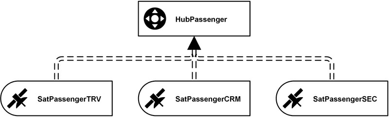
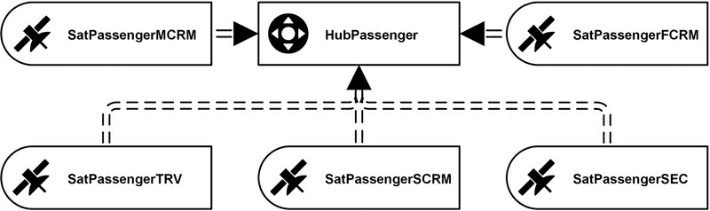
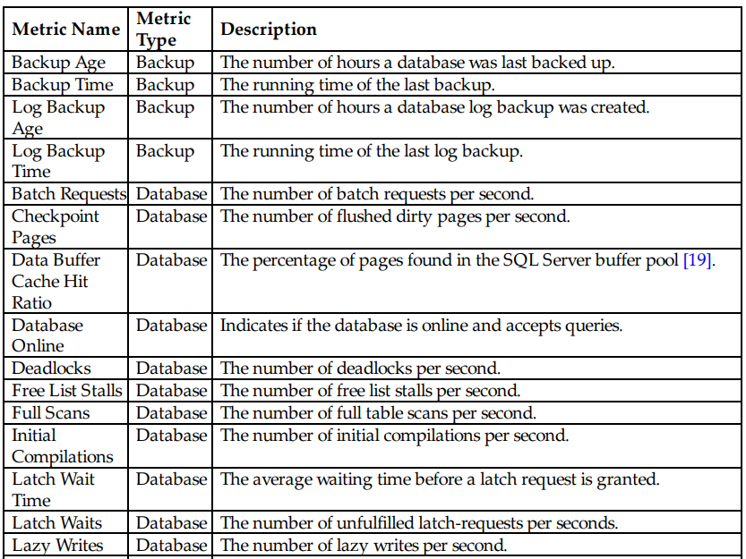
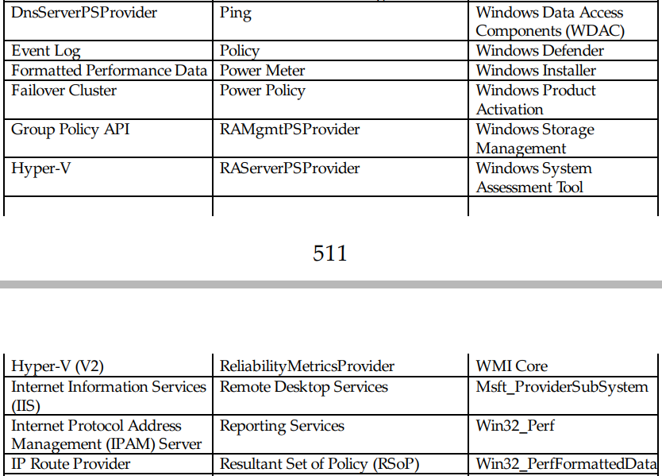

# Metadata Management(449-528)

[TOC]


## Abstract
The authors briefly introduce the various types of `metadata` used in `data warehousing`. This includes naming `conventions`, `source system` definitions, hard and soft `rules`, metadata for `staging areas`, `cross-reference` tables, and `access control` lists. They explain the `attributes` recommended (for tracking) in projects, and the `components` in the `architecture` used to store the `metadata`. In addition, the chapter covers how to **implement** the `error mart`, used to capture `erroneous data` from `ETL` and other processes. The chapter is complemented with hands-on examples for the `Meta Mart`, the `metrics vault` (and `metrics mart`) and the `error mart`. 

### Keywords
```
metadata
metadata management
data warehouse
naming conventions
source system definitions
cross-reference tables
access control lists
error mart
Meta mart
metrics vault
```

In many of our projects, clients ask us how to track `metadata`, “**`the data about data`**.” While there are some `solutions` available to **track** `metadata` in `data warehouse environments`, `project teams` often work with manual `spreadsheets` to maintain the metadata required to define the `data warehouse`, including its `artifacts`, such as `relational tables`, `information marts`, `ETL (extract, transform, load) flows`, `requirements`, `business rules`, etc.

But metadata management, from a `Data Vault` perspective, also requires the capture of metrics about process execution and errors. This chapter covers the concepts behind **capturing** `metadata`, `process metrics` and `error information`.


## 10.1. What is Metadata?

Our initial definition of `metadata` as “`data about data`” is not very helpful. An alternative to this definition is that `metadata is all data about other data that is “needed to promote its administration and use” [1]`. Both definitions are very common definitions from the information technology space but don’t provide us with a useful and understandable definition for data warehousing. Another definition, often used in data warehousing, distinguishes metadata by the following two categories [2]:


1.  **Back room metadata**: this metadata is process related and describes `the extraction, cleaning and loading processes`. Its main purpose is to help the `database administrator (DBA)` or the data warehouse team to load the data into the data warehouse. It also helps `end-users` to understand **`where data comes from`**.
2.  **Front room metadata**: this metadata is more descriptive and is *used* in `query tools` and `report tools`. It primarily benefits end-users and helps them to understand the technical solution when building front-end solutions.


The `ultimate goal` of `metadata management` is to describe all `artifacts` of the `data warehouse`, not limited to the previous list. There are various examples of metadata that need to be captured in the `data warehousing domain`, including descriptions of the `relational table` [1]:
1. **Record layout**: this metadata describes the `layout of records` in a relational table, including the list of `attributes`, their relative `position` and `format` of data on disk.
2. **Content**: the volume of data within a table or within a load for a particular table (volumetric) [3].
3. **Indexes**: the number and definition of indexes of the table.
4. **Scheduling**: the time schedule when the data in the table is loaded or refreshed.
5. **Usage**: where are the columns in the table being used? What are the dependencies for or on this table?
6. **Referential integrity**: what are the relations from this table to other tables?
7. **General documentation**: usually an unstructured text that describes the purpose of the table.


Often, parts or all of the above `metadata` is captured in the `relational database management system (RDBMS)` because `database systems` provide the means to capture such metadata. In other cases, an `entity relationship (E/R) tool` is used to capture such information. However, the previous list of metadata isn’t even close to being a complete list. Instead, it focuses on only one area of metadata, the metadata about `relational structures`. However, there is much more metadata in a `data warehouse system` available, as we have already written in the introduction to this chapter.


Besides the `back room` and `front room` categorization of metadata, the metadata in a data warehouse is often categorized into three `areas` [2,4]:
1.  `Business metadata`: describes the meaning of data for the `business`. The `Meta Mart` covers this metadata and is covered in section 10.2.
2.  `Technical metadata`: describes the `technical aspects` of data, including data types, lineage, results from data profiling, etc. This metadata is also covered by the `Meta Mart` which is covered in section 10.2.
3.  `Process execution metadata`: provides `statistics` about running `ETL processes`, including the `number of records` sourced and loaded to the destination, `number of rows` rejected and the `time` it took to load the data. Collecting `ETL process statistics` is covered in sections 10.3 and 10.4 when the `Metrics Vault` and the `Metrics Mart` are described. In addition, `error information` is tracked to provide insight into exceptions or stops during ETL process execution. The `Error Mart` tracks these errors in the `Data Vault 2.0 architecture` and is covered in section 10.5.

**We will follow this definition of metadata through the remainder of this chapter and consequently use this definition throughout this book.** The next sections describe the `metadata categories` in more detail and provide some examples. Note that the list is still only a suggestion and provides only a limited number of metadata examples which we have seen in projects. In practice, each `data warehouse team` needs to modify the `list of metadata` that should be tracked to meet the needs of their organization and their project.


It should also be noted that the `metadata` might change over time because of changes in the underlying definition of the data. This includes all three `categories`, ranging from changes in the definition of `business data` (because the business meaning of the data has changed), over `technical metadata` (because the source systems have changed) to `process execution metadata` (because the data warehouse has changed).


### 10.1.1. Business Metadata
`Business metadata` describes the `meaning of data` for the `business`. Should the business therefore be responsible for `business metadata`? There are arguments for the assignment of business data to representatives of the business and arguments against it. For example, **some** argue that `business data` should be created and maintained during the `requirements gathering process` by `data warehouse business analysts`. **Others** argue that it should be maintained by `source system business analysts` because most `business terms` **originate from** `source systems`. And **another** group says that the business metadata should be created and maintained by `data modelers` when **creating `logical data models`** for the `data warehouse` [2].


The `data warehouse team` might not be the right party to decide who will be responsible for the `business data` but, in any case, it needs to decide **what** `business metadata` needs to be managed and **where**.


The list of `business metadata` that needs to be tracked includes the following metadata related to `business definitions` [2]:


1.  **Business column names**: in some cases, the `business name` might use **`abbreviations`** in prefixes or suffixes. Each of these `abbreviations` should <u>be translated in order to make sense</u> to the business side.
2.  **Business definitions**: for each `attribute`, `table` and other object, including `soft business rules` of the `information mart`, there should be a `business description` of the attribute’s, table’s or object’s `business meaning`. In some cases, it is not easy to provide a `business description` for every item. However, this indicates that there is no analytical value of the item for the business and it can be removed from the `information mart`. If the `business` <u>demands</u> that the item remain in the `information mart`, it should be possible for the `information consumer` to provide a `business definition`.
3.  **Ontologies and taxonomies**: these `business definitions` describe the `business objects` behind the source data and the `relationships` to other business objects or the `hierarchies` that describe the business object itself. It also includes the `classification` of business objects. Typically, such ontologies and taxonomies are stored in `analytical or operational master data management systems`. This topic is covered in Chapter 9, Master Data Management.
4.  **Physical table and column names**: because `front-end tools` often present `information` to `end-users` with references to `business names` only, the `business metadata` needs to track the `physical names` that belong to the `business names`. Otherwise, the `data warehouse team` cannot associate `business definitions` to `physical data elements`.
5.  **Technical numbering** used to identify data elements in the technical model.


This `information` is required for `end-users` to **understand** the `information marts` they are dealing with; the `power users` need it in order to **find** the `raw data` in which they are interested in the `Raw Data Vault`; and the `ETL developers` need this metadata to **understand** the meaning of the `source data` when **loading** the `Raw Data Vault` and `information marts` by implementing `business rules`. In short, these `business definitions` **provide meaning to the `source data`**.


**Another** set of `business metadata` includes `information about source systems`. The following list provides the `metadata` that needs to be tracked for the `data warehouse` [2]:

1.  **Record source**: this metadata describes the `record source` in `business terms`, such as “Flight Tracking Database” or “Passenger Information.” It should not be a technical reference to the server or database instance. Instead, it should be understandable by the business. In addition, it should include as much detail as possible. For example, instead of using “`Passenger Information`” for all data sources in the `passenger information database`, refer to `specific data elements`, such as “`Passenger Information / Personal Module / Home Address Data`.” Section 10.2.2 describes how to cover such data in the `Meta Mart`.
2.  **Table specifications**: In addition to providing the `business name` of the `source system` and the detailed `data object name`, a description should be provided which explains **`the purpose of the source table`**, the `volume` of data in the table and the list of `columns` and `keys` (primary and alternate keys). Section 10.2.3 covers how to collect such data in the `Meta Mart`.
3.  **(Hard) exception-handling rules**: for each table, there should be a list of `potential technical issues` provided. This list describes the `potential error` or `data quality issue` and `how the ETL process should deal with these errors`. In `Data Vault 2.0`, these `rules` are referred to with the term “`hard rule`.” We describe how to cover such rules in section 10.2.4.
4.  **Source system business definitions**: this metadata describes the `business meaning` of `source attributes`.
5.  **(Soft) business rules**: `source systems` implement `business rules` that modify or generate some of the `source data`. Other `business rules` perform data cleansing or prevent the insertion of erroneous data. For example, some `business rules` aggregate measures as new attributes in the source. When building the `data warehouse`, `ETL developers` are interested in these `business rules` to understand the `source system` and the `business requirements` behind it. Some `source systems` implement `business rules` within the application itself; others use the `RDBMS` for this purpose: the use of check constraints, triggers, and referential integrity point to business rule definitions that should be documented. In `Data Vault 2.0`, these rules are referred to using the term “`soft rule`.” They are covered in more detail in section 10.2.9.


Section 10.2 will demonstrate how to implement these types of metadata with Microsoft SQL Server 2014.

### 10.1.2. Technical Metadata


While `business metadata` describes the **meaning of data** for the business, `technical metadata` serves many purposes. The `data warehouse team` is responsible for creating and maintaining this type of metadata and benefits from it most. Therefore, most `technical metadata` is around `technical components` of the `data warehouse`, such as [2]:
1.  **Source systems**: this type of metadata provides `technical information` about the `source systems` including the `source database` or `flat file location` and `staging area tables` used. See section 10.2.3 for a more detailed description.
2.  **Data models**: are the `physical and logical data models`, often presented in a `graphical format`, and provide information about the `relationships between tables`. While they are not metadata, they provide an invaluable asset to the data warehouse team.
3.  **Data definitions**: this list `provides technical definitions` of all columns in a data source. It including `information` about the table name, column name, data type, the domain (as enforced by foreign keys, check constraints or the application itself), referential integrity, constraints, defaults, triggers and stored procedures that ensure the data integrity of the source database.
4.  **Business rules**: the technical definitions of `business rules` are also considered as `technical metadata` because they need to be implemented in `ETL` later on. Similar to `business rules` in `business metadata` (refer to section 10.2.8), hard rules should be separated from soft rules. For each rule, there should be a `technical description` (unlike a more business-oriented description in the business metadata). There are also business rules that describe encryption or decryption requirements, among other data protection and security considerations.
5.  **Volumetrics**: there should be information about the `table size` and `growth patterns` of the `source tables` to estimate the workload of the data warehouse for this source table. It also helps to predict the growth patterns for hardware acquisition cycles of 6 to 12 months into the future.
6.  **Ontologies and taxonomies**: `technical metadata` should also `provide information` about ontologies and taxonomies, including abbreviations of terms and attributes, relationships, business key designations, peers and parents, hierarchies and re-defines (cross-ontologies matching at a structure level).
7.  **Data quality**: this kind of metadata provides information about `standardization of source data` and other data quality metrics.


Section 10.2 will demonstrate how to implement technical metadata in the `Meta Mart` using Microsoft SQL Server 2014.


### 10.1.3. Process Execution Metadata
Unlike business or technical metadata, which is provided by the business or source `applications`, `process execution metadata` is <u>generated by</u> the `data warehouse team` and <u>provides insights into the `ETL processing` for maintenance</u>. The data is used by the `data warehouse team` or by `endusers` to better understand the `data warehouse` performance and `results` presented in the `information marts`. There are four different types of process execution metadata, most of them coming from `ETL systems` such as SQL Server Integration Services (SSIS) [2]:
1.  **`Control flow metadata`**: a `control flow` executes one or more data flows among other tasks. Logging the `process execution` provides a valuable tool for maintaining or debugging the `ETL processes` of the `data warehouse` because it provides information about the `data lineage` of all elements of the data warehouse.
2.  **`Data flow metadata`**: the `data flow log` provides information about the `performance` of data flows and how many `records` have been processed or rejected by each `transformation`.
3.  **`Package metadata`**: a `package` executes a control flow. The `package metadata` provides `summary information` about the running time of the package.
4.  **`Process metadata`**: most `packages` are executed by SQL Server Agent or another scheduling application. The `process metadata` provides information about the `process` that has started the package.

While the list uses terminology from Microsoft SSIS, it can be applied to any other `ETL tool`. This kind of metadata should, on process execution, be held in the `Metrics Vault` and is usually separated from the business and technical metadata in the `Meta Mart`. Implementing a `Metrics Vault` and a `Metrics Mart` are covered in section 10.3. 

The next section covers implementing the `Meta Mart`.


## 10.2. Implementing the Meta Mart


The `Meta Mart` is the central piece for collecting business and technical metadata in the Data Vault 2.0 architecture. As outlined in Chapter 2, it is an independent information mart that is not sourced from the Raw Data Vault. Therefore, there is no Meta Vault that could be used as a source for providing a virtual Meta Mart. Instead, the Meta Mart provides a set of tables that are used to collect the metadata of the data warehouse. The Meta Vault is materialized as it actually stores the metadata. Similar to other information marts in the Data Vault 2.0 architecture, the Meta Mart is modeled in such as way that business can make the most use of it. In some cases, this can be a dimensional model, while in others it is a model in third-normal form. In other cases, a metadata tool is used to present the metadata available to the end-user. In that case, the Meta Mart is the database for this metadata front-end.


There is no need for the Meta Mart to be a relational database: many commercial modeling and ETL tools support the customization of their metadata models in order to capture custom metadata, in addition to dedicated metadata management tools. Extending the model can be helpful to capture information about stage tables, such as the record source and the attribute classification (for example if the attribute from the source system is a business key, link information or descriptive attribute). It is also often possible to extend the model with data lineage capabilities especially added for Data Vault purposes. For example, it is possible in many tools to provide the source tables of Raw Data Vault Hubs, Links and Satellites. Some of these tools also support the definition of business rules which can then be linked to the Data Vault model or the information mart model.


The next sections assume that no such tool is in place. Instead, alternative solutions are presented which are based on a relational Meta Mart.


### 10.2.1. SQL Server BI Metadata Toolkit
One such front-end tool is the SQL Server BI Metadata Toolkit, available on CodePlex [5]. It is an update of a tool for SQL Server 2005 which was first published on the MSDN Code Gallery. The toolkit is not production ready, but it serves as an example of a metadata front-end. The toolkit1:


1. scans SSIS packages, SSAS databases, SSRS reporting services and relational SQL Server databases
2. extracts the metadata from these components
3. stores them in the metadata database (the Meta Mart), and
4. provides a GUI for visually analyzing the metadata elements of the Microsoft BI stack.


By doing so, the toolkit extracts the metadata on its own and populates the Meta Mart of the data warehouse. Features of the toolkit include data lineage, covering business and technical metadata and providing impact analysis [5].


There are three tools included in the toolkit [6]:


1. Dependency Analyzer: this tool reads the contents of SSIS packages, SSAS databases and SQL databases and SSRS report collections. When analyzing SSIS packages, it gathers the metadata about all data flows in the package, about all sources and destinations in the data flows and the columns in the data flow. SSAS databases are analyzed for the included data sources, cubes, data source views, and dimensions. The gathered metadata is written to a selected repository database, usually the Meta Mart. Figure 10.1 shows the database tables that are created by the dependency analyzer.
2. Dependency Executor: this tool provides a graphical user interface to the dependency analyzer. Figure 10.2 and Figure 10.3 shows the user interface of this application.
3. Dependency Viewer: this tool presents the metadata to the end-user. It displays the information gathered by the dependency analyzer and shows metadata about the analyzed SSIS packages, SSAS databases, SSRS reports, and relational SQL Server databases. Figure 10.4 shows its user interface.


>FIGURE 10.1  Database metadata for the SQL Server BI Metadata Toolkit (physical design).
>
>


>FIGURE 10.2  Setting up the metadata repository in the Dependency Executor.
>
>


>FIGURE 10.3  Setting scan options in the Dependency Executor.
>
>


>FIGURE 10.4  Dependency viewer of the SQL Server BI Metadata Toolkit.
>
>


The database model which is created by the dependency analyzer is shown in Figure 10.1.


From a modeling perspective, the database model in this figure is not well designed, for example because primary keys are missing. But because it serves only as an example for a Meta Mart, it still presents an acceptable solution. The following tables are present in the database model:


1. LookupConnectionID: this table provides internal information about the connection types in SSIS.
2. Audit: this table stores run time information about SSIS data flows. We will implement a similar table when implementing the Metrics Vault in section 10.3.
3. Version: this table provides version information about the toolkit itself.
4. RunScan: this table stores a row for each analysis run (using the dependency analyzer).
5. ObjectTypes: this table provides information about the transformations and tasks available in SSIS and other data elements from other components of the Microsoft BI stack.
6. Objects: this table provides metadata information about objects within SSIS packages, in SSAS or relational databases and in reports.
7. ObjectDependencies: this table describes the dependencies of objects within the components of the Microsoft BI stack. Objects might be contained by others, reference other objects, or map to other objects.
8. ObjectAttributes: this table provides detailed metadata about the object attributes.


These tables are populated by the Dependency Analyzer tool which might be run from the command line or using the graphical front-end, the Dependency Executor, as shown in Figure 10.2 and Figure 10.3.


Once the Dependency Executor has performed its analysis, the data is available in the tables presented in Figure 10.1. In order to analyze the dependencies between objects, the following query might be used to receive a readable dependency list:


>


This query uses the ObjectDependencies table as the basis for the query and uses two LEFT JOINS to join the object names for readability. Because of the Dependency Viewer, it is not required to analyze the metadata using SQL queries. Instead, the Dependency Viewer provides a graphical way for the analysis of the metadata stored in the metadata repository (Figure 10.4).


The left tree view of the Dependency Viewer lists all objects found in the Microsoft BI stack. When selecting one of the objects, the object is displayed with all of its dependencies on the central area of the viewer. The bottom area displays the attributes of the selected object for further analysis.


The SQL Server BI Metadata Toolkit provides a powerful example for providing a simple Meta Mart on the technical metadata of the Microsoft BI stack. However, for tracking all artifacts of the enterprise data warehouse, we need to capture more metadata, as described in the previous sections.


### 10.2.2. Naming Conventions
The first step in providing custom metadata is the use of naming conventions. Figure 10.4 from the previous section shows tables from a dimensional information mart that use two prefixes: “Dim” for dimensions and “Fact” for fact tables. By doing so, the table name provides information about the entity type of the table within the dimensional model.


The same approach is often used to denote entities in the Data Vault model. There are multiple options available for abbreviating the various Data Vault 2.0 entities and adding them to the actual identifier of the table. For example, many customers use one of the following abbreviations to name a Data Vault hub:


1. H_Customer
2. HUB_Customer
3. HubCustomer
4. CustomerHub


As you can see, many options exist to use a prefix or a suffix for naming a hub entity. Some customers use a prefix, others a suffix. In some cases, they use Camel Case, while in others they use underscores to separate terms in the table name. Because the options for naming conventions are often limited by development standards already available in the organization [2], project teams who start using Data Vault then only have the choice to decide which prefixes to use for each Data Vault entity. They cannot decide whether they want to use a prefix or a suffix any longer, because this decision has already been made a long time ago, by a prior project or, in larger organizations, a standards committee. In this way, organizations try to standardize their table and attribute namings among multiple projects.


The major question that is left to most project teams is instead: which types of Data Vault entities should have their own prefix? Should there be a prefix for every Data Vault entity type? Or are some entity types the same and should use the same prefix in turn? Table 10.1 lists the Data Vault entity types that should have their own individual abbreviations to be used as a prefix or suffix.


>Table 10.1 Required Abbreviations for Naming Conventions
>
>


The entity types that should have their own prefix are presented in the first two columns of Table 10.1. Because the Business Vault is modeled after the same principles as the Raw Data Vault, there is often an equivalent of a Raw Data Vault entity in the Business Vault. For example, there might be a nonhistorized satellite in the Business Vault that has reduced the transactions for some reason, thus implementing parts of a business rule or the business rule as a whole. There are some exceptions: reference tables are primarily a concept of the Raw Data Vault, so reference data is usually not modified by a business rule (at least not in our experience). On the other hand, computed aggregate links, PIT tables and bridge tables are concepts of the Business Vault. In other cases, there is an equivalent entity in the Business Vault that follows the same modeling principles as its Raw Data Vault counterpart, but using a different name: for example, an exploration link is a computed link without any other modifications. The only difference is that the exploration link is not sourced from an operational data source, but includes links in the model that have been artificially generated (for example through a data mining algorithm). As a result of these observations, organizations tend to introduce an individual abbreviation for Business Vault entities, especially because it helps them to separate raw data from computed information.


In most cases, a different entity structure demands its own abbreviation. However, there are some exceptions to this rule: the same- as-link or the hierarchical link, for example. While they follow the standard structure of a Data Vault link, they serve a special purpose. Therefore, they should have their own abbreviation. The same applies to status tracking satellites or effectivity satellites which follow standard Data Vault structures for satellites as well. One exception to this rule is the nondescriptive link (or fact-less fact). It is a special link, but only because it has no satellites. The link itself, the relationship between two business keys, is the fact. The reason why this link should not have its own abbreviation is that a satellite could be attached to the link later on. For example when data from a new operational system is sourced and, all of a sudden, this source system provides data that describes this link (thus adding a Raw Data Vault satellite to the link). By doing so, the nondescriptive link transforms into a standard link and should use the same abbreviation as the standard links. The same applies to cases when computed satellites are added to the nondescriptive link.


When naming Raw Data Vault satellites, it is recommended to include an abbreviation for the source system because, in many cases, there are multiple satellites hanging off the parent hub or link. If our recommendation from Chapter 4, Data Vault 2.0 Modeling, is followed, each source system should be loaded to its dedicated satellite or satellites. This avoids the drawbacks of overloaded satellites as described in that chapter. But if each source system creates a new satellite on a hub, they need different names to distinguish them from each other, both in a logical view and in physical implementation. The logical diagram in Figure 10.5 shows this issue.


>FIGURE 10.5  Multiple satellites on parent hub (logical design).
>
>


Three source systems provide descriptive data for the passenger. They are abbreviated as TRV (travel system), CRM (customer relationship system) and SEC (security). Using this simple naming convention makes it clear that the table is a satellite, to which parent hub each satellite belongs, and where the data comes from. The next issue is satellite splitting: if there are source columns that change frequently, the recommendation from Chapter 4 is to split the satellites by rate of change. For example, if the satellite SatPassengerCRM in Figure 10.5 is split by rate of change, the logical model shown in Figure 10.6 results from this split.


>FIGURE 10.6  Multiple satellites after split (logical design).
>
>


The preferred dish information was split from the other passenger data because it changes more frequently than, say, the name. In this case, the name of the entity was changed from SatPassengerCRM to SatPassengerPreferredDishCRM because the separated attribute makes it obvious how to name the new satellite. But what if this becomes more complicated because a couple of attributes are separated that don’t necessarily belong together? What if you decide to mechanically separate the attributes of a satellite by some rate of change? To make things more complicated, there are multiple definitions of rate of change as the (incomplete) Table 10.2 demonstrates.


>Table 10.2 Various Rate of Change Definitions
>
>


Depending on your understanding of rate of change, one or another (or multiple) definitions might be useful in your project. There should be an abbreviation for each rate of change. For example, if we use the three speed levels slow, medium and fast to denote the rate of change in our satellites, a logical design of our model in Figure 10.5 could look like the design in Figure 10.7.

>FIGURE 10.7  Multiple satellites after mechanical split (logical design).
>
>


In this example, the satellite SatPassengerCRM has been split into three new satellites: SatPassengerSCRM, SatPassengerMCRM and SatPassengerFCRM. The character before the source system indicates the rate of change for each satellite.


We call this split a mechanical split because it could also be automated: after analyzing the current rate of change for each attribute in a satellite, the algorithm could generate the required DDLs for the new satellites without knowing any business definition of each attribute (thus unable to find a more meaningful name as in the previous example).

The advantage of using naming conventions for the Data Vault tables is that the information about the entity type is encoded in the table name. This information becomes available in all tools that present SQL Server tables to its end-users. The disadvantage, however, is this metadata is not easily retrievable as dedicated metadata, attached to the entity.


### 10.2.3. Capturing Source System Definitions
The purpose of the source system abbreviation in satellites (as described in the previous section) is only to distinguish the table names when multiple source systems provide descriptive data for a business key. It is not a description of the source system.


Instead, much more metadata is required to describe the source system for business and IT usage. For example, the fact that data has been sourced from a source system is important in agile projects, because not all available source system tables are loaded to the data warehouse at once. Instead, only the source systems that provide raw data that is required to build a certain report or other information artifact are sourced into the data warehouse (and only partially, table by table). We source data just in time. Identifying the source system tables that have not been implemented in the data warehouse is required because the data hasn’t been loaded in previous sprints. Therefore, these missing source system tables need to be loaded in the current iteration.


Typically, organizations decide to use at least the following metadata attributes to define the source systems sourced by their data warehouse [7]:
• Source system identifier: a technical identifier of the source system used to reference the source system in subsequent metadata or other documentation.
• Source system technical description: technically describes the source system in a textual format.
• Source system business description: describes the source system from a business perspective.
• Source system version: the current version of the source system.
• Source system quality: describes the quality of the source system (could also use an indicator scale from “poor” to “good” or a percentage value).
• Data steward: provides the name and contact information of the data steward responsible for the management of data elements of the operational system.
• System administrator: provides the name and contact information of the person who is responsible for administrating the system.


Note that some source systems provide data in separate batches that
might not be delivered in the same schedule. For example, some data
could be delivered on a daily basis, while other data is delivered in real-
time. For that reason, the actual data delivery (a data package) should be
defined in another metadata table that includes the following attributes
[7]:

1. Source system identifier: the technical name of the source system that is providing the data package.
2. Data package identifier: the technical name of the data package.
3. Data package format: defines how the source system provides its data to the data warehouse: CSV files, XML files, relational access, real-time messages, etc.).
4. Data package type: indicates if the package is a full load or delta load.
5. Delivery schedule: defines when the data is provided to the data warehouse (e.g., daily between 2 a.m. and 4 a.m.).
6. Data package technical description: technically describes the data package in a textual format.
7. Data package business description: describes the data package from a business perspective.
8. Expected data package quality: describes the quality of the data package (could also use an indicator scale from “poor” to “good” or a percentage value).
9. Data package refresh type: indicates the frequency with which the content of the data package are refreshed (e.g., real-time, near-real-time, hourly, daily, monthly, etc.)
10. Database instance name (relational source): if the data package is made available using a relational database (for example, if the data warehouse can directly access the operational system to source the data from), the database instance name is required.
11. Database name (relational source): if the data package is a relational table, this attribute indicates the database to load the data from.
12. Delimiter type (flat file source): if the data package is a flat file, this attribute indicates the delimiter used.
13. Text delimiter (flat file source): if the data package is a flat file, this attribute indicates the string delimiter used to separate string elements (usually a double quote).
14. Header (flat file source): indicates if a header row is used in a flat file source.
15. File format (flat file source): indicates the exact file format, such as CSV, EBCDIC, ASCII, VSAM, etc.
16. Control flow name: the name of the control flow that is responsible for loading the data package.


Note that a data package consists of multiple files or relational tables. Depending on the actual source systems and their intended data package formats, there might be need for more metadata attributes. This list should serve only as a starting point. Chapter 11, Data Extraction, lists more potential source systems and data feeds (such as Web sources, social networks, mainframe systems, etc.) and describes the requirements for sourcing them into the data warehouse.


### 10.2.4. Capturing Hard Rules
Hard rules in the data warehouse deal with data type conversions required for loading and technical issues that can arise when staging the data or loading the data from the staging area into the Raw Data Vault. Therefore, they are applied when loading the data into the staging area or loading the data from the staging area to the Raw Data Vault. Examples include:
1. Assignment of source attribute to target attribute: in some cases, organizations choose to use a different name in the staging area or in the Raw Data Vault. In this case, the hard rule defines how to map a source field to a target attribute in the staging area or in the Raw Data Vault.
2. Hard rules that convert a source data type to a target data type: this practice should be avoided, but in some cases, there is no equivalent data type in the target that directly reflects the source system. For example, an operational system could have been built with Java or .NET types in use, but the data warehouse has decided to use only generic T-SQL data types. A hard rule defines how to perform the required conversion.
3. Hard rules that ensure how to deal with wrongly sized data: this type of rule deals with data that is too long to be stored in the destination, for example, because a VARCHAR column in the target is unable to capture the whole source string. Usually, the destination should be able to cover the whole string, but what if the source system was modified and sends more data than expected? In other cases, the incoming data should have an expected number of minimum characters or minimum number of numerical digits. The hard rule defines if and how the data is cut or extended or if the record is rejected.
4. Invalid data type formats: because most raw data is not directly sourced from the operational system, but by using comma separated text files (CSV) or other text-based formats. In such a case, the original data is transformed to strings using a predefined format. For example, date data types can be converted from their internal binary representation into UTC strings which present the date using the following format: “YYYY- MM-DD hh:mm:ss[.nnn]” or into a USA style date with the format “mm/dd/yy”, omitting the time information and completely changing the structure of the date format. The hard rule does not only define how to convert from a date data type, but also how to deal with strings that don’t comply with the expected format. Similar hard rules are required to convert floating numbers, Boolean values, etc.
5. Unicode: another practice is to store all string data in the staging area and in the Raw Data Vault using Unicode character sets to make sure that all character data can be stored. The hard rule defines not only the target character set but also any required conversion.
6. Reformat business keys: many organizations choose to reformat business keys if there exist multiple formats in operational systems. For example, if a phone number is used as a business key by the business, it might make sense to use a standardized format when loading the hubs to avoid added same-as-links (SAL). Note that the satellites should track the original values as they were stored in the operational systems. This is a hard rule as long as the content of the data doesn’t change.
7. Local smart keys: In many cases, there are operational systems that are used only in a certain region. In such cases, they often use a local business key, which is extended to a smart key globally. For example, a customer number “12345” for a customer in Germany could be identified as the smart key “DE12345” in the global enterprise. Thus, the business key “DE12345” should be used in the data warehouse when loading hubs. A hard business rule can be used to convert such local keys into the expected format of the smart key.
8. Hash keys and hash differences: the definition of hash keys (on business keys and their relationships) and hash differences (on descriptive attributes) are also defined by hard rules.


Note that the local smart keys should only be used under the described circumstances: to apply the format of the smart key to a local business key. It should be avoided to use a more complicated mapping when applying a hard rule, for example to map the business key “12345” to “XYZ”. Because the mapping between these numbers is not a technical mapping but defined by the business (in general), the mapping is actually a soft business rule that should be applied later.


The primary definition of the hard rules for the data warehouse is done using documents that define the hard rules and their applicability. This definition also includes how and where deviations from the expected format and actual errors should be logged. The following metadata attributes should be used to define hard rules:
1.  Data flow name (optional): the data flow that is implementing this hard rule.
2.  Name: a name for the hard rule understandable by the business.
3.  Rule identifier: the technical name of the hard rule.
4.  Description: a technical description of the hard rule.
5.  Definition: the actual definition of the hard rule, using a text-based or graphical notation.
6.  Business area: the functional business area (or business owner) that defines this hard rule.
7.  Topic: a given topic that this hard rule is part of.
8.  Task/rule set: a more detailed task or rule set that this hard rule is part of.
9.  Source: The source of the hard rules definition (for example, project documentation).
10.  Implementation type: Table 10.3 lists the potential rule types.
11.  Keywords: keywords that help to find the hard rule from the business rule collection.
12.  Related rules: relates this hard rule with other hard rules.
13.  Example: provides example inputs and their respective outputs.


> Table 10.3 Hard Business Rule Types [8]
>
> 


The above list provides some commonly used metadata attributes. Not all of them are required in all projects and, in many cases, organizations decide to add additional ones that make sense in their context. 

Spreadsheets are often used to define which hard rules apply to which source and target attribute mappings. The form in Table 10.4 can be used to provide a detailed definition of a hard rule.

>Table 10.4 Hard Rule Definition [9]
>
>


Because hard rules can be applied when loading the staging area and when loading the Raw Data Vault, the definition is referenced in the mapping table for either or both layers. Section 10.2.5 and 10.2.7 show examples for mapping tables that include such references.


### 10.2.5. Capturing Metadata for the Staging Area


We have described in section 10.2.3 that tracking the source systems (that have been loaded into the data warehouse) is important in order to know what raw data is available in the data warehouse and what is still missing. But knowing the source system is not enough: the recommended approach to loading raw data from source systems is to load all the source tables from any source system that provide us the required raw data to build an information artifact, such as a report. For example, if source system A provides required raw data in one table and source system B provides required raw data in two more tables, we source these three tables completely. It is not recommended to source all tables from each source system, because the data contained in these source tables are not required for the current sprint, thus overloading the sprint with unnecessary effort. However, it is also not recommended to source only those attributes in the source tables that provide the required raw data, but load a source table all at once. That way, the overhead for managing the data warehouse contents (the tables already loaded into the data warehouse) is less. It should be clear that managing the data warehouse contents on an attribute level is more effort than on a table level.


For each table in a source system, the following metadata attributes should be managed at a minimum [10]:
1. Data package identifier: the technical name of the data package that contains this table or other data structure (for example individual flat file).
2. Table identifier: the technical name of the data group, which is a set of data elements (attributes).
3. Source table schema name: the name of the source schema.
4. Source table physical name: the physical name of the source table.
5. Table description: a technical description of the source table.
6. Table business description: a detailed textual description of the source table in business terms.
7. Data quality: describes the quality of the source table (could also use a indicator scale from “poor” to “good” or a percentage value).
8. Target table schema name: the name of the schema in the staging area.
9. Target table physical name: the physical name of the staging table.
10. Data flow name: the name of the data flow that is loading the table.


Each table consists of multiple source columns and their respective target column mappings, which are described by an additional metadata table [10]:


1.  Table identifier: the technical name of the parent data table.
2.  Column identifier: the technical name of the column in the source table.
3.  Source column physical name: the physical name of the source column in the source table.
4.  Source data type: the data type of the source column.
5.  Column description: the technical description of the column.
6.  Column business description: a detailed textual description of the column in business terms.
7.  Column business name: the common column name that is recognized by business users.
8.  Column business alias: an alternative column name that is recognized by business users.
9.  Column acronym name: a common acronym coding of the column name.
10.  Required flag: indicates if the column is required to have a value (NOT NULL).
11.  Computed flag: indicates if the column is derived from a computed column in the source system.
12.  Target column physical name: the physical name of the target column in the staging area table.
13.  Target data type: the data type of the target column.
14.  Is sequence: indicates if the target column is a sequence column.
15.  Is hash key: indicates if the target column is a hash key.
16.  Is hash difference: indicates if the target column is a hash difference value.
17.  Is record source: indicates if the target column is a record source attribute.
18.  Is load date time: indicates if the target column is a load date time.
19.  Hard rules: references to the hard rules that are applied within the loading process.


It is also possible to denormalize these two tables. While adding redundancy, it is often easier to use.


Note that it should be possible to apply multiple hard rules to a source to stage column mapping. If it is not possible, another option is to define a hard rule that packages multiple hard rules, thus applying multiple hard rules to the referencing mapping. However, such an approach requires more hard rules with fewer chances for reuse.

When sourcing hierarchical files (or tables), additional and more complex metadata is required because the goal of a hierarchical mapping is to map each column (or XML attribute and element) to a relational column in the staging area. Loading hierarchical sources requires normalization for that reason, as Chapter 11, Data Extraction, will demonstrate. One approach to define the metadata for hierarchical sources is to include the hierarchical path in the source column physical name and add a target table physical name and target table schema name (if actually required) to support multiple target tables.


### 10.2.6. Capturing Requirements to Source Tables

This cross-reference table was introduced in Chapter 3, The Data Vault 2.0 Methodology, and identifies the source tables and optionally the columns that are used by a specific requirement. Table 10.5 shows an example.

>Table 10.5 Requirements to Source Tables Cross Reference with Source Attributes
>
>


One row exists per source column. Each source column is described by some additional information, in this case the physical names. Other options are possible and left to the data warehouse team (for example, the business description). For each requirement, one column is added. Note that not only the name of the requirement is provided but also the technical number that uniquely identifies the requirement in the requirements specification. An X in the cell indicates if the source column is used to implement the requirement. In addition to the table itself, the document references the requirements document thata provides the detailed requirements specification (there might be multiple requirements documents in a project if the team decides to split the requirements up, e.g. per function, etc.).


This cross-reference table can be used in two ways:

1. To identify the requirements that are affected by a change of the source system.
2. To identify the source tables and columns that are needed to be sourced in order to implement a requirement.


Following the general recommendation from 10.2.5, that is, to completely load a table into the data warehouse if at least one column is required by a requirement, we can use the cross-reference table to identify those source tables needed by the iteration that implements a specific requirement.


### 10.2.7. Capturing Source Tables to Data Vault Tables

In order to capture metadata for mapping from source tables (in the staging area) to Raw Data Vault tables, multiple metadata tables are recommended. The reason lies in the fact that the mapping for a hub entity is fundamentally different from link entities and from satellite entities. For example, in order to map from a staging table to a Data Vault hub, the business key needs to be identified only. However, in order to map from a staging table to a Data Vault satellite, all descriptive attributes need to be mapped in addition to all attributes identifying the satellite’s parent. To complicate matters, there are significant differences between satellites on hubs and satellites on links, requiring separate tables for both entity types.


Note that the lists of metadata attributes in the following sections are suggestions only. Before maintaining metadata for the data warehouse, the list should be tailored to the actual needs of the data warehouse team. One problem with metadata management is that it often tends to become outdated because many teams stop maintaining the metadata tables. To overcome this problem and speed up the design and development processes of the data warehouse, it is worth investing in modeling and generation tools.


The following definitions also cover only basic Data Vault entities (as covered in Chapter 4). In order to define the metadata for intermediate or advanced concepts, additional metadata attributes might be required.


#### 10.2.7.1. Metadata for Loading Hub Entities
In order to define the metadata for Data Vault hubs, the following attributes are required:

1. Data flow name: the name of the data flow that is loading the target hub.
2. Priority: a common practice is to source business keys from multiple sources. In this case, the priority can be used to determine the order of the data sources when loading the hub, which might affect the record source to be set in the target hub.
3. Hub identifier: the technical name of the target hub.
4. Target hub table physical name: the physical name of the target table in the Raw Data Vault.
5. Source table identifier: the technical name of the source data table in the staging area.
6. Source table physical name: the physical name of the source table in the staging area.
7. Source column physical name: the physical name of the source column in the source table that holds the business key.
8. Source column data type: the data type of the source column.
9. Source column required: indicates if the source column allows NULL values.
10. Source column default value: indicates the default value of the source column.
11. Source column computation: if the source column is a computed field, provide the expression that computes the column value for documentation purposes.
12. Business key column description: the technical description of the business key column.
13. Business key column business description: a detailed textual description of the business key column in business terms.
14. Business key column business name: the common business key column name that is recognized by business users.
15. Business key column business alias: an alternative business key column name that is recognized by business users.
16. Business key column acronym name: a common acronym coding of the business key column name.
17. Business key physical name: the physical name of the target business key column in the hub table.
18. Target column number: The column number of the business key within composite keys. Otherwise 1.
19. Target primary key physical name: the physical name of the target primary key column in the hub table.
20. Target data type: the data type of the target business key column.
21. Last seen date flag: indicates if a last seen date is used in the hub and should be updated in the loading process.
22. Hard rules: references to the hard rules that are applied within the loading process for this business key.


In order to support composite business keys in Data Vault hubs, it is required to provide one line per business key part when dealing with composite business keys. Table 10.6 shows examples for both a hub with only one business key and one hub with a composite key consisting of two elements.


>Table 10.6 Metadata for Capturing Source Tables to Data Vault Hub Entities
>
>


The first hub is hub Airline that consists of only one business key attribute AirlineID. However, the business keys for this hub are loaded from multiple sources: there is a staging table AIRLINE present and another staging table AIRX. In this case, the source table identifier (which was introduced in the metadata for the staging table) is the same as the source table physical name. Both source tables provide business keys that need to be loaded in order to include all business keys that are used by the business. Therefore, a hub definition is copied per source table in order to fully define the required metadata to load a hub from all sources.


The second hub loads business keys from only one staging table but is defined by a composite business key. Therefore, two metadata rows are required to fully define the composite key. If multiple source tables provided business keys, these two rows would be copied for each source table.


Because copying rows introduces some redundancy, it might be valuable to investigate normalized structures, especially if metadata tools are involved. If no tools are available, a denormalized structure as proposed in this section might be the more user-friendly structure.


Note that this example doesn’t display the descriptive metadata attributes due to space restrictions. However, it shows references to hard rules, which are defined in external documents that describe the hard rules in full detail. Technical numbering is used to reference the hard rules.


#### 10.2.7.2. Metadata for Loading Link Entities


Loading Data Vault links follows a similar pattern compared to hubs but with a little more complexity. The additional complexity is due to the fact that a link table references other hubs to store the relationship between the business keys:
1. Data flow name: the name of the data flow that is loading the target 480 link.
2. Priority: sometimes, link data is sourced from multiple sources. In this case, the priority can be used to determine the order of the data sources when loading the target link, which might affect the record source to be set in the target link.
3. Link identifier: the technical name of the target link.
4. Target link table physical name: the physical name of the target table in the Raw Data Vault.
5. Source table identifier: the technical name of the source data table in the staging area.
6. Source column physical name: the physical name of the source column in the source table that holds the business key.
7. Source column data type: the data type of the source column.
8. Source column required: indicates if the source column allows NULL values.
9. Source column default value: indicates the default value of the source column.
10. Source column computation: if the source column is a computed field, provide the expression that computes the column value for documentation purposes.
11. Source data type: the data type of the source business key column.
12. Business key driving flag: indicates if this business key is part of the driving key (if any).
13. Business key column description: the technical description of the business key column.
14. Business key column business description: a detailed textual description of the business key column in business terms.
15. Business key column business name: the common business key column name that is recognized by business users.
16. Business key column business alias: an alternative business key column name that is recognized by business users.
17. Business key column acronym name: a common acronym coding of the business key column name.
18. Hub identifier: the technical name of the referenced hub.
19. Hub table physical name: the physical table name of the reference hub.
20. Hub reference number: the number of the hub reference within the sort order of the hub references. This is required to calculate the correct hash key.
21. Hub primary key physical name: the physical name of the primary key column in the referenced hub table.
22. Hub business key physical name: the name of the business key column in the hub.
23. Hub business key column number: the number within the column order of the business key in the hub. Required to calculate the correct hash value.
24. Hub business key data type: the data type of the business key column in the referenced hub table. Can be used for automatically applying hard rules.
25. Target column physical name: the physical name of the target hash key column in the link table.
26. Last seen date flag: indicates if a last seen date is used in the hub and should be updated in the loading process.
27. Attribute flag: indicates if the column is an attribute instead of a business key. This is required to define degenerated links (refer to Chapter 4).
28. Hard rules: references to the hard rules that are applied within the loading process for this business key.


The number of entries per link depends on multiple factors: first, the number of referenced hubs. For each hub reference there is at least one metadata record required to completely define the link. In addition, if a composite business key defines a hub, the dependent link entry in the metadata table for links requires one record per business key part. Table 10.7 shows a simplified example for a link metadata table.


>Table 10.7 Metadata for Capturing Source Tables to Data Vault Link Entities
>
>


The table is simplified because some of the metadata attributes are omitted. The first link LinkFixedBaseOp references two hubs: HubCarrier and HubAirport. Both hubs are defined by simple business keys and not by composite business keys. The second link LinkConnection also references two hubs, but one hub, HubFlightNo, is defined by a composite business key, consisting of two parts: first the carrier ID and second, the flight number. The second hub HubAirport is referenced two times: as source airport of the connection and as a target airport of the connection. For that purpose, both references are stored in different hash keys.


Similar to the metadata table for hubs, presented in the previous section, this table contains redundant metadata in favor of usability. Again, it might be valuable to use a metadata tool with normalized metadata tables.


#### 10.2.7.3. Metadata for Loading Satellite Entities on Hubs
The metadata for satellites contains two types of information:
• Business keys that identify the entry in the parent hub entity.
• Descriptive data that has to be loaded into the Data Vault satellite for data warehousing purposes.


In order to keep the metadata table as simple as possible, both types of information are provided in the same table: first, the business key information, and second the descriptive data mapping. The mapping table consists of the following metadata attributes:


1. Data flow name: the name of the data flow that is loading the target satellite.
2. Satellite identifier: the technical name of the target satellite.
3. Target satellite table physical name: the physical name of the target table in the Raw Data Vault.
4. Source table identifier: the technical name of the source data table in the staging area.
5. Source column physical name: the physical name of the source column in the source table that holds the business key or the descriptive data.
6. Source column data type: the data type of the source column.
7. Source column required: indicates if the source column allows NULL values.
8. Source column default value: indicates the default value of the source column.
9. Source column computation: if the source column is a computed field, provide the expression that computes the column value for documentation purposes.
10. Business key driving flag: indicates if this business key is part of the driving key (if any).
11. Business key column description: the technical description of the business key column.
12. Business key column business description: a detailed textual description of the business key column in business terms.
13. Business key column business name: the common business key column name that is recognized by business users.
14. Business key column business alias: an alternative business key column name that is recognized by business users.
15. Business key column acronym name: a common acronym coding of the business key column name.
16. Hub identifier: the technical name of the referenced hub.
17. Hub table physical name: the physical table name of the reference hub.
18. Hub primary key physical name: the physical name of the primary key column in the referenced hub table.
19. Hub business key physical name: the name of the business key column in the hub.
20. Hub business key column number: the number within the column order of the business key in the hub. Required to calculate the correct hash value.
21. Hub business key column data type: the data type of the business key column in the referenced hub table. Can be used for automatically applying hard rules.
22. Target column physical name: the physical name of the target column (for descriptive data) in the satellite table.
23. Target column data type: the data type of the target column.
24. Target column required: indicates if the target column is nullable.
25. Target column default value: the default value of the target column (this should be defined by a hard rule).
26. Target column description: a technical description of the descriptive attribute in the target.
27. Target column business description: a textual description of the descriptive attribute in the target, using business terminology.
28. Target column business name: the common business name of the descriptive attribute that is recognized by business users.
29. Target column business alias: an alternative column name of the descriptive attribute that is recognized by business users.
30. Target column acronym name: a common acronym coding of the descriptive attribute’s column name.
31. Hard rules: references to the hard rules that are applied within the loading process for this business key or descriptive attribute.


In order to create a metadata table that fully describes a hub satellite, one record needs to be added per descriptive data attribute and per business key in the parent hub. The latter is required for identification purposes, as Chapter 12, Loading the Data Vault, will discuss. Table 10.8 shows an example of a satellite definition for a hub with a composite business key.


>Table 10.8Metadata for Capturing Source Tables to Data Vault Hub Satellite Entities
>
>


Similar to the other metadata tables in this section, the table in Table 10.8 has been simplified by omitting some attributes that are not required for the explanation. It shows the definition of a satellite SatPassenger that is sourced from a source table called PAX. Two of the source columns, COUNTRY and PASSPORT_NO, are used to identify the entry in the Hub, which is defined by the composite business key consisting of CountryCode and Passport ID. The business keys are used to calculate the hash key, which is used in the satellite as a reference to the hub’s primary key. It is possible to retrieve the corresponding hash key columns from the primary key. Naming conventions are not required to identify this column, because there should only be one hash key in the primary key. The other four fields are of a descriptive nature that means they describe the business key. In order to do so, they are being mapped to the attributes in the satellite.


This table clearly distinguishes between the business key definition and the descriptive data mapping. It is important to include the business key definition in this metadata table because of the required mapping between the source data and the business keys, which is used by the hash key computation when loading the data.


#### 10.2.7.4. Metadata for Loading Satellite Entities on Links
Hub satellite entities, which provide descriptive data for Data Vault links, are very similar to hub satellites. However, they are different in the identification of the entry in the parent link entity. The following attributes are used to define the metadata of Data Vault link satellites:

1.  Data flow name: the name of the data flow that is loading the target satellite.
2.  Satellite identifier: the technical name of the target satellite.
3.  Target satellite table physical name: the physical name of the target table in the Raw Data Vault.
4.  Source table identifier: the technical name of the source data table in the staging area.
5.  Source column physical name: the physical name of the source column in the source table that holds the business key or the descriptive data.
6.  Source column data type: the data type of the source column.
7.  Source column required: indicates if the source column allows NULL values.
8.  Source column default value: indicates the default value of the source column.
9.  Source column computation: if the source column is a computed field, provide the expression that computes the column value for documentation purposes.
10.  Business key driving flag: indicates if this business key is part of the driving key (if any).
11.  Business key column description: the technical description of the business key column.
12.  Business key column business description: a detailed textual description of the business key column in business terms.
13.  Business key column business name: the common business key column name that is recognized by business users.
14.  Business key column business alias: an alternative business key column name that is recognized by business users.
15.  Business key column acronym name: a common acronym coding of the business key column name.
16.  Link identifier: the technical name of the referenced parent link.
17.  Link table physical name: the physical table name of the reference link.
18.  Link primary key physical name: the physical name of the primary key column in the referenced link table.
19.  Hub identifier: the technical name of the referenced hub.
20.  Hub table physical name: the physical table name of the reference hub.
21.  Hub reference number: the number of the hub reference within the sort order of the hub references. This is required to calculate the correct hash key.
22.  Hub primary key physical name: the physical name of the primary key column in the referenced hub table.
23.  Hub business key physical name: the name of the business key column in the hub.
24.  Hub business key column number: the number within the column order of the business key in the hub. Required to calculate the correct hash value.
25.  Hub business key column data type: the data type of the business key column in the referenced hub table. Can be used for automatically applying hard rules.
26.  Target column physical name: the physical name of the target column (for descriptive data) in the satellite table.
27.  Target column data type: the data type of the target column.
28.  Target column required: indicates if the target column is nullable.
29.  Target column default value: the default value of the target column (this should be defined by a hard rule).
30.  Target column description: a technical description of the descriptive attribute in the target.
31.  Target column business description: a textual description of the descriptive attribute in the target, using business terminology.
32.  Target column business name: the common business name of the descriptive attribute that is recognized by business users.
33.  Target column business alias: an alternative column name of the descriptive attribute that is recognized by business users.
34.  Target column acronym name: a common acronym coding of the descriptive attribute’s column name.
35.  Hard rules: references to the hard rules that are applied within the loading process for this business key or descriptive attribute.


In order to identify the satellite’s parent link, it is required to obtain all business keys from the source system that are part of the link. The business keys become input to the hash key calculation. Other than that, the link satellite structure is similar to the hub satellite structure described in the previous section and contains only descriptive attributes. Table 10.9 shows a link satellite on a link that connects two hubs.


>Table 10.9 Metadata for Capturing Source Tables to Data Vault Link Satellite Entities
>
>


The satellite hangs off a link that connects two hubs: HubCarrier on one side and HubAirport on the other. The metadata information is required in order to map the source data to the business keys, which is required for hash key calculation. For the same reason, the business keys of a hub are ordered using the Hub Business Key Column Number. If one of the hubs were defined by more than one business key (or in other words, a composite business key), there would be two entries for this hub in Table 10.9, sequenced using this number. Similar to the metadata for loading satellite entities on hubs, there is no metadata required to identify the hash key column in the satellite because there should be only one hash key in the primary key of the satellite. The remaining three rows at the bottom of the table provide the metadata for the descriptive data attributes in the same manner as in hub satellites. 


### 10.2.8. Capturing Soft Rules

Section 10.2.4 discussed that hard rules only apply technical changes to the data loaded from the source system, for example ensuring that the data type fits the actual data and has the proper size. Hard rules never change the incoming raw data, except for data type alignment. Instead, the modification of data is left to soft rules, which change the value or the grain of the raw data. For example, content is altered by recalculation or is reinterpreted. The grain of the incoming data is changed by required aggregations to modify the source data in such a way that it fits the expected format. In other cases, a lower grain is required than the source system provides. In this case, the raw data needs to be broken up using predefined approximations defined by the business, using soft business rules.


However, the business changes. And so do the definitions of how the raw data should be modified to create information that is useful for the business, because the business rule definitions document the perception of truth by which the business operates on a day-to-day basis. But this truth changes more often than the market changes, for example when the business learns more about the market.


However, modifying any part of the data warehouse requires changing, or at least testing, all parts downstream of the data warehouse that depend on the modified part. That is the major reason why soft rules should be placed in the architecture as close as possible toward the business, downstream in the data warehouse architecture. Because the definitions of how to modify the raw data to retrieve useful information change so frequently, we need to reduce the number of dependencies on these fluid parts of the data warehouse. And that is why the hard rules described in section 10.2.4 should only modify technical aspects of the raw data, but not the data itself.


When capturing business rules, organizations often depend on free- form descriptions, because the soft rule definitions tend to be complex and require verbal explanations in written form. The following sections will describe some approaches to describing soft rules using text or graphical notations that help the business to define the business rules in an easy to interpret format. Regardless whether the business decides to use an unstructured, free-text format for describing the business rules, some text-based or graphical notation, or a combination of both, in any case, metadata should be captured that describes the collection of soft rules in the data warehouse. Such a metadata table should consist of the following attributes [11,8]:
1.  Data flow name (optional): the data flow that is implementing this business rule.
2.  Rule identifier: the technical name of the business rule.
3.  Name: a name for the soft rule understandable by the business.
4.  Description: a technical description of the business rule.
5.  Business description: a textual description of the soft rule in business terms.
6.  Definition: the actual definition of the business rule, using a text-based or graphical notation.
7.  Business area: the functional business area (or business owner) that defines this business rule.
8.  Topic: a given topic that this business rule is part of.
9.  Task/rule set: a more detailed task or rule set that this business rule is part of.
10.  Priority: the priority of the business rule: either “must-have,” “should- have,” “could-have,” or “won’t have.”
11.  Motivation: defines the motivation why this business rule is defined, for example “data integrity,” “security policy,” “customer relationship standards,” etc.
12.  Source: The source of the soft rules definition (for example, project documentation).
13.  Classification: Table 10.10 lists the potential classifications.
14.  Implementation type: Table 10.11 lists the potential rule types.
15.  Keywords: keywords that help to find the soft rule from the business rule collection.
16.  Defined: the name of the person who has defined the soft rule and the date of definition.
17.  Approved: the name of the person who approved the soft rule and the date of approval.
18.  Related rules: relates this soft rule with other hard rules.
19.  Example: provides example inputs and their respective outputs.


>Table 10.10 Business Rule Definitions [8]
>
>


>Table 10.11 Soft Business Rule Types [8]
>
>


The data flow name is an optional metadata attribute because most business rules are implemented in virtual business vault entities or information mart entities. In this case, the record source column is used to refer to the rule identifier as Chapter 12 demonstrates. Note the similarity to the metadata attributes for the definition of hard rules in section 10.2.4. The following table lists the possible rule classifications:


The following table provides commonly used rule types:


Again, this table is similar to the hard rule types in Table 10.3. However, Table 10.3 has been condensed to rule types that make sense to hard rules. In contrast, Table 10.11 provides more rule types, because the modification of data is allowed in soft rules.


Similar to metadata tables in other sections of this chapter, the metadata attributes and the values in the tables presented in this section are suggestions only. Each project team or organization has to adapt these lists and come up with their own definitions. Use the information given in this section as a starting point.


### 10.2.9. Capturing Data Vault Tables to Information Mart Table Mappings


The mapping between the Data Vault (both Raw Data Vault and Business Data Vault) to information marts is a complex procedure. In many cases, soft business rules with inputs from the Data Vault and outputs in the information mart are defined and documented (refer to section 10.2.8). A soft rule moves the data from the Data Vault into the information mart by transforming, recalculating, aggregating or interpreting the data. To document the inputs and the outputs of the soft rules, the following attributes should be included in the metadata table:

1.  Data flow name: the name of the data flow that is implementing the soft rule.
2.  Target table identifier: the technical name of the target table (such as dimension or fact table if a dimensional model is being built) based on technical numbering.
3.  Target table physical name: the physical name of the target table in the information mart.
4.  Source identifier: the technical name of the source hub, link, or satellite.
5.  Source table physical name: the physical name of the source table in the Data Vault.
6.  Source column physical name: the physical name of the source column in the source table.
7.  Source column data type: the data type of the source column.
8.  Source column required: indicates if the source column allows NULL values.
9.  Target column physical name: the physical name of the target column (for descriptive data) in the satellite table.
10.  Target column data type: the data type of the target column.
11.  Target column required: indicates if the target column is nullable.
12.  Target column default value: the default value of the target column.
13.  Target column description: a technical description of the target column.
14.  Target column business description: a textual description of the target column, using business terminology.
15.  Target column business name: the common business name of the target column that is recognized by business users.
16.  Target column business alias: an alternative name of the target column that is recognized by business users.
17.  Target column acronym name: a common acronym coding of the column name.
18.  Soft rule: references to the soft rules that are applied within the loading process.


Note that this metadata is not only used to describe the detailed metadata for soft business rule execution towards information marts, but also for additional tables in the Business Vault, such as computed satellites.


Table 10.12 shows an example of a Data Vault tables to information mart tables mapping.


>Table 10.12 Metadata for Capturing Data Vault Tables to Information Mart Tables
>
> 


There are two dimensional target tables defined: one dimension DimAirline and a fact table FactConnection. The dimension is sourced from a Data Vault hub HubAirline and an accompanying satellite SatAirline. All three source attributes from the hub and the satellite are directly mapped to a target column in the information mart. The soft business rule, which is further defined in SR443.2.1, might change the values from the source before writing the data into the dimension.


The loading process of the fact table, identified as F001, is sourced from a bridge table. In this case, all dimension references, business keys (loaded as dimension attributes) and measures are directly sourced from this source bridge table. The hash keys in the bridge table already reference the later dimension hash keys, which works seamlessly: in the case of Type 1 dimensions, as in Table 10.12, the hash key is directly sourced from the hub. In the case of Type 2 dimensions, it would be sourced from PIT tables. Chapter 14, Loading the Dimensional Information Mart, demonstrates how to load virtual and materialized information mart entities.


Note that there is one set of metadata entries per soft rule. For each soft rule, there are multiple inputs and outputs defined. The relationship between inputs and outputs is multiple to multiple (m:n) with both sides of the relationship being optional. It is possible to define an input to the soft rule that has no direct associated output (for example, because the input is used in a filter condition). Similarly, an output might be defined using a constant value or calculated using a complex formula that might not be traced back to a source column. This is the case for the second Carrier target column of FactConnection in Table 10.12.


### 10.2.10. Capturing Requirements to Information Mart Tables


Chapter 3 has already introduced the requirements for information mart tables cross-reference, which is provided again in Table 10.13.


>Table 10.13 Requirements to Information Mart Table Example
>
>


The cross-reference table describes which information mart dimension or fact tables are used by a given report or OLAP item. There are three reports in this example: Passenger, Airplane Utilization and Connections. While the Passenger report uses only the Passenger Information table in the information mart, the Connections report uses the Connections and the Airplanes table. These entity names are the logical names; the physical names are also provided as a reference. It also references the requirements documentation. It is also possible to add the attributes in the information mart, similar to the requirements to source table in section 10.2.6.


The major value of this cross-reference is:
1. To identify the information mart artifacts which are affected by a change of requirements.
2. To identify the requirements which are affected when changing an information mart artifact.


While these advantages sound interchangeable at first glance, they are important, in both orders. The Data Vault 2.0 methodology embraces change, like other agile methodologies. Requirements are first affected by such change. A change requirement will affect one or more artifacts in the information marts, such as a dimension in an OLAP cube. If this dimension is modified, it affects all requirements that are related to this artifact. Using this cross-reference table, we can track such dependent changes in the data warehouse.


### 10.2.11. Capturing Access Control Lists and Other Security Measures

Most database systems allow the definition of users, roles and access control lists (ACL) on individual databases, tables and views of the data warehouse. However, in order to effectively secure the data in the data warehouse, several actions are required to be performed [12]:

1.  Identify the data: this step is already complete when creating the suggested metadata described in the previous sections.
2.  Classify data: for security purposes, the initial metadata used in step 1 and described in the previous sections should be modified to include a data sensitivity attribute.
3.  Quantify the value of data: in order to estimate the costs of security breaches, the value of data assets needs to be quantified first. It might be hard to determine this value, especially because errors in the data warehouse might lead to erroneous business decisions.
4.  Identify data security vulnerabilities: it is also hard to determine the potential vulnerabilities in a data warehouse, due to the long-lifespan of the data storage and unknown future use of the data.
5.  Identify data protection measures and their costs: for each thread identified in the previous action, the potential remedies are identified and priced.
6.  Selecting cost-effective security measures: the value of the data and the severity of the thread are used to level the identified security measures.
7.  Evaluating the effectiveness of security measures: the effectiveness of the security measures needs to be addressed in the final step.


Without going into more detail regarding these activities, it becomes
possible to identify the following metadata attributes that are required to
define the security measures:


1.  Data sensitivity: the classification of the data regarding security as defined in step 2. Table 10.14 lists and describes an example of a data classification matrix.
2.  Data value: the value of the data as quantified in step 3.
3.  Potential remedies per security vulnerability and data item: the potential remedies as identified in step 4.
4.  Thread severity: the severity of the thread as identified in step 4.


>Table 10.14 Example Data Classifications [13]
>
>
>
>


Table 10.14 provides an example of a data classification matrix that can be used to classify the raw data in the data warehouse:


While Table 10.14 provides a list of data classifications that can be used in data warehouse environments, it is still unclear how these levels can be applied to a Data Vault 2.0 model, among the other metadata attributes.

Classified data might be stored in all Raw Data Vault entities. Business keys might be classified as Table 10.14 shows: a credit card number or social security number by itself is already considered as prohibited and should only be stored in a data warehouse if approved by the organization. In that case, the hub that holds this business key should be elevated to the appropriate sensitivity level, restricted (because the organization allowed the storage of the data in the data warehouse). The same applies to satellites which hold descriptive data that might be classified as restricted or confidential. A best practice is to separate the data by sensitivity level. This can be done using satellite splits. For each resulting satellite, the database engine can enforce separate security controls.


However, the data is not only stored in Raw Data Vault entities. There are dependent entities in the Business Vault and in information marts that provide access to information which is based on the raw data provided by the Raw Data Vault, either in a virtual or materialized form. In both cases, the information should be classified to the same sensitivity level as the underlying raw data. When information is generated from multiple entities in the Raw Data Vault, each of them classified with different sensitivity levels, the most restrictive sensitivity level should be used for the derived information as a whole. For example, if a computed satellite in the Business Vault consolidates raw data from a satellite classified as unrestricted and another satellite classified as confidential, the computed satellite should be classified as confidential as well.

Such a classification of derived entities is not necessary if the grain of data is modified, for example during an aggregation. In this case, the classification of the computed satellite might be actually less restrictive because detailed information is not available anymore [14].


## 10.3. Implementing the Metrics Vault

The Metrics Vault is used to capture process metrics from the ETL control and data flows. It is an optional component, not necessary to implement a data warehouse. However, it is very helpful with [15]:

1.  Error inspection: the Metrics Vault is used to identify errors and their causes, which is required to restart the ETL process.
2.  Root cause analysis: using the Metrics Vault, an error can be analyzed in order to find the root cause of the failure and put an improved solution in place in order to prevent the same error from happening again in the future.
3.  Performance metrics: the execution and performance metrics can be used to observe the size and growth rates of data and address negative performance trends before they cause any failure during run-time.


Various metrics are captured in order to support these goals, for example the rows loaded successfully, rows rejected, amount of time to load, etc [2]. Everything related to the following areas should be captured by the Metrics Vault in the highest level of detail:

1.  Timing metrics: the start and end time of the ETL processing, including the elapsed time [2].
2.  Performance metrics: read and write throughput provides information about the ETL performance itself, by reporting the rows per second read from the source or written to the destination [2].
3.  Volume metrics: the total numbers of rows read from the source, written to the destination or rejected during processing provides useful information for debugging and administrative purposes [2].
4.  Error metrics: provide information about the number of rejected or otherwise erroneous records per source or destination. Note that this doesn’t include raw data which is left for the Error Mart (refer to section 10.5).
5.  Frequency metrics: involve how often a data source delivers data and how often ETL processes are run.
6.  Dependency chains: dependency chains involve waiting times for dependent ETL processes. These waiting times should be measured as a basis for improvement.


The Metrics Vault should be modeled using the Data Vault 2.0 Model in order to integrate metrics from various sources: while a lot of metrics are sourced from the ETL tool such as SSIS, other metrics might be integrated from the server or network infrastructure. Table 10.15 lists typical metrics of the server and network infrastructure. Often, these sources of metrics data are integrated in an agile fashion, similar to the data warehouse itself. That is due to the fact that, while analyzing errors and performance bottlenecks, more and more potential sources of failure are analyzed during a root cause analysis. Whenever a potential source of failure is analyzed, more and more data needs to be integrated into the Metrics Mart to be available for analysis.


>Table 10.15 Hardware and Network Infrastructure Metrics [16–18]
>
>
>
>
>
>
>
>


While the process metrics are obtained while the ETL control flow is running, the information from Table 10.15 has to be obtained from the server and network devices. The WMI Data Reader Task [20] in SSIS can be used to obtain selected metrics during a running ETL control flow. However, if the infrastructure should be monitored more frequently (for example, to collect CPU usage per second), the database of a monitoring software should be integrated into the Metrics Vault.


The next sections demonstrate how to capture ETL and WMI metrics in a running ETL control flow and how to model the underlying Metrics Vault.


### 10.3.1. Capturing Performance Data in SQL Server Integration Services


When using Microsoft SSIS as the ETL tool, it is easy to capture basic metrics on the processed ETL control and data flows. In order to log messages, select Logging in the context menu of the control flow to set up the logging. The dialog in Figure 10.8 will be shown.


>FIGURE 10.8  Configure SSIS logs on package (initial dialog).
>
>


By default, there is no logging defined for a SSIS control flow. In order to set up the destination of log events, select one of the following provider types in the selection box [21]:

1.  SSIS log provider for SQL Server Profiler: this provider writes the log events into a trace file that can be imported to SQL Server Profiler. SQL Server Profiler can be used to replay packages in a test environment step by step [15].
2.  SSIS log provider for XML files: this provider writes the log events into a XML file which include schema information that is helpful when importing the events into another application.
3.  SSIS log provider for SQL Server: this provider sends the log events to an OLE DB connection, for example to store the event data in a SQL Server table. When the provider accesses a database for its first time, it checks if a destination table already exists. The destination table (and a stored procedure for writing into it) is created if not [15].
4.  SSIS log provider for Windows Event Log: this provider sends the log events into the Application event store of the Windows Event log. The log is easily accessible by Windows system administrators and can be viewed remotely [15].
5.  SSIS log provider for Text files: this provider writes the log events into a comma-separated file (CSV) which can be easily imported into applications for analysis, including Microsoft Excel or database applications such as Microsoft Access [15].


In addition, it is also possible to develop a custom log provider [22].


To store the log events in a relational Metrics Vault, choose the SSIS log provider for SQL Server and select the Add… button. A new provider is added to the list below (note that you can configure multiple log providers). Select <New connection…> in the selection box behind the configuration column. This will open the dialog to set up a new OLE DB connection (Figure 10.9).


>FIGURE 10.9  Connection manager to setup log provider connection.
>
>


Once the log provider connection has been set up, check the package in the left tree and activate the log provider in the provider list by activating the check mark on the provider (in front of the row), as Figure 10.10 shows.


>FIGURE 10.10  Configure SSIS logs on package (final dialog).
>
>


After setting up the log provider connection to the Metrics Vault, the event types that should be logged have to be selected on the Details pane of the dialog (Figure 10.11).


>FIGURE 10.11  Log event types available for logging in SSIS.
>
>


The following log event types are available [21]:
1. OnError: events of this type are raised when errors occur.
2. OnExecStatusChanged: events of this type are raised when tasks (not containers) are suspended or resumed during debugging sessions.
3. OnInformation: events of this type report the information collected during the validation and execution of executables.
4. OnPostExecute: events of this type are raised when executables have finished execution.
5. OnPostValidate: events of this type are raised when executables have been validated.
6. OnPreExecute: events of this type are raised immediately before executing executables.
7. OnPreValidate: events of this type are raised before the validation of executables starts.
8. OnProgress: events of this type are raised when executables have progressed in a measurable amount.
9. OnQueryCancel: events of this type are raised when it is possible to cancel execution of tasks.
10. OnTaskFailed: events of this type are raised when a task fails.
11. OnVariableValueChanged: events of this type are raised when a variable changes its value.
12. OnWarning: events of this type are raised when a warning occurs.
13. PipelineComponentTime: this event type sends a log entry for each phase of validation and execution, including the processing time of each phase.
14. Diagnostic: this event type sends diagnostic information.


In addition to these standard event types, many tasks and containers define additional event types that are raised when something happens inside the task or container [21]. For example, the data flow task provides the following event types [23]:

1. BufferSizeTuning: this event is raised when the size of the data flow buffer has been changed.
2. OnPipelinePostEndOfRowset: events of this type are raised when a component of the data flow has reached the end of the rowset.
3. OnPipelinePostPrimeOutput: this event is raised when a component has finished its last prime output.
4. OnPipelinePreEndOfRowset: this event is raised before a component of the data flow is reaching the end of the rowset.
5. OnPipelinePrePrimeOutput: this event is raised before a component is processing its last prime output.
6. OnPipelineRowsSent: this event is raised in order to report the number of rows sent to a component in the data flow task.
7. PipelineBufferLeak: this event is raised if a component has not released all buffers, which indicates buffer leaks.
8. PipelineComponentTime: this event is used to report the amount of time (in milliseconds) that a component in the data flow has spent in each of its major processing steps (Validate, PreExecute, PostExecute, ProcessInput, and ProcessOutput).
9. PipelineExecutionPlan: this event is raised to report the execution plan of the data flow.
10. PipelineExecutionTrees: this event is raised to report the execution trees of the layout in the data flow. Execution trees are used to build the execution plan.
11. PipelineInitialization: this event is raised to provide initialization information about the data flow task.


Whenever one of the selected events occurs, SSIS will send information about the event to the log provider destination. Using the Advanced button, it is possible to configure the attributes per event that should be logged. The following attributes are logged by default and can be configured (deselected) in the dialog [21]:

1.  Computer: indicates the name of the computer where the event has occurred.
2.  Operator: indicates the user who has launched the package.
3.  SourceName: the name of the container or task in which the event was raised.
4.  SourceID: the unique identifier of the container or task in which the event was raised.
5.  ExecutionID: the GUID of the package instance used for execution.
6.  MessageText: the message text of the logged event.
7.  DataBytes: this byte array stores additional binary data for the event. Used rarely in SSIS logging.


In addition to these optional attributes, the following attributes are always included in the event information [21]:
1. StartTime: the start time of the task or container.
2. EndTime: the end time of the task or container.
3. DataCode: indicates the execution result of the task or container.

Possible values are given in Table 10.16.


>Table 10.16 Possible DataCode Values
>
>


Note that the MessageText attribute is often used to encode other, valuable information, such as the records written to the target. When writing the raw data into the Metrics Vault, the MessageText should be split and loaded into separate satellites, following standard Data Vault practices by capturing the raw data in the actual data types of the source system.


Once the event types are selected and the dialog has been confirmed, the selected metrics are captured during execution of the control flow.


In this example, a log user has been created on the database server. When connecting to the database for the first time, SSIS creates two objects in the database:

1. a table named sysssislog that becomes the target of all event data [24].
2. a stored procedure sp_ssis_addlogentry which is used to write data into the sysssislog table.


SSIS will call the stored procedure whenever an event occurs that is
configured for logging. Interestingly, the table doesn’t need to exist; only
the stored procedure is required. It is also not required that the table be
stored in the dbo schema of the database. A modified stored procedure
can exist in any schema possible; the only setting that needs to be
adjusted is the default schema setting of the logging user. That is the reason why another user has been configured in Figure 10.9. The default schema for this user is set to the log schema where the stored procedure is located.


The default implementation of the stored procedure just inserts the incoming data into the sysssislog table. However, this behavior can be modified to write data into another target or different target structure… the Metrics Vault. The tables shown in Figure 10.12 have been created to capture the events from SSIS.


>FIGURE 10.12  Metrics Vault for SSIS logging (physical design).
>
>


The central table in the model is a transaction link TLinkEvent. It references four hubs: HubEventType, HubComputer, HubOperator, and HubSource. In addition, it contains an id attribute among some other descriptive attributes that are included in the transaction link. Other descriptive attributes, especially the large attributes such as the message and databytes, are stored in a transaction satellite TSatEvent to keep the transaction link as small as possible. Because the message attribute uses a specific format for some event types, additional satellites have been added to capture the message in the best format possible. For example, TSatDiagnosticExEvent stores the message in an xml field because this event type is using XML formatted messages. On the other hand, many other SSIS event types are using a text-based format, delimited by colons. To support easy access to the elements of the message, TSatOnPipelinePreComponentCallEvent is used to store the separate elements. These satellites are transaction satellites without a LoadEndDate, thus not supporting any updates by inserting new versions of the data and end-dating old records. However, for the given task, which is storing unmodifiable events, these entities are the optimal choice. There is one standard satellite in the model, SatSource, which allows changing the name of a task or component in SSIS. Referential integrity is implemented using foreign keys but disabled. 

The transaction link in the Metric Vault implements the structure described in Chapter 5, Intermediate Data Vault Modeling:

>


Four hash keys are calculated to reference the hubs in the model. The primary key is on the EventHashKey, which is based on the business keys from the referenced hubs and the id attribute which is required for uniqueness of the primary key. The implicit index on the primary key is stored in the INDEX filegroup and the data table itself is stored in the DATA filegroup. Refer to Chapter 8, Physical Data Warehouse Design, for details. The other attributes of the transaction link (executionid, starttime, endtime, and datacode) are included in this table because they are interesting for later aggregations based on the link. Also, they don’t increase the size of the row much. The remaining descriptive attributes given to the stored procedure are stored in the satellite TSatEvent:

>


Because this satellite is a nonhistorized satellite, it doesn’t contain a LoadEndDate. The implicit index on the primary key is stored in the INDEX filegroup again, while the data is stored in the DATA filegroup. The other satellites are just modifications of this satellite and include only data for specific event types. SatSource, however, is a standard satellite, because it allows and tracks modifications in the source system (SSIS in this case):

>


Other than the LoadEndDate, the structure is very similar to the other satellites. The next chapter covers how to calculate the hash keys and how to end-date the satellites, which is required for SatSource.


The described model is loaded by modifying the sp_ssis_addlogentry stored procedure. Instead of writing all events directly into the sysssislog table, the events are split into business keys, relationships and transactions, and descriptive attributes and loaded into the tables of the Metrics Vault. Apart from creating a custom log provider in SSIS, this option is the most feasible one to load the Metrics Vault from SSIS.


One final note on the LoadDate in this specific Metrics Vault for SSIS: the recommendation in Chapter 4, Data Vault 2.0 Modeling, is to set the date to a single value for the whole batch in order to identify which records belong together. However, in the case of SSIS logging, each event is reported in a single transaction to the stored procedure. Therefore, each event receives its own load date, following a real-time loading pattern, which is not covered by this book.


In addition to the metrics directly obtained from SSIS using the preceding procedure, more metrics can be retrieved from Integration Services Catalogs, introduced in Microsoft SQL Server 2014. SQL Server maintains this catalog when SSIS packages are deployed to the server, a practice often used in production environments. The following internal views are available and could be integrated into the Metrics Vault [25]:


1. catalog.catalog_properties: provides the properties of the Integration Services catalog.
2. catalog.effective_object_permissions: provides the effective permissions on all objects in the Integration Services catalog for the current user.
3. catalog.environment_variables: provides detailed information about the variables in the environments in the Integration Services catalog.
4. catalog.environments: provides details for the environments in the Integration Services catalog.
5. catalog.execution_parameter_values: provides the environment variable values in the Integration Services catalog.
6. catalog.executions: provides detailed information about package executions in the Integration Services catalog.
7. catalog.explicit_object_permissions: provides the explicit permissions assigned to the current user.
8. catalog.extended_operation_info: provides extended information for all operations.
9. catalog.folders: provides information about the folders in the Integration Services catalog.
10. catalog.object_parameters: provides a list of all package and project parameters.
11. catalog.object_versions: provides a list of all object versions in the Integration Services catalog. As of Microsoft SQL Server 2014, only project versions are provided.
12. catalog.operation_messages: provides logged messages.
13. catalog.operations: provides a list of all operations in the Integration Services catalog.
14. catalog.packages: provides detailed information about all packages in the Integration Services catalog.
15. catalog.environment_references: provides a list of all environment references in all projects.
16. catalog.projects: provides a list of all projects in the Integration Services catalog with detailed information.
17. catalog.validations: provides a detailed list of project and package validations.


Using the raw data stored in these catalog views, it is possible to create a comprehensive Metrics Vault that integrates metrics from different sources.


However, both sets of metrics are based on SSIS and don’t include any information about the hardware and network infrastructure. Such data can be obtained from Windows Management Instrumentation (WMI), provided by Microsoft Windows Server. WMI provides information about the server environment, including the hardware and network infrastructure. Table 10.17 lists the WMI providers currently available.


>Table 10.17 Available WMI/MI/OMI Providers [26]
>
>
>
>
>
>


The table also shows the Management Instrumentation (MI) and Open Management Infrastructure (OMI) providers that are available, because they use the same object format. The so-called Management Object Format (MOF) allows querying the data from classes in each provider. Access to the data in these management classes is performed using the WMI Query Language [27]. It is a subset of the ANSI SQL language known from database systems and supported in SSIS by the WMI Data Reader Task in the control flow. 


## 10.4. Implementing the Metrics Mart


After capturing the raw performance data in the Metrics Vault, the next step is to prepare the data for analysis. To support analysis of performance metrics, a data model is required that provides useful information to end-users. This data model is implemented in the Metrics Mart, which is located downstream towards the user (Figure 10.13).


>FIGURE 10.13  The Metrics Mart in the Data Vault 2.0 architecture.
>
>

Figure 10.13 highlights the EDW and the information delivery layer of the data warehouse. The Metrics Vault is implemented as an integral part of the Data Vault model and used exclusively to build the Metrics Mart. By doing so, this approach follows the standard Data Vault 2.0 architecture as outlined in Chapter 2, Scalable Data Warehouse Architectures. The Metrics Mart is an information mart that serves a special purpose and is sourced primarily from the Metrics Vault (instead of the Raw Data Vault and Business Vault). The implementation can use ETL for materializing the Metrics Mart or use virtualization, for example through SQL views. The latter is preferred as the speed to deploy new functionality drastically improves. Both techniques for loading information marts are discussed in more detail in Chapter 14, Loading the Dimensional Information Mart. Because the Metrics Mart is a special variant of an information mart, the concepts for loading information marts apply for loading the Metrics Mart.


Note that the Metrics Mart can also be sourced from the Raw Data Vault or the Business Vault. In some cases, organizations decide to include business objects into performance measures, for example to measure technical performance metrics related to customers or products. These metrics can help to optimize the data warehouse even further.


 The Metrics Mart uses a data model that fits the analysis needs of the end-users the most. This could be a dimensional model, especially if an OLAP cube should be built on top of the Metrics Mart or any other data model. But other data modeling techniques could be used as well, for example if a performance monitoring software is used that expects the data in a different format. It is also possible to feed such a monitoring software package directly from the Metrics Vault or the Metrics Mart, whatever fits the purpose of the task best.


 In some cases, it might be helpful to provide the original structure of the SSIS table sysssislog in the Metrics Mart. For example, if a third-party tool expects the structure for further analysis. It is easy to provide the original structure by creating a SQL view in the Metrics Mart, sourcing the data directly from the tables in the Metrics Vault. The following T- SQL statement creates such a view:

>


The statement uses the transaction link TLinkEvent as the primary source because it has the same grain as the original sysssislog table. It then joins the business keys from the hubs and other descriptive information to provide the original structure of the table.


In the same manner, another structure required by the end user could be provided. The advantage over the separation of the raw data (in the Metrics Vault) and the information (in the Metrics Mart) is the same as for the Raw Data Vault and information marts: it is possible to integrate other data sources more easily while building required structures in a virtual manner. Thus, it is easy to extend this simple Metrics Vault and Metrics Mart combination by adding additional sources for performance data over the course of the project.


## 10.5. Implementing the Error Mart


The Error Mart is another information mart. However, similar to the Meta Mart, the Error Mart is not sourced from the Raw Data Vault or any other source. Instead, it is the primary location to store error information. The error information can come from a variety of sources, but most of it comes from the ETL engine. The Error Mart captures the following types of records:


1. Records rejected by the staging area: while the goal of the staging area is to temporarily load all data from the source system, it is not always feasible. In some cases, records have to be rejected because they don’t fit into the relational structure of the staging area, for example if transmission errors have occurred.
2. Records rejected by the Raw Data Vault: again, the goal of the loading processes for the Raw Data Vault is to capture all raw data, the good, the bad, and the ugly. But similar to the staging area, not all data can be captured, especially if it doesn’t fit into the relational structure of the Raw Data Vault.
3. Records not processed by the Business Vault: the Business Vault processes the raw data from the Raw Data Vault and creates intermediate business rule results. In some cases, soft rules define that the raw data has to comply with given rules, defined by the business. The Error Mart captures which records did not comply with these rules.
4. Records not processed by the information marts: because the Business Vault implements business rules only partially, the information marts can reject additional raw records. For that reason, the data rejected by the soft rules implemented in the information mart have to be redirected into the Error Mart as well.


Because soft business rules change over time, the data that is captured by the Error Mart changes over time as well. Interestingly, not all rejected records are bad records. The Error Mart also includes unexpected data that was not expected by the soft rule. In Data Vault, such data is called ugly data. The Error Mart helps to identify ugly data and improve the business rule implementation to capture more data that exists in the operational system and can be processed by some business logic. However, the ultimate goal is to identify the problem as to why the ugly record was not loaded into the Raw Data Vault, fix the issue (e.g., expect it in the loading ETL routines) and load it into the Raw Data Vault.


While the Error Mart can be implemented in the data model preferred by the end-user, many Error Marts are built using a dimension model. Such a model contains the erroneous data in fact tables and includes accompanying dimensions. The next section describes how to set up SSIS to capture erroneous data.


10.5.1. Capturing Erroneous Data in SQL Server Integration Services

Microsoft SSIS provides the capability to redirect records that have caused a failure in the data flow to an alternative component in the flow. This can include another OLE DB or SQL Server destination. Most data flow components offer an error output that can be used for this purpose.


The error output contains all the columns in the default data flow plus some columns that describe the error. Therefore, all error outputs are different from each other. When building the Error Mart, there are two options:


1. Create common fact table for all error outputs: this fact table contains only columns common to all error outputs. It requires the removal of most of the descriptive columns, the raw data, from the fact table.
2. Create separate fact tables for each error output: for each error output, a separate fact table is created. It allows the storing of all descriptive data in the corresponding fact table.


The advantage of the first option is that the data model of the Error Mart is fairly simple. However, it doesn’t allow us to store the raw data that we might need for error analysis. The second option allows us that but the price is to have a lot of fact tables in the Error Mart which must be analyzed individually. For the sake of this chapter, we will describe a solution that implements option 2 because the goal of the Error Mart is to provide detailed information of the errors in the data warehouse. The production of mere statistics (which is the primary result of option 1) should be left to the Metrics Mart, which can keep error statistics as well.


Consider the staging process for master data in Chapter 9, Master Data Management (Figure 10.14).

>FIGURE 10.14  Data flow for staging master data.
>
>


Using this process, data on regions was sourced from a flat file and loaded into the Master Data Services (MDS). By doing so, data can be loaded into MDS automatically, without typing it in manually using the Web interface or Microsoft Excel. After adding some columns required by the staging process in the second step, the data is loaded into the appropriate staging table for the Region entity in the BTS model.


In some cases, the MDS destination might reject records that don’t fit into the relational structure. These are technical problems that result from errors in the SSIS implementation, unexpected data or other data- related issues (such as transmission errors in the flat file). On the other hand, MDS business rules which might be defined on the MDS entity could be violated as well. For example, there could be a business rule that requires that the abbreviation of the region must be different from the code value of the region. If the staged data from the source violates this rule, the record would be marked by MDS after applying the business rules on the entity. MDS would not reject the data. But it is possible to evaluate the result in the subscription view of the target entity and start appropriate measures to deal with invalid data in MDS.


Assuming that the staging table could reject some of the incoming data if there is a hard, technical error, in order to log these erroneous records into the Error Mart, the data flow is extended by redirecting the error output into another destination (Figure 10.15).


>FIGURE 10.15  Data flow for staging master data with Error Mart destination.
>
>


All records that have been rejected by the MDS destination output in the data flow of Figure 10.15 are redirected into the Error Mart Destination. Before doing so, some audit information, gathered from the SSIS engine, is added to the data flow (Figure 10.16).


>FIGURE 10.16  Audit transformation editor.
>
>


The Audit Type column provides predefined audit information attributes that can be added to the data flow of the error output. On the left side of the table, the corresponding column names are set. In addition to these columns, more audit information can be added using a Derived Column component added to the data flow of the error output.


Note that the column names use a readable structure with spaces. In actual projects, the column names should adhere to the standard naming conventions of the data warehouse.


The audit columns should be used as conformed dimensions across the Error Mart. However, to keep things simple, the Error Mart in this example doesn’t contain any conformed dimensions, not even dimension tables. All dimensions are directly stored in the fact table, which is not a good practice but works for the purposes of this chapter. A better practice would be to create the following dimension tables:

1. DimPackage: containing Package ID, Package name and Version ID. This should be a slowly changing dimension (SCD) type 2 dimension.
2. DimMachine: containing Machine name and other descriptive information from other sources.
3. DimUser: containing User name and descriptive information from Active Directory and other sources.
4. DimTask: containing Task name and Task ID. This should be a SCD type 2, because the task name might change (but the task ID doesn’t for the same task in SSIS).
5. DimError: containing ErrorCode and a description of the error. The error description can be obtained by a Script component (refer to [28] for more details).
6. DimColumn: providing the ErrorColumn and the name of the column. To retrieve the name of the column, a more complicated process is required which is described online (refer to [29]).


The remaining audit columns should be directly added to the fact table in a realistic environment. While using dimension tables is the preferred solution, it would require a more complicated loading process to populate the data in the dimensions as well. Therefore, the Error Mart Destination setup becomes fairly simple. First, the connection to the Error Mart has to be set up (Figure 10.17).


>FIGURE 10.17  OLE DB destination editor for the Error Mart destination.
>
>


The connection directly accesses the ErrorMart database and uses a table or view data access mode to the target fact table. The New button in Figure 10.17 allows one to quickly create the target table, based on the data flow of the error output and the added audit columns (Figure 10.18).


>FIGURE 10.18  Create table editor for creating the Error Mart destination.
>
>


Because it is possible to modify the statement directly in the dialog, it is a good place to apply naming conventions to the fact table name. The last step is to map the columns in the data flow to the destination table, which is shown in Figure 10.19.


>FIGURE 10.19  Column mapping for the Error Mart destination.
>
>


Because of the simple structure, only a direct mapping between the input columns from the data flow and the destination columns in the target fact table is required.


To implement this solution with dimension tables (as previously described), multiple options are available:

1. Extend the SSIS data flow: the SSIS data flow could be extended to populate the dimension tables by adding additional lookup and database destinations to the error output. Use the Slowly Changing Dimension component as a starting point for extending the SSIS data flow. However, this approach requires a large number of components to be added to the data flow, which makes it relatively complex.
2. Create an INSTEAD OF trigger on a view: replace the table by a view with an accompanying INSTEAD OF trigger that distributes the data in the fact and dimension tables. This approach is transparent to SSIS but requires programming on the database back-end.
3. Write into a stored procedure: instead of using a trigger, write your error output to a stored procedure. Use the SQL command data access mode in the OLE DB Destination component. By doing so, it is not completely transparent, but easier to understand and more visible than an INSTEAD OF trigger.


Which option you choose depends on a number of factors regarding maintainability and programming requirements. Stick to the solution shown in this chapter if storage is negligible compared to the overhead to maintain the dimension tables. Regardless whether dimension tables are created or if the dimensions are integrated in the fact table, analysis can be performed on the fact tables, either directly or using OLAP cubes in SSAS.