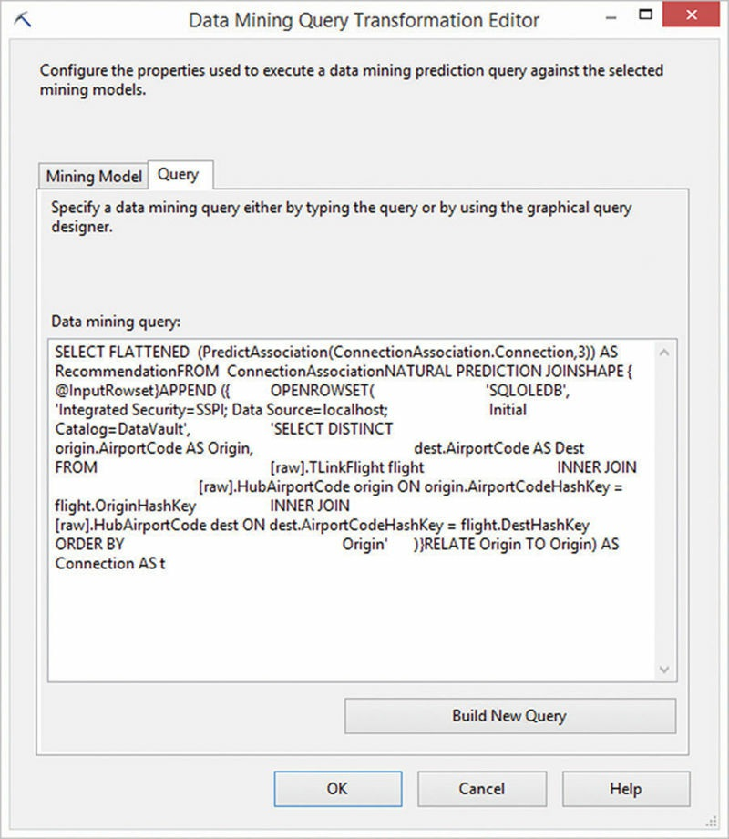
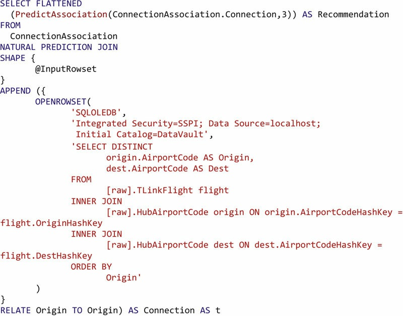
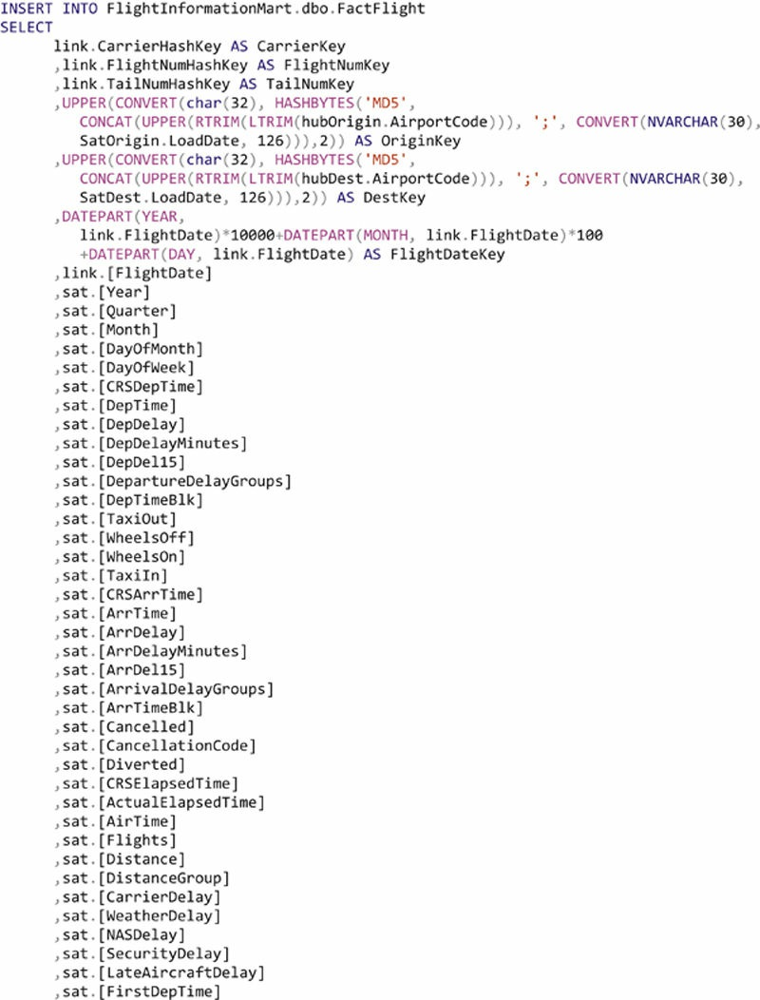
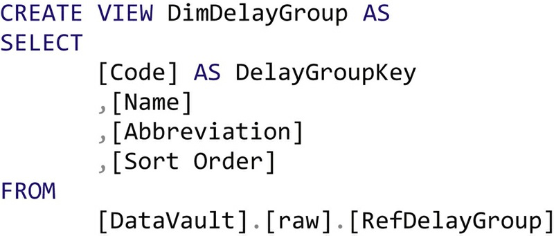

# Loading the Dimensional Information Mart(843-921)

## Abstract
This chapter demonstrates how to populate the `dimensional information mart` with data from the `Data Vault` and the `Business Vault`. It shows how to deal with `common issues` and how to create common `Business Vault entities`. The authors cover issues such as **loading** `slowly changing dimensions`, `fact tables` and aggregated fact tables. They explain the advantages of virtualization and how to take advantage of `point-in-time` and `bridge` tables when providing the `information mart`. The chapter includes some tips and tricks for providing temporal dimensions and performing `data cleansing` using PIT tables. It also covers how to deal with `reference data` when loading the `dimensional information mart` and ends with a discussion on the use of `hash keys` in the `dimensional model`. 

### Keywords

```
Dimensional information mart
business vault
data vault
fact tables
virtualization
point-in-time
bridge tables
```

Once the `raw data` has been loaded from the `operational source systems` into the `Raw Data Vault`, the next step is to process the `raw data` and load the results from this processing into the information marts. This chapter covers both steps.


## 14.1. Using the `Business Vault` as an Intermediate to the `Information Mart`


The `Business Vault` serves as an intermediate between the `Raw Data Vault` and `information marts`. By doing so, it stores `intermediate results` from `processed (soft) business rules` that are stored for reusability. The next sections provide examples for `implementing reusable business logic` and `storing the results` for later usage when loading one or multiple information marts.

### 14.1.1. Computed Satellite
`Computed satellites` are one of the artifacts in the `Data Vault architecture` to implement soft `business rules`. They are also used a lot for data quality cleansing, as described in the next chapter.


In many cases, `computed satellites` are provided in a `virtual manner`, using `SQL views`. The following DDL creates a `computed satellite` that hangs off `HubAirport` and provides the `cultural region` of the airport’s location:

>
>
>

The example satellite is based on an already `existing satellite` in the `Raw Data Vault` and introduces a computed attribute `CulturalRegion` based on the airport’s state [1]. Essentially, this `computed attribute` is based on a mapping between the `state abbreviation` and a `hard-coded mapping rule`. **Note that** there are **`better options`** to implement such mapping: the use of `analytical master data` allows the business user to take control over this mapping and change it without IT involvement if necessary.

<u>Another consideration</u> is the use of the `record source` attribute. Because the `computed satellite` has changed the data to some extent, the `record source` is not the `original source system` anymore. Instead, <u>the identifier of the `soft business rule` in the `meta mart` is used because the computed satellite implements the soft business rule.</u> To some extent, the data was generated by the soft business rule and not by the source system (however, the generation is based on the data from the source system). Using the **`soft rule identifiers`** is only one option for the record source. Chapter 4, Data Vault 2.0 Modeling, has already stated that the record source attribute is an attribute that serves a `debugging purpose`. The IT organization should use it in the best manner that serves this purpose. `Another choice` would be to set the record source to `“SYSTEM”` or leave the `original record source` value. Throughout the book, we will set a `soft business rule identifier` whenever data was `changed only slightly`. If data was `only filtered`, we’ll leave the `original` record source (because data values haven’t changed).


There are multiple **advantages** of implementing soft business rules <u>using virtualized computed satellites</u>:


1.  **The implementation is simple and comprehensible**: usually, for each soft business rule definition, there should be an implementation. By using virtual satellites, this implementation is very compact. The alternative is to use a more complex ETL process, especially if the business rule is too complex to be covered in a SQL statement.
1.  **Quick development**: developing a SQL view is certainly faster than developing an ETL process with similar functionality (however, it might depend on the tools used).
1.  **Quick deployment**: it is also often faster to deploy a new or modified SQL view than deploying ETL processes. These advantages are especially helpful when developing the data warehouse using the agile Data Vault 2.0 methodology. 


However, there are also some disadvantages: 
1.  **Limited complexity**: if the soft business rule definition requires a too complex implementation, it might be required to split the implementation into multiple computed satellites (or other entities in the Business Vault) or implement the soft business rule using an ETL tools such as SSIS.
1.  **Performance**: while virtualization works well in many cases, some soft business rules require too much computing power, for example because many calculations are required or many joins are involved. In this case, it might be better to materialize the computed satellite by using ETL tools.

Computed satellites are covered more extensively in Chapter 13, Implementing Data Quality, when they are used for more complex data quality cleansing operations.


### 14.1.2. Building an Exploration Link
In some cases, however, `virtualization` is not an option. This is the case if `external tools` are involved, for example data **`mining tools`** such as the data mining extensions within SQL Server Analysis Services or another external <u>*tool that produces output that is calculated*</u> based on the raw data and not sourced directly from the source system (such as the output from Data Quality Services, which is covered in the next chapter).


An `exploration link` is such an example. The entity, the definition of which is described in detail in Chapter 5, Intermediate Data Vault Modeling, is used to store links that are artificially **generated** and **not found** in the `source system`. One way to implement such `exploration links` is by <u>**using an association rule algorithm**</u>, such as Apriori or FP Growth. `Microsoft SQL Server` provides such an algorithm in the Data Mining extension of SQL Server Analysis Services.


The following example implements and uses a `data mining model` that provides airlines with information about frequent connections between airports. The main answer provided by this model is: **<u>Which airport destinations should be provided given the current connections offered by my airline</u>**?


The goal of this example is **<u>to provide new destinations that fit the current offerings of the airline</u>**. The suggestions are based on the offerings of all airlines. However, the data mining example in this chapter is far from being completely realistic:
1. No data cleansing has been performed
1. The loaded data in this chapter might be incomplete and not all patterns are covered
1. Trends in the data set are not accounted for
1. Errors might exist in the following code and the setup of the algorithm


In the end, the example has been developed quickly to show <u>how to use a data mining model to populate an exploration link and not how to provide such predictions</u>. Keep this in mind when using the model.


In order to use the example from this section, it is required to **create** a new `Analysis Server database` on the data warehouse infrastructure and to modify two **configuration** settings (Figure 14.1).


>FIGURE 14.1  Analysis server properties.
>
>

Open the properties dialog of the `Analysis Server database` using the `context menu` of the database and `General tab`. Make sure to check the option show advanced (all) properties, because some of the options that need to be modified are hidden by default.

The first setting that needs to be set is the `Data Mining \ AllowAdHocOpenRowsetQueries` to make sure that the **model can be loaded directly from a source entity in the Raw  Data Vault**. The other option is to set up the providers that can be used in such an open rowset query by setting the Data Mining \ AllowedProvidersInOpenRowset to “sqloledb,MSDataShape” which **enables** both data providers.


Once these configuration options are modified, it is possible to **create and train a data mining model** on the server without using SSIS. Without modifying these settings, model training requires loading the data using SSIS or another tool, and using the model for populating the exploration link becomes more complex as well.


Open a new `DMX query` in `Microsoft SQL Server Management Studio`. Enter the following statement to create a new `data mining model` using Microsoft’s implementation of an `association rule algorithm`: 

>


This statement will create the model in the `SQL Server Analysis Services database`. **<u>The model will predict the destinations that are applicable for a given origin of the carrier.</u>** The parameters `minimum support` and `minimum probability` influence the number of frequent patterns that are accepted into the model. In the end, a pattern (here: flight connection) is considered as frequent if it is in at least 2% of all flight connections in the source data (parameter minimum support). It will be included into the model if the pattern is able to predict a destination airport with at least 40% probability (parameter minimum probability) [2].

Once the model has been created, it needs to be **trained** using the `existing connections of all airlines` (this is actually realistic to do so, because all the data is available in public). The following `DMX statement` trains the model (finds frequent patterns) by inserting data into the data mining model:

> 


Without going too much into detail, this command loads the data from the existing no-history link TLinkFlight in the Raw Data Vault. These connections are used to train the model.


After these two statements have been executed, the model is ready to use. It has found frequent patterns (flight connections). The next step is to create a SSIS data flow that uses these frequent patterns to predict additional destination airports for a given pair of carrier and origin airport (“if you are a carrier that operates out of X, you might be interested in offering flight connections to Y, based on the frequent patterns found”).


Create a new data flow and insert an OLE DB source to the data flow. The data flow has to load all carrier and origin airport combinations from the Raw Data Vault source. Open the editor for the OLE DB source (Figure 14.2).


>FIGURE 14.2  OLE DB source editor for the data mining source.
>
>


Enter the following SQL statement as SQL command text:

> 


This statement loads all combinations from the same no-history link in the Raw Data Vault. However, it doesn’t take the current destination airports into account, because we’re interested in retrieving additional destinations, currently not served by the carrier from this origin airport.


Add a Data Mining Query task to the data flow and connect it to the OLE DB source. Open the editor and create a new connection using the New button. The dialog is shown in Figure 14.3.

>FIGURE 14.3  Add Analysis Services connection manager.
>
>


Connect to the Analysis Services database where the data mining model was created before. Close the dialog and select the mining structure in the data mining query transformation editor (Figure 14.4).


>FIGURE 14.4  Data mining query transformation editor.
>
>


Make sure that the mining structure ConnectionAssociation_Structure and the mining model ConnectionAssociation are selected and switch to the query tab (Figure 14.5).


>FIGURE 14.5  Editing the data mining query in the data mining query transformation editor.
>
>


This statement loads all the connections of the carrier into the model and retrieves recommendations for additional flight destination for the currently offered set of flights. Enter the following SQL statement into the data mining query text box:

>


This statement basically provides the connections of the current carrier in @InputRowset to the trained model and asks for up to three recommended destinations based on the current connections of the carrier. For each carrier and origin, the data mining task returns the top three recommended destinations that the carrier should consider for the current origin airport. The recommendations are provided as records in the data flow.


Once the recommendations are in the data flow, the business keys should be hashed. The model was created with the business keys (instead of the hash keys) because the link is easier to produce afterwards: the primary hash key is calculated from the business key of the carrier, the origin airport and the recommended airport.


The hashing approach follows the approach outlined in Chapter 11, Data Extraction: first, the columns are concatenated using a derived column transformation (Figure 14.6).


>FIGURE 14.6  Derived column transformation editor.
>
>

The derived columns are created using the provided expressions (Table 14.1).

>Table 14.1 Derived Columns and Their Expressions
>
>


Note the record source attribute, which is set to the identifier of the soft rule that defines the requirements and the process of the data mining task in the meta mart. The load date is retrieved from the SSIS variable dLoadDate in the User namespace. By doing so, all records in the target will use the same load date, which makes it easier to group the records in the target.


Because the hash key was used in the data mining model, the keys from the source data and the business key for the predicted destination airport are readily available for the hash key computation in the next step. Drag a script transformation to the data flow and connect it to the output path of the previous step (Figure 14.7).


>FIGURE 14.7  Script transformation editor.
>
>


This step also follows the process outlined in Chapter 11. Check all columns ending with HubBK or LinkBK as inputs to the script component. Copy the hashing script from Chapter 11 and compile the script. Create corresponding output columns on the next page, shown in Figure 14.8.


>FIGURE 14.8  Input and output columns in the script transformation editor.
>
>


Ensure that each input column has a corresponding output column. Make sure that the data type is set to string and the length of the column is set to 32 characters (if MD5 hash keys are used). Close the script transformation editor and drag an OLE DB destination to the data flow. After connecting it to the existing components, open the editor (Figure 14.9).

>FIGURE 14.9  Setting up the OLE DB destination connection for exploration link.
>
>


The data is loaded into an exploration link table in the Business Vault. Create the table using the following DDL script: 

>


Select the table in the dialog and make sure that keep nulls and table lock options are selected. Switch to the mappings page (Figure 14.10).

>FIGURE 14.10  Mapping columns in the OLE DB destination editor.
>
>


Make sure that each destination column has a corresponding source column and close the dialog. The data flow is completed and shown in Figure 14.11.

>FIGURE 14.11  Data flow for loading an exploration link.
>
>

Because the frequent patterns in the model change over time, it is advisable to run this data flow frequently, for example once a week or month. Before running this data flow, the best choice is to truncate the target table first. In many cases, the patterns, if they change, are too different to run an update on the data. Using this approach is absolutely valid from an auditing perspective: the Business Vault may not be auditable and its tables can be reloaded at any point in time.


## 14.2. Materializing the Information Mart
The previous examples have shown how to implement the `Business Vault`. The ultimate goal, however, is to build and populate the `information marts` that will be used by the `business users`. The Business Vault plays only an intermediate step towards this goal, as outlined as in section 14.1. 

### 14.2.1. Loading Type 1 Dimensions
The first example creates and loads a Type 1 dimension, which provides no history of the dimension members but only the most current version of the descriptive data. In many cases, this involves all members ever loaded to the data warehouse, because historical data should be analyzed. For example, if a product has reached its end of line, it is still available in the product dimension because there might be historical data that depends on this now-outdated record. Or the product may be still active in the operational processes, for example in warranty requests from customers. Therefore, dimension members usually stay and are filtered later in the presentation layer, when not used by a specific data set.


The following DDL statement is used to create the dimension table in the information mart:

>


Note that `AirportCodeKey` identifies the rows of the dimension table, which is the hash key from the Data Vault 2.0 model. Using the hash key instead of a sequence number improves the provision of dimension tables because the hash key is already available in the Data Vault 2.0 model. This is described in more detail in Chapter 7, Dimensional Modeling.


In order to load this table for a Type 1 dimension, a simple INSERT statement in combination with a TRUNCATE TABLE statement is sufficient:

>


The table is first truncated and then completely reloaded in order to avoid dealing with updates. Another option is to use a MERGE statement if there are not many members in the dimension.


While this approach is a naïve approach, it demonstrates an advantage and characteristic of the Data Vault 2.0 model: many if not most dimensions are built by querying the data from a hub and joining descriptive data from one or more satellites. Each satellite might come from different source systems and it is part of the business logic in the dimension load to decide which satellite is representing the leading system if multiple systems provide contradicting raw data. Since only the latest version of the descriptive data should be included in Type 1 dimensions, a WHERE condition is applied on the satellite data to select only the active (most current) records. If the dimension should contain only members that are not deleted in the source system, the effectivity satellite on the hub should be taken into consideration by joining it in the query and adding a filter to remove deleted members.


However, the sources for dimensions are not limited to hubs and satellites. In fact, the data can come from multiple source entities in the Data Vault 2.0 model, including links. Therefore, when building dimension tables in the information mart, the first step is to identify the table (or set of tables) that provides the desired grain for the destination table. From our experience, the grain for dimension tables comes from a hub table in 80% of the cases. Other typical sources for building dimensions are same-as links because they are the outcome of de- duplication efforts. This will be demonstrated in the next chapter.


The complexity of the statement is due to the COALESCE statements that deal with potential airports that are only described in one satellite. In such a case, there is no descriptive data available from all satellites and the columns are NULL. This is also the reason why a LEFT JOIN was used, which is not the most frequently performed join operation in most databases, including Microsoft SQL Server. Section 14.3 explains how to use PIT tables in conjunction with ghost records to achieve INNER JOINs with equi-join conditions.

### 14.2.2. Loading Type 2 Dimensions


Joining the data becomes a bigger problem when dealing with Type 2 dimensions. In this case, multiple if not all versions of the descriptive data from the satellites should be sourced into the target. Before looking at the loading statement, review the DDL statement for creating a Type 2 dimension table that can be used in the dimensional model:

>
>
>


The table is an extended version of the same table used in the previous section. In Type 2 dimensions, the key column is not directly sourced from the hash key column in the Raw Data Vault 2.0 hub table. Instead, it is a value that is calculated from the business key and a date (for example the load date or a snapshot date introduced a little later). This way, every row gets a unique hash key assigned, which is required for identifying the record in the dimension.


Because the key by itself is not from the Raw Data Vault, additional attributes are required to identify not only the member (using AirportCodeHashKey) but also the right version (using LoadDate) when loading the fact table. Once both table types, the facts and the dimensions, are loaded, the key is used for joining the data.


Both the hash key and load date columns are also used when loading the Type 2 dimension table using the following, incremental approach:

>
>
>


New records from the Raw Data Vault source are loaded into the target, based on the hash key and the load date. Because the target is a Type 2 dimension table, all versions from the Raw Data Vault that are not currently in the destination should be loaded into the dimension table. The hub that provided the grain in the last section is not a good candidate for the FROM clause because it provides the wrong grain. Instead, the versions of descriptive data are stored in the satellites – actually, spread over all satellite tables that depend on the hub. Therefore, the grain for this statement is provided by a subquery in the FROM statement that returns the potential load date and hash key combinations. For each combination that is not yet in the target, which is checked by the WHERE condition, the corresponding descriptive data is sourced from each satellite using a LEFT OUTER JOIN. While the processing of the descriptive data in the SELECT clause is similar to the statement for Type 1 dimension loads in the previous section, the join condition is much more complex. This is true not only from a reader’s perspective, but also from the perspective of the SQL optimizer.


To achieve higher performance of Type 2 dimension loads, an equi-join is the preferred solution. However, if performance is not an issue because there are not many joins involved in the actual loading statement or if the number of records is small, this approach might work very well (at least for the majority of dimension tables). However, note that, due to independent changes to the satellites and the naïve approach implemented for selecting the descriptive data from the source, it might happen that the Type 2 dimension provides two unchanged entries, for example if the secondary satellite (in the previous example, the source airport) changes but the primary satellite (destination airport) overrides this change. Depending on the technology used for the information mart (or dependent OLAP cubes), this might pose a problem.


To complete the loading process, the load end date needs to be maintained. This can be done using an end-dating SQL statement, similar to the one for end-dating Data Vault 2.0 satellite tables:


>

In order to maintain the performance of the statement, it should be applied per hash key in the dimension. Otherwise, the scalability of the statement could be limited if the number of records in the satellite table is large. 

### 14.2.3. Loading Fact Tables
The following DDL statement creates a fact table with many columns and references to dimension tables:

>
>
>


The fact table itself is not identified by a key because no other tables depend on it, as described in Chapter 7. Instead, the primary key is based on the hash values of the dimension tables including the flight date key because they are defining the grain of the fact table.


Note that the FlightDateKey is an integer value for better readability of the date value. This approach follows the standard approach for building and using date dimensions (covered in the next chapter).


The following statement populates the data into the fact table:

>
>
>


The facts are loaded from the nonhistorized link TLinkFlights. Each Type 2 dimension that is used by the target requires the recalculation of the key, which is based on the business key and the load date in the above example with standard satellites. The key is then stored in the fact table to support later joins between the fact table and dimension tables. Section 14.3.2 introduces a method for reusing such calculations. Because the business key is required, the hub has to be joined.


The complex calculation is not necessary when using Type 1 dimensions because the key is the same as the hash key in the Raw Data Vault. Note the INNER JOIN, which requires that the dimension table provide a record, even in the NULL case. For this reason, the dimension table should include an unknown record.


Another approach to avoid the complex calculation is to retrieve the key from the dimension in the information mart. However, this would add additional and unnecessary dependencies to the loading processes, which should be avoided in order to improve the parallelization of the loading processes that load the information marts.


Joining the record from the satellite is based on the hash key from the hub. However, the hash key by itself is not sufficient for the join. Instead, the LoadDate and LoadEndDate from the satellite are used to find the active record for the fact record.


The WHERE clause is required to support incremental loading and includes all elements of the alternate key from the target table, which is based on the elements of the source table, in this case. It also includes the transaction date (FlightDate). In other cases, the transaction ID would be used because it is part of the alternate key. If a record with this combination is not found in the target, it is loaded from the source to the target. Note that the key for the originating and destination airports are recalculated again in order to support the condition. Again, section 14.3.2 introduces a method for reusing such calculations and avoiding this recalculation.


Additional descriptive data that is not included in the source link is sourced from the no-history satellite TSatFlight which hangs off TLinkFlight. This satellite is joined on the hash key only because there should be only one record per transaction, which eases the integration of both data sources in this loading statement.


The previously mentioned unknown record can be populated using the following statement into the dimension tables:


>

This unknown record is required due to the use of the REPLICATE(’0’, 32) statement when loading the fact table. If this record is missing, the integrity of the information mart is compromised.


### 14.2.4. Loading Aggregated Fact Tables


It is also possible to change the grain when loading the data from the Data Vault model into the information mart. For example, the following DDL creates a FactConnection fact table that removes carrier and tail number references and aggregates the measures of the source table:

>


In order to incrementally load the data into the new aggregated fact table, the following statement is executed once a day:

>
>
>


This approach only works if the data is grouped over the date, among other dimensions (sourced from the hubs). If the data is aggregated on other dimensions or if the data is loaded multiple times over the day, this statement would fail to update the existing information in the target. However, there are advanced concepts that allow such incremental loads of aggregated fact tables, but this is out of the scope of this book.


## 14.3. Leveraging PIT and Bridge Tables for Virtualization

The previous sections have shown some examples for providing materialized dimension and fact tables. Some of them are based on naïve approaches that require truncating the target first.


The major drawback of such materialization is that the data needs to be moved in order to support the materialization. However, it provides optimal performance when directly querying the relational information mart. Consider the following virtual view that provides an aggregated fact “table” which is based on the incremental loading of aggregated fact data in section 14.2.4:

>
>
>


### 14.3.1. Factors that Affect Performance of Virtualized Facts


Because the produced fact “table” is based on a virtual view, the aggregation has to occur whenever data is sourced from the fact table. Depending on the number of records in the source table, these calculations can be resource intensive and hinder the deployment of virtualized fact tables. Also joining the data might become a problem if complex or a larger number of joins is required. Major factors that affect the performance are


• Joins, which might require complex join conditions
• Aggregations and grain changes, which require resource intensive computations to aggregate or recompute the data.


Once the source tables have been joined, selecting the measures that should be included in the virtualized fact table is not very resource intensive anymore and allows the customization of fact data for different information marts.


A similar problem exists if dimension tables should be provided in a virtual manner: instead of materializing the data in the destination, only a virtual view is provided that sources the data directly from the hub and the involved satellites:

>
>
>


The above view for a Type 1 dimension is based on a SELECT statement that sources its grain from the hub and joins descriptive data from only one satellite (an easy case). The unknown record is also provided in a virtual manner by adding it using a UNION ALL clause. 

There are multiple problems with this approach: first, the source query requires joins, which have to be resolved by the SQL optimizer. The joins also require complex conditions because the dependent satellites don’t provide data for each snapshot date but only when changes have been detected in the source system. In addition, business logic is required to implement the soft business rule, for example to select between potentially contradicting raw data from multiple source systems or to recalculate raw data into the desired format. If multiple targets should be supported, we see that the joins are always the same and, in many cases, the most resource-intensive operations. Business logic depends on the target that should be produced and the specific requirements of the business users. In many cases, the soft business rule is not as resource intensive compared to the join operations.


### 14.3.2. Advantages of Virtualization
Despite the problems with providing virtualized dimension and fact tables, there are several advantages that drive the need for virtualization in the data warehouse, especially when providing multiple information marts [3]:

• Simplified solution: providing facts and dimensions using virtualized approaches is more agile and responsive to user requests than ETL- based integration. These approaches require no data moving or data materialization and are far easier to design and develop.
• Agile development process: because it is easy to create and modify virtual facts and dimensions, it is possible to use such an approach in an agile development process that provides the final solution in multiple iterations. This requires that the cost to modify an existing solution is low.
• Ease of change: because the cost to modify an existing virtualized fact or dimension table is low, it is also possible to react on changes from the business that occur later in the lifetime of the data warehouse, for example if new products are introduced or the market changes and requires new business logic.
• Improved developer productivity: instead of relying on complex ETL- based solutions that are hard to develop, test, and deploy and are prone to changes once deployed, developers can quickly build solutions and demonstrate them to the end-user. If they have produced the wrong solution, they will fail fast, and have the time to start from scratch without generating too much cost.
• Lower total cost of ownership (TCO): in addition to lower development costs (due to higher developer productivity), organizations save storage costs because data doesn’t need to be materialized, which consumes disk space. While materializing data, for example using index views or using ETL, improves query performance, it often introduces data inconsistencies that increase the overall costs of the data warehouse.


To take advantage of these characteristics of virtualized information delivery, the Data Vault 2.0 model uses PIT and bridge tables to maintain the desired performance requirements by the business users, despite the fact that joins are required to collect the data, grain shifts occur and aggregations and other resource-intensive computations are performed when delivering the information.


The next sections demonstrate how to leverage these standard entities to provide virtualized fact and dimension tables, customizable for multiple information marts with different requirements, while maintaining superior query performance.


### 14.3.3. Loading PIT Tables
The last section has introduced two activities with delivering dimension tables:

1. Joining the data from multiple satellites: the data that is required for information delivery is stored in multiple satellites, often dependent on the same hub.
2. Implementing the business logic: a specific dimension for an information mart is based on individual selection of descriptive data from specific satellites and the application of business logic to this data. The actual definition of the business logic depends on the actual target and is user driven (expressed by user requirements).


The first activity is the most resource-intensive operation in the majority of cases. However, it is also possible to separate both activities in an easy way. This separation can be used to reuse the joins by materializing the intermediate result and providing it in a way that optimizes the customization for different information mart targets. This is where the PIT table comes into play.


As outlined in Chapter 6, Advanced Data Vault Modeling, the PIT table is like an index used by the query and provides information about the active satellite entries per snapshot date. The goal is to materialize as much of the join logic as possible and end up with an equi-join only. This join type is the most performant version of joining on most (if not all) relational database servers, including Microsoft SQL Server. 

In order to maximize the performance of the PIT table while maintaining low storage requirements, one and only one ghost record is required in each satellite used by the PIT table. This ghost record is used when no record is active in the referenced satellite and serves as the unknown or NULL case. By using the ghost record, it is possible to avoid NULL checks in general, because the join condition will always point to an active record in the satellite table: either an actual record which is active at the given snapshot date or the ghost record.


The following statement is used to create the ghost record in the satellite:

>


This statement is usually executed after the satellite table has been created using the CREATE TABLE DDL statement to make sure that each satellite has a ghost record. Because the record is calculated and not sourced from a source system, the record source has been set to “SYSTEM” and the record is not part of the auditable raw data from the source system. Therefore, the ghost record can be modified at any time, for example when new attributes are added to the satellite table. Note that the hash key and the hash diff values are set to 32 zero values and the load date set to the first day and timestamp of all times, while the load end date is set to the last date and timestamp of all times. All other descriptive columns are set to default values that should be shown if no better data is available.


The PIT table is usually loaded in an incremental approach, based on the snapshot date. Each ETL load inserts the data that is missing for the given snapshot date. The following DDL statement creates the PIT table in the Business Vault:

>
>
>


The primary key AirportKey is of a hash value derived from the business key of the hub HubAirportCode and the snapshot date, which is a rolling date, controlled by the ETL process. The alternate key of the PIT table is the AirportCodeHashKey from the parent hub and the snapshot date. All other columns are pointing to one satellite entry, identified by a hash key and a load date. There are two additional columns per referenced satellite. In this case, two satellites have been referenced; therefore, four additional columns are required. If satellites are added to the hub, the PIT has to be modified as part of the process.


There are multiple options to load the PIT table. One is to use an Execute SQL Task in the control flow that is executed whenever the Business Vault is populated. This is usually done just after the loading procedures for all satellites in the Raw Data Vault and in the Business Vault are completed. The Business Vault satellites are required, because they can be added to the PIT as well, which makes sense if they are load- date oriented and not based on a snapshot date.


Note that implementing this approach using only SQL is another option and uses similar statements to those used in the following description.


To implement a task to load a PIT table in SSIS, add an Execute SQL Task to the control flow of your SSIS package. Open the task editor (Figure 14.12). 

>FIGURE 14.12  Execute SQL task editor for PIT table.
>
>


Because the Business Vault is part of the EDW layer, set the connection of the Execute SQL Task to the DataVault connection manager used in other chapters. Open the SQL query editor by clicking the ellipse button in the properties value column. The dialog in Figure 14.13 is shown.


>FIGURE 14.13  Enter SQL query dialog for PIT table.
>
>

The following statement is used for loading one snapshot to the PIT. Set the query to the following SQL text:

> 
>
> 


Similar to other statements in this chapter, the BETWEEN statement assumes that the load date and the load end date are not overlapping (the load end date of the previous record is the load date minus one nanosecond of the next record). The goal is to load the data from this statement into a target PIT table. This key value in the primary key column (here: AirportKey) is later used in the dimensional tables of the dependent information marts.


The source statement generates a record per hash key in the parent hub and the snapshot date (which is set by a variable in the statement and set by SSIS). Due to the WHERE condition, the approach is recoverable and could be used to ensure that new business keys are also populated into the target for past snapshot dates to ensure equi-joins at all points in time. This is optional and requires running past snapshot dates again in SSIS.


The snapshot date is stored in a variable dSnapshotDate in the SSIS control flow. In order to bind the variable to the parameters in this SQL statement, close the SQL query editor and switch to the parameter mapping page of the execute SQL task editor. The page in Figure 14.14 is shown.


>FIGURE 14.14  Parameter mapping in execute SQL task editor for the PIT table.
>
>


Because the snapshot date is used multiple times in the SQL statement, and the parameters are not named in OLE DB statements, the variable has to be bound multiple times. For each question mark, add a parameter mapping to the list and select the dSnapshotDate variable in the User namespace. Select the DATE data type and set each parameter to one instance of the parameter reference (from 0 to 4). Leave the parameter size as is.


Set the variable dSnapshotDate to a desired value (usually a date with a time of 00:00:00.000) and run the task. It is also possible to execute the task in a for loop container in order to insert multiple snapshot dates, for example during an initial load.


In some cases, the dimension tables should not include one entry per snapshot date but only when changes in the descriptive data occur. This is the actual case for Type 2 dimensions of SSAS OLAP cubes. In this case, it is possible to modify the WHERE condition of the above statement and load only changes into the PIT table. The load date of the referenced satellites is used for the change detection. This is a sufficient approach because the load date changes per change that is added to the satellite.


### 14.3.4. Creating Virtualized Dimensions
In order to implement the Type 2 dimension introduced in section 14.2.2 by using the PIT table from the previous section, the following T-SQL view is created:

>


This view implements the same business logic as in the original example: it provides a list of airports with descriptive information from the destination airport source or, if this primary source doesn’t provide any data at that snapshot date, it alternatively loads descriptive data from the origin airport satellite.


The biggest difference from the original example is that the joins have changed from LEFT OUTER JOINs to INNER JOINs. In addition, all joins are equi-joins to further increase the performance of the join operations. Another advantage is that the query is based on the PIT table, instead of collecting load dates from multiple satellites, which provides further performance improvements. It joins the airport code hub, in order to retrieve the business key, which is stored in the hub only. It also joins both satellites that provide the descriptive data.


Note that the business logic is problematic, because the checks are based on individual fields. A better approach would check whether the leading satellite provides any useful data by performing a check on the referenced hash key in the PIT table:

>
>
>


If the referenced hash key is the ghost record, the data is retrieved from the other satellite. Implementing this change is relatively cheap because all the data is provided by virtual means while meeting the performance requirements of the business users.


The very same PIT table can be used to produce other virtual dimensions that implement different business logic. For example, the following view creates a virtual dimension that provides descriptive information from the destination airport source only:

>


The query statement only joins the satellites that are actually required for the purpose of the dimension. In this example, there is an additional filter on airports from California, which is part of the business rule implemented in this view.

The examples presented in this section should have given you an impression of the advantages that are achieved by separating the join operation from the rest of the business logic. Similar concepts are applied to fact tables in the following sections.


### 14.3.5. Loading Bridge Tables
The purpose of a bridge table is to ensure that the performance requirements of business users are met for virtual fact tables. The performance of fact tables, when sourced from a Data Vault 2.0 model, depends on three important factors:

1. Joins between links: because the desired grain is often not found in only one Data Vault 2.0 link, multiple links are joined in order to achieve the right grain. A prejoining improves the performance of this factor.
2. Required aggregations and otherwise computed values: other issues that limit the performance of virtual fact tables are required aggregations that have to be performed on the raw data, often involving a grain shift in addition. In other cases, measures are computed from raw data and added to the fact table. The latter might require complex business logic for the calculation.
3. Applying additional customization: a specific fact table includes a number of dimensions and measures that have to be derived from the raw data. The actual number and characteristic is defined by the individual business specification.


Joining and aggregating the data and running complex computational logic are the most resource-intensive operations of these activities. On the other hand, the results from these activities are often reusable for multiple targets (fact tables). Therefore, an approach that materializes the first two activities and separates it from the customization provides an advantage in the information delivery of fact tables, just as the PIT table does for dimension tables. Bridge tables are used for exactly this purpose: to provide the materialized basis for virtual fact tables that meet the performance requirements of the business users.


The following DDL statement creates a simple and minimal bridge table in the Business Vault schema of the EDW:

>
>
>


The bridge table performs only a prejoining of the nonhistorized links TLinkFlight and TDiversionFlight, which is required to produce a later fact table that is used to analyze the flight diversions and should include information from the planned flight.


The grain defines the primary key of the bridge table. It is also used by the next SQL statement that incrementally loads the bridge table.


Note that the bridge table implements some indices on the hash keys in order to improve the performance of joins between the bridge table and hubs or satellites. This is necessary for those columns, which are heavily used by ad-hoc queries, because foreign keys are not implemented in the EDW and therefore the implied indices are missing from the table.


In order to load the bridge, the following incremental INSERT statement is used within SSIS:

>


This example implements a bridge table based on nonhistorized links. However, the loading procedures for standard Data Vault 2.0 links are the same. This bridge joins both links together and avoids a Cartesian product by using appropriate conditions in the WHERE clause. The bridge actually “bridges” two links and multiple hubs. However, the hubs are not joined at this time, because the business keys are not prejoined into the bridge by default. Only the hash key is added to the bridge table, but this key is already available in the link structures.


The sub-select statement in the WHERE clause is required to support incremental loading and is based on the primary key of the bridge table.


The load date from the source is calculated to the next snapshot date. This is easy if the snapshot date follows a regular pattern because it can be calculated in this case. If the snapshot date follows a different pattern, a lookup into a reference table for the snapshots of the target might be required. Having calculated the snapshot date makes it easier when retrieving information from or via PIT tables in the virtual fact table, for example to retrieve additional descriptive information from dependent satellites of the PIT table. If there is a need for the (technical) load date in the target, it is possible to add it to the bridge in addition. But in most cases, other dates provide more business value, for example the flight date in our example.


Note that the calculation might differ in your case. The one provided in the previous statement requires daily snapshot dates and ensures that load dates without time are mapped to the same snapshot date.


However, the goal of the bridge table is to provide the basis for virtual fact tables with superior performance. If the overall query performance is improved by prejoining information from hubs and their dependent satellites, it should be done, for example by joining the business keys from hubs into the bridge table. However, keep in mind that the performance of the bridge table also drops if the table becomes too wide. In the end, it requires some experimentation to find the right mixes for every individual bridge table.


More performance gains are achieved by ensuring that the bridge table is in the same grain as the target fact table. For example, the following bridge table changes the grain of the previous bridge table:

>
>
>


The grain was changed by removing a hub reference from the bridge table. This is also called a “grain shift” and there are two options for it:
• Removing hub references: reduces the granularity, for example, by using a GROUP BY clause in the INSERT statement.
• Adding hub references: increases the granularity, for example by joining additional links to the current set of used links.


The table is loaded with the following incremental statement that is typically used from an Execute SQL task in SSIS again:

>
>
>


The INSERT statement implements the grain shift by removing hub references (to HubCarrier, HubTailNumber and HubFlightNumber) and applying a GROUP BY clause on the data. It further improves the performance of virtualized fact tables by adding the results of required aggregations to the materialized bridge. Because the aggregations represent business logic that is implemented by this bridge, the record source is set to a fixed value in the load statement. The snapshot date was not calculated from the load date because it is not sufficient to do so (due to the aggregation). Instead, the flight date was used as a snapshot date, which is more appropriate for the target information mart.


These bridge tables can now be used as the basis to provide virtual fact tables.


### 14.3.6. Creating Virtualized Facts
The virtualized fact tables implement the additional customization that is required by individual fact tables in various information marts and can differ in the representation of the information. However, the grain of fact tables that depend on the same bridge table should be the same. If the grain differs between the virtual fact table and the bridge table, a new bridge should be introduced in the Business Vault to ensure that the performance meets the requirements of the business users.


The following DDL statement creates a virtual fact entity based on BrDiversionFlight:

>
>
>


At first glance, the statement looks large. But for the SQL optimizer, most activities required to execute this statement are relatively cheap (performance-wise). The statement joins measures from the nonhistorized satellite TSatFlight. This join, as all the other joins in this statement, is based on an inner join with an equi-join condition. If a business key is required in the fact table (for example, because not all dimensions are provided via dimension tables in this example), the hub is joined on the hash key only in order to retrieve the business key or composite key from the hub. This statement concatenates the composite key from hub HubFlightNum into a format that the user is familiar with. This business logic could be extended to serve other requirements by the end-user, which might differ per information mart or fact table.


Note that the flight date could be easily sourced from the bridge table source. This statement joins TLinkFlight for demonstrative purposes: because the grain is the same, it is easily possible to join the original source of the bridge table in order to include additional or missing data into the fact table. In order to support such joins, the link hash key, in this example FlightHashKey, should be included.


If dimension tables should be provided for some dimensions, it is easy to retrieve the required key values for the dimension entry. This hash value comes from the PIT table. However, because the PIT table provides multiple snapshots for the same hash key, the equi-join condition for the PIT table is extended to include the snapshot date of the fact. This snapshot date was calculated from the technical load date and helps us to retrieve the appropriate entry in the PIT table. We could also use the PIT table to retrieve a load date for satellites included in the PIT table to retrieve additional descriptive data from dependent satellites:

>
>
>


In this example, the key value for the origin airport dimension is replaced by attributes directly joined into the fact table. However, the PIT is still used in order to retrieve the appropriate load date in the dependent satellite SatOriginAirportMod. Joining the satellite requires only INNER JOINs with equi-join condition, due to the available PIT table. Without the PIT, a more complex join would be required to find the appropriate delta record. It would involve a BETWEEN condition and a LEFT JOIN because it is not guaranteed that the satellite provides a record for the given snapshot date.


Another example implements a virtual fact table on the aggregated bridge BrConnection:

>


This table includes no business logic for the aggregations, because these operations were already performed when loading the bridge table. Because these aggregated measures are included in the bridge table, no additional data from the no-history link or satellite are required as well. In addition to the measures, this fact table includes the key values to dimension tables for origin airport and destination airport. Additional descriptive data could be joined from hubs and satellites if required for a specific target.


## 14.4. Implementing Temporal Dimensions
The examples from sections 14.2 and 14.3 have demonstrated how to provide Type 2 dimensions using joins between the hub table and dependent satellites or the PIT table and dependent satellites. All of these joins were based on the load date to find the record in the dependent satellite that is current for a given snapshot date. The load date was used because it provides information about the technical validity of a record in the history of the data: which data was current at a given point in time, from a technical perspective.


However, in some cases, business users don’t want to analyze the data from a technical perspective. Instead, they are interested in a temporal perspective that is based on the effectivity dates, defined by the business. These effectivity dates come in various ways, for example valid from and valid to dates and membership start and membership end dates. Chapter 5, Intermediate Data Vault Modeling, has shown how to store such effectivity dates in effectivity satellites, which are added to hubs and links to indicate if business keys in hubs are deleted in the source system or have become invalid, and the validity of relationships between business keys in Data Vault 2.0 links. These satellites also ensure that changes to these effectivity dates are tracked in an auditable manner.


In order to create Type 2 dimensions that reflect the temporal perspective, a special form of a PIT table can be used. The following table implements such a temporal PIT:

>


Notice that there is no difference in the structure between a standard PIT and a temporal PIT. However, instead of prejoining the data based on load date, the effectivity date or any other descriptive date is used when loading the temporal PIT table:

>
>
>


The join conditions are based on the currently active record from the satellite, as indicated by a load end date of NULL, and the snapshot date from the PIT between the valid from and valid to dates from the descriptive satellite (not an effectivity satellite). However, if the effectivity dates change in the raw data, the PIT needs to be updated for past records or records are deleted from the PIT and the above statement inserts the current view requested by the business. Updating the table will be costly from a performance standpoint. Instead, add a load date to the temporal PIT table and partition over it and remove old partitions whenever the current partition was successfully loaded. By doing so, the temporal PIT table is turned into a rolling history of joins.


In order to present the data to the business user, a similar view can be used as in section 14.3.3:

>
>
>


The only difference between the two views is the primary source of the fact table, which is the above temporal PIT table instead of the standard PIT. Other than that, the view definition is exactly as before. Therefore, it is also easy to use for power users who directly access the Data Vault 2.0 model, because they only need to change the PIT source in order to access a temporal view of the data instead of the technically historized view.


## 14.5. Implementing Data Quality Using PIT Tables
Another application of PIT tables is to use it for data cleansing purposes. In some (rare) cases, it might be appropriate to use a PIT table for master and duplicate resolution and other data cleansing activities. The following DDL creates just another version of the PIT table used before:

>


Again, the only difference between this PIT table and the ones used before is the name. The column definitions remain the same. However, the loading statement differs:

>


The preceding statement loads the DQ PIT but cleanses the data by setting the DestAirportHashKey and DestLoadDate to the ghost record in the case that the DestCityName is “Frisco, CA”. Similarly any other business logic could be applied when loading the DQ PIT table. The business logic in the dependent dimension view would automatically pick a record from an alternate satellite if the ghost record is found. The advantage of this approach is that it is transparent to the user: similarly to temporal dimensions, power users could just use the DQ PIT to source cleansed dimension data. On the other hand, the business logic is hidden in the loading procedure of the PIT table. A similar approach could be achieved by adding a computed satellite with cleansed data that could also be added to the standard (or temporal) PIT table. If the power user wants to use cleansed information, this computed satellite is joined to the PIT table instead of the raw satellite.


However, this example shows the power of PIT tables (and similarly bridge tables) for delivering the data that is required by the business user.


## 14.6. Dealing with Reference Data

In many cases, reference codes are included in Raw Data Vault satellites. These codes vary from source system to source system but business users expect a conformed view on such codes in order to run analytical statements across source systems.


Instead of modifying the code in the Raw Data Vault satellite, which would compromise the auditability of the Raw Data Vault, the code from a specific source system is replaced or enriched by descriptive data from reference tables when the Business Vault or information marts are being built. The following DDL creates a simplified computed satellite in the Business Vault:

>


This computed satellite is directly based on the satellite TSatFlight in the Raw Data Vault. It is merely a selection of some columns without any filtering or computing of rows that only serves as the playground for the example in this section.


The next statement modifies this computed satellite by adding descriptive data from a reference table to the satellite:

>
>
>


The descriptive data is joined from the reference table RefDelayGroup, which is just a view on a master data table in MDS. The reference table is joined twice because it is used to describe two codes in the satellite (DepartureDelayGroups and ArrivalDelayGroups).


By doing so, the descriptive data is added to the computed satellite by adding some of the attributes from the joined reference table to the view. This approach is perfectly fine, especially for creating star schemas. Instead of joining the data in the computed satellite, it could also be joined when creating the dimension tables or fact tables.


However, it is also possible to create a dimension based on reference tables:

>


In this case, the code is used as the dimension key because it is defined as a unique value that never changes. Because of simplicity, the code is not hashed when creating dimension tables for reference data. Once the dimension table is defined, the dimension key is referenced by a fact table (using the code). It is also possible to reference the dimension from another dimension, creating a snow-flake schema.


In many cases, there are mapping tables that help to map between codes from individual source systems to conformed codes for the data warehouse. The easiest approach is to create a master data entity with the code column used for the conformed code and individual columns per source system code. There are also options if multiple codes from the source system need to be mapped to the same conformed code in the data warehouse.


## 14.7. About Hash Keys in the Information Mart
The information mart uses hash keys to define the relationships between facts and dimensions. Because the information mart is provided virtually, this presents no problem in most cases. However, the OLAP cubes are often materialized and storage might become an issue. In other cases, performance might be affected to some extent.


The following sections provide recommended solutions and best practices to deal with storage and performance bottlenecks that might be due to hash keys.


### 14.7.1. Advantages of Using Hash Keys in the Information Mart


The advantage of using hash keys in the information mart is the ease of use when sourcing the data. All other options require more complex solutions and loading processes. Chapter 15, Multidimensional Database, shows that the hash keys can be used when creating the multidimensional database without any problems from a structural perspective.


For Type 1 dimensions, the hash key from the hub is used to populate the key attribute in the dimension. If Type 2 dimensions should be provided, the key from the PIT table is used because it identifies each change in the PIT (and thus the dimension table) uniquely.


Using hash keys in the data warehouse, including in the dimensional model, is future-proof for all requirements regarding the volume, variety and velocity of data and thus the recommended approach for building information marts and multidimensional databases.


We truly believe that you should only deviate from this recommendation if you really need to.


### 14.7.2. Reduce the Number of Dimensions in Cube
If you have a performance or storage issue in your solution, our first recommendation is to review the number of dimensions in your information mart and dependent cubes. In most cases, it is possible to reduce the number of dimensions by providing multiple cubes that are more tailored for specific business cases. This way, the required storage is reduced per cube, which improves the overall performance of the solution while maintaining ease of development and use.

### 14.7.3. Use Fixed Binary Data Type for Hash Values


If you still have an issue after reducing the number of dimensions in your solution or if reducing the dimensions is not an option, you should consider storing the hash keys using a binary datatype (but not a BLOB, CLOB, TEXT, or LOB data type if you’re using other environments). For example, it is possible to store the result from the MD5 hash function in Microsoft SQL Server using a binary(16) column. Instead of storing it as a hexadecimal string, which requires 32 characters (thus 32 bytes), the hash value is stored in its binary format, requiring only 16 bytes.


The drawback of this solution is that some tools that are part of the BI stack of your organization might not support reading or writing to binary columns. This might become a problem if transparent access using views is also not possible. You should review the tools to be used in the future, including enterprise service buses (ESBs) (such as Microsoft BizTalk, which doesn’t directly support binary datatypes) and the workarounds available (SQL views, stored procedures, etc.).


The advantage of storing the hash keys as character strings is that the string is supported in any tool.


### 14.7.4. Reduce the Size of the Hash Key
Depending on the selected hash function, the size of the hash values might differ (refer to Chapter 11, Data Extraction, for a detailed discussion). If you’re using SHA-1 (or higher) to hash your business keys, consider using MD5 because it provides an appropriate solution while maintaining a manageable hash value size. All other options require more storage and might affect performance in a more serious way. Avoid using anything higher than SHA-1 because you will probably not gain anything for the additional storage or reduced performance.


On the other hand, avoid using CRC or MD4 functions, due to increased risk for collisions. Our general recommendation is to use the MD5 hash function for calculating the hash keys. 


### 14.7.5. Introduce Additional Sequence Numbers
It is also possible to introduce sequence numbers in the PIT tables (for using them in Type 2 dimensions) or close to hubs (for example in hubs themselves or other structures). This should be your last choice, because it makes dealing with the data more complex.


Also note that such a solution requires that the sequence number be materialized (again, for example in the PIT table) to be stable for virtualization. If the sequence number is not materialized somewhere, it is not possible to incrementally load information marts and OLAP cubes. It is also not possible to perform cross-business queries that join multiple information marts or cubes.


This solution would require the replacement of the key column (the hash value that is calculated per parent business key and snapshot date) by an integer sequence value. This value can be used to identify Type 2 dimensions. Because the PIT table probably contains many records, a bigint data type is required. For Type 1 dimensions, a hash key should be introduced per business key in hubs. 


## References
[1] U.S. Diplomatic Mission to Germany (website), 2015,“About the USA”, available at http://usa.usembassy.de/travel-regions.htm.
[2] Microsoft, Microsoft Association Algorithm Technical Reference,2015, available at https://msdn.microsoft.com/en￾us/library/cc280428.aspx.
[3] Judith R. Davis, Robert Eve: “Data Virtualization,” p. 47ff.

