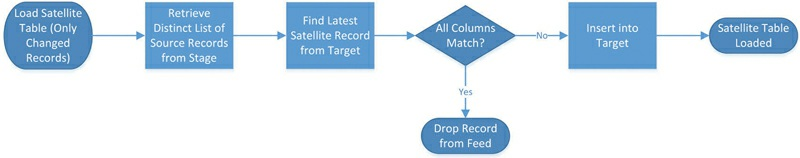

# Load DataVault -- RawEntities

## 1. HubAirportCode(HubAirportCode)

### 建表

#### 字段

1. AirportCodeHashKey
1. LoadDate
1. RecordSource
1. AirportCode

#### PRIMARY KEY

PK_HubAirportCode-> [AirportCodeHashKey]

#### 唯一索引 UNIQUE INDEX

UK_HubAirportCode-> [AirportCode]

#### 建表语句

```mssql
USE [DataVault]
GO
/****** Object:  Table [raw].[HubAirportCode]    Script Date: 2/10/2015 7:26:54 PM ******/
SET ANSI_NULLS ON
GO
SET QUOTED_IDENTIFIER ON
GO
SET ANSI_PADDING ON
GO
Drop TABLE  if exit [raw].[HubAirportCode]
go
CREATE TABLE [raw].[HubAirportCode](
	[AirportCodeHashKey] [char](32) NOT NULL,
	[LoadDate] [datetime2](7) NOT NULL,
	[RecordSource] [nvarchar](50) NOT NULL,
	[AirportCode] [nvarchar](3) NULL,
 CONSTRAINT [PK_HubAirportCode] PRIMARY KEY NONCLUSTERED 
(
	[AirportCodeHashKey] ASC
) ON [INDEX],
 CONSTRAINT [UK_HubAirportCode] UNIQUE NONCLUSTERED 
(
	[AirportCode] ASC
) ON [INDEX]
) ON [DATA]
GO
SET ANSI_PADDING OFF
GO
```

### 导入数据

#### FROM 

​	StageArea.bts.OnTimeOnTimePerformanceGD

#### WHERE 

​	Origin NOT IN (SELECT AirportCode FROM DataVault.[raw].HubAirportCode) 
​	AND LoadDate = '1995-10-18 00:00:00.000';

#### SELECT

  - HubAirportCode所需字段
      1. AirportCodeHashKey
      1. LoadDate
      1. RecordSource
      1. AirportCode
  - 起点、途经、终点站

#### load脚本

```mssql
-- TRUNCATE TABLE DataVault.[raw].HubAirportCode;
-- GO
INSERT INTO DataVault.[raw].HubAirportCode (
	AirportCodeHashKey, LoadDate, RecordSource, AirportCode
)
SELECT DISTINCT 
	OriginHashKey, LoadDate, RecordSource, Origin
FROM 
	StageArea.bts.OnTimeOnTimePerformanceGD
WHERE 
	Origin NOT IN (SELECT AirportCode FROM DataVault.[raw].HubAirportCode) 
	AND LoadDate = '1995-10-18 00:00:00.000';
GO
INSERT INTO DataVault.[raw].HubAirportCode (
	AirportCodeHashKey, LoadDate, RecordSource, AirportCode
)
SELECT DISTINCT 
	DestHashKey, LoadDate, RecordSource, Dest
FROM 
	StageArea.bts.OnTimeOnTimePerformanceGD
WHERE 
	Dest NOT IN (SELECT AirportCode FROM DataVault.[raw].HubAirportCode) 
	AND LoadDate = '1995-10-18 00:00:00.000';
GO
INSERT INTO DataVault.[raw].HubAirportCode (
	AirportCodeHashKey, LoadDate, RecordSource, AirportCode
)
SELECT DISTINCT 
	Div1AirportHashKey, LoadDate, RecordSource, Div1Airport
FROM 
	StageArea.bts.OnTimeOnTimePerformanceGD
WHERE 
	Div1Airport NOT IN (SELECT AirportCode FROM DataVault.[raw].HubAirportCode) 
	AND LoadDate = '1995-10-18 00:00:00.000';
GO
INSERT INTO DataVault.[raw].HubAirportCode (
	AirportCodeHashKey, LoadDate, RecordSource, AirportCode
) 
SELECT DISTINCT 
	Div2AirportHashKey, LoadDate, RecordSource, Div2Airport
FROM 
	StageArea.bts.OnTimeOnTimePerformanceGD
WHERE 
	Div2Airport NOT IN (SELECT AirportCode FROM DataVault.[raw].HubAirportCode) 
	AND LoadDate = '1995-10-18 00:00:00.000';
GO
INSERT INTO DataVault.[raw].HubAirportCode (
	AirportCodeHashKey, LoadDate, RecordSource, AirportCode
)
SELECT DISTINCT 
	Div3AirportHashKey, LoadDate, RecordSource, Div3Airport
FROM 
	StageArea.bts.OnTimeOnTimePerformanceGD
WHERE 
	Div3Airport NOT IN (SELECT AirportCode FROM DataVault.[raw].HubAirportCode) 
	AND LoadDate = '1995-10-18 00:00:00.000';
GO
INSERT INTO DataVault.[raw].HubAirportCode (
	AirportCodeHashKey, LoadDate, RecordSource, AirportCode
)
SELECT DISTINCT 
	Div4AirportHashKey, LoadDate, RecordSource, Div4Airport
FROM 
	StageArea.bts.OnTimeOnTimePerformanceGD
WHERE 
	Div4Airport NOT IN (SELECT AirportCode FROM DataVault.[raw].HubAirportCode) 
	AND LoadDate = '1995-10-18 00:00:00.000';
GO
INSERT INTO DataVault.[raw].HubAirportCode (
	AirportCodeHashKey, LoadDate, RecordSource, AirportCode
)
SELECT DISTINCT 
	Div5AirportHashKey, LoadDate, RecordSource, Div5Airport
FROM 
	StageArea.bts.OnTimeOnTimePerformanceGD
WHERE 
	Div5Airport NOT IN (SELECT AirportCode FROM DataVault.[raw].HubAirportCode) 
	AND LoadDate = '1995-10-18 00:00:00.000';
GO
```

## 2. LinkFlightNumCarrier(LinkFlightNumCarrier)

### 建表

#### 字段

1. FlightNumCarrierHashKey
1. LoadDate
1. RecordSource
1. FlightNumHashKey
1. CarrierHashKey

#### PRIMARY KEY

PK_LinkFlightNumCarrier -> FlightNumCarrierHashKey

#### 唯一索引 UNIQUE INDEX

UK_LinkFlightNumCarrier -> [FlightNumHashKey, CarrierHashKey]

#### 建表语句

```MSSQL
USE [DataVault]
GO
/****** Object:  Table [log].[TLinkEvent]    Script Date: 2/10/2015 7:20:44 PM ******/
SET ANSI_NULLS ON
GO
SET QUOTED_IDENTIFIER ON
GO
SET ANSI_PADDING ON
GO
DROP TABLE IF EXISTS [raw].[LinkFlightNumCarrier]
go
CREATE TABLE [raw].[LinkFlightNumCarrier](
	[FlightNumCarrierHashKey] [char](32) NOT NULL,
	[LoadDate] [datetime2](7) NOT NULL,
	[RecordSource] [nvarchar](50) NOT NULL,
	[FlightNumHashKey] [char](32) NOT NULL,
	[CarrierHashKey] [char](32) NOT NULL,
 CONSTRAINT [PK_LinkFlightNumCarrier] PRIMARY KEY NONCLUSTERED 
(
	[FlightNumCarrierHashKey] ASC
) ON [INDEX],
 CONSTRAINT [UK_LinkFlightNumCarrier] UNIQUE NONCLUSTERED 
(
	[FlightNumHashKey] ASC,
	[CarrierHashKey] ASC
) ON [INDEX]
) ON [DATA]
GO
SET ANSI_PADDING OFF
GO
```

### 导入数据

#### FROM 

​	StageArea.bts.OnTimeOnTimePerformance s

#### WHERE 

​	NOT EXISTS (SELECT 
​					1 
​				FROM 
​					DataVault.[raw].LinkFlightNumCarrier l 
​				WHERE 
​					s.FlightNumHashKey = l.FlightNumHashKey 
​					AND s.CarrierHashKey = l.CarrierHashKey
​				) 
​	AND LoadDate = '2015-01-22 09:51:56.000'

> **注意事项**
>
>  此处where子句作用：
>
> - 去除已经存在于表中的link
> - 指定批次(LoadDate ):避免同一次load的时候，如果有两个批次，这个时候Select子句中的Distinct无法起作用，导致导入时唯一索引、主键(FlightNumHashKey，CarrierHashKey，FlightNumCarrierHashKey)冲突；
>
>  


#### SELECT

- LinkFlightNumCarrier表字段： 

  1. FlightNumCarrierHashKey
  1. LoadDate
  1. RecordSource
  1. FlightNumHashKey
  1. CarrierHashKey

#### Load脚本


```mssql
--TRUNCATE table DataVault.[raw].LinkFlightNumCarrier;

INSERT INTO DataVault.[raw].LinkFlightNumCarrier (
	FlightNumCarrierHashKey, LoadDate, RecordSource, FlightNumHashKey, CarrierHashKey
)
SELECT DISTINCT 
	FlightNumCarrierHashKey, LoadDate, RecordSource, FlightNumHashKey, CarrierHashKey
FROM 
	StageArea.bts.OnTimeOnTimePerformanceGD s
WHERE 
	NOT EXISTS (SELECT 
					1 
				FROM 
					DataVault.[raw].LinkFlightNumCarrier l 
				WHERE 
					s.FlightNumHashKey = l.FlightNumHashKey 
					AND s.CarrierHashKey = l.CarrierHashKey
				) 
	AND LoadDate = '1995-10-14 00:00:00.000'
```


## 3. TLinkFlight(No-History Links)

### 建表

#### 字段

1. FlightHashKey
1. LoadDate
1. RecordSource
1. CarrierHashKey
1. FlightNumHashKey
1. TailNumHashKey
1. OriginHashKey
1. DestHashKey
1. FlightDate

#### PRIMARY KEY

PK_TLinkFlight-> FlightHashKey

#### 唯一索引 UNIQUE INDEX

UK_LinkFlight-> [CarrierHashKey, FlightNumHashKey, TailNumHashKey, OriginHashKey, DestHashKey, FlightDate]

#### 建表语句

```mssql
USE [DataVault]
GO
/****** Object:  Table [raw].[TLinkFlight]    Script Date: 2/11/2015 11:27:26 AM ******/
SET ANSI_NULLS ON
GO
SET QUOTED_IDENTIFIER ON
GO
SET ANSI_PADDING ON
GO
drop table if exists [raw].[TLinkFlight] go
CREATE TABLE [raw].[TLinkFlight](
	[FlightHashKey] [char](32) NOT NULL,
	[LoadDate] [datetime2](7) NOT NULL,
	[RecordSource] [nvarchar](50) NOT NULL,
	[CarrierHashKey] [char](32) NOT NULL,
	[FlightNumHashKey] [char](32) NOT NULL,
	[TailNumHashKey] [char](32) NOT NULL,
	[OriginHashKey] [char](32) NOT NULL,
	[DestHashKey] [char](32) NOT NULL,
	[FlightDate] [datetime2](7) NOT NULL,
 CONSTRAINT [PK_TLinkFlight] PRIMARY KEY NONCLUSTERED 
(
	[FlightHashKey] ASC
) ON [INDEX],
 CONSTRAINT [UK_LinkFlight] UNIQUE NONCLUSTERED 
(
	[CarrierHashKey] ASC,
	[FlightNumHashKey] ASC,
	[TailNumHashKey] ASC,
	[OriginHashKey] ASC,
	[DestHashKey] ASC,
	[FlightDate] ASC
) ON [INDEX]
) ON [DATA]
GO
SET ANSI_PADDING OFF
GO
```


### 导入数据

#### FROM

​	StageArea.bts.OnTimeOnTimePerformanceGD s

#### WHERE

​	NOT EXISTS (SELECT 
​					1 
​				FROM 
​					DataVault.[raw].TLinkFlight l 
​				WHERE 
​					s.CarrierHashKey = l.CarrierHashKey 
​					AND s.FlightNumHashKey = l.FlightNumHashKey
​					AND s.TailNumHashKey = l.TailNumHashKey
​					AND s.OriginHashKey = l.OriginHashKey
​					AND s.DestHashKey = l.DestHashKey
​					AND s.FlightDate = l.FlightDate
​				)

#### SELECT

- TLinkFlight表字段
  1. FlightHashKey
  1. LoadDate
  1. RecordSource
  1. CarrierHashKey
  1. FlightNumHashKey
  1. TailNumHashKey
  1. OriginHashKey
  1. DestHashKey
  1. FlightDate

#### load脚本

```mssql
--TRUNCATE TABLE DataVault.[raw].TLinkFlight;
INSERT INTO DataVault.[raw].TLinkFlight (
	FlightHashKey, 
	LoadDate, 
	RecordSource, 
	CarrierHashKey, 
	FlightNumHashKey, 
	TailNumHashKey, 
	OriginHashKey, 
	DestHashKey, 
	FlightDate
)
SELECT
	FlightHashKey, 
	LoadDate, 
	RecordSource, 
	CarrierHashKey, 
	FlightNumHashKey, 
	TailNumHashKey, 
	OriginHashKey, 
	DestHashKey, 
	FlightDate
FROM
	StageArea.bts.OnTimeOnTimePerformanceGD s
WHERE
	NOT EXISTS (SELECT 
					1 
				FROM 
					DataVault.[raw].TLinkFlight l 
				WHERE 
					s.CarrierHashKey = l.CarrierHashKey 
					AND s.FlightNumHashKey = l.FlightNumHashKey
					AND s.TailNumHashKey = l.TailNumHashKey
					AND s.OriginHashKey = l.OriginHashKey
					AND s.DestHashKey = l.DestHashKey
					AND s.FlightDate = l.FlightDate
				)
```


## 4. SatOriginAirport

### 建表

#### 字段

1. AirportHashKey
1. LoadDate
1. LoadEndDate
1. RecordSource
1. OriginCityName
1. OriginState
1. OriginStateName
1. OriginCityMarketID
1. OriginStateFips
1. OriginWac

#### PRIMARY KEY

PK_SatOriginAirport-> [AirportHashKey,LoadDate]

#### 唯一索引 UNIQUE INDEX

无

#### 建表语句

```mssql
USE [DataVault]
GO
/****** Object:  Table [raw].[SatOriginAirport]    Script Date: 2/12/2015 9:39:27 AM ******/
SET ANSI_NULLS ON
GO
SET QUOTED_IDENTIFIER ON
GO
SET ANSI_PADDING ON
GO
DROP TABLE IF EXISTS [raw].[SatOriginAirport]
GO
CREATE TABLE [raw].[SatOriginAirport](
	[AirportHashKey] [char](32) NOT NULL,
	[LoadDate] [datetime2](7) NOT NULL,
	[LoadEndDate] [datetime2](7) NULL,
	[RecordSource] [nvarchar](50) NOT NULL,
	[OriginCityName] nvarchar(100) NOT NULL,
	[OriginState] [nvarchar](2) NOT NULL,
	[OriginStateName] [nvarchar](100) NOT NULL,
	[OriginCityMarketID] [int] NOT NULL,
	[OriginStateFips] [smallint] NOT NULL,
	[OriginWac] [smallint] NOT NULL,
 CONSTRAINT [PK_SatOriginAirport] PRIMARY KEY NONCLUSTERED 
(
	[AirportHashKey] ASC,
	[LoadDate] ASC
) ON [INDEX]
) ON [DATA]
GO
SET ANSI_PADDING OFF
GO
```


### 导入数据

#### FROM 

​	StageArea.bts.OnTimeOnTimePerformanceGD stg
`LEFT OUTER JOIN`
​	DataVault.[raw].SatOriginAirport sat 
​	`ON` (stg.OriginHashKey = sat.AirportHashKey  `AND` sat.LoadEndDate IS NULL)

#### WHERE

​	(ISNULL(stg.OriginCityName, '') != ISNULL(sat.OriginCityName, '')
​	OR ISNULL(stg.OriginState, '') != ISNULL(sat.OriginState, '')
​	OR ISNULL(stg.OriginStateName, '') != ISNULL(sat.OriginStateName, '')
​	OR ISNULL(stg.OriginCityMarketID, 0) != ISNULL(sat.OriginCityMarketID, 0)
​	OR ISNULL(stg.OriginStateFips, 0) != ISNULL(sat.OriginStateFips, 0)
​	OR ISNULL(stg.OriginWac, 0) != ISNULL(sat.OriginWac, 0))
​	AND stg.LoadDate = '1995-10-14 00:00:00.000'

#### SELECT

- SatOriginAirport表的字段
  1. AirportHashKey
  1. LoadDate
  1. LoadEndDate
  1. RecordSource
  1. OriginCityName
  1. OriginState
  1. OriginStateName
  1. OriginCityMarketID
  1. OriginStateFips
  1. OriginWac
- 子句选项
  - stg.OriginHashKey
  - stg.LoadDate
  - NULL
  - stg.RecordSource
  - stg.OriginCityName
  - stg.OriginState
  - stg.OriginStateName
  - stg.OriginCityMarketID
  - stg.OriginStateFips
  - stg.OriginWac

> **注意：**
>
> LoadEndDate 初始加载时，可为null空值
>

#### load脚本

```mssql
INSERT INTO DataVault.[raw].SatOriginAirport (
	AirportHashKey, 
	LoadDate, 
	LoadEndDate, 
	RecordSource, 
	OriginCityName, 
	OriginState, 
	OriginStateName, 
	OriginCityMarketID, 
	OriginStateFips, 
	OriginWac
)
SELECT DISTINCT
	stg.OriginHashKey, 
	stg.LoadDate, 
	NULL,
	stg.RecordSource, 
	stg.OriginCityName, 
	stg.OriginState, 
	stg.OriginStateName, 
	stg.OriginCityMarketID, 
	stg.OriginStateFips,
	stg.OriginWac
FROM 
	StageArea.bts.OnTimeOnTimePerformanceGD stg
LEFT OUTER JOIN
	DataVault.[raw].SatOriginAirport sat 
	ON (stg.OriginHashKey = sat.AirportHashKey AND sat.LoadEndDate IS NULL)
WHERE
	(ISNULL(stg.OriginCityName, '') != ISNULL(sat.OriginCityName, '')
	OR ISNULL(stg.OriginState, '') != ISNULL(sat.OriginState, '')
	OR ISNULL(stg.OriginStateName, '') != ISNULL(sat.OriginStateName, '')
	OR ISNULL(stg.OriginCityMarketID, 0) != ISNULL(sat.OriginCityMarketID, 0)
	OR ISNULL(stg.OriginStateFips, 0) != ISNULL(sat.OriginStateFips, 0)
	OR ISNULL(stg.OriginWac, 0) != ISNULL(sat.OriginWac, 0))
	AND stg.LoadDate = '1995-10-14 00:00:00.000'

```


## 5. SatDestAirport(HashDiff)

### 建表

#### 字段

1. AirportHashKey
1. LoadDate
1. LoadEndDate
1. RecordSource
1. HashDiff
1. DestCityName
1. DestState
1. DestStateName
1. DestCityMarketID
1. DestStateFips
1. DestWac

#### PRIMARY KEY

PK_SatDestAirport-> [AirportHashKey,LoadDate]

#### 唯一索引 UNIQUE INDEX

无

#### 建表脚本

```mssql
USE [DataVault]
GO
/****** Object:  Table [raw].[SatDestAirport]    Script Date: 2/12/2015 9:39:27 AM ******/
SET ANSI_NULLS ON
GO
SET QUOTED_IDENTIFIER ON
GO
SET ANSI_PADDING ON
GO
Drop table if exists [raw].[SatDestAirport]
go
CREATE TABLE [raw].[SatDestAirport](
	[AirportHashKey] [char](32) NOT NULL,
	[LoadDate] [datetime2](7) NOT NULL,
	[LoadEndDate] [datetime2](7) NULL,
	[RecordSource] [nvarchar](50) NOT NULL,
	[HashDiff] [char](32) NOT NULL,
	[DestCityName] nvarchar(100) NOT NULL,
	[DestState] [nvarchar](2) NOT NULL,
	[DestStateName] [nvarchar](100) NOT NULL,
	[DestCityMarketID] [int] NOT NULL,
	[DestStateFips] [smallint] NOT NULL,
	[DestWac] [smallint] NOT NULL,
 CONSTRAINT [PK_SatDestAirport] PRIMARY KEY NONCLUSTERED 
(
	[AirportHashKey] ASC,
	[LoadDate] ASC
) ON [INDEX]
) ON [DATA]
GO
SET ANSI_PADDING OFF
GO
```

### 导入数据

#### FROM 

​	StageArea.bts.OnTimeOnTimePerformanceGD `stg`
`LEFT OUTER JOIN`
​	DataVault.[raw].SatDestAirport `sat` 
​	`ON` (`stg`.DestHashKey = sat.AirportHashKey `AND` `sat`.LoadEndDate IS NULL)

#### WHERE

​	(`sat`.HashDiff IS NULL `OR` `stg`.DestAirportHashDiff != `sat`.HashDiff)
​	`AND` `stg`.LoadDate = '1995-10-26 00:00:00.000'

#### SELECT

- #### SatDestAirport所有字段
  1. AirportHashKey
  2. LoadDate
  3. LoadEndDate
  4. RecordSource
  5. HashDiff
  6. DestCityName
  7. DestState
  8. DestStateName
  9. DestCityMarketID
  10. DestStateFips
  11. DestWac

- 字句选项
  1. stg.DestHashKey, 
  1. stg.LoadDate, 
  1. NULL,
  1. stg.RecordSource,
  1. stg.DestAirportHashDiff,
  1. stg.DestCityName, 
  1. stg.DestState, 
  1. stg.DestStateName, 
  1. stg.DestCityMarketID, 
  1. stg.DestStateFips,
  1. stg.DestWac
#### load脚本

```mssql
INSERT INTO DataVault.[raw].SatDestAirport (
	AirportHashKey, 
	LoadDate, 
	LoadEndDate, 
	RecordSource, 
	HashDiff,
	DestCityName, 
	DestState, 
	DestStateName, 
	DestCityMarketID, 
	DestStateFips, 
	DestWac
)
SELECT DISTINCT
	stg.DestHashKey, 
	stg.LoadDate, 
	NULL,
	stg.RecordSource,
	stg.DestAirportHashDiff, 
	stg.DestCityName, 
	stg.DestState, 
	stg.DestStateName, 
	stg.DestCityMarketID, 
	stg.DestStateFips,
	stg.DestWac
FROM 
	StageArea.bts.OnTimeOnTimePerformanceGD stg
LEFT OUTER JOIN
	DataVault.[raw].SatDestAirport sat 
	ON (stg.DestHashKey = sat.AirportHashKey AND sat.LoadEndDate IS NULL)
WHERE
	(sat.HashDiff IS NULL OR stg.DestAirportHashDiff != sat.HashDiff)
	AND stg.LoadDate = '1995-10-14 00:00:00.000'
```


## 6. Satellite End-dating(SatPreferredDish)

```mssql
UPDATE SatPreferredDish SET 
	LoadEndDate = (
		SELECT 
			DATEADD(ss,-1,MIN(z.LoadDate))
		FROM 
			SatPreferredDish z
		WHERE 
			z.PassengerHashKey = a.PassengerHashKey
		AND 
			z.LoadDate > a.LoadDate
	)
FROM 
	SatPreferredDish a
WHERE 
	LoadEndDate IS NULL AND PassengerHashKey = ?

```


## 7. Separate New from Changed Rows(SatOriginAirport)

### Load ChangedRows

#### FROM 

​	StageArea.bts.OnTimeOnTimePerformanceGD `stg`
`INNER JOIN`
​	DataVault.[raw].SatOriginAirport `sat` 
​	`ON` (`stg`.OriginHashKey = `sat`.AirportHashKey `AND` `sat`.LoadEndDate IS NULL)

#### WHERE

​	(
​	(CASE WHEN (stg.OriginCityName IS NULL AND sat.OriginCityName IS NULL
​		OR stg.OriginCityName = sat.OriginCityName)
​		THEN 1 ELSE 0 END) = 0
​	OR (CASE WHEN (stg.OriginState IS NULL AND sat.OriginState IS NULL
​		OR stg.OriginState = sat.OriginState)
​		THEN 1 ELSE 0 END) = 0
​	OR (CASE WHEN (stg.OriginStateName IS NULL AND sat.OriginStateName IS NULL
​		OR stg.OriginStateName = sat.OriginStateName)
​		THEN 1 ELSE 0 END) = 0
​	OR (CASE WHEN (stg.OriginCityMarketID IS NULL AND sat.OriginCityMarketID IS NULL
​		OR stg.OriginCityMarketID = sat.OriginCityMarketID)
​		THEN 1 ELSE 0 END) = 0
​	OR (CASE WHEN (stg.OriginStateFips IS NULL AND sat.OriginStateFips IS NULL
​		OR stg.OriginStateFips = sat.OriginStateFips)
​		THEN 1 ELSE 0 END) = 0
​	OR (CASE WHEN (stg.OriginWac IS NULL AND sat.OriginWac IS NULL
​		OR stg.OriginWac = sat.OriginWac)
​		THEN 1 ELSE 0 END) = 0
​	)
​	AND stg.LoadDate = '2011-01-22 00:00:00.000'

> 条件说明
>
> FIGURE 12.62 Template for loading only changed records into satellite tables.
>
> 
>
> This statement shows that the staging area is not only used to reduce the workload on the source systems, but it can also be used to perform intermediate tasks that improve the performance of the data warehouse loading processes. And it shows the additional value of having calculated the hash keys in the staging area: it does not only improve the reusability of the hash computations, but can also be used to improve the loading processes even further (as described in this section).


#### SQL脚本

```mssql
INSERT INTO DataVault.[raw].SatOriginAirport (
	AirportHashKey, 
	LoadDate, 
	LoadEndDate, 
	RecordSource, 
	OriginCityName, 
	OriginState, 
	OriginStateName, 
	OriginCityMarketID, 
	OriginStateFips, 
	OriginWac
)
SELECT DISTINCT
	stg.OriginHashKey, 
	stg.LoadDate, 
	NULL,
	stg.RecordSource, 
	stg.OriginCityName, 
	stg.OriginState, 
	stg.OriginStateName, 
	stg.OriginCityMarketID, 
	stg.OriginStateFips,
	stg.OriginWac
FROM 
	StageArea.bts.OnTimeOnTimePerformanceGD stg
INNER JOIN
	DataVault.[raw].SatOriginAirport sat 
	ON (stg.OriginHashKey = sat.AirportHashKey AND sat.LoadEndDate IS NULL)
WHERE
	(
	(CASE WHEN (stg.OriginCityName IS NULL AND sat.OriginCityName IS NULL
		OR stg.OriginCityName = sat.OriginCityName)
		THEN 1 ELSE 0 END) = 0
	OR (CASE WHEN (stg.OriginState IS NULL AND sat.OriginState IS NULL
		OR stg.OriginState = sat.OriginState)
		THEN 1 ELSE 0 END) = 0
	OR (CASE WHEN (stg.OriginStateName IS NULL AND sat.OriginStateName IS NULL
		OR stg.OriginStateName = sat.OriginStateName)
		THEN 1 ELSE 0 END) = 0
	OR (CASE WHEN (stg.OriginCityMarketID IS NULL AND sat.OriginCityMarketID IS NULL
		OR stg.OriginCityMarketID = sat.OriginCityMarketID)
		THEN 1 ELSE 0 END) = 0
	OR (CASE WHEN (stg.OriginStateFips IS NULL AND sat.OriginStateFips IS NULL
		OR stg.OriginStateFips = sat.OriginStateFips)
		THEN 1 ELSE 0 END) = 0
	OR (CASE WHEN (stg.OriginWac IS NULL AND sat.OriginWac IS NULL
		OR stg.OriginWac = sat.OriginWac)
		THEN 1 ELSE 0 END) = 0
	)
	AND stg.LoadDate = '2011-01-22 00:00:00.000'
```

### Load NewRows

#### FROM 

​	StageArea.bts.OnTimeOnTimePerformanceGD stg
LEFT OUTER JOIN
​	DataVault.[raw].SatOriginAirport sat 
​	ON (stg.OriginHashKey = sat.AirportHashKey AND sat.LoadEndDate IS NULL)

#### WHERE

​	(
​	(CASE WHEN (stg.OriginCityName IS NULL AND sat.OriginCityName IS NULL
​		OR stg.OriginCityName = sat.OriginCityName)
​		THEN 1 ELSE 0 END) = 0
​	OR (CASE WHEN (stg.OriginState IS NULL AND sat.OriginState IS NULL
​		OR stg.OriginState = sat.OriginState)
​		THEN 1 ELSE 0 END) = 0
​	OR (CASE WHEN (stg.OriginStateName IS NULL AND sat.OriginStateName IS NULL
​		OR stg.OriginStateName = sat.OriginStateName)
​		THEN 1 ELSE 0 END) = 0
​	OR (CASE WHEN (stg.OriginCityMarketID IS NULL AND sat.OriginCityMarketID IS NULL
​		OR stg.OriginCityMarketID = sat.OriginCityMarketID)
​		THEN 1 ELSE 0 END) = 0
​	OR (CASE WHEN (stg.OriginStateFips IS NULL AND sat.OriginStateFips IS NULL
​		OR stg.OriginStateFips = sat.OriginStateFips)
​		THEN 1 ELSE 0 END) = 0
​	OR (CASE WHEN (stg.OriginWac IS NULL AND sat.OriginWac IS NULL
​		OR stg.OriginWac = sat.OriginWac)
​		THEN 1 ELSE 0 END) = 0
​	)
​	AND sat.AirportHashKey IS NULL --new records only
​	AND stg.LoadDate = '2011-01-22 00:00:00.000'
​	

> 说明
>
> FIGURE 12.63 Template for loading only new records into satellite tables.
>
> 
>
> **Not** only is the column compare removed, but also the retrieval of the latest record from the target satellite table. New records are just loaded into the target. This template also requires that the source query on the staging area provides only new records with hash keys unknown to the target satellite.
>
> **Both** processes for new and changed records can run in parallel, because they operate on different sets of input data which are loaded into nonoverlapping primary keys of the target table (again, because the processed hash keys of each ETL process are different).

#### SQL脚本

```mssql
INSERT INTO DataVault.[raw].SatOriginAirport (
	AirportHashKey, 
	LoadDate, 
	LoadEndDate, 
	RecordSource, 
	OriginCityName, 
	OriginState, 
	OriginStateName, 
	OriginCityMarketID, 
	OriginStateFips, 
	OriginWac
)
SELECT DISTINCT
	stg.OriginHashKey, 
	stg.LoadDate, 
	NULL,
	stg.RecordSource, 
	stg.OriginCityName, 
	stg.OriginState, 
	stg.OriginStateName, 
	stg.OriginCityMarketID, 
	stg.OriginStateFips,
	stg.OriginWac
FROM 
	StageArea.bts.OnTimeOnTimePerformanceGD stg
LEFT OUTER JOIN
	DataVault.[raw].SatOriginAirport sat 
	ON (stg.OriginHashKey = sat.AirportHashKey AND sat.LoadEndDate IS NULL)
WHERE
	(
	(CASE WHEN (stg.OriginCityName IS NULL AND sat.OriginCityName IS NULL
		OR stg.OriginCityName = sat.OriginCityName)
		THEN 1 ELSE 0 END) = 0
	OR (CASE WHEN (stg.OriginState IS NULL AND sat.OriginState IS NULL
		OR stg.OriginState = sat.OriginState)
		THEN 1 ELSE 0 END) = 0
	OR (CASE WHEN (stg.OriginStateName IS NULL AND sat.OriginStateName IS NULL
		OR stg.OriginStateName = sat.OriginStateName)
		THEN 1 ELSE 0 END) = 0
	OR (CASE WHEN (stg.OriginCityMarketID IS NULL AND sat.OriginCityMarketID IS NULL
		OR stg.OriginCityMarketID = sat.OriginCityMarketID)
		THEN 1 ELSE 0 END) = 0
	OR (CASE WHEN (stg.OriginStateFips IS NULL AND sat.OriginStateFips IS NULL
		OR stg.OriginStateFips = sat.OriginStateFips)
		THEN 1 ELSE 0 END) = 0
	OR (CASE WHEN (stg.OriginWac IS NULL AND sat.OriginWac IS NULL
		OR stg.OriginWac = sat.OriginWac)
		THEN 1 ELSE 0 END) = 0
	)
	AND sat.AirportHashKey IS NULL --new records only
	AND stg.LoadDate = '2011-01-22 00:00:00.000'
```

## 8. No-History Satellites(TSatFlight)

### 建表

#### 字段

1. LoadDate
1. RecordSource
1. Year
1. Quarter
1. Month
1. DayOfMonth
1. DayOfWeek
1. CRSDepTime
1. DepTime
1. DepDelay
1. DepDelayMinutes
1. DepDel15
1. DepartureDelayGroups
1. DepTimeBlk
1. TaxiOut
1. WheelsOff
1. WheelsOn
1. TaxiIn
1. CRSArrTime
1. ArrTime
1. ArrDelay
1. ArrDelayMinutes
1. ArrDel15
1. ArrivalDelayGroups
1. ArrTimeBlk
1. Cancelled
1. CancellationCode
1. Diverted
1. CRSElapsedTime
1. ActualElapsedTime
1. AirTime
1. Flights
1. Distance
1. DistanceGroup
1. CarrierDelay
1. WeatherDelay
1. NASDelay
1. SecurityDelay
1. LateAircraftDelay
1. FirstDepTime
1. TotalAddGTime
1. LongestAddGTime


#### PRIMARY KEY

PK_TSatFlight-> [FlightHashKey,LoadDate]

#### 唯一索引 UNIQUE INDEX

无

#### 建表脚本

```mssql
USE [DataVault]
GO
/****** Object:  Table [raw].[TSatFlight]    Script Date: 2/26/2015 4:52:50 PM ******/
SET ANSI_NULLS ON
GO
SET QUOTED_IDENTIFIER ON
GO
SET ANSI_PADDING ON
GO
DROP table if exists  [raw].[TSatFlight]
CREATE TABLE [raw].[TSatFlight](
	[FlightHashKey] [char](32) NOT NULL,
	[LoadDate] [datetime2](7) NOT NULL,
	[RecordSource] [nvarchar](50) NOT NULL,
	[Year] [smallint] NULL,
	[Quarter] [smallint] NULL,
	[Month] [smallint] NULL,
	[DayOfMonth] [smallint] NULL,
	[DayOfWeek] [smallint] NULL,
	[CRSDepTime] [smallint] NULL,
	[DepTime] [smallint] NULL,
	[DepDelay] [smallint] NULL,
	[DepDelayMinutes] [smallint] NULL,
	[DepDel15] [bit] NULL,
	[DepartureDelayGroups] [smallint] NULL,
	[DepTimeBlk] [nvarchar](9) NULL,
	[TaxiOut] [smallint] NULL,
	[WheelsOff] [smallint] NULL,
	[WheelsOn] [smallint] NULL,
	[TaxiIn] [smallint] NULL,
	[CRSArrTime] [smallint] NULL,
	[ArrTime] [smallint] NULL,
	[ArrDelay] [smallint] NULL,
	[ArrDelayMinutes] [smallint] NULL,
	[ArrDel15] [bit] NULL,
	[ArrivalDelayGroups] [smallint] NULL,
	[ArrTimeBlk] [nvarchar](9) NULL,
	[Cancelled] [bit] NULL,
	[CancellationCode] [nvarchar](10) NULL,
	[Diverted] [bit] NULL,
	[CRSElapsedTime] [smallint] NULL,
	[ActualElapsedTime] [smallint] NULL,
	[AirTime] [smallint] NULL,
	[Flights] [smallint] NULL,
	[Distance] [int] NULL,
	[DistanceGroup] [int] NULL,
	[CarrierDelay] [smallint] NULL,
	[WeatherDelay] [smallint] NULL,
	[NASDelay] [smallint] NULL,
	[SecurityDelay] [smallint] NULL,
	[LateAircraftDelay] [smallint] NULL,
	[FirstDepTime] [smallint] NULL,
	[TotalAddGTime] [smallint] NULL,
	[LongestAddGTime] [smallint] NULL,
 CONSTRAINT [PK_TSatFlight] PRIMARY KEY NONCLUSTERED 
(
	[FlightHashKey] ASC,
	[LoadDate] ASC
) ON [INDEX]
) ON [DATA]
GO
SET ANSI_PADDING OFF
GO
```


### 导入数据

#### FROM

​	  StageArea.bts.OnTimeOnTimePerformanceGD stg
LEFT OUTER JOIN
​	  DataVault.[raw].TSatFlight sat ON (stg.FlightHashKey = sat.FlightHashKey)

#### WHERE

​	  sat.FlightHashKey IS NULL

> 脚本说明
>
> This statement implements a simple copy process. Restartability is
> guaranteed by adding a LEFT OUTER JOIN that checks if the hash key of
> the parent no-history link is already in the target satellite. If this is the
> case, the record from the staging area is ignored, otherwise loaded. The
> load date is not required for this join, because there should only be one
> record per parent hash key in the target satellite.

#### Load脚本

```mssql
/****** Script for SelectTopNRows command from SSMS  ******/
INSERT INTO DataVault.[raw].TSatFlight (
       [FlightHashKey]
      ,[LoadDate]
      ,[RecordSource]
      ,[Year]
      ,[Quarter]
      ,[Month]
      ,[DayOfMonth]
      ,[DayOfWeek]
      ,[CRSDepTime]
      ,[DepTime]
      ,[DepDelay]
      ,[DepDelayMinutes]
      ,[DepDel15]
      ,[DepartureDelayGroups]
      ,[DepTimeBlk]
      ,[TaxiOut]
      ,[WheelsOff]
      ,[WheelsOn]
      ,[TaxiIn]
      ,[CRSArrTime]
      ,[ArrTime]
      ,[ArrDelay]
      ,[ArrDelayMinutes]
      ,[ArrDel15]
      ,[ArrivalDelayGroups]
      ,[ArrTimeBlk]
      ,[Cancelled]
      ,[CancellationCode]
      ,[Diverted]
      ,[CRSElapsedTime]
      ,[ActualElapsedTime]
      ,[AirTime]
      ,[Flights]
      ,[Distance]
      ,[DistanceGroup]
      ,[CarrierDelay]
      ,[WeatherDelay]
      ,[NASDelay]
      ,[SecurityDelay]
      ,[LateAircraftDelay]
      ,[FirstDepTime]
      ,[TotalAddGTime]
      ,[LongestAddGTime]
)
SELECT
	   stg.[FlightHashKey]
      ,stg.[LoadDate]
      ,stg.[RecordSource]
      ,stg.[Year]
      ,stg.[Quarter]
      ,stg.[Month]
      ,stg.[DayOfMonth]
      ,stg.[DayOfWeek]
      ,stg.[CRSDepTime]
      ,stg.[DepTime]
      ,stg.[DepDelay]
      ,stg.[DepDelayMinutes]
      ,stg.[DepDel15]
      ,stg.[DepartureDelayGroups]
      ,stg.[DepTimeBlk]
      ,stg.[TaxiOut]
      ,stg.[WheelsOff]
      ,stg.[WheelsOn]
      ,stg.[TaxiIn]
      ,stg.[CRSArrTime]
      ,stg.[ArrTime]
      ,stg.[ArrDelay]
      ,stg.[ArrDelayMinutes]
      ,stg.[ArrDel15]
      ,stg.[ArrivalDelayGroups]
      ,stg.[ArrTimeBlk]
      ,stg.[Cancelled]
      ,stg.[CancellationCode]
      ,stg.[Diverted]
      ,stg.[CRSElapsedTime]
      ,stg.[ActualElapsedTime]
      ,stg.[AirTime]
      ,stg.[Flights]
      ,stg.[Distance]
      ,stg.[DistanceGroup]
      ,stg.[CarrierDelay]
      ,stg.[WeatherDelay]
      ,stg.[NASDelay]
      ,stg.[SecurityDelay]
      ,stg.[LateAircraftDelay]
      ,stg.[FirstDepTime]
      ,stg.[TotalAddGTime]
      ,stg.[LongestAddGTime]	   
FROM
	  StageArea.bts.OnTimeOnTimePerformanceGD stg
LEFT OUTER JOIN
	  DataVault.[raw].TSatFlight sat ON (stg.FlightHashKey = sat.FlightHashKey)
WHERE
	  sat.FlightHashKey IS NULL
```


## 9. Soft-Deleting Data in Hubs and Links(SatAirlineIDEffectivity)

### 建表

#### 字段

1. AirlineIDHashKey
1. LoadDate
1. LoadEndDate
1. RecordSource
1. Year Start
1. Year End
1. ValidFrom
1. ValidTo


#### PRIMARY KEY

PK_SatAirlineIDEffectivity-> [AirlineIDHashKey,LoadDate]

#### 唯一索引 UNIQUE INDEX

无

#### 建表脚本

```mssql
USE [DataVault]
GO
/****** Object:  Table [raw].[SatAirlineIDEffectivity]    Script Date: 2/17/2015 11:15:14 AM ******/
SET ANSI_NULLS ON
GO
SET QUOTED_IDENTIFIER ON
GO
SET ANSI_PADDING ON
GO
Drop table if exists raw.SatAirlineIDEffectivity
go
CREATE TABLE [raw].[SatAirlineIDEffectivity](
	[AirlineIDHashKey] [char](32) NOT NULL,
	[LoadDate] [datetime2](7) NOT NULL,
	[LoadEndDate] [datetime2](7) NULL,
	[RecordSource] [nvarchar](50) NOT NULL,
	[Year Start] int NOT NULL,
	[Year End] int NOT NULL,
	[ValidFrom] [datetime2](7) NOT NULL,
	[ValidTo] [datetime2](7) NULL,
 CONSTRAINT [PK_SatAirlineIDEffectivity] PRIMARY KEY NONCLUSTERED 
(
	[AirlineIDHashKey] ASC,
	[LoadDate] ASC
) ON [INDEX]
) ON [DATA]
GO
SET ANSI_PADDING OFF
GO
```


### 导入数据

#### FROM 

​	StageArea.my.CarrierHistory `stg`
`LEFT OUTER JOIN`
​	DataVault.[raw].SatAirlineIDEffectivity `sat` 
​	`ON` (`stg`.AirlineIDHashKey = `sat`.AirlineIDHashKey `AND` `sat`.LoadEndDate IS NULL)

#### WHERE

​	ISNULL(stg.[Year Start], 0) != ISNULL(sat.[Year Start], 0)
​	AND ISNULL(stg.[Year End], 9999) != ISNULL(sat.[Year End], 9999)

#### SELECT DISTINCT

​	stg.AirlineIDHashKey,
​	stg.LoadDate, 
​	NULL,
​	stg.RecordSource,
​	stg.[Year Start],
​	stg.[Year End],
​	DATEFROMPARTS(stg.[Year Start], 1, 1),
​	DATEFROMPARTS(stg.[Year End], 12, 31)

```mssql
-- TRUNCATE TABLE DataVault.[raw].SatAirlineIDEffectivity;

INSERT INTO DataVault.[raw].SatAirlineIDEffectivity (
	AirlineIDHashKey, 
	LoadDate, 
	LoadEndDate, 
	RecordSource,
	[Year Start],
	[Year End],
	ValidFrom,
	ValidTo
)
SELECT DISTINCT
	stg.AirlineIDHashKey,
	stg.LoadDate, 
	NULL,
	stg.RecordSource,
	stg.[Year Start],
	stg.[Year End],
	DATEFROMPARTS(stg.[Year Start], 1, 1),
	DATEFROMPARTS(stg.[Year End], 12, 31)
FROM 
	StageArea.my.CarrierHistory stg
LEFT OUTER JOIN
	DataVault.[raw].SatAirlineIDEffectivity sat 
	ON (stg.AirlineIDHashKey = sat.AirlineIDHashKey AND sat.LoadEndDate IS NULL)
WHERE
	ISNULL(stg.[Year Start], 0) != ISNULL(sat.[Year Start], 0)
	AND ISNULL(stg.[Year End], 9999) != ISNULL(sat.[Year End], 9999)
```


## 10. Dealing with Missing Data

### 建表

#### 字段

1. FlightNumHashKey
2. LoadDate
3. RecordSource
4. LastSeenDate
5. Carrier
6. FlightNum

#### PRIMARY KEY

PK_HubFlightNum-> [FlightNumHashKey]

#### 唯一索引 UNIQUE INDEX

UK_HubFlightNum ->[Carrier,FlightNum]

#### 建表脚本

```mssql
USE [DataVault]
GO
/****** Object:  Table [raw].[HubFlightNum]    Script Date: 2/17/2015 9:02:13 PM ******/
SET ANSI_NULLS ON
GO
SET QUOTED_IDENTIFIER ON
GO
SET ANSI_PADDING ON
GO
Drop table if exists raw.HubFlightNum
GO
CREATE TABLE [raw].[HubFlightNum](
	[FlightNumHashKey] [char](32) NOT NULL,
	[LoadDate] [datetime2](7) NOT NULL,
	[RecordSource] [nvarchar](50) NOT NULL,
	[LastSeenDate] [datetime2](7) NOT NULL,
	[Carrier] [nvarchar](2) NULL,
	[FlightNum] [smallint] NULL,
 CONSTRAINT [PK_HubFlightNum] PRIMARY KEY NONCLUSTERED 
(
	[FlightNumHashKey] ASC
) ON [INDEX],
 CONSTRAINT [UK_HubFlightNum] UNIQUE NONCLUSTERED 
(
	[Carrier] ASC,
	[FlightNum] ASC
) ON [INDEX]
) ON [DATA]
GO
SET ANSI_PADDING OFF
GO
```

### 导入数据

#### INSERT

##### FROM 

​	StageArea.bts.OnTimeOnTimePerformanceGD s

##### WHERE 

​	NOT EXISTS (SELECT 
​			1 
​		FROM 
​			DataVault.[raw].HubFlightNum h 
​		WHERE 
​			s.Carrier = h.Carrier 
​			AND s.FlightNum = h.FlightNum
​		)  
​	AND LoadDate = '2003-10-01 00:00:00.000';

#### UPDATE

##### FROM

​	DataVault.[raw].HubFlightNum hub
INNER JOIN 
​	StageArea.bts.OnTimeOnTimePerformanceGD stg
ON
​	stg.Carrier = hub.Carrier AND stg.FlightNum = hub.FlightNum
​	AND hub.LastSeenDate < stg.LoadDate

##### WHERE

​	stg.LoadDate = '2003-10-01 00:00:00.000'

##### SET

​	LastSeenDate = stg.LoadDate


#### Load脚本

```mssql
INSERT INTO DataVault.[raw].HubFlightNum (
	FlightNumHashKey, LoadDate, RecordSource, LastSeenDate, Carrier, FlightNum
)
SELECT DISTINCT 
	FlightNumHashKey, LoadDate, RecordSource, LoadDate, Carrier, FlightNum
FROM 
	StageArea.bts.OnTimeOnTimePerformanceGD s
WHERE 
	NOT EXISTS (SELECT 
			1 
		FROM 
			DataVault.[raw].HubFlightNum h 
		WHERE 
			s.Carrier = h.Carrier 
			AND s.FlightNum = h.FlightNum
		)  
	AND LoadDate = '2003-10-01 00:00:00.000';
GO
```

```mssql
UPDATE DataVault.[raw].HubFlightNum SET
	LastSeenDate = stg.LoadDate
FROM
	DataVault.[raw].HubFlightNum hub
INNER JOIN 
	StageArea.bts.OnTimeOnTimePerformanceGD stg
ON
	stg.Carrier = hub.Carrier AND stg.FlightNum = hub.FlightNum
	AND hub.LastSeenDate < stg.LoadDate
WHERE
	stg.LoadDate = '2003-10-01 00:00:00.000'
```


