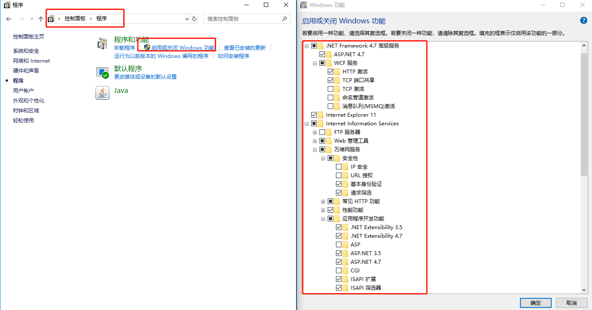
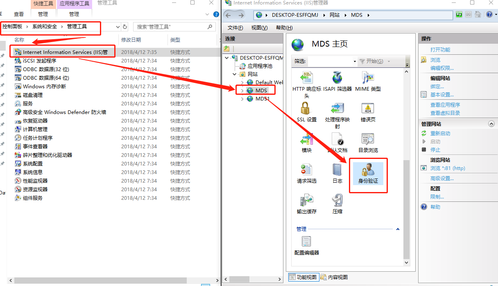
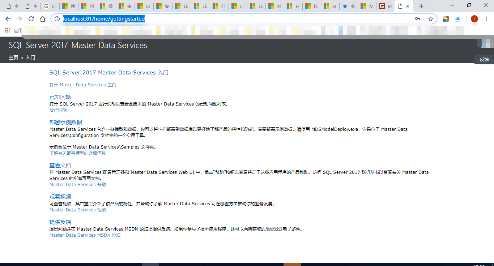

# MDS配置与安装

## 1.安装MDS

 在SQLServer安装过程中勾选：MasterDataService

## 2.启用Windows功能

## 3.MDS配置管理工具

### 3.1 数据库配置

创建MDS-->选择数据库

### 3.2 Web配置

新建网站 --> 指定空闲端口 --> 选中Web应用程序 --> 选择数据库 --> 应用。

## 4.配置IIS

搜索并打开：管理工具--> IIS

在功能视图中双击身份验证， 启用基本身份认证；

## 5. 完成安装配置

访问http://localhost:81/home/gettingstarted 

## 6. 数据导入

路径`C:\Program Files\Microsoft SQL Server\140\Master Data Services\Configuration`下提供了部署工具包，分别为：

`MDSModelDeploy.exe`和`ModelPackageEditor.exe`

现有数据文件`BTS.xml`，可以通过部署工具执行以下指令：

` .\MDSModelDeploy.exe deployclone -package 'BTS.xml'`
> Tips
>
> 关于`MDSModelDeploy.exe`用法，可以再Shell中打开`MDSModelDeploy.exe`从而获取帮助信息。
> 当BTS.xml数据文件存在问题时，可能会有报错，导致数据导入失败，此时可以通过`ModelPackageEditor.exe`工具来调整数据文件，调试各部分数据，从而完成数据导入

## 注意事项

### Linux上的MSSQL不支持MDS功能！！！

> 配置过程会出现以下报错：
>
> 

详见：[Linux 版 SQL Server 2017 的发行说明----不支持的功能和服务](https://docs.microsoft.com/zh-cn/sql/linux/sql-server-linux-release-notes?view=sql-server-2017#Unsupported)

> [Microsoft.MasterDataServices.WebUI.ServiceAdapter Exception](https://social.msdn.microsoft.com/Forums/sqlserver/en-US/0cdb5f6f-bf89-4afa-994f-c60cc45cdfbd/mds-website-explorer-gives-an-quotunknown-error-has-occurredquot?forum=sqlmds)

## 参考文档

[Master Data Service安装和配置](http://jinbitou.net/2017/09/16/2525.html)

[Master Data Services 的安装任务](https://docs.microsoft.com/zh-cn/sql/master-data-services/install-windows/install-master-data-services?view=sql-server-2017)

## Tip

### 新增用户

> MSSQL中，可以很方便通过SSMS来添加用户，并设置用户角色：
>
> MSSQL --> Security --> Logins --> New Login -->SQL Server Auth(去除Enforce Password Policy即可设置简单密码)
>
> 右键对应用户 --> Properties --> Server Roles -->配置角色