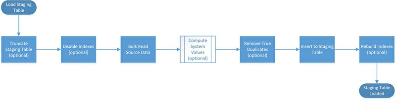
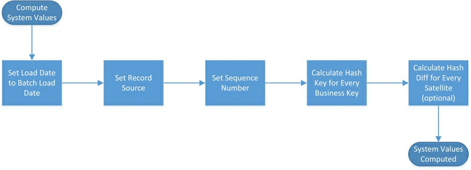
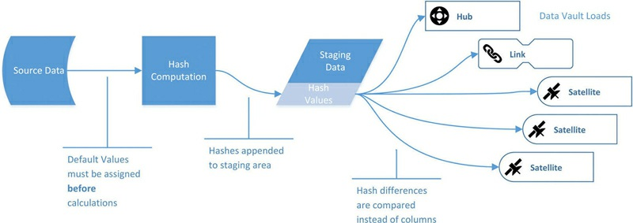
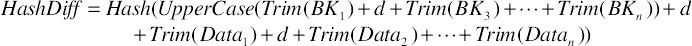

# Keboda数据建模Case--StageArea

## 1. 数据源

> 案例说明**
>
> 由于ESB接口未开发，本案例数据源暂时取自MySql数据库中的dv库。
>
> dv库现有数据来自[1. Keboda数据建模Case--源数据准备](http://47.99.104.128:8090/pages/viewpage.action?pageId=4391489&src=contextnavpagetreemode)

### 1.1 来料表头

| 字段名    | 数据类型 | 是否可空 | 备注         | 示例数据 |
| --------- | -------- | -------- | ------------ | -------- |
| CDANHAO   | VARCHAR  | 是       | 收料确认单号 |          |
| TC_WDE20  | DATE     | 是       | 收料确认时间 |          |
| TC_WDE21  | VARCHAR  | 是       | 收料人员     |          |
| TC_WDE200 | VARCHAR  | 是       | 状态         |          |
| CFLAG     | VARCHAR  | 是       | 单据性质     |          |
| TC_WDE51  | VARCHAR  | 是       | 备用字段1    |          |
| TC_WDE52  | VARCHAR  | 是       | 备用字段2    |          |
| TC_WDE53  | VARCHAR  | 是       | 备用字段3    |          |
| TC_WDE54  | VARCHAR  | 是       | 备用字段4    |          |

####  

### 1.2 来料表体

| 字段名       | 数据类型  | 是否可空 | 备注         | 示例数据 |
| ------------ | --------- | -------- | ------------ | -------- |
| CDANHAO      | VARCHAR   | 否       | 收料单号     |          |
| CBARCODENO   | VARCHAR   | 否       | 条码信息     |          |
| CBOXID       | VARCHAR   | 是       | 箱码         |          |
| CPRODUCENO   | VARCHAR   | 是       | 品号         |          |
| CPRODUCENAME | VARCHAR   | 是       | 品名         |          |
| CGUIGE       | VARCHAR   | 是       | 规格         |          |
| CDC          | VARCHAR   | 是       | DC           |          |
| IQTY         | DOUBLE(18 | 是       | 数量         |          |
| TC_WDF20     | DATE      | 是       | 收料确认时间 |          |
| TC_WDF21     | VARCHAR   | 是       | 收料人员     |          |
| TC_WDF200    | VARCHAR   | 是       | 状态         |          |
| CFLAG        | VARCHAR   | 是       | 单据性质     |          |
| TC_WDF51     | VARCHAR   | 是       | 质检货位     |          |
| TC_WDF52     | VARCHAR   | 是       | 备用字段2    |          |
| TC_WDF53     | VARCHAR   | 是       | 备用字段3    |          |
| TC_WDF54     | VARCHAR   | 是       | 备用字段4    |          |


## 2. 数据模型构建

#### 2.1 Hub实体业务键

| 实体                     | 业务主键            | HubBK        | HashKey        |
| ------------------------ | ------------------- | ------------ | -------------- |
| HubIM (IncomingMaterial) | CDANHAO收料确认单号 | IMHubBK      | IMHashKey      |
| HubBarCode               | CBARCODENO条码信息  | BarCodeHubBK | BarCodeHashKey |
| HubBox（暂时不纳入）     | CBOXID箱码          | BoxHubBK     | BoxHashKey     |
| HubProd（暂不纳入）      | CPRODUCENO品号      | ProdHubBK    | ProdHashKey    |

#### 2.2 Link链接表业务键

| **链接表** | 业务主键                             | LinkBK      | HashKey      |
| ---------- | ------------------------------------ | ----------- | ------------ |
| LinkIMBar  | CDANHAO;CBARCODENO;CBOXID;CPRODUCENO | IMBarLinkBK | IMBarHashKey |

#### 2.3 Sat附属表父键及主键约束

| **附属表** | **父键**       | 主键约束                 |
| ---------- | -------------- | ------------------------ |
| SatIM      | IMHashKey      | IMHashKey+Load date      |
| SatBarCode | BarCodeHashKey | BarCodeHashKey+Load date |
| SatIMBarCode | IMBarHashKey   | IMBarHashKey+Load date   |

## 3. StagingTable设计过程

### 3.1 StagingTable装载流程

> **The primary purpose** of the staging area is to reduce the workload onthe operational systems by loading all required data into a separatedatabase first.
>
> **Another purpose** of the staging area is to compute and add system-generated attributes to the incoming data.

> **Template for staging area loading**
>
> 

> **Compute system values subprocess.**
>
> 

### 3.2 Staging过程生成的相关属性

The following attributes are added in the **Compute System Values**subprocess:

| Atribute | Comment |
| -------- | ------- |
|Load date|the date and time when the batch arrived in the data warehouse (in the staging area). A batch includes all data that arrived as a set. In most cases, this includes all data in all flat files or relational tables from one source system.|
|Record source|a readable string that identifies the source system and the module or source table where the data comes from. This is used for debugging purposes only and should help your team to trace errors.|
|Sequence number|all records in a staging table are sequenced using a unique and ascending number. The purpose of this number is to recognize the order of the records in the source system and identify true duplicates, which are loaded to the staging area but not to downstream layers of the data warehouse. Note that the sequence number is not used for identification purposes of the record. |
|Hash keys|every business key in the Raw Data Vault is hashed for identification purposes. This includes composite keys and key combinations used in Data Vault links. Chapter 4, Data Vault 2.0 Modeling, discusses how hash keys are used in hubs and links for identification purposes.|
|Hash diffs|these keys are used to identify changes in descriptive attributes of satellite rows. |


> **Stage load hash computation**
>
> 
>





### 3.3 StagingTable设计

#### 3.3.1 来料表头 IMHeadStagingTable

##### 3.3.1.1 派生列（Derived Column ）

| Derived Column Name | Expression                                       | OutputColumn    |
| ------------------- | ------------------------------------------------ | --------------- |
| Sequence number     | 仅用于标记顺序，不用加载到DW中                   | Sequence number |
| LoadDate            | 针对每一个批次，生成一个系统当前时间作为LoadDate | LoadDate        |
| RecordSource        | “IMHead”                                         | RecordSource    |
| IMHubBK             | UPPER(TRIM(REPLACENULL(CDANHAO,"")))             | IMHashKey       |

##### 3.3.1.2 输出字段（InputAndOutputColumn）

| InputColumn     | OutputColumn | Expression/Comment |
| --------------- | ------------ | ------------ |
| Load date       |Load date                   | ${LoadTime} |
| Record source   |Record source               | 'IM.Header' |
| Sequence number |Sequence number             | i=1 , i++ |
| IMHubBK         |IMHashKey                     | md5.Hash(IMHubBK) |
| CDANHAO         |CDANHAO            | 收料确认单号 |
| TC_WDE20        |TC_WDE20           | 收料确认时间 |
| TC_WDE21        |TC_WDE21           | 收料人员     |
| TC_WDE200       |TC_WDE200          | 状态         |
| CFLAG           |CFLAG              | 单据性质     |
| TC_WDE51        |TC_WDE51           | 备用字段1    |
| TC_WDE52        |TC_WDE52           | 备用字段2    |
| TC_WDE53        |TC_WDE53           | 备用字段3    |
| TC_WDE54        |TC_WDE54           | 备用字段4    |

####  


#### 3.3.2 来料表头 IMHeadStagingTable

##### 3.3.2.1 派生列（Derived Column ）

| Derived Column Name | Expression                                                   | OutputColumn    |
| ------------------- | ------------------------------------------------------------ | --------------- |
| Sequence number     | 仅用于标记顺序，不用加载到DW中                               | Sequence number |
| LoadDate            | 针对每一个批次，生成一个系统当前时间作为LoadDate             | LoadDate        |
| RecordSource        | “BTS.OnTimeOnTimePerformance”                                | RecordSource    |
| IMHubBK             | UPPER(TRIM(REPLACENULL(CDANHAO,"")))                         | IMHashKey       |
| BarCodeHubBK        | UPPER(TRIM(REPLACENULL(CBARCODENO,"")))                      | BarCodeHashKey  |
| IMBarLinkBK         | UPPER(TRIM(REPLACENULL(CDANHAO,"")) + ";" +TRIM(REPLACENULL(CBARCODENO,""))); | IMBarHashKey    |

##### 3.3.2.2 输出字段（InputAndOutputColumn）

| InputColumn     | OutputColumn    | Expression             |
| --------------- | --------------- | ---------------------- |
| Load date       | Load date       | ${LoadTime}            |
| Record source   | Record source   | 'IM.Body'              |
| Sequence number | Sequence number | i=1 , i++              |
| IMHubBK         | IMHashKey       | md5.Hash(IMHubBK)      |
| BarCodeHubBK    | BarCodeHashKey  | md5.Hash(BarCodeHubBK) |
| IMBarLinkBK     | IMBarHashKey    | md5.Hash(IMBarLinkBK)  |
| CDANHAO      | CDANHAO      | 收料单号     |
| CBARCODENO   | CBARCODENO   | 条码信息     |
| CBOXID       | CBOXID       | 箱码         |
| CPRODUCENO   | CPRODUCENO   | 品号         |
| CPRODUCENAME | CPRODUCENAME | 品名         |
| CGUIGE       | CGUIGE       | 规格         |
| CDC          | CDC          | DC           |
| IQTY         | IQTY         | 数量         |
| TC_WDF20     | TC_WDF20     | 收料确认时间 |
| TC_WDF21     | TC_WDF21     | 收料人员     |
| TC_WDF200    | TC_WDF200    | 状态         |
| CFLAG        | CFLAG        | 单据性质     |
| TC_WDF51     | TC_WDF51     | 质检货位     |
| TC_WDF52     | TC_WDF52     | 备用字段2    |
| TC_WDF53     | TC_WDF53     | 备用字段3    |
| TC_WDF54     | TC_WDF54     | 备用字段4    |


####  


## 4.StagingTable

### 4.1 来料表头

| OutputColumn   | Comment                                          |
| -------------- | ------------------------------------------------ |
| SequenceNumber | 仅用于标记顺序，不用加载到DW中                   |
| LoadDate       | 针对每一个批次，生成一个系统当前时间作为LoadDate |
| RecordSource   | 'IM.Header'                                      |
| IMHashKey      | md5.Hash(IMHubBK(CDANHAO))                       |
| CDANHAO        | 收料确认单号                                     |
| TC_WDE20       | 收料确认时间                                     |
| TC_WDE21       | 收料人员                                         |
| TC_WDE200      | 状态                                             |
| CFLAG          | 单据性质                                         |
| TC_WDE51       | 备用字段1                                        |
| TC_WDE52       | 备用字段2                                        |
| TC_WDE53       | 备用字段3                                        |
| TC_WDE54       | 备用字段4                                        |

####  

### 4.2 来料表体

| OutputColumn    | Expression               |
| --------------- | ------------------------ |
| SequenceNumber | 仅用于标记顺序，不用加载到DW中 |
| LoadDate       | 针对每一个批次，生成一个系统当前时间作为LoadDate |
| RecordSource   | 'IM.Body'                |
| IMHashKey       | md5.Hash(IMHubBK(CDANHAO)) |
| BarCodeHashKey  | md5.Hash(BarCodeHubBK(CBARCODENO)) |
| IMBarHashKey    | md5.Hash(IMBarLinkBK(CDANHAO;CBARCODENO)) |
| CDANHAO      | 收料单号     |
| CBARCODENO   | 条码信息     |
| CBOXID       | 箱码         |
| CPRODUCENO   | 品号         |
| CPRODUCENAME | 品名         |
| CGUIGE       | 规格         |
| CDC          | DC           |
| IQTY         | 数量         |
| TC_WDF20     | 收料确认时间 |
| TC_WDF21     | 收料人员     |
| TC_WDF200    | 状态         |
| CFLAG        | 单据性质     |
| TC_WDF51     | 质检货位     |
| TC_WDF52     | 备用字段2    |
| TC_WDF53     | 备用字段3    |
| TC_WDF54     | 备用字段4    |

### 4.3 StagingTable建表语句

```MYSQL
SET FOREIGN_KEY_CHECKS=0;
-- ----------------------------
-- Table structure for IMHead
-- ----------------------------
DROP TABLE IF EXISTS `IMHead`;
CREATE TABLE `IMHead` (
  `SequenceNumber` varchar(50) NOT NULL COMMENT '序列号',
  `LoadDate` datetime NOT NULL COMMENT '加载时间',
  `RecordSource` varchar(50) DEFAULT NULL COMMENT '数据来源',
  `IMHashKey` varchar(50) DEFAULT NULL COMMENT '来料表键',
  `CDANHAO` varchar(30) DEFAULT NULL COMMENT '收料确认单号',
  `TC_WDE20` date DEFAULT NULL COMMENT '收料确认时间',
  `TC_WDE21` varchar(50) DEFAULT NULL COMMENT '收料人员',
  `TC_WDE200` varchar(1) DEFAULT NULL COMMENT '状态',
  `CFLAG` varchar(1) DEFAULT NULL COMMENT '单据性质',
  `TC_WDE51` varchar(50) DEFAULT NULL COMMENT '备用字段1',
  `TC_WDE52` varchar(50) DEFAULT NULL COMMENT '备用字段2',
  `TC_WDE53` varchar(50) DEFAULT NULL COMMENT '备用字段3',
  `TC_WDE54` varchar(50) DEFAULT NULL COMMENT '备用字段4',
  PRIMARY KEY (`SequenceNumber`,`LoadDate`)
) ENGINE=InnoDB DEFAULT CHARSET=utf8 COMMENT='收料确认表表头';
-- ----------------------------
-- Table structure for IMBody
-- ----------------------------
DROP TABLE IF EXISTS `IMBody`;
CREATE TABLE `IMBody` (
  `SequenceNumber` varchar(50) NOT NULL COMMENT '序列号',
  `LoadDate` datetime NOT NULL COMMENT '加载时间',
  `RecordSource` varchar(50) DEFAULT NULL COMMENT '数据来源',
  `IMHashKey` varchar(50) DEFAULT NULL COMMENT '来料表键',
  `BarCodeHashKey` varchar(50) DEFAULT NULL COMMENT '条码表键',
  `IMBarHashKey` varchar(50) DEFAULT NULL COMMENT '来料条码链接键',
  `CDANHAO` varchar(30) NOT NULL COMMENT '收料单号',
  `CBARCODENO` varchar(128) NOT NULL COMMENT '条码信息',
  `CBOXID` varchar(30) DEFAULT NULL COMMENT '箱码 ',
  `CPRODUCENO` varchar(50) DEFAULT NULL COMMENT '品号 ',
  `CPRODUCENAME` varchar(100) DEFAULT NULL COMMENT '品名 ',
  `CGUIGE` varchar(200) DEFAULT NULL COMMENT '规格 ',
  `CDC` varchar(12) DEFAULT NULL COMMENT 'DC ',
  `IQTY` double(18,4) DEFAULT NULL COMMENT '数量 ',
  `TC_WDF20` date DEFAULT NULL COMMENT '收料确认时间',
  `TC_WDF21` varchar(50) DEFAULT NULL COMMENT '收料人员',
  `TC_WDF200` varchar(1) DEFAULT NULL COMMENT '状态',
  `CFLAG` varchar(1) DEFAULT NULL COMMENT '单据性质',
  `TC_WDF51` varchar(50) DEFAULT NULL COMMENT '质检货位 ',
  `TC_WDF52` varchar(50) DEFAULT NULL COMMENT '备用字段2 ',
  `TC_WDF53` varchar(50) DEFAULT NULL COMMENT '备用字段3 ',
  `TC_WDF54` varchar(50) DEFAULT NULL COMMENT '备用字段4 ',
  PRIMARY KEY (`SequenceNumber`,`LoadDate`)
) ENGINE=InnoDB DEFAULT CHARSET=utf8 COMMENT='收料确认表表身';

```

