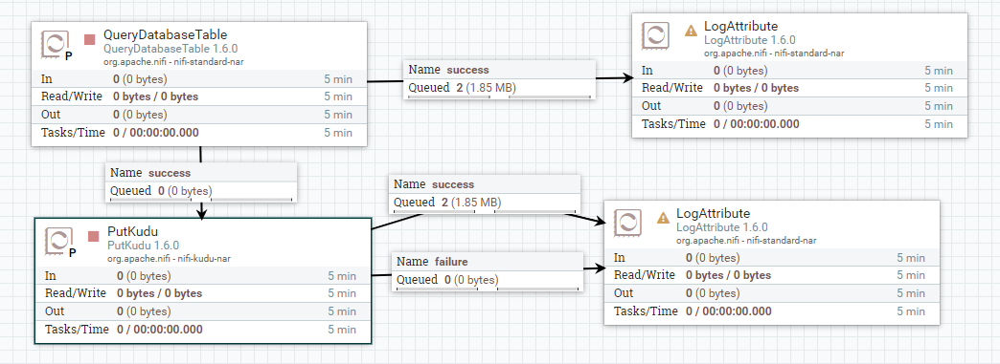
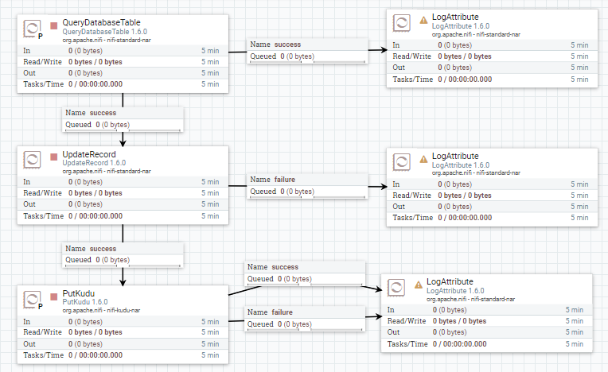

# Keboda数据建模Case--DataVault数据加载

## Hub实体表数据加载

### Load HubIM

QueryDatabaseTable --> PutKudu 

| 组件名             | 配置tab页  | 属性名                              | 属性值                                  |
| ------------------ | ---------- | ----------------------------------- | --------------------------------------- |
| QueryDatabaseTable | PROPERTIES | Database Connection Pooling Service | StageAreaDBCP                           |
| QueryDatabaseTable | PROPERTIES | Database Type                       | Generic                                 |
| QueryDatabaseTable | PROPERTIES | Table Name                          | IMHead                                  |
| QueryDatabaseTable | PROPERTIES | Columns to Return                   | imhashkey,loaddate,recordsource,cdanhao |
| QueryDatabaseTable | SCHEDULING | Run Schedule                        | 1 days                                  |

| 组件名             | 配置tab页  | 属性名                              | 属性值                                  |
| ------------------ | ---------- | ----------------------------------- | --------------------------------------- |
| PutKudu  | PROPERTIES | Kudu Masters | StageAreaDBCP                           |
| PutKudu  | PROPERTIES | Table Name                       | impala::dv_db.HubIM                                |
| PutKudu  | PROPERTIES | Insert Operation                          | Insert Operation                                 |
| PutKudu  | SCHEDULING | Run Schedule                        | 0 sec                                  |




## Sat附属表数据加载


### Load SatIM

QueryDatabaseTable --> UpdateRecord --> PutKudu 

| 组件名             | 配置tab页  | 属性名                              | 属性值                                                       |
| ------------------ | ---------- | ----------------------------------- | ------------------------------------------------------------ |
| QueryDatabaseTable | PROPERTIES | Database Connection Pooling Service | StageAreaDBCP                                                |
| QueryDatabaseTable | PROPERTIES | Database Type                       | Generic                                                      |
| QueryDatabaseTable | PROPERTIES | Table Name                          | IMHead                                                       |
| QueryDatabaseTable | PROPERTIES | Columns to Return                   | imhashkey,loaddate,recordsource,tc_wde20,tc_wde21,tc_wde200,cflag,tc_wde51,tc_wde52,tc_wde53,tc_wde54 |
| QueryDatabaseTable | SCHEDULING | Run Schedule                        | 1 days                                                       |

| 组件名       | 配置tab页  | 属性名                     | 属性值                                                       |
| ------------ | ---------- | -------------------------- | ------------------------------------------------------------ |
| UpdateRecord | PROPERTIES | Record Reader              | AvroReader                                                   |
| UpdateRecord | PROPERTIES | Record Writer              | AvroRecordSetWriter                                          |
| UpdateRecord | PROPERTIES | Replacement Value Strategy | Literal Value                                                |
| UpdateRecord | PROPERTIES | /tc_wde20                  | ${field.value:toDate("yyyy-MM-dd","GMT"):toNumber():divide(1000)} |


| 组件名  | 配置tab页  | 属性名           | 属性值              |
| ------- | ---------- | ---------------- | ------------------- |
| PutKudu | PROPERTIES | Kudu Masters     | StageAreaDBCP       |
| PutKudu | PROPERTIES | Table Name       | impala::dv_db.HubIM |
| PutKudu | PROPERTIES | Insert Operation | Insert Operation    |
| PutKudu | SCHEDULING | Run Schedule     | 0 sec               |




## 注意事项

### 问题二：日期格式问题

Kudu并不支持日期格式，所以日期需要转化为时间戳格式，

NiFi的ExpressionLanguage表达式支持日期格式转化： `${now():toNumber():divide(1000)}`

> 注意此处除以1000


### 问题一：NiFi正常插入的数据在Kudu中却查不到

**场景**：

某些情况下，NiFi会显示数据成功存入kudu数据库，查找NiFi组件以及Kudu组件的日志信息，也都查不到报错信息， 但是在kudu数据库中却诡异的查不到任何记录。

**问题分析**：

 此情况很可能由于所插入的数据不在kudu表的Range分区范围中， 比如：插入的记录中，时间范围不在Range所有分区指定的范围中，此时，NiFi会显示数据正常插入，但是Kudu却不会存入不在分区范围内的数据

例如：

```sql
-- 在hue中选中kudu数据表，并执行以下插入操作
INSERT INTO dv_db.hubim VALUES ('0010052bfbd3f24d716ce3ac52218be8111',15365928810111,'IM.Head','F339-161214006');
-- 此时 15365928810111 已经超出range范围，但是插入时仍然显示插入成功；
SELECT * FROM hubim where imhashkey='0010052bfbd3f24d716ce3ac52218be8111';
-- 此查询结果为 0 条记录；
```


