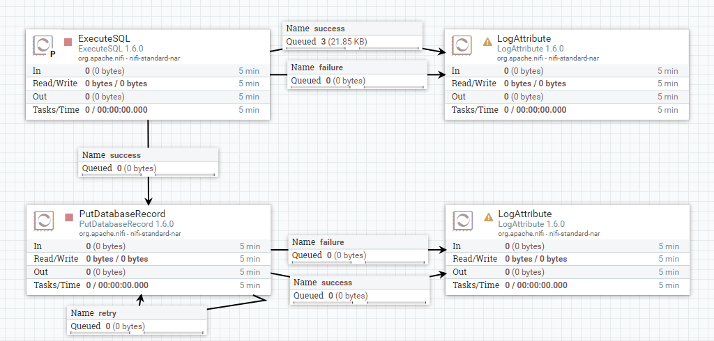

# Keboda数据建模Case--DataMart

## keboda来料单每日统计：

### 建表脚本

```sql
CREATE TABLE `IMDailyCount` (
`IMDate`  datetime NULL DEFAULT NULL ON UPDATE CURRENT_TIMESTAMP ,
`IMCount`  bigint(20) NULL DEFAULT NULL 
)
ENGINE=InnoDB
DEFAULT CHARACTER SET=utf8 COLLATE=utf8_general_ci
ROW_FORMAT=DYNAMIC
;
```


### 数据加载：

ExecuteSQL --> PutDatabaseRecord

| 组件名             | 配置tab页  | 属性名                              | 属性值                                  |
| ------------------ | ---------- | ----------------------------------- | --------------------------------------- |
| ExecuteSQL | PROPERTIES |Database Connection Pooling Service|DBCPForImpala|
| ExecuteSQL | PROPERTIES |SQL select query|SELECT from_unixtime(tc_wde20,"yyyy-MM-dd") as IMDate, count(1) as IMCount FROM dv_db.satim GROUP BY tc_wde20|
| ExecuteSQL | PROPERTIES |Max Wait Time|0 seconds|
| ExecuteSQL | PROPERTIES |Normalize Table/Column Names|false|
| ExecuteSQL | PROPERTIES |Use Avro Logical Types|false|
| ExecuteSQL | PROPERTIES |Default Decimal Precision|10|
| ExecuteSQL | SCHEDULING |Default Decimal Scale|0|


| 组件名            | 配置tab页  | 属性名                              | 属性值        |
| ----------------- | ---------- | ----------------------------------- | ------------- |
| PutDatabaseRecord | PROPERTIES | Record Reader                       | AvroReader    |
| PutDatabaseRecord | PROPERTIES | Statement Type                      | INSERT        |
| PutDatabaseRecord | PROPERTIES | Database Connection Pooling Service | DataMart_DBCP |
| PutDatabaseRecord | PROPERTIES | Table Name                          | IMDailyCount  |


