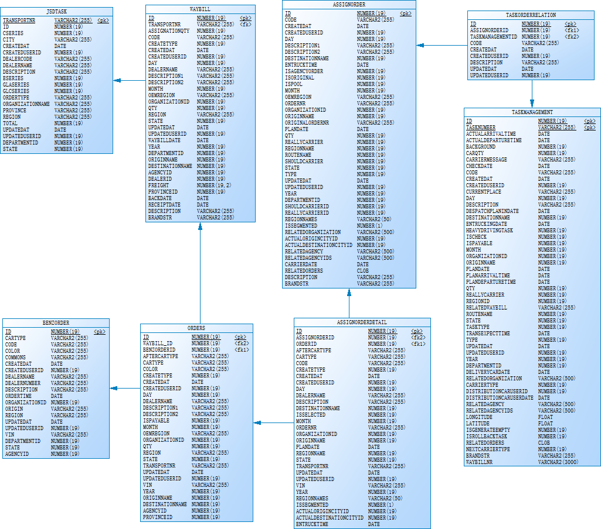
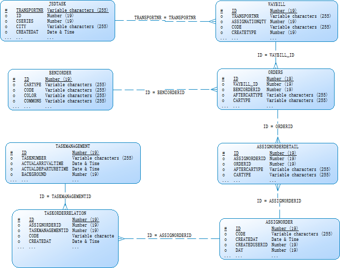
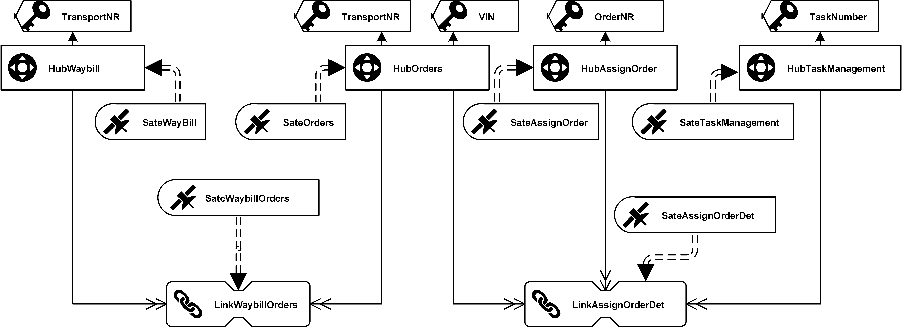

# TMS建模

## 整体建模流程：

1. 业务流程梳理

2. 画出ER图

3. 识别出中心表及业务主键

4. 梳理业务关系并识别出链接表

5. 添加附属表

6. 完成DV建模

7. 设计StagingTable

8. 数据库实施(开发DDL建库建表等相关脚本)


## 2. 模型图

### 物理数据模型（PDM）

> 京顺达物理数据模型（PDM）
>
> 


> **注： 关于PDM、ER图的设计/导出**
>
> 可参见Confluence中PowerDesigner专题文档，下面ER图同样可参考该专题，对于表格，实体，关系，引用，键值等相关部分的显示效果，可从画布右键菜单中的`Display Preference`中设置调整；


### ER图

> 京顺达ER图
>
> 

### DV模型图
> 京顺达DV模型图
>
> 


## 3.中心表


| name     | code              | BK                      | PK            |
| -------- | ----------------- | ----------------------- | ------------- |
| 运单表   | HubWayBill        | TransportNR(运单号)     | WayBillHK     |
| 运单明细 | HubOrder          | TransportNR(运单号)+VIN | OrderHK       |
| 订单表   | HubAssignOrder    | OrderNR                 | AssignOrderHK |
| 任务管理 | HubTaskManagement | TaskNumber              | TaskHK        |

>以下表暂未纳入
>| name       | code         | BK                      | PK          |
>| ---------- | ------------ | ----------------------- | ----------- |
>| 任务计划表 | HubJsdTask   | TransportNR(运单号)     | JsdTaskHK   |
>| 制单表     | HubBenzOrder | TransportNR(运单号)+VIN | BenzOrderHK |


## 4.链表

| name               | code                  | BK                                          | PK                  | FK                          |
| ------------------ | --------------------- | ------------------------------------------- | ------------------- | --------------------------- |
| 运单明细链接表     | LinkWaybillOrder      | TransportNR,      TransportNR,      VIN     | WaybillOrderHK      | WayBillHK,      OrderHK     |
| 订单拼单链接表     | LinkOrdersAssignOrder | TransportNR(运单号),      VIN,      OrderNR | AssignOrderDetailHK | OrderHK,      AssignOrderHK |
| 辅助订单任务链接表 | LinkAssignOrderTask   | OrderNR,      TaskNumber                    | AssignOrderTaskHK   | OrderHK,      TaskHK        |

## 5. 附属表

| name           | code               | PK                  | FK                  |
| -------------- | ------------------ | ------------------- | ------------------- |
| 运单附属表     | SateWaybill        | WayBillHK, loadDate | WayBillHK           |
| 运单明细附属表 | SateOrder          |   OrderHK, loadDate                    | OrderHK             |
| 辅助订单附属表 | SateAssignOrder    |   AssignOrderHK, loadDate              | AssignOrderHK       |
| 订单拼单附属表 | SateAssignOrderDet |   AssignOrderDetailHK, loadDate        | AssignOrderDetailHK |
| 任务附属表     | SateTaskManagement | TaskHK, loadDate | TaskHK                               |


## 6.StagingTables设计

### 6.1 设计流程

1. 确定所要导入模块设计范围
2. 通过各表间的关联关系，开发连表查询脚本语句
3. 初步建立StagingTable
4. 对比DV模型，提取出各个派生列（Derived Column）
5. 确定StagingTable结构
6. 开发StagingTable建表简本语句

### 6.2 涉及表

| table             | alias |
| ----------------- | ----- |
| WAYBILL           | w     |
| ORDERS            | o     |
| ASSIGNORDER       | ao    |
| ASSIGNORDERDETAIL | ad    |
| TASKORDERRELATION | tskod |
| TASKMANAGEMENT    | tsk   |

### 6.3 关联查询

```sql
SELECT 
w.ID as w_SEQ
,w.ASSIGNATIONQTY as w_ASSIGNATIONQTY
,w.CODE as w_CODE
,w.CREATETYPE as w_CREATETYPE
,w.CREATEDAT as w_CREATEDAT
,w.CREATEDUSERID as w_CREATEDUSERSEQ
,w.DAY as w_DAY
,w.DEALERNAME as w_DEALERNAME
,w.DESCRIPTION1 as w_DESCRIPTION1
,w.DESCRIPTION2 as w_DESCRIPTION2
,w.MONTH as w_MONTH
,w.OEMREGION as w_OEMREGION
,w.ORGANIZATIONID as w_ORGANIZATIONSEQ
,w.QTY as w_QTY
,w.REGION as w_REGION
,w.STATE as w_STATE
,w.TRANSPORTNR as w_TRANSPORTNR
,w.UPDATEDAT as w_UPDATEDAT
,w.UPDATEDUSERID as w_UPDATEDUSERSEQ
,w.WAYBILLDATE as w_WAYBILLDATE
,w.YEAR as w_YEAR
,w.DEPARTMENTID as w_DEPARTMENTSEQ
,w.ORIGINNAME as w_ORIGINNAME
,w.DESTINATIONNAME as w_DESTINATIONNAME
,w.AGENCYID as w_AGENCYSEQ
,w.DEALERID as w_DEALERSEQ
,w.FREIGHT as w_FREIGHT
,w.PROVINCEID as w_PROVINCESEQ
,w.BACKDATE as w_BACKDATE
,w.RECEIPTDATE as w_RECEIPTDATE
,w.DESCRIPTION as w_DESCRIPTION
,w.BRANDSTR as w_BRANDSTR
,o.ID as o_SEQ
,o.AFTERCARTYPE as o_AFTERCARTYPE
,o.CARTYPE as o_CARTYPE
,o.COLOR as o_COLOR
,o.CREATETYPE as o_CREATETYPE
,o.CREATEDAT as o_CREATEDAT
,o.CREATEDUSERID as o_CREATEDUSERSEQ
,o.DAY as o_DAY
,o.DEALERNAME as o_DEALERNAME
,o.DESCRIPTION1 as o_DESCRIPTION1
,o.DESCRIPTION2 as o_DESCRIPTION2
,o.ISPAYABLE as o_ISPAYABLE
,o.MONTH as o_MONTH
,o.OEMREGION as o_OEMREGION
,o.ORGANIZATIONID as o_ORGANIZATIONSEQ
,o.QTY as o_QTY
,o.REGION as o_REGION
,o.STATE as o_STATE
,o.TRANSPORTNR as o_TRANSPORTNR
,o.UPDATEDAT as o_UPDATEDAT
,o.UPDATEDUSERID as o_UPDATEDUSERSEQ
,o.VIN as o_VIN
,o.YEAR as o_YEAR
,o.WAYBILL_ID as o_WAYBILL_SEQ
,o.ORIGINNAME as o_ORIGINNAME
,o.DESTINATIONNAME as o_DESTINATIONNAME
,o.AGENCYID as o_AGENCYSEQ
,o.BENZORDERID as o_BENZORDERSEQ
,o.PROVINCEID as o_PROVINCESEQ
,ao.ID as ao_SEQ
,ao.CODE as ao_CODE
,ao.CREATEDAT as ao_CREATEDAT
,ao.CREATEDUSERID as ao_CREATEDUSERSEQ
,ao.DAY as ao_DAY
,ao.DESCRIPTION1 as ao_DESCRIPTION1
,ao.DESCRIPTION2 as ao_DESCRIPTION2
,ao.DESTINATIONNAME as ao_DESTINATIONNAME
,ao.ENTRUCKTIME as ao_ENTRUCKTIME
,ao.ISAGENCYORDER as ao_ISAGENCYORDER
,ao.ISORIGINAL as ao_ISORIGINAL
,ao.ISPOOL as ao_ISPOOL
,ao.MONTH as ao_MONTH
,ao.OEMREGION as ao_OEMREGION
,ao.ORDERNR as ao_ORDERNR
,ao.ORGANIZATIONID as ao_ORGANIZATIONSEQ
,ao.ORIGINNAME as ao_ORIGINNAME
,ao.ORIGINALORDERNR as ao_ORIGINALORDERNR
,ao.PLANDATE as ao_PLANDATE
,ao.QTY as ao_QTY
,ao.REALLYCARRIER as ao_REALLYCARRIER
,ao.REGIONNAME as ao_REGIONNAME
,ao.ROUTENAME as ao_ROUTENAME
,ao.SHOULDCARRIER as ao_SHOULDCARRIER
,ao.STATE as ao_STATE
,ao.TYPE as ao_TYPE
,ao.UPDATEDAT as ao_UPDATEDAT
,ao.UPDATEDUSERID as ao_UPDATEDUSERSEQ
,ao.YEAR as ao_YEAR
,ao.DEPARTMENTID as ao_DEPARTMENTSEQ
,ao.SHOULDCARRIERID as ao_SHOULDCARRIERSEQ
,ao.REALLYCARRIERID as ao_REALLYCARRIERSEQ
,ao.REGIONNAMES as ao_REGIONNAMES
,ao.ISSEGMENTED as ao_ISSEGMENTED
,ao.RELATEDORGANIZATION as ao_RELATEDORGANIZATION
,ao.ACTUALORIGINCITYID as ao_ACTUALORIGINCITYSEQ
,ao.ACTUALDESTINATIONCITYID as ao_ACTUALDESTINATIONCITYSEQ
,ao.RELATEDAGENCY as ao_RELATEDAGENCY
,ao.RELATEDAGENCYIDS as ao_RELATEDAGENCYSEQS
,ao.CARRIERDATE as ao_CARRIERDATE
,ao.RELATEDORDERS as ao_RELATEDORDERS
,ao.DESCRIPTION as ao_DESCRIPTION
,ao.BRANDSTR as ao_BRANDSTR
,ad.ID as ad_SEQ
,ad.AFTERCARTYPE as ad_AFTERCARTYPE
,ad.CARTYPE as ad_CARTYPE
,ad.CODE as ad_CODE
,ad.CREATETYPE as ad_CREATETYPE
,ad.CREATEDAT as ad_CREATEDAT
,ad.CREATEDUSERID as ad_CREATEDUSERSEQ
,ad.DAY as ad_DAY
,ad.DEALERNAME as ad_DEALERNAME
,ad.DESCRIPTION as ad_DESCRIPTION
,ad.DESTINATIONNAME as ad_DESTINATIONNAME
,ad.ISSELECTED as ad_ISSELECTED
,ad.MONTH as ad_MONTH
,ad.ORDERID as ad_ORDERSEQ
,ad.ORDERNR as ad_ORDERNR
,ad.ORGANIZATIONID as ad_ORGANIZATIONSEQ
,ad.ORIGINNAME as ad_ORIGINNAME
,ad.PLANDATE as ad_PLANDATE
,ad.REGIONNAME as ad_REGIONNAME
,ad.STATE as ad_STATE
,ad.TRANSPORTNR as ad_TRANSPORTNR
,ad.UPDATEDAT as ad_UPDATEDAT
,ad.UPDATEDUSERID as ad_UPDATEDUSERSEQ
,ad.VIN as ad_VIN
,ad.YEAR as ad_YEAR
,ad.REGIONNAMES as ad_REGIONNAMES
,ad.ISSEGMENTED as ad_ISSEGMENTED
,ad.ASSIGNORDERID as ad_ASSIGNORDERSEQ
,ad.ACTUALORIGINCITYID as ad_ACTUALORIGINCITYSEQ
,ad.ACTUALDESTINATIONCITYID as ad_ACTUALDESTINATIONCITYSEQ
,ad.ENTRUCKTIME as ad_ENTRUCKTIME
,tskod.ID as tskod_SEQ
,tskod.ASSIGNORDERID as tskod_ASSIGNORDERSEQ
,tskod.CODE as tskod_CODE
,tskod.CREATEDAT as tskod_CREATEDAT
,tskod.CREATEDUSERID as tskod_CREATEDUSERSEQ
,tskod.DESCRIPTION as tskod_DESCRIPTION
,tskod.TASKMANAGEMENTID as tskod_TASKMANAGEMENTSEQ
,tskod.UPDATEDAT as tskod_UPDATEDAT
,tskod.UPDATEDUSERID as tskod_UPDATEDUSERSEQ
,tsk.ID as tsk_SEQ
,tsk.ACTUALARRIVALTIME as tsk_ACTUALARRIVALTIME
,tsk.ACTUALDEPARTURETIME as tsk_ACTUALDEPARTURETIME
,tsk.BACKGROUND as tsk_BACKGROUND
,tsk.CARQTY as tsk_CARQTY
,tsk.CARRIERMESSAGE as tsk_CARRIERMESSAGE
,tsk.CHECKDATE as tsk_CHECKDATE
,tsk.CODE as tsk_CODE
,tsk.CREATEDAT as tsk_CREATEDAT
,tsk.CREATEDUSERID as tsk_CREATEDUSERSEQ
,tsk.CURRENTPLACE as tsk_CURRENTPLACE
,tsk.DAY as tsk_DAY
,tsk.DESCRIPTION as tsk_DESCRIPTION
,tsk.DESPATCHPLANINDATE as tsk_DESPATCHPLANINDATE
,tsk.DESTINATIONNAME as tsk_DESTINATIONNAME
,tsk.ENTRUCKINGDATE as tsk_ENTRUCKINGDATE
,tsk.HEAVYDRIVINGTASK as tsk_HEAVYDRIVINGTASK
,tsk.ISCHECK as tsk_ISCHECK
,tsk.ISPAYABLE as tsk_ISPAYABLE
,tsk.MONTH as tsk_MONTH
,tsk.ORGANIZATIONID as tsk_ORGANIZATIONSEQ
,tsk.ORIGINNAME as tsk_ORIGINNAME
,tsk.PLANDATE as tsk_PLANDATE
,tsk.PLANARRIVALTIME as tsk_PLANARRIVALTIME
,tsk.PLANDEPARTURETIME as tsk_PLANDEPARTURETIME
,tsk.QTY as tsk_QTY
,tsk.REALLYCARRIER as tsk_REALLYCARRIER
,tsk.REGIONID as tsk_REGIONSEQ
,tsk.RELATEDWAYBILL as tsk_RELATEDWAYBILL
,tsk.ROUTENAME as tsk_ROUTENAME
,tsk.STATE as tsk_STATE
,tsk.TASKNUMBER as tsk_TASKNUMBER
,tsk.TASKTYPE as tsk_TASKTYPE
,tsk.TRANSEXPECTTIME as tsk_TRANSEXPECTTIME
,tsk.TYPE as tsk_TYPE
,tsk.UPDATEDAT as tsk_UPDATEDAT
,tsk.UPDATEDUSERID as tsk_UPDATEDUSERSEQ
,tsk.YEAR as tsk_YEAR
,tsk.DEPARTMENTID as tsk_DEPARTMENTSEQ
,tsk.DELIVERYCARDATE as tsk_DELIVERYCARDATE
,tsk.RELATEDORGANIZATION as tsk_RELATEDORGANIZATION
,tsk.CARRIERTYPE as tsk_CARRIERTYPE
,tsk.DISTRIBUTIONCARUSERID as tsk_DISTRIBUTIONCARUSERSEQ
,tsk.DISTRIBUTIONCARUSERDATE as tsk_DISTRIBUTIONCARUSERDATE
,tsk.RELATEDAGENCY as tsk_RELATEDAGENCY
,tsk.RELATEDAGENCYIDS as tsk_RELATEDAGENCYSEQS
,tsk.LONGITUDE as tsk_LONGITUDE
,tsk.LATITUDE as tsk_LATITUDE
,tsk.ISGENERATEEMPTY as tsk_ISGENERATEEMPTY
,tsk.ISROLLBACKTASK as tsk_ISROLLBACKTASK
,tsk.RELATEDORDERS as tsk_RELATEDORDERS
,tsk.NEXTCARRIERTYPE as tsk_NEXTCARRIERTYPE
,tsk.BRANDSTR as tsk_BRANDSTR
,tsk.WAYBILLNR as tsk_WAYBILLNR

from WAYBILL w 
LEFT JOIN ORDERS o on (w.transportnr = o.transportnr)
LEFT JOIN ASSIGNORDERDETAIL ad on ( o.VIN = ad.VIN and o.transportnr = ad.transportnr )
LEFT JOIN ASSIGNORDER ao on (AD.ORDERNR=AO.ORDERNR)
LEFT JOIN TASKORDERRELATION tskod on (AO."ID"=TSKOD.ASSIGNORDERID)
LEFT JOIN TASKMANAGEMENT tsk on (TSKOD.TASKMANAGEMENTID=TSK."ID")
where 
-- w.CREATEDAT > TO_DATE('2018-06-01', 'yyyy-mm-dd')
-- w.CREATEDAT > TO_DATE('2018-10-14', 'yyyy-mm-dd')
w.TRANSPORTNR in ('B20180000027310','B20180000027242')
```

### 6.4 Columns From TMS

| 来源 | 字段                        | 类型     | 长度 |
| ---- | --------------------------- | -------- | ---- |
| TMS  | w_SEQ                       | NUMBER   | 19   |
| TMS  | w_ASSIGNATIONQTY            | NUMBER   | 19   |
| TMS  | w_CODE                      | VARCHAR2 | 255  |
| TMS  | w_CREATETYPE                | NUMBER   | 19   |
| TMS  | w_CREATEDAT                 | DATE     | 7    |
| TMS  | w_CREATEDUSERSEQ            | NUMBER   | 19   |
| TMS  | w_DAY                       | NUMBER   | 19   |
| TMS  | w_DEALERNAME                | VARCHAR2 | 255  |
| TMS  | w_DESCRIPTION1              | VARCHAR2 | 255  |
| TMS  | w_DESCRIPTION2              | VARCHAR2 | 255  |
| TMS  | w_MONTH                     | NUMBER   | 19   |
| TMS  | w_OEMREGION                 | VARCHAR2 | 255  |
| TMS  | w_ORGANIZATIONSEQ           | NUMBER   | 19   |
| TMS  | w_QTY                       | NUMBER   | 19   |
| TMS  | w_REGION                    | VARCHAR2 | 255  |
| TMS  | w_STATE                     | NUMBER   | 19   |
| TMS  | w_TRANSPORTNR               | VARCHAR2 | 255  |
| TMS  | w_UPDATEDAT                 | DATE     | 7    |
| TMS  | w_UPDATEDUSERSEQ            | NUMBER   | 19   |
| TMS  | w_WAYBILLDATE               | DATE     | 7    |
| TMS  | w_YEAR                      | NUMBER   | 19   |
| TMS  | w_DEPARTMENTSEQ             | NUMBER   | 19   |
| TMS  | w_ORIGINNAME                | NUMBER   | 19   |
| TMS  | w_DESTINATIONNAME           | NUMBER   | 19   |
| TMS  | w_AGENCYSEQ                 | NUMBER   | 19   |
| TMS  | w_DEALERSEQ                 | NUMBER   | 19   |
| TMS  | w_FREIGHT                   | NUMBER   | 19   |
| TMS  | w_PROVINCESEQ               | NUMBER   | 19   |
| TMS  | w_BACKDATE                  | DATE     | 7    |
| TMS  | w_RECEIPTDATE               | DATE     | 7    |
| TMS  | w_DESCRIPTION               | VARCHAR2 | 255  |
| TMS  | w_BRANDSTR                  | VARCHAR2 | 255  |
| TMS  | o_SEQ                       | NUMBER   | 19   |
| TMS  | o_AFTERCARTYPE              | VARCHAR2 | 255  |
| TMS  | o_CARTYPE                   | VARCHAR2 | 255  |
| TMS  | o_COLOR                     | VARCHAR2 | 255  |
| TMS  | o_CREATETYPE                | NUMBER   | 19   |
| TMS  | o_CREATEDAT                 | DATE     | 7    |
| TMS  | o_CREATEDUSERSEQ            | NUMBER   | 19   |
| TMS  | o_DAY                       | NUMBER   | 19   |
| TMS  | o_DEALERNAME                | VARCHAR2 | 255  |
| TMS  | o_DESCRIPTION1              | VARCHAR2 | 255  |
| TMS  | o_DESCRIPTION2              | VARCHAR2 | 255  |
| TMS  | o_ISPAYABLE                 | NUMBER   | 19   |
| TMS  | o_MONTH                     | NUMBER   | 19   |
| TMS  | o_OEMREGION                 | VARCHAR2 | 255  |
| TMS  | o_ORGANIZATIONSEQ           | NUMBER   | 19   |
| TMS  | o_QTY                       | NUMBER   | 19   |
| TMS  | o_REGION                    | VARCHAR2 | 255  |
| TMS  | o_STATE                     | NUMBER   | 19   |
| TMS  | o_TRANSPORTNR               | VARCHAR2 | 255  |
| TMS  | o_UPDATEDAT                 | DATE     | 7    |
| TMS  | o_UPDATEDUSERSEQ            | NUMBER   | 19   |
| TMS  | o_VIN                       | VARCHAR2 | 255  |
| TMS  | o_YEAR                      | NUMBER   | 19   |
| TMS  | o_WAYBILL_SEQ               | NUMBER   | 19   |
| TMS  | o_ORIGINNAME                | NUMBER   | 19   |
| TMS  | o_DESTINATIONNAME           | NUMBER   | 19   |
| TMS  | o_AGENCYSEQ                 | NUMBER   | 19   |
| TMS  | o_BENZORDERSEQ              | NUMBER   | 19   |
| TMS  | o_PROVINCESEQ               | NUMBER   | 19   |
| TMS  | ao_SEQ                      | NUMBER   | 19   |
| TMS  | ao_CODE                     | VARCHAR2 | 255  |
| TMS  | ao_CREATEDAT                | DATE     | 7    |
| TMS  | ao_CREATEDUSERSEQ           | NUMBER   | 19   |
| TMS  | ao_DAY                      | NUMBER   | 19   |
| TMS  | ao_DESCRIPTION1             | VARCHAR2 | 255  |
| TMS  | ao_DESCRIPTION2             | VARCHAR2 | 255  |
| TMS  | ao_DESTINATIONNAME          | NUMBER   | 19   |
| TMS  | ao_ENTRUCKTIME              | DATE     | 7    |
| TMS  | ao_ISAGENCYORDER            | NUMBER   | 19   |
| TMS  | ao_ISORIGINAL               | NUMBER   | 19   |
| TMS  | ao_ISPOOL                   | NUMBER   | 19   |
| TMS  | ao_MONTH                    | NUMBER   | 19   |
| TMS  | ao_OEMREGION                | VARCHAR2 | 255  |
| TMS  | ao_ORDERNR                  | VARCHAR2 | 255  |
| TMS  | ao_ORGANIZATIONSEQ          | NUMBER   | 19   |
| TMS  | ao_ORIGINNAME               | NUMBER   | 19   |
| TMS  | ao_ORIGINALORDERNR          | VARCHAR2 | 255  |
| TMS  | ao_PLANDATE                 | DATE     | 7    |
| TMS  | ao_QTY                      | NUMBER   | 19   |
| TMS  | ao_REALLYCARRIER            | NUMBER   | 19   |
| TMS  | ao_REGIONNAME               | NUMBER   | 19   |
| TMS  | ao_ROUTENAME                | NUMBER   | 19   |
| TMS  | ao_SHOULDCARRIER            | NUMBER   | 19   |
| TMS  | ao_STATE                    | NUMBER   | 19   |
| TMS  | ao_TYPE                     | NUMBER   | 19   |
| TMS  | ao_UPDATEDAT                | DATE     | 7    |
| TMS  | ao_UPDATEDUSERSEQ           | NUMBER   | 19   |
| TMS  | ao_YEAR                     | NUMBER   | 19   |
| TMS  | ao_DEPARTMENTSEQ            | NUMBER   | 19   |
| TMS  | ao_SHOULDCARRIERSEQ         | NUMBER   | 19   |
| TMS  | ao_REALLYCARRIERSEQ         | NUMBER   | 19   |
| TMS  | ao_REGIONNAMES              | VARCHAR2 | 50   |
| TMS  | ao_ISSEGMENTED              | NUMBER   | 1    |
| TMS  | ao_RELATEDORGANIZATION      | VARCHAR2 | 500  |
| TMS  | ao_ACTUALORIGINCITYSEQ      | NUMBER   | 19   |
| TMS  | ao_ACTUALDESTINATIONCITYSEQ | NUMBER   | 19   |
| TMS  | ao_RELATEDAGENCY            | VARCHAR2 | 500  |
| TMS  | ao_RELATEDAGENCYSEQS        | VARCHAR2 | 500  |
| TMS  | ao_CARRIERDATE              | DATE     | 7    |
| TMS  | ao_RELATEDORDERS            | CLOB     | 4000 |
| TMS  | ao_DESCRIPTION              | VARCHAR2 | 255  |
| TMS  | ao_BRANDSTR                 | VARCHAR2 | 255  |
| TMS  | ad_SEQ                      | NUMBER   | 19   |
| TMS  | ad_AFTERCARTYPE             | VARCHAR2 | 255  |
| TMS  | ad_CARTYPE                  | VARCHAR2 | 255  |
| TMS  | ad_CODE                     | VARCHAR2 | 255  |
| TMS  | ad_CREATETYPE               | NUMBER   | 19   |
| TMS  | ad_CREATEDAT                | DATE     | 7    |
| TMS  | ad_CREATEDUSERSEQ           | NUMBER   | 19   |
| TMS  | ad_DAY                      | NUMBER   | 19   |
| TMS  | ad_DEALERNAME               | VARCHAR2 | 255  |
| TMS  | ad_DESCRIPTION              | VARCHAR2 | 255  |
| TMS  | ad_DESTINATIONNAME          | NUMBER   | 19   |
| TMS  | ad_ISSELECTED               | NUMBER   | 19   |
| TMS  | ad_MONTH                    | NUMBER   | 19   |
| TMS  | ad_ORDERSEQ                 | NUMBER   | 19   |
| TMS  | ad_ORDERNR                  | VARCHAR2 | 255  |
| TMS  | ad_ORGANIZATIONSEQ          | NUMBER   | 19   |
| TMS  | ad_ORIGINNAME               | NUMBER   | 19   |
| TMS  | ad_PLANDATE                 | DATE     | 7    |
| TMS  | ad_REGIONNAME               | NUMBER   | 19   |
| TMS  | ad_STATE                    | NUMBER   | 19   |
| TMS  | ad_TRANSPORTNR              | VARCHAR2 | 255  |
| TMS  | ad_UPDATEDAT                | DATE     | 7    |
| TMS  | ad_UPDATEDUSERSEQ           | NUMBER   | 19   |
| TMS  | ad_VIN                      | VARCHAR2 | 255  |
| TMS  | ad_YEAR                     | NUMBER   | 19   |
| TMS  | ad_REGIONNAMES              | VARCHAR2 | 50   |
| TMS  | ad_ISSEGMENTED              | NUMBER   | 1    |
| TMS  | ad_ASSIGNORDERSEQ           | NUMBER   | 19   |
| TMS  | ad_ACTUALORIGINCITYSEQ      | NUMBER   | 19   |
| TMS  | ad_ACTUALDESTINATIONCITYSEQ | NUMBER   | 19   |
| TMS  | ad_ENTRUCKTIME              | DATE     | 7    |
| TMS  | tskod_SEQ                   | NUMBER   | 19   |
| TMS  | tskod_ASSIGNORDERSEQ        | NUMBER   | 19   |
| TMS  | tskod_CODE                  | VARCHAR2 | 255  |
| TMS  | tskod_CREATEDAT             | DATE     | 7    |
| TMS  | tskod_CREATEDUSERSEQ        | NUMBER   | 19   |
| TMS  | tskod_DESCRIPTION           | VARCHAR2 | 255  |
| TMS  | tskod_TASKMANAGEMENTSEQ     | NUMBER   | 19   |
| TMS  | tskod_UPDATEDAT             | DATE     | 7    |
| TMS  | tskod_UPDATEDUSERSEQ        | NUMBER   | 19   |
| TMS  | tsk_SEQ                     | NUMBER   | 19   |
| TMS  | tsk_ACTUALARRIVALTIME       | DATE     | 7    |
| TMS  | tsk_ACTUALDEPARTURETIME     | DATE     | 7    |
| TMS  | tsk_BACKGROUND              | NUMBER   | 19   |
| TMS  | tsk_CARQTY                  | NUMBER   | 19   |
| TMS  | tsk_CARRIERMESSAGE          | VARCHAR2 | 255  |
| TMS  | tsk_CHECKDATE               | DATE     | 7    |
| TMS  | tsk_CODE                    | VARCHAR2 | 255  |
| TMS  | tsk_CREATEDAT               | DATE     | 7    |
| TMS  | tsk_CREATEDUSERSEQ          | NUMBER   | 19   |
| TMS  | tsk_CURRENTPLACE            | VARCHAR2 | 255  |
| TMS  | tsk_DAY                     | NUMBER   | 19   |
| TMS  | tsk_DESCRIPTION             | VARCHAR2 | 255  |
| TMS  | tsk_DESPATCHPLANINDATE      | DATE     | 7    |
| TMS  | tsk_DESTINATIONNAME         | NUMBER   | 19   |
| TMS  | tsk_ENTRUCKINGDATE          | DATE     | 7    |
| TMS  | tsk_HEAVYDRIVINGTASK        | NUMBER   | 19   |
| TMS  | tsk_ISCHECK                 | NUMBER   | 19   |
| TMS  | tsk_ISPAYABLE               | NUMBER   | 19   |
| TMS  | tsk_MONTH                   | NUMBER   | 19   |
| TMS  | tsk_ORGANIZATIONSEQ         | NUMBER   | 19   |
| TMS  | tsk_ORIGINNAME              | NUMBER   | 19   |
| TMS  | tsk_PLANDATE                | DATE     | 7    |
| TMS  | tsk_PLANARRIVALTIME         | DATE     | 7    |
| TMS  | tsk_PLANDEPARTURETIME       | DATE     | 7    |
| TMS  | tsk_QTY                     | NUMBER   | 19   |
| TMS  | tsk_REALLYCARRIER           | NUMBER   | 19   |
| TMS  | tsk_REGIONSEQ               | NUMBER   | 19   |
| TMS  | tsk_RELATEDWAYBILL          | VARCHAR2 | 255  |
| TMS  | tsk_ROUTENAME               | NUMBER   | 19   |
| TMS  | tsk_STATE                   | NUMBER   | 19   |
| TMS  | tsk_TASKNUMBER              | VARCHAR2 | 255  |
| TMS  | tsk_TASKTYPE                | NUMBER   | 19   |
| TMS  | tsk_TRANSEXPECTTIME         | DATE     | 7    |
| TMS  | tsk_TYPE                    | NUMBER   | 19   |
| TMS  | tsk_UPDATEDAT               | DATE     | 7    |
| TMS  | tsk_UPDATEDUSERSEQ          | NUMBER   | 19   |
| TMS  | tsk_YEAR                    | NUMBER   | 19   |
| TMS  | tsk_DEPARTMENTSEQ           | NUMBER   | 19   |
| TMS  | tsk_DELIVERYCARDATE         | DATE     | 7    |
| TMS  | tsk_RELATEDORGANIZATION     | VARCHAR2 | 500  |
| TMS  | tsk_CARRIERTYPE             | NUMBER   | 19   |
| TMS  | tsk_DISTRIBUTIONCARUSERSEQ  | NUMBER   | 19   |
| TMS  | tsk_DISTRIBUTIONCARUSERDATE | DATE     | 7    |
| TMS  | tsk_RELATEDAGENCY           | VARCHAR2 | 500  |
| TMS  | tsk_RELATEDAGENCYSEQS       | VARCHAR2 | 500  |
| TMS  | tsk_LONGITUDE               | FLOAT    | 126  |
| TMS  | tsk_LATITUDE                | FLOAT    | 126  |
| TMS  | tsk_ISGENERATEEMPTY         | NUMBER   | 19   |
| TMS  | tsk_ISROLLBACKTASK          | NUMBER   | 19   |
| TMS  | tsk_RELATEDORDERS           | VARCHAR2 | 255  |
| TMS  | tsk_NEXTCARRIERTYPE         | NUMBER   | 19   |
| TMS  | tsk_BRANDSTR                | VARCHAR2 | 255  |
| TMS  | tsk_WAYBILLNR               | VARCHAR2 | 3000 |

### 6.5 派生列(Derived Columns)

| 来源    | 字段                | 类型     | 长度 |
| ------- | ------------------- | -------- | ---- |
| Derived | SEQUENCE            | NUMBER   | 19   |
| Derived | LoadDate            | DATE     | 7    |
| Derived | RecordSource        | VARCHAR2 | 255  |
| Derived | WayBillHK           | VARCHAR2 | 50   |
| Derived | OrderHK             | VARCHAR2 | 50   |
| Derived | AssignOrderHK       | VARCHAR2 | 50   |
| Derived | TaskHK              | VARCHAR2 | 50   |
| Derived | WaybillOrderHK      | VARCHAR2 | 50   |
| Derived | AssignOrderDetailHK | VARCHAR2 | 50   |
| Derived | AssignOrderTaskHK   | VARCHAR2 | 50   |

### 6.6 Kudu建表脚本

```SQL
CREATE TABLE tms_stage (
SEQUENCE INT,
LoadDate BIGINT,
w_SEQ INT,
w_ASSIGNATIONQTY INT,
w_CODE STRING,
w_CREATETYPE INT,
w_CREATEDAT BIGINT,
w_CREATEDUSERSEQ INT,
w_DAY INT,
w_DEALERNAME STRING,
w_DESCRIPTION1 STRING,
w_DESCRIPTION2 STRING,
w_MONTH INT,
w_OEMREGION STRING,
w_ORGANIZATIONSEQ INT,
w_QTY INT,
w_REGION STRING,
w_STATE INT,
w_TRANSPORTNR STRING,
w_UPDATEDAT BIGINT,
w_UPDATEDUSERSEQ INT,
w_WAYBILLDATE BIGINT,
w_YEAR INT,
w_DEPARTMENTSEQ INT,
w_ORIGINNAME INT,
w_DESTINATIONNAME INT,
w_AGENCYSEQ INT,
w_DEALERSEQ INT,
w_FREIGHT INT,
w_PROVINCESEQ INT,
w_BACKDATE BIGINT,
w_RECEIPTDATE BIGINT,
w_DESCRIPTION STRING,
w_BRANDSTR STRING,
o_SEQ INT,
o_AFTERCARTYPE STRING,
o_CARTYPE STRING,
o_COLOR STRING,
o_CREATETYPE INT,
o_CREATEDAT BIGINT,
o_CREATEDUSERSEQ INT,
o_DAY INT,
o_DEALERNAME STRING,
o_DESCRIPTION1 STRING,
o_DESCRIPTION2 STRING,
o_ISPAYABLE INT,
o_MONTH INT,
o_OEMREGION STRING,
o_ORGANIZATIONSEQ INT,
o_QTY INT,
o_REGION STRING,
o_STATE INT,
o_TRANSPORTNR STRING,
o_UPDATEDAT BIGINT,
o_UPDATEDUSERSEQ INT,
o_VIN STRING,
o_YEAR INT,
o_WAYBILL_SEQ INT,
o_ORIGINNAME INT,
o_DESTINATIONNAME INT,
o_AGENCYSEQ INT,
o_BENZORDERSEQ INT,
o_PROVINCESEQ INT,
ao_SEQ INT,
ao_CODE STRING,
ao_CREATEDAT BIGINT,
ao_CREATEDUSERSEQ INT,
ao_DAY INT,
ao_DESCRIPTION1 STRING,
ao_DESCRIPTION2 STRING,
ao_DESTINATIONNAME INT,
ao_ENTRUCKTIME BIGINT,
ao_ISAGENCYORDER INT,
ao_ISORIGINAL INT,
ao_ISPOOL INT,
ao_MONTH INT,
ao_OEMREGION STRING,
ao_ORDERNR STRING,
ao_ORGANIZATIONSEQ INT,
ao_ORIGINNAME INT,
ao_ORIGINALORDERNR STRING,
ao_PLANDATE BIGINT,
ao_QTY INT,
ao_REALLYCARRIER INT,
ao_REGIONNAME INT,
ao_ROUTENAME INT,
ao_SHOULDCARRIER INT,
ao_STATE INT,
ao_TYPE INT,
ao_UPDATEDAT BIGINT,
ao_UPDATEDUSERSEQ INT,
ao_YEAR INT,
ao_DEPARTMENTSEQ INT,
ao_SHOULDCARRIERSEQ INT,
ao_REALLYCARRIERSEQ INT,
ao_REGIONNAMES STRING,
ao_ISSEGMENTED INT,
ao_RELATEDORGANIZATION STRING,
ao_ACTUALORIGINCITYSEQ INT,
ao_ACTUALDESTINATIONCITYSEQ INT,
ao_RELATEDAGENCY STRING,
ao_RELATEDAGENCYSEQS STRING,
ao_CARRIERDATE BIGINT,
ao_RELATEDORDERS STRING,
ao_DESCRIPTION STRING,
ao_BRANDSTR STRING,
ad_SEQ INT,
ad_AFTERCARTYPE STRING,
ad_CARTYPE STRING,
ad_CODE STRING,
ad_CREATETYPE INT,
ad_CREATEDAT BIGINT,
ad_CREATEDUSERSEQ INT,
ad_DAY INT,
ad_DEALERNAME STRING,
ad_DESCRIPTION STRING,
ad_DESTINATIONNAME INT,
ad_ISSELECTED INT,
ad_MONTH INT,
ad_ORDERSEQ INT,
ad_ORDERNR STRING,
ad_ORGANIZATIONSEQ INT,
ad_ORIGINNAME INT,
ad_PLANDATE BIGINT,
ad_REGIONNAME INT,
ad_STATE INT,
ad_TRANSPORTNR STRING,
ad_UPDATEDAT BIGINT,
ad_UPDATEDUSERSEQ INT,
ad_VIN STRING,
ad_YEAR INT,
ad_REGIONNAMES STRING,
ad_ISSEGMENTED INT,
ad_ASSIGNORDERSEQ INT,
ad_ACTUALORIGINCITYSEQ INT,
ad_ACTUALDESTINATIONCITYSEQ INT,
ad_ENTRUCKTIME BIGINT,
tskod_SEQ INT,
tskod_ASSIGNORDERSEQ INT,
tskod_CODE STRING,
tskod_CREATEDAT BIGINT,
tskod_CREATEDUSERSEQ INT,
tskod_DESCRIPTION STRING,
tskod_TASKMANAGEMENTSEQ INT,
tskod_UPDATEDAT BIGINT,
tskod_UPDATEDUSERSEQ INT,
tsk_SEQ INT,
tsk_ACTUALARRIVALTIME BIGINT,
tsk_ACTUALDEPARTURETIME BIGINT,
tsk_BACKGROUND INT,
tsk_CARQTY INT,
tsk_CARRIERMESSAGE STRING,
tsk_CHECKDATE BIGINT,
tsk_CODE STRING,
tsk_CREATEDAT BIGINT,
tsk_CREATEDUSERSEQ INT,
tsk_CURRENTPLACE STRING,
tsk_DAY INT,
tsk_DESCRIPTION STRING,
tsk_DESPATCHPLANINDATE BIGINT,
tsk_DESTINATIONNAME INT,
tsk_ENTRUCKINGDATE BIGINT,
tsk_HEAVYDRIVINGTASK INT,
tsk_ISCHECK INT,
tsk_ISPAYABLE INT,
tsk_MONTH INT,
tsk_ORGANIZATIONSEQ INT,
tsk_ORIGINNAME INT,
tsk_PLANDATE BIGINT,
tsk_PLANARRIVALTIME BIGINT,
tsk_PLANDEPARTURETIME BIGINT,
tsk_QTY INT,
tsk_REALLYCARRIER INT,
tsk_REGIONSEQ INT,
tsk_RELATEDWAYBILL STRING,
tsk_ROUTENAME INT,
tsk_STATE INT,
tsk_TASKNUMBER STRING,
tsk_TASKTYPE INT,
tsk_TRANSEXPECTTIME BIGINT,
tsk_TYPE INT,
tsk_UPDATEDAT BIGINT,
tsk_UPDATEDUSERSEQ INT,
tsk_YEAR INT,
tsk_DEPARTMENTSEQ INT,
tsk_DELIVERYCARDATE BIGINT,
tsk_RELATEDORGANIZATION STRING,
tsk_CARRIERTYPE INT,
tsk_DISTRIBUTIONCARUSERSEQ INT,
tsk_DISTRIBUTIONCARUSERDATE BIGINT,
tsk_RELATEDAGENCY STRING,
tsk_RELATEDAGENCYSEQS STRING,
tsk_LONGITUDE FLOAT,
tsk_LATITUDE FLOAT,
tsk_ISGENERATEEMPTY INT,
tsk_ISROLLBACKTASK INT,
tsk_RELATEDORDERS STRING,
tsk_NEXTCARRIERTYPE INT,
tsk_BRANDSTR STRING,
tsk_WAYBILLNR STRING,
RecordSource STRING,
WayBillHK STRING,
OrderHK STRING,
AssignOrderHK STRING,
TaskHK STRING,
WaybillOrderHK STRING,
AssignOrderDetailHK STRING,
AssignOrderTaskHK STRING,
PRIMARY KEY (SEQUENCE,LoadDate)
-- PRIMARY KEY (id, sku)
)
PARTITION BY HASH (SEQUENCE) PARTITIONS 6 
--PARTITION BY HASH (id) PARTITIONS 4,
-- RANGE (sku)
-- (
--   PARTITION VALUES < 'g',
--   PARTITION 'g' <= VALUES < 'o',
--   PARTITION 'o' <= VALUES < 'u',
--   PARTITION 'u' <= VALUES
-- )
STORED AS KUDU;
```

> 注：
>
> Kudu建表时，主键字段必须放在建表语句最前面，否则会报错；
>
> HASK分布最好时根据Kudu集群的核心数来配置，可以简单理解为kudu数据库的并发写入，即HASH对应的是纵向切分的tablet（分布在集群各节点）；


> 字段重命名语法： 
>
> ```sql
> ALTER TABLE tms_stage CHANGE TranspotVinHK WaybillOrderHK STRING;
> ```


### 6.7 Loading Script

```sql
SELECT 
ROWNUM as Sequence
,(sysdate- to_date('1970-01-01 ','yyyy-mm-dd')) * 86400000 as LoadDate
,w.ID as w_SEQ
,w.ASSIGNATIONQTY as w_ASSIGNATIONQTY
,w.CODE as w_CODE
,w.CREATETYPE as w_CREATETYPE
,（w.CREATEDAT- to_date('1970-01-01 ','yyyy-mm-dd')) * 86400000 as w_CREATEDAT
,w.CREATEDUSERID as w_CREATEDUSERSEQ
,w.DAY as w_DAY
,w.DEALERNAME as w_DEALERNAME
,w.DESCRIPTION1 as w_DESCRIPTION1
,w.DESCRIPTION2 as w_DESCRIPTION2
,w.MONTH as w_MONTH
,w.OEMREGION as w_OEMREGION
,w.ORGANIZATIONID as w_ORGANIZATIONSEQ
,w.QTY as w_QTY
,w.REGION as w_REGION
,w.STATE as w_STATE
,w.TRANSPORTNR as w_TRANSPORTNR
,（w.UPDATEDAT- to_date('1970-01-01 ','yyyy-mm-dd')) * 86400000 as w_UPDATEDAT
,w.UPDATEDUSERID as w_UPDATEDUSERSEQ
,（w.WAYBILLDATE- to_date('1970-01-01 ','yyyy-mm-dd')) * 86400000 as w_WAYBILLDATE
,w.YEAR as w_YEAR
,w.DEPARTMENTID as w_DEPARTMENTSEQ
,w.ORIGINNAME as w_ORIGINNAME
,w.DESTINATIONNAME as w_DESTINATIONNAME
,w.AGENCYID as w_AGENCYSEQ
,w.DEALERID as w_DEALERSEQ
,w.FREIGHT as w_FREIGHT
,w.PROVINCEID as w_PROVINCESEQ
,（w.BACKDATE- to_date('1970-01-01 ','yyyy-mm-dd')) * 86400000 as w_BACKDATE
,（w.RECEIPTDATE- to_date('1970-01-01 ','yyyy-mm-dd')) * 86400000 as w_RECEIPTDATE
,w.DESCRIPTION as w_DESCRIPTION
,w.BRANDSTR as w_BRANDSTR
,o.ID as o_SEQ
,o.AFTERCARTYPE as o_AFTERCARTYPE
,o.CARTYPE as o_CARTYPE
,o.COLOR as o_COLOR
,o.CREATETYPE as o_CREATETYPE
,（o.CREATEDAT- to_date('1970-01-01 ','yyyy-mm-dd')) * 86400000 as o_CREATEDAT
,o.CREATEDUSERID as o_CREATEDUSERSEQ
,o.DAY as o_DAY
,o.DEALERNAME as o_DEALERNAME
,o.DESCRIPTION1 as o_DESCRIPTION1
,o.DESCRIPTION2 as o_DESCRIPTION2
,o.ISPAYABLE as o_ISPAYABLE
,o.MONTH as o_MONTH
,o.OEMREGION as o_OEMREGION
,o.ORGANIZATIONID as o_ORGANIZATIONSEQ
,o.QTY as o_QTY
,o.REGION as o_REGION
,o.STATE as o_STATE
,o.TRANSPORTNR as o_TRANSPORTNR
,（o.UPDATEDAT- to_date('1970-01-01 ','yyyy-mm-dd')) * 86400000 as o_UPDATEDAT
,o.UPDATEDUSERID as o_UPDATEDUSERSEQ
,o.VIN as o_VIN
,o.YEAR as o_YEAR
,o.WAYBILL_ID as o_WAYBILL_SEQ
,o.ORIGINNAME as o_ORIGINNAME
,o.DESTINATIONNAME as o_DESTINATIONNAME
,o.AGENCYID as o_AGENCYSEQ
,o.BENZORDERID as o_BENZORDERSEQ
,o.PROVINCEID as o_PROVINCESEQ
,ao.ID as ao_SEQ
,ao.CODE as ao_CODE
,（ao.CREATEDAT- to_date('1970-01-01 ','yyyy-mm-dd')) * 86400000 as ao_CREATEDAT
,ao.CREATEDUSERID as ao_CREATEDUSERSEQ
,ao.DAY as ao_DAY
,ao.DESCRIPTION1 as ao_DESCRIPTION1
,ao.DESCRIPTION2 as ao_DESCRIPTION2
,ao.DESTINATIONNAME as ao_DESTINATIONNAME
,（ao.ENTRUCKTIME- to_date('1970-01-01 ','yyyy-mm-dd')) * 86400000 as ao_ENTRUCKTIME
,ao.ISAGENCYORDER as ao_ISAGENCYORDER
,ao.ISORIGINAL as ao_ISORIGINAL
,ao.ISPOOL as ao_ISPOOL
,ao.MONTH as ao_MONTH
,ao.OEMREGION as ao_OEMREGION
,ao.ORDERNR as ao_ORDERNR
,ao.ORGANIZATIONID as ao_ORGANIZATIONSEQ
,ao.ORIGINNAME as ao_ORIGINNAME
,ao.ORIGINALORDERNR as ao_ORIGINALORDERNR
,（ao.PLANDATE- to_date('1970-01-01 ','yyyy-mm-dd')) * 86400000 as ao_PLANDATE
,ao.QTY as ao_QTY
,ao.REALLYCARRIER as ao_REALLYCARRIER
,ao.REGIONNAME as ao_REGIONNAME
,ao.ROUTENAME as ao_ROUTENAME
,ao.SHOULDCARRIER as ao_SHOULDCARRIER
,ao.STATE as ao_STATE
,ao.TYPE as ao_TYPE
,（ao.UPDATEDAT- to_date('1970-01-01 ','yyyy-mm-dd')) * 86400000 as ao_UPDATEDAT
,ao.UPDATEDUSERID as ao_UPDATEDUSERSEQ
,ao.YEAR as ao_YEAR
,ao.DEPARTMENTID as ao_DEPARTMENTSEQ
,ao.SHOULDCARRIERID as ao_SHOULDCARRIERSEQ
,ao.REALLYCARRIERID as ao_REALLYCARRIERSEQ
,ao.REGIONNAMES as ao_REGIONNAMES
,ao.ISSEGMENTED as ao_ISSEGMENTED
,ao.RELATEDORGANIZATION as ao_RELATEDORGANIZATION
,ao.ACTUALORIGINCITYID as ao_ACTUALORIGINCITYSEQ
,ao.ACTUALDESTINATIONCITYID as ao_ACTUALDESTINATIONCITYSEQ
,ao.RELATEDAGENCY as ao_RELATEDAGENCY
,ao.RELATEDAGENCYIDS as ao_RELATEDAGENCYSEQS
,（ao.CARRIERDATE- to_date('1970-01-01 ','yyyy-mm-dd')) * 86400000 as ao_CARRIERDATE
,ao.RELATEDORDERS as ao_RELATEDORDERS
,ao.DESCRIPTION as ao_DESCRIPTION
,ao.BRANDSTR as ao_BRANDSTR
,ad.ID as ad_SEQ
,ad.AFTERCARTYPE as ad_AFTERCARTYPE
,ad.CARTYPE as ad_CARTYPE
,ad.CODE as ad_CODE
,ad.CREATETYPE as ad_CREATETYPE
,（ad.CREATEDAT- to_date('1970-01-01 ','yyyy-mm-dd')) * 86400000 as ad_CREATEDAT
,ad.CREATEDUSERID as ad_CREATEDUSERSEQ
,ad.DAY as ad_DAY
,ad.DEALERNAME as ad_DEALERNAME
,ad.DESCRIPTION as ad_DESCRIPTION
,ad.DESTINATIONNAME as ad_DESTINATIONNAME
,ad.ISSELECTED as ad_ISSELECTED
,ad.MONTH as ad_MONTH
,ad.ORDERID as ad_ORDERSEQ
,ad.ORDERNR as ad_ORDERNR
,ad.ORGANIZATIONID as ad_ORGANIZATIONSEQ
,ad.ORIGINNAME as ad_ORIGINNAME
,（ad.PLANDATE- to_date('1970-01-01 ','yyyy-mm-dd')) * 86400000 as ad_PLANDATE
,ad.REGIONNAME as ad_REGIONNAME
,ad.STATE as ad_STATE
,ad.TRANSPORTNR as ad_TRANSPORTNR
,（ad.UPDATEDAT- to_date('1970-01-01 ','yyyy-mm-dd')) * 86400000 as ad_UPDATEDAT
,ad.UPDATEDUSERID as ad_UPDATEDUSERSEQ
,ad.VIN as ad_VIN
,ad.YEAR as ad_YEAR
,ad.REGIONNAMES as ad_REGIONNAMES
,ad.ISSEGMENTED as ad_ISSEGMENTED
,ad.ASSIGNORDERID as ad_ASSIGNORDERSEQ
,ad.ACTUALORIGINCITYID as ad_ACTUALORIGINCITYSEQ
,ad.ACTUALDESTINATIONCITYID as ad_ACTUALDESTINATIONCITYSEQ
,（ad.ENTRUCKTIME- to_date('1970-01-01 ','yyyy-mm-dd')) * 86400000 as ad_ENTRUCKTIME
,tskod.ID as tskod_SEQ
,tskod.ASSIGNORDERID as tskod_ASSIGNORDERSEQ
,tskod.CODE as tskod_CODE
,（tskod.CREATEDAT- to_date('1970-01-01 ','yyyy-mm-dd')) * 86400000 as tskod_CREATEDAT
,tskod.CREATEDUSERID as tskod_CREATEDUSERSEQ
,tskod.DESCRIPTION as tskod_DESCRIPTION
,tskod.TASKMANAGEMENTID as tskod_TASKMANAGEMENTSEQ
,（tskod.UPDATEDAT- to_date('1970-01-01 ','yyyy-mm-dd')) * 86400000 as tskod_UPDATEDAT
,tskod.UPDATEDUSERID as tskod_UPDATEDUSERSEQ
,tsk.ID as tsk_SEQ
,（tsk.ACTUALARRIVALTIME- to_date('1970-01-01 ','yyyy-mm-dd')) * 86400000 as tsk_ACTUALARRIVALTIME
,（tsk.ACTUALDEPARTURETIME- to_date('1970-01-01 ','yyyy-mm-dd')) * 86400000 as tsk_ACTUALDEPARTURETIME
,tsk.BACKGROUND as tsk_BACKGROUND
,tsk.CARQTY as tsk_CARQTY
,tsk.CARRIERMESSAGE as tsk_CARRIERMESSAGE
,（tsk.CHECKDATE- to_date('1970-01-01 ','yyyy-mm-dd')) * 86400000 as tsk_CHECKDATE
,tsk.CODE as tsk_CODE
,（tsk.CREATEDAT- to_date('1970-01-01 ','yyyy-mm-dd')) * 86400000 as tsk_CREATEDAT
,tsk.CREATEDUSERID as tsk_CREATEDUSERSEQ
,tsk.CURRENTPLACE as tsk_CURRENTPLACE
,tsk.DAY as tsk_DAY
,tsk.DESCRIPTION as tsk_DESCRIPTION
,（tsk.DESPATCHPLANINDATE- to_date('1970-01-01 ','yyyy-mm-dd')) * 86400000 as tsk_DESPATCHPLANINDATE
,tsk.DESTINATIONNAME as tsk_DESTINATIONNAME
,（tsk.ENTRUCKINGDATE- to_date('1970-01-01 ','yyyy-mm-dd')) * 86400000 as tsk_ENTRUCKINGDATE
,tsk.HEAVYDRIVINGTASK as tsk_HEAVYDRIVINGTASK
,tsk.ISCHECK as tsk_ISCHECK
,tsk.ISPAYABLE as tsk_ISPAYABLE
,tsk.MONTH as tsk_MONTH
,tsk.ORGANIZATIONID as tsk_ORGANIZATIONSEQ
,tsk.ORIGINNAME as tsk_ORIGINNAME
,（tsk.PLANDATE- to_date('1970-01-01 ','yyyy-mm-dd')) * 86400000 as tsk_PLANDATE
,（tsk.PLANARRIVALTIME- to_date('1970-01-01 ','yyyy-mm-dd')) * 86400000 as tsk_PLANARRIVALTIME
,（tsk.PLANDEPARTURETIME- to_date('1970-01-01 ','yyyy-mm-dd')) * 86400000 as tsk_PLANDEPARTURETIME
,tsk.QTY as tsk_QTY
,tsk.REALLYCARRIER as tsk_REALLYCARRIER
,tsk.REGIONID as tsk_REGIONSEQ
,tsk.RELATEDWAYBILL as tsk_RELATEDWAYBILL
,tsk.ROUTENAME as tsk_ROUTENAME
,tsk.STATE as tsk_STATE
,tsk.TASKNUMBER as tsk_TASKNUMBER
,tsk.TASKTYPE as tsk_TASKTYPE
,（tsk.TRANSEXPECTTIME- to_date('1970-01-01 ','yyyy-mm-dd')) * 86400000 as tsk_TRANSEXPECTTIME
,tsk.TYPE as tsk_TYPE
,（tsk.UPDATEDAT- to_date('1970-01-01 ','yyyy-mm-dd')) * 86400000 as tsk_UPDATEDAT
,tsk.UPDATEDUSERID as tsk_UPDATEDUSERSEQ
,tsk.YEAR as tsk_YEAR
,tsk.DEPARTMENTID as tsk_DEPARTMENTSEQ
,（tsk.DELIVERYCARDATE- to_date('1970-01-01 ','yyyy-mm-dd')) * 86400000 as tsk_DELIVERYCARDATE
,tsk.RELATEDORGANIZATION as tsk_RELATEDORGANIZATION
,tsk.CARRIERTYPE as tsk_CARRIERTYPE
,tsk.DISTRIBUTIONCARUSERID as tsk_DISTRIBUTIONCARUSERSEQ
,（tsk.DISTRIBUTIONCARUSERDATE- to_date('1970-01-01 ','yyyy-mm-dd')) * 86400000 as tsk_DISTRIBUTIONCARUSERDATE
,tsk.RELATEDAGENCY as tsk_RELATEDAGENCY
,tsk.RELATEDAGENCYIDS as tsk_RELATEDAGENCYSEQS
,CAST (tsk.LONGITUDE AS DECIMAL(10,2))as tsk_LONGITUDE
,CAST (tsk.LATITUDE AS DECIMAL(10,2))as tsk_LATITUDE
,tsk.ISGENERATEEMPTY as tsk_ISGENERATEEMPTY
,tsk.ISROLLBACKTASK as tsk_ISROLLBACKTASK
,tsk.RELATEDORDERS as tsk_RELATEDORDERS
,tsk.NEXTCARRIERTYPE as tsk_NEXTCARRIERTYPE
,tsk.BRANDSTR as tsk_BRANDSTR
,tsk.WAYBILLNR as tsk_WAYBILLNR


-- 以下为派生列生成部分 
,'TMS' as RecordSource
,(case when w.TRANSPORTNR is not null then MD5(w.TRANSPORTNR) else null end ) as WayBillHK
,(case when w.TRANSPORTNR is not null and o.TRANSPORTNR is not null and o.VIN is not null then MD5(concat(w.TRANSPORTNR,concat(o.TRANSPORTNR,o.VIN))) else null end )as WaybillOrderHK
,(case when o.TRANSPORTNR is not null and o.VIN is not null  then MD5(concat(o.TRANSPORTNR,o.VIN)) else null end ) as OrderHK
,(case when o.TRANSPORTNR is not null and o.VIN is not null and ao.ORDERNR is not null  then MD5(concat(o.TRANSPORTNR,concat(o.VIN,ao.ORDERNR))) else null end ) as AssignOrderDetailHK
,(case when ao.ORDERNR is not null then MD5(ao.ORDERNR) else null end ) as AssignOrderHK
,(case when ao.ORDERNR is not null and tsk.TASKNUMBER is not null  then MD5(concat(ao.ORDERNR,tsk.TASKNUMBER)) else null end ) as AssignOrderTaskHK
,(case when tsk.TASKNUMBER is not null then MD5(tsk.TASKNUMBER) else null end ) as TaskHK

from WAYBILL w 
LEFT JOIN ORDERS o on (w.transportnr = o.transportnr)
LEFT JOIN ASSIGNORDERDETAIL ad on ( o.VIN = ad.VIN and o.transportnr = ad.transportnr )
LEFT JOIN ASSIGNORDER ao on (AD.ORDERNR=AO.ORDERNR)
LEFT JOIN TASKORDERRELATION tskod on (AO."ID"=TSKOD.ASSIGNORDERID)
LEFT JOIN TASKMANAGEMENT tsk on (TSKOD.TASKMANAGEMENTID=TSK."ID")
where 
-- w.CREATEDAT > TO_DATE('2018-06-01', 'yyyy-mm-dd')
-- w.CREATEDAT > TO_DATE('2018-10-14', 'yyyy-mm-dd')
w.TRANSPORTNR in ('B20180000027310','B20180000027242')
```


## 7.ETL流程

设计流程：

1. 配置数据库链接服务：Oracle JDBC 驱动，Impala JDBC驱动
2. 将数据导入Stage库对应表

### 7.1 数据库链接服务配置

#### Oracle DBCP

| Property                    | Value                                     |
| --------------------------- | ----------------------------------------- |
| Database Connection URL     | jdbc:oracle:thin:@42.121.111.38:1521:ORCL |
| Database Driver Class Name  | oracle.jdbc.driver.OracleDriver           |
| Database Driver Location(s) | /nfs/data/usr/ojdbc6.jar                  |
| Database User               | localtms                                  |
| Password                    | Sensitive value set                       |
| Max Wait Time               | 500 millis                                |
| Max Total Connections       | 8                                         |
| Validation query            | No value set                              |

> 疑点：
>
> 此处没有指定是在哪个库(Schema)执行，但是为什么在执行脚本是任然可以直接操作 LocalTMS 库相关表？


## 注意事项

**1. ExecuteSQL查询结果中的数据类型问题**

执行ExecuteSQL时，默认得出的avro结果中的每个字段都是以 字符串形式存在的，如果直接写入其他数据库时会出现数据类型冲突，导致无法写入；

另外，当遇到Float类型时，Avro容易出错，此时需要对Float字段进行强制转化：

`CAST (tsk.LONGITUDE AS DECIMAL(10,2))` 

> 详见：
>
> [IllegalArgumentException: Invalid decimal scale: -127 (must be positive)](https://community.hortonworks.com/questions/144420/apache-nifi-executesql-processor-error-orgapacheav.html)
>
> [docs.oracle.com/javadb/CAST function](https://docs.oracle.com/javadb/10.8.3.0/ref/rrefsqlj33562.html)


> 注： TaskManagement表中两个Float类型的字段长度为126的坑。


**2.putKudu成功却没有记录**

当以单挑记录写入时，注意`skip head line` 是否开启


**3.PutKudu大小写敏感问题**

在Select 子句的别名中，尽量用小写字母，避免在PutKudu处理器中出现匹配不到字段无法写入问题。


**4.Oracle中在Select子句中，指定别名的用法：**

- `select field as a` 显示结果抬头为`A`
- `select field as "a"`显示结果抬头为`a`

**5. Nifi 中，putkudu 处理器不能有效地支持null值的写入**

**6. 由于PutKudu无法写入null值，只能通过自己开发一个putkudu类似功能的proccessor或者改用其他方案，本处改用impala来写入数据库记录！**


