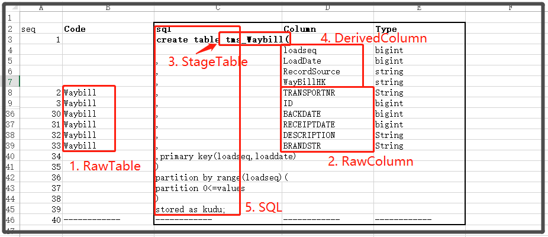

# TMS Staging


## 1.StagingTables设计

### 1.1 设计流程

1. 确定所要导入模块设计范围
2. 通过各表间的关联关系，开发连表查询脚本语句
3. 初步建立StagingTable
4. 对比DV模型，提取出各个派生列（Derived Column）
5. 确定StagingTable结构
6. 开发StagingTable建表简本语句

### 1.2 涉及表

| table             | name             |
| ----------------- | ---------------- |
| WAYBILL           | 运单表           |
| ORDERS            | 运单明细         |
| ASSIGNORDER       | 订单             |
| ASSIGNORDERDETAIL | 订单明细         |
| TASKORDERRELATION | 任务订单关联表   |
| TASKMANAGEMENT    | 任务明细         |
| JSDTASK           | 任务计划（导入） |
| BENZORDER         | 运单制单表       |
|                   |                  |

### 1.3 派生列(Derived Columns)

| 类型    | 字段                | 来源表           | Hash字段（BK）  |
| ------- | ------------------- | ---------------- | --------------- |
| Derived | SEQUENCE            | 批次中的rownum   |                 |
| Derived | LoadDate            | 批次执行时间节点 |                 |
| Derived | RecordSource        | 系统.表名        |                 |
| Derived | WayBillHK           | Waybill          | TransportNR     |
| Derived | CarHK               | Orders           | VIN             |
| Derived | AssignOrderHK       | AssignOrder      | OrderNR         |
| Derived | TaskHK              | Taskmanagement   | TaskNumber      |
| Derived | OrderHK             | Orders           | TransportNR,VIN |
| Derived | OrderAssignOrderHK | AssignOrderDetail | TransportNR,VIN,OrderNR |
| Derived | AssignOrderTaskHK   | AssignOrder,                TaskOrderRelation,  Taskmanagement | OrderNR, TaskNumber |

### 1.4 建表脚本

```sql
create table stagearea.tms_Waybill(		
	loadseq	bigint
,	LoadDate	bigint
,	RecordSource	string
,	HWayBillHK	string
,	TRANSPORTNR	String
,	ID	bigint
,	ASSIGNATIONQTY	bigint
,	CODE	String
,	CREATETYPE	bigint
,	CREATEDAT	bigint
,	CREATEDUSERID	bigint
,	DAY	bigint
,	DEALERNAME	String
,	DESCRIPTION1	String
,	DESCRIPTION2	String
,	MONTH	bigint
,	OEMREGION	String
,	ORGANIZATIONID	bigint
,	QTY	bigint
,	REGION	String
,	STATE	bigint
,	UPDATEDAT	bigint
,	UPDATEDUSERID	bigint
,	WAYBILLDATE	bigint
,	YEAR	bigint
,	DEPARTMENTID	bigint
,	ORIGINNAME	bigint
,	DESTINATIONNAME	bigint
,	AGENCYID	bigint
,	DEALERID	bigint
,	FREIGHT	bigint
,	PROVINCEID	bigint
,	BACKDATE	bigint
,	RECEIPTDATE	bigint
,	DESCRIPTION	String
,	BRANDSTR	String
,primary key(loadseq,loaddate)		
)		
partition by range(loadseq)(		
partition 0<=values		
)		
stored as kudu;		
------------	------------	------------
		
create table stagearea.tms_Orders(		
	loadseq	bigint
,	LoadDate	bigint
,	RecordSource	string
,	LOrderHK	string
,	HWaybillHK string
,	HCarHK	string
,	TRANSPORTNR	String
,	VIN	String
,	ID	bigint
,	AFTERCARTYPE	String
,	CARTYPE	String
,	COLOR	String
,	CREATETYPE	bigint
,	CREATEDAT	bigint
,	CREATEDUSERID	bigint
,	DAY	bigint
,	DEALERNAME	String
,	DESCRIPTION1	String
,	DESCRIPTION2	String
,	ISPAYABLE	bigint
,	MONTH	bigint
,	OEMREGION	String
,	ORGANIZATIONID	bigint
,	QTY	bigint
,	REGION	String
,	STATE	bigint
,	UPDATEDAT	bigint
,	UPDATEDUSERID	bigint
,	YEAR	bigint
,	WAYBILL_ID	bigint
,	ORIGINNAME	bigint
,	DESTINATIONNAME	bigint
,	AGENCYID	bigint
,	BENZORDERID	bigint
,	PROVINCEID	bigint
,primary key(loadseq,loaddate)		
)		
partition by range(loadseq)(		
partition 0<=values		
)		
stored as kudu;		
		
----------	----------	----------
create table stagearea.tms_AssignOrder(		
	loadseq	bigint
,	LoadDate	bigint
,	RecordSource	string
,	HAssignOrderHK	string
,	ORDERNR	String
,	ID	bigint
,	CODE	String
,	CREATEDAT	bigint
,	CREATEDUSERID	bigint
,	DAY	bigint
,	DESCRIPTION1	String
,	DESCRIPTION2	String
,	DESTINATIONNAME	bigint
,	ENTRUCKTIME	bigint
,	ISAGENCYORDER	bigint
,	ISORIGINAL	bigint
,	ISPOOL	bigint
,	MONTH	bigint
,	OEMREGION	String
,	ORGANIZATIONID	bigint
,	ORIGINNAME	bigint
,	ORIGINALORDERNR	String
,	PLANDATE	bigint
,	QTY	bigint
,	REALLYCARRIER	bigint
,	REGIONNAME	bigint
,	ROUTENAME	bigint
,	SHOULDCARRIER	bigint
,	STATE	bigint
,	TYPE	bigint
,	UPDATEDAT	bigint
,	UPDATEDUSERID	bigint
,	YEAR	bigint
,	DEPARTMENTID	bigint
,	SHOULDCARRIERID	bigint
,	REALLYCARRIERID	bigint
,	REGIONNAMES	String
,	ISSEGMENTED	bigint
,	RELATEDORGANIZATION	String
,	ACTUALORIGINCITYID	bigint
,	ACTUALDESTINATIONCITYID	bigint
,	RELATEDAGENCY	String
,	RELATEDAGENCYIDS	String
,	CARRIERDATE	bigint
,	RELATEDORDERS	string
,	DESCRIPTION	String
,	BRANDSTR	String
,primary key(loadseq,loaddate)		
)		
partition by range(loadseq)(		
partition 0<=values		
)		
stored as kudu;		
		
----------	----------	----------
create table stagearea.tms_TaskManagement( 		
	loadseq	bigint
,	LoadDate	bigint
,	RecordSource	string
,	HTaskHK	string
,	TASKNUMBER	String
,	ID	bigint
,	ACTUALARRIVALTIME	bigint
,	ACTUALDEPARTURETIME	bigint
,	BACKGROUND	bigint
,	CARQTY	bigint
,	CARRIERMESSAGE	String
,	CHECKDATE	bigint
,	CODE	String
,	CREATEDAT	bigint
,	CREATEDUSERID	bigint
,	CURRENTPLACE	String
,	DAY	bigint
,	DESCRIPTION	String
,	DESPATCHPLANINDATE	bigint
,	DESTINATIONNAME	bigint
,	ENTRUCKINGDATE	bigint
,	HEAVYDRIVINGTASK	bigint
,	ISCHECK	bigint
,	ISPAYABLE	bigint
,	MONTH	bigint
,	ORGANIZATIONID	bigint
,	ORIGINNAME	bigint
,	PLANDATE	bigint
,	PLANARRIVALTIME	bigint
,	PLANDEPARTURETIME	bigint
,	QTY	bigint
,	REALLYCARRIER	bigint
,	REGIONID	bigint
,	RELATEDWAYBILL	String
,	ROUTENAME	bigint
,	STATE	bigint
,	TASKTYPE	bigint
,	TRANSEXPECTTIME	bigint
,	TYPE	bigint
,	UPDATEDAT	bigint
,	UPDATEDUSERID	bigint
,	YEAR	bigint
,	DEPARTMENTID	bigint
,	DELIVERYCARDATE	bigint
,	RELATEDORGANIZATION	String
,	CARRIERTYPE	bigint
,	DISTRIBUTIONCARUSERID	bigint
,	DISTRIBUTIONCARUSERDATE	bigint
,	RELATEDAGENCY	String
,	RELATEDAGENCYIDS	String
,	LONGITUDE	float
,	LATITUDE	float
,	ISGENERATEEMPTY	bigint
,	ISROLLBACKTASK	bigint
,	RELATEDORDERS	string
,	NEXTCARRIERTYPE	bigint
,	BRANDSTR	String
,	WAYBILLNR	String
,primary key(loadseq,loaddate)		
)		
partition by range(loadseq)(		
partition 0<=values		
)		
stored as kudu;		
------------	------------	------------
create table stagearea.tms_AssignOrderDetail(		
	loadseq	bigint
,	LoadDate	bigint
,	RecordSource	string
,	LOrderAssignOrderHK	string
,	LOrderHK String
,	HAssignOrderHK String
,	TRANSPORTNR	String
,	VIN	String
,	ORDERNR	String
,	ID	bigint
,	AFTERCARTYPE	String
,	CARTYPE	String
,	CODE	String
,	CREATETYPE	bigint
,	CREATEDAT	bigint
,	CREATEDUSERID	bigint
,	DAY	bigint
,	DEALERNAME	String
,	DESCRIPTION	String
,	DESTINATIONNAME	bigint
,	ISSELECTED	bigint
,	MONTH	bigint
,	ORDERID	bigint
,	ORGANIZATIONID	bigint
,	ORIGINNAME	bigint
,	PLANDATE	bigint
,	REGIONNAME	bigint
,	STATE	bigint
,	UPDATEDAT	bigint
,	UPDATEDUSERID	bigint
,	YEAR	bigint
,	REGIONNAMES	String
,	ISSEGMENTED	bigint
,	ASSIGNORDERID	bigint
,	ACTUALORIGINCITYID	bigint
,	ACTUALDESTINATIONCITYID	bigint
,	ENTRUCKTIME	bigint
,primary key(loadseq,loaddate)		
)		
partition by range(loadseq)(		
partition 0<=values		
)		
stored as kudu;		
		
		
----------	----------	----------
create table stagearea.tms_TaskOrderRelation(		
	loadseq	bigint
,	LoadDate	bigint
,	RecordSource	string
,	LAssignOrderTaskHK	string
,	HAssignOrderHK	string
,	HTaskHK	string
,	ORDERNR	String
,	TASKNUMBER	String
,	ID	bigint
,	ASSIGNORDERID	bigint
,	CODE	String
,	CREATEDAT	bigint
,	CREATEDUSERID	bigint
,	DESCRIPTION	String
,	TASKMANAGEMENTID	bigint
,	UPDATEDAT	bigint
,	UPDATEDUSERID	bigint
,primary key(loadseq,loaddate)		
)		
partition by range(loadseq)(		
partition 0<=values		
)		
stored as kudu;		

```

> 建表参考方式（Excel）：
>
> 1. 从操作系统数据库中copy出各表及其字段属性；
> 2. 根据字段的数据类型，映射到kudu数据类型；
> 3. 将派生列加到能够提供的表中；
> 4. 添加kudu建表相关sql语句；
>
> 如图：
>
> 


## 2. Load StagingTable

### 2.1 脚本开发

```sql
	/**Load stagearea.tms_Waybill*/			
	select 			
		rownum 	 as 	"loadseq"
	,	${loaddate}	 as 	"loaddate"
	,	'tms.waybill'	 as 	"recordsource"
	,	(case when TRANSPORTNR is not null then MD5(TRANSPORTNR) else null end )	 as 	"hwaybillhk"
	,	transportnr	 as 	"transportnr"
	,	id	 as 	"id"
	,	assignationqty	 as 	"assignationqty"
	,	code	 as 	"code"
	,	createtype	 as 	"createtype"
	,	createdat	 as 	"createdat"
	,	createduserid	 as 	"createduserid"
	,	day	 as 	"day"
	,	dealername	 as 	"dealername"
	,	description1	 as 	"description1"
	,	description2	 as 	"description2"
	,	month	 as 	"month"
	,	oemregion	 as 	"oemregion"
	,	organizationid	 as 	"organizationid"
	,	qty	 as 	"qty"
	,	region	 as 	"region"
	,	state	 as 	"state"
	,	updatedat	 as 	"updatedat"
	,	updateduserid	 as 	"updateduserid"
	,	waybilldate	 as 	"waybilldate"
	,	year	 as 	"year"
	,	departmentid	 as 	"departmentid"
	,	originname	 as 	"originname"
	,	destinationname	 as 	"destinationname"
	,	agencyid	 as 	"agencyid"
	,	dealerid	 as 	"dealerid"
	,	freight	 as 	"freight"
	,	provinceid	 as 	"provinceid"
	,	backdate	 as 	"backdate"
	,	receiptdate	 as 	"receiptdate"
	,	description	 as 	"description"
	,	brandstr	 as 	"brandstr"
	from waybill			
	-- where …			
				
	/**Load stagearea.tms_Orders*/			
	select 			
		rownum 	 as 	"loadseq"
	,	${loaddate}	 as 	"loaddate"
	,	'tms.orders'	 as 	"recordsource"
	,	(case when TRANSPORTNR is not null and VIN is not null  then MD5(concat(TRANSPORTNR,VIN)) else null end )	 as 	"lorderhk"
	,	(case when VIN is not null then MD5(VIN) else null end )	 as 	"hcarhk"
	,	(case when TRANSPORTNR is not null then MD5(TRANSPORTNR) else null end )	 as 	"hwaybillhk"
	,	transportnr	 as 	"transportnr"
	,	vin	 as 	"vin"
	,	id	 as 	"id"
	,	aftercartype	 as 	"aftercartype"
	,	cartype	 as 	"cartype"
	,	color	 as 	"color"
	,	createtype	 as 	"createtype"
	,	createdat	 as 	"createdat"
	,	createduserid	 as 	"createduserid"
	,	day	 as 	"day"
	,	dealername	 as 	"dealername"
	,	description1	 as 	"description1"
	,	description2	 as 	"description2"
	,	ispayable	 as 	"ispayable"
	,	month	 as 	"month"
	,	oemregion	 as 	"oemregion"
	,	organizationid	 as 	"organizationid"
	,	qty	 as 	"qty"
	,	region	 as 	"region"
	,	state	 as 	"state"
	,	updatedat	 as 	"updatedat"
	,	updateduserid	 as 	"updateduserid"
	,	year	 as 	"year"
	,	waybill_id	 as 	"waybill_id"
	,	originname	 as 	"originname"
	,	destinationname	 as 	"destinationname"
	,	agencyid	 as 	"agencyid"
	,	benzorderid	 as 	"benzorderid"
	,	provinceid	 as 	"provinceid"
	from orders			
	-- where …			
				
	/**Load stagearea.tms_AssignOrder*/			
	select			
		rownum 	 as 	"loadseq"
	,	${loaddate}	 as 	"loaddate"
	,	'tms.assignorder'	 as 	"recordsource"
	,	(case when ordernr is not null then MD5(ordernr) else null end )	 as 	"hassignorderhk"
	,	ordernr	 as 	"ordernr"
	,	id	 as 	"id"
	,	code	 as 	"code"
	,	createdat	 as 	"createdat"
	,	createduserid	 as 	"createduserid"
	,	day	 as 	"day"
	,	description1	 as 	"description1"
	,	description2	 as 	"description2"
	,	destinationname	 as 	"destinationname"
	,	entrucktime	 as 	"entrucktime"
	,	isagencyorder	 as 	"isagencyorder"
	,	isoriginal	 as 	"isoriginal"
	,	ispool	 as 	"ispool"
	,	month	 as 	"month"
	,	oemregion	 as 	"oemregion"
	,	organizationid	 as 	"organizationid"
	,	originname	 as 	"originname"
	,	originalordernr	 as 	"originalordernr"
	,	plandate	 as 	"plandate"
	,	qty	 as 	"qty"
	,	reallycarrier	 as 	"reallycarrier"
	,	regionname	 as 	"regionname"
	,	routename	 as 	"routename"
	,	shouldcarrier	 as 	"shouldcarrier"
	,	state	 as 	"state"
	,	type	 as 	"type"
	,	updatedat	 as 	"updatedat"
	,	updateduserid	 as 	"updateduserid"
	,	year	 as 	"year"
	,	departmentid	 as 	"departmentid"
	,	shouldcarrierid	 as 	"shouldcarrierid"
	,	reallycarrierid	 as 	"reallycarrierid"
	,	regionnames	 as 	"regionnames"
	,	issegmented	 as 	"issegmented"
	,	relatedorganization	 as 	"relatedorganization"
	,	actualorigincityid	 as 	"actualorigincityid"
	,	actualdestinationcityid	 as 	"actualdestinationcityid"
	,	relatedagency	 as 	"relatedagency"
	,	relatedagencyids	 as 	"relatedagencyids"
	,	carrierdate	 as 	"carrierdate"
	,	relatedorders	 as 	"relatedorders"
	,	description	 as 	"description"
	,	brandstr	 as 	"brandstr"
	from assignorder			
	 -- where …			
				
	/**Load stagearea.tms_TaskManagement*/			
	select			
		rownum 	 as 	"loadseq"
	,	${loaddate}	 as 	"loaddate"
	,	'tms.taskmanagement'	 as 	"recordsource"
	,	(case when tasknumber is not null then MD5(tasknumber) else null end )	 as 	"htaskhk"
	,	tasknumber	 as 	"tasknumber"
	,	id	 as 	"id"
	,	actualarrivaltime	 as 	"actualarrivaltime"
	,	actualdeparturetime	 as 	"actualdeparturetime"
	,	background	 as 	"background"
	,	carqty	 as 	"carqty"
	,	carriermessage	 as 	"carriermessage"
	,	checkdate	 as 	"checkdate"
	,	code	 as 	"code"
	,	createdat	 as 	"createdat"
	,	createduserid	 as 	"createduserid"
	,	currentplace	 as 	"currentplace"
	,	day	 as 	"day"
	,	description	 as 	"description"
	,	despatchplanindate	 as 	"despatchplanindate"
	,	destinationname	 as 	"destinationname"
	,	entruckingdate	 as 	"entruckingdate"
	,	heavydrivingtask	 as 	"heavydrivingtask"
	,	ischeck	 as 	"ischeck"
	,	ispayable	 as 	"ispayable"
	,	month	 as 	"month"
	,	organizationid	 as 	"organizationid"
	,	originname	 as 	"originname"
	,	plandate	 as 	"plandate"
	,	planarrivaltime	 as 	"planarrivaltime"
	,	plandeparturetime	 as 	"plandeparturetime"
	,	qty	 as 	"qty"
	,	reallycarrier	 as 	"reallycarrier"
	,	regionid	 as 	"regionid"
	,	relatedwaybill	 as 	"relatedwaybill"
	,	routename	 as 	"routename"
	,	state	 as 	"state"
	,	tasktype	 as 	"tasktype"
	,	transexpecttime	 as 	"transexpecttime"
	,	type	 as 	"type"
	,	updatedat	 as 	"updatedat"
	,	updateduserid	 as 	"updateduserid"
	,	year	 as 	"year"
	,	departmentid	 as 	"departmentid"
	,	deliverycardate	 as 	"deliverycardate"
	,	relatedorganization	 as 	"relatedorganization"
	,	carriertype	 as 	"carriertype"
	,	distributioncaruserid	 as 	"distributioncaruserid"
	,	distributioncaruserdate	 as 	"distributioncaruserdate"
	,	relatedagency	 as 	"relatedagency"
	,	relatedagencyids	 as 	"relatedagencyids"
	,	CAST (longitude AS DECIMAL(19,5))	 as 	"longitude"
	,	CAST (latitude AS DECIMAL(19,5))	 as 	"latitude"
	,	isgenerateempty	 as 	"isgenerateempty"
	,	isrollbacktask	 as 	"isrollbacktask"
	,	relatedorders	 as 	"relatedorders"
	,	nextcarriertype	 as 	"nextcarriertype"
	,	brandstr	 as 	"brandstr"
	,	waybillnr	 as 	"waybillnr"
	from taskmanagement			
	 -- where …			
				
	/**Load stagearea.tms_AssignOrderDetail*/			
	select			
		rownum 	 as 	"loadseq"
	,	${loaddate}	 as 	"loaddate"
	,	'tms.assignorderdetail'	 as 	"recordsource"
	,	(case when TRANSPORTNR is not null and VIN is not null and ORDERNR is not null  then MD5(concat(TRANSPORTNR,concat(VIN,ORDERNR))) else null end )	 as 	"lorderassignorderhk"
	,	(case when TRANSPORTNR is not null and VIN is not null then MD5(concat(TRANSPORTNR,VIN)) else null end )	 as 	"lorderhk"
	,	(case when ORDERNR is not null  then MD5(ORDERNR) else null end )	 as 	"hassignorderhk"
	,	transportnr	 as 	"transportnr"
	,	vin	 as 	"vin"
	,	ordernr	 as 	"ordernr"
	,	id	 as 	"id"
	,	aftercartype	 as 	"aftercartype"
	,	cartype	 as 	"cartype"
	,	code	 as 	"code"
	,	createtype	 as 	"createtype"
	,	createdat	 as 	"createdat"
	,	createduserid	 as 	"createduserid"
	,	day	 as 	"day"
	,	dealername	 as 	"dealername"
	,	description	 as 	"description"
	,	destinationname	 as 	"destinationname"
	,	isselected	 as 	"isselected"
	,	month	 as 	"month"
	,	orderid	 as 	"orderid"
	,	organizationid	 as 	"organizationid"
	,	originname	 as 	"originname"
	,	plandate	 as 	"plandate"
	,	regionname	 as 	"regionname"
	,	state	 as 	"state"
	,	updatedat	 as 	"updatedat"
	,	updateduserid	 as 	"updateduserid"
	,	year	 as 	"year"
	,	regionnames	 as 	"regionnames"
	,	issegmented	 as 	"issegmented"
	,	assignorderid	 as 	"assignorderid"
	,	actualorigincityid	 as 	"actualorigincityid"
	,	actualdestinationcityid	 as 	"actualdestinationcityid"
	,	entrucktime	 as 	"entrucktime"
	from assignorderdetail			
	 -- where …			
				
	/**Load stagearea.tms_TaskOrderRelation*/			
	select			
		rownum 	 as 	"loadseq"
	,	${loaddate}	 as 	"loaddate"
	,	'tms.taskorderrelation'	 as 	"recordsource"
	,	(case when ao.ORDERNR is not null and tsk.TASKNUMBER is not null  then MD5(concat(ao.ORDERNR,tsk.TASKNUMBER)) else null end )	 as 	"lassignordertaskhk"
	,	(case when ao.ORDERNR is not null then MD5(ao.ORDERNR) else null end )	 as 	"hassignorderhk"
	,	(case when tsk.TASKNUMBER is not null  then MD5(tsk.TASKNUMBER) else null end )	 as 	"htaskhk"
	,	ao.ordernr	 as 	"ordernr"
	,	tsk.tasknumber	 as 	"tasknumber"
	,	TSKOD.id	 as 	"id"
	,	TSKOD.assignorderid	 as 	"assignorderid"
	,	TSKOD.code	 as 	"code"
	,	TSKOD.createdat	 as 	"createdat"
	,	TSKOD.createduserid	 as 	"createduserid"
	,	TSKOD.description	 as 	"description"
	,	TSKOD.taskmanagementid	 as 	"taskmanagementid"
	,	TSKOD.updatedat	 as 	"updatedat"
	,	TSKOD.updateduserid	 as 	"updateduserid"
	from TASKORDERRELATION tskod			
	LEFT JOIN ASSIGNORDER ao on (TSKOD.ASSIGNORDERID=ao.id)			
	LEFT JOIN TASKMANAGEMENT tsk on (TSKOD.TASKMANAGEMENTID=TSK.id)			
	-- where …			

```


### 2.2 ETL流程开发

ETL流程：

1. (可选)Truncate StageTable
2. 生成并赋值`loaddate`（是否需要保证同一批次所有流程(表)的loaddate保持一致？）
3. ExecuteSQL执行数据获取脚本，详见2.1
4. UpdateAttribute添加来源属性
5. RPG平衡负载
6. RouteOnAttribute根据来源分发
7. PutKudu写入kudu的Stage表


## 问题：

1. 将数据从`操作系统数据库`中 `抽取` 到`Stage` 过程，是通过单表还是通过链表查询抽取？ 
2. 在抽取过程中，怎么定义收取范围？怎么防止每次都获取`操作系统数据库`的整个库？怎么保证获取到的是上次`loaddate`到本次`Loaddate`的时间范围内发生变更的数据？
3. 是否需要保证同一批次所有流程(表)的loaddate保持一致？