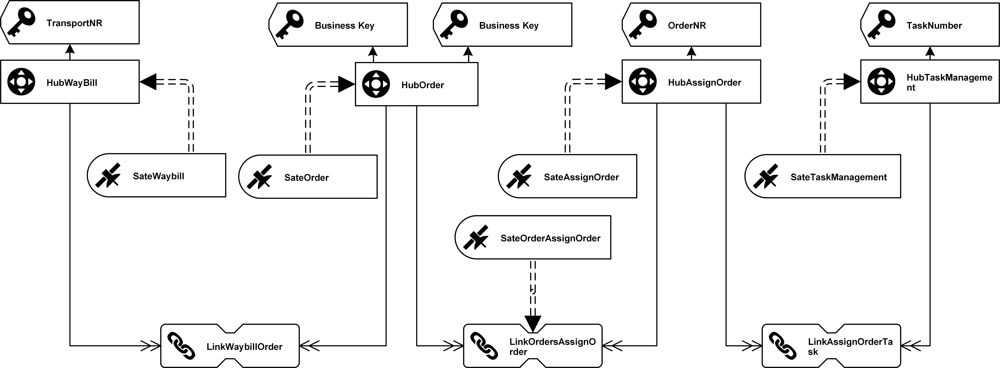

# TMS Data Vault

## 0. 设计流程

1. 梳理DV模型，识别各表主键及其所包含的字段属性
2. 新建Hub中心表、Link链接表、Sat卫星表
3. 开发脚本，将数据从stage区加载到DataVault各表中


## 1. DV模型图

> 京顺达DV模型图
>
> 


## 2.中心表

### 2.1 主键

| name     | code              | BK                      | PK            |
| -------- | ----------------- | ----------------------- | ------------- |
| 运单表   | HubWayBill        | TransportNR(运单号)     | WayBillHK     |
| 运单明细 | HubOrder          | TransportNR(运单号)+VIN | OrderHK       |
| 订单表   | HubAssignOrder    | OrderNR                 | AssignOrderHK |
| 任务管理 | HubTaskManagement | TaskNumber              | TaskHK        |

### 2.2 中心表结构

| Table  | Column   | KeyType |
| ---------- | ------------ | ---- |
| **HubWayBill** | **WayBillHK** | **PK** |
| HubWayBill | LoadDate     |      |
| HubWayBill | RecordSource |      |
| HubWayBill | TransportNR  | BK |
| **HubOrder** | **OrderHK**  | **PK** |
| HubOrder | LoadDate |      |
| HubOrder | RecordSource |      |
| HubOrder | TransportNR | BK |
| HubOrder | VIN | BK |
|**HubAssignOrder**|**AssignOrderHK**|**PK**|
|HubAssignOrder|LoadDate||
|HubAssignOrder|RecordSource||
|HubAssignOrder|OrderNR|BK|
|**HubTaskManagement**|**TaskHK**|**PK**|
|HubTaskManagement|LoadDate||
|HubTaskManagement|RecordSource||
|HubTaskManagement|TaskNumber|BK|

### 2.3 建表脚本

```sql
/** HubWaybill*/				
	create table HubWayBill(			
		WayBillHK	String	
	,	LoadDate	bigint	
	,	RecordSource	String	
	,	TransportNR	String	
	,Primary Key(WayBillHK)			
	)			
	Partition By Hash(WayBillHK)Partitions 6			
	stored as kudu;			
				
/**HubOrder*/				
	create table HubOrder(			
		OrderHK	String	
	,	LoadDate	bigint	
	,	RecordSource	String	
	,	TransportNR	String	
	,	VIN	String	
	,Primary Key(OrderHK)			
	)			
	Partition By Hash(OrderHK)Partitions 6			
	stored as kudu;			
				
/**HubAssignOrder*/				
	create table HubAssignOrder(			
		AssignOrderHK	String	
	,	LoadDate	bigint	
	,	RecordSource	String	
	,	OrderNR	String	
	,Primary Key(AssignOrderHK)			
	)			
	Partition By Hash(AssignOrderHK)Partitions 6			
	stored as kudu;			
				
/**HubTask*/				
	create table HubTask(			
		TaskHK	String	
	,	LoadDate	bigint	
	,	RecordSource	String	
	,	TaskNumber	String	
	,Primary Key(TaskHK)			
	)			
	Partition By Hash(TaskHK)Partitions 6			
	stored as kudu;			

```

## 3.链表

### 3.1 主键值

| name               | code                  | BK                                          | PK                  | FK                          |
| ------------------ | --------------------- | ------------------------------------------- | ------------------- | --------------------------- |
| 运单明细链接表     | LinkWaybillOrder      | TransportNR,      TransportNR,      VIN     | WaybillOrderHK      | WayBillHK,      OrderHK     |
| 订单拼单链接表     | LinkOrdersAssignOrder | TransportNR(运单号),      VIN,      OrderNR | OrdersAssignOrderHK | OrderHK,      AssignOrderHK |
| 辅助订单任务链接表 | LinkAssignOrderTask   | OrderNR,      TaskNumber                    | AssignOrderTaskHK   | OrderHK,      TaskHK        |

### 3.2 链接表结构


| Table | Column | KeyType |
| ----- | ------ | ------- |
| **LinkWaybillOrder** | **WaybillOrderHK** | **PK** |
|LinkWaybillOrder|LoadDate||
|LinkWaybillOrder|RecordSource||
|LinkWaybillOrder|WayBillHK|FK|
|LinkWaybillOrder|OrderHK|FK|
|**LinkOrdersAssignOrder**|**OrdersAssignOrderHK**|**PK**|
|LinkOrdersAssignOrder|LoadDate||
|LinkOrdersAssignOrder|RecordSource||
|LinkOrdersAssignOrder|OrderHK|FK|
|LinkOrdersAssignOrder|AssignOrderHK|FK|
|**LinkAssignOrderTask**|**AssignOrderTaskHK**|**PK**|
|LinkAssignOrderTask|LoadDate||
|LinkAssignOrderTask|RecordSource||
|LinkAssignOrderTask|AssignOrderHK|FK|
|LinkAssignOrderTask|TaskHK|FK|

### 3.3 建表脚本

```sql
/**LinkWaybillOrder*/		
create table LinkWaybillOrder(		
	WaybillOrderHK	String
,	LoadDate	bigint
,	RecordSource	string
,	WayBillHK	string
,	OrderHK	string
,Primary Key(WaybillOrderHK)		
)		
Partition By Hash(WaybillOrderHK)Partitions 6		
stored as kudu;		
		
/**LinkOrdersAssignOrder*/		
create table LinkOrdersAssignOrder(		
	OrdersAssignOrderHK	String
,	LoadDate	bigint
,	RecordSource	string
,	OrderHK	string
,	AssignOrderHK	string
,Primary Key(OrdersAssignOrderHK)		
)		
Partition By Hash(OrdersAssignOrderHK)Partitions 6		
stored as kudu;		
		
/**LinkAssignOrderTask*/		
create table LinkAssignOrderTask(		
	AssignOrderTaskHK	String
,	LoadDate	bigint
,	RecordSource	string
,	AssignOrderHK	string
,	TaskHK	string
,Primary Key(AssignOrderTaskHK)		
)		
Partition By Hash(AssignOrderTaskHK)Partitions 6		
stored as kudu;		

```


## 4. 卫星表

### 4.1 主键

| name           | code               | PK                            | FK                  |
| -------------- | ------------------ | ----------------------------- | ------------------- |
| 运单附属表     | SateWaybill        | WayBillHK, loadDate           | WayBillHK           |
| 运单明细附属表 | SateOrder          | OrderHK, loadDate             | OrderHK             |
| 辅助订单附属表 | SateAssignOrder    | AssignOrderHK, loadDate       | AssignOrderHK       |
| 订单拼单附属表 | SateAssignOrderDet | AssignOrderDetailHK, loadDate | AssignOrderDetailHK |
| 任务附属表     | SateTaskManagement | TaskHK, loadDate              | TaskHK              |

### 4.2 卫星表结构

| Table | Column | KeyType |
| ----- | ------ | ------- |
|**SateWaybill**| **WayBillHK** | **PK(FK)** |
|**SateWaybill**| **loadDate** | **PK** |
|SateWaybill| loadEndDate | |
|SateWaybill| RecordSource |  |
|SateWaybill|TRANSPORTNR|BK|
|SateWaybill|ID||
|SateWaybill|ASSIGNATIONQTY||
|SateWaybill|CODE||
|SateWaybill|CREATETYPE||
|SateWaybill|CREATEDAT||
|SateWaybill|CREATEDUSERID||
|SateWaybill|DAY||
|SateWaybill|DEALERNAME||
|SateWaybill|DESCRIPTION1||
|SateWaybill|DESCRIPTION2||
|SateWaybill|MONTH||
|SateWaybill|OEMREGION||
|SateWaybill|ORGANIZATIONID||
|SateWaybill|QTY||
|SateWaybill|REGION||
|SateWaybill|STATE||
|SateWaybill|UPDATEDAT||
|SateWaybill|UPDATEDUSERID||
|SateWaybill|WAYBILLDATE||
|SateWaybill|YEAR||
|SateWaybill|DEPARTMENTID||
|SateWaybill|ORIGINNAME||
|SateWaybill|DESTINATIONNAME||
|SateWaybill|AGENCYID||
|SateWaybill|DEALERID||
|SateWaybill|FREIGHT||
|SateWaybill|PROVINCEID||
|SateWaybill|BACKDATE||
|SateWaybill|RECEIPTDATE||
|SateWaybill|DESCRIPTION||
|SateWaybill|BRANDSTR||
|**SateOrder**|**OrderHK**|**PK(FK)**|
|**SateOrder**|**loadDate**|**PK**|
|SateOrder|TRANSPORTNR|BK|
|SateOrder|VIN|BK|
|SateOrder|loadEndDate||
|SateOrder|RecordSource||
|SateOrder|ID||
|SateOrder|AFTERCARTYPE||
|SateOrder|CARTYPE||
|SateOrder|COLOR||
|SateOrder|CREATETYPE||
|SateOrder|CREATEDAT||
|SateOrder|CREATEDUSERID||
|SateOrder|DAY||
|SateOrder|DEALERNAME||
|SateOrder|DESCRIPTION1||
|SateOrder|DESCRIPTION2||
|SateOrder|ISPAYABLE||
|SateOrder|MONTH||
|SateOrder|OEMREGION||
|SateOrder|ORGANIZATIONID||
|SateOrder|QTY||
|SateOrder|REGION||
|SateOrder|STATE||
|SateOrder|UPDATEDAT||
|SateOrder|UPDATEDUSERID||
|SateOrder|YEAR||
|SateOrder|WAYBILL_ID||
|SateOrder|ORIGINNAME||
|SateOrder|DESTINATIONNAME||
|SateOrder|AGENCYID||
|SateOrder|BENZORDERID||
|SateOrder|PROVINCEID||
|**SateAssignOrder**|**AssignOrderHK**|**PK(FK)**|
|**SateAssignOrder**|**loadDate**|**PK**|
|SateAssignOrder|loadEndDate||
|SateAssignOrder|RecordSource||
|SateAssignOrder|ORDERNR|BK|
|SateAssignOrder|ID||
|SateAssignOrder|CODE||
|SateAssignOrder|CREATEDAT||
|SateAssignOrder|CREATEDUSERID||
|SateAssignOrder|DAY||
|SateAssignOrder|DESCRIPTION1||
|SateAssignOrder|DESCRIPTION2||
|SateAssignOrder|DESTINATIONNAME||
|SateAssignOrder|ENTRUCKTIME||
|SateAssignOrder|ISAGENCYORDER||
|SateAssignOrder|ISORIGINAL||
|SateAssignOrder|ISPOOL||
|SateAssignOrder|MONTH||
|SateAssignOrder|OEMREGION||
|SateAssignOrder|ORGANIZATIONID||
|SateAssignOrder|ORIGINNAME||
|SateAssignOrder|ORIGINALORDERNR||
|SateAssignOrder|PLANDATE||
|SateAssignOrder|QTY||
|SateAssignOrder|REALLYCARRIER||
|SateAssignOrder|REGIONNAME||
|SateAssignOrder|ROUTENAME||
|SateAssignOrder|SHOULDCARRIER||
|SateAssignOrder|STATE||
|SateAssignOrder|TYPE||
|SateAssignOrder|UPDATEDAT||
|SateAssignOrder|UPDATEDUSERID||
|SateAssignOrder|YEAR||
|SateAssignOrder|DEPARTMENTID||
|SateAssignOrder|SHOULDCARRIERID||
|SateAssignOrder|REALLYCARRIERID||
|SateAssignOrder|REGIONNAMES||
|SateAssignOrder|ISSEGMENTED||
|SateAssignOrder|RELATEDORGANIZATION||
|SateAssignOrder|ACTUALORIGINCITYID||
|SateAssignOrder|ACTUALDESTINATIONCITYID||
|SateAssignOrder|RELATEDAGENCY||
|SateAssignOrder|RELATEDAGENCYIDS||
|SateAssignOrder|CARRIERDATE||
|SateAssignOrder|RELATEDORDERS||
|SateAssignOrder|DESCRIPTION||
|SateAssignOrder|BRANDSTR||
|**SatOrderAssignOrder**|**OrderAssignOrderHK**|**PK(FK)**|
|**SatOrderAssignOrder**|**LoadDate**|**PK**|
|SatOrderAssignOrder|LoadEndDate||
|SatOrderAssignOrder|RecordSpource||
|SatOrderAssignOrder|TRANSPORTNR|BK|
|SatOrderAssignOrder|VIN|BK|
|SatOrderAssignOrder|ORDERNR|BK|
|SatOrderAssignOrder|ID||
|SatOrderAssignOrder|AFTERCARTYPE||
|SatOrderAssignOrder|CARTYPE||
|SatOrderAssignOrder|CODE||
|SatOrderAssignOrder|CREATETYPE||
|SatOrderAssignOrder|CREATEDAT||
|SatOrderAssignOrder|CREATEDUSERID||
|SatOrderAssignOrder|DAY||
|SatOrderAssignOrder|DEALERNAME||
|SatOrderAssignOrder|DESCRIPTION||
|SatOrderAssignOrder|DESTINATIONNAME||
|SatOrderAssignOrder|ISSELECTED||
|SatOrderAssignOrder|MONTH||
|SatOrderAssignOrder|ORDERID||
|SatOrderAssignOrder|ORGANIZATIONID||
|SatOrderAssignOrder|ORIGINNAME||
|SatOrderAssignOrder|PLANDATE||
|SatOrderAssignOrder|REGIONNAME||
|SatOrderAssignOrder|STATE||
|SatOrderAssignOrder|UPDATEDAT||
|SatOrderAssignOrder|UPDATEDUSERID||
|SatOrderAssignOrder|YEAR||
|SatOrderAssignOrder|REGIONNAMES||
|SatOrderAssignOrder|ISSEGMENTED||
|SatOrderAssignOrder|ASSIGNORDERID||
|SatOrderAssignOrder|ACTUALORIGINCITYID||
|SatOrderAssignOrder|ACTUALDESTINATIONCITYID||
|SatOrderAssignOrder|ENTRUCKTIME||
|**SateTaskManagement**|**TaskHK**|**PK(FK)**|
|**SateTaskManagement**|**LoadDate**|**PK**|
|SateTaskManagement|LoadEndDate||
|SateTaskManagement|RecordSource||
|SateTaskManagement|TASKNUMBER|BK|
|SateTaskManagement|ID||
|SateTaskManagement|ACTUALARRIVALTIME||
|SateTaskManagement|ACTUALDEPARTURETIME||
|SateTaskManagement|BACKGROUND||
|SateTaskManagement|CARQTY||
|SateTaskManagement|CARRIERMESSAGE||
|SateTaskManagement|CHECKDATE||
|SateTaskManagement|CODE||
|SateTaskManagement|CREATEDAT||
|SateTaskManagement|CREATEDUSERID||
|SateTaskManagement|CURRENTPLACE||
|SateTaskManagement|DAY||
|SateTaskManagement|DESCRIPTION||
|SateTaskManagement|DESPATCHPLANINDATE||
|SateTaskManagement|DESTINATIONNAME||
|SateTaskManagement|ENTRUCKINGDATE||
|SateTaskManagement|HEAVYDRIVINGTASK||
|SateTaskManagement|ISCHECK||
|SateTaskManagement|ISPAYABLE||
|SateTaskManagement|MONTH||
|SateTaskManagement|ORGANIZATIONID||
|SateTaskManagement|ORIGINNAME||
|SateTaskManagement|PLANDATE||
|SateTaskManagement|PLANARRIVALTIME||
|SateTaskManagement|PLANDEPARTURETIME||
|SateTaskManagement|QTY||
|SateTaskManagement|REALLYCARRIER||
|SateTaskManagement|REGIONID||
|SateTaskManagement|RELATEDWAYBILL||
|SateTaskManagement|ROUTENAME||
|SateTaskManagement|STATE||
|SateTaskManagement|TASKTYPE||
|SateTaskManagement|TRANSEXPECTTIME||
|SateTaskManagement|TYPE||
|SateTaskManagement|UPDATEDAT||
|SateTaskManagement|UPDATEDUSERID||
|SateTaskManagement|YEAR||
|SateTaskManagement|DEPARTMENTID||
|SateTaskManagement|DELIVERYCARDATE||
|SateTaskManagement|RELATEDORGANIZATION||
|SateTaskManagement|CARRIERTYPE||
|SateTaskManagement|DISTRIBUTIONCARUSERID||
|SateTaskManagement|DISTRIBUTIONCARUSERDATE||
|SateTaskManagement|RELATEDAGENCY||
|SateTaskManagement|RELATEDAGENCYIDS||
|SateTaskManagement|LONGITUDE||
|SateTaskManagement|LATITUDE||
|SateTaskManagement|ISGENERATEEMPTY||
|SateTaskManagement|ISROLLBACKTASK||
|SateTaskManagement|RELATEDORDERS||
|SateTaskManagement|NEXTCARRIERTYPE||
|SateTaskManagement|BRANDSTR||
|SateTaskManagement|WAYBILLNR||

### 4.3 建表脚本

```sql
/**SateWaybill*/		
create table SateWaybill(		
	WayBillHK	String
,	loadDate	Bigint
,	loadEndDate	Bigint
,	RecordSource	String
,	TRANSPORTNR	String
,	ID	Bigint
,	ASSIGNATIONQTY	Bigint
,	CODE	String
,	CREATETYPE	Bigint
,	CREATEDAT	Bigint
,	CREATEDUSERID	Bigint
,	DAY	Bigint
,	DEALERNAME	String
,	DESCRIPTION1	String
,	DESCRIPTION2	String
,	MONTH	Bigint
,	OEMREGION	String
,	ORGANIZATIONID	Bigint
,	QTY	Bigint
,	REGION	String
,	STATE	Bigint
,	UPDATEDAT	Bigint
,	UPDATEDUSERID	Bigint
,	WAYBILLDATE	Bigint
,	YEAR	Bigint
,	DEPARTMENTID	Bigint
,	ORIGINNAME	Bigint
,	DESTINATIONNAME	Bigint
,	AGENCYID	Bigint
,	DEALERID	Bigint
,	FREIGHT	Bigint
,	PROVINCEID	Bigint
,	BACKDATE	Bigint
,	RECEIPTDATE	Bigint
,	DESCRIPTION	String
,	BRANDSTR	String
,Primary Key(WayBillHK,loadDate)		
)		
Partition By Hash(WayBillHK)partitions 6		
,Range(loadDate)(		
Partition 0<=values<1538323200000	-- 2018/10/1	
,Partition 1538323200000<=values<1546272000000	-- 2019/1/1	
,Partition 1546272000000<=values<1554048000000	-- 2019/4/1	
)		
stored as kudu;		
		
/**SatOrder*/		
create table SatOrder(		
	OrderHK	String
,	loadDate	Bigint
,	loadEndDate	Bigint
,	RecordSource	String
,	TRANSPORTNR	String
,	VIN	String
,	ID	Bigint
,	AFTERCARTYPE	String
,	CARTYPE	String
,	COLOR	String
,	CREATETYPE	Bigint
,	CREATEDAT	Bigint
,	CREATEDUSERID	Bigint
,	DAY	Bigint
,	DEALERNAME	String
,	DESCRIPTION1	String
,	DESCRIPTION2	String
,	ISPAYABLE	Bigint
,	MONTH	Bigint
,	OEMREGION	String
,	ORGANIZATIONID	Bigint
,	QTY	Bigint
,	REGION	String
,	STATE	Bigint
,	UPDATEDAT	Bigint
,	UPDATEDUSERID	Bigint
,	YEAR	Bigint
,	WAYBILL_ID	Bigint
,	ORIGINNAME	Bigint
,	DESTINATIONNAME	Bigint
,	AGENCYID	Bigint
,	BENZORDERID	Bigint
,	PROVINCEID	Bigint
,Primary Key(OrderHK,loadDate)		
)		
Partition By Hash(OrderHK)partitions 6		
,Range(loadDate)(		
Partition 0<=values<1538323200000	-- 2018/10/1	
,Partition 1538323200000<=values<1546272000000	-- 2019/1/1	
,Partition 1546272000000<=values<1554048000000	-- 2019/4/1	
)		
stored as kudu;		
		
/**SateAssignOrder*/		
create table SateAssignOrder(		
	AssignOrderHK	String
,	loadDate	Bigint
,	loadEndDate	Bigint
,	RecordSource	String
,	ORDERNR	String
,	ID	Bigint
,	CODE	String
,	CREATEDAT	Bigint
,	CREATEDUSERID	Bigint
,	DAY	Bigint
,	DESCRIPTION1	String
,	DESCRIPTION2	String
,	DESTINATIONNAME	Bigint
,	ENTRUCKTIME	Bigint
,	ISAGENCYORDER	Bigint
,	ISORIGINAL	Bigint
,	ISPOOL	Bigint
,	MONTH	Bigint
,	OEMREGION	String
,	ORGANIZATIONID	Bigint
,	ORIGINNAME	Bigint
,	ORIGINALORDERNR	String
,	PLANDATE	Bigint
,	QTY	Bigint
,	REALLYCARRIER	Bigint
,	REGIONNAME	Bigint
,	ROUTENAME	Bigint
,	SHOULDCARRIER	Bigint
,	STATE	Bigint
,	TYPE	Bigint
,	UPDATEDAT	Bigint
,	UPDATEDUSERID	Bigint
,	YEAR	Bigint
,	DEPARTMENTID	Bigint
,	SHOULDCARRIERID	Bigint
,	REALLYCARRIERID	Bigint
,	REGIONNAMES	String
,	ISSEGMENTED	Bigint
,	RELATEDORGANIZATION	String
,	ACTUALORIGINCITYID	Bigint
,	ACTUALDESTINATIONCITYID	Bigint
,	RELATEDAGENCY	String
,	RELATEDAGENCYIDS	String
,	CARRIERDATE	Bigint
,	RELATEDORDERS	String
,	DESCRIPTION	String
,	BRANDSTR	String
,Primary Key(AssignOrderHK,loadDate)		
)		
Partition By Hash(AssignOrderHK)partitions 6		
,Range(loadDate)(		
Partition 0<=values<1538323200000	-- 2018/10/1	
,Partition 1538323200000<=values<1546272000000	-- 2019/1/1	
,Partition 1546272000000<=values<1554048000000	-- 2019/4/1	
)		
stored as kudu;		
		
		
/**SatOrderAssignOrder*/		
create table SatOrderAssignOrder(		
	OrderAssignOrderHK	String
,	LoadDate	Bigint
,	LoadEndDate	Bigint
,	RecordSpource	String
,	TRANSPORTNR	String
,	VIN	String
,	ORDERNR	String
,	ID	Bigint
,	AFTERCARTYPE	String
,	CARTYPE	String
,	CODE	String
,	CREATETYPE	Bigint
,	CREATEDAT	Bigint
,	CREATEDUSERID	Bigint
,	DAY	Bigint
,	DEALERNAME	String
,	DESCRIPTION	String
,	DESTINATIONNAME	Bigint
,	ISSELECTED	Bigint
,	MONTH	Bigint
,	ORDERID	Bigint
,	ORGANIZATIONID	Bigint
,	ORIGINNAME	Bigint
,	PLANDATE	Bigint
,	REGIONNAME	Bigint
,	STATE	Bigint
,	UPDATEDAT	Bigint
,	UPDATEDUSERID	Bigint
,	YEAR	Bigint
,	REGIONNAMES	String
,	ISSEGMENTED	Bigint
,	ASSIGNORDERID	Bigint
,	ACTUALORIGINCITYID	Bigint
,	ACTUALDESTINATIONCITYID	Bigint
,	ENTRUCKTIME	Bigint
,Primary Key(OrderAssignOrderHK,loadDate)		
)		
Partition By Hash(OrderAssignOrderHK)partitions 6		
,Range(loadDate)(		
Partition 0<=values<1538323200000	-- 2018/10/1	
,Partition 1538323200000<=values<1546272000000	-- 2019/1/1	
,Partition 1546272000000<=values<1554048000000	-- 2019/4/1	
)		
stored as kudu;		
		
		
		
/**SateTask*/		
create table SateTask(		
	TaskHK	String
,	LoadDate	Bigint
,	LoadEndDate	Bigint
,	RecordSource	String
,	TASKNUMBER	String
,	ID	Bigint
,	ACTUALARRIVALTIME	Bigint
,	ACTUALDEPARTURETIME	Bigint
,	BACKGROUND	Bigint
,	CARQTY	Bigint
,	CARRIERMESSAGE	String
,	CHECKDATE	Bigint
,	CODE	String
,	CREATEDAT	Bigint
,	CREATEDUSERID	Bigint
,	CURRENTPLACE	String
,	DAY	Bigint
,	DESCRIPTION	String
,	DESPATCHPLANINDATE	Bigint
,	DESTINATIONNAME	Bigint
,	ENTRUCKINGDATE	Bigint
,	HEAVYDRIVINGTASK	Bigint
,	ISCHECK	Bigint
,	ISPAYABLE	Bigint
,	MONTH	Bigint
,	ORGANIZATIONID	Bigint
,	ORIGINNAME	Bigint
,	PLANDATE	Bigint
,	PLANARRIVALTIME	Bigint
,	PLANDEPARTURETIME	Bigint
,	QTY	Bigint
,	REALLYCARRIER	Bigint
,	REGIONID	Bigint
,	RELATEDWAYBILL	String
,	ROUTENAME	Bigint
,	STATE	Bigint
,	TASKTYPE	Bigint
,	TRANSEXPECTTIME	Bigint
,	TYPE	Bigint
,	UPDATEDAT	Bigint
,	UPDATEDUSERID	Bigint
,	YEAR	Bigint
,	DEPARTMENTID	Bigint
,	DELIVERYCARDATE	Bigint
,	RELATEDORGANIZATION	String
,	CARRIERTYPE	Bigint
,	DISTRIBUTIONCARUSERID	Bigint
,	DISTRIBUTIONCARUSERDATE	Bigint
,	RELATEDAGENCY	String
,	RELATEDAGENCYIDS	String
,	LONGITUDE	Float
,	LATITUDE	Float
,	ISGENERATEEMPTY	Bigint
,	ISROLLBACKTASK	Bigint
,	RELATEDORDERS	String
,	NEXTCARRIERTYPE	Bigint
,	BRANDSTR	String
,	WAYBILLNR	String
,Primary Key(TaskHK,loadDate)		
)		
Partition By Hash(TaskHK)partitions 6		
,Range(loadDate)(		
 Partition 0<=values<1538323200000	-- 2018/10/1	
,  Partition 1538323200000<=values<1546272000000	-- 2019/1/1	
,  Partition 1546272000000<=values<1554048000000	-- 2019/4/1	
)		
stored as kudu;		

```


## 5.ETL From Stage To DataVault

### 5.1 Load Hub

```sql
/**HubWaybill*/	
insert into table HubWayBill	select distinct
	WayBillHK
,	LoadDate
,	RecordSource
,	w_TransportNR
	from tms_stage.tms_stage as w;
	
/**HubOrder*/	
insert into table HubOrder	select distinct
	OrderHK
,	LoadDate
,	RecordSource
,	o_TransportNR
,	o_VIN
	from tms_stage.tms_stage as w;
	
	
	
	
/**HubAssignOrder*/	
insert into table HubAssignOrder	select distinct
	AssignOrderHK
,	LoadDate
,	RecordSource
,	ao_OrderNR
	from tms_stage.tms_stage as w;
	
	
	
/**HubTask*/	
insert into table HubTask	select distinct
	TaskHK
,	LoadDate
,	RecordSource
,	tsk_TaskNumber
	from tms_stage.tms_stage as w;

/**count result*/
select count(1)from hubassignorder;
select count(1)from huborder;
select count(1)from hubtask;
select count(1)from hubwaybill;

```


### 5.2 Load Link

```sql
/**LinkWaybillOrder*/	
insert into table LinkWaybillOrder	select distinct
	WaybillOrderHK
,	LoadDate
,	RecordSource
,	WayBillHK
,	OrderHK
from tms_stage.tms_stage as w;	

/**LinkOrdersAssignOrder*/	
insert into table LinkOrdersAssignOrder	select distinct
	AssignOrderDetailHK
,	LoadDate
,	RecordSource
,	OrderHK
,	AssignOrderHK
from tms_stage.tms_stage as w;	
	
/**LinkAssignOrderTask*/	
insert into table LinkAssignOrderTask	select distinct
	AssignOrderTaskHK
,	LoadDate
,	RecordSource
,	AssignOrderHK
,	TaskHK
from tms_stage.tms_stage as w;	
	
SELECT count(1) from linkwaybillorder;
SELECT count(1) from linkordersassignorder;
SELECT count(1) from linkassignordertask;
```


### 5.3 Load Sat


```sql
/**SateWaybill*/	
insert into table SatWaybill	select distinct
	WayBillHK
,	loadDate
,   null as	loadEndDate
,	RecordSource
,	w_TRANSPORTNR
,	w_SEQ
,	w_ASSIGNATIONQTY
,	w_CODE
,	w_CREATETYPE
,	w_CREATEDAT
,	w_CREATEDUSERSeq
,	w_DAY
,	w_DEALERNAME
,	w_DESCRIPTION1
,	w_DESCRIPTION2
,	w_MONTH
,	w_OEMREGION
,	w_ORGANIZATIONSeq
,	w_QTY
,	w_REGION
,	w_STATE
,	w_UPDATEDAT
,	w_UPDATEDUSERSeq
,	w_WAYBILLDATE
,	w_YEAR
,	w_DEPARTMENTSeq
,	w_ORIGINNAME
,	w_DESTINATIONNAME
,	w_AGENCYSeq
,	w_DEALERSeq
,	w_FREIGHT
,	w_PROVINCESeq
,	w_BACKDATE
,	w_RECEIPTDATE
,	w_DESCRIPTION
,	w_BRANDSTR
from tms_stage.tms_stage as w;	
	

/**SatOrder*/	
insert into table SatOrder	select distinct
	OrderHK
,	loadDate
,   null as	loadEndDate
,	RecordSource
,	o_TRANSPORTNR
,	o_VIN
,	o_SEQ
,	o_AFTERCARTYPE
,	o_CARTYPE
,	o_COLOR
,	o_CREATETYPE
,	o_CREATEDAT
,	o_CREATEDUSERSeq
,	o_DAY
,	o_DEALERNAME
,	o_DESCRIPTION1
,	o_DESCRIPTION2
,	o_ISPAYABLE
,	o_MONTH
,	o_OEMREGION
,	o_ORGANIZATIONSeq
,	o_QTY
,	o_REGION
,	o_STATE
,	o_UPDATEDAT
,	o_UPDATEDUSERSeq
,	o_YEAR
,	o_WAYBILL_Seq
,	o_ORIGINNAME
,	o_DESTINATIONNAME
,	o_AGENCYSeq
,	o_BENZORDERSeq
,	o_PROVINCESeq
from tms_stage.tms_stage as w;	
	
	
	
	
	
	
	
	
	
/**SateAssignOrder*/	
insert into table SatAssignOrder	select distinct
	AssignOrderHK
,	loadDate
,   null as	loadEndDate
,	RecordSource
,	ao_ORDERNR
,	ao_SEQ
,	ao_CODE
,	ao_CREATEDAT
,	ao_CREATEDUSERSeq
,	ao_DAY
,	ao_DESCRIPTION1
,	ao_DESCRIPTION2
,	ao_DESTINATIONNAME
,	ao_ENTRUCKTIME
,	ao_ISAGENCYORDER
,	ao_ISORIGINAL
,	ao_ISPOOL
,	ao_MONTH
,	ao_OEMREGION
,	ao_ORGANIZATIONSeq
,	ao_ORIGINNAME
,	ao_ORIGINALORDERNR
,	ao_PLANDATE
,	ao_QTY
,	ao_REALLYCARRIER
,	ao_REGIONNAME
,	ao_ROUTENAME
,	ao_SHOULDCARRIER
,	ao_STATE
,	ao_TYPE
,	ao_UPDATEDAT
,	ao_UPDATEDUSERSeq
,	ao_YEAR
,	ao_DEPARTMENTSeq
,	ao_SHOULDCARRIERSeq
,	ao_REALLYCARRIERSeq
,	ao_REGIONNAMES
,	ao_ISSEGMENTED
,	ao_RELATEDORGANIZATION
,	ao_ACTUALORIGINCITYSeq
,	ao_ACTUALDESTINATIONCITYSeq
,	ao_RELATEDAGENCY
,	ao_RELATEDAGENCYSeqS
,	ao_CARRIERDATE
,	ao_RELATEDORDERS
,	ao_DESCRIPTION
,	ao_BRANDSTR
from tms_stage.tms_stage as w;	

	
/**SatOrderAssignOrder*/	
insert into table SatOrderAssignOrder	select distinct
	AssignOrderDetailHK
,	LoadDate
,   null as	loadEndDate
,	RecordSource
,	ad_TRANSPORTNR
,	ad_VIN
,	ad_ORDERNR
,	ad_SEQ
,	ad_AFTERCARTYPE
,	ad_CARTYPE
,	ad_CODE
,	ad_CREATETYPE
,	ad_CREATEDAT
,	ad_CREATEDUSERSeq
,	ad_DAY
,	ad_DEALERNAME
,	ad_DESCRIPTION
,	ad_DESTINATIONNAME
,	ad_ISSELECTED
,	ad_MONTH
,	ad_ORDERSeq
,	ad_ORGANIZATIONSeq
,	ad_ORIGINNAME
,	ad_PLANDATE
,	ad_REGIONNAME
,	ad_STATE
,	ad_UPDATEDAT
,	ad_UPDATEDUSERSeq
,	ad_YEAR
,	ad_REGIONNAMES
,	ad_ISSEGMENTED
,	ad_ASSIGNORDERSeq
,	ad_ACTUALORIGINCITYSeq
,	ad_ACTUALDESTINATIONCITYSeq
,	ad_ENTRUCKTIME
from tms_stage.tms_stage as w;	
	

	
/**SateTask*/	
insert into table SatTask	select distinct
	TaskHK
,	LoadDate
,   null as	loadEndDate
,	RecordSource
,	tsk_TASKNUMBER
,	tsk_SEQ
,	tsk_ACTUALARRIVALTIME
,	tsk_ACTUALDEPARTURETIME
,	tsk_BACKGROUND
,	tsk_CARQTY
,	tsk_CARRIERMESSAGE
,	tsk_CHECKDATE
,	tsk_CODE
,	tsk_CREATEDAT
,	tsk_CREATEDUSERSeq
,	tsk_CURRENTPLACE
,	tsk_DAY
,	tsk_DESCRIPTION
,	tsk_DESPATCHPLANINDATE
,	tsk_DESTINATIONNAME
,	tsk_ENTRUCKINGDATE
,	tsk_HEAVYDRIVINGTASK
,	tsk_ISCHECK
,	tsk_ISPAYABLE
,	tsk_MONTH
,	tsk_ORGANIZATIONSeq
,	tsk_ORIGINNAME
,	tsk_PLANDATE
,	tsk_PLANARRIVALTIME
,	tsk_PLANDEPARTURETIME
,	tsk_QTY
,	tsk_REALLYCARRIER
,	tsk_REGIONSeq
,	tsk_RELATEDWAYBILL
,	tsk_ROUTENAME
,	tsk_STATE
,	tsk_TASKTYPE
,	tsk_TRANSEXPECTTIME
,	tsk_TYPE
,	tsk_UPDATEDAT
,	tsk_UPDATEDUSERSeq
,	tsk_YEAR
,	tsk_DEPARTMENTSeq
,	tsk_DELIVERYCARDATE
,	tsk_RELATEDORGANIZATION
,	tsk_CARRIERTYPE
,	tsk_DISTRIBUTIONCARUSERSeq
,	tsk_DISTRIBUTIONCARUSERDATE
,	tsk_RELATEDAGENCY
,	tsk_RELATEDAGENCYSeqS
,	tsk_LONGITUDE
,	tsk_LATITUDE
,	tsk_ISGENERATEEMPTY
,	tsk_ISROLLBACKTASK
,	tsk_RELATEDORDERS
,	tsk_NEXTCARRIERTYPE
,	tsk_BRANDSTR
,	tsk_WAYBILLNR
	from tms_stage.tms_stage as w;


SELECT count(1)from satassignorder;
SELECT count(1)from satorder;
SELECT count(1)from satorderassignorder;
SELECT count(1)from sattask;
SELECT count(1)from satwaybill;

```


