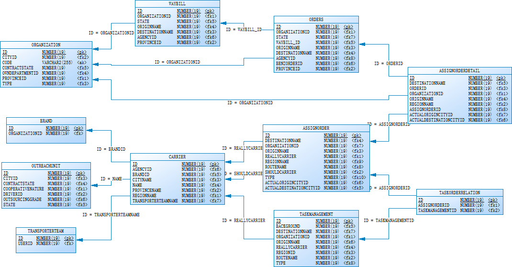

## 1.DV建模

### 1.1 业务模型图：

## 1.2 业务流程

本文档向现有的数据仓库模型中新增:`委托方`及`承运商`信息.

其中，`Organization`为委托方，即运单客户； 承运商为任务执行相关人员，主要包含：`TransportTeam(自由车队)`、`OutreachUnit(外协单位)`;其中，订单、任务与运输单位之间通过`Carrier(承运商份额)`来进行分配管理。

1.3 

