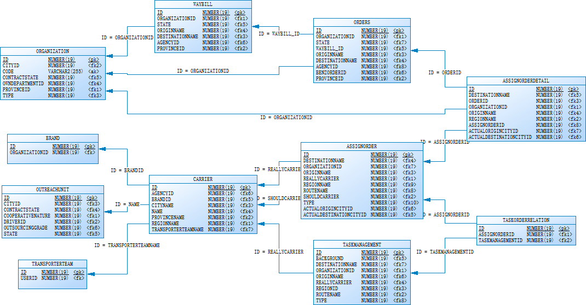

# 建模流程  

## 问题梳理即解决方案  

## 1.DataVault建模  

### 1.1 PowerDesigner逆向生成数据库模型  



### 1.2 根据业务流程，梳理业务模型  

#### 1.2.1 根据业务需求，确定数据范围  

本文档向现有的数据仓库模型中新增:`委托方`及`承运商`信息.

其中，

`Organization`为`委托方`，即运单客户；

 `承运商`为任务执行相关人员，主要包含：`TransportTeam(自由车队)`、`OutreachUnit(外协单位)`;其中，订单、任务与运输单位之间通过`Carrier(承运商份额)`来进行分配管理。


#### 1.2.2 根据业务流程，梳理表间关系  

* `Organization(委托方表)`: 为Waybill运单表、Orders订单表中`OrganizationID`的外键引用表；业务键为**：`COMPANYID`+`NAME`；**

* `Carrier(承运商份额表)`：份额表，关联拼单表（AssignOrder）、任务表(Task)与运输单位间的运输配额关系。其id为`AssignOrder`及`Task`的引用外键。另外，Carrier中，`TransportTeam`字段引用自有车队表，`OutreachUnit`引用外协单位表。`DepartMent`为承运商份额分配者(即区别自有车队与外协单位的视角角色)，份额表为链表，由于其他主体未体现，引入**`Dependent Child Key`**，其中包含：`DEPARTMENTID,AGENCYID, REGIONNAMES, PROVINCENAME,BRANDID,YEAR, MONTH`

* `TransportTeam(自由车队)`：自有车队，业务键：**`DEPARTMENTID`+`NAME`** 

* `OutreachUnit(外协单位)`：外协车队，业务键： **`DEPARTMENTID`+`NAME`** 


### 1.3 构建DataVault模型  


## 2.DataVault模型实施设计  

### 2.1 Stage集结区设计：源表对应的StageTable  

1. 根据DataVault模型，识别出派生列（除了`LoadDate`、`RecordSource`，其他派整列主要集中在Hub以及Link上的HashKey以及Sat卫星表中的`LoadEndDate`,`HashDiff`(如果需要)）  
2. 根据源表所存的所有字段以及需要计算的派生列，确定各源表对应的StageTable结构  
3. 开发各StageTable建表脚本  
4. 产出设计文档：  
    * 4.1. 派生列列表  
        * 4.1.1. 派生列名  

             > 派生列命名方式：HBussinessHK,如： HWayBillHK，LOrderHK,LOrderAssignOrderHK 等。  

        * 4.1.2. 来源表  
        * 4.1.3.来源键(如：`MD5(BK1||BK2||...)`)  
        * 4.1.4. 引用表(主要指明有哪些DV表用到该派生列) )  
        * 4.1.5. 其他备注      
    * 4.2. StageTable结构  

        * 4.2.1 表名  

             > 命名规范：tms_SourceTableName, 如：tms_WayBill  

        * 4.2.2 字段(各表中源字段+派生列)及其类型  

             >注：StageTable的主键为`LoadDate`+`LoadSeq`,`LoadSeq`（生成方法，如`rownum`，`uuid`等）从而保证所有生数据（Raw Data）能够被加载进来；  

        * 4.2.4 表分区设计  
        * 4.2.5 数据来源表  
    * 4.3 建表脚本  

        * > 注：见表语句中，将主键位置放在最前面，即：`PK`,`LoadDate`,`RecordSource`,`LoadEndDate`(如果存在),`FK`(如果存在)，`BK`(如果存在)，`HashDiff`  

### 涉及表

| table             | name             |
| ----------------- | ---------------- |
| ORGANIZATION    | 委托方           |
| WAYBILL           | 运单表           |
| ASSIGNORDER       | 订单             |
| TASKMANAGEMENT    | 任务         |
| CARRIER         | 承运商份额表      |
| TRANSPORTERTEAM | 自有车队表|
| OUTREACHUNIT    | 外协单位表       |

### 1.3 派生列(Derived Columns)

| Table                       | 字段                       | 来源表                         | Hash字段（BK）                                               |
| --------------------------- | -------------------------- | ------------------------------ | ------------------------------------------------------------ |
| all                         | SEQUENCE                   | 批次中的rownum                 | -                                                            |
| all                         | LoadDate                   | 批次执行时间节点               | -                                                            |
| all                         | RecordSource               | 系统.表名                      | -                                                            |
| HubOrganization             | HOganizationHK             | ORGANIZATION                   | CompanyID+Name                                               |
| HSatOrganization            | HashDiff                   | ORGANIZATION                   | ORGANIZATION.all(but BK)                                     |
| LinkOrgWaybill              | LOrgWaybillHK              | 链表查询：ORGANIZATION+Waybill | CompanyID+Name+TransportNR                                   |
| LinkOrgWaybill              | HOganizationHK             | 链表查询：ORGANIZATION+Waybill | CompanyID+Name                                               |
| LinkOrgWaybill              | HWaybillHK                 | 链表查询：ORGANIZATION+Waybill | TransportNR                                                  |
| HubCarrier                  | HCarrierHK                 | TRANSPORTERTEAM, OUTREACHUNIT  | DepartmentID+Name                                            |
| LinkCarrierShare            | LCarrierShareHK            | Carrier                        | DepartmentID+(Name/TransportTeam)+DEPARTMENTID,AGENCYID, REGIONNAMES,   PROVINCENAME,BRANDID,YEAR, MONTH |
| LinkAssignOrderCarrierShare | LAssignOrderCarrierShareHK | 链表AssignOrder+Carrier        | OrderNR+{Should[DepartmentID+(Name/TransportTeam)+DEPARTMENTID,AGENCYID,   REGIONNAMES,PROVINCENAME,BRANDID,YEAR,   MONTH]}+{Real[DepartmentID+(Name/TransportTeam)+DEPARTMENTID,AGENCYID,   REGIONNAMES,PROVINCENAME,BRANDID,YEAR, MONTH]} |
| LinkAssignOrderCarrierShare | LCarrierShareShouldHK      | 链表AssignOrder+Carrier        | OrderNR+{Should[DepartmentID+(Name/TransportTeam)+DEPARTMENTID,AGENCYID,   REGIONNAMES,PROVINCENAME,BRANDID,YEAR, MONTH]} |
| LinkAssignOrderCarrierShare | LCarrierShareRealHK        | 链表AssignOrder+Carrier        | OrderNR+{Real[DepartmentID+(Name/TransportTeam)+DEPARTMENTID,AGENCYID,   REGIONNAMES,PROVINCENAME,BRANDID,YEAR, MONTH]} |
| LinkTaskCarrierShare        | LTaskCarrierShareHK        | 链表TaskMenagement+Carrier     | TaskNumber+[DepartmentID+(Name/TransportTeam)+DEPARTMENTID,AGENCYID,   REGIONNAMES,PROVINCENAME,BRANDID,YEAR, MONTH] |

### 1.4 StagingTable结构

#### 1.4.1 运单委托方

| Table            | Source               | Column            | Type   | Comment |
| ---------------- | -------------------- | ----------------- | ------ | ------- |
| tms_OrgWaybill   | Organization+Waybill | SEQUENCE          | bigint |         |
| tms_OrgWaybill   | Organization+Waybill | LOrgWaybillHK     | string |         |
| tms_OrgWaybill   | Organization+Waybill | LoadDate          | bigint |         |
| tms_OrgWaybill   | Organization+Waybill | RecordSource      | string |         |
| tms_OrgWaybill   | Organization+Waybill | HOganizationHK    | string |         |
| tms_OrgWaybill   | Organization+Waybill | HWayBillHK        | string |         |
| tms_OrgWaybill   | Organization+Waybill | TRANSPORTNR       | string |         |
| tms_OrgWaybill   | Organization+Waybill | ORGANIZATIONID    | bigint |         |
| tms_OrgWaybill   | Organization+Waybill | COMPANYID         | bigint |         |
| tms_OrgWaybill   | Organization+Waybill | NAME              | string |         |
| tms_Organization | ORGANIZATION         | SEQUENCE          | bigint |         |
| tms_Organization | ORGANIZATION         | HOganizationHK    | string |         |
| tms_Organization | ORGANIZATION         | LoadDate          | bigint |         |
| tms_Organization | ORGANIZATION         | RecordSource      | string |         |
| tms_Organization | ORGANIZATION         | HashDiff          | string |         |
| tms_Organization | ORGANIZATION         | COMPANYID         | bigint |         |
| tms_Organization | ORGANIZATION         | NAME              | string |         |
| tms_Organization | ORGANIZATION         | ID                | bigint |         |
| tms_Organization | ORGANIZATION         | ADDRESS           | string |         |
| tms_Organization | ORGANIZATION         | CITYID            | bigint |         |
| tms_Organization | ORGANIZATION         | CODE              | string |         |
| tms_Organization | ORGANIZATION         | CONTACTNAME       | string |         |
| tms_Organization | ORGANIZATION         | CONTRACTENDDATE   | string |         |
| tms_Organization | ORGANIZATION         | CONTRACTNR        | string |         |
| tms_Organization | ORGANIZATION         | CONTRACTSTARTDATE | string |         |
| tms_Organization | ORGANIZATION         | CONTRACTSTATE     | bigint |         |
| tms_Organization | ORGANIZATION         | CREATEDAT         | bigint |         |
| tms_Organization | ORGANIZATION         | CREATEDUSERID     | bigint |         |
| tms_Organization | ORGANIZATION         | DESCRIPTION       | string |         |
| tms_Organization | ORGANIZATION         | FAX               | string |         |
| tms_Organization | ORGANIZATION         | OWNDEPARTMENTID   | bigint |         |
| tms_Organization | ORGANIZATION         | PHONE             | string |         |
| tms_Organization | ORGANIZATION         | PROVINCEID        | bigint |         |
| tms_Organization | ORGANIZATION         | SHORTNAME         | string |         |
| tms_Organization | ORGANIZATION         | TYPE              | bigint |         |
| tms_Organization | ORGANIZATION         | UPDATEDAT         | bigint |         |
| tms_Organization | ORGANIZATION         | UPDATEDUSERID     | bigint |         |
| tms_Organization | ORGANIZATION         | ZIP               | string |         |

#### 1.4.2 建表脚本

```sql
create table stagearea.tms_OrgWaybill( 			
	loadseq	bigint	,
	loaddate	bigint	,
	LOrgWaybillHK	string	,
	RecordSource	string	,
	HOganizationHK	string	,
	HWayBillHK	string	,
	TRANSPORTNR	string	,
	ORGANIZATIONID	bigint	,
	COMPANYID	bigint	,
	NAME	string	,
primary key(loadseq,loaddate)  			
)  			
partition by range(loadseq)(  			
partition 0<=values  			
)  			
stored as kudu; 			
create table stagearea.tms_Organization( 			
	loadseq	bigint	,
	loaddate	bigint	,
	HOganizationHK	string	,
	RecordSource	string	,
	HashDiff	string	,
	COMPANYID	bigint	,
	NAME	string	,
	ID	bigint	,
	ADDRESS	string	,
	CITYID	bigint	,
	CODE	string	,
	CONTACTNAME	string	,
	CONTRACTENDDATE	string	,
	CONTRACTNR	string	,
	CONTRACTSTARTDATE	string	,
	CONTRACTSTATE	bigint	,
	CREATEDAT	bigint	,
	CREATEDUSERID	bigint	,
	DESCRIPTION	string	,
	FAX	string	,
	OWNDEPARTMENTID	bigint	,
	PHONE	string	,
	PROVINCEID	bigint	,
	SHORTNAME	string	,
	TYPE	bigint	,
	UPDATEDAT	bigint	,
	UPDATEDUSERID	bigint	,
	ZIP	string	,
primary key(loadseq,loaddate)  			
)  			
partition by range(loadseq)(  			
partition 0<=values  			
)  			
stored as kudu; 			

```


### 2.2 DataVault设计  

### 各表键值

| name               | code             | BK                             | PK                        | FK                            |
| ------------------ | ---------------- | ------------------------------ | ------------------------- | ----------------------------- |
| 委托方中心表       | HubOrganization  | CompanyID+Name                 | HOganizationHK            |                               |
| 委托方运单链接表   | LinkOrgWaybill   | CompanyID + Name + TransportNR | LOrgWaybillHK             | HOganizationHK +   HWaybillHK |
| 辅助订单任务链接表 | HSatOrganization |                                | HOganizationHK + loaddate | HOganizationHK                |

### 表结构


| Table | Column | KeyType |
| ----- | ------ | ------- |
|       |        |         |
|       |        |         |

### 建表脚本

```SQL
/**LinkOrgWaybill*/			
create table datavault.LinkOrgWaybill( 			
	LOrgWaybillHK	string	,
	loaddate	bigint	,
	RecordSource	string	,
	HOganizationHK	string	,
	HWayBillHK	string	,
primary key(LOrgWaybillHK)  			
)  			
Partition By Hash(LOrgWaybillHK)Partitions 6			
stored as kudu;			
/**HubOrganization*/			
create table datavault.HubOrganization( 			
	HOganizationHK	string	,
	loaddate	bigint	,
	RecordSource	string	,
	COMPANYID	bigint	,
	NAME	string	,
primary key(HOganizationHK)  			
)  			
Partition By Hash(HOganizationHK)Partitions 6			
stored as kudu;			
			
			
			
			
			
			
/**HSatOrganization*/			
create table datavault.HSatOrganization( 			
	HOganizationHK	string	,
	loaddate	bigint	,
	loadenddate	bigint	,
	RecordSource	string	,
	HashDiff	string	,
	ID	bigint	,
	ADDRESS	string	,
	CITYID	bigint	,
	CODE	string	,
	CONTACTNAME	string	,
	CONTRACTENDDATE	string	,
	CONTRACTNR	string	,
	CONTRACTSTARTDATE	string	,
	CONTRACTSTATE	bigint	,
	CREATEDAT	bigint	,
	CREATEDUSERID	bigint	,
	DESCRIPTION	string	,
	FAX	string	,
	OWNDEPARTMENTID	bigint	,
	PHONE	string	,
	PROVINCEID	bigint	,
	SHORTNAME	string	,
	TYPE	bigint	,
	UPDATEDAT	bigint	,
	UPDATEDUSERID	bigint	,
	ZIP	string	,
primary key(HOganizationHK,loaddate)  			
)  			
Partition By Hash(HOganizationHK)partitions 6			
,Range(loaddate)(			
Partition 0<=values<1538323200000	-- 2018/10/1		
,Partition 1538323200000<=values<1546272000000	-- 2019/1/1		
,Partition 1546272000000<=values<1554048000000	-- 2019/4/1		
)			
stored as kudu;			

```


### 2.3 BusinessVault  

TODO ...  

### 2.4 Others  

Todo  

### 2.5 metadata 管理  

1. 利用Impala执行建库、建表语句  

    > Impala所建表的`metadata`跟 `hive表`一样，会存到hive组件中`metastore`所处的数据库中，具体位置可参阅hive专题下的文档：《引用地址》  

1. 于Zeus库中新建`metastore`表，主要包含字段：database/table/column等  
1. 开发链表查询语句，从 `metastore数据库`中获取kudu表的metadata，并导入`zeus库`中的`metastore表`中  

## 3.数据抽取与导入  

本文档中，数据源为RDBMS  

### 3.1 Loading Stage Area  

#### 3.1.1 数据ETL脚本开发  

```sql
/**Load stagearea.tms_Organization*/			
select			
	rownum	as	"loadseq"
,	${loaddate}	as	"loaddate"
,	md5(COMPANYID||NAME)	as	"hoganizationhk"
,	'tms.Organization'	as	"recordsource"
,	md5(ID||ADDRESS||CITYID||CODE||CONTACTNAME||CONTRACTENDDATE||CONTRACTNR||CONTRACTSTARTDATE||CONTRACTSTATE||CREATEDAT||CREATEDUSERID||DESCRIPTION||FAX||OWNDEPARTMENTID||PHONE||PROVINCEID||SHORTNAME||TYPE||UPDATEDAT||UPDATEDUSERID||ZIP)	as	"hashdiff"
,	COMPANYID	as	"companyid"
,	NAME	as	"name"
,	ID	as	"id"
,	ADDRESS	as	"address"
,	CITYID	as	"cityid"
,	CODE	as	"code"
,	CONTACTNAME	as	"contactname"
,	CONTRACTENDDATE	as	"contractenddate"
,	CONTRACTNR	as	"contractnr"
,	CONTRACTSTARTDATE	as	"contractstartdate"
,	CONTRACTSTATE	as	"contractstate"
,	CREATEDAT	as	"createdat"
,	CREATEDUSERID	as	"createduserid"
,	DESCRIPTION	as	"description"
,	FAX	as	"fax"
,	OWNDEPARTMENTID	as	"owndepartmentid"
,	PHONE	as	"phone"
,	PROVINCEID	as	"provinceid"
,	SHORTNAME	as	"shortname"
,	TYPE	as	"type"
,	UPDATEDAT	as	"updatedat"
,	UPDATEDUSERID	as	"updateduserid"
,	ZIP	as	"zip"
from localtms.Organization			
			

```


#### 3.1.2 NiFi作业流程开发  

* 3.1.1 配置数据源  
* 3.1.2 配置StageArea集结区链接  
* 3.1.3 作业流程开发及执行  
#### 3.1.3 Stage数据备份  

### 3.2 Loading Data Vault  

```sql
/**LinkOrgWaybill*/			
insert into datavault.LinkOrgWaybill select 			
s.	LOrgWaybillHK		,
s.	loaddate		,
s.	RecordSource		,
s.	HOganizationHK		,
s.	HWayBillHK		
from stagearea.tms_orgwaybill s			
where not exists (select 1 from datavault.LinkOrgWaybill t where t.HOganizationHK = s.HOganizationHK and t.HWaybillHK = s.HWaybillHK )			
and s.LoadDate=${loaddate}			
;			
			
			
			
/**HubOrganization*/			
insert into datavault.HubOrganization select 			
s.	HOganizationHK		,
s.	loaddate		,
s.	RecordSource		,
s.	COMPANYID		,
s.	NAME		
from stagearea.tms_Organization s			
where not exists (select 1 from datavault.HubOrganization t where t.COMPANYID = s.COMPANYID and t.NAME = s.NAME )			
and s.LoadDate=${loaddate}			
;			
			
			
			
			
			
			
/**HSatOrganization*/			
insert into datavault.HSatOrganization select 			
s.	HOganizationHK		,
s.	loaddate		,
	null		,
s.	RecordSource		,
s.	HashDiff		,
s.	ID		,
s.	ADDRESS		,
s.	CITYID		,
s.	CODE		,
s.	CONTACTNAME		,
s.	CONTRACTENDDATE		,
s.	CONTRACTNR		,
s.	CONTRACTSTARTDATE		,
s.	CONTRACTSTATE		,
s.	CREATEDAT		,
s.	CREATEDUSERID		,
s.	DESCRIPTION		,
s.	FAX		,
s.	OWNDEPARTMENTID		,
s.	PHONE		,
s.	PROVINCEID		,
s.	SHORTNAME		,
s.	TYPE		,
s.	UPDATEDAT		,
s.	UPDATEDUSERID		,
s.	ZIP		
from stagearea.tms_Organization  s			
left outer join datavault.HSatOrganization t on 			
(s.HOganizationHK=t.HOganizationHK and t.loadenddate is null)			
where 			
(t.hashdiff is null or s.hashdiff <> t.hashdiff)			
and s.loaddate=${loaddate}			

```


#### 3.2.4 Truncate Stage  

### 3.3 Loading Business Vault  

#### TODO...  

