# Visual Data Vault [Modeling Language]
> 

> Version 1.1 
>
> “The [Visual Data Vault] modeling language […] is a great  visual paradigm.” 
>
> “It is a great contribution to the Data Vault world.”  
> – Dan Linstedt  
>
> Michael Olschimke with Dan Linstedt 
> Olschimke Beratungsgesellschaft mbH 
> 4/20/2017 


[TOC]


## 1 INTRODUCTION 


Data Vault is a modeling technique for building enterprise data warehouses (EDW). It was invented by business intelligence practitioner Dan Linstedt to improve the scalability, performance, and agility of data warehouses. 


With the advent of Data Vault 2.0, which adds architecture and process definitions to the Data Vault 1.0 standard, Dan Linstedt standardized the Data Vault symbols used in modeling. Based on these standardized symbols, we developed the Visual Data Vault (VDV) modeling language, which can be used by EDW architects to build Data Vault models. The focus of the language is on the logical design of a Data Vault model. Therefore, physical features, such as meta-information (sequence numbers, hash keys, record source, load date timestamp, etc.) and column order are not supported. 


To support the creation of Visual Data Vault drawings in Microsoft Visio, we implemented a stencil that can be used to draw Data Vault models. The modeling language and the stencil were first presented at the World-Wide Data Vault Consortium meeting in St. Albans, VT in March 2014. It currently supports Data Vault 1.0 and 2.0. Our goal is to add more capabilities to the stencil in upcoming versions. Please see section 7 for details. 


Note that the primary purpose of the Microsoft Visio stencils for Visual Data Vault is to document Data Vault models, for example in early modeling, requirements gathering, or presentations. It is not intended to be used to generate Data Vault implementations from the drawing. However, tool vendors are welcome to use the graphical symbols as presented in this paper to implement the Visual Data Vault modeling language in their own tools, royalty free. See section 8 for details. Special thanks go to our consultants Jens Lehmann and Timo Cirkel, who have done most of the stencil development. Note that some examples in this paper are based on Dan Linstedt’s book Super Charge Your Data Warehouse. Also note that this paper is not a Data Vault standardization document and doesn’t replace Dan Linstedt’s documentation or training. Its primary purpose is to describe the Visual Data Vault modeling language, its features, and guidelines for modeling.  


The stencil is available at www.visualdatavault.com. 


## 2 INSTALLATION


To use the Data Vault stencils in your Microsoft Visio drawings, copy the Data Vault.vss file to My Documents\My Shapes. 


The Data Vault stencils require Microsoft Visio 2010 or newer. Older versions might work, but we have not tested this. 


## 3 BASIC ENTITIES 
Data Vault is based on three basic entities: hubs, links, and satellites. The next sections briefly introduce those entities and discuss how to draw them using the stencil. 
### 3.1 HUBS 
Business keys1 play an important role in every business, because they are referenced by business transactions and relationships between business objects. Therefore, Data Vault is based on the business keys that are stored in hub entities2: 

>Figure 1: Data Vault hub 
>
>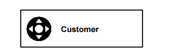


Figure 1 shows the logical symbol for Data Vault hubs. It consists of the logical icon to the left and the name of the hub to the right. The name may also include a schema if required.  The name of hub might wrap over multiple lines or, as an alternative, the width of the logical hub symbol might be extended. This is true for all of the following elements.  
```
The Microsoft Visio stencil supports both options.  
```
#### 3.1.1 Business Keys 

In order to document the business keys3 that are included in the hub, you can add business keys to the model: 

>Figure 2: Data Vault hub with business keys 
>
>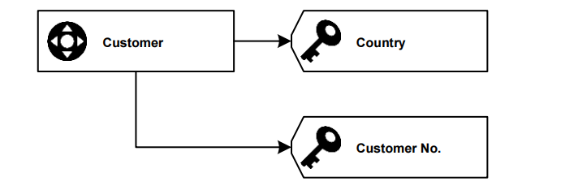


As you can see from Figure 2, multiple business keys on a hub (composite keys4) are allowed. You can also provide the logical data type of the business key. The optional data type is provided after a colon, as is shown in Figure 3: 
​                                                           
>Figure 3: Data types given for business keys
>
>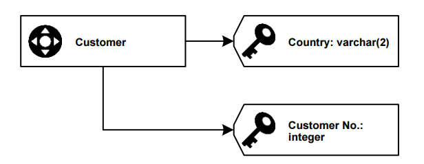


Avoid line breaks between the name of the business key and its data type. 

The logical data types are oriented to the data types in the SQL92 standard. 

In above examples, each business key is modeled as an individual attribute in the hub entity. The combination identifies a business object in the data warehouse. 


#### 3.1.2 Smart Keys 

In order to model a smart key5 (a key that comprises multiple parts or keys), add a smart key to the hub and then add business keys to identify the sections of the smart key: 

>Figure 4: Smart key with individual sections
>
>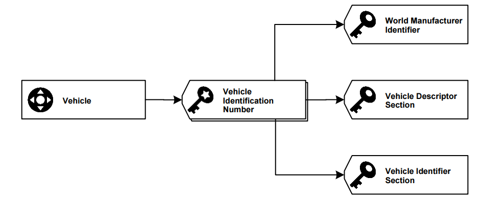 


As you can see from Figure 4, the logical symbol of a smart key is similar to that of a business key. However, the icons are slightly different and the shape indicates a stack. Note that checksums or other meta-information are not modeled. For example, a vehicle identification number includes a checksum at position 9 of the 17-character string, and this is not modeled in Figure 4. The reasoning behind this is that such checksum represents physical features, which are not modeled in the Visual Data Vault modeling language. 


In some cases, the format of the smart key is unclear or there are multiple format definitions for the same business key (hub). In such cases, you should avoid modeling the smart key in the Visual Data Vault modeling language. There are multiple reasons for this recommendation: 


• Modeling multiple smart keys for the same hub requires some sort of grouping of those definitions, which is currently not supported by the Visual Data Vault modeling language. 
• Multiple smart keys make the hub definition more complex. 
• Oftentimes (but not always), the definition of smart keys for such hubs either changes over time or new smart key definitions are added to the current list of definitions.  


It is also possible to have a composite key that consists of one or more business keys in which some elements might be smart keys: 

>Figure 5: Hub with composite key consisting of smart key and business key 
>
>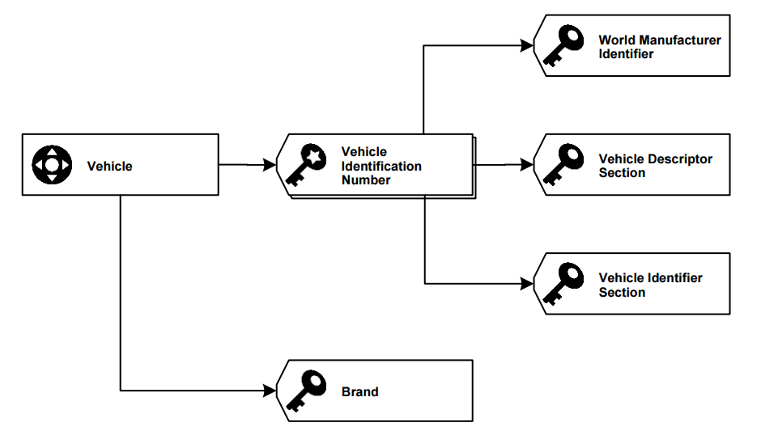


The example in Figure 5 follows the composite key example in Figure 2. Another example of a hub with composite business key is given in Figure 6: 


>Figure 6: Hub with multiple smart keys 
>
>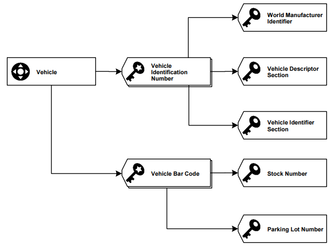


In this example, the composite key is made up of two smart keys with their own definitions. Note that the vehicle in this (artificial) example is identified by the combination of the two smart keys. This example illustrates why smart keys with multiple formats (our previous discussion) are too complicated to express in the Visual Data Vault modeling language without additional elements. A simple listing of multiple smart key formats would conflict with the composite key definition. 


### 3.2 LINKS 

Links6 connect individual hubs in a Data Vault model and represent either transactions or relationships between business objects. A link is represented by the following logical symbol in Data Vault modeling: 

>Figure 7: Data Vault link 
>
>

Figure 8 shows a link that connects multiple hubs (a link has to have at least two connections):  

>Figure 8: Link with multiple hubs 
>
>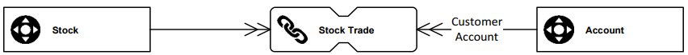


The link in Figure 8 references two hubs: Stock and Account. In the first case, the sequence number (Data Vault 1.0), and respectively the hash key (Data Vault 2.0) are replicated into the link entity by using the same attribute name as in the hub. The connector (the arrow) should be read as “(the hub) Stock is used by (the link) Stock Trade.” The second reference is a little different because the name of the connection between the Account hub and the link is overwritten by the Customer Account name. This is necessary in cases where the model requires more meaning or when multiple connections are required to the same hub, as in Figure 9: 


>Figure 9: Link with multiple hub references 
>
>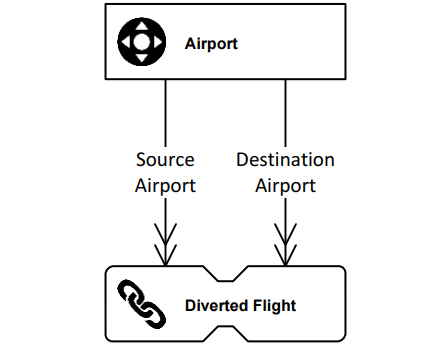


Because the link has to include multiple sequence numbers (Data Vault 1.0) or hash keys (Data Vault 2.0), each reference has to be named to derive unique physical attribute names from the model. Therefore, the naming becomes no longer optional. Note that this definition of a Data Vault link is valid because the link includes two hub references. It is not required that the hubs be different. Physical features, such as sequence numbers or hash keys, are not modeled in Visual Data Vault. 


However, it is possible to add attributes to links, for example for transactional links7 (see section 3.2.1) or when degenerated fields8 are required by the link for identification: 


>Figure 10: Transactional link with attributes 
>
>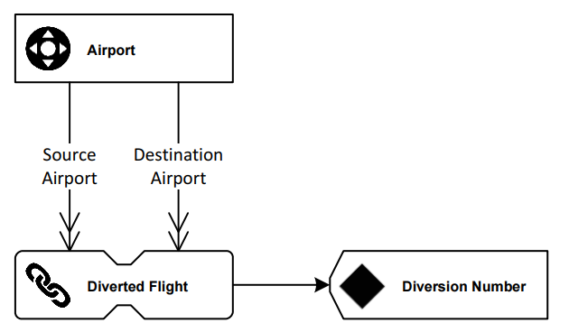


In Figure 10, a flight might be diverted multiple times. The number is captured by the degenerated field Diversion Number. The attribute is added to the link, similar to the way that business keys are added to hubs. We will see in section 3.3 that it follows the same pattern as adding attributes to satellites.  


Designers who use the Visual Data Vault modeling language are free to model the details of their Data Vault models as needed. In some cases, it makes sense to hide unnecessary details (such as the business keys of a hub) when modeling overview diagrams.  
```
The Microsoft Visio stencil doesn’t require you to model any details. 
```

#### 3.2.1 Dependent Link 
The dependent link is a construct to implement links with degenerated (weak) hubs. They are also known as peg-legged links, degenerated links or weak links. The following figure shows a dependent link for an invoice with line-item numbers: 

>Figure 11: Dependent link 
>
>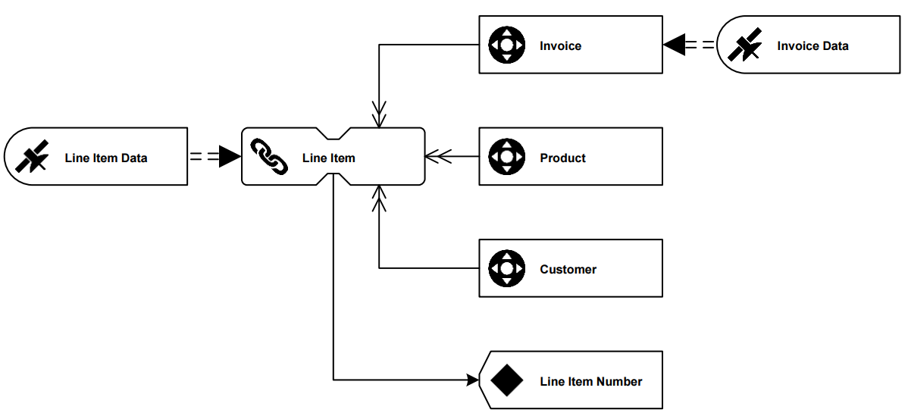


The degenerated hub is implemented as an attribute Line Item Number directly in the link structure. 


### 3.2.2 Link Driving Key 
The link driving key concept is used to appropriately end-date satellite entries, based on the driving key (also called “master key”). Figure 12 shows how this concept is modeled in Visual Data Vault: 


>Figure 12: LInk Driving Key 
>
>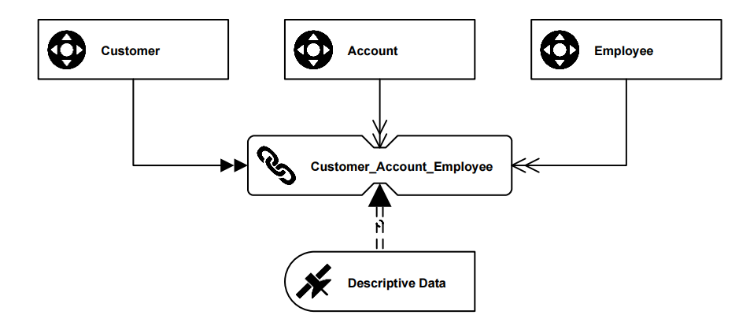


The link driving key Customer is indicated by a bold arrow. 


#### 3.2.3 Transactional Links 
Transactional links9 store data that cannot legally change. Therefore, no meta-data is required for supporting changes (such as the load end-date timestamp in dependent satellites). There are two options for modeling such links: the first one is to model all descriptive attributes of the transaction into the link structure. This option is described in this section. Section 3.3.3 describes the second option, which requires a dependent transactional satellite that prohibits data updates or deletions. The symbol for transactional links is given in Figure 13: 

>Figure 13: Data Vault transactional link 
>
>


It follows the common link symbol with the addition of a small T in its symbol.  Other than that, modeling a transactional link is the same as standard links, as is shown Figure 14: 


>Figure 14: Transactional link for sales with hubs and satellites 
>
>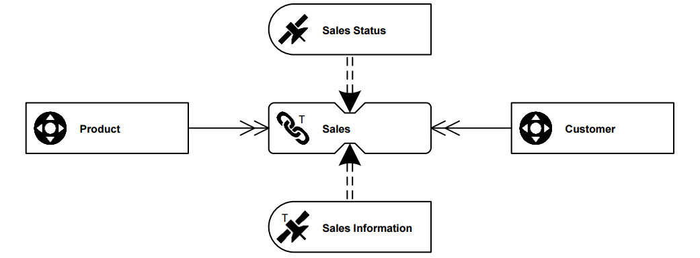


The diagram shows that it is also possible to append standard, non-transactional satellites that might change, for example to track the status of payments.  


#### 3.2.4 Link-to-Link 
In some cases, EDW modelers want to model a link-to-link10 relationship, as is illustrated in Figure 15: 

>Figure 15: Link-to-link relationships 
>
>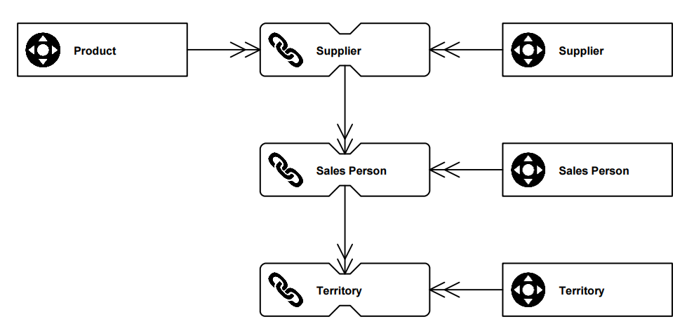


However, the use of such structures is not recommended as it hinders the automated loading of Data Vault tables. There is a dependency between the links that has to be resolved by the loading process (which is often not supported by the automation tool or makes the process more complex). 


### 3.3 SATELLITES 
Satellites11 add descriptive data to hubs and links. The logical symbol for a satellite is presented in Figure 16: 

>Figure 16: Data Vault Satellite 
>
>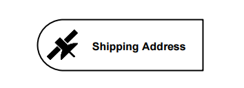


Descriptive data is stored in attributes that are added to the satellite: 


>Figure 17: Satellite attributes
>
>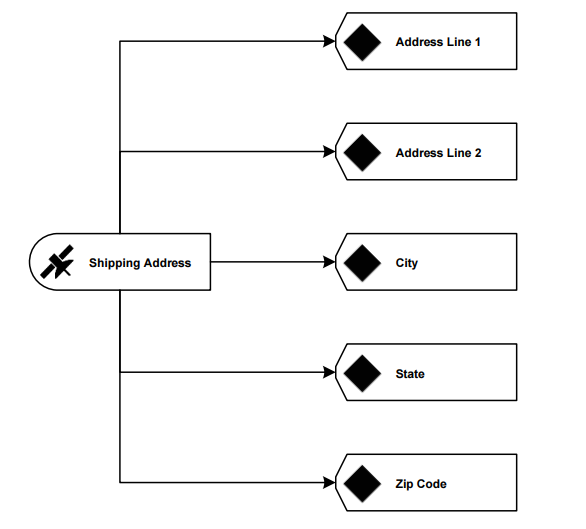 


The individual attributes are added to the satellite one at a time.  A satellite might be attached to any hub or link. However it is only possible to attach the satellite to one parent, as is shown in Figure 18: 


>Figure 18: Satellite on hub with attributes 
>
>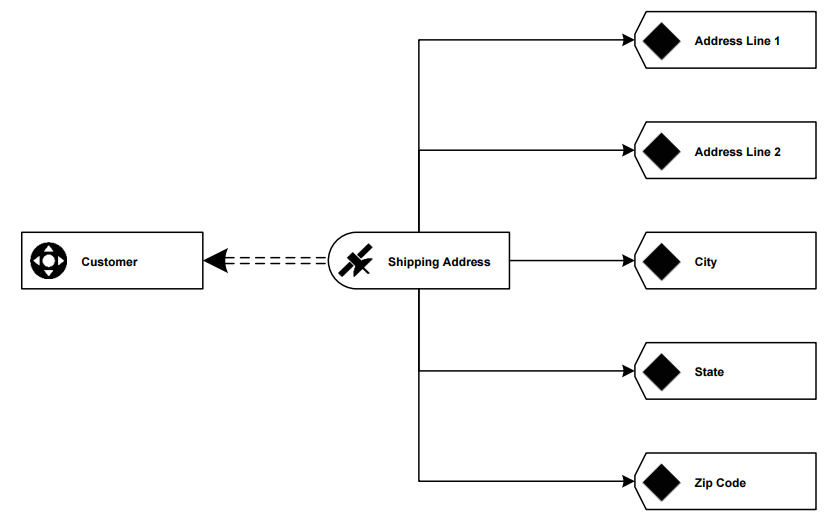


In this case, Shipping Address satellite with accompanying attributes (Address Line 1 to Zip Code) is attached to the Customer hub. The connection between the satellite and the hub could be expressed by the statement “(satellite) Shipping Address depends on (hub) Customer.” 


It is also possible to add multiple satellites to one parent, as is shown Figure 19: 


>Figure 19: Multiple satellites on link 
>
>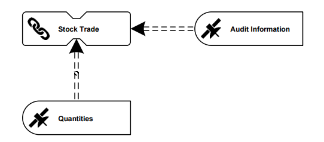


The figure shows that there are two satellites on the Stock Trade: Audit Information and Quantities link. There is no limit to the number of satellites a hub or link can have. Figure 17 also demonstrates that satellites don’t have to show the associated attributes when presented in an overview diagram.  


#### 3.3.1 Record Tracking Satellites 

A record tracking satellite12 identifies the source and availability of keys and associations. Because this is a special form of a satellite and is only implemented when required, a special shape was dedicated to that purpose: 

>Figure 20: Record tracking satellite on hub Customer 
>
>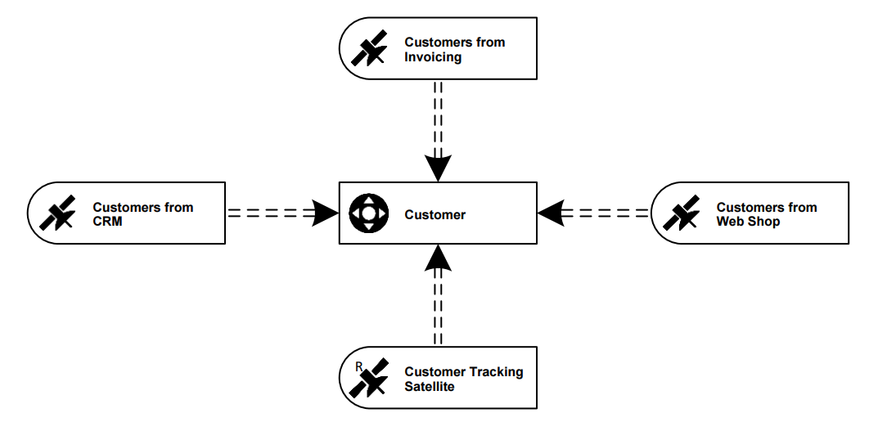


As Figure 20 shows, a record tracking satellite might be added to every hub or link. Note that Visual Data Vault doesn’t provide an indicator as to whether the satellite uses a de-normalized or normalized entity structure, because this is a physical feature, which is out of scope of the modeling language. 


#### 3.3.2 Status Tracking Satellites 


Because status tracking satellites13 follow the general satellite structure in Data Vault modeling, there is no dedicated shape available. Instead, the default satellite shape is used to indicate a status tracking satellite, as Figure 21 shows: 


>Figure 21: Status tracking satellite 
>
>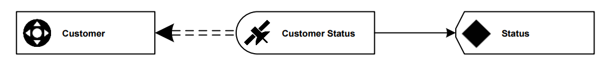


The record source attribute is a common meta-data attribute. Therefore, it is not modeled in Visual Data Vault. 


#### 3.3.3 Transactional Satellites 
Data Vault allows two options for modeling transactional links: the first option was explained in section 3.2.1 and involves a complex transactional link without an accompanying satellite structure. The second option is to use a transaction link without descriptive attributes and to add these attributes to a transactional satellite14 that depends on the transactional link: 

> Figure 22: Transactional satellite 
>
> 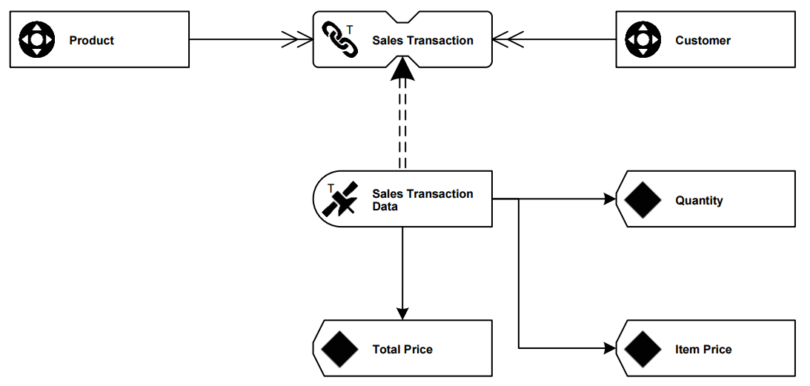


As is shown in Figure 22, there is a special shape in the Visual Data Vault modeling language because the satellite doesn’t provide any history (e.g., load date timestamp or load end-date timestamp).  


## 4 QUERY ASSISTANT TABLES 
Query assistant tables15 are built to increase the performance of the Data Vault. The next sections introduce the shapes in the Visual Data Vault modeling language that support this unique feature. 

### 4.1 POINT-IN-TIME (PIT) TABLES 
A point-in-time (PIT) table16 is a structure that enhances the query performance in the Data Vault model. It spans across all satellites of a hub or link. The logical symbol is presented in Figure 23: 

>Figure 23: Point-in-time (PIT) table symbol 
>
>


When a PIT table is created for a specific hub or link, it is implemented on all dependent satellites. Therefore, there is no need to indicate which satellites should be included in the PIT. If a hub or link has an associated PIT table, the PIT shape is attached to the hub or link entity to which it belongs: 


>Figure 24: PIT table on a Data Vault hub 
>
>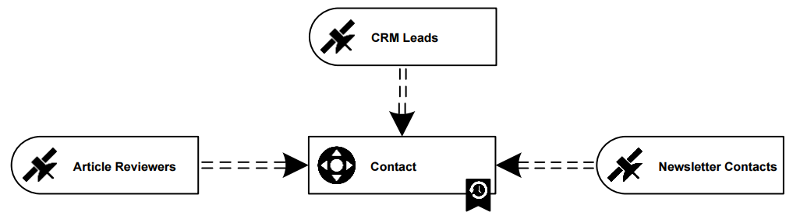


In this case, there are three satellites that depend on the Contact hub: the CRM Contacts satellite, the Article Reviewers satellite, and the Newsletter Contacts satellite. The PIT symbol is attached to the hub, and it indicates that a PIT table must be built for this hub for performance reasons. It is not possible to limit the number of satellites that are included in the PIT table. As already stated, all satellites of the base entity are included in the PIT table. If new satellites are added to the hub, they have to be added to the physical PIT table as well. 

```
There is a connector available near the lower right corner of Hub and Links 
shapes in Microsoft Visio where the PIT symbol must be attached. 
```

### 4.2 BRIDGES 
Similar to PIT tables, bridge tables17 also connect Data Vault entities. However, instead of improving the join performance between hubs (or links) and their satellites, bridges improve the join performance between hubs and links that are connected to each other in the Data Vault model. Figure 25 presents the logical symbol of a bridge in the Visual Data Vault modeling language: 


>Figure 25: Data Vault bridge 
>
>


Because a bridge connects only a subset of the model’s hubs and links, the bridge has to be connected to the hubs and links that are to be included in the bridge: 

>Figure 26: Data Vault bridge in a model 
>
>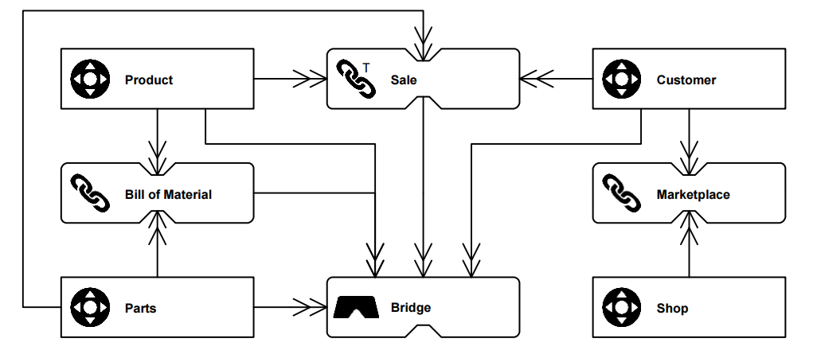


Figure 26 shows a bridge Product that connects (or “bridges”) a subset of the Data Vault model presented in the drawing. It includes the Product, Customer and Parts hubs and the links between those hubs. It doesn’t include any other hubs or links and no satellites at all (per definition).  


Usually, the connections use the names of the hubs included in the bridge. If the connection has an overwritten hub reference (as presented in Figure 8 and discussed in section 3.2) the name of the hub reference is used, as shown in Figure 27: 
>Figure 27: Data Vault bridge with overwritten reference 
>
>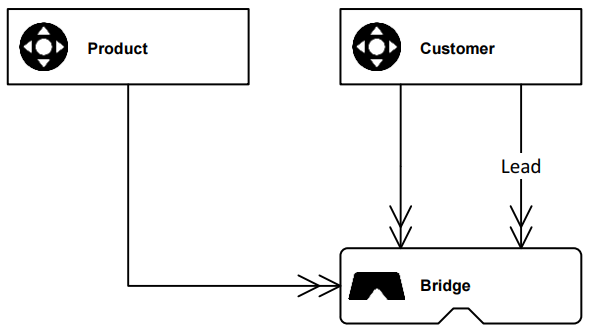


In this case, the Customer hub is part of the bridge twice. First it is a Customer reference; the second time it is a Lead reference. The same concept applies to any link references that have to overwrite the name of the link. Note that the implementation aspects are implicit and there are no foreign keys defined or used for referential integrity. 


## 5 REFERENCE TABLES 

Reference tables18 are used by the Data Vault model to store descriptive reference data. They are similar to lookup tables and are necessary to resolve descriptions from codes or to translate keys in to a consistent manner. There are two types of reference tables: tables without history19 and tables with history20. The expression of both table types in the Visual Data Vault modeling language is discussed in the next sections. 

### 5.1 NO-HISTORY REFERENCE TABLES 
The logical symbol for a reference table in the Visual Data Vault modeling language is as follows: 

>Figure 28: Reference table 
>
>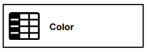


A reference consists of a code and one or more descriptive columns. Figure 29 shows that the business key and attribute elements known from previous sections are used to express this: 


>Figure 29: Reference table with business key and attributes 
>
>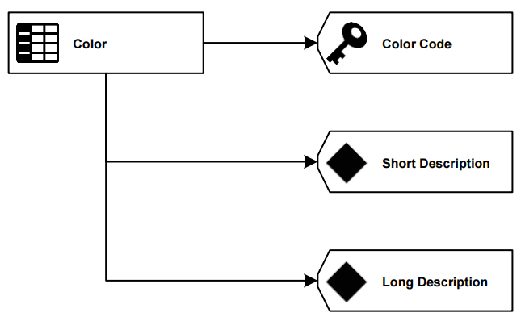


In this case, the reference table Category consists of the natural key Code and two descriptive attributes: Short Description and Long Description. Note that the natural key is expressed by a business key element. 


It is also possible that the natural key consists of a smart key. In this case, the smart key concept from hubs is reused: 


>Figure 30: Reference table with smart key 
>
>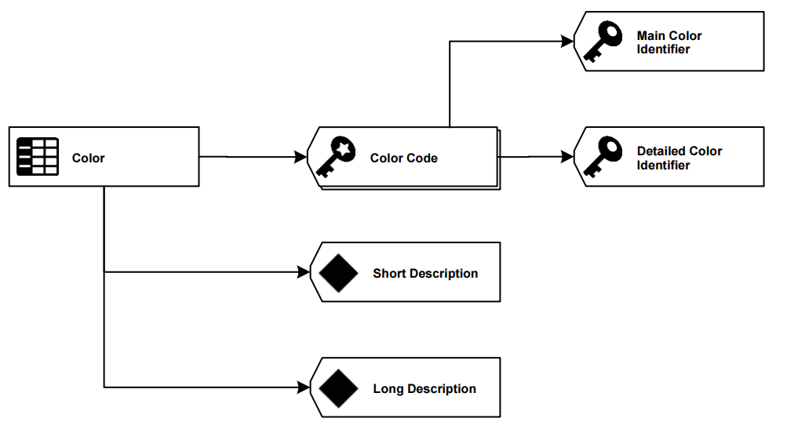


Figure 30 shows a reference table with a Color Code smart key that consists of the following parts: Main Color Identifier and Detailed Color Identifier. Similar to smart keys for hubs, meta-information such as a checksum is not modeled. 

In rare cases, the natural key could also be a composite key. In this case, there are multiple business key elements on the reference table, as is illustrated in Figure 31: 

>Figure 31: Reference table with composite key 
>
>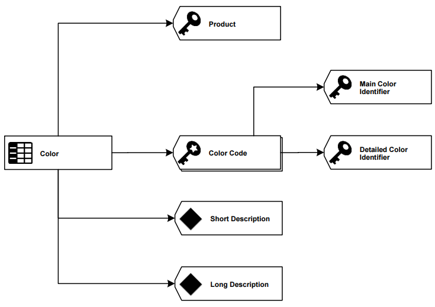


Similar to business keys in hubs, it is also possible to mix ordinary codes with smart keys to make up the composite natural key. 


### 5.2 HISTORY-BASED REFERENCE TABLES 


History-based reference tables are used if the descriptive attributes for a code change over time and this change should be tracked by the enterprise data warehouse. In this case, a satellite is added to the reference table that tracks the descriptive attributes: 

>Figure 32: History-based reference table 
>
>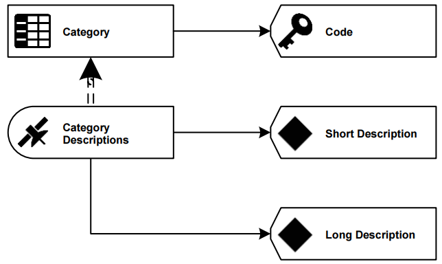


Figure 32 shows that the attributes are separated from the business key in the reference table by moving them into the dependent satellite. You should only have one satellite per reference table, but the model doesn’t limit the number of satellites. 


The history-based reference table could also have a composite or smart key, similar to no-history reference table described in the previous section. 


### 5.3 CODE AND DESCRIPTIONS 
In some Data Vaults, there is a master code table21 that provides the description for commonly used codes. Instead of distributing them over multiple reference tables (as described in the previous sections), they are combined into a single reference code table. To express such table, use a non- history or history based reference table with a composite key: 

>Figure 33: Code and descriptions 
>
>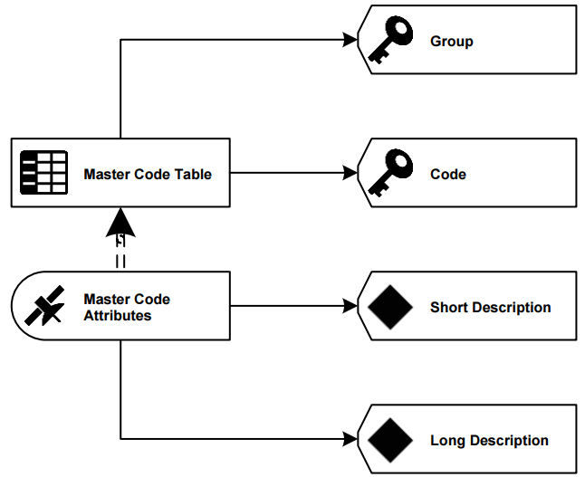


Figure 33 shows a history-based reference table called RefCode that has a composite key made up of Group and Code. The description is stored in the RefCode dependent satellite in the Description attribute.  


## 6 BUSINESS VAULT 

Visual Data Vault supports a number of entities that are typically used in the Business Vault22. These entities have in common that at least one element is computed, making the entity not auditable. 

### 6.1 COMPUTED SATELLITES 

The first type of Business Vault entities are computed satellites23. They typically describe a hub or link with attributes that are computed, for example aggregated sums or average values. They might also include calculated formulas, for example to provide the invoice total including taxes. A computed satellite has the following symbol in the Visual Data Vault modeling language: 

>Figure 34: Computed Satellite 
>
>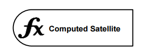


The shape follows the standard satellite shape with a different icon to show that it is part of the Business Vault. It is possible to add attributes to the computed satellite and attach it to a hub or link, as is shown in the following figure: 

>Figure 35: Computed satellite on a link 
>
>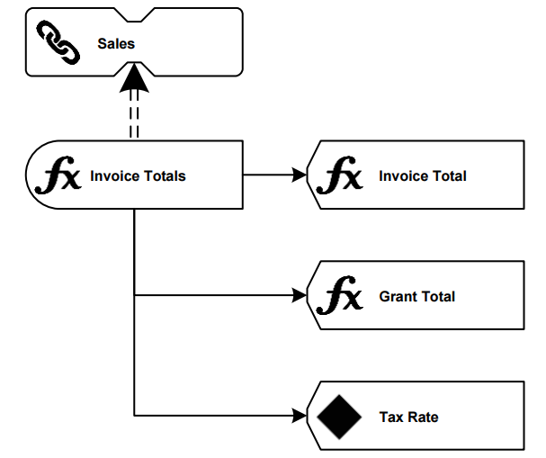


Figure 35 shows an Invoice Totals computed satellite that has been attached to the Sales link and that provides two computed attributes: Invoice Total and Grant Total (which includes the tax). It also includes a default attribute, Tax Rate, which is from a source dataset and represents data that has been duplicated into this satellite for better usability or higher performance.  


### 6.2 COMPUTED AGGREGATE LINKS 
Computed aggregate links24 are another example of Business Vault tables and are actually similar to bridges, despite the name. Therefore, the symbol of such a “link” in the Visual Data Vault modeling language is the following: 

>Figure 36: Computed aggregate link 
>
>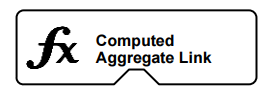


It follows the shape of a bridge and uses the icon for Business Vault entities. Figure 37 shows a more detailed example: 

>Figure 37: Computed aggregate link in a Data Vault model 
>
>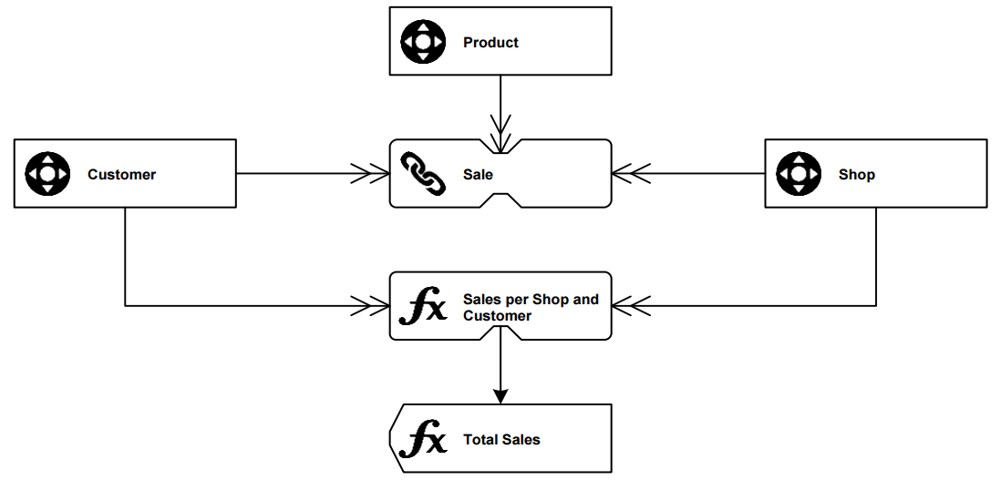


The computed aggregate link in Figure 37 changes the granularity of the link Sale by aggregating the data of the reference to the Product hub. The aggregated data (now information) is stored in the Total Sales computed attribute for the computed aggregate link (Sales per Shop and Customer). Therefore, this computed attribute becomes part of the aggregated link structure when it is generated to the database. 


There is an alternative version of computed aggregate links based on raw links. Because the raw link cannot be modified, the aggregated data is added to a computed satellite which is attached to the raw link: 


>Figure 38: Computed aggregate link on raw link 
>
>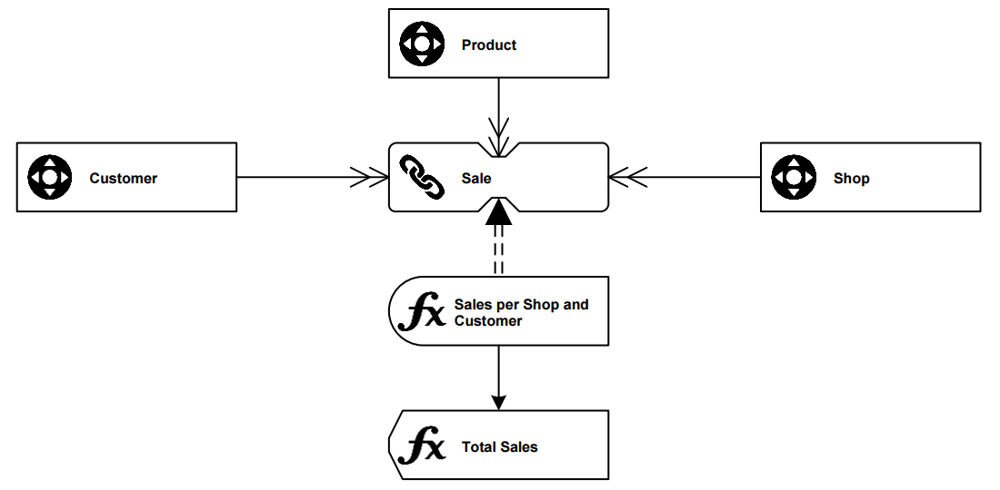


Figure 38 shows the same Raw Data Vault link Sale as in Figure 37. However, instead of creating an additional Business Vault link, the aggregated data is added by a computed satellite. Only the aggregated (computed) column Total Sales is shown for this computed satellite. 


### 6.3 EXPLORATION LINKS 
Exploration links25 are artificial, computed links that have no source equivalent. They are generated for business purposes only. To indicate such a link in Visual Data Vault, the following shape is available:  


>Figure 39: Exploration link 
>
>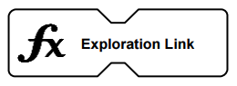


As Figure 39 shows, the exploration link uses a shape that is similar to the common link, but it has a different symbol. Other than that, it follows the standard modeling procedure that is used for the common Data Vault link (see section 3.2). 


### 6.4 BUSINESS VAULT TABLES 
Because you are not required to follow the standard Data Vault entities in the Business Vault26 (as computed satellites, computed aggregate links, and exploration links do), it is also possible to create any entity structure. That is where the Business Vault shape comes into play: 

>Figure 40: Business Vault table 
>
>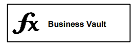


You can use this entity type to model any structure with business keys and attributes, as is shown in Figure 41: 

>Figure 41: Business Vault table with keys and attributes 
>
>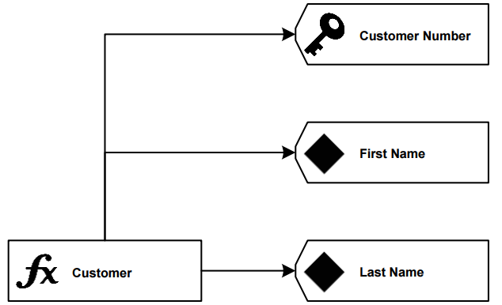


It is also possible to combine general Business Vault tables with other structures from the Business Vault and the raw Data Vault:  

>Figure 42: Business Vault table integrated into Raw Data Vault 
>
>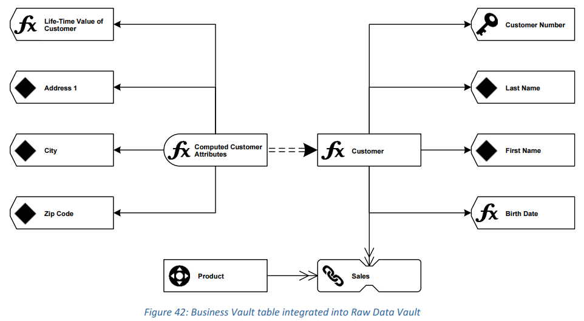


Figure 39 shows a Customer Business Vault table. The table has one business key (Customer Number) and two attributes (Last Name and First Name). The other attribute is the Birth Date attribute, which might have been computed from an age attribute in the source system. Other attributes are added to the Customer Business Vault table using the Computed Customer Attributes satellite to the left of the table. You might do this, for example, to support historization of these attributes. Again, the Life- Time Value of Customer computed attribute represents a calculated value that is not found in the source system. For a detailed discussion on computed satellites, refer to section 6.1. Note that it doesn’t make sense to attach standard satellites to the Business Vault table because standard satellites can only be attached to a standard hub or link due to the requirement for a sequence number (Data Vault 1.0) or hash key (Data Vault 2.0) that they can reference. Therefore, the Business Vault table must provide a primary key (either a sequence number in Data Vault 1.0 or a hash key in Data Vault 2.0) that can be used to link the table to Raw Data Vault entities. Figure 42 shows the linking of the Customer Business Vault table with the Product hub through the Sales link. 


## 7 HOW TO GET UPDATES AND SUPPORT 
To receiving updates, please register at www.scalefree.com if you haven’t yet done so. Please send inquiries and feature requests to molschimke@scalefree.com.  


For online Data Vault training and on-site training inquiries in English, please contact Dan Linstedt at www.learndatavault.com. You can also contact Olschimke Beratungsgesellschaft mbH for Data Vault training in Europe. 


## 8 IMPLEMENTING VISUAL DATA VAULT 
This document and the accompanying Microsoft Visio stencil is © Copyright 2017 by Olschimke Beratungsgesellschaft mbH, Germany. All rights reserved. You are not allowed to redistribute them without prior written permission from Olschimke Beratungsgesellschaft mbH or its successor. 


You are free to implement the Visual Data Vault modeling language (including all symbols) in any tool you like, royalty free. Loss-free icons in Adobe Illustrator and Windows Meta File Format are available upon request. Olschimke Beratungsgesellschaft mbH has developed them and will distribute them both free of charge and without royalties. Vendors are welcome to use them in their software. We are also happy to provide professional support to vendors who want to implement the shapes and icons in their software. 


We welcome free copies of your work (books, software, etc.). Please contact molschimke@scalefree.com.  


## 9 ABOUT THE AUTHORS 


>

**Michael Olschimke** is the CEO of Olschimke Beratungsgesellschaft mbH, a BI consultancy firm with focus on Data Vault in Germany and exclusive provider of Data Vault 2.0 trainings and lifetime certification in Europe. With more than 14 years professional experience in IT, Michael has specialized in data modeling and data analytics. His current focus is on the automotive sector. He holds a M.Sc. in MSIS from Santa Clara University and a diploma (FH) from the University of Applied Sciences Bingen, Germany. 

>

**Daniel Linstedt** is a world renowned speaker and author.  He has over 25+ years of experience in IT, and 20+ years in Business Intelligence.  Daniel is the author, founder, and creator of the Data Vault Model and Methodology.  His clients include government agencies and fortune 50 clients around the world. 

  

## Reference Resource

[VISUAL DATA VAULT DOWNLOAD](http://www.visualdatavault.com/)