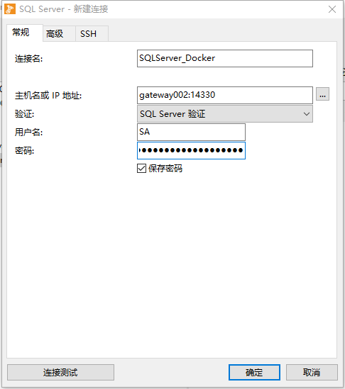

# 使用 Docker 运行 SQL Server 2017 容器映像

**适用于：** SQL Server (仅限 Linux)

在本快速入门教程中，你使用 Docker 请求和运行 SQL Server 2017 容器映像 [mssql server linux](https://hub.docker.com/r/microsoft/mssql-server-linux/)。 然后使用 **sqlcmd** 连接，以创建第一个数据库并运行查询。

> 备注
>
> 本快速入门专门重点介绍 mssql-server-linux 映像的使用。 [mssql-server-windows-developer Docker 中心页](https://hub.docker.com/r/microsoft/mssql-server-windows-developer/)上找到关于Windows 映像的详细信息。

## Prerequisites

- [Install Docker](https://docs.docker.com/engine/installation/)（安装 Docker）。
- 至少 2 GB 的磁盘空间
- 至少 2 GB 的 RAM
- [Linux 上的 SQL Server 的系统要求](https://docs.microsoft.com/zh-cn/sql/linux/sql-server-linux-setup?view=sql-server-2017#system)。

## 请求和运行容器映像

1. 从 Docker Hub 中拉出 SQL Server 2017 Linux 容器映像。

   ```bash
   sudo docker pull microsoft/mssql-server-linux:2017-latest
   ```

   该命令拉取最新的 SQL Server 2017 容器映像。 如果想请求某个特定映像，需添加一个冒号和标记名称（例如 `microsoft/mssql-server-linux:2017-GA`)要查看所有可用映像，请参阅 [mssql-server-linux Docker 中心页](https://hub.docker.com/r/microsoft/mssql-server-linux/tags/)。

   > 在本文中，bash 命令`sudo`使用。 在 Linux 上，如果不想要使用`sudo`若要运行 Docker，可以配置**docker**组，并将用户添加到该组。 有关详细信息，请参阅[安装后步骤适用于 Linux](https://docs.docker.com/install/linux/linux-postinstall/)。

2. 要使用 Docker 运行容器映像，可以从 Bash Shell (Linux/macOS) 或提升的 PowerShell 命令提示符使用以下命令。


   ```bash
   sudo docker run -e 'ACCEPT_EULA=Y' -e 'SA_PASSWORD=<YourStrong!Passw0rd>' \
      -p 1433:1433 --name sql1 \
      -d microsoft/mssql-server-linux:2017-latest
   ```

   > 备注
   >
   > 密码应符合 SQL Server 默认密码策略，否则容器无法设置 SQL Server，将停止工作。 默认情况下，密码必须为至少 8 个字符且包含以下四种字符中的三种：大写字母、小写字母、十进制数字、符号。 你可以通过执行 [docker logs](https://docs.docker.com/engine/reference/commandline/logs/) 命令检查错误日志。
   >
   > 备注
   >
   > 默认情况下，这会创建一个使用 SQL Server 2017 开发人员版的容器。 在容器中运行生产版本的过程略有不同。 有关详细信息，请参阅[运行生产容器映像](https://docs.microsoft.com/zh-cn/sql/linux/sql-server-linux-configure-docker?view=sql-server-2017#production)。

   下表对前一个 `docker run` 示例中的参数进行了说明：

| 参数                                         | Description                                                  |
| -------------------------------------------- | ------------------------------------------------------------ |
| **-e 'ACCEPT_EULA=Y'**                       | 将 **ACCEPT_EULA** 变量设置为任意值，以确认接受[最终用户许可协议](http://go.microsoft.com/fwlink/?LinkId=746388)。 SQL Server 映像的必需设置。 |
| **-e SA_PASSWORD =<YourStrong ！Passw0rd>**  | 指定至少包含 8 个字符且符合 [SQL Server 密码要求](https://docs.microsoft.com/zh-cn/sql/relational-databases/security/password-policy?view=sql-server-2017)的强密码。 SQL Server 映像的必需设置。 |
| **-p 1433:1433**                             | 建立主机环境（第一个值）上的 TCP 端口与容器（第二个值）中 TCP 端口的映射。 在此示例中，SQL Server 侦听容器中的 TCP 1433 并公开的端口 1433，在主机上。 |
| **--name sql1**                              | 为容器指定一个自定义名称，而不是使用随机生成的名称。 如果运行多个容器，则无法重复使用相同的名称。 |
| **microsoft/mssql-server-linux:2017-latest** | SQL Server 2017 Linux 容器映像。                             |

3. 要查看 Docker 容器，请使用 `docker ps` 命令。

   ```bash
   sudo docker ps -a
   ```

   将看到与如下屏幕截图相似的输出：

   

4. 如果“status”列显示“up”，则 SQL Server 将在容器中运行，并侦听“ports”列中指定的端口。如果 SQL Server 容器的“status”列显示“Exite”，则参阅[配置指南的疑难解答部分](https://docs.microsoft.com/zh-cn/sql/linux/sql-server-linux-configure-docker?view=sql-server-2017#troubleshooting)。

> 注：
>
> `-h`（主机名）参数也非常有用，但为了简单起见，本教程中不使用它。 这会将容器的内部名称更改为一个自定义值。 也就是以下 Transact-SQL 查询中返回的名称：
>
> ```sql
> SELECT @@SERVERNAME,
>     SERVERPROPERTY('ComputerNamePhysicalNetBIOS'),
>     SERVERPROPERTY('MachineName'),
>     SERVERPROPERTY('ServerName')
> ```
>
> 将 `-h` 和 `--name` 设为相同的值是一种很好的方法，可以轻松地识别目标容器。

## 更改 SA 密码

SA 帐户是安装过程中在 SQL Server 实例上创建的系统管理员。 创建 SQL Server 容器后，通过在容器中运行 `echo $MSSQL_SA_PASSWORD`，可发现指定的 `MSSQL_SA_PASSWORD` 环境变量。 出于安全考虑，请考虑更改 SA 密码。

1. 选择 SA 用户要使用的强密码。

2. 使用 `docker exec` 运行sqlcmd，以使用 Transact-SQL 更改密码。 将 `<YourStrong!Passw0rd>`和 `<YourNewStrong!Passw0rd>` 替换为自己的密码值。

   ```bash
   sudo docker exec -it sql1 /opt/mssql-tools/bin/sqlcmd \
      -S localhost -U SA -P '<YourStrong!Passw0rd>' \
      -Q 'ALTER LOGIN SA WITH PASSWORD="<YourNewStrong!Passw0rd>"'
   ```


## 连接到 SQL Server

下列步骤在容器内部使用 SQL Server 命令行工具 **sqlcmd** 来连接 SQL Server。

1. 使用 `docker exec -it` 命令在运行的容器内部启动交互式 Bash Shell。 在下面的示例中，`sql1` 是在创建容器时由 `--name` 参数指定的名称。

   bash复制

   ```bash
   sudo docker exec -it sql1 "bash"
   ```

2. 一旦位于容器内部，使用 sqlcmd 进行本地连接。 默认情况下，sqlcmd 不在路径之中，因此需要指定完整路径。


   ```bash
   /opt/mssql-tools/bin/sqlcmd -S localhost -U SA -P '<YourNewStrong!Passw0rd>'
   ```

   > 提示
   >
   > 可以省略命令行上提示要输入的密码。

3. 如果成功，应会显示 sqlcmd 命令提示符：`1>`。

## 创建和查询数据

以下部分将引导你使用 sqlcmd 和 Transact-SQL 完成新建数据库、添加数据并运行简单查询的整个过程。

### 新建数据库

以下步骤创建一个名为 `TestDB` 的新数据库。

1. 在 sqlcmd 命令提示符中，粘贴以下 Transact-SQL 命令以创建测试数据库：

   SQL复制

   ```sql
   CREATE DATABASE TestDB
   ```

2. 在下一行中，编写一个查询以返回服务器上所有数据库的名称：

   SQL复制

   ```sql
   SELECT Name from sys.Databases
   ```

3. 前两个命令没有立即执行。 必须在新行中键入 `GO` 才能执行以前的命令：

   SQL复制

   ```sql
   GO
   ```

### 插入数据

接下来创建一个新表 `Inventory`，然后插入两个新行。

1. 在 sqlcmd 命令提示符中，将上下文切换到新的 `TestDB` 数据库：

   ```sql
   USE TestDB
   ```

2. 创建名为 `Inventory` 的新表：

   ```sql
   CREATE TABLE Inventory (id INT, name NVARCHAR(50), quantity INT)
   ```

3. 将数据插入新表：

   ```sql
   INSERT INTO Inventory VALUES (1, 'banana', 150); INSERT INTO Inventory VALUES (2, 'orange', 154);
   ```

4. 要执行上述命令的类型 `GO`：

   ```sql
   GO
   ```

### 选择数据

现在，运行查询以从 `Inventory` 表返回数据。

1. 通过 sqlcmd 命令提示符输入查询，以返回 `Inventory` 表中数量大于 152 的行：

   ```sql
   SELECT * FROM Inventory WHERE quantity > 152;
   ```

2. 执行命令：

   ```sql
   GO
   ```

### 退出 sqlcmd 命令提示符

1. 要结束 sqlcmd 会话，请键入 `QUIT`：

   ```sql
   QUIT
   ```

2. 要在容器中退出交互式命令提示，请键入 `exit`。 退出交互式 Bash Shell 后，容器将继续运行。

## 从容器外连接

从支持 SQL 连接的任何 Linux、Windows 或 macOS 外部工具连接到 Docker 计算机上的 SQL Server 实例。

以下步骤在容器外使用 **sqlcmd** 连接在容器中运行的 SQL Server。 这些步骤假定你已在容器外安装了 SQL Server 命令行工具。 使用其他工具时，同样的原则依然适用，但连接过程因工具而异。

1. 查找承载容器的计算机的 IP 地址。 在 Linux 上，使用 **ifconfig** 或 **ip addr**。在 Windows 上，使用 **ipconfig**。

2. 运行 sqlcmd，指定 IP 地址和映射容器中的端口 1433 的端口。 在此示例中，这是同一个端口，1433，在主机上。 如果主机计算机上指定其他映射的端口，你将在此处使用它。

   bash复制

   ```bash
   sqlcmd -S 10.3.2.4,1433 -U SA -P '<YourNewStrong!Passw0rd>'
   ```


3. 运行 Transact-SQL 命令。 完成后，键入 `QUIT`。

连接到 SQL Server 的其他常见工具包括：

- [Visual Studio Code](https://docs.microsoft.com/zh-cn/sql/linux/sql-server-linux-develop-use-vscode?view=sql-server-2017)
- [适用于 Windows 的 SQL Server Management Studio (SSMS)](https://docs.microsoft.com/zh-cn/sql/linux/sql-server-linux-manage-ssms?view=sql-server-2017)
- [SQL Server Operations Studio（预览版）](https://docs.microsoft.com/zh-cn/sql/sql-operations-studio/what-is?view=sql-server-2017)
- [mssql-cli（预览版）](https://blogs.technet.microsoft.com/dataplatforminsider/2017/12/12/try-mssql-cli-a-new-interactive-command-line-tool-for-sql-server/)

## 删除容器

如果想删除本教程中使用的 SQL Server 容器，请运行以下命令：

bash复制

```bash
sudo docker stop sql1
sudo docker rm sql1
```

PowerShell复制

```PowerShell
docker stop sql1
docker rm sql1
```

> 警告
>
> 停止并永久删除容器会删除容器中的所有 SQL Server 数据。 如果你需要保留数据，请[在容器外创建并复制备份文件](https://docs.microsoft.com/zh-cn/sql/linux/tutorial-restore-backup-in-sql-server-container?view=sql-server-2017)或使用[容器数据暂留技术](https://docs.microsoft.com/zh-cn/sql/linux/sql-server-linux-configure-docker?view=sql-server-2017#persist)。
>

## Docker 演示

尝试对 Docker 使用 SQL Server 容器映像后，你可能想知道如何 Docker 是如何用于改进开发和测试的。 下面的视频介绍如何在持续集成和部署方案中使用 Docker。

<iframe src="https://channel9.msdn.com/Events/Connect/2017/T152/player?nocookie=true" frameborder="0" allowfullscreen="true" style="width: 640px; box-sizing: inherit; position: absolute; top: 0px; left: 0px; right: 0px; bottom: 0px; height: 360px;"></iframe>

## 后续步骤

有关如何将数据库备份文件还原到容器中的教程，请参阅[在 Linux Docker 容器中还原 SQL Server 数据库](https://docs.microsoft.com/zh-cn/sql/linux/tutorial-restore-backup-in-sql-server-container?view=sql-server-2017)。 要浏览其他方案（例如运行多个容器、数据暂存和疑难解答），请参阅[在 Docker 上配置 SQL Server 2017 容器映像](https://docs.microsoft.com/zh-cn/sql/linux/sql-server-linux-configure-docker?view=sql-server-2017)。

并且，请查看 [mssql-docker GitHub 存储库](https://github.com/Microsoft/mssql-docker)，了解资源、反馈和已知问题。


# 注意事项

问题一：

```SHELL
sudo docker run -e 'ACCEPT_EULA=Y' -e 'SA_PASSWORD=<YourStrong!Passw0rd>' \
   -p 1433:1433 --name sql1 \
   -d microsoft/mssql-server-linux:2017-latest
```

执行该指令时，可能出现端口已被占用的情况， 导致类似一下报错

```
Conflict. The name “sql1” is already in use by container 19a5ab1401f6asdf
```

解决办法：

先执行一下指令，删除容器

```
docker stop sql1
docker rm sql1
```

重新运行指令：

```
sudo docker run -e 'ACCEPT_EULA=Y' -e 'SA_PASSWORD=<YourStrong!Passw0rd>' \
   -p 14330:1433 --name sql1 \
   -d microsoft/mssql-server-linux:2017-latest
```

> 注：以上指令中，将容器的`1433`端口映射在宿主机的`14330`端口;


问题二：

外部连接错误

> 连接信息
>
> 

解决办法： 主机名一项不同于MySQL，host跟port应该用`,`隔开；


## Reference Resource

https://docs.microsoft.com/zh-cn/sql/linux/quickstart-install-connect-docker?view=sql-server-2017#requirements