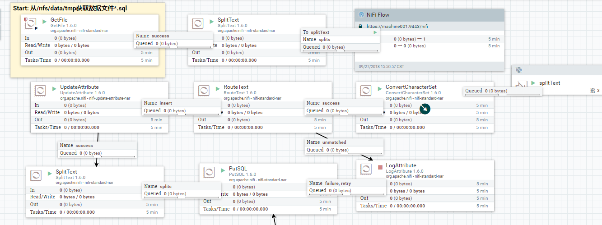

# 大文件SQL导入SQL-Server

## 任务描述：

现有SQLServer数据库导出的大文件(3G，tsql脚本，UCS-2编码)，其中包含新建数据库，新建表结构及数据插入语句；现需要提取其中数据并导入以后数据库；

## 尝试方案：

方案一：Windows系统DOS命令行

```powershell
#提取INSERT [bts].[OnTimeOnTimePerformanceGD]开头行
C:\Users\Jerry Run\Desktop> cat .\StageAreaWithData.sql |findstr "INSERT [bts].[OnTimeOnTimePerformanceGD]">db.sql
#使用sqlcmd工具执行该脚本
C:\Users\Jerry Run\Desktop> sqlcmd -S gateway002,14330 -U SA -P '<YourNewStrong!Passw0rd>' -i .\db.sql
```

> 出现问题：
>
> 1.文件过大，切分速度特别慢
>
> 2.文件过大+编码问题导致sqlcmd执行实时间特别长，编码问题还会导致报错无法插入；

方案二： Linux`split`指令切分后，利用sqlcmd命令行工具分批导入

> 出现问题：
>
> 编码乱

方案三：通过NiFi集群获取文件并进行转码，最后通过mssql-jdbc导入数据库;

>注意事项：
>
>NiFi无法识别UCS-2 编码，参考[对UCS-2解码](https://blog.csdn.net/lwcyd/article/details/79925789)，将文件编码从UTF-16BE转码为UTF-8

经过多次尝试，最终方案三可以比较简单快速完成需求任务；

## 整体流程：

GetFile(获取文件，此步骤后续可以考虑List+Fetch引入优化)

-> splitText(文件切分，可自定义，本例按1000行分批) 

-> RPG(分流到集群) 

-> ConvertCharacterSet (编码转换)

-> RouteText(指定路由，过滤掉没用的建表语句等) 

-> SplitText(单行切分，按理不需要该步骤，但是缺少此步骤的情况下,后续步骤无法执行，故暂时调用，后续可调试优化)

> 流程图：
>
> 

## Processor配置

**`RouteText`**处理器可用于筛选指定行，并输出到指定路由中；

**`ConvertCharacterSet`**节点需要注意UCS-2在Jvm中可视为为UTF-16BE

**`PutSQL`**处理器中需要调用DBCP服务，需要注意mssql-jdbc数据库连接方式，详细可参考：[Nifi Connection to MSSQL server DB](https://community.hortonworks.com/questions/1629/nifi-connection-to-mssql-server-db.html)


## 相关结果：

1.DataFlow详见[NiFi集群](https://machine001:9443/nifi/)

2.数据导入结果详见SQLServer数据库

```properties
host=gateway002,14330
user=SA
password=<YourNewStrong!Passw0rd>
database=StageArea
schema=bts
table=OnTimeOnTimePerformanceGD
```


