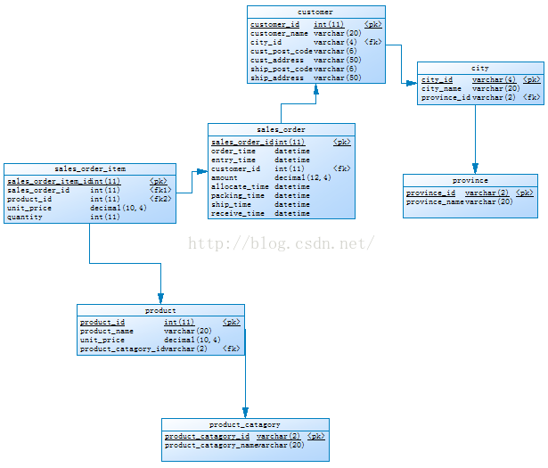

# Data Vault建立模型

## 业务需求

本示例源数据库是一个**订单销售**的普通场景，共有省、市、客户、产品类型、产品、订单、订单明细7个表。

## ERD示例图



## 源数据库表建立脚本

```sql
CREATE TABLE province (
  province_id varchar(2) NOT NULL COMMENT '省份编码',
  province_name varchar(20) DEFAULT NULL COMMENT '省份名称',
  PRIMARY KEY (province_id)
) ;
 
CREATE TABLE product_catagory (
  product_catagory_id varchar(2) NOT NULL COMMENT '产品分类编码',
  product_catagory_name varchar(20) DEFAULT NULL COMMENT '产品分类名称',
  PRIMARY KEY (product_catagory_id)
) ;
 
CREATE TABLE city (
  city_id varchar(4) NOT NULL COMMENT '城市编码',
  city_name varchar(20) DEFAULT NULL COMMENT '城市编码',
  province_id varchar(2) DEFAULT NULL COMMENT '省份编码',
  PRIMARY KEY (city_id),
  FOREIGN KEY (province_id) REFERENCES province (province_id)
) ;
 
CREATE TABLE customer (
  customer_id int(11) NOT NULL AUTO_INCREMENT COMMENT '客户ID',
  customer_name varchar(20) DEFAULT NULL COMMENT '客户名称',
  city_id varchar(4) DEFAULT NULL COMMENT '城市ID',
  cust_post_code varchar(6) DEFAULT NULL COMMENT '客户邮编',
  cust_address varchar(50) DEFAULT NULL COMMENT '客户地址',
  ship_post_code varchar(6) DEFAULT NULL COMMENT '送货邮编',
  ship_address varchar(50) DEFAULT NULL COMMENT '送货地址',
  PRIMARY KEY (customer_id),
  FOREIGN KEY (city_id) REFERENCES city (city_id)
) ;
 
CREATE TABLE product (
  product_id int(11) NOT NULL AUTO_INCREMENT COMMENT '产品ID',
  product_name varchar(20) DEFAULT NULL COMMENT '产品名称',
  unit_price decimal(10,4) DEFAULT NULL COMMENT '产品单价',
  product_catagory_id varchar(2) DEFAULT NULL COMMENT '产品分类编码',
  PRIMARY KEY (product_id),
  FOREIGN KEY (product_catagory_id) REFERENCES product_catagory (product_catagory_id)
) ;
 
CREATE TABLE sales_order (
  sales_order_id int(11) NOT NULL AUTO_INCREMENT COMMENT '订单ID',
  order_time datetime DEFAULT NULL COMMENT '下单时间',
  entry_time datetime DEFAULT NULL COMMENT '录入时间',
  customer_id int(11) DEFAULT NULL COMMENT '客户ID',
  amount decimal(12,4) DEFAULT NULL COMMENT '订单金额',
  allocate_time datetime DEFAULT NULL COMMENT '分配库房时间',
  packing_time datetime DEFAULT NULL COMMENT '出库时间',
  ship_time datetime DEFAULT NULL COMMENT '配送时间',
  receive_time datetime DEFAULT NULL COMMENT '收货时间',
  PRIMARY KEY (sales_order_id),
  FOREIGN KEY (customer_id) REFERENCES customer (customer_id)
) ;
 
CREATE TABLE sales_order_item (
  sales_order_item_id int(11) NOT NULL AUTO_INCREMENT COMMENT '订单明细ID',
  sales_order_id int(11) DEFAULT NULL COMMENT '订单ID',
  product_id int(11) DEFAULT NULL COMMENT '产品ID',
  unit_price decimal(10,4) DEFAULT NULL COMMENT '产品单价',
  quantity int(11) DEFAULT NULL COMMENT '数量',
  PRIMARY KEY (sales_order_item_id),
  FOREIGN KEY (sales_order_id) REFERENCES sales_order (sales_order_id),
  FOREIGN KEY (product_id) REFERENCES product (product_id)
) ;
```

## 转换成Data Vault模型

### 1.转换中心表

#### （1）确定中心实体

示例中的客户、产品类型、产品、订单、订单明细这5个实体是订单销售业务的**中心实体**。

省、市等地理信息表是参考数据，不能算是中心实体，实际上是附属表。

#### （2）中心实体（有入边） --> 中心表

把第一步确定的中心实体中有入边的实体转换为中心表，因为这些实体被别的实体引用。

把客户、产品类型、产品、订单转换成中心表

#### （3）中心实体（没有入边,一条出边） --> 中心表

把第一步确定的中心实体中没有入边且只有一条出边的实体转换为中心表，因为必须至少有两个Hub才能产生一个有意义的Link。示例中没有这样的表（订单明细有两条出边，所以不符合）。

####所有中心表

| **实体**             | **业务主键**        |
| -------------------- | ------------------- |
| hub_product_catagory | product_catagory_id |
| hub_customer         | customer_id         |
| hub_product          | product_id          |
| hub_sales_order      | sales_order_id      |

### 2.转换链接表

#### （1）实体（没有入边，大于等于2条出边）-->链接表
把源库中没有入边且有两条或两条以上出边的实体直接转换成链接表
把订单明细转换成链接表

#### （2）外键关系（除第一步以外）-->链接表
把源库中除第一步以外的外键关系转换成链接表。

订单和客户之间建立链接表，产品和产品类型之间建立链接表。注意Data Vault模型中的每个关系都是多对多关系。

#### 所有链接表

| **链接表**            | **被链接的中心表**                |
| --------------------- | --------------------------------- |
| link_order_product    | hub_sales_order，hub_product      |
| link_order_customer   | hub_sales_order，hub_customer     |
| link_product_catagory | hub_product，hub_product_catagory |

### 3.转换附属表

附属表为中心表和链接表的补充属性。所有源库中用到的表的**非键属性**都要放到Data Vault模型中。

#### 所有附属表

| **附属表**           | **描述**             |
| -------------------- | -------------------- |
| sat_customer         | hub_customer         |
| sat_product_catagory | hub_product_catagory |
| sat_product          | hub_product          |
| sat_sales_order      | hub_sales_order      |
| sat_order_product    | link_order_product   |

### Data Vault数据库表脚本：

```sql
-- 新建中心表
create table hub_product_catagory (
    hub_product_catagory_id int auto_increment primary key,
    product_catagory_id varchar(2),
    load_dts timestamp,
    record_source varchar(100)
);
 
create table hub_customer (
    hub_customer_id int auto_increment primary key,
    customer_id int,
    load_dts timestamp,
    record_source varchar(100)
);
 
create table hub_product (
    hub_product_id int auto_increment primary key,
    product_id int,
    load_dts timestamp,
    record_source varchar(100)
);
 
create table hub_sales_order (
    hub_sales_order_id int auto_increment primary key,
    sales_order_id int,
    load_dts timestamp,
    record_source varchar(100)
);
 
-- 新建链接表
create table link_order_product (
    link_order_product_id int auto_increment primary key,
    hub_sales_order_id int,
    hub_product_id int,
    load_dts timestamp,
    record_source varchar(100),
    foreign key (hub_sales_order_id)
        references hub_sales_order (hub_sales_order_id),
    foreign key (hub_product_id)
        references hub_product (hub_product_id)
);
 
create table link_order_customer (
    link_order_customer_id int auto_increment primary key,
    hub_sales_order_id int,
    hub_customer_id int,
    load_dts timestamp,
    record_source varchar(100),
    foreign key (hub_sales_order_id)
        references hub_sales_order (hub_sales_order_id),
    foreign key (hub_customer_id)
        references hub_customer (hub_customer_id)
);
 
create table link_product_catagory (
    link_product_catagory_id int auto_increment primary key,
    hub_product_id int,
    hub_product_catagory_id int,
    load_dts timestamp,
    record_source varchar(100),
    foreign key (hub_product_id)
        references hub_product (hub_product_id),
    foreign key (hub_product_catagory_id)
        references hub_product_catagory (hub_product_catagory_id)
);
-- 新建附属表
create table sat_customer (
    sat_customer_id int auto_increment primary key,
    hub_customer_id int,
    load_dts timestamp,
    load_end_dts timestamp,
    record_source varchar(100),
    customer_name varchar(20),
    city_name varchar(20),
    province_name varchar(20),
    cust_post_code varchar(6),
    cust_address varchar(50),
    ship_post_code varchar(6),
    ship_address varchar(50),
    foreign key (hub_customer_id)
        references hub_customer (hub_customer_id)
);
 
create table sat_product_catagory (
    sat_product_catagory_id int auto_increment primary key,
    hub_product_catagory_id int,
    load_dts timestamp,
    load_end_dts timestamp,
    record_source varchar(100),
    product_catagory_name varchar(20),
    foreign key (hub_product_catagory_id)
        references hub_product_catagory (hub_product_catagory_id)
);
 
create table sat_product (
    sat_product_id int auto_increment primary key,
    hub_product_id int,
    load_dts timestamp,
    load_end_dts timestamp,
    record_source varchar(100),
    product_name varchar(20),
    unit_price decimal(10 , 4 ),
    foreign key (hub_product_id)
        references hub_product (hub_product_id)
);
 
create table sat_sales_order (
    sat_sales_order_id int auto_increment primary key,
    hub_sales_order_id int,
    load_dts timestamp,
    load_end_dts timestamp,
    record_source varchar(100),
    order_time datetime,
    entry_time datetime,
    amount decimal(12 , 4 ),
    allocate_time datetime,
    packing_time datetime,
    ship_time datetime,
    receive_time datetime,
    foreign key (hub_sales_order_id)
        references hub_sales_order (hub_sales_order_id)
);
 
create table sat_order_product (
    sat_order_product_id int auto_increment primary key,
    link_order_product_id int,
    load_dts timestamp,
    load_end_dts timestamp,
    record_source varchar(100),
    unit_price decimal(10 , 4 ),
    quantity int,
    foreign key (link_order_product_id)
        references link_order_product (link_order_product_id)
);
```

### Data Vault模型图：

