# Data Vault初始装载

## SQL脚本

下面的SQL脚本用于完成Data Vault的初始装载过程。

```sql
USE dv;  
  
SET AUTOCOMMIT = 0;  
  
-- 清空附属表、链接表、中心表  
SET FOREIGN_KEY_CHECKS=0;  
TRUNCATE sat_customer;  
TRUNCATE sat_order_product;  
TRUNCATE sat_product;  
TRUNCATE sat_product_catagory;  
TRUNCATE sat_sales_order;  
TRUNCATE link_order_customer;  
TRUNCATE link_order_product;  
TRUNCATE link_product_catagory;  
TRUNCATE hub_product_catagory;  
TRUNCATE hub_customer;  
TRUNCATE hub_product;  
TRUNCATE hub_sales_order;  
SET FOREIGN_KEY_CHECKS=1;  
  
START TRANSACTION;  
  
-- 装载中心表  
insert into hub_product_catagory (product_catagory_id,record_source)  
select product_catagory_id,'product_catagory' from product_catagory;  
  
insert into hub_customer (customer_id,record_source)  
select customer_id,'customer' from customer;  
  
insert into hub_product (product_id,record_source)  
select product_id,'product' from product;  
  
insert into hub_sales_order (sales_order_id,record_source)  
select sales_order_id,'sales_order' from sales_order;  
  
-- 装载链接表  
insert into link_order_customer (hub_sales_order_id,hub_customer_id,record_source)  
select hub_sales_order_id,hub_customer_id,'hub_sales_order,sales_order,hub_customer,customer'  
from hub_sales_order,sales_order,hub_customer,customer  
where hub_sales_order.sales_order_id = sales_order.sales_order_id  
  and hub_customer.customer_id = customer.customer_id  
  and sales_order.customer_id = customer.customer_id;  
  
insert into link_order_product (hub_sales_order_id,hub_product_id,record_source)  
select hub_sales_order_id,hub_product_id,'hub_sales_order,hub_product,sales_order_item'  
from hub_sales_order,hub_product,sales_order_item  
where hub_sales_order.sales_order_id = sales_order_item.sales_order_id  
  and hub_product.product_id = sales_order_item.product_id;  
    
insert into link_product_catagory (hub_product_id,hub_product_catagory_id,record_source)  
select hub_product_id,hub_product_catagory_id,'hub_product,product,hub_product_catagory'  
from hub_product,product,hub_product_catagory
where hub_product.product_id = product.product_id  
  and hub_product_catagory.product_catagory_id = product.product_catagory_id;  
    
-- 装载附属表  
insert into sat_customer   
(hub_customer_id,  
load_end_dts,  
record_source,  
customer_name,  
city_name,  
province_name,  
cust_post_code,  
cust_address,  
ship_post_code,  
ship_address)  
select   
hub_customer_id,  
'2200-01-01',  
'hub_customer,customer,city,province',  
customer.customer_name,  
city.city_name,  
province.province_name,  
customer.cust_post_code,  
customer.cust_address,  
customer.ship_post_code,  
customer.ship_address  
from hub_customer,customer,city,province  
where hub_customer.customer_id = customer.customer_id  
  and customer.city_id = city.city_id  
  and city.city_id = province.province_id;  
    
insert into sat_order_product   
(link_order_product_id,  
load_end_dts,  
record_source,  
unit_price,  
quantity  
)  
select   
link_order_product_id,  
'2200-01-01',  
'link_order_product,hub_sales_order,hub_product,sales_order_item',  
sales_order_item.unit_price,  
sales_order_item.quantity  
from link_order_product,hub_sales_order,hub_product,sales_order_item  
where link_order_product.hub_sales_order_id = hub_sales_order.hub_sales_order_id  
  and link_order_product.hub_product_id = hub_product.hub_product_id  
  and sales_order_item.sales_order_id = hub_sales_order.sales_order_id  
  and sales_order_item.product_id = hub_product.product_id;  
    
insert into sat_product  
(hub_product_id,  
load_end_dts,  
record_source,  
product_name,  
unit_price  
)  
select   
hub_product_id,  
'2200-01-01',  
'hub_product,product',  
product.product_name,  
product.unit_price  
from hub_product,product  
where hub_product.product_id = product.product_id;  
  
insert into sat_product_catagory  
(hub_product_catagory_id,  
load_end_dts,  
record_source,  
product_catagory_name  
)  
select   
hub_product_catagory_id,  
'2200-01-01',  
'hub_product_catagory,product_catagory',  
product_catagory.product_catagory_name  
from hub_product_catagory,product_catagory  
where hub_product_catagory.product_catagory_id = product_catagory.product_catagory_id;  
  
insert into sat_sales_order  
(hub_sales_order_id,  
load_end_dts,  
record_source,  
order_time,  
entry_time,  
amount,  
allocate_time,  
packing_time,  
ship_time,  
receive_time  
)  
select   
hub_sales_order_id,  
'2200-01-01',  
'hub_sales_order,sales_order',  
sales_order.order_time,  
sales_order.entry_time,  
sales_order.amount,  
sales_order.allocate_time,  
sales_order.packing_time,  
sales_order.ship_time,  
sales_order.receive_time  
from hub_sales_order,sales_order  
where hub_sales_order.sales_order_id = sales_order.sales_order_id;  
  
COMMIT; 

```


## Kettle

下面是用Kettle完成初始装载的作业和步骤。

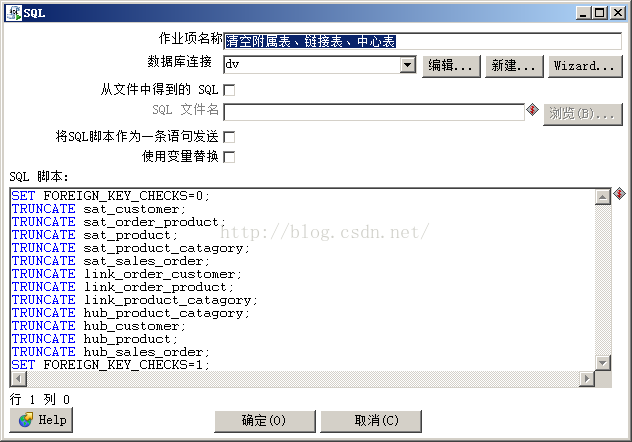
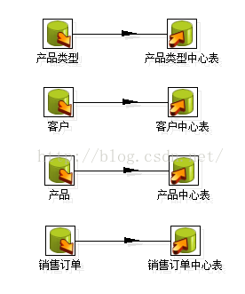
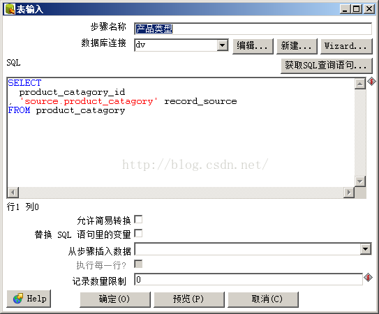
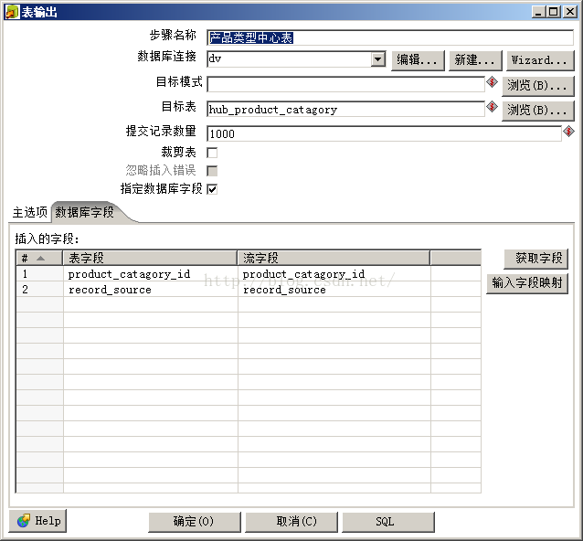
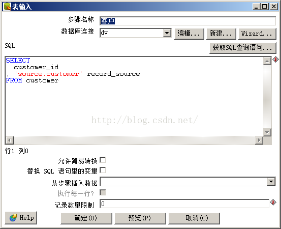
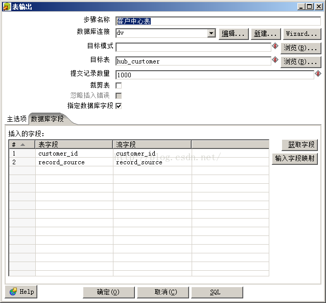
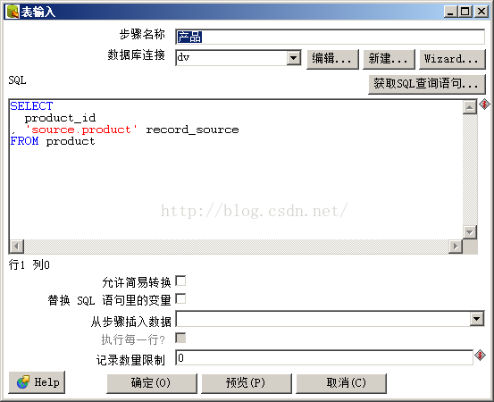

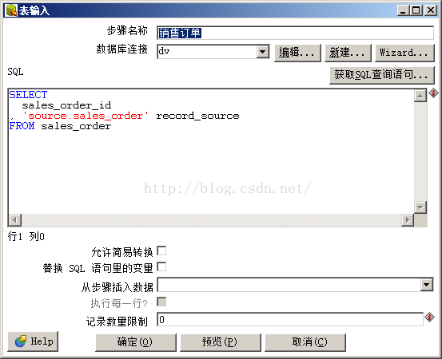
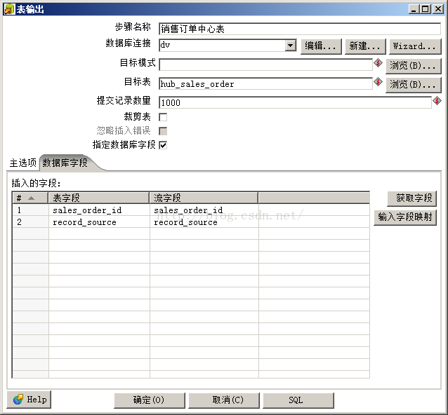
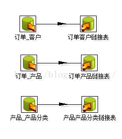
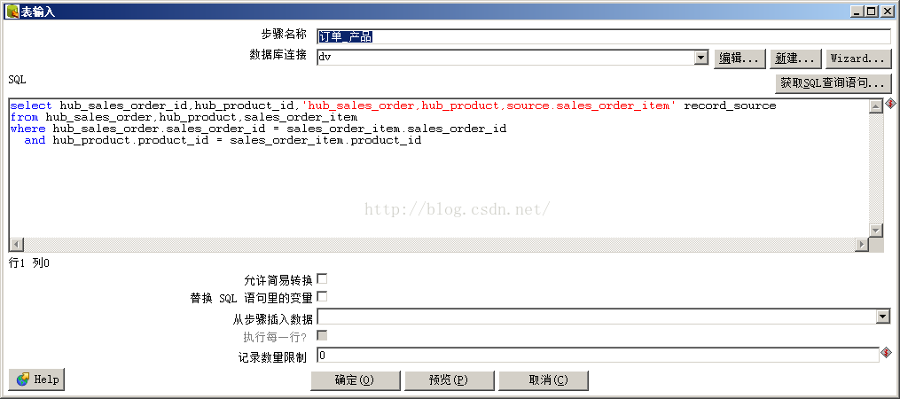
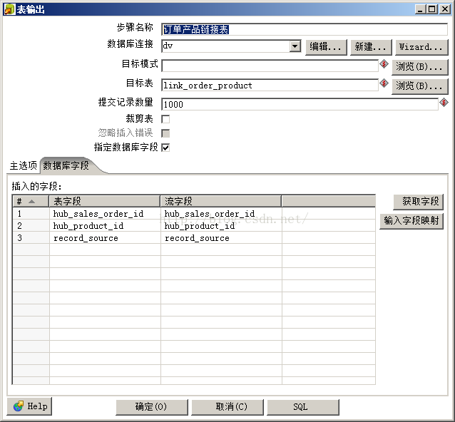
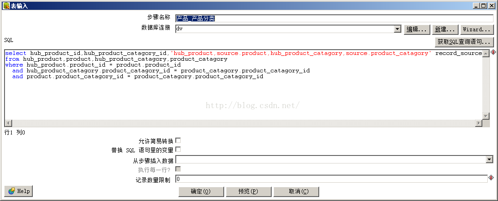
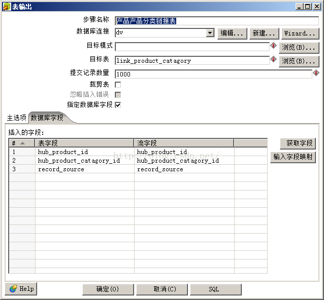


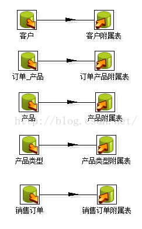
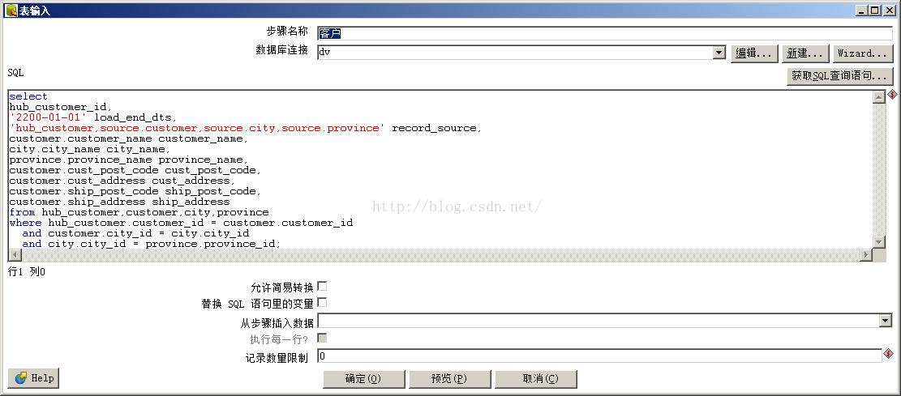
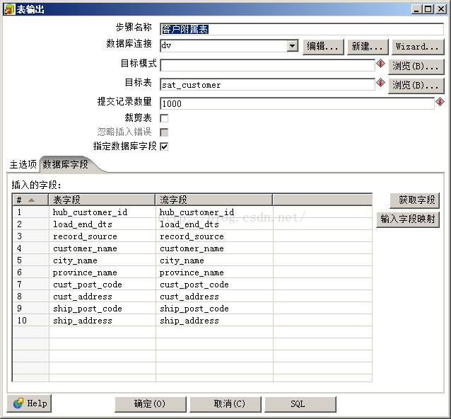
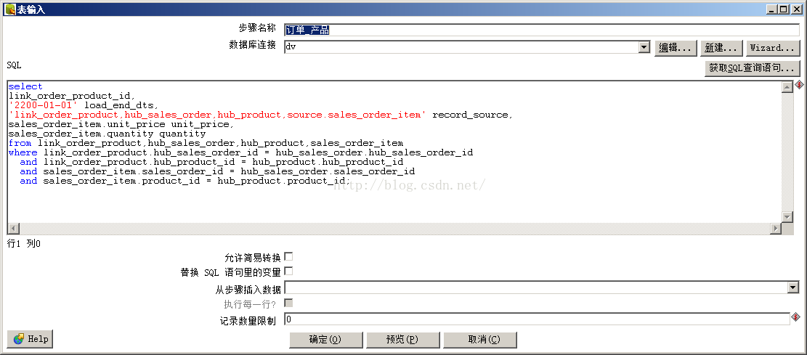
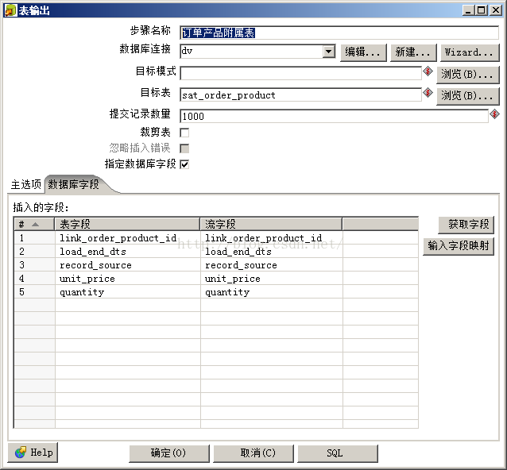
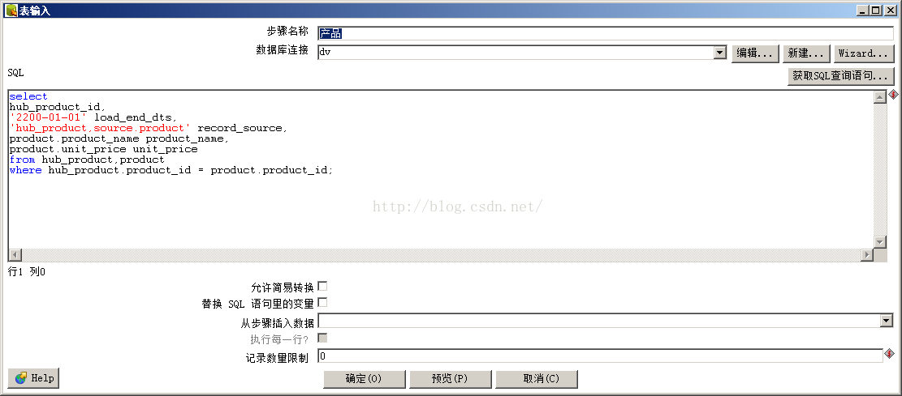
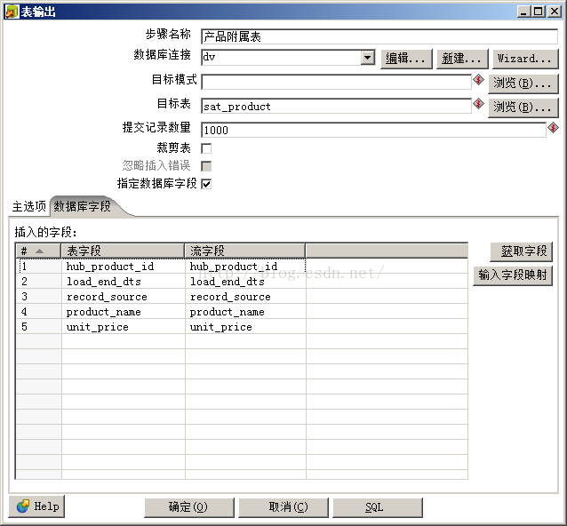
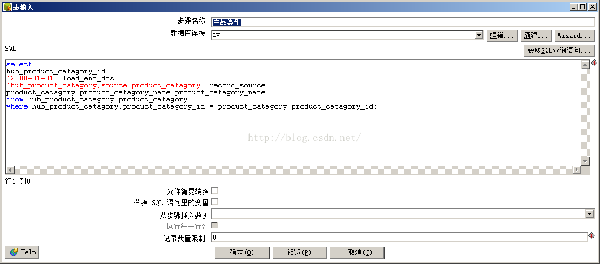
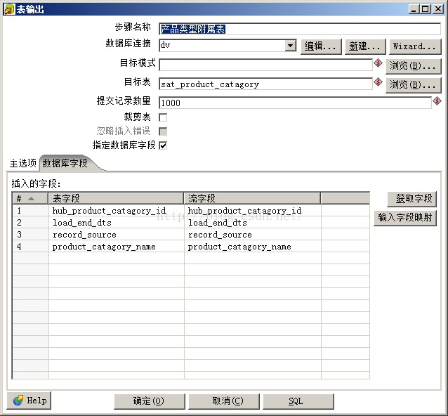
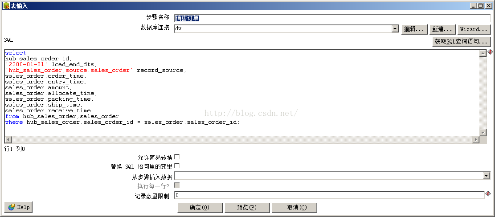
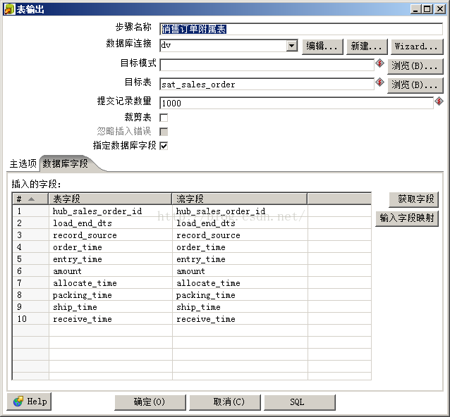