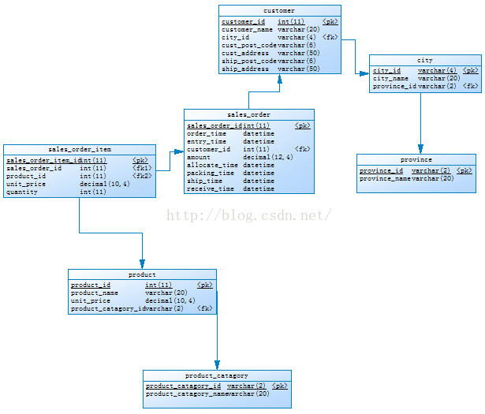
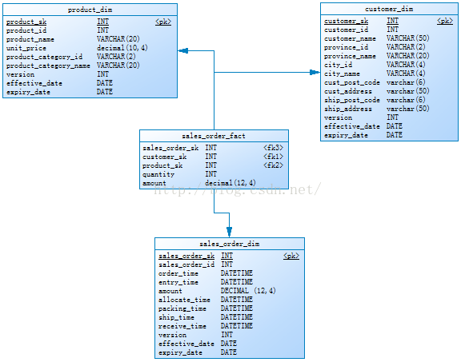
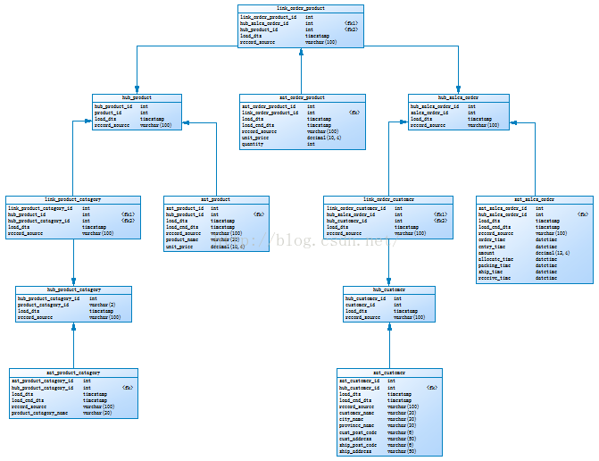

# Data Vault初探（十） —— 星型模型向Data Vault模型转化

## 源数据库模型（3NF）如下图：



## 星型模型如下图：



## Data Vault模型如下图：



## 说明：

星型模型（star schema）的事实表采取了完全规范化的第三范式（3NF）模型，而维表采取了第二范式的设计模型。有时也会把维表的设计规范化，就成了所谓的雪花模型（snowflake schema）。

星型模型向Data Vault模型转化：

星型模趔的主要构成部分是维表与事实表，在转化为DataVault模型时自然涉及到维表与事实表的分别转化，使之映射为DataVault模型的Hub、Link、Satellite组件。星型模型与DataVault模型表的对应如下表所示。

## 转换SQL脚本：


```sql
use dv;
 
-- 装载客户中心表
insert hub_customer (customer_id,record_source) 
select distinct customer_id,'customer_dim' from customer_dim;
 
-- 装载客户附属表
insert into sat_customer
(
	hub_customer_id,
	load_dts,
	load_end_dts,
	record_source,
	customer_name,
	city_name,
	province_name,
	cust_post_code,
	cust_address,
	ship_post_code,
	ship_address
)
select t1.hub_customer_id,
	   t2.effective_date,
	   t2.expiry_date,
	   'hub_customer,customer_dim',
	   t2.customer_name,
	   t2.city_name,
	   t2.province_name,
	   t2.cust_post_code,
	   t2.cust_address,
	   t2.ship_post_code,
	   t2.ship_address
  from hub_customer t1,customer_dim t2 
 where t1.customer_id=t2.customer_id;
 
-- 装载产品分类中心表
insert hub_product_catagory (product_catagory_id,record_source) 
select distinct product_category_id,'product_dim' from product_dim;
 
-- 装载产品中心表
insert hub_product (product_id,record_source) 
select distinct product_id,'product_dim' from product_dim;
 
-- 装载产品分类_产品链接表
insert into link_product_catagory (hub_product_id,hub_product_catagory_id,record_source)
select distinct t1.hub_product_id,t2.hub_product_catagory_id,'hub_product,product_dim,hub_product_catagory'
  from hub_product t1,hub_product_catagory t2,product_dim t3
 where t1.product_id = t3.product_id and t2.product_catagory_id = t3.product_category_id;
 
-- 装载产品分类附属表
insert into sat_product_catagory 
(hub_product_catagory_id,
load_dts,
load_end_dts,
record_source,
product_catagory_name)
select 
    t1.hub_product_catagory_id,
    t2.start_date,
    t2.end_date,
    'hub_product_catagory,product_dim' record_source,
    t2.cname
from
    hub_product_catagory t1,
    (select 
        t1.cid cid,
            t1.cname cname,
            t1.start_date start_date,
            t2.end_date end_date
    from
        (select distinct
        if(@cid = t1.cid and @cname = t1.cname, @start_date, @start_date:=t1.start_date) as start_date,
            @cid:=t1.cid cid,
            @cname:=t1.cname cname
    from
        ((select 
        product_category_id cid,
            product_category_name cname,
            effective_date start_date
    from
        product_dim
    order by cid , start_date) t1, (select @cid:=0, @cname:='', @start_date:='0000-00-00') t2)) t1, (select distinct
        if(@cid = t1.cid and @cname <> t1.cname, t1.end_date, '2200-01-01') as end_date,
            @cid:=t1.cid cid,
            @cname:=t1.cname cname
    from
        ((select 
        product_category_id cid,
            product_category_name cname,
            expiry_date end_date
    from
        product_dim
    order by cid , end_date desc) t1, (select @cid:=0, @cname:='', @end_date:='0000-0000-00') t2)) t2
    where
        t1.cid = t2.cid and t1.cname = t2.cname) t2
where
    t1.product_catagory_id = t2.cid;
 
-- 装载产品附属表
insert into sat_product
(
hub_product_id,
load_dts,
load_end_dts,
record_source,
product_name,
unit_price
)
select t1.hub_product_id,t2.start_date,t2.end_date,'hub_product,product_dim' record_source,
t2.pname pname,t2.unit_price
from hub_product t1,
(
select 
    t1.pid pid,
    t1.pname pname,
    t1.unit_price,
    t1.start_date start_date,
    t2.end_date end_date
from
    (select distinct
        if(@pid = t1.pid and @pname = t1.pname
                and @unit_price = t1.unit_price, @start_date, @start_date:=t1.start_date) as start_date,
            @pid:=t1.pid pid,
            @pname:=t1.pname pname,
            @unit_price:=t1.unit_price unit_price
    from
        ((select 
        product_id pid,
            product_name pname,
            unit_price,
            effective_date start_date
    from
        product_dim
    order by pid , start_date) t1, (select 
        @pid:=0,
            @pname:='',
            @unit_price:=0,
            @start_date:='0000-00-00'
    ) t2)) t1,
    (select distinct
        if(@pid = t1.pid
                and (@pname <> t1.pname
                OR @unit_price <> t1.unit_price), t1.end_date, '2200-01-01') as end_date,
            @pid:=t1.pid pid,
            @pname:=t1.pname pname,
            @unit_price:=t1.unit_price unit_price
    from
        ((select 
        product_id pid,
            product_name pname,
            unit_price,
            expiry_date end_date
    from
        product_dim
    order by pid , end_date desc) t1, (select 
        @pid:=0,
            @pname:='',
            @unit_price:=0,
            @end_date:='0000-0000-00'
    ) t2)) t2
where
    t1.pid = t2.pid and t1.pname = t2.pname
        and t1.unit_price = t2.unit_price) t2 where t1.product_id=t2.pid;
 
-- 装载销售订单中心表
insert into hub_sales_order (sales_order_id,record_source) 
select distinct sales_order_id,'sales_order_dim' from sales_order_dim;
 
-- 装载销售订单附属表
insert into sat_sales_order
(
hub_sales_order_id,
load_dts,
load_end_dts,
record_source,
order_time,
entry_time,
amount,
allocate_time,
packing_time,
ship_time,
receive_time)
select 
t1.hub_sales_order_id,
t2.effective_date,
t2.expiry_date,
'hub_sales_order,sales_order_dim',
t2.order_time,
t2.entry_time,
t2.amount,
t2.allocate_time,
t2.packing_time,
t2.ship_time,
t2.receive_time
from hub_sales_order t1,sales_order_dim t2
where t1.sales_order_id = t2.sales_order_id;
 
-- 装载订单产品链接表
insert into link_order_product
(
hub_sales_order_id,
hub_product_id,
record_source)
select t1.hub_sales_order_id, t2.hub_product_id,
'hub_sales_order,hub_product,sales_order_dim,product_dim,sales_order_fact'
from 
hub_sales_order t1,
hub_product t2,
(select t1.sales_order_id sales_order_id, t2.product_id product_id
from sales_order_dim t1, product_dim t2, sales_order_fact t3 
where t1.sales_order_sk = t3.sales_order_sk and t2.product_sk = t3.product_sk) t3
where t1.sales_order_id = t3.sales_order_id and t2.product_id = t3.product_id;
 
-- 装载订单客户链接表
insert into link_order_customer
(
hub_sales_order_id,
hub_customer_id,
record_source)
select t1.hub_sales_order_id, t2.hub_customer_id,
'hub_sales_order,hub_customer,sales_order_dim,customer_dim,sales_order_fact'
from 
hub_sales_order t1,
hub_customer t2,
(select t1.sales_order_id sales_order_id, t2.customer_id customer_id
from sales_order_dim t1, customer_dim t2, sales_order_fact t3 
where t1.sales_order_sk = t3.sales_order_sk and t2.customer_sk = t3.customer_sk) t3
where t1.sales_order_id = t3.sales_order_id and t2.customer_id = t3.customer_id;
 
-- 装载订单产品附属表
insert into sat_order_product
(
link_order_product_id,
load_dts,
load_end_dts,
record_source,
unit_price,
quantity
)
select t1.link_order_product_id,t2.effective_date,t2.expiry_date,
'link_order_product,product_dim,sales_order_dim,sales_order_fact,hub_sales_order,hub_product',
t2.unit_price,
t4.quantity
from 
link_order_product t1, 
product_dim t2, 
sales_order_dim t3, 
sales_order_fact t4,
hub_sales_order t5,
hub_product t6
where t1.hub_sales_order_id = t5.hub_sales_order_id
  and t1.hub_product_id = t6.hub_product_id
  and t4.sales_order_sk = t3.sales_order_sk
  and t4.product_sk = t2.product_sk
  and t5.sales_order_id = t3.sales_order_id
  and t6.product_id = t2.product_id;
  
COMMIT;

```