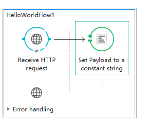
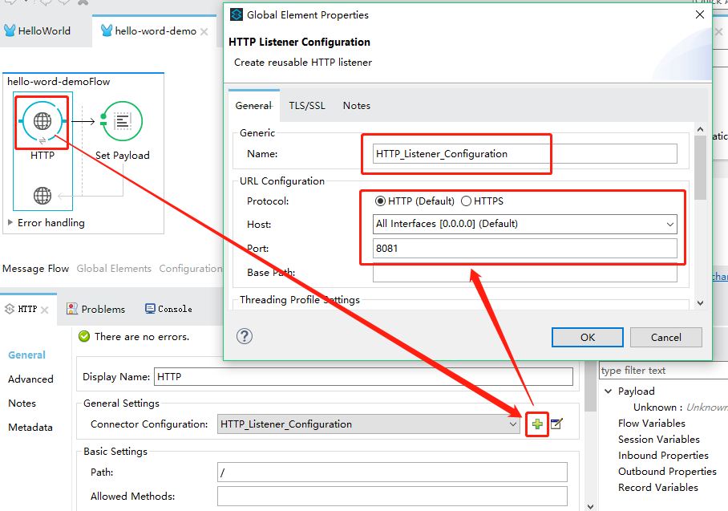
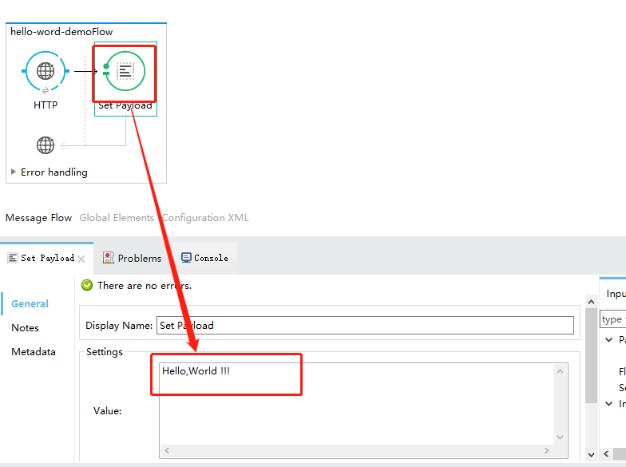

# HelloWorld演示

此应用程序演示了一个简单的HTTP请求 - 响应活动。Mule响应通过Web浏览器提交的最终用户调用，并显示“Hello World”消息。此示例旨在演示Mule应用程序通过HTTP请求与最终用户进行交互的能力。目标是通过演示非常简单的功能将用户介绍给Anypoint Studio。

## 1. 设置并运行示例

完成以下过程以创建，然后在您自己的Anypoint Studio实例中运行此示例。您可以在Anypoint Studio中直接创建模板应用程序，并调整基于用例的模板的配置，以在Mule中创建您自己的自定义应用程序。

1. 创建，然后在Anypoint Studio中运行Hello World示例应用程序。
2. 打开Web浏览器。
3. 在地址栏中，键入以下URL：[http://localhost:8081](http://localhost:8081/)
4. 按Enter键以从Hello World应用程序中引出响应。

### 2. 设计流程

1. 往画布新增一个HTTP连接器
2. 给HTTP连接器配置一个HTTP监听组件
3. 向Message中赋值payload，提供返回字符串"HelloWorld"

## 3. 配置示例

> 整体流程配置
>
> 

> 配置HTTP监听
>
> 

> 赋值响应消息

