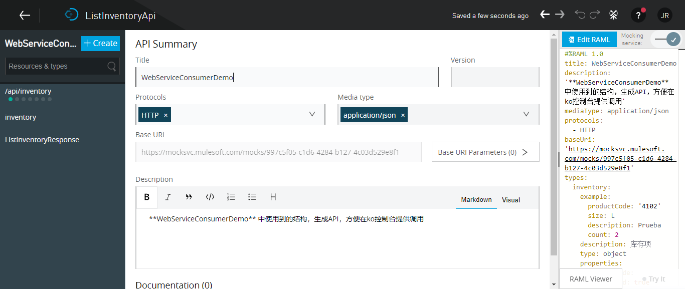
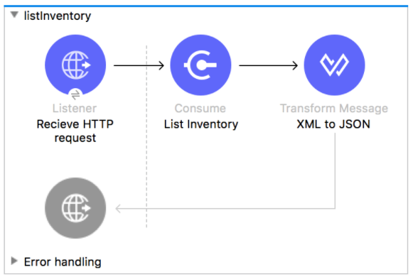
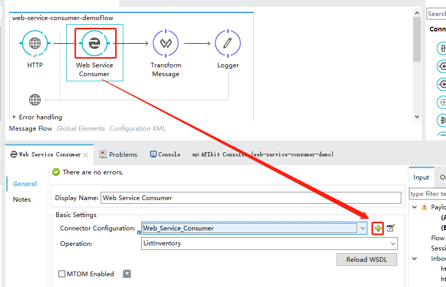
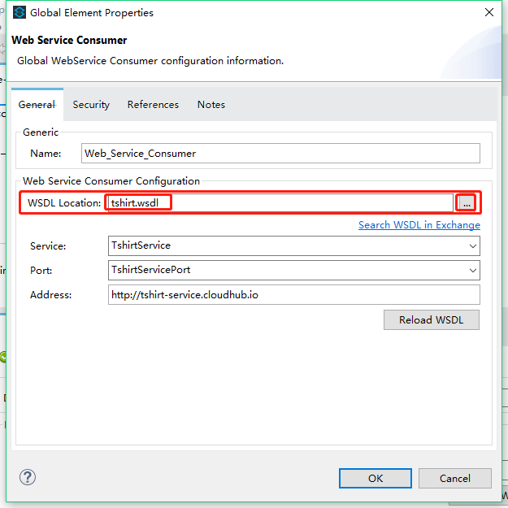
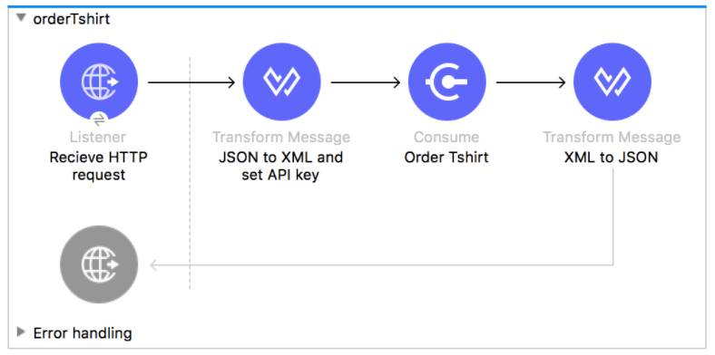
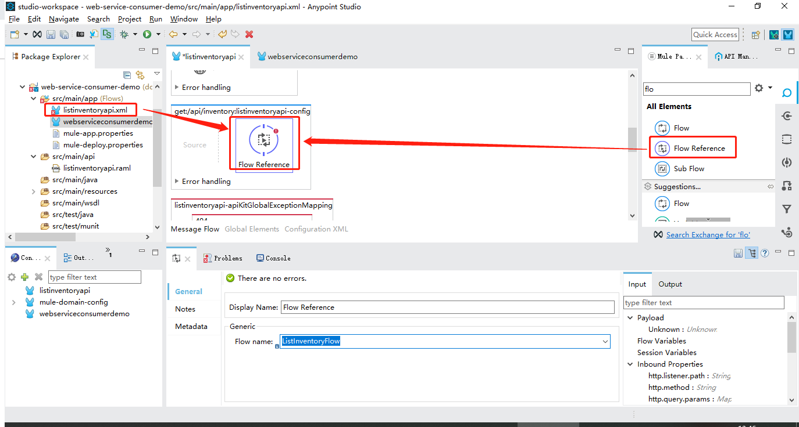

# Web Service Consumer

## Example Use Case

本案例主要演示Mule应用监听HTTP请求，将请求转化并发给WebService服务，并将返回数据转化为JSON传给调用方。

> This example application simulates consuming a Web service that belongs to a T-Shirt retailer. Through HTTP requests, customers can check the availability of products and place purchase orders. When the application receives an order, it turns the JSON input into XML, adds an APIKey variable, and then sends the request to the Web service. The application then transforms the response from the Web service into JSON, builds a final response, and then sends the response to the requester.


## 开发流程

### 1.设计API

利用ApiDesigner设计API，并最后到处为 `xxx.raml`文件



### 2.新建MuleApplication应用

#### 2.1库存查询API



##### 2.1.1 HTTP监听

添加HTTP组件，选择已有的HTTP连接器，配置监听path路径,本例为： `/inventory`。

##### 2.1.2 WebService调用

首先，添加一个`WebServiceConsumer元素(Element)`

> 


然后，配置一个`Web_Service_Consumer连接器(Connector)`，配置好点击`OK`,然后再`Operation`选项下拉框选择`ListInventory`。

> 

##### 2.1.3 数据转化(XML --> Json)

```SQL
%dw 1.0
%output application/json
---
payload
```


#### 2.2订单落地API



##### 2.2.1 配置HTTP监听

添加HTTP组件，选择已有的HTTP连接器，配置监听path路径,本例为： `/orders`。

##### 2.2.2 配置转换器(Json --> XML)

```SQL
%dw 1.0
%output application/xml
%namespace ns0 http://mulesoft.org/tshirt-service
---
ns0#OrderTshirt: payload
```

##### 2.2.3 调用订单落地服务

首先，添加一个`WebServiceConsumer元素(Element)`,连接器与库存查询用同一个，然后再`Operation`选项下拉框选择`OrderTshirt`。

##### 2.2.4 数据转换(XML --> Json)

```SQL
%dw 1.0
%output application/json
---
payload
```

### 3.添加流程引用

在各API接口Flow中， 添加FlowReference到Process范围内，并在属性框下拉选择各自对应的实现流程(Flow),

如本例中： `get:/inventory` 对应 `ListInventoryFlow`，`post:/orders` 对应`OrderTshirtFlow`。




## 结果测试

浏览器直接访问： http://localhost:8081/console

Get访问：http://localhost:8081/inventory

Post访问：http://localhost:8081/orders

Post请求参数如下：

```JSON
{
  "email":"in1233fo@teeshirtshop.com",
  "address1":"Corrientes 316",
  "address2":"EP",
  "city":"Buenos Aires",
  "country":"Argentina",
  "name":"MuleSoft Argentina",
  "postalCode":"C1043AAQ",
  "size":"L",
  "stateOrProvince":"CABA"
}
```


