# Processing Orders with DataWeave and APIkit

## Example Use Case

本示例演示如何使用ESB实现订单处理过程。包含：

1. 订单数据输入
2. 调用外部API接口，获取货币信息
   1. 利用RAML设计货币信息查询API
   2. 利用ESB实现货币信息查询接口
3. 处理订单信息，实现数据整合,并输出订单数据以及报告数据

> This example application illustrates how to use Anypoint DataWeave to process an order by looking up some information from an external API. It also shows how to expose that external API by using APIkit. As part of the order processing, some filters and transformations are applied to the order and a final report is created.


## 1.设计API

### 1.1RAML语法开发RESTful API

```RMAL
#%RAML 0.8
---
title: Currency API
baseUri: http://localhost:8081/api/

/currencies: 
  get: 
    responses: 
      200: 
        description: Retrieve the list of currencies and their USD to conversion rate.
        body: 
          application/json: 
            schema: !include currency-schema.json
      
```

```json
{
  "required" : true ,
  "$schema" : "http://json-schema.org/draft-03/schema" ,
  "type" : "object" ,
  "properties" : {
    "USD" : {
      "type" : "array" ,
      "required" : true ,
      "items" : {
      	"type" : "object",
      	"properties" : {
	        "currency" : {
	          "type" : "number" ,
	          "required" : false
	        } ,
	        "ratio" : {
	          "type" : "number" ,
	          "required" : false
	        }
		 }
	   }
    }
  }
}
```

### 1.2生成API Flow

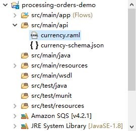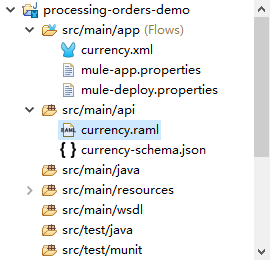

右键点击 `currency.raml`（左图），选择`Mule`菜单，点击`Generate Flow From REST API`即可生成流文件(右图)

### 1.3赋值返回

利用`ParseTemplate组件`将`currency.json`文件转化为数据并返回给调用方；

数据文件如下：

```json
{
  "USD": [
    {"currency": "EUR", "ratio":0.92},
    {"currency": "ARS", "ratio":8.76},
    {"currency": "GBP", "ratio":0.66}
  ]
}
```

### 1.4调试API是否可用

启动项目(Run as Mule Application)，打开地址[控制台地址](http://127.0.0.1:8081/console/),点击`GET方法`.

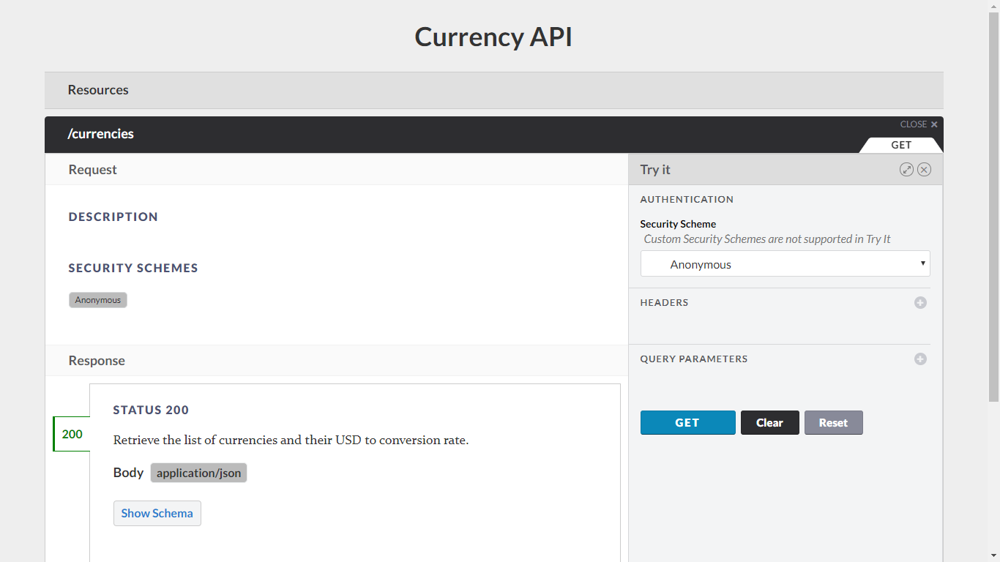


### 1.5部署项目到运行时

#### 1.5.1 导出项目

右击项目，选择`Export`，展开`Mule`，点击`AnypointStudioProjectToMuleDeployableArchive`

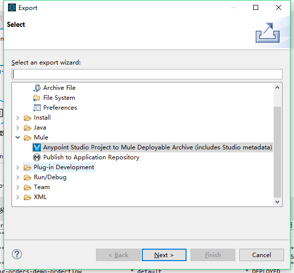

#### 1.5.2 部署项目

转到**MuleESB安装目录**，启动**mule实例**，将到处的项目包放在`${MULE_HOME}/apps/`目录下

#### 1.5.3 验证部署结果

打开浏览器，进入[api控制台地址](http://127.0.0.1:8081/console/)

## 2. 订单处理

### 2.1获取订单信息

添加**File组件**，在**Path属性**下录入订单输入路径`src/main/resources/input`，在metadata中可以添加自定义数据类型，配置如图：

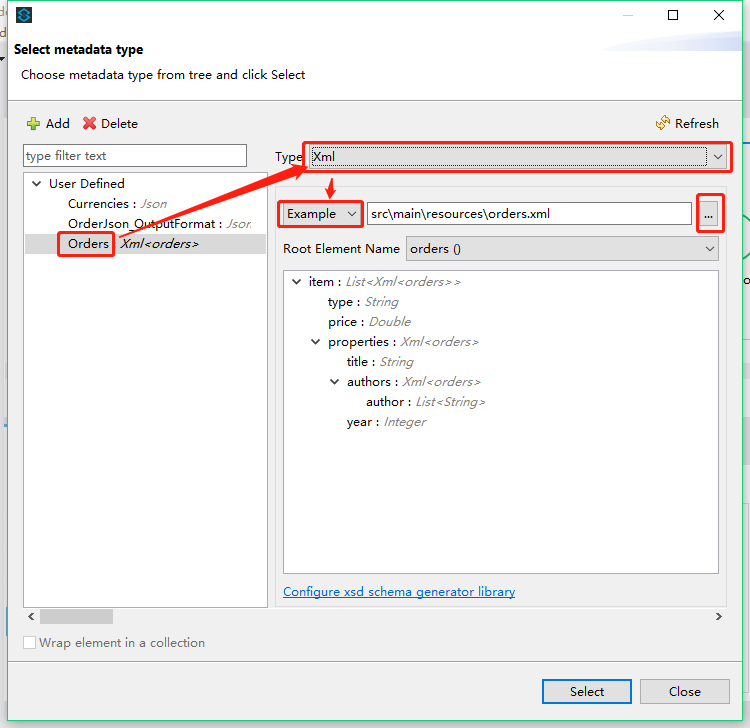

```XML
<?xml version='1.0' encoding='UTF-8'?>
<orders>
  <item>
    <type>video</type>
    <price>30</price>
    <properties>
      <title>Everyday Italian</title>
      <authors>
        <author>Giada De Laurentiis</author>
      </authors>
      <year>2005</year>
    </properties>
  </item>
  <item>
    <type>book</type>
    <price>29.99</price>
    <properties>
      <title>Harry Potter</title>
      <authors>
        <author>J K. Rowling</author>
      </authors>
      <year>2005</year>
    </properties>
  </item>
  <item>
    <type>book</type>
    <price>49.99</price>
    <properties>
      <title>XQuery Kick Start</title>
      <authors>
        <author>James McGovern</author>
        <author>Per Bothner</author>
        <author>Kurt Cagle</author>
        <author>James Linn</author>
        <author>Kurt Cagle</author>
        <author>Vaidyanathan Nagarajan</author>
      </authors>
      <year>2003</year>
    </properties>
  </item>
  <item>
    <type>book</type>
    <price>39.95</price>
    <properties>
      <title>Learning XML</title>
      <authors>
        <author>Erik T. Ray</author>
      </authors>
      <year>2003</year>
    </properties>
  </item>
</orders>
```

### 2.2 获取货币信息

#### 2.2.1 添加MessageEnricher组件

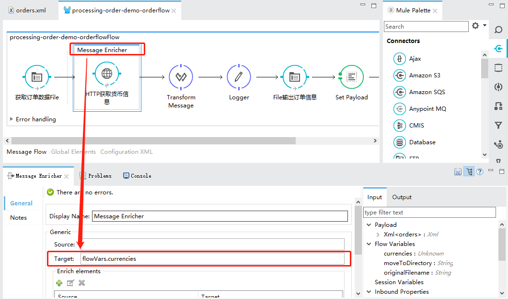

#### 2.2.2 添加HTTP组件

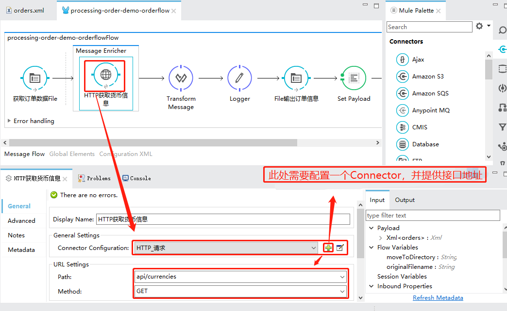

### 2.3 配置数据转化组件TramsformMessage

#### 2.3.1 赋值订单信息到output payload

配置如图：

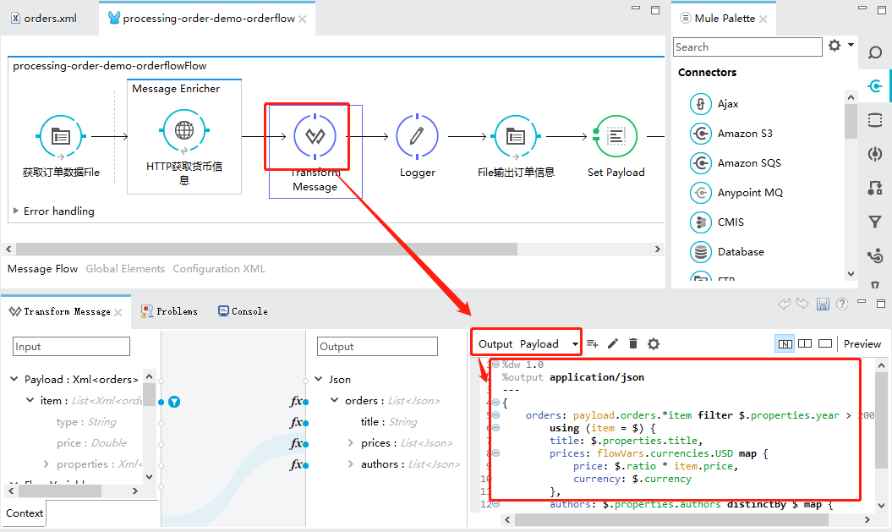

```sql
%dw 1.0
%output application/json
---
{
	orders: payload.orders.*item filter $.properties.year > 2004 map 
		using (item = $) {
		title: $.properties.title,
		prices: flowVars.currencies.USD map {
			price: $.ratio * item.price,
			currency: $.currency
		},
		authors: $.properties.authors distinctBy $ map {
			author: $
		}
	}
}
```

#### 2.3.2 将订单统计信息输出到FlowVar

配置如图：

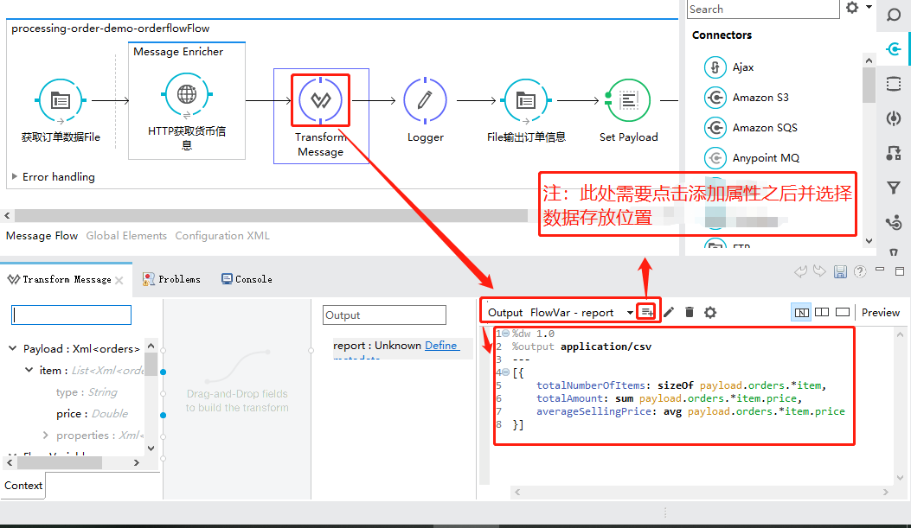

```SQL
%dw 1.0
%output application/csv
---
[{
	totalNumberOfItems: sizeOf payload.orders.*item,
	totalAmount: sum payload.orders.*item.price,
	averageSellingPrice: avg payload.orders.*item.price
}]
```

### 2.4输出数据到文件

#### 2.4.1 输出订单信息

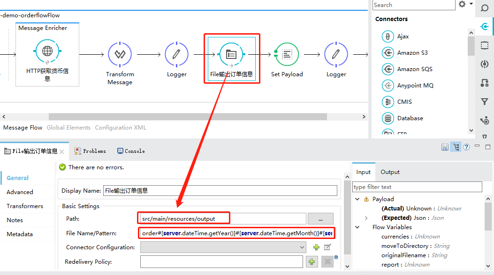

#### 2.4.2 输出报告信息

##### 2.4.2.1将报告信息赋值到payload中

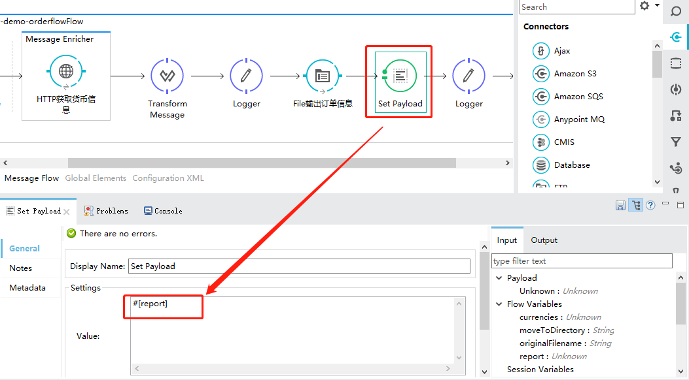

##### 2.4.2.2输出报告信息到csv文件

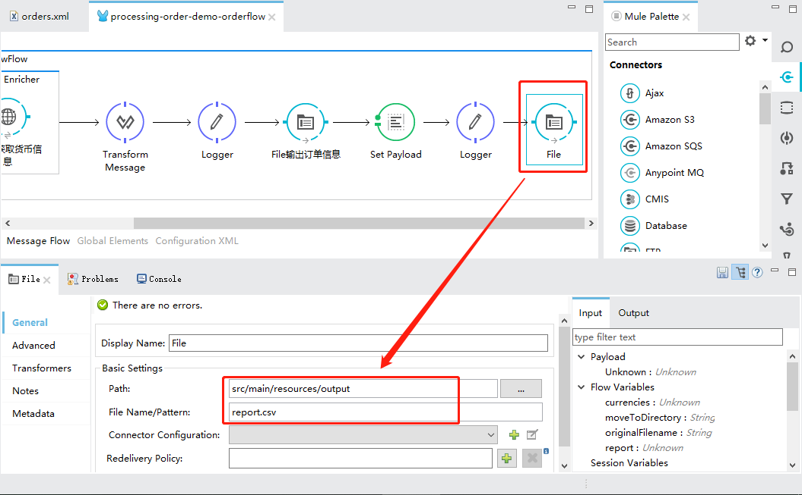

```sql
%dw 1.0
%output application/csv
---
[{
	totalNumberOfItems: sizeOf payload.orders.*item,
	totalAmount: sum payload.orders.*item.price,
	averageSellingPrice: avg payload.orders.*item.price
}]
```


## 3.测试结果

### 3.1启动项目

启动项目(Run as Mule Application)

### 3.2 输入订单

如图，将`order.xml`拖拽到`input`目录下

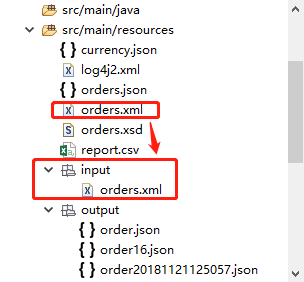

### 3.3 查看订单处理结果

`output`目录中新增`order.json`以及`reprot.csv`.