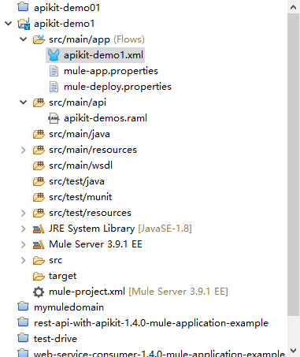
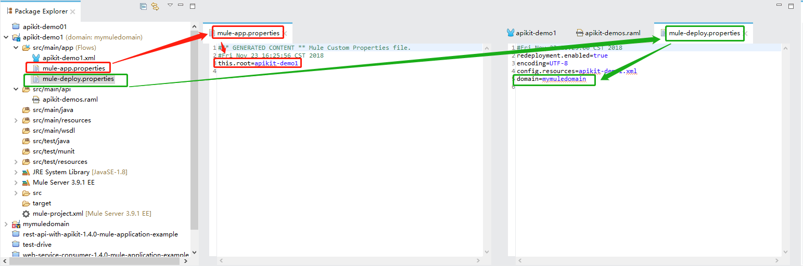
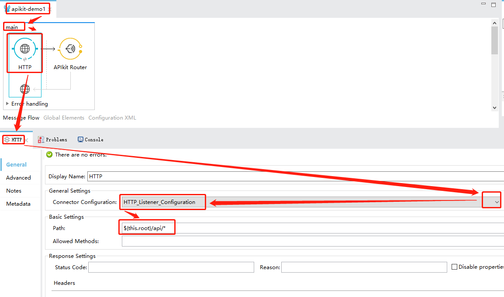
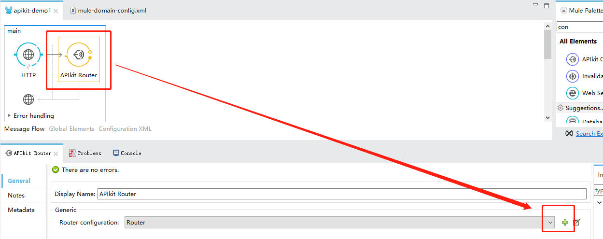
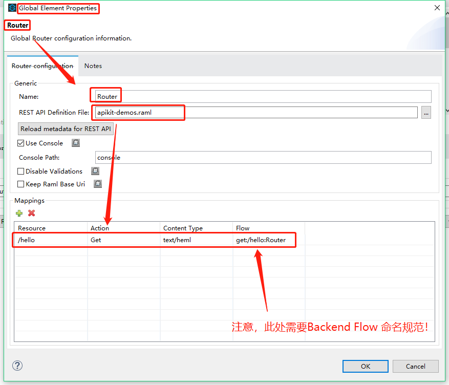
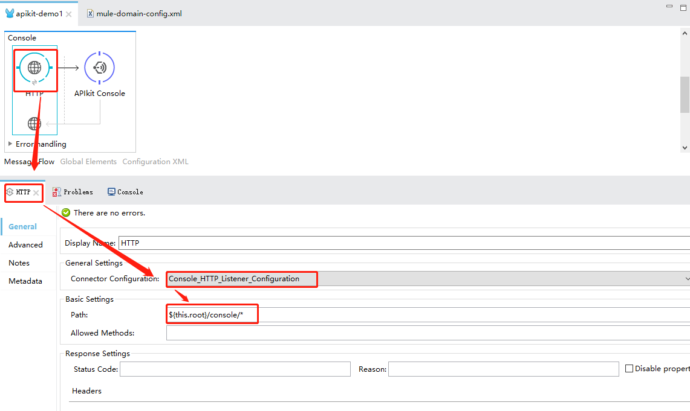
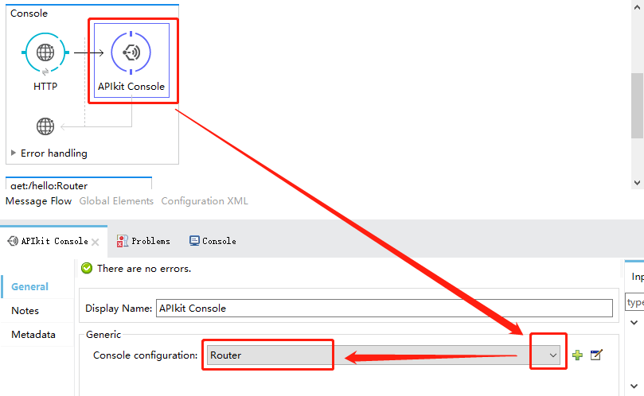
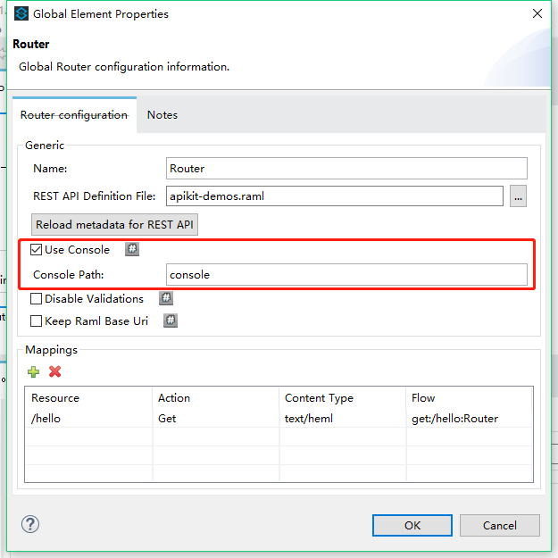

# APIkit用法演示

## apikit-demo1

### 1.设计`api-demo1.raml`

```yaml
#%RAML 1.0
version: v1
title: APIkit-demos
mediaType: application/json
protocols:
  - HTTP
baseUri: 'https://mocksvc.mulesoft.com/mocks/af174778-f845-4733-8080-e66733140fa4'
annotationTypes:
  demo1-helloworld: any
  demo2-orders: any
  annotations.0: any
  annotations.1: any
(demo1-helloworld):
  name: group
  description: This is description
(demo2-orders):
  name: group
  description: This is description
/hello:
  get:
    responses:
      '200':
        body:
          text/html:
            example: HelloWrld (mocking srvice) !
            type: string
  (annotations.0): group
/inventory:
  (annotations.1): group

```

附件下载: [apikit-demos-1.0.0-raml.zip](./assets/apikit-demos-1.0.0-raml.zip)

### 2. MuleApp开发

#### 2.1 新建APP,导入`api-demo1.raml`

在AnypointStudio新建项目,并添加raml文件到api目录下:

 

同时，配置域，及全局参数`this.root`,具体如下：

 

```properties
#** GENERATED CONTENT ** Mule Custom Properties file.
#Fri Nov 23 16:25:56 CST 2018
this.root=apikit-demo1


#Fri Nov 23 16:25:00 CST 2018
redeployment.enabled=true
encoding=UTF-8
config.resources=apikit-demo1.xml
domain=mymuledomain
```


#### 2.2 新增main流程

##### 2.2.1 HTTP监听配置



此处监听器选用 `Domain项目`下的默认监听器即可(`HTTP_Listener_Configuration(0.0.0.0:8081)`)；监听地址配置为： `${this.root}/api/*`。

> 注意：前面家上 `${this.root}`是为了跟其他应用区分开，避免部署时出现监听路径冲突异常。

> 以下附上`Domain项目`的`mule-domain-config.xml`配置代码，其中配置了两个监听器，一个是用于api调用的端口`8081`，另一个用于监听控制台`8082`,将api与控制台暴露在不同端口的好处详见[>>>To Expose API Console (Recommended)](https://docs.mulesoft.com/apikit/3.x/apikit-console-expose-recommend-task).
>
> ```XML
> <?xml version="1.0" encoding="UTF-8"?>
> <domain:mule-domain xmlns="http://www.mulesoft.org/schema/mule/core"
>             xmlns:xsi="http://www.w3.org/2001/XMLSchema-instance"
>             xmlns:domain="http://www.mulesoft.org/schema/mule/ee/domain"
>             xmlns:http="http://www.mulesoft.org/schema/mule/http"
>             xsi:schemaLocation="
>               http://www.mulesoft.org/schema/mule/core http://www.mulesoft.org/schema/mule/core/current/mule.xsd
>               http://www.mulesoft.org/schema/mule/ee/domain http://www.mulesoft.org/schema/mule/ee/domain/current/mule-domain-ee.xsd
>               http://www.mulesoft.org/schema/mule/http http://www.mulesoft.org/schema/mule/http/current/mule-http.xsd">
> 
>     <http:listener-config name="HTTP_Listener_Configuration" host="0.0.0.0" port="8081"/>
>     <http:listener-config name="Console_HTTP_Listener_Configuration" host="0.0.0.0" port="8082"/>
> 
> </domain:mule-domain>
> ```

##### 2.2.2 APIkit Router路由器配置

新建的 `APIkit Router`是没有 `Router`配置的，需要新增 `Router`配置：

> 

> 
>


#### 2.3 新增控制台

##### 2.3.1 HTTP监听

此环节需要做：

1. 监听器引用 `Domain`项目中专用于监听控制台的`Console_HTTP_Listener_Configuration(0.0.0.0:8082)`；
2.  监听路径 `path`属性为 ： `${this.root}/console/*`



##### 2.3.2APIkit Console配置

此环节只需要通过下拉菜单选择路由配置（选择`main流程`中的`Router`即可）：



另外，需要注意的事，`Router`中有一个配置是否启用`console`的选项，经测试，勾选与否都会暴露出控制台，详见文档:[>>>To Expose, Enable, and Disable API Console (Deprecated)](https://docs.mulesoft.com/apikit/3.x/apikit-console-expose-deprecate-task)。：




## 注意

1.后台处理流 命名方式要要按标准

2.Application全局变量定义方式：项目根目录的`project.xml`引用方式：`${app.root}`

## 引用参考：

APIkit 剖析

如何在现有项目中引入APIkit（3.x版本系列三篇文章）