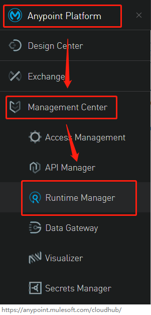
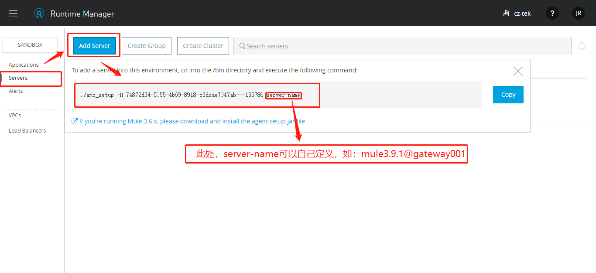
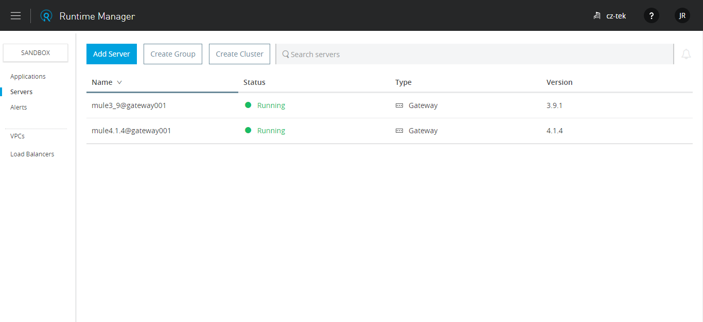
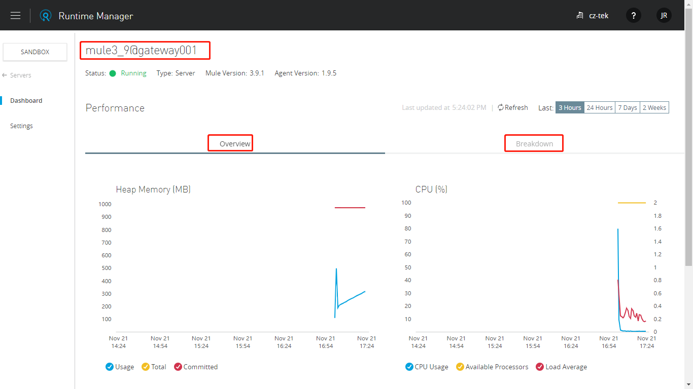

# Mule运行时部署及管理控制台实现

准备工作：注册Mule AnypoitPlaform账号

## 1.获取授权指令

登陆AnypoitPlaform，从左侧菜单栏进入ManagementCenter --> RuntimeManager -->Add Server -->拷贝下来此处提供的指令,如： `./amc_setup -H xxxxxxxxxxxxxxxxxxxxxxxx server-name`. 

## 2.安装MuleESB运行时（MuleRuntime）

1.  [下载运行时](https://docs.mulesoft.com/release-notes/mule-runtime/mule-3.9.1-release-notes)
2.  解压运行时到指定目录
3.  cd到安装目录(MULE_HOME)下的 bin目录
4.  执行上述脚本，将服务器注册到AnypointPlaform平台
5.  启动服务（执行启动指令`${MULEHOME}/bin/mule start`）

## 3.验证控制台对接情况

根据步骤一，进入RuntimeManagement, 点击查看Servers列表，可以看到如下图：

如果服务器中已有应用在运行，可以查看服务器的DashBoard，如下图：

