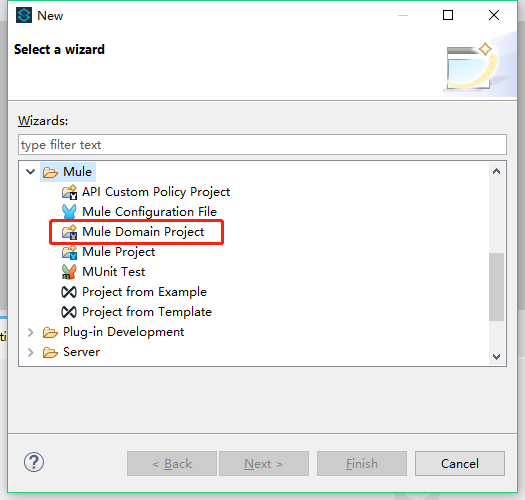
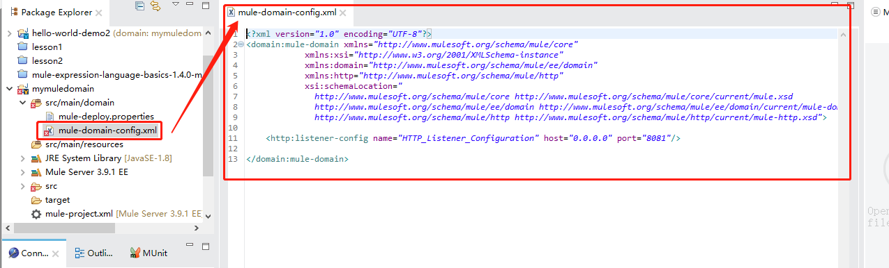
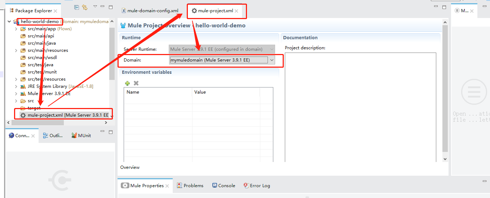
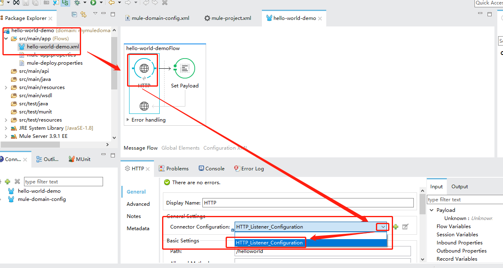

# 如何实现MuleESB中Applications间的资源共享

发布应用时，可能出现一些问题，比如：端口冲突。

本教程将通过实例演示实现MuleESB中不同应用共享同一个端口。

## 1.新建Domain

### 1.1 新建 MuleDomainProject项目

### 1.2配置 需要共享的资源

如图所示，配置`mule-domain-config.xml`文件

## 2.将Applications与上述步骤中的Domain进行关联

### 2.1 配置App

打开Applications,关联其需要引用的ParentDomain

### 2.2 共享资源的引用

在需要使用Http_Request_Config的地方选择来自Domain的配置，如图

## 3.部署应用，验证共享结果

http://gateway001:8081/console/

http://gateway001:8081/helloworld

http://gateway001:8081/helloworld2

访问三个不同应用，可以同时访问，则说明已经共用一个端口

## 注意：

1. 导出Applications时，不要勾选parent domain选项！！！
2. 部署应用时，需要先部署Domain项目，再部署其他Application应用
3. 配置Domain监听端口时，注意地址不要写成localhost！ 而是`0.0.0.0`,不要只有本地可以访问，外网访问不到该端口！！