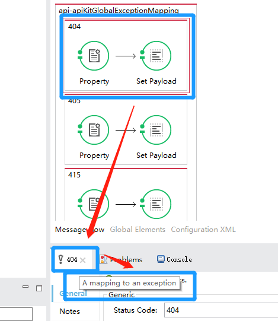

# Mule ESB 学习资料

## MuleSoft新手入门

对于新手来说，可能最需要的是先了解mule的基础知识和语法，这时，可以先看《MULE_3.2_节点详解.pdf》，了解mule的结构、常用参数获取方法、一些基础控件。

好了，现在已经对mule有了初步的了解了，然后练习几个例子，可以参考《mule-esb-examples.pdf》文档。里边有很多的例子，对于一般使用就够用了。

下面，要深入的了解了，这个时候就需要看官方文档了。

官方代码示例：
https://github.com/mulesoft/anypoint-examples.git
用户手册：
https://docs.mulesoft.com/mule-user-guide/v/3.7

## MULE常用下载地址

Mule开发环境下载地址(Studio7 -- 只支持Mule4)
https://www.mulesoft.com/lp/dl/studio

Mule开发环境下载地址(Studio6 -- 支持Mule3.x)
https://www.mulesoft.com/lp/dl/studio/previous

Mule企业版独立运行时下载地址
https://www.mulesoft.com/lp/dl/mule-esb-enterprise

Mule社区版独立运行时下载地址
https://developer.mulesoft.com/download-mule-esb-runtime

## mule产品、价格和下载地址

MULE ESB企业版 -- lisence方式，按一般企业够用的基本配置购买，50W+每年（中国大陆），国外可能稍贵。如果是续费用户，按前一年价格续费。最低入门配置是， 2核生产核＋4核测试核。
MULE ESB社区版 -- 开源免费，功能相对企业版稍弱，运行稳定，可做二次开发。
MULE开发环境（Anypoint Studio） -- 永久免费，基于eclipse的开发环境，里面可以安装企业版和社区版运行时进行开发。

============ 企业版和社区版主要区别（自己总结体会的） ===============
1、MMC控制台，企业版的MMC可以实现服务器监控，FLOW控制，日志查询跟踪等功能；社区版要实现这些功能需要做一定二次开发。
2、集群，企业版的两台独立MULE容器可以配置成集群，实现内存级信息共享、定时器功能去重等；社区版需要开发者手工做。
3、数据转换，企业版有个强大的data weave组件，可以任意转换各种常用数据格式；社区版的数据转换开发工作量会比企业版大。

============= 技术选型 =============
MULE企业版的功能强大，价格上也和ORACLE,IBM等公司的产品差不太对。建议有实力预算充足的公司选用。
MULE社区版相对于其他一些开源的ESB产品，如apache的serviceMix等，开发效率上有优势，群众基础也相对更广泛，中小企业可以考虑。

============== 下载地址 ============
企业版独立运行时安装包，官网上很容易找到
社区版独立运行时安装包，https://developer.mulesoft.com/download-mule-esb-runtime

## 开发文档分享

MULE官网
https://www.mulesoft.com/

MULE开发文档
https://docs.mulesoft.com/

MULE入门和关键概念
https://docs.mulesoft.com/mule-user-guide/v/3.8/mule-concepts

MEL表达式基础
https://docs.mulesoft.com/mule-user-guide/v/3.8/mule-expression-language-mel

利用HTTP组件发布服务
https://docs.mulesoft.com/mule-user-guide/v/3.7/http-listener-connector

利用HTTP组件调用其他系统的服务
https://docs.mulesoft.com/mule-user-guide/v/3.7/http-request-connector

利用CXF组件发布（代理、消费）web service服务
https://docs.mulesoft.com/mule-user-guide/v/3.8/building-web-services-with-cxf

数据库组件在MULE中的使用
https://docs.mulesoft.com/mule-user-guide/v/3.7/database-connector

利用Choice组件做服务路由（选择）
https://docs.mulesoft.com/mule-user-guide/v/3.7/choice-flow-control-reference

利用Scatter Gather组价做服务路由（广播）
https://docs.mulesoft.com/mule-user-guide/v/3.7/scatter-gather

MULE服务器和其他WEB容器的相似和区别
https://docs.mulesoft.com/mule-user-guide/v/3.8/mule-versus-web-application-server

MULE服务器运行时下载（社区版）
https://developer.mulesoft.com/download-mule-esb-runtime

## Mule Example List

| Name                                                         | Type    | Date Modified | Rating |
| ------------------------------------------------------------ | ------- | ------------- | ------ |
| [Scatter-Gather Flow Control](https://anypoint.mulesoft.com/exchange/org.mule.examples/scatter-gather-flow-control/) | Example | Sep 12, 2018  |   |
| [Hello World](https://anypoint.mulesoft.com/exchange/org.mule.examples/hello-world/) | Example | Sep 12, 2018  |   |
| [Authenticating Salesforce using OAuth 2.0](https://anypoint.mulesoft.com/exchange/org.mule.examples/authenticating-salesforce-using-oauth2/) | Example | Sep 12, 2018  |   |
| [Sending a CSV file through email using SMTP Connector](https://anypoint.mulesoft.com/exchange/org.mule.examples/sending-a-csv-file-through-email-using-smtp/) | Example | Sep 7, 2018   |   |
| [Import Contacts Into Salesforce](https://anypoint.mulesoft.com/exchange/org.mule.examples/import-contacts-into-salesforce/) | Example | Sep 6, 2018   |   |
| [Web Service Consumer](https://anypoint.mulesoft.com/exchange/org.mule.examples/web-service-consumer/) | Example | Sep 6, 2018   |   |
| [Using Transactional Scope with JMS and Database Operations](https://anypoint.mulesoft.com/exchange/org.mule.examples/using-transactional-scope-in-jms-to-database/) | Example | Sep 6, 2018   |   |
| [Upload to FTP After Converting JSON to XML](https://anypoint.mulesoft.com/exchange/org.mule.examples/upload-to-ftp-after-converting-json-to-xml/) | Example | Sep 6, 2018   |   |
| [Track a Custom Business Event](https://anypoint.mulesoft.com/exchange/org.mule.examples/track-a-custom-business-event/) | Example | Sep 6, 2018   |   |
| [Testing APIKit with MUnit](https://anypoint.mulesoft.com/exchange/org.mule.examples/testing-apikit-with-munit/) | Example | Sep 6, 2018   |   |
| [Sending JSON Data to an AMQP Queue](https://anypoint.mulesoft.com/exchange/org.mule.examples/sending-json-data-to-a-amqp-queue/) | Example | Sep 6, 2018   |   |
| [Sending JSON to a JMS Queue](https://anypoint.mulesoft.com/exchange/org.mule.examples/sending-json-data-to-a-jms-queue/) | Example | Sep 6, 2018   |   |
| [SAP Data Retrieval](https://anypoint.mulesoft.com/exchange/org.mule.examples/sap-data-retrieval/) | Example | Sep 6, 2018   |   |
| [Salesforce to MySQL Database Using Batch Processing](https://anypoint.mulesoft.com/exchange/org.mule.examples/salesforce-to-MySQL-DB-using-Batch-Processing/) | Example | Sep 6, 2018   |   |
| [Data Sync Using Watermarking and Batch](https://anypoint.mulesoft.com/exchange/org.mule.examples/salesforce-data-synchronization-using-watermarking-and-batch-processing/) | Example | Sep 6, 2018   |   |
| [Salesforce Data Retrieval](https://anypoint.mulesoft.com/exchange/org.mule.examples/salesforce-data-retrieval/) | Example | Sep 6, 2018   |   |
| [Retry Mechanism in Mule Applications](https://anypoint.mulesoft.com/exchange/org.mule.examples/retry-mechanism-example/) | Example | Sep 6, 2018   |   |
| [REST API with APIkit](https://anypoint.mulesoft.com/exchange/org.mule.examples/rest-api-with-apikit/) | Example | Sep 6, 2018   |   |
| [Querying a Database and Attaching Results to an Email](https://anypoint.mulesoft.com/exchange/org.mule.examples/querying-a-db-and-attaching-results-to-an-email/) | Example | Sep 6, 2018   |   |
| [Querying a MySQL Database](https://anypoint.mulesoft.com/exchange/org.mule.examples/querying-a-mysql-database/) | Example | Sep 6, 2018   |   |
| [Proxying a SOAP API](https://anypoint.mulesoft.com/exchange/org.mule.examples/proxying-a-soap-api/) | Example | Sep 6, 2018   |   |
| [Proxying a REST API](https://anypoint.mulesoft.com/exchange/org.mule.examples/proxying-a-rest-api/) | Example | Sep 6, 2018   |   |
| [Processing Orders with DataWeave and APIkit](https://anypoint.mulesoft.com/exchange/org.mule.examples/processing-orders-with-dataweave-and-APIkit/) | Example | Sep 6, 2018   |   |
| [OAuth2 Authorization Code Using the HTTP Connector](https://anypoint.mulesoft.com/exchange/org.mule.examples/oauth2-authorization-code-using-the-HTTP-connector/) | Example | Sep 6, 2018   |   |
| [NetSuite Data Retrieval](https://anypoint.mulesoft.com/exchange/org.mule.examples/netsuite-data-retrieval/) | Example | Sep 6, 2018   |   |
| [Unit Testing with MUnit - Tutorial](https://anypoint.mulesoft.com/exchange/org.mule.examples/munit-short-tutorial/) | Example | Sep 6, 2018   |   |
| [Login Form Using the HTTP Connector](https://anypoint.mulesoft.com/exchange/org.mule.examples/login-form-using-the-http-connector/) | Example | Sep 6, 2018   |   |
| [Import Leads into Salesforce using Batch Processing](https://anypoint.mulesoft.com/exchange/org.mule.examples/import-leads-into-salesforce/) | Example | Sep 6, 2018   |   |
| [Legacy Modernization](https://anypoint.mulesoft.com/exchange/org.mule.examples/legacy-modernization/) | Example | Sep 6, 2018   |   |
| [JMS Message Rollback and Redelivery](https://anypoint.mulesoft.com/exchange/org.mule.examples/jms-message-rollback-and-redelivery/) | Example | Sep 6, 2018   |   |
| [Importing Email Attachments using the POP3 Connector](https://anypoint.mulesoft.com/exchange/org.mule.examples/importing-an-email-attachment-using-the-POP3-connector/) | Example | Sep 6, 2018   |   |
| [Importing an Email Attachment using the IMAP Connector](https://anypoint.mulesoft.com/exchange/org.mule.examples/importing-an-email-attachment-using-the-IMAP-connector/) | Example | Sep 6, 2018   |   |
| [Importing a CSV File into MongoDB](https://anypoint.mulesoft.com/exchange/org.mule.examples/importing-a-CSV-file-into-Mongo-DB/) | Example | Sep 6, 2018   |   |
| [Import Contacts Into Microsoft Dynamics](https://anypoint.mulesoft.com/exchange/org.mule.examples/import-contacts-into-ms-dynamics/) | Example | Sep 6, 2018   |   |
| [Import Contacts Asynchronously](https://anypoint.mulesoft.com/exchange/org.mule.examples/import-contacts-asynchronously/) | Example | Sep 6, 2018   |   |
| [Implementing an Exception Strategy](https://anypoint.mulesoft.com/exchange/org.mule.examples/implementing-a-choice-exception-strategy/) | Example | Sep 6, 2018   |   |
| [HTTP Request Response with Logger](https://anypoint.mulesoft.com/exchange/org.mule.examples/http-request-response-with-logger/) | Example | Sep 6, 2018   |   |
| [HTTP Multipart Request Example](https://anypoint.mulesoft.com/exchange/org.mule.examples/http-multipart-request/) | Example | Sep 6, 2018   |   |
| [Retrieving a List of Customers from NetSuite](https://anypoint.mulesoft.com/exchange/org.mule.examples/get-customer-list-from-netsuite/) | Example | Sep 6, 2018   |   |
| [Filtering a Message](https://anypoint.mulesoft.com/exchange/org.mule.examples/filtering-a-message/) | Example | Sep 6, 2018   |   |
| [Foreach Processing and Choice Routing](https://anypoint.mulesoft.com/exchange/org.mule.examples/foreach-processing-and-choice-routing/) | Example | Sep 6, 2018   |   |
| [Extracting Data from LDAP](https://anypoint.mulesoft.com/exchange/org.mule.examples/extracting-data-from-LDAP-directory/) | Example | Sep 6, 2018   |   |
| [Exposing a RESTful resource using the HTTP connector](https://anypoint.mulesoft.com/exchange/org.mule.examples/exposing-a-restful-resource-using-the-HTTP-connector/) | Example | Sep 6, 2018   |   |
| [DataWeave 2 Basics](https://anypoint.mulesoft.com/exchange/org.mule.examples/dataweave-2-basics/) | Example | Sep 6, 2018   |   |
| [DataWeave with Flow Reference Lookup](https://anypoint.mulesoft.com/exchange/org.mule.examples/dataweave-with-flowreflookup/) | Example | Sep 6, 2018   |   |
| [Content-Based Routing](https://anypoint.mulesoft.com/exchange/org.mule.examples/content-based-routing/) | Example | Sep 6, 2018   |   |
| [Cache Scope with Salesforce Contacts](https://anypoint.mulesoft.com/exchange/org.mule.examples/cache-scope-with-salesforce-contacts/) | Example | Sep 6, 2018   |   |
| [Addition using a Javascript Transformer](https://anypoint.mulesoft.com/exchange/org.mule.examples/addition-using-javascript-transformer/) | Example | Sep 6, 2018   |   |
| [Adding a new customer to Workday Revenue Management](https://anypoint.mulesoft.com/exchange/org.mule.examples/adding-a-new-customer-to-workday-revenue-management/) | Example | Sep 6, 2018   |   |
| [Implement B2B using File transfer](https://anypoint.mulesoft.com/exchange/org.mule.examples/B2B-Using-File-Transfer/) | Example | Jun 23, 2017  |   |
| [REST API with XML Payload](https://anypoint.mulesoft.com/exchange/org.mule.examples/RESTXML/) | Example | Jun 23, 2017  |   |
| [Create a REST API Proxy to a SOAP Web Service](https://anypoint.mulesoft.com/exchange/org.mule.examples/create-rest-api-proxy-to-soap-web-service/) | Example | Jun 23, 2017  |   |
| [Expose a Database through a SOAP Web Service](https://anypoint.mulesoft.com/exchange/org.mule.examples/expose-database-through-soap-web-service/) | Example | Jun 23, 2017  |   |
| [Extract, Transform and Load using Batch Processing](https://anypoint.mulesoft.com/exchange/org.mule.examples/Extract-Transform-Load-Using-Batch/) | Example | Jun 23, 2017  |   |
| [Cache Scope with Fibonacci](https://anypoint.mulesoft.com/exchange/org.mule.examples/cache-scope-with-fibonacci/) | Example | Jun 23, 2017  |   |
| [Document Integration using the CMIS](https://anypoint.mulesoft.com/exchange/org.mule.examples/document-integration-using-the-cmis-connector/) | Example | Jun 23, 2017  |   |
| [Mule Expression Language Basics](https://anypoint.mulesoft.com/exchange/org.mule.examples/mule-expression-language-basics/) | Example | Jun 23, 2017  | ★★★★★ |
| [SOAP Web Service Security](https://anypoint.mulesoft.com/exchange/org.mule.examples/soap-webservice-security/) | Example | Jun 23, 2017  |   |
| [WebSphere MQ](https://anypoint.mulesoft.com/exchange/org.mule.examples/websphere-mq/) | Example | Jun 23, 2017  |   |
| [XML Only SOAP Web Service](https://anypoint.mulesoft.com/exchange/org.mule.examples/xml-only-soap-webservice/) | Example | Jun 23, 2017  |   |
| [Service Orchestration and Choice Routing](https://anypoint.mulesoft.com/exchange/org.mule.examples/service-orchestration-and-choice-routing/) | Example | Jun 23, 2017  |   |
| [Aggregate API Invocation](https://anypoint.mulesoft.com/exchange/org.mule.examples/how-to-create-api-aggregations/) | Example | Jun 23, 2017  |   |
| [Consume APIs from IBM i with AS400 connector and Web Transaction Framework](https://anypoint.mulesoft.com/exchange/org.mule.examples/consume-api-ibmi-as400-example/) | Example | Jun 23, 2017  |   |
| [Call IBM i Command](https://anypoint.mulesoft.com/exchange/org.mule.examples/call-ibmi-command-example/) | Example | Jun 23, 2017  |   |
| [Exception Handling](https://anypoint.mulesoft.com/exchange/org.mule.examples/exception-handling-part-1/) | Example | Jun 23, 2017  |   |

## Tips

### 1.组件提示

在阅读Example源码时，有时候看不清楚演示中使用的是什么组件，这是可以鼠标悬停在属性框来获取组件名称

### 2.组件配置

查不全属性配置时，可以直接查看xml源码来找属性赋值情况。

### 3.组件试图可以通过设置次轮调整DataTransform组件形式

