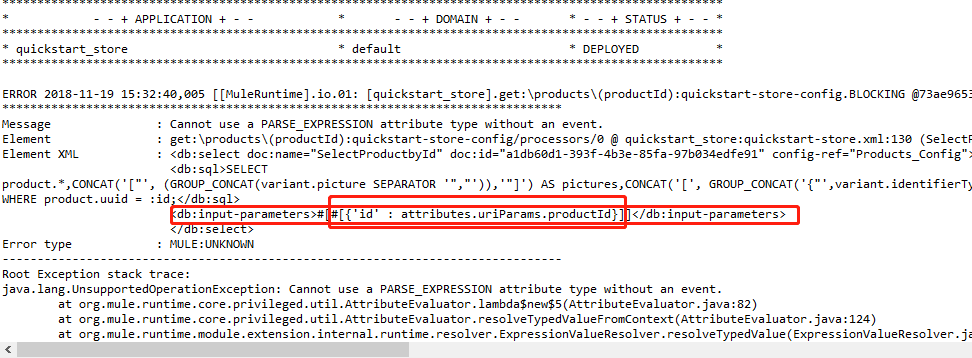

# Developing your first Mule application

This guide takes the API specification from the [previous guide](https://developer.mulesoft.com/guides/quick-start/designing-your-first-api) and leverages it to build a [Mule Application](https://developer.mulesoft.com/guides/quick-start/developing-your-first-mule-application#)in order to:

- Scaffold your API implementation with prepopulated modules and flows to save development time.
- Provide the metadata to simplify and expedite data processing to match the desired response.
- Serves as a reference for request requirements to perform tests. 


## Why develop in Anypoint Platform

Anypoint Platform's well defined coupling of the API specification allows users to leverage it in a multitude of ways, including significantly simplifying and accelerating  the implementation of  applications. Other benefits of generating a Mule application with Anypoint Platform include:

- Easily transforming, routing, aggregating, and re-sequencing messages/data.
- Leveraging the large number of out-of-the-box connectors to ensure expansive connectivity across protocols and systems.
- Getting a lightweight and capable runtime.

## Get set up

1. Make sure you have the API specification from the previous guide to Exchange.
   - OPTIONAL: download the publically available API specification [from Exchange](https://anypoint.mulesoft.com/exchange/org.mule.examples/devrel-quick_start-product_api/).
2. Download and install [Anypoint Studio 7](https://www.mulesoft.com/lp/dl/studio).

## Your 1st project in Anypoint Studio

To create the implementation, you're going to use [Anypoint Studio](https://developer.mulesoft.com/guides/quick-start/developing-your-first-mule-application#)and leverage your API Specification to not only scaffold your HTTP endpoints, but also provide an easy visual mapping of the endpoint's response to ensure it meets the data structure contracted from the spec.

## Scaffolding flows with APIkit

Start up Anypoint Studio and create a new Mule project by:

1. Click **File** → **New** → **Mule Project**.
2. Fill in the project name field with a name that you'd like for your first project.
3. Check the "Specify API definition file location or URL" checkbox.
   - Since the API Spec was published to Exchange, you can retrieve it from your exchange into this project and pre-populate the endpoints/flows with [APIkit](https://developer.mulesoft.com/guides/quick-start/developing-your-first-mule-application#).
4. Click **...**.
5. Click **Design Center.**
6. Select the "QuickStart-Store" RAML file you created from  guide 1
   - OPTIONAL: If you didn't complete the first guide, download [**DevRel-Quick Start Products API**](https://anypoint.mulesoft.com/exchange/org.mule.examples/devrel-quick_start-product_api/) and select **Browse Files** for step 5 instead.
   - This will scaffold (pre-populate) all the endpoints, datatypes, errors, etc. for your implementation by using the specification.
7. Click **Finish**.


Your new project will include several [Mule Flows](https://developer.mulesoft.com/guides/quick-start/developing-your-first-mule-application#)with modules populated on the canvas—including a flow for your **get:\products\{productid}**.

## Configuring your HTTP listener

Since [Mule flows](https://mule4-docs.mulesoft.com/mule-user-guide/v/4.0/about-flows) are event-driven [event processors](https://developer.mulesoft.com/guides/quick-start/developing-your-first-mule-application#), the [message source](https://developer.mulesoft.com/guides/quick-start/developing-your-first-mule-application#)for the top-most flow is the HTTP Listener, which will listen for incoming requests to pass over to the APIkit router, which routes the request to the corresponding endpoint and method flow for a response (otherwise it will return an error response). 

You can add a new configuration for your HTTP Listener by clicking the **+** button. The app will be listening on all of the machine's IPv4 addresses at port **8081** with an application root path of **/api/***

- Hosts: 0.0.0.0
- Port: 8081

[](https://developer.mulesoft.com/sites/default/files/http_listener_configuration_0.png)

This enables you to reach all resources from **0.0.0.0:8081/api/***.

## MySQL integration with the Database connector

There are several connectors available out-of-the-box within Exchange and more can be published to your Exchange to enable quick and easy integrations. One of the available connectors is the Database connector, which enables connections to a variety of SQL database types.

## Adding a connector to a flow

All Mule components can be added to the canvas from the [Mule Palette](https://developer.mulesoft.com/guides/quick-start/developing-your-first-mule-application#), including the Database connector. If the Database connector is not available in your project's Palette, click the + for "Add Module." Locate the "Database Connector," select **Add**, select the latest version of the connector from the drop-down, and click **Finish**. 

[](https://developer.mulesoft.com/sites/default/files/add_database_module_0.png)

After you add the Database connector to your project, pick it from the palette, and drag the **Select** into the **get:\products\{productId}** flow's message processor section.


## Database connector configuration

For this guide, you'll be accessing a MySQL database hosted in an Amazon RDS insance with three tables. Feel free to download the Excel export of the entire database and all tables. 
[congoStore.xlsx](https://assets.devrel.mulesoft.com/QuickStart/database/congoStore.xlsx)

In a pattern similar to the HTTP Listener, the first step is to add a reusable global configuration by clicking the **+** button. This loads a new configuration modal that you can fill with the following values:

- **Name**: Products_Config
- **Connection**: MySQL Connection
- **Host**: congo.devrel.mulesoft.com
- **Port**: 3306
- **User**: mulesoft
- **Password**: mulesoft
- **Database**: products?useSSL=false&autoReconenct=true

The last step to finish configuring the connector is to install the Java driver for MySQL by clicking the **Modify dependency** button and pasting the following Maven dependency:

```xml
<dependency>
	<groupId>mysql</groupId>
	<artifactId>mysql-connector-java</artifactId>
	<version>8.0.8-dmr</version>
	<type>jar</type>
</dependency>
```

After clicking **Finish**, it will download the Maven library and install it to your project. You can now click **Test Connection** to verify that everything works. Upon success, click **OK** to save this global configuration. Since this configuration is available globally, it can be selected in any additional flows with the Database connector to avoid redundancy. 

[](https://developer.mulesoft.com/sites/default/files/setting_database_config.png)

If you are unable to connect to the database and all the fields match what's written above, please check that your machine or network firewall doesn't block traffic on port 3306.

You can now set the general settings for that specific connector by giving it a unique and descriptive **Display Name** of "Select Product by Id." Next, you'll configure the [**Input Parameters**](https://developer.mulesoft.com/guides/quick-start/developing-your-first-mule-application#):

```java
#[{'id' : attributes.uriParams.productId}]
```

> 注意： 此表达式可能会报错，需要做出如下调整：`{'id' : attributes.uriParams.productId}`。具体原因如下图：mule应用在解析input-parameters时，已经帮用户
>
> 

In order to mitigate potential SQL injections, this expression assigns the local variable "id" with the value from the URI param "productId" from the request URI. You can reference this locally scoped variable with a **:**, which you'll use in the SQL query below that joins two tables of data and filters by matching ":id" which has the value of URI parameter:

```sql
SELECT 
product.*,
CONCAT('["', (GROUP_CONCAT(variant.picture SEPARATOR '", "')),'"]') AS pictures,
CONCAT('[', GROUP_CONCAT('{"',variant.identifierType, '":"', variant.identifier, '"}'),']') AS identifiers
FROM product
INNER JOIN variant ON product.uuid = variant.productUUID
WHERE product.uuid = :id;
```

## Transform data with DataWeave

To ensure that the response data matches your API spec's contract for a valid request, the results from the database must be manipulated and converted to match the defined structure and mime-type . In order to do that, you'll be using a powerful functional data transformation language called [DataWeave](https://mule4-docs.mulesoft.com/mule-user-guide/v/4.0/dataweave). You'll find that a Dataweave connector already placed in the flow with the label, **Transform Message**. This connector's settings view has multiple areas as outlined below:

[](https://developer.mulesoft.com/sites/default/files/dataweave_ui_0.png)

Each of the input parameters can be visually mapped by dragging the key to the corresponding output. For sake of expediency of this exercise, simply copy-and-paste the code below into the DataWeave code section:

```java
%dw 2.0 // The version
output application/json // The mime-type of the output
var product = payload[0] // Setting a variable called product with a value of the first item of query's payload
---
{
	identifier: product.uuid,
	identifiers: read(product.identifiers default "[]","application/json"), // Parsing this string to a JSON object. If null, defaults to empty array to avoid a null exception.
	price: {
		amount: {
			currencyValue: product.currencyValue,
			name: product.currencyName default "Amount", // Setting a default value if value is null
			currency: product.currency
		},
		salesUnit: {
			code: product.salesUnitCode,
			name: product.salesUnitName
		}
	},
	description: product.description,
	model: product.model,
	brand: product.brand,
	pictures: read(product.pictures default "[]","application/json") // Parsing this string to a JSON object. If null, defaults to empty array to avoid a null exception.
}
```

This Dataweave transformation is taking the Java Object returned from the MySQL query, seeing the first item in the array (only one since it's a unique Id) to a local variable called "product," and mapping the values to the output object.

Since this MySQL DB is v5.6+, it supports JSON objects, which returns a string representation of the object. Using DataWeave's read() function, the string can be parsed to JSON. DataWeave also supports comments as denoted via "//".

## Run and test your implementation

You're now ready to run your application and validate that it works as expected by simply right clicking an empty area of the canvas and selecting **Run project quickstart-store**. This will start up the JVM and launch your application. A successful running application showing the following in the **Console** tab:

[](https://developer.mulesoft.com/sites/default/files/studio_running_app_3.png)

You can now test against this deployed application by running the following CURL command:

```
curl -X GET localhost:8081/api/products/1295527d-d3c7-11e7-9c84-06bf056d193e
```

You should see a **200** response that matches the expected output format.

## Next Steps

Congrats! You are now done building your app and you are ready to deploy your app using this similar pattern for a multitude of integration patterns! In the next guide, you'll be deploying to cloud, monitoring your instance, and gaining insights about your application all within Anypoint Platform to complete your introduction to the platform!

[Go to: Deploying and managing your first API ›](https://developer.mulesoft.com/guides/quick-start/deploying-and-managing-your-first-api)