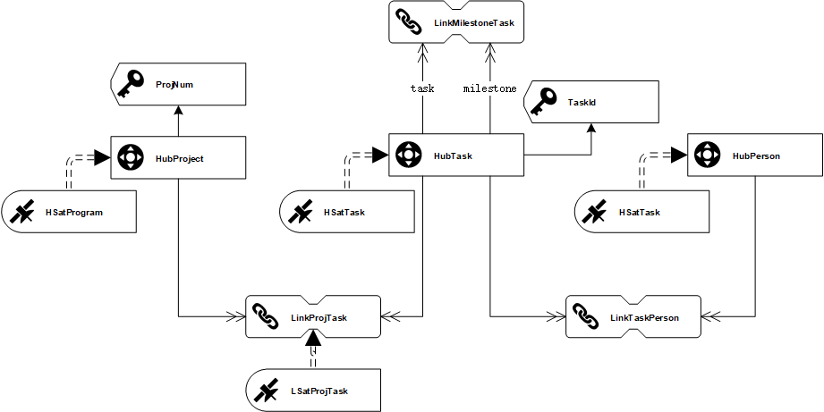

## 1.StageArea

### plm_task

| Table    | Field          | Type   | key  |
| -------- | -------------- | ------ | ---- |
| plm_task | TaskID         | string | √    |
| plm_task | LoadDate       | bigint | √    |
| plm_task | TaskName       | string |      |
| plm_task | PlanStartAt    | bigint |      |
| plm_task | PlanEndAt      | bigint |      |
| plm_task | StartAt        | bigint |      |
| plm_task | EndAt          | bigint |      |
| plm_task | ProjectNum     | string |      |
| plm_task | ProjectName    | string |      |
| plm_task | RecordSource   | string |      |
| plm_task | HProjectHK     | string |      |
| plm_task | HTaskHK        | string |      |
| plm_task | LProjTaskHK    | string |      |
| plm_task | HSTaskHashDiff | string |      |

```sql
create table stagearea.plm_task (
TaskID string ,
LoadDate bigint,
TaskName string,
PlanStartAt bigint,
PlanEndAt bigint,
StartAt bigint,
EndAt bigint,
ProjectNum string,
ProjectName string,
RecordSource string,
HProjectHK string,
HTaskHK string,
LProjTaskHK string,
HSTaskHashDiff string,
primary key(TaskID,LoadDate)
)
stored as kudu;

```


## 2.DataVault




### HubProject

| Table      | Field        | Type   | key  |
| ---------- | ------------ | ------ | ---- |
| HubProject | HProjectHK   | string | PK   |
| HubProject | LoadDate     | bigint |      |
| HubProject | RecordSource | string |      |
| HubProject | ProjectNum   | string | BK   |

```sql
create table RawDataVault.Hubproject (
	HProjectHK string,
    LoadDate bigint,
    RecordSource string,
    ProjectNum string,
    primary key(HProjectHK)
)
partition by Hash(HProjectHK)partitions 4
stored as kudu;
```

```sql
-- 指定数据插入的目标表
insert into RawDataVault.HubProject 
-- 从数据源选择目标表需要的字段，注意去重
select distinct stg.HProjectHK,stg.LoadDate,stg.RecordSource,stg.ProjectNum 
from stagearea.plm_task stg
-- 根据目标表的UK，筛选剔除不需要的记录
where stg.HProjectHK not in (select tgt.HProjectHK from RawDataVault.HubProject tgt)
and stg.loaddate=${loaddate};

```


### HSatProject

| Table       | Field        | Type   | key  |
| ----------- | ------------ | ------ | ---- |
| HSatProject | HProjectHK   | string | PK   |
| HSatProject | LoadDate     | bigint | PK   |
| HSatProject | LoadEndDate  | bigint |      |
| HSatProject | RecordSource | string |      |
| HSatProject | ProjectName  | string | UK   |

```SQL
create table RawDataVault.HSatProject (
	HProjectHK string,
    LoadDate bigint,
    LoadEndDate bigint,
    RecordSource string,
    ProjectName string,
    primary key (HProjectHK,LoadDate)
)
partition by Hash(HProjectHK) partitions 4,
Range (LoadDate) (
	-- 2018.10.01 00：00：00前
	partition 0<values<=1538323200,
	-- 2018.10.01 00：00：00 到 2018.12.31 23：59：59（2018第四季度）
    partition 1538323200<values<=1546271999,
	-- 2019第一季度
    partition 1546271999<values<=1554047999
)
stored as kudu;
-- 新增分区时可以使用以下语法：
-- ALTER TABLE HSatProject ADD RANGE PARTITION 1554047999<VALUES<=${后续分区时间节点};
```

```sql
-- 指定数据插入的目标表
insert into rawdatavault.hsatproject
-- 从数据源选择目标表需要的字段，注意去重
select distinct stg.hprojecthk,stg.loaddate,null,stg.recordsource,stg.projectname
from stagearea.plm_task stg 
-- 以下脚本是为了筛选出Delta记录（即新增及存在更新的记录），由于HashDiff只反应负载数据(payload)不能仅仅通过HashDiff去判断是否为Delta记录。 本处处理逻辑为：通过依赖键来关联stg跟tgt，剔除loadenddate不为空（即已失效的记录），并通过限定HashDiff不相等来保证是更新/新增的记录
left outer join rawdatavault.hsatproject tgt
on (stg.hprojecthk=tgt.hprojecthk and tgt.loadenddate is null)
where (nvl(stg.projectname,'')!=nvl(tgt.projectname,''))
and stg.loaddate=${loaddate};

```


```sql
UPDATE tgt
SET tgt.loadenddate= src.loadenddate
FROM rawdatavault.${sat} tgt
LEFT JOIN
  (SELECT el.${sathk} AS ${sathk},
          el.loaddate AS loaddate,
          min(lt.loaddate)-1 AS loadenddate
   FROM rawdatavault.${sat} el
   LEFT JOIN rawdatavault.${sat} lt ON (el.${sathk}=lt.${sathk}
                            AND el.loaddate<lt.loaddate)
   GROUP BY el.${sathk},
            el.loaddate) src ON tgt.${sathk}=src.${sathk}
AND tgt.loaddate=src.loaddate


-- ${sat}=hsatproject ${sathk}=hprojecthk
```


### HubTask

| Table   | Field        | Type   | key  |
| ------- | ------------ | ------ | ---- |
| HubTask | HTaskHK      | string | PK   |
| HubTask | LoadDate     | bigint |      |
| HubTask | RecordSource | string |      |
| HubTask | TaskID       | string | BK   |

```sql
create table RawDataVault.HubTask (
	HTaskHK string,
    LoadDate bigint,
    RecordSource string,
    TaskID string,
    primary key(HTaskHK)
)
partition by Hash(HTaskHK) partitions 4
stored as kudu;
```

```sql
-- 指定数据插入的目标表
insert into rawdatavault.hubtask
-- 从数据源选择目标表需要的字段，注意去重
select distinct stg.htaskhk,stg.loaddate,stg.recordsource,stg.taskid
from stagearea.plm_task stg
-- 根据目标表的UK，筛选剔除不需要的记录
where stg.htaskhk not in(select tgt.htaskhk from rawdatavault.hubtask tgt )
and stg.loaddate=${loaddate}
```


### HSatTask

| Table    | Field          | Type   | key  |
| -------- | -------------- | ------ | ---- |
| HSatTask | HTaskHK        | string | PK   |
| HSatTask | LoadDate       | bigint | PK   |
| HSatTask | LoadEndDate    | bigint |      |
| HSatTask | RecordSource   | string |      |
| HSatTask | TaskName       | string |      |
| HSatTask | PlanStartAt    | bigint |      |
| HSatTask | PlanEndAt      | bigint |      |
| HSatTask | StartAt        | bigint |      |
| HSatTask | EndAt          | bigint |      |
| HSatTask | HSTaskHashDiff | string | UK   |

```sql
create table RawDataVault.HSatTask(
	HTaskHK string,
    LoadDate bigint,
    LoadEndDate bigint,
    RecordSource string,
    TaskName string,
    PlanStartAt bigint,
    PlanEndAt bigint,
    StartAt bigint,
    EndAt bigint,
    HSTaskHashDiff string,
    primary key(HTaskHK,LoadDate)
)
partition by Hash(HTaskHK) partitions 4,
Range (LoadDate) (
	-- 2018.10.01 00：00：00前
	partition 0<values<=1538323200,
	-- 2018.10.01 00：00：00 到 2018.12.31 23：59：59（2018第四季度）
    partition 1538323200<values<=1546271999,
	-- 2019第一季度
    partition 1546271999<values<=1554047999
)
stored as kudu;
-- 新增分区时可以使用以下语法：
-- ALTER TABLE HSatTask ADD RANGE PARTITION 1554047999<VALUES<=${后续分区时间节点};
```

```sql
-- 指定数据插入的目标表
insert into rawdatavault.hsattask
-- 从数据源选择目标表需要的字段，注意去重
select distinct stg.HTaskHK,stg.LoadDate,null,stg.recordsource,stg.TaskName,stg.PlanStartAt,stg.PlanEndAt,stg.StartAt,stg.EndAt,stg.HSTaskHashDiff
from stagearea.plm_task stg 
-- 以下脚本是为了筛选出Delta记录（即新增及存在更新的记录），由于HashDiff只反应负载数据(payload)不能仅仅通过HashDiff去判断是否为Delta记录。 本处处理逻辑为：通过依赖键来关联stg跟tgt，剔除loadenddate不为空（即已失效的记录），并通过限定HashDiff不相等来保证是更新/新增的记录
left outer join rawdatavault.hsattask tgt
on (stg.HTaskHK=tgt.HTaskHK and tgt.loadenddate is null)
where (nvl(stg.HSTaskHashDiff,'')!=nvl(tgt.HSTaskHashDiff,''))
and stg.loaddate=${loaddate};

```

```sql
UPDATE tgt
SET tgt.loadenddate= src.loadenddate
FROM rawdatavault.${sat} tgt
LEFT JOIN
  (SELECT el.${sathk} AS ${sathk},
          el.loaddate AS loaddate,
          min(lt.loaddate)-1 AS loadenddate
   FROM rawdatavault.${sat} el
   LEFT JOIN rawdatavault.${sat} lt ON (el.${sathk}=lt.${sathk}
                            AND el.loaddate<lt.loaddate)
   GROUP BY el.${sathk},
            el.loaddate) src ON tgt.${sathk}=src.${sathk}
AND tgt.loaddate=src.loaddate


-- ${sat}=hsattask ${sathk}=htaskhk
```


### LinkProjTask

| Table        | Field        | Type   | key  |
| ------------ | ------------ | ------ | ---- |
| LinkProjTask | LProjTaskHK  | string | PK   |
| LinkProjTask | LoadDate     | bigint |      |
| LinkProjTask | RecordSource | string |      |
| LinkProjTask | HProjectHK   | string | UK   |
| LinkProjTask | HTaskHK      | string | UK   |

```sql
create table RawDataVault.LinkProjTask(
	LProjTaskHK string,
    LoadDate bigint,
    RecordSource string,
    HProjectHK string,
    HTaskHK string,
    primary key(LProjTaskHK)
)
partition by Hash(LProjTaskHK) partitions 4
stored as kudu;
```

```sql
insert into rawdatavault.linkprojtask
select distinct stg.lprojtaskhk,stg.loaddate,stg.recordsource,stg.hprojecthk,stg.htaskhk
from stagearea.plm_task stg 
where not exists (select 1 from rawdatavault.linkprojtask tgt where tgt.lprojtaskhk=stg.hprojecthk and tgt.htaskhk = stg.htaskhk)
and loaddate = ${loaddate};

```


## 3.Truncate StagingTable

stagearea.plm_task

```sql
delete stg from stagearea.plm_task stg where stg.loaddate=${loaddate}
```

