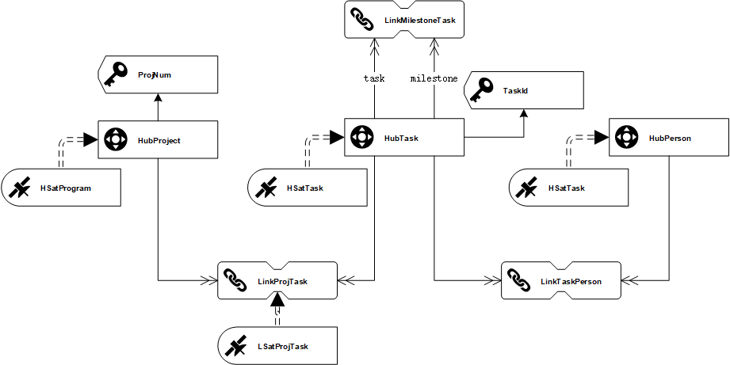

# MiniRun SQL脚本

## 1.StageArea

### plm_task

| Table    | Field          | Type   | key  | version |
| -------- | -------------- | ---- | ---- | ---- |
| plm_task | TaskID         | string | √    | 0.1   |
| plm_task | LoadDate       | bigint | √    | 0.1   |
| plm_task | TaskName       | string |      | 0.1    |
| plm_task | PlanStartAt    | bigint |      | 0.1    |
| plm_task | PlanEndAt      | bigint |      | 0.1    |
| plm_task | StartAt        | bigint |      | 0.1    |
| plm_task | EndAt          | bigint |      | 0.1    |
| plm_task | ProjectNum     | string |      | 0.1    |
| plm_task | ProjectName    | string |      | 0.1    |
| plm_task | PersonID | string |      | 0.2    |
| plm_task | Person | string |      |   0.2  |
| plm_task | Milestone | int |      |   0.2  |
| plm_task | RecordSource   | string |      | 0.1   |
| plm_task | HProjectHK     | string |      | 0.1   |
| plm_task | HTaskHK        | string |      | 0.1   |
| plm_task | LProjTaskHK    | string |      | 0.1   |
| plm_task | HSTaskHashDiff | string |      | 0.1   |
| plm_task | HPersonHK | string |      | 0.2 |
| plm_task | LTaskPersonHK | string |      | 0.2 |
| plm_task |  |  |      |      |
| plm_task |  |  |      |      |

#### create

```sql
create table stagearea.plm_task (
TaskID string ,
LoadDate bigint,
TaskName string,
PlanStartAt bigint,
PlanEndAt bigint,
StartAt bigint,
EndAt bigint,
ProjectNum string,
ProjectName string,
RecordSource string,
HProjectHK string,
HTaskHK string,
LProjTaskHK string,
HSTaskHashDiff string,
primary key(TaskID,LoadDate)
)
stored as kudu;
```

```sql
-- v0.2新增字段
alter table stagearea.plm_task
add columns (PersonName string,Personid string,Milestone int,HPersonHK string,LTaskPersonHK string);
alter table stagearea.plm_task change  person personname string;

```

#### load.v0.1

```sql
select 
taskid as taskid 
,taskname as taskname 
,UNIX_TIMESTAMP(planstartat) as planstartat 
,UNIX_TIMESTAMP(planendat) as planendat 
,UNIX_TIMESTAMP(startat) as startat 
,UNIX_TIMESTAMP(endat) as endat 
,projectnum as projectnum 
,projectname as projectname 
,UNIX_TIMESTAMP('${loaddate}') as loaddate
,'${http.param.sys}_${http.param.datascope}' as recordsource
,md5(taskid) as htaskhk
,md5(projectnum) as hprojecthk
,md5(concat_ws(';',projectnum,taskid)) as lprojtaskhk
,md5(concat_ws(';',taskid,taskname,planstartat,planendat,startat,endat)) as hstaskhashdiff
from ${http.query.param.datascope}
```

#### load.v0.2

```sql
select 
taskid as taskid 
,taskname as taskname 
,UNIX_TIMESTAMP(planstartat) as planstartat 
,UNIX_TIMESTAMP(planendat) as planendat 
,UNIX_TIMESTAMP(startat) as startat 
,UNIX_TIMESTAMP(endat) as endat 
,projectnum as projectnum 
,projectname as projectname 
-- v0.2新增字段
,person as personname
,personid as personid
,milestone as milestone
,md5(personid) as hpersonhk
,md5(concat_ws(';',taskid,personid)) as ltaskpersonhk
---
,UNIX_TIMESTAMP('${loaddate}') as loaddate
,'${http.param.sys}_${http.param.datascope}' as recordsource
,md5(taskid) as htaskhk
,md5(projectnum) as hprojecthk
,md5(concat_ws(';',projectnum,taskid)) as lprojtaskhk
,md5(concat_ws(';',taskid,taskname,planstartat,planendat,startat,endat)) as hstaskhashdiff
from ${http.query.param.datascope}
```


## 2.DataVault




### HubProject

| Table      | Field        | Type   | key  |version |
| ---------- | ------------ | ------ | ---- | ---- |
| HubProject | HProjectHK   | string | PK   |0.1|
| HubProject | LoadDate     | bigint |      |0.1|
| HubProject | RecordSource | string |      |0.1|
| HubProject | ProjectNum   | string | BK   |0.1|

#### create

```sql
create table RawDataVault.Hubproject (
	HProjectHK string,
    LoadDate bigint,
    RecordSource string,
    ProjectNum string,
    primary key(HProjectHK)
)
partition by Hash(HProjectHK)partitions 4
stored as kudu;
```

#### load

```sql
-- 指定数据插入的目标表
insert into RawDataVault.HubProject 
-- 从数据源选择目标表需要的字段，注意去重
select distinct stg.HProjectHK,stg.LoadDate,stg.RecordSource,stg.ProjectNum 
from stagearea.plm_task stg
-- 根据目标表的UK，筛选剔除不需要的记录
where stg.HProjectHK not in (select tgt.HProjectHK from RawDataVault.HubProject tgt)
and stg.loaddate=${loaddate};

```


### HSatProject

| Table       | Field        | Type   | key  | version |
| ----------- | ------------ | ------ | ---- | ------- |
| HSatProject | HProjectHK   | string | PK   | 0.1     |
| HSatProject | LoadDate     | bigint | PK   | 0.1     |
| HSatProject | LoadEndDate  | bigint |      | 0.1     |
| HSatProject | RecordSource | string |      | 0.1     |
| HSatProject | ProjectName  | string | UK   | 0.1     |

#### create

```SQL
create table RawDataVault.HSatProject (
	HProjectHK string,
    LoadDate bigint,
    LoadEndDate bigint,
    RecordSource string,
    ProjectName string,
    primary key (HProjectHK,LoadDate)
)
partition by Hash(HProjectHK) partitions 4,
Range (LoadDate) (
	-- 2018.10.01 00：00：00前
	partition 0<values<=1538323200,
	-- 2018.10.01 00：00：00 到 2018.12.31 23：59：59（2018第四季度）
    partition 1538323200<values<=1546271999,
	-- 2019第一季度
    partition 1546271999<values<=1554047999
)
stored as kudu;
-- 新增分区时可以使用以下语法：
-- ALTER TABLE HSatProject ADD RANGE PARTITION 1554047999<VALUES<=${后续分区时间节点};
```

#### load

```sql
-- 指定数据插入的目标表
insert into rawdatavault.hsatproject
-- 从数据源选择目标表需要的字段，注意去重
select distinct stg.hprojecthk,stg.loaddate,null,stg.recordsource,stg.projectname
from stagearea.plm_task stg 
-- 以下脚本是为了筛选出Delta记录（即新增及存在更新的记录），由于HashDiff只反应负载数据(payload)不能仅仅通过HashDiff去判断是否为Delta记录。 本处处理逻辑为：通过依赖键来关联stg跟tgt，剔除loadenddate不为空（即已失效的记录），并通过限定HashDiff不相等来保证是更新/新增的记录
left outer join rawdatavault.hsatproject tgt
on (stg.hprojecthk=tgt.hprojecthk and tgt.loadenddate is null)
where (nvl(stg.projectname,'')!=nvl(tgt.projectname,''))
and stg.loaddate=${loaddate};

```

#### enddating

```sql
UPDATE tgt
SET tgt.loadenddate= src.loadenddate
FROM rawdatavault.${sat} tgt
LEFT JOIN
  (SELECT el.${sathk} AS ${sathk},
          el.loaddate AS loaddate,
          min(lt.loaddate)-1 AS loadenddate
   FROM rawdatavault.${sat} el
   LEFT JOIN rawdatavault.${sat} lt ON (el.${sathk}=lt.${sathk}
                            AND el.loaddate<lt.loaddate)
   GROUP BY el.${sathk},
            el.loaddate) src ON tgt.${sathk}=src.${sathk}
AND tgt.loaddate=src.loaddate


-- ${sat}=hsatproject ${sathk}=hprojecthk
```


### HubTask

| Table   | Field        | Type   | key  | version |
| ------- | ------------ | ------ | ---- | ------- |
| HubTask | HTaskHK      | string | PK   | 0.1     |
| HubTask | LoadDate     | bigint |      | 0.1     |
| HubTask | RecordSource | string |      | 0.1     |
| HubTask | TaskID       | string | BK   | 0.1     |

#### create

```sql
create table RawDataVault.HubTask (
	HTaskHK string,
    LoadDate bigint,
    RecordSource string,
    TaskID string,
    primary key(HTaskHK)
)
partition by Hash(HTaskHK) partitions 4
stored as kudu;
```

#### load

```sql
-- 指定数据插入的目标表
insert into rawdatavault.hubtask
-- 从数据源选择目标表需要的字段，注意去重
select distinct stg.htaskhk,stg.loaddate,stg.recordsource,stg.taskid
from stagearea.plm_task stg
-- 根据目标表的UK，筛选剔除不需要的记录
where stg.htaskhk not in(select tgt.htaskhk from rawdatavault.hubtask tgt )
and stg.loaddate=${loaddate}
```


### HSatTask

| Table    | Field          | Type   | key  | version |
| -------- | -------------- | ------ | ---- | ------- |
| HSatTask | HTaskHK        | string | PK   | 0.1     |
| HSatTask | LoadDate       | bigint | PK   | 0.1     |
| HSatTask | LoadEndDate    | bigint |      | 0.1     |
| HSatTask | RecordSource   | string |      | 0.1     |
| HSatTask | TaskName       | string | PL    | 0.1     |
| HSatTask | PlanStartAt    | bigint | PL    | 0.1     |
| HSatTask | PlanEndAt      | bigint | PL    | 0.1     |
| HSatTask | StartAt        | bigint | PL    | 0.1     |
| HSatTask | EndAt          | bigint | PL    | 0.1     |
| HSatTask | HSTaskHashDiff | string | UK   | 0.1     |
| HSatTask | Milestone      | string | PL   |         |

#### create

```sql
create table RawDataVault.HSatTask(
	HTaskHK string,
    LoadDate bigint,
    LoadEndDate bigint,
    RecordSource string,
    TaskName string,
    PlanStartAt bigint,
    PlanEndAt bigint,
    StartAt bigint,
    EndAt bigint,
    HSTaskHashDiff string,
    primary key(HTaskHK,LoadDate)
)
partition by Hash(HTaskHK) partitions 4,
Range (LoadDate) (
	-- 2018.10.01 00：00：00前
	partition 0<values<=1538323200,
	-- 2018.10.01 00：00：00 到 2018.12.31 23：59：59（2018第四季度）
    partition 1538323200<values<=1546271999,
	-- 2019第一季度
    partition 1546271999<values<=1554047999
)
stored as kudu;
-- 新增分区时可以使用以下语法：
-- ALTER TABLE HSatTask ADD RANGE PARTITION 1554047999<VALUES<=${后续分区时间节点};
```

```sql
-- ALTER TABLE HSatTask drop  Milestone;
alter table HSatTask add columns (Milestone int);

```


#### load

```sql
-- 指定数据插入的目标表
insert into rawdatavault.hsattask
-- 从数据源选择目标表需要的字段，注意去重
select distinct stg.HTaskHK,stg.LoadDate,null,stg.recordsource,stg.TaskName,stg.PlanStartAt,stg.PlanEndAt,stg.StartAt,stg.EndAt,stg.HSTaskHashDiff,stg.milestone 
from stagearea.plm_task stg 
-- 以下脚本是为了筛选出Delta记录（即新增及存在更新的记录），由于HashDiff只反应负载数据(payload)不能仅仅通过HashDiff去判断是否为Delta记录。 本处处理逻辑为：通过依赖键来关联stg跟tgt，剔除loadenddate不为空（即已失效的记录），并通过限定HashDiff不相等来保证是更新/新增的记录
left outer join rawdatavault.hsattask tgt
on (stg.HTaskHK=tgt.HTaskHK and tgt.loadenddate is null)
where (nvl(stg.HSTaskHashDiff,'')!=nvl(tgt.HSTaskHashDiff,''))
and stg.loaddate=${loaddate};

```

#### enddating

```sql
UPDATE tgt
SET tgt.loadenddate= src.loadenddate
FROM rawdatavault.${sat} tgt
LEFT JOIN
  (SELECT el.${sathk} AS ${sathk},
          el.loaddate AS loaddate,
          min(lt.loaddate)-1 AS loadenddate
   FROM rawdatavault.${sat} el
   LEFT JOIN rawdatavault.${sat} lt ON (el.${sathk}=lt.${sathk}
                            AND el.loaddate<lt.loaddate)
   GROUP BY el.${sathk},
            el.loaddate) src ON tgt.${sathk}=src.${sathk}
AND tgt.loaddate=src.loaddate


-- ${sat}=hsattask ${sathk}=htaskhk
```


### LinkProjTask

| Table        | Field        | Type   | key  |
| ------------ | ------------ | ------ | ---- |
| LinkProjTask | LProjTaskHK  | string | PK   |
| LinkProjTask | LoadDate     | bigint |      |
| LinkProjTask | RecordSource | string |      |
| LinkProjTask | HProjectHK   | string | UK   |
| LinkProjTask | HTaskHK      | string | UK   |

#### create

```sql
create table RawDataVault.LinkProjTask(
	LProjTaskHK string,
    LoadDate bigint,
    RecordSource string,
    HProjectHK string,
    HTaskHK string,
    primary key(LProjTaskHK)
)
partition by Hash(LProjTaskHK) partitions 4
stored as kudu;
```

#### load

```sql
insert into rawdatavault.linkprojtask
select distinct stg.lprojtaskhk,stg.loaddate,stg.recordsource,stg.hprojecthk,stg.htaskhk
from stagearea.plm_task stg 
where not exists (select 1 from rawdatavault.linkprojtask tgt where tgt.lprojtaskhk=stg.hprojecthk and tgt.htaskhk = stg.htaskhk)
and loaddate = ${loaddate};

```


### HubPerson

| Table     | Field        | Type   | key  | version |
| --------- | ------------ | ------ | ---- | ------- |
| HubPerson | HPersonHK    | string | PK   | 0.2     |
| HubPerson | LoadDate     | bigint |      | 0.2     |
| HubPerson | RecordSource | string |      | 0.2     |
| HubPerson | PersonID     | String | UK   | 0.2     |

#### create

```sql
create table RawDataVault.HubPerson(
	HPersonHK string,
    LoadDate bigint,
    RecordSource string,
    PersonID string,
    primary key(HPersonHK)
)partition by Hash(HPersonHK) partitions 4
stored as kudu;
```

#### load

```sql
-- 指定数据插入的目标表
insert into RawDataVault.HubPerson 
-- 从数据源选择目标表需要的字段，注意去重
select distinct stg.HPersonHK,stg.LoadDate,stg.RecordSource,stg.PersonID 
from stagearea.plm_task stg
-- 根据目标表的UK，筛选剔除不需要的记录
where stg.HPersonHK not in (select tgt.HPersonHK from RawDataVault.HubPerson tgt)
and stg.loaddate=${loaddate};

```


### HSatPerson

| Table      | Field        | Type   | key  |version |
| ---------- | ------------ | ------ | ---- |
| HSatPerson | HPersonHK    | string | PK   |0.2     |
| HSatPerson | LoadDate     | bigint | PK   |0.2     |
| HSatPerson | LoadEndDate     | bigint | PK   |0.2     |
| HSatPerson | RecordSource | string |      |0.2     |
| HSatPerson | PersonName   | string | PL   |0.2     |

#### create

```sql
create table RawDataVault.HSatPerson(
	HPersonHK string,
    LoadDate bigint,
    LoadEndDate bigint,
    RecordSource string,
    PersonName string,
    primary key(HPersonHK,LoadDate)
)
partition by Hash(HPersonHK) partitions 4,
Range (LoadDate) (
	-- 2018.10.01 00：00：00前
	partition 0<values<=1538323200,
	-- 2018.10.01 00：00：00 到 2018.12.31 23：59：59（2018第四季度）
    partition 1538323200<values<=1546271999,
	-- 2019第一季度
    partition 1546271999<values<=1554047999
)
stored as kudu;
-- 新增分区时可以使用以下语法：
-- ALTER TABLE HSatTask ADD RANGE PARTITION 1554047999<VALUES<=${后续分区时间节点};
```

#### load

```sql
-- 指定数据插入的目标表
insert into rawdatavault.HSatPerson
-- 从数据源选择目标表需要的字段，注意去重
select distinct stg.HPersonHK,stg.LoadDate,null,stg.recordsource,stg.PersonName 
from stagearea.plm_task stg 
-- 以下脚本是为了筛选出Delta记录（即新增及存在更新的记录），由于HashDiff只反应负载数据(payload)不能仅仅通过HashDiff去判断是否为Delta记录。 本处处理逻辑为：通过依赖键来关联stg跟tgt，剔除loadenddate不为空（即已失效的记录），并通过限定HashDiff不相等来保证是更新/新增的记录
left outer join rawdatavault.HSatPerson tgt
on (stg.HPersonHK=tgt.HPersonHK and tgt.loadenddate is null)
where (nvl(stg.PersonName,'')!=nvl(tgt.PersonName,''))
and stg.loaddate=${loaddate};

```

#### enddating

```sql
UPDATE tgt
SET tgt.loadenddate= src.loadenddate
FROM rawdatavault.hsatperson tgt
LEFT JOIN
  (SELECT el.hpersonhk AS hpersonhk,
          el.loaddate AS loaddate,
          min(lt.loaddate)-1 AS loadenddate
   FROM rawdatavault.hsatperson el
   LEFT JOIN rawdatavault.hsatperson lt ON (el.hpersonhk=lt.hpersonhk
                            AND el.loaddate<lt.loaddate)
   GROUP BY el.hpersonhk,
            el.loaddate) src ON tgt.hpersonhk=src.hpersonhk
AND tgt.loaddate=src.loaddate
```


### LinkTaskPerson

| Table          | Field         | Type   | key  |version |
| -------------- | ------------- | ------ | ---- |
| LinkTaskPerson | LTaskPersonHK | string | PK   |0.2     |
| LinkTaskPerson | LoadDate      | bigint |      |0.2     |
| LinkTaskPerson | RecordSource  | string |      |0.2     |
| LinkTaskPerson | HTaskHK       | string | UK   |0.2     |
| LinkTaskPerson | HPersonHK     | string | UK   |0.2     |

#### create

```sql
create table RawDataVault.LinkTaskPerson(
	LTaskPersonHK string,
    LoadDate bigint,
    RecordSource string,
    HTaskHK string,
    HPersonHK string,
    primary key(LTaskPersonHK)
)
partition by Hash(LTaskPersonHK) partitions 4
stored as kudu;
```

#### load

```sql
insert into rawdatavault.LinkTaskPerson
select distinct stg.LTaskPersonHK,stg.loaddate,stg.recordsource,stg.HTaskHK,stg.HPersonHK
from stagearea.plm_task stg 
where not exists (select 1 from rawdatavault.LinkTaskPerson tgt where tgt.HTaskHK=stg.HTaskHK and tgt.HPersonHK = stg.HPersonHK)
and loaddate = ${loaddate};

```


### RefDate

#### create

```sql
create table rawdatavault.RefDate(
	DateKey string,
    unixtime bigint,
    year int,
    month int,
    day int,
    yearweek int,
    weekday int,
    primary key(DateKey,unixtime)
)partition by Range(unixtime)(
	-- 2018.10.01 00：00：00前
	partition 0<values<=1538323200,
	-- 2018.10.01 00：00：00 到 2018.12.31 23：59：59（2018第四季度）
    partition 1538323200<values<=1546271999,
	-- 2019第一季度
    partition 1546271999<values<=1554047999,
    partition 1554047999< values
)
stored as kudu;
```


#### load

```sql
select 
DateKey as datekey
,unixtime as unixtime
,year as year
,month as month 
,day as day
,yearweek as yearweek
,weekday as weekday
from dv.DateRef
```

#### MasterData

```sql
insert into DateRef 
select 
d.datevalue,
DATE_FORMAT(d.datevalue,'%Y-%m-%d'),
DATE_FORMAT(d.datevalue,'%Y'),
DATE_FORMAT(d.datevalue,'%m'),
DATE_FORMAT(d.datevalue,'%d'),
DATE_FORMAT(d.datevalue,'%X%U'),
DATE_FORMAT(d.datevalue,'%w'),
UNIX_TIMESTAMP(datevalue)
from DateValue d
```


## 3.Truncate StagingTable

stagearea.plm_task

```sql
delete stg from stagearea.plm_task stg where stg.loaddate=${loaddate}
```


## 4.BizVault

### BrTask

#### create

```sql
create table bizVault.br_task (
	SnapshotDate bigint,
    HProjectHK string,
    HTaskHK string,
    HPersonHK string,
    RecordSource string,
    primary key(SnapshotDate,HProjectHK,HTaskHK,HPersonHK)
)partition by Hash(HProjectHK,HTaskHK,HPersonHK)partitions 6,
range(SnapshotDate)(
	-- 2018.10.01 00：00：00前
	partition 0<values<=1538323200,
	-- 2018.10.01 00：00：00 到 2018.12.31 23：59：59（2018第四季度）
    partition 1538323200<values<=1546271999,
	-- 2019第一季度
    partition 1546271999<values<=1554047999
)
stored as kudu;
```


#### load

```sql
insert into bizVault.br_task
select 
	${loaddate}as snapshotdate
	-- lpt.loaddate as snapshotdate
	,lpt.hprojecthk as hprojecthk
	,lpt.htaskhk as htaskhk
	,ltp.hpersonhk as hpersonhk
	,'system'as recordsource

from 
	rawdatavault.linkprojtask lpt,
	rawdatavault.linktaskperson ltp
where 
	lpt.htaskhk=ltp.htaskhk
	and not exists (
    	select 1 
        from bizVault.br_task tgt
        where 
        	lpt.hprojecthk = tgt.hprojecthk
        	and lpt.htaskhk=tgt.htaskhk
        	and ltp.hpersonhk=tgt.hpersonhk    
    )
```


## 5.InformationMart
### Fact_Task

```sql
drop view if exists plm_datamart.fact_task；
Create view plm_datamart.fact_task as
Select 
	br.htaskhk as TaskKey
	,br.hprojecthk as ProjectKey
	,br.hpersonhk as PersonKey
	,tsk.TaskName 
    ,from_unixtime(tsk.PlanStartAt,'yyyy-MM-dd') as PSDateKey
    ,from_unixtime(tsk.PlanEndAt,'yyyy-MM-dd') as PEDateKey
    ,from_unixtime(tsk.StartAt,'yyyy-MM-dd') as SDateKey
    ,from_unixtime(tsk.EndAt,'yyyy-MM-dd') as EDateKey
	,from_unixtime(tsk.PlanStartAt) as  PlanStartAt  
	,from_unixtime(tsk.PlanEndAt) as PlanEndAt    
	,from_unixtime(tsk.StartAt) as StartAt      
	,from_unixtime(tsk.EndAt) as EndAt        
	,tsk.Milestone 
	-- 计算任务完成率所需指标
	,if(tsk.EndAt IS NOT NULL, 1, 0) completed
	-- 计算任务/里程碑剩余天数
	,(tsk.PlanEndAt - unix_timestamp(now()))/(60*60*24) as RemainDays
	--延期任务(如果未完成，则比较是否延期.如果已完成，则不再追究是否延期)
	,if(tsk.EndAt IS NOT NULL, 0, if(tsk.PlanEndAt < unix_timestamp(now()), 1, 0)) as delay
	--历史延期任务(如果已完成，则比较计划完成<完成时间=延误。 如果未完成，则比较计划完成时间< 当前时间=已延误)
	,if(tsk.EndAt IS NOT NULL,  if(tsk.PlanEndAt < tsk.EndAt, 1, 0), if(tsk.PlanEndAt < unix_timestamp(now()), 1, 0)) as delayhistory
from 
	bizVault.br_task br,
	rawdatavault.hsattask tsk
where br.htaskhk=tsk.htaskhk
and tsk.loadenddate is null ;

```

### DimProject

```sql
drop view if exists plm_datamart.dim_project;
create view plm_datamart.dim_project as
select 
	proj.HProjecthk as ProjectKey
	,proj.ProjectName as ProjectName
from rawdatavault.HSatProject proj
where proj.loadenddate is null ;

```

### DimPerson

```sql
drop view if exists plm_datamart.dim_person;
create view plm_datamart.dim_person as
select 
	psn.HPersonhk as PersonKey
	,psn.PersonName as PersonName
from rawdatavault.HSatPerson psn
where psn.loadenddate is null ;
```

### DimDate

```sql
drop view if exists plm_datamart.dim_date;
create view plm_datamart.dim_date as
select 	
	DateKey as DateKey,
    ,unixtime as unixtime,
    ,year as year
    ,month as month
    ,day as day
    ,yearweek as yearweek
    ,weekday as weekday
from rawdatavault.RefDate

```


## 6.SQL for KPI

[KpiSqlMap](./assets/KpiSqlMap.sql)

### 6.1 TCR(Task Completion Rate)

```sql
select 
	dimprj.ProjectName as data_code
	,from_timestamp(now(),'yyyy-MM-dd') as data_time
	,'TCR' as date_type
	,(sum(fact.completed)/count(fact.completed)) as data_value
from 
	plm_datamart.fact_task fact
	,plm_datamart.dim_project dimprj
where 
	fact.ProjectKey = dimprj.ProjectKey
	and fact.milestone = 0
group by 
	dimprj.ProjectName
```


### 6.2 MSRD(MileStoneRemainDays)

```sql
select
	fact.TaskName
	,fact.taskname as milestoneName
	,fact.remaindays as remaindays
from 
	plm_datamart.fact_task fact
	and plm_datamart.dim_project proj
where 
	fact.ProjectKey=proj.ProjectKey
	and fact.milestone = 1
	and remaindays >= 0
order by fact.PEDateKey

```


### 6.3.PEP(PlanExecutionProgress)

```sql
select 
	dt.datekey
	,count(fact.PlanEndAt) as plancnt
	,sum(fact.completed)as completed
from 
	plm_datamart.fact_task fact
	,plm_datamart.dim_date dt
where 
	fact.PEDateKey = dt.DateKey
	and fact.milestone = 0
group by 
	dt.datekey
order by
	dt.datekey
```


### 6.4.TD(TaskDelayWithoutCompletedTask)

```sql
select 
	proj.ProjectName 
	,dt.DateKey
	,psn.PersonName
	,sum(fact.Delay)
from 
	plm_datamart.fact_task fact
	,plm_datamart.dim_project proj
	,plm_datamart.dim_date dt
	,plm_datamart.dim_person psn
where 
	fact.ProjectKey = proj.ProjectKey
	and fact.PEDateKey=dt.DateKey
	and fact.PersonKey=psn.PersonKey
	and fact.milestone=0
	and fact.delay=1
group by 
	proj.ProjectName,dt.DateKey,psn.PersonName
order by dt.DateKey
```


### 6.5.TDH(TaskDelayHistory)

```sql
select 
	proj.ProjectName 
	,dt.DateKey
	,psn.PersonName
	,sum(fact.DelayHistory)
from 
	plm_datamart.fact_task fact
	,plm_datamart.dim_project proj
	,plm_datamart.dim_date dt
	,plm_datamart.dim_person psn
where 
	fact.ProjectKey = proj.ProjectKey
	and fact.PEDateKey=dt.DateKey
	and fact.PersonKey=psn.PersonKey
	and fact.milestone=0
	and fact.DelayHistory=1
group by 
	proj.ProjectName,dt.DateKey,psn.PersonName
order by dt.DateKey
```


## 7.Superset


## 8.附件列表

ESB主数据配置：源数据资源路径 ：[zeus.ResourceLocation.sql](./assets/zeus.ResourceLocation.sql)
数据仓库：日期维度引用主数据[dv.DateRef.sql](./assets/dv.DateRef.sql)
数据仓库：Minirun任务数据中间表[dv.task.sql](./assets/dv.task.sql)
ESB主数据配置：PKI对应SQL脚本映射表 ：[zeus.KpiSqlMap.sql](./assets/zeus.KpiSqlMap.sql)

