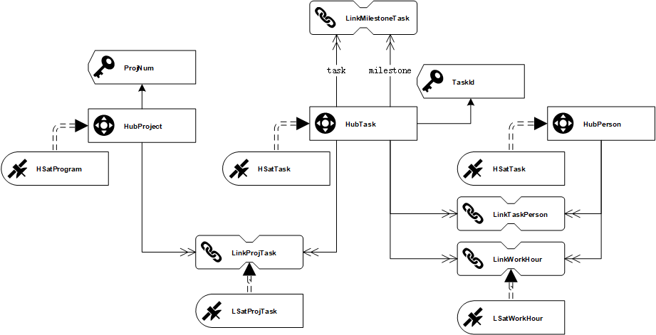

## 0.DataVault模型更新



## 1.数据源获取

### 1.1.mysql中间表设计

```SQL
/*
Navicat MySQL Data Transfer

Source Server         : mysql@gateway001
Source Server Version : 50723
Source Host           : 47.96.97.244:3306
Source Database       : dv

Target Server Type    : MYSQL
Target Server Version : 50723
File Encoding         : 65001

Date: 2019-01-28 14:46:57
*/

SET FOREIGN_KEY_CHECKS=0;

-- ----------------------------
-- Table structure for manhour
-- ----------------------------
DROP TABLE IF EXISTS `manhour`;
CREATE TABLE `manhour` (
  `PROJECT_NAME` varchar(255) DEFAULT NULL,
  `MY_NAME` varchar(255) DEFAULT NULL,
  `WORKING_DATE` datetime DEFAULT NULL,
  `PROJECT_TIME` double(6,1) DEFAULT NULL,
  `PROJECT_TYPE` varchar(255) DEFAULT NULL,
  `PROJECT_PRODUCT` varchar(255) DEFAULT NULL,
  `PROJECT_CUSTOMER` varchar(255) DEFAULT NULL,
  `loaddate` varchar(255) DEFAULT NULL
) ENGINE=InnoDB DEFAULT CHARSET=utf8;

```


### 1.2.manhour schema

#### raw

```json
{
	"type": "record",
	"name": "manhour",
	"namespace": "any.data",
	"fields": [
		{
			"name": "PROJECT_NAME",
			"type": [
				"null",
				"string"
			]
		},
		{
			"name": "MY_NAME",
			"type": [
				"null",
				"string"
			]
		},
		{
			"name": "WORKING_DATE",
			"type": [
				"null",
				"string"
			]
		},
		{
			"name": "PROJECT_TIME",
			"type": [
				"null",
				"double"
			]
		},
		{
			"name": "PROJECT_TYPE",
			"type": [
				"null",
				"string"
			]
		},
		{
			"name": "PROJECT_PRODUCT",
			"type": [
				"null",
				"string"
			]
		},
		{
			"name": "PROJECT_CUSTOMER",
			"type": [
				"null",
				"string"
			]
		}
	]
}
```

#### load

```json
{
	"type": "record",
	"name": "manhour",
	"namespace": "any.data",
	"fields": [
		{
			"name": "PROJECT_NAME",
			"type": [
				"null",
				"string"
			]
		},
		{
			"name": "MY_NAME",
			"type": [
				"null",
				"string"
			]
		},
		{
			"name": "WORKING_DATE",
			"type": [
				"null",
				"string"
			]
		},
		{
			"name": "PROJECT_TIME",
			"type": [
				"null",
				"double"
			]
		},
		{
			"name": "PROJECT_TYPE",
			"type": [
				"null",
				"string"
			]
		},
		{
			"name": "PROJECT_PRODUCT",
			"type": [
				"null",
				"string"
			]
		},
		{
			"name": "PROJECT_CUSTOMER",
			"type": [
				"null",
				"string"
			]
		},
		{
			"name": "loaddate",
			"type": [
				"null",
				"string"
			]
		}
	]
}
```


## 2.mysql中间层配置

### 2.1.资源地址

[ResourceLocation.sql](./assets/ResourceLocation-20190128.sql)


## 3.StageArea新增内容

### 3.1.plm_manhour

| Table        | Field        | Type   | key  |
| ------------ | ------------ | ------ | ---- |
| plm_manhour | ManhourHK         | string | PK   |
| plm_manhour | loaddate     | bigint | PK   |
| plm_manhour | RecordSource     | string | PK   |
| plm_manhour | PROJECT_NAME         | string | BK   |
| plm_manhour | MY_NAME       | string |  BK    |
| plm_manhour | WORKING_DATE  | string |  BK    |
| plm_manhour | PROJECT_TIME      | string |      |
| plm_manhour | PROJECT_TYPE    | string |      |
| plm_manhour | PROJECT_PRODUCT  | string |      |
| plm_manhour | PROJECT_CUSTOMER | string |      |


#### create

```sql
create table stagearea.plm_manhour(
	ManhourHK string,
    loaddate bigint,
    RecordSource string,
    ProjectName string,
    MyName string,
    WorkingDate bigint,
    ProjectTime float,
    ProjectType string,
    ProjectProduct string,
    ProjectCustomer string,
    HSManhourhashdiff string,
    primary key(ManhourHK,loaddate)
) stored as kudu;
```

#### load

```sql
select 
md5(concat_ws(';',project_name,my_name,unix_timestamp(working_date))) as  manhourhk
	,loaddate as loaddate
	,project_name as projectname
	,my_name as myname
	,unix_timestamp(working_date) as workingdate
	,project_time as projecttime
	,project_type as projecttype
	,project_product as projectproduct
	,project_customer as projectcustomer
	,md5(concat_ws(';','arasplm.manhour',project_time,project_type,project_product,project_customer)) as hsmanhourhashdiff
	,'arasplm.manhour' as recordsource
from dv.manhour
```


## 4.DataVault新增内容

### 4.1 HubManhour

| Table         | Field                            | Type   | key  |
| ------------- | -------------------------------- | ------ | ---- |
| HubManhour | ManhourHK（md5(tsk+psn+whid）) | string | PK   |
| HubManhour | loaddate                         | bigint |      |
| HubManhour | RecordSource                     | string |      |
| HubManhour | ProjectName                          | string | UK   |
| HubManhour | MyName                        | string | UK   |
| HubManhour | WorkingDate                             | string | UK   |

#### create

```sql
create table rawdatavault.HubManhour(
	ManhourHK string
    ,loaddate bigint
    ,RecordSource string
    ,ProjectName string
    ,MyName string
    ,WorkingDate bigint
    ,primary key (ManhourHK)
) partition by Hash(ManhourHK)partitions 4 
stored as kudu;
```

#### load

```sql
insert into rawdatavault.HubManhour
select distinct stg.ManhourHK,stg.loaddate,stg.recordsource,stg.ProjectName,stg.MyName,stg.WorkingDate
from stagearea.plm_manhour stg 
where not exists (select 1 from rawdatavault.HubManhour tgt where tgt.ProjectName=stg.ProjectName and tgt.MyName = stg.MyName and tgt.WorkingDate = stg.WorkingDate)
and loaddate = ${loaddate};
```

### 4.2 HSatManhour

| Table         | Field        | Type   | key  |
| ------------- | ------------ | ------ | ---- |
| HSatWorkhour | ManhourHK  | string | PK   |
| HSatWorkhour | loaddate     | bigint | PK   |
| HSatWorkhour | loadenddate  | bigint |      |
| HSatWorkhour | RecordSource | string |  PL    |
| HSatWorkhour | ProjectTime     | float  | PL   |
| HSatWorkhour | ProjectType     | string  | PL   |
| HSatWorkhour | ProjectProduct     | string  | PL   |
| HSatWorkhour | ProjectCustomer     | string  | PL   |
| HSatWorkhour | HSManhourhashdiff     | string  | HashDiff   |

#### create

```sql
create table rawdatavault.HSatManhour(
	ManhourHK string
    ,loaddate bigint
    ,loadenddate bigint
    ,RecordSource string
    ,ProjectTime float
    ,ProjectType string
    ,ProjectProduct string
    ,ProjectCustomer string
    ,HSManhourhashdiff string
    ,primary key (ManhourHK,loaddate)
) partition by Hash(ManhourHK)partitions 4,
Range (LoadDate) (
	-- 2018.10.01 00：00：00前
	partition 0<values<=1538323200,
	-- 2018.10.01 00：00：00 到 2018.12.31 23：59：59（2018第四季度）
    partition 1538323200<values<=1546271999,
	-- 2019第一季度
    partition 1546271999<values<=1554047999
)
stored as kudu;
-- 新增分区时可以使用以下语法：
-- ALTER TABLE HSatTask ADD RANGE PARTITION 1554047999<VALUES<=${后续分区时间节点}; 
```

#### load

```sql
-- 指定数据插入的目标表
insert into rawdatavault.HSatManhour
-- 从数据源选择目标表需要的字段，注意去重
select distinct stg.ManhourHK,stg.LoadDate,null,stg.recordsource,stg.ProjectTime,stg.ProjectType,stg.ProjectProduct,stg.ProjectCustomer,stg.HSManhourhashdiff 
from stagearea.plm_manhour stg 
-- 以下脚本是为了筛选出Delta记录（即新增及存在更新的记录），由于HashDiff只反应负载数据(payload)不能仅仅通过HashDiff去判断是否为Delta记录。 本处处理逻辑为：通过依赖键来关联stg跟tgt，剔除loadenddate不为空（即已失效的记录），并通过限定HashDiff不相等来保证是更新/新增的记录
left outer join rawdatavault.HSatManhour tgt
on (stg.ManhourHK=tgt.ManhourHK and tgt.loadenddate is null)
where (nvl(stg.HSManhourhashdiff,'')!=nvl(tgt.HSManhourhashdiff,''))
and stg.loaddate=${loaddate};

```
#### truncate
```SQL
delete stg from stagearea.plm_manhour stg where stg.loaddate=${loaddate}
```


#### enddating

```sql
UPDATE tgt
SET tgt.loadenddate= src.loadenddate
FROM rawdatavault.HSatManhour tgt
LEFT JOIN
  (SELECT el.ManhourHK AS ManhourHK,
          el.loaddate AS loaddate,
          min(lt.loaddate)-1 AS loadenddate
   FROM rawdatavault.HSatManhour el
   LEFT JOIN rawdatavault.HSatManhour lt ON (el.ManhourHK=lt.ManhourHK
                            AND el.loaddate<lt.loaddate)
   GROUP BY el.ManhourHK,
            el.loaddate) src ON tgt.ManhourHK=src.ManhourHK
AND tgt.loaddate=src.loaddate


-- ${sat}=hsattask ${sathk}=htaskhk
```


## 5.BusinessVault
不需要

## 6.InformationMart新增内容

### 6.1.fact_manhour

```sql
create view plm_datamart.fact_manhour as 
select 
	sat.projecttype as type,
	sat.projectproduct as product,
	sat.projectcustomer as customer, 
	hub.projectname as project,
	hub.myname as person,
	from_unixtime(hub.workingdate + 8*60*60) as dt,
	sat.projecttime as workhour
from rawdatavault.HubManhour hub , rawdatavault.hsatmanhour sat 
where hub.manhourHK=sat.manhourHK 
and sat.loadenddate is null 
and hub.projectname is not null;
```

